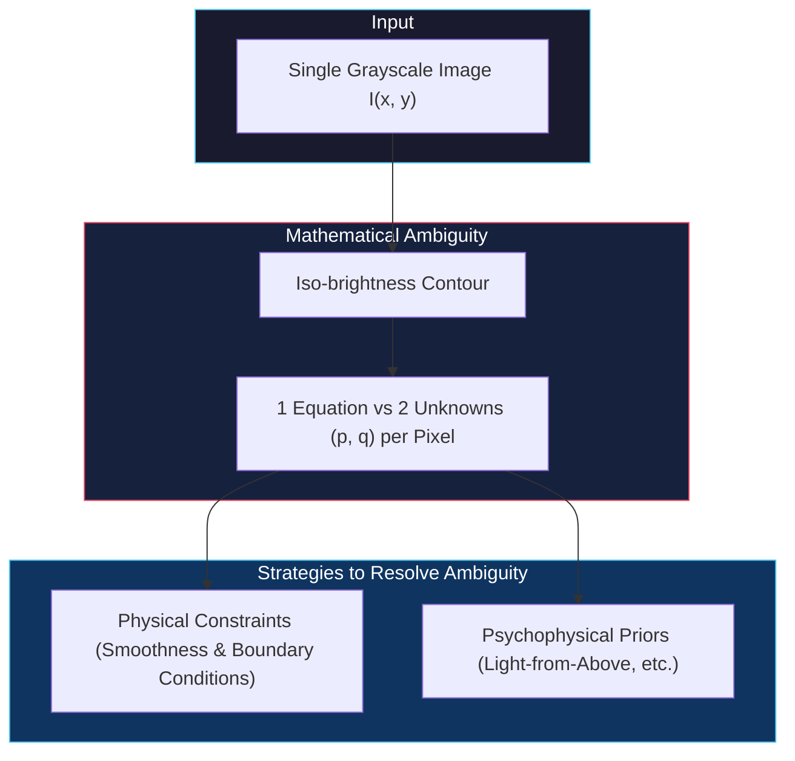
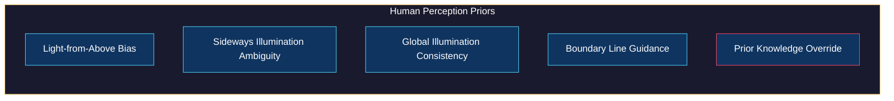
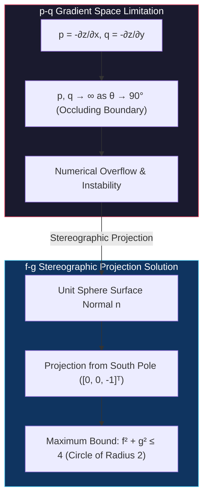
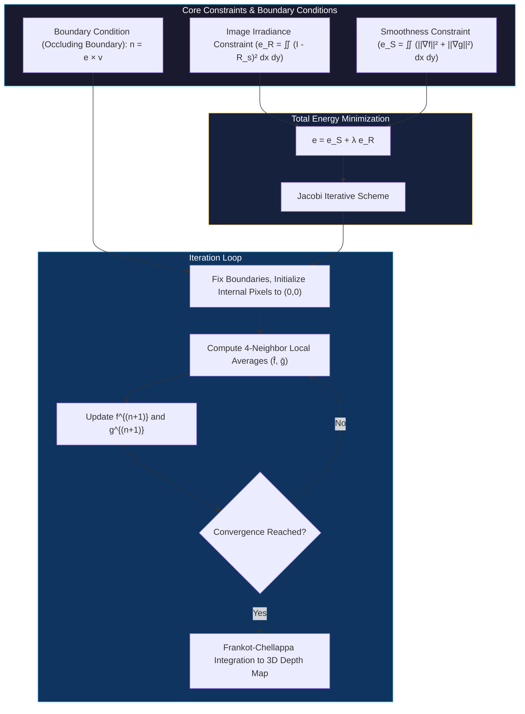

# Shape from Shading

<!-- toc -->

## 1. Overview and Core Classification

One of the most fundamental problems in computer vision, **Shape from Shading (SfS)**, aims to recover the 3D surface geometry (surface normals or depth map) of objects in a scene from a single monochromatic (grayscale) image.

<figure style="display:flex; justify-content: center; margin: 20px 0;">
  

    
    <figcaption style="margin-top: 0.5em; text-align: center; font-size: 13px; color: #888;"><em>Figure 1: Classic benchmark objects (Vase, Stanford Bunny, David Bust) used for 3D surface shape recovery from a single shaded image.</em></figcaption>
  

</figure>

> **Key Insight:** While Photometric Stereo requires multiple images taken under varying illumination sources, Shape from Shading attempts 3D reconstruction from a **single image**. This renders the problem physically and mathematically **severely under-constrained**.

### 1.1 Mathematical Under-Constrained Problem

Assume we fully know the reflectance properties (BRDF) of a homogeneous material in the scene, as well as the light source direction ($\mathbf{s}$) and brightness. In this case, we can construct a **Reflectance Map ($R(p, q)$)** that gives the theoretical brightness at a camera pixel for any surface normal orientation (i.e., $p-q$ gradient).

<figure style="display:flex; justify-content: center; margin: 20px 0;">
  

    
    <figcaption style="margin-top: 0.5em; text-align: center; font-size: 13px; color: #888;"><em>Figure 2: For a measured pixel intensity I(x,y), the Reflectance Map R(p,q) yields a continuous iso-brightness contour containing infinite candidate surface normal orientations.</em></figcaption>
  

</figure>

However, reversing this physical process—inferring the surface normal orientation ($p, q$) at a point from a single measured pixel intensity ($I(x,y)$)—is mathematically impossible:

1. **Iso-Brightness Contour:** In the reflectance map, points that equal the measured brightness ($I$) form a continuous curve called the iso-brightness contour.
2. **Infinite Candidate Normals:** Infinite candidate surface normals ($p, q$ gradients) along this contour yield the exact same pixel intensity.
3. **Under-Constrained System:** Having a single equation per pixel ($I(x,y) = R(p,q)$) with two independent unknown variables ($p$ and $q$) makes the problem severely under-constrained.

### 1.2 Strategy to Resolve Ambiguity

To overcome this infinite orientation ambiguity and reach a unique, stable geometric solution, two primary approaches are adopted:

* **Physical / Mathematical Constraints:** Assuming pixels cannot move independently, smoothness constraints and known boundary conditions are integrated into the scene.
* **Psychophysical Priors:** Analyzing how the human visual system resolves this ambiguity in milliseconds to formalize human visual heuristics into mathematical rules.

---

## 2. Human Perception of Shading

When viewing a single shaded photograph, the human visual system instantly perceives the object's contours and 3D structure. The brain utilizes powerful prior assumptions about the physical world to resolve optical ambiguities.

### 2.1 Light from Above Bias

Derived from natural light sources (the sun and sky) always residing overhead, the human brain assumes light always emanates from top to bottom.

<figure style="display:flex; justify-content: center; margin: 20px 0;">
  

    
    <figcaption style="margin-top: 0.5em; text-align: center; font-size: 13px; color: #888;"><em>Figure 3: Light-from-Above bias. Top-bright/bottom-shaded shapes are perceived as convex (bumps), whereas bottom-bright/top-shaded shapes are perceived as concave (holes).</em></figcaption>
  

</figure>

* **Bumps vs. Concavities:** If a circular shape on a panel is bright at the top and shaded at the bottom, the brain perceives it as convex (bump). If the bottom is bright and top shaded, it is interpreted as concave (hole).
* **Mound vs. Crater Illusion:** Rotating a photograph of a hill with a deep crater by $180^\circ$ causes the brain to perceive a massive crater with a central mound instead of just an inverted hill. The brain refuses to flip the light direction; instead, it reinterprets geometry to fit the "light from above" rule.

<figure style="display:flex; justify-content: center; margin: 20px 0;">
  

    
    <figcaption style="margin-top: 0.5em; text-align: center; font-size: 13px; color: #888;"><em>Figure 4: Rotating a "Crater on a Mound" by 180° leads the human visual system to re-interpret depth into a "Mound in a Crater" to conform with overhead illumination.</em></figcaption>
  

</figure>

### 2.2 Sideways Illumination

When shading is oriented horizontally (light coming directly from left or right), the human visual system loses its default preference. Viewers become ambiguous between convex and concave interpretations. Shifting the mentally assumed light source flips the depth perception between bump and hollow.

<figure style="display:flex; justify-content: center; margin: 20px 0;">
  

    
    <figcaption style="margin-top: 0.5em; text-align: center; font-size: 13px; color: #888;"><em>Figure 5: Sideways illumination removes vertical visual priors, creating bistable ambiguity between convex and concave surface interpretations.</em></figcaption>
  

</figure>

### 2.3 Global Illumination Consistency

The human visual system assumes a single global light source illuminates all objects in a scene. If we perceive the top row of adjacent shapes as convex, we automatically interpret the lower row as concave to maintain lighting consistency.

<figure style="display:flex; justify-content: center; margin: 20px 0;">
  

    
    <figcaption style="margin-top: 0.5em; text-align: center; font-size: 13px; color: #888;"><em>Figure 6: Opposite gradients across parallel strips. The brain enforces global lighting consistency, interpreting strips as alternating surface slopes.</em></figcaption>
  

</figure>

<figure style="display:flex; justify-content: center; margin: 20px 0;">
  

    
    <figcaption style="margin-top: 0.5em; text-align: center; font-size: 13px; color: #888;"><em>Figure 7: Binary half-shaded circles array demonstrating perceptual grouping governed by lighting direction.</em></figcaption>
  

</figure>

<figure style="display:flex; justify-content: center; margin: 20px 0;">
  

    
    <figcaption style="margin-top: 0.5em; text-align: center; font-size: 13px; color: #888;"><em>Figure 8: Smoothly shaded circles array. The brain automatically groups opposite gradient circles into convex vs. concave regions under overhead light assumptions.</em></figcaption>
  

</figure>

### 2.4 Boundaries

Two strips sharing identical internal shading patterns can be perceived completely differently depending solely on their boundary cutout geometry:

* **Sinusoidal Wavy Boundaries:** Wavy boundary cutouts lead the brain to perceive internal shading as adjacent cylindrical waves (corrugated sheet).
* **Sawtooth Boundaries:** Triangular sawtooth boundaries transform identical shading into a folded corrugated roof perception. Boundary lines are the brain's strongest geometric driver for shading interpretation.

<figure style="display:flex; justify-content: center; margin: 20px 0;">
  

    
    <figcaption style="margin-top: 0.5em; text-align: center; font-size: 13px; color: #888;"><em>Figure 9: Changing outer boundary cutouts (arched vs. sinusoidal) alters 3D shape perception for identical internal shading patterns.</em></figcaption>
  

</figure>

### 2.5 Prior Knowledge Override

When encountering familiar structures, the human brain can override the "light from above" default rule:

* **Hollow-Mask Illusion:** Even when a concave human face mask is lit from above, the brain sees a convex protruding face because it knows human faces are convex. To preserve this prior depth perception, the brain accepts the illusion that lighting comes from below.

<figure style="display:flex; justify-content: center; margin: 20px 0;">
  

    
    <figcaption style="margin-top: 0.5em; text-align: center; font-size: 13px; color: #888;"><em>Figure 10: Hollow-Mask Illusion. 1: Convex face, 2: Concave face mask front view (perceived as convex), 3: Side profile (revealing true hollow mask structure). Prior facial shape knowledge overrides light direction assumptions.</em></figcaption>
  

</figure>

---

## 3. Stereographic Projection (f-g Space)

The conventional $(p, q)$ gradient space used to parameterize surface orientation suffers from severe numerical instability.

### 3.1 Limitations of p-q Gradient Space

Let unit surface normal $\mathbf{n}$ make an angle $\theta$ with the viewing direction ($z$-axis). Extending the normal to intersect the $z=1$ plane yields $p = -\partial z/\partial x$ and $q = -\partial z/\partial y$.

* As the surface steepens and the normal approaches grazing angle ($\theta \to 90^\circ$ occluding boundary), $p$ and $q$ grow boundlessly toward infinity ($\infty$).
* This leads to computational overflow errors, numerical instability, and non-linear resolution issues.

### 3.2 f-g Space (Stereographic Projection)

To resolve numerical bounds, the $f-g$ stereographic projection space is utilized:

1. Projection originates from the South Pole ($[0, 0, -1]^T$) on the unit sphere.
2. A straight ray from the South Pole passes through the unit normal vector ($\mathbf{n}$) and intersects the plane $z=1$ at $(f, g)$.
3. Using similar triangles, the transformation between $(f,g)$ and $(p,q)$ is defined by:

$$f = \frac{2p}{1 + \sqrt{p^2 + q^2 + 1}}, \quad g = \frac{2q}{1 + \sqrt{p^2 + q^2 + 1}}$$

<figure style="display:flex; justify-content: center; margin: 20px 0;">
  

    
    <figcaption style="margin-top: 0.5em; text-align: center; font-size: 13px; color: #888;"><em>Figure 11: Left: pq gradient space (unbounded at θ=90°). Right: Stereographic projection from South Pole ([0,0,-1]ᵀ) onto the plane z=1 into fg space.</em></figcaption>
  

</figure>

### 3.3 Numerical Advantage

Through this projection, all valid surface normals on the visible upper hemisphere map strictly inside a circle of radius 2 in $f-g$ space:

$$\text{Maximum Bound:} \quad f^2 + g^2 \leq 4$$

<figure style="display:flex; justify-content: center; margin: 20px 0;">
  

    
    <figcaption style="margin-top: 0.5em; text-align: center; font-size: 13px; color: #888;"><em>Figure 12: Stereographic projection bounds all upper hemisphere surface normals strictly within a circle of radius 2 (f²+g² ≤ 4) on plane z=1. Normal (1,0,0) maps to (2,0) and (0,1,0) maps to (0,2).</em></figcaption>
  

</figure>

For instance, normal $(0, 1, 0)$ maps to $(0, 2)$, while $(1, 0, 0)$ maps to $(2, 0)$. Bounding values strictly within $[-2, 2]$ provides exceptional numerical stability for iterative SfS algorithms.

---

## 4. Shape from Shading Algorithm

Developed by **Ikeuchi and Horn (1981)**, the numerical Shape from Shading algorithm combines three primary constraints to solve the ill-posed problem iteratively from boundary conditions inward.

<figure style="display:flex; justify-content: center; margin: 20px 0;">
  

    
    <figcaption style="margin-top: 0.5em; text-align: center; font-size: 13px; color: #888;"><em>Figure 13: Surface geometry diagram showing normal N, view direction v = (0,0,1), light vector s, and normal representations n ≡ (p,q) ≡ (f,g).</em></figcaption>
  

</figure>

### 4.1 Boundary Condition Constraint (Occluding Boundaries)

The outer silhouette where an object curves out of sight is called the **occluding boundary**.

* At this boundary, the unit normal ($\mathbf{n}$) is perpendicular to both the viewing vector ($\mathbf{v}$) and the image boundary tangent vector ($\mathbf{e}$) ($\mathbf{n} \perp \mathbf{v}$ and $\mathbf{n} \perp \mathbf{e}$).
* Thus, boundary normals can be directly computed via the cross product:

$$\mathbf{n} = \mathbf{e} \times \mathbf{v}$$

<figure style="display:flex; justify-content: center; margin: 20px 0;">
  

    
    <figcaption style="margin-top: 0.5em; text-align: center; font-size: 13px; color: #888;"><em>Figure 14: At the occluding boundary, surface normal n is orthogonal to view vector v and boundary tangent e. Dirichlet boundary condition is solved directly as n = e × v.</em></figcaption>
  

</figure>

These boundary normal values ($f, g$) serve as fixed Dirichlet Boundary Conditions, anchoring and propagating information into internal pixels.

### 4.2 Image Irradiance Constraint

Each computed $(f, g)$ orientation's reflectance value ($R_s(f, g)$) must match the observed camera pixel intensity ($I(x,y)$). The error term ($e_R$) is formulated as:

$$e_R = \iint \left( I(x,y) - R_s(f, g) \right)^2 dx dy$$

### 4.3 Smoothness Constraint

To constrain the ill-posed problem, neighboring normals are assumed to change gradually (smooth surface). The squared partial derivatives of $f$ and $g$ ($e_S$) are minimized to penalize sharp orientation shifts:

$$e_S = \iint \left( \left(\frac{\partial f}{\partial x}\right)^2 + \left(\frac{\partial f}{\partial y}\right)^2 + \left(\frac{\partial g}{\partial x}\right)^2 + \left(\frac{\partial g}{\partial y}\right)^2 \right) dx dy$$

### 4.4 Total Energy Minimization & Iterative Solution (Jacobi Scheme)

Combining both error components via weighting factor $\lambda$ yields the total energy function ($e$):

$$e = e_S + \lambda e_R$$

Continuous derivatives are approximated via finite differences (Laplacian operator) on a 2D pixel grid. Taking partial derivatives with respect to each pixel ($f\_{k,l}, g\_{k,l}$) and setting them to zero derives the **Jacobi iterative update scheme**:

$$f\_{k,l}^{(n+1)} = \bar{f}\_{k,l}^{(n)} + \lambda \left( I\_{k,l} - R_s(f\_{k,l}^{(n)}, g\_{k,l}^{(n)}) \right) \frac{\partial R_s}{\partial f}$$

$$g\_{k,l}^{(n+1)} = \bar{g}\_{k,l}^{(n)} + \lambda \left( I\_{k,l} - R_s(f\_{k,l}^{(n)}, g\_{k,l}^{(n)}) \right) \frac{\partial R_s}{\partial g}$$

Where:

* $n$: Iteration step count.
* $\bar{f}\_{k,l}^{(n)}$ and $\bar{g}\_{k,l}^{(n)}$: Local averages of the 4 neighboring pixels (up, down, left, right). This term enforces geometric smoothness and boundary propagation.
* $\frac{\partial R_s}{\partial f}$ and $\frac{\partial R_s}{\partial g}$: Partial derivatives of the reflectance map based on the active BRDF model.

Holding boundary pixels fixed, internal pixels start at $[0, 0]^T$ and iterate until the difference between consecutive steps drops below a threshold. The output $(f, g)$ normal map is converted into a 3D depth surface via Fourier integration (**Frankot-Chellappa**).

<figure style="display:flex; justify-content: center; margin: 20px 0;">
  

    
    <figcaption style="margin-top: 0.5em; text-align: center; font-size: 13px; color: #888;"><em>Figure 15: Reconstructed 3D surface meshes output by the Ikeuchi-Horn Shape from Shading algorithm (Vase and Beethoven Bust reconstruction results).</em></figcaption>
  

</figure>

---

## 5. Shading Illusions

Both human visual perception and physical SfS principles trigger perceptual illusions because the human brain measures relative spatial gradients rather than absolute brightness.

### 5.1 Fading Disk Illusion

Focusing steadily without blinking at a fuzzy-bordered blue disk centered inside a large green circle causes the blue disk to gradually disappear into green.

* **Physical Explanation:** The human visual system is tuned to temporal and spatial variations (gradients) rather than absolute pixel intensity. Under fixed gaze (fixation), the smooth gradient boundary fails to trigger neural responses, leading the brain to fill in the region (*filling-in process*) with surrounding green color.

### 5.2 Checker Shadow Illusion

Created by Edward Adelson, this illusion places square "B" under a cylinder's shadow and square "A" in open light. Square B appears dramatically lighter than A, yet masking surrounding context reveals both squares share identical physical grayscale pixel values.

<figure style="display:flex; justify-content: center; margin: 20px 0;">
  

    
    <figcaption style="margin-top: 0.5em; text-align: center; font-size: 13px; color: #888;"><em>Figure 16: Adelson Checker Shadow Illusion (1995). Left: Square B under shadow appears much lighter than square A. Right: Isolating squares A and B reveals identical raw pixel luminance.</em></figcaption>
  

</figure>

* **Physical Explanation:** The human visual system detects the gradual illumination drop caused by the shadow cast by the cylinder. To estimate true surface reflectance (albedo), the brain automatically filters out the illumination gradient. This intelligent illumination compensation leads the brain to perceive B as a lighter painted square despite identical raw pixel luminance values.

---

## 6. Technical Summary Matrix

| SfS Topic | Mathematical / Physical Constraint | Key Advantage | Failure Mode / Boundary |
| :--- | :--- | :--- | :--- |
| **Mathematical Under-Constrained Problem** | 1 intensity equation for 2 unknowns ($p, q$). | Defines theoretical limits of single-image 3D depth reconstruction. | Unsolvable without extra constraints (smoothness, boundary). |
| **Human Perception of Shading** | Light-from-above & single global light priors. | Provides strong geometric heuristics to resolve ambiguity. | Misinterpretations on familiar shapes (e.g. hollow-mask illusion). |
| **Stereographic Projection** | Homogeneous projection from South Pole to $z=1$ plane. | Bounds surface normals strictly within radius 2 disk ($[-2, 2]$). | Applicable only to visible upper hemisphere normals. |
| **Ikeuchi-Horn Algorithm** | Minimization of $e = e_S + \lambda e_R$ with Dirichlet boundary conditions. | Propagates boundary normals inward to reconstruct smooth 3D depth. | High error at sharp creases or non-smooth surface discontinuities. |
| **Shading Illusions** | Spatial gradient sensitivity & illumination filtering. | Reveals how the visual system filters and compensates for illumination. | Systematic errors when measuring absolute physical luminance. |
