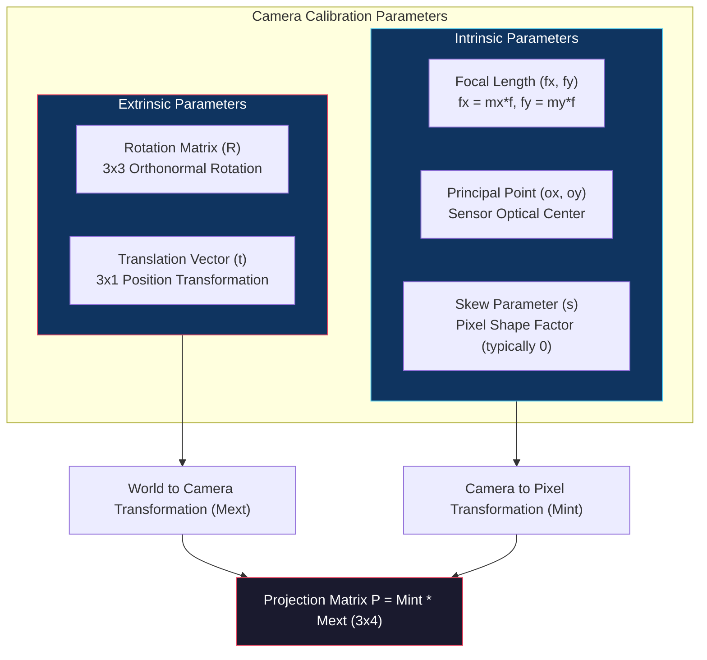
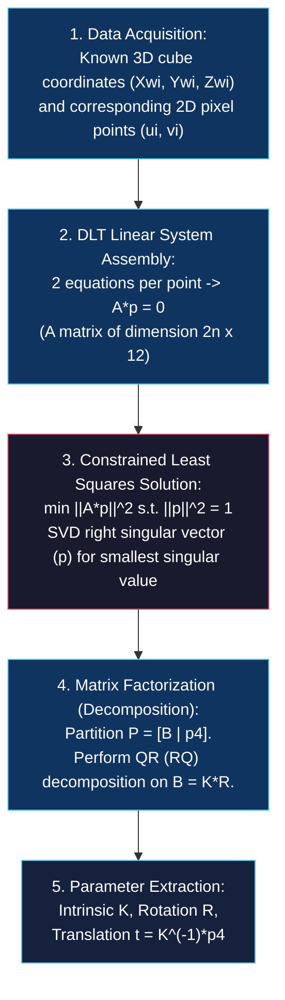

# Camera Models and Calibration

<!-- toc -->

## 1. Overview

One of the fundamental goals of computer vision is to analyze 2D pixel coordinates in images to reconstruct the 3D metric structure of a scene. For a robot, autonomous vehicle, or augmented reality (AR) system to interact physically with the real world, scene dimensions must be converted from pixel units to physical units such as millimeters or meters.

The mathematical and optical process enabling this transition is called **Camera Calibration**. To define the imaging geometry of a camera and establish the mathematical bridge between 2D pixel coordinates and 3D world coordinates, two primary sets of parameters must be estimated:

1. **Extrinsic Parameters:** Define the exact position (translation, $\mathbf{t}$) and orientation (rotation, $R$) of the camera relative to a 3D world coordinate system ($\mathcal{W}$).
2. **Intrinsic Parameters:** Define the internal optical and hardware characteristics of the camera. This includes the lens focal length ($f$), pixel densities of the sensor ($m_x, m_y$), and the coordinates of the principal point ($o_x, o_y$) where the optical axis intersects the image plane.

<figure style="display:flex; justify-content: center; margin: 20px 0;">
  <div style="text-align: center;">
    
    <figcaption style="margin-top: 0.5em; text-align: center; font-size: 13px; color: #888;"><em>Figure 1: Transformation from 3D world coordinate frame ($\mathcal{W}$) to camera frame ($\mathcal{C}$) and perspective projection geometry onto 2D image plane.</em></figcaption>
  </div>
</figure>



Camera calibration numerically estimates these parameters using a calibration object with precisely known 3D geometry (such as a 3D checkerboard calibration cube). In this process, correspondences are established between known 3D world coordinates $\mathbf{X}_{wi} = [x_{wi}, y_{wi}, z_{wi}]^T$ on the calibration object and their corresponding 2D pixel projections $\mathbf{u}_i = [u_i, v_i]^T$ in the image.

Using these correspondences, a global $3 \times 4$ **Projection Matrix ($P$)** is solved first; then, this matrix is factored using linear algebra techniques (such as QR decomposition) to recover individual intrinsic and extrinsic parameters.

> **Key Insight:** Without calibration, the physical size or distance of an object in an image cannot be known. Camera calibration is the bridge linking pixel counts to physical meters.

---

## 2. Linear Camera Model

The projection of a 3D point onto 2D pixel coordinates on the camera sensor is formalized in three steps by the **Forward Imaging Model**:

```mermaid
flowchart LR
    World["3D World Point<br/>(Xw, Yw, Zw)"] -->|Extrinsic Transformation<br/>(R, t)| Cam["3D Camera Point<br/>(Xc, Yc, Zc)"]
    Cam -->|Perspective Projection<br/>Lens Focal Length f| ImagePlane["2D Image Plane (mm)<br/>(xi, yi)"]
    ImagePlane -->|Sensor Mapping<br/>Pixel Densities & Principal Point| Pixel["2D Pixel Coordinate<br/>(u, v)"]
    style World fill:#1a1a2e,stroke:#e94560,color:#fff
    style Cam fill:#16213e,stroke:#4cc9f0,color:#fff
    style ImagePlane fill:#0f3460,stroke:#e94560,color:#fff
    style Pixel fill:#0f3460,stroke:#4cc9f0,color:#fff
```

### 2.1 Perspective Projection (3D to 2D Millimeters)

In a **pinhole camera model** with the optical center (origin) located at $O_c$ and the optical axis aligned with $z_c$, the millimetric projection $(x_i, y_i)$ on the image plane of a scene point $(x_c, y_c, z_c)$ is derived using similar triangles:

$$\frac{x_i}{f} = \frac{x_c}{z_c} \implies x_i = f \frac{x_c}{z_c}$$

$$\frac{y_i}{f} = \frac{y_c}{z_c} \implies y_i = f \frac{y_c}{z_c}$$

where $f$ is the effective focal length of the camera in millimeters.

### 2.2 Sensor Mapping (Millimeters to Pixels)

A digital image sensor (CCD/CMOS) discretizes the continuous image plane into pixels. Sensor pixels may not be perfectly square; hence, horizontal pixel density $m_x$ (pixels/mm) and vertical pixel density $m_y$ (pixels/mm) are defined.

<figure style="display:flex; justify-content: center; margin: 20px 0;">
  <div style="text-align: center;">
    
    <figcaption style="margin-top: 0.5em; text-align: center; font-size: 13px; color: #888;"><em>Figure 2: Mapping from millimetric image plane ($x_i, y_i$) to digital pixel sensor ($u, v$) with pixel densities $m_x, m_y$.</em></figcaption>
  </div>
</figure>

Furthermore, the **Principal Point** $(o_x, o_y)$, where the optical axis pierces the sensor, exhibits a pixel offset relative to the top-left origin $(0,0)$ of the image coordinate system.

<figure style="display:flex; justify-content: center; margin: 20px 0;">
  <div style="text-align: center;">
    
    <figcaption style="margin-top: 0.5em; text-align: center; font-size: 13px; color: #888;"><em>Figure 3: Top-left origin convention on digital image sensor and Principal Point offset ($o_x, o_y$) where optical axis intersects sensor.</em></figcaption>
  </div>
</figure>

Combining these physical factors yields the digital pixel coordinates $(u, v)$:

$$u = m_x x_i + o_x = m_x f \frac{x_c}{z_c} + o_x$$

$$v = m_y y_i + o_y = m_y f \frac{y_c}{z_c} + o_y$$

To consolidate unknown hardware parameters, effective focal lengths in pixel units $f_x$ and $f_y$ are introduced:

$$f_x = m_x \cdot f \quad \text{and} \quad f_y = m_y \cdot f$$

This produces the non-linear projection equations:

$$u = f_x \frac{x_c}{z_c} + o_x \quad \text{and} \quad v = f_y \frac{y_c}{z_c} + o_y$$

### 2.3 Linearization via Homogeneous Coordinates

Due to the depth term $z_c$ in the denominator, the projection system is non-linear. To overcome this mathematical non-linearity, coordinates are mapped into **Homogeneous Coordinate Space**.

The 2D pixel coordinate $(u, v)$ is elevated to a homogeneous vector $[\tilde{u}, \tilde{v}, \tilde{w}]^T = [z_c u, z_c v, z_c]^T$. Geometrically, this mapping converts a 2D point into a 3D ray through the origin; intersecting this ray with the plane $\tilde{w}=1$ recovers Euclidean pixel coordinates.

<figure style="display:flex; justify-content: center; margin: 20px 0;">
  <div style="text-align: center;">
    
    <figcaption style="margin-top: 0.5em; text-align: center; font-size: 13px; color: #888;"><em>Figure 4: 2D Homogeneous coordinate space: Ray $[\tilde{u}, \tilde{v}, \tilde{w}]^T$ intersecting plane $\tilde{w}=1$ at Euclidean coordinates ($u = \tilde{u}/\tilde{w}, v = \tilde{v}/\tilde{w}$).</em></figcaption>
  </div>
</figure>

Similarly, the 3D scene point is represented as a 4D homogeneous vector $[x_c, y_c, z_c, 1]^T$:

<figure style="display:flex; justify-content: center; margin: 20px 0;">
  <div style="text-align: center;">
    
    <figcaption style="margin-top: 0.5em; text-align: center; font-size: 13px; color: #888;"><em>Figure 5: Elevation of 3D Euclidean coordinates to 4D homogeneous vector $[\tilde{x}, \tilde{y}, \tilde{z}, \tilde{w}]^T$.</em></figcaption>
  </div>
</figure>

This elevation transforms perspective division into a linear matrix multiplication:

<figure style="display:flex; justify-content: center; margin: 20px 0;">
  <div style="text-align: center;">
    
    <figcaption style="margin-top: 0.5em; text-align: center; font-size: 13px; color: #888;"><em>Figure 6: Matrix multiplication form of the linear camera model in homogeneous coordinates.</em></figcaption>
  </div>
</figure>

$$\begin{bmatrix} z_c u \\ z_c v \\ z_c \end{bmatrix} = \begin{bmatrix} f_x & 0 & o_x & 0 \\ 0 & f_y & o_y & 0 \\ 0 & 0 & 1 & 0 \end{bmatrix} \begin{bmatrix} x_c \\ y_c \\ z_c \\ 1 \end{bmatrix}$$

---

## 3. Intrinsic and Extrinsic Matrices

The linear camera model is completely defined by two sub-matrices:

### 3.1 Intrinsic Matrix ($M_{int}$)

The intrinsic matrix represents the internal optical and hardware configuration of the camera as a $3 \times 4$ matrix:

$$M_{int} = \begin{bmatrix} K \mid \mathbf{0} \end{bmatrix} = \begin{bmatrix} f_x & 0 & o_x & 0 \\ 0 & f_y & o_y & 0 \\ 0 & 0 & 1 & 0 \end{bmatrix}$$

where $K$ is the $3 \times 3$ **Calibration Matrix**:

<figure style="display:flex; justify-content: center; margin: 20px 0;">
  <div style="text-align: center;">
    
    <figcaption style="margin-top: 0.5em; text-align: center; font-size: 13px; color: #888;"><em>Figure 7: Upper-right triangular $3 \times 3$ Calibration Matrix ($K$) and $3 \times 4$ Intrinsic Matrix ($M_{int} = [K \mid \mathbf{0}]$).</em></figcaption>
  </div>
</figure>

$$K = \begin{bmatrix} f_x & 0 & o_x \\ 0 & f_y & o_y \\ 0 & 0 & 1 \end{bmatrix}$$

> **Mathematical Note:** The calibration matrix $K$ is an **upper-right triangular matrix**. If sensor pixels are non-perpendicular, a skew parameter $s$ can be placed at $K_{12} = s$; however, $s = 0$ for modern digital sensors.

### 3.2 Extrinsic Matrix ($M_{ext}$)

The extrinsic matrix maps a point $\mathbf{X}_w = [x_w, y_w, z_w]^T$ from the world coordinate frame ($\mathcal{W}$) into the camera frame ($\mathcal{C}$). Camera orientation is represented by a $3 \times 3$ **Rotation Matrix ($R$)**, and camera position by a $3 \times 1$ **Translation Vector ($\mathbf{t} = -R \mathbf{c}_w$)**:

<figure style="display:flex; justify-content: center; margin: 20px 0;">
  <div style="text-align: center;">
    
    <figcaption style="margin-top: 0.5em; text-align: center; font-size: 13px; color: #888;"><em>Figure 8: Extrinsic parameters: Camera position $\mathbf{c}_w$ and orthonormal Rotation Matrix ($R$) in the world coordinate frame.</em></figcaption>
  </div>
</figure>

$$\begin{bmatrix} x_c \\ y_c \\ z_c \\ 1 \end{bmatrix} = M_{ext} \begin{bmatrix} x_w \\ y_w \\ z_w \\ 1 \end{bmatrix} = \begin{bmatrix} R_{3 \times 3} & \mathbf{t}_{3 \times 1} \\ \mathbf{0}_{1 \times 3} & 1 \end{bmatrix} \begin{bmatrix} x_w \\ y_w \\ z_w \\ 1 \end{bmatrix}$$

The rotation matrix $R$ is **orthonormal**, satisfying $R^T R = I$ and $\det(R) = +1$.

### 3.3 Projection Matrix ($P$)

Multiplying the intrinsic and extrinsic matrices sequentially yields the $3 \times 4$ **Projection Matrix ($P$)**, which directly maps 3D world coordinates to 2D pixel coordinates:

<figure style="display:flex; justify-content: center; margin: 20px 0;">
  <div style="text-align: center;">
    
    <figcaption style="margin-top: 0.5em; text-align: center; font-size: 13px; color: #888;"><em>Figure 9: Two-step transformation chain ($M_{ext}$ for World->Camera, $M_{int}$ for Camera->Pixel) mapping 3D world points to pixels.</em></figcaption>
  </div>
</figure>

<figure style="display:flex; justify-content: center; margin: 20px 0;">
  <div style="text-align: center;">
    
    <figcaption style="margin-top: 0.5em; text-align: center; font-size: 13px; color: #888;"><em>Figure 10: Combining intrinsic and extrinsic matrices to construct the general $3 \times 4$ Projection Matrix $P = M_{int} M_{ext}$.</em></figcaption>
  </div>
</figure>

$$\tilde{\mathbf{u}} = M_{int} \cdot M_{ext} \cdot \tilde{\mathbf{X}}_w = P \cdot \tilde{\mathbf{X}}_w$$

$$P = K \begin{bmatrix} R \mid \mathbf{t} \end{bmatrix} = \begin{bmatrix} p_{11} & p_{12} & p_{13} & p_{14} \\ p_{21} & p_{22} & p_{23} & p_{24} \\ p_{31} & p_{32} & p_{33} & p_{34} \end{bmatrix}$$

```mermaid
flowchart TD
    WorldPt["3D World Coordinate (Xw, Yw, Zw, 1)^T"] -->|Extrinsic Matrix Mext (4x4)| CamPt["3D Camera Coordinate (Xc, Yc, Zc, 1)^T"]
    CamPt -->|Intrinsic Matrix Mint (3x4)| HomogPixel["Homogeneous Pixel Vector (z_c*u, z_c*v, z_c)^T"]
    WorldPt -->|Direct Projection Matrix P (3x4)| HomogPixel
    HomogPixel -->|Scale Normalization (Euclidean Homogenization)| PixelCoord["2D Pixel Coordinate (u, v)"]
    style WorldPt fill:#0f3460,stroke:#e94560,color:#fff
    style CamPt fill:#0f3460,stroke:#4cc9f0,color:#fff
    style HomogPixel fill:#1a1a2e,stroke:#e94560,color:#fff
    style PixelCoord fill:#16213e,stroke:#4cc9f0,color:#fff
```

---

## 4. Camera Calibration

The objective of camera calibration is to determine the 12 unknown parameters ($p_{11}$ through $p_{34}$) of the projection matrix $P$ by solving a linear system.

<figure style="display:flex; justify-content: center; margin: 20px 0;">
  <div style="text-align: center;">
    
    <figcaption style="margin-top: 0.5em; text-align: center; font-size: 13px; color: #888;"><em>Figure 11: Point correspondences established between known 3D world points $\mathbf{X}_w$ on a calibration cube and observed 2D pixel projections $\mathbf{u}$.</em></figcaption>
  </div>
</figure>



### 4.1 Direct Linear Transformation (DLT)

For $i = 1, \dots, n$ points on a calibration object, known 3D world coordinates $(x_{wi}, y_{wi}, z_{wi})$ are paired with measured 2D pixel coordinates $(u_i, v_i)$.

<figure style="display:flex; justify-content: center; margin: 20px 0;">
  <div style="text-align: center;">
    
    <figcaption style="margin-top: 0.5em; text-align: center; font-size: 13px; color: #888;"><em>Figure 12: Establishing rational equations for the unknown Projection Matrix parameters ($p_{11} \dots p_{34}$) using known 3D and 2D coordinates.</em></figcaption>
  </div>
</figure>

Expanding the homogeneous projection equation:

$$\begin{bmatrix} z_{ci} u_i \\ z_{ci} v_i \\ z_{ci} \end{bmatrix} = \begin{bmatrix} p_{11} & p_{12} & p_{13} & p_{14} \\ p_{21} & p_{22} & p_{23} & p_{24} \\ p_{31} & p_{32} & p_{33} & p_{34} \end{bmatrix} \begin{bmatrix} x_{wi} \\ y_{wi} \\ z_{wi} \\ 1 \end{bmatrix}$$

Expressing depth from line 3 as $z_{ci} = p_{31} x_{wi} + p_{32} y_{wi} + p_{33} z_{wi} + p_{34}$ and substituting into lines 1 and 2 eliminates $z_{ci}$, yielding **two independent linear equations** per 3D-2D point pair:

$$(p_{11} x_{wi} + p_{12} y_{wi} + p_{13} z_{wi} + p_{14}) - u_i (p_{31} x_{wi} + p_{32} y_{wi} + p_{33} z_{wi} + p_{34}) = 0$$

$$(p_{21} x_{wi} + p_{22} y_{wi} + p_{23} z_{wi} + p_{24}) - v_i (p_{31} x_{wi} + p_{32} y_{wi} + p_{33} z_{wi} + p_{34}) = 0$$

Stacking these equations for all $n$ calibration points ($n \ge 6$) forms a $2n \times 12$ matrix $A$ and a 12-element parameter vector $\mathbf{p} = [p_{11}, p_{12}, \dots, p_{34}]^T$:

<figure style="display:flex; justify-content: center; margin: 20px 0;">
  <div style="text-align: center;">
    
    <figcaption style="margin-top: 0.5em; text-align: center; font-size: 13px; color: #888;"><em>Figure 13: Stacking all point correspondences to construct the homogeneous linear system matrix $A$ of size $2n \times 12$ and unknown vector $\mathbf{p}$ ($A \mathbf{p} = \mathbf{0}$).</em></figcaption>
  </div>
</figure>

$$A \mathbf{p} = \mathbf{0}$$

### 4.2 Constrained Least Squares Solution

Because homogeneous coordinates operate up to an arbitrary scale factor ($\lambda P$ projects to the same pixels as $P$), a unit norm constraint $\|\mathbf{p}\|^2 = 1$ is enforced to resolve scale ambiguity.

<figure style="display:flex; justify-content: center; margin: 20px 0;">
  <div style="text-align: center;">
    
    <figcaption style="margin-top: 0.5em; text-align: center; font-size: 13px; color: #888;"><em>Figure 14: Scale ambiguity in perspective projection: Scaling scene size and distance by scale factor $k$ ($Scale = k_1$ vs $Scale = k_2$) produces identical 2D pixel projections.</em></figcaption>
  </div>
</figure>

To minimize measurement noise, the constrained optimization problem is formulated:

$$\min_{\mathbf{p}} \|A \mathbf{p}\|^2 \quad \text{subject to} \quad \|\mathbf{p}\|^2 = 1$$

#### Theoretical Proof (Lagrange Multipliers)

Formulating the Lagrangian with multiplier $\lambda$:

$$\mathcal{L}(\mathbf{p}, \lambda) = \mathbf{p}^T A^T A \mathbf{p} - \lambda (\mathbf{p}^T \mathbf{p} - 1)$$

Taking the partial derivative with respect to $\mathbf{p}$ and setting it to zero:

$$\frac{\partial \mathcal{L}}{\partial \mathbf{p}} = 2 A^T A \mathbf{p} - 2 \lambda \mathbf{p} = \mathbf{0} \implies A^T A \mathbf{p} = \lambda \mathbf{p}$$

This is the standard **Eigenvalue / Eigenvector Problem**.

Substituting back into the objective function $\|A \mathbf{p}\|^2$:

$$\|A \mathbf{p}\|^2 = \mathbf{p}^T A^T A \mathbf{p} = \mathbf{p}^T (\lambda \mathbf{p}) = \lambda \mathbf{p}^T \mathbf{p} = \lambda$$

> **Proof Conclusion:** Minimizing $\|A \mathbf{p}\|^2$ corresponds to selecting the smallest eigenvalue $\lambda_{\min}$ of $A^T A$. Thus, the optimal parameter vector $\mathbf{p}$ is the **eigenvector associated with the smallest eigenvalue of $A^T A$** (or equivalently, the right singular vector $V_{*,12}$ corresponding to the smallest singular value in the Singular Value Decomposition $A = U \Sigma V^T$).

Reshaping the optimal vector $\mathbf{p}$ into a $3 \times 4$ grid reconstructs the Projection Matrix $P$.

### 4.3 Decomposing the Projection Matrix

To extract explicit intrinsic ($K$) and extrinsic ($R, \mathbf{t}$) parameters from $P$:

1. **Separating Calibration ($K$) and Rotation ($R$):** Let $B$ denote the leading $3 \times 3$ submatrix of $P$:
   $$P = [B_{3 \times 3} \mid \mathbf{p}_4] = [K \cdot R \mid K \cdot \mathbf{t}]$$
   Since $K$ is upper-triangular and $R$ is orthonormal ($R R^T = I$), **QR Decomposition** (or RQ factorization) uniquely factors $B = K \cdot R$ into $K$ and $R$.
2. **Solving the Translation Vector ($\mathbf{t}$):** The last column $\mathbf{p}_4$ of $P$ satisfies $\mathbf{p}_4 = K \mathbf{t}$. Inverting $K$ yields the translation vector:
   $$\mathbf{t} = K^{-1} \mathbf{p}_4$$

### 4.4 Optical Lens Distortions

Real lens systems exhibit non-linear departures from the ideal pinhole model. While projection matrix $P$ models linear perspective geometry, non-linear lens aberrations are modeled separately and corrected after linear calibration:

1. **Radial Distortion:** Caused by light rays refracting differently near the edges of spherical lenses (*Barrel* or *Pincushion* distortion).
2. **Tangential Distortion:** Caused by slight physical misalignment of lens elements relative to the image sensor plane.

<figure style="display:flex; justify-content: center; margin: 20px 0;">
  <div style="text-align: center;">
    
    <figcaption style="margin-top: 0.5em; text-align: center; font-size: 13px; color: #888;"><em>Figure 15: Non-linear optical lens distortions: Radial Distortion (left) and Tangential Distortion (right).</em></figcaption>
  </div>
</figure>

This completes the full recovery of camera intrinsics ($K$), extrinsics ($R, \mathbf{t}$), and optical distortion parameters.
