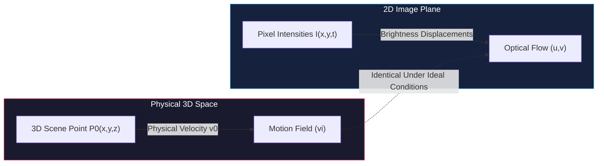
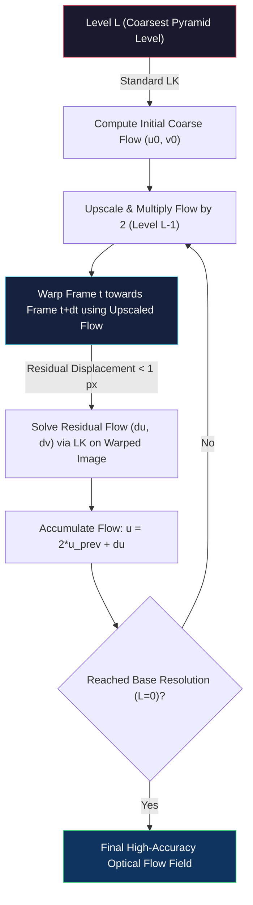

# Optical Flow and Motion Analysis

<!-- toc -->

In previous discussions on camera calibration, stereo vision, and shape from shading, scenes or camera systems were predominantly assumed to be stationary. However, the physical world is inherently dynamic: objects move in 3D space, cameras undergo egomotion, and visual motion constitutes one of the most critical sources of information for both biological and artificial perception systems.

This note provides a comprehensive, mathematically rigorous treatment of **Optical Flow** and **Motion Analysis**. We cover the physical distinctions between the **Motion Field** and **Optical Flow**, the derivation of the **Optical Flow Constraint Equation (OFCE)**, the **Aperture Problem**, the **Lucas-Kanade Least Squares Formulation**, condition number analysis via **Eigenvalues**, multi-scale **Coarse-to-Fine Warping Pyramids**, **Template Matching** trade-offs, and key real-world industrial applications.

---

## 1. Overview and Historical Foundations

When analyzing dynamic scenes captured across consecutive video frames ($t$ and $t + \delta t$), we seek to measure the visual displacement of pixels over time. In computer vision literature, this problem is framed through two distinct concepts:

1. **Motion Field ($\mathbf{v}_i$):** The 2D velocity vector field in the image plane formed by the geometric perspective projection of the true 3D physical velocities ($\mathbf{v}_0$) of points in the scene.
2. **Optical Flow ($\mathbf{u}$):** The perceived 2D velocity vector field $(u, v)$ of brightness patterns moving across the image sensor array over time.

<figure style="display:flex; justify-content: center; margin: 20px 0;">
  

    
    <figcaption style="margin-top: 0.5em; text-align: center; font-size: 13px; color: #888;"><em>Figure 1: Optical flow vectors representing the apparent motion of brightness patterns between two consecutive frames. Ideally, Optical Flow = Motion Field.</em></figcaption>
  

</figure>

Our ultimate goal is often to recover the true physical motion field ($\mathbf{v}_i$) from the observable image brightness changes. However, because cameras record only quantized irradiance values (intensities and colors), we can only compute the motion of brightness patterns (optical flow).

> **Key Insight:** Under uniform diffuse lighting and richly textured surfaces, optical flow and the motion field coincide. However, specular highlights, moving light sources, and textureless surfaces create fundamental discrepancies where optical flow departs drastically from the true physical motion field.

---

## 2. Motion Field & Optical Flow

### 2.1 Mathematical Derivation of the Motion Field ($\mathbf{v}_i$)

Consider a standard pinhole camera coordinate frame centered at the optical center (Horn, 1981).

<figure style="display:flex; justify-content: center; margin: 20px 0;">
  

    
    <figcaption style="margin-top: 0.5em; text-align: center; font-size: 13px; color: #888;"><em>Figure 2: Pinhole camera geometry showing the relationship between 3D scene point velocity (v0) and projected image point velocity (vi).</em></figcaption>
  

</figure>

Let a 3D scene point $P_0$ have position vector $\mathbf{r}_0 = [x_w, y_w, z_w]^T$. Its perspective projection on the image plane is point $p_i$ with position vector $\mathbf{r}_i = [x_i, y_i, f]^T$.

Given the camera focal length $f$ and optical axis unit vector $\mathbf{z}$, perspective projection yields:

$$\mathbf{r}_i = f \frac{\mathbf{r}_0}{\mathbf{r}_0 \cdot \mathbf{z}}$$

where $\mathbf{r}_0 \cdot \mathbf{z} = z_w$ is the 3D depth of the point along the optical axis.

If the 3D point moves with instantaneous physical velocity $\mathbf{v}_0 = \frac{d\mathbf{r}_0}{dt}$, the resulting image velocity—the **Motion Field $\mathbf{v}_i$**—is obtained by taking the time derivative:

$$\mathbf{v}_i = \frac{d\mathbf{r}_i}{dt}$$

Applying the quotient rule of differential calculus:

$$\mathbf{v}_i = \frac{d}{dt} \left( f \frac{\mathbf{r}_0}{\mathbf{r}_0 \cdot \mathbf{z}} \right) = f \frac{(\mathbf{r}_0 \cdot \mathbf{z})\mathbf{v}_0 - \mathbf{r}_0 (\mathbf{v}_0 \cdot \mathbf{z})}{(\mathbf{r}_0 \cdot \mathbf{z})^2}$$

Using the vector triple product identity $\mathbf{a} \times (\mathbf{b} \times \mathbf{c}) = (\mathbf{a} \cdot \mathbf{c})\mathbf{b} - (\mathbf{a} \cdot \mathbf{b})\mathbf{c}$, we can write the motion field equation in compact vector form:

$$\mathbf{v}_i = f \frac{(\mathbf{r}_0 \times \mathbf{v}_0) \times \mathbf{z}}{(\mathbf{r}_0 \cdot \mathbf{z})^2} = \frac{f \cdot (\mathbf{z} \times (\mathbf{r}_0 \times \mathbf{v}_0))}{(\mathbf{r}_0 \cdot \mathbf{z})^2}$$

This formula analytically maps a known 3D point position ($\mathbf{r}_0$), depth ($z_w$), and 3D velocity ($\mathbf{v}_0$) to the exact geometric velocity vector ($\mathbf{v}_i$) in the image plane.

---

### 2.2 Boundary Scenarios Where Optical Flow $\neq$ Motion Field

While we want optical flow to equal the true motion field, optical reflection laws and lighting dynamics lead to three classic failure modes:

<figure style="display:flex; justify-content: center; margin: 20px 0;">
  

    
    <figcaption style="margin-top: 0.5em; text-align: center; font-size: 13px; color: #888;"><em>Figure 3: Left: Spinning smooth sphere (Motion field exists, but no optical flow). Right: Stationary sphere with moving light source (No motion field, but optical flow exists).</em></figcaption>
  

</figure>

#### 1. Motion Field Exists, No Optical Flow (Spinning Sphere)
- **Scenario:** A perfectly smooth, textureless sphere rotates about its central vertical axis under fixed point lighting.
- **Analysis:** Because the physical matter is rotating, physical points possess velocity ($\mathbf{v}_0 \neq \mathbf{0}$); thus, a **non-zero motion field exists**. However, because the surface is completely uniform and the light source is stationary, the recorded shading and intensities do not change over time ($\frac{\partial I}{\partial t} = 0$). Consecutive frames are identical. Thus, **optical flow is identically zero**.

#### 2. No Motion Field, Optical Flow Exists (Moving Light Source)
- **Scenario:** A smooth sphere is held completely stationary ($\mathbf{v}_0 = \mathbf{0}$), but the light source illuminating it orbits around the sphere.
- **Analysis:** Because the sphere is static, the **motion field is zero**. However, the moving light shifts the specular highlight, terminator boundary, and shading gradients across the sensor. The camera detects moving brightness patterns; thus, **optical flow is non-zero**.

#### 3. Orthogonal Directions (Barber Pole Illusion)
- **Scenario:** A classic barber shop pole (cylinder) painted with diagonal helical stripes rotates about its vertical axis.
- **Analysis:** Every physical point on the cylinder rotates horizontally (**horizontal motion field**). However, human perception and differential cameras track the continuous diagonal stripes translating purely vertically (**vertical optical flow**). The motion field and optical flow vectors are **mutually perpendicular (orthogonal, $90^\circ$ mismatch)**.

<figure style="display:flex; justify-content: center; margin: 20px 0;">
  

    
    <figcaption style="margin-top: 0.5em; text-align: center; font-size: 13px; color: #888;"><em>Figure 4: Barber Pole Illusion: Physical motion field is horizontal, whereas perceived optical flow is strictly vertical.</em></figcaption>
  

</figure>

---

### 2.3 Optical Flow Illusions in Human Psychophysics

The human visual cortex (particularly area MT / V5) interprets temporal brightness gradients as physical motion, giving rise to fascinating psychophysical motion illusions:

<figure style="display:flex; justify-content: center; margin: 20px 0;">
  

    
    <figcaption style="margin-top: 0.5em; text-align: center; font-size: 13px; color: #888;"><em>Figure 5: Donguri Wave Illusion: A completely static 2D image produces perceived wavy motion when viewing the asymmetric leaf brightness gradients during involuntary eye movements.</em></figcaption>
  

</figure>

- **Donguri Wave Illusion:** A static 2D arrangement of acorn/leaf patterns with asymmetric luminance transitions. Micro-saccadic eye movements trigger differential temporal filters, inducing the sensation of moving waves across a static page.
- **Ouchi Pattern:** A circular grating surrounded by an orthogonal grating; eye drift creates an apparent relative sliding motion between the central disk and the background.

---

## 3. Optical Flow Constraint Equation

Given two consecutive video frames ($t$ and $t + \delta t$), we seek to compute the local displacement $(u, v)$ for every pixel.

<figure style="display:flex; justify-content: center; margin: 20px 0;">
  

    
    <figcaption style="margin-top: 0.5em; text-align: center; font-size: 13px; color: #888;"><em>Figure 6: Pixel coordinate displacement from (x, y) at time t to (x + dx, y + dy) at time t + dt.</em></figcaption>
  

</figure>

### 3.1 Fundamental Assumptions

The mathematical formulation rests on two core assumptions:

<figure style="display:flex; justify-content: center; margin: 20px 0;">
  

    
    <figcaption style="margin-top: 0.5em; text-align: center; font-size: 13px; color: #888;"><em>Figure 7: Assumption 1: Brightness Constancy — The intensity of an image point remains invariant over small temporal increments dt.</em></figcaption>
  

</figure>

1. **Brightness Constancy Assumption:** The irradiance of a scene point projected onto the sensor remains constant over small time intervals:
   $$I(x, y, t) = I(x + \delta x, y + \delta y, t + \delta t)$$
2. **Small Motion / Displacement Assumption:** The temporal step $\delta t$ is small enough that spatial displacements $\delta x, \delta y$ are infinitesimal ($\delta x, \delta y \ll 1$ pixel), enabling first-order Taylor series approximation.

---

### 3.2 Taylor Series Expansion and Differential Derivation

Expanding $I(x + \delta x, y + \delta y, t + \delta t)$ via multi-variable Taylor series around $(x, y, t)$:

$$I(x + \delta x, y + \delta y, t + \delta t) \approx I(x, y, t) + \frac{\partial I}{\partial x}\delta x + \frac{\partial I}{\partial y}\delta y + \frac{\partial I}{\partial t}\delta t + \mathcal{O}(\delta^2)$$

Neglecting higher-order terms $\mathcal{O}(\delta^2)$ and substituting the Brightness Constancy condition:

$$I_x \delta x + I_y \delta y + I_t \delta t = 0$$

where $I_x = \frac{\partial I}{\partial x}$, $I_y = \frac{\partial I}{\partial y}$, and $I_t = \frac{\partial I}{\partial t}$.

Dividing both sides by $\delta t$ and taking the limit $\delta t \to 0$:

$$I_x \frac{dx}{dt} + I_y \frac{dy}{dt} + I_t = 0$$

Defining horizontal velocity $u = \frac{dx}{dt}$ and vertical velocity $v = \frac{dy}{dt}$, we obtain the celebrated **Optical Flow Constraint Equation (OFCE)**:

$$I_x u + I_y v + I_t = 0 \quad \iff \quad \nabla I \cdot \mathbf{u} + I_t = 0$$

where $\nabla I = [I_x, I_y]^T$ is the spatial image gradient and $\mathbf{u} = [u, v]^T$ is the optical flow velocity vector.

---

### 3.3 Spatio-Temporal Finite Differences

The gradients $I_x, I_y, I_t$ are evaluated numerically from consecutive image frames using a $2 \times 2 \times 2$ spatio-temporal pixel cube (Horn & Schunck, 1981):

<figure style="display:flex; justify-content: center; margin: 20px 0;">
  

    
    <figcaption style="margin-top: 0.5em; text-align: center; font-size: 13px; color: #888;"><em>Figure 8: 2x2x2 spatio-temporal pixel neighborhood used for symmetric finite difference gradient estimation.</em></figcaption>
  

</figure>

$$I_x(k, l, t) \approx \frac{1}{4} \Big[ I(k+1, l, t) + I(k+1, l, t+1) + I(k+1, l+1, t) + I(k+1, l+1, t+1) \Big] - \frac{1}{4} \Big[ I(k, l, t) + I(k, l, t+1) + I(k, l+1, t) + I(k, l+1, t+1) \Big]$$

Corresponding symmetric averages compute $I_y(k, l, t)$ and $I_t(k, l, t)$.

---

### 3.4 Geometric Interpretation and the Aperture Problem

The constraint $I_x u + I_y v + I_t = 0$ defines a straight **constraint line** in the $u-v$ velocity space.

<figure style="display:flex; justify-content: center; margin: 20px 0;">
  

    
    <figcaption style="margin-top: 0.5em; text-align: center; font-size: 13px; color: #888;"><em>Figure 9: Constraint line in u-v velocity space with normal flow component (un) and parallel flow component (up).</em></figcaption>
  

</figure>

#### One Equation, Two Unknowns
For each pixel, we have **1 scalar equation** with **2 unknowns** ($u$ and $v$). The system is inherently **under-constrained**, and any point along the constraint line satisfies the equation.

The velocity vector can be resolved into two orthogonal components:

$$\mathbf{u} = \mathbf{u}_n + \mathbf{u}_p$$

1. **Normal Flow ($\mathbf{u}_n$):** Perpendicular to the constraint line (parallel to spatial gradient $\nabla I$). Its magnitude and direction are uniquely determined:
   $$\hat{\mathbf{u}}_n = \frac{[I_x, I_y]^T}{\sqrt{I_x^2 + I_y^2}}, \quad |\mathbf{u}_n| = \frac{-I_t}{\sqrt{I_x^2 + I_y^2}} \implies \mathbf{u}_n = -\frac{I_t}{I_x^2 + I_y^2} \begin{bmatrix} I_x \\ I_y \end{bmatrix}$$
2. **Parallel Flow ($\mathbf{u}_p$):** Tangent to the constraint line (along the edge contour). It cannot be determined from a single pixel observation.

<figure style="display:flex; justify-content: center; margin: 20px 0;">
  

    
    
    <figcaption style="margin-top: 0.5em; text-align: center; font-size: 13px; color: #888;"><em>Figures 10 & 11: The Aperture Problem: Left: True 2D motion of an edge. Right: Viewed through a small circular aperture, only normal motion perpendicular to the edge is detectable; parallel motion is invisible.</em></figcaption>
  

</figure>

> **The Aperture Problem:** When viewing a moving 1D edge through a local circular aperture, motion parallel to the edge generates no intensity change. Only motion perpendicular to the edge (normal flow) is observable. Resolving the true 2D velocity requires 2D features (corners, textured patches) or spatial neighborhood constraints.

---

## 4. Lucas-Kanade Method

Bruce Lucas and Takeo Kanade (1981) introduced a landmark solution by imposing a local spatial consistency constraint.

### 4.1 Spatial Coherence Assumption

The Lucas-Kanade method assumes that all pixels within a small spatial window $W$ ($n \times n$, typically $3 \times 3$ or $5 \times 5$) around the target pixel move with the **same identical velocity**:

$$\mathbf{u}(x, y) = [u, v]^T = \text{const} \quad \forall (x,y) \in W$$

For an $n \times n$ window containing $n^2$ pixels, evaluating the OFCE at each pixel yields an **overdetermined system** of $n^2$ equations in 2 unknowns:

$$\begin{aligned}
I_{x1} u + I_{y1} v &= -I_{t1} \\
I_{x2} u + I_{y2} v &= -I_{t2} \\
&\;\;\vdots \\
I_{xn^2} u + I_{yn^2} v &= -I_{tn^2}
\end{aligned}$$

---

### 4.2 Matrix Formulation and Least Squares Solution

Expressing this linear system in matrix form:

$$A \mathbf{u} = \mathbf{b}$$

<figure style="display:flex; justify-content: center; margin: 20px 0;">
  

    
    <figcaption style="margin-top: 0.5em; text-align: center; font-size: 13px; color: #888;"><em>Figure 12: Overdetermined linear system A u = b for an n x n local patch.</em></figcaption>
  

</figure>

where:
- $A = \begin{bmatrix} I_{x1} & I_{y1} \\ I_{x2} & I_{y2} \\ \vdots & \vdots \\ I_{xn^2} & I_{yn^2} \end{bmatrix}$ is the $n^2 \times 2$ spatial gradient matrix.
- $\mathbf{u} = \begin{bmatrix} u \\ v \end{bmatrix}$ is the $2 \times 1$ unknown velocity vector.
- $\mathbf{b} = \begin{bmatrix} -I_{t1} \\ -I_{t2} \\ \vdots \\ -I_{tn^2} \end{bmatrix}$ is the $n^2 \times 1$ temporal derivative vector.

Solving via the pseudo-inverse / **Least Squares**:

$$A^T A \mathbf{u} = A^T \mathbf{b} \implies \mathbf{u} = (A^T A)^{-1} A^T \mathbf{b}$$

Expanding the matrix components into a compact $2 \times 2$ system:

$$\begin{bmatrix} \sum I_x^2 & \sum I_x I_y \\ \sum I_x I_y & \sum I_y^2 \end{bmatrix} \begin{bmatrix} u \\ v \end{bmatrix} = \begin{bmatrix} -\sum I_x I_t \\ -\sum I_y I_t \end{bmatrix}$$

where all summations $\sum$ run over all pixels in window $W$. Note that $M = A^T A$ is identical in form to the Harris corner structure tensor.

---

### 4.3 Well-Conditioning Analysis via Eigenvalues

For $(A^T A)^{-1}$ to exist stably without numerical noise amplification, $M = A^T A$ must be well-conditioned. This is governed by its eigenvalues $\lambda_1, \lambda_2$:

<figure style="display:flex; justify-content: center; margin: 20px 0;">
  

    
    <figcaption style="margin-top: 0.5em; text-align: center; font-size: 13px; color: #888;"><em>Figure 13: Textureless Flat Region (Sky): lambda1 ~ lambda2 ~ 0 (Singular / poorly conditioned matrix).</em></figcaption>
  

</figure>

<figure style="display:flex; justify-content: center; margin: 20px 0;">
  

    
    <figcaption style="margin-top: 0.5em; text-align: center; font-size: 13px; color: #888;"><em>Figure 14: Edge Region (Roofline): lambda1 >> lambda2 ~ 0 (Aperture problem; only normal flow resolvable).</em></figcaption>
  

</figure>

<figure style="display:flex; justify-content: center; margin: 20px 0;">
  

    
    <figcaption style="margin-top: 0.5em; text-align: center; font-size: 13px; color: #888;"><em>Figure 15: Textured Region (Flowerbed / Corner): lambda1, lambda2 both large (Well-conditioned; full 2D flow resolved accurately).</em></figcaption>
  

</figure>

| Region Characteristics | Gradient Distribution (Ellipse) | Eigenvalue Status ($\lambda_1, \lambda_2$) | Matrix Conditioning | Flow Estimation Quality |
| :--- | :--- | :--- | :--- | :--- |
| **Textureless Area** (e.g., Sky) | Small cluster concentrated at origin | $\lambda_1 \approx 0, \; \lambda_2 \approx 0$ | **Badly Conditioned:** Singular, non-invertible matrix. | **Unsolvable:** Division by zero or massive noise amplification. |
| **Straight Edge** (e.g., Roofline) | Thin, elongated ellipse along edge normal | $\lambda_1 \gg \lambda_2$ ($\lambda_2 \approx 0$) | **Badly Conditioned:** Gradient in one direction only (Aperture Problem). | **Partial:** Only normal flow is recoverable; parallel component is ambiguous. |
| **Textured / Corner Area** (e.g., Flowers) | Broad circular/oval spread across both axes | $\lambda_1, \lambda_2 \gg 0$ ($\lambda_1 \sim \lambda_2$) | **Well-Conditioned:** Invertible with high numerical stability. | **Excellent:** 2D optical flow $(u, v)$ uniquely and accurately solved. |

---

## 5. Coarse-to-Fine Flow Estimation

Because the Lucas-Kanade derivation relies on first-order Taylor expansion, it strictly requires **sub-pixel or near-pixel displacements** ($\delta x, \delta y \ll 1$). In real videos, fast-moving objects or camera motion can cause displacements of 20 to 50 pixels per frame, violating linearity and breaking the OFCE ($I_x u + I_y v + I_t \neq 0$).

To overcome this limitation, a multi-scale **Gaussian Resolution Pyramid** and **Warping** framework is employed (Bouguet, 2000).

<figure style="display:flex; justify-content: center; margin: 20px 0;">
  

    
    <figcaption style="margin-top: 0.5em; text-align: center; font-size: 13px; color: #888;"><em>Figure 16: Resolution Pyramid: Large macroscopic displacements at full resolution become sub-pixel motions at the coarsest pyramid level.</em></figcaption>
  

</figure>

### 5.1 Resolution Pyramid Concept

1. A hierarchy of downsampled images is built by successive $2 \times 2$ spatial averaging: $N \times N$, $N/2 \times N/2$, $N/4 \times N/4$, $N/8 \times N/8$.
2. **Key Mathematical Invariance:** A large displacement of 16 pixels at full resolution becomes exactly **1 pixel** at the $N/16 \times N/16$ level!
3. At the coarsest level, motion falls within the linear Taylor regime, allowing standard Lucas-Kanade to function reliably.

---

### 5.2 Step-by-Step Algorithm (Bouguet 2000)

<figure style="display:flex; justify-content: center; margin: 20px 0;">
  

    
    <figcaption style="margin-top: 0.5em; text-align: center; font-size: 13px; color: #888;"><em>Figure 17: Coarse-to-fine iterative warping pipeline across multi-scale resolution pyramid levels (Bouguet 2000).</em></figcaption>
  

</figure>

1. **Coarse Initialization:** At the lowest resolution (pyramid apex), compute initial flow $\mathbf{u}^{(0)}$ using standard Lucas-Kanade.
2. **Upscaling:** Pass the flow field to the next higher-resolution level, scaling velocity coordinates by 2 ($2\mathbf{u}^{(0)}$).
3. **Backward Image Warping:** Warp frame $I(t)$ using the upscaled flow field toward $I(t+\delta t)$, effectively neutralizing the large macroscopic shift.
4. **Residual Flow Computation:** Because warping removes the large motion, the remaining difference between the warped image and $I(t+\delta t)$ is small ($\ll 1$ pixel). Standard Lucas-Kanade solves the residual flow $\Delta \mathbf{u}$.
5. **Accumulation:** Update total flow: $\mathbf{u} = 2\mathbf{u}_{\text{prev}} + \Delta \mathbf{u}$.
6. **Iterate to Base:** Repeat until reaching original image resolution.

---

## 6. Alternative Approach: Template Matching

Optical flow can also be approached through direct window-based correlation / template matching rather than differential derivatives:

<figure style="display:flex; justify-content: center; margin: 20px 0;">
  

    
    <figcaption style="margin-top: 0.5em; text-align: center; font-size: 13px; color: #888;"><em>Figure 18: Template matching for motion estimation: Template window T in frame t searched within window S in frame t+dt.</em></figcaption>
  

</figure>

- **Mechanism:** A patch $T$ around a pixel in frame $t$ is exhaustively searched across a bounding window $S$ in frame $t+\delta t$, minimizing Sum of Squared Differences ($\min \text{SSD}$) or maximizing Normalized Cross-Correlation ($\max \text{NCC}$).
- **Key Drawbacks:**
  - **Prohibitive Computational Cost:** Performing 2D exhaustive spatial cross-correlations per pixel is orders of magnitude slower than differential gradient approaches.
  - **False Matching in Repetitive Textures:** Lacking continuous gradient constraints, template matching is prone to latching onto distant, visually similar patterns.

---

## 7. Applications of Optical Flow

Optical flow is one of the most widely commercialized algorithms in computer vision, powering critical technologies across industries.

### 7.1 Optical Mouse

Every standard optical computer mouse houses a high-speed embedded computer vision pipeline:

<figure style="display:flex; justify-content: center; margin: 20px 0;">
  

    
    <figcaption style="margin-top: 0.5em; text-align: center; font-size: 13px; color: #888;"><em>Figure 19: Optical mouse internal architecture: LED, lens, microscopic CMOS sensor array, and embedded DSP microprocessor.</em></figcaption>
  

</figure>

- An LED/laser illuminates microscopic surface imperfections on the desk.
- A tiny CMOS sensor ($64 \times 64$ pixels) captures images at **1500 to 3000+ FPS**.
- An on-board Digital Signal Processor (DSP) executes real-time optical flow / correlation algorithms to compute instantaneous $\Delta x, \Delta y$ velocity vectors, driving the screen cursor.

---

### 7.2 Traffic Monitoring & Speed Enforcement

Stationary highway cameras utilize calibrated optical flow for automated velocity measurement:

<figure style="display:flex; justify-content: center; margin: 20px 0;">
  

    
    <figcaption style="margin-top: 0.5em; text-align: center; font-size: 13px; color: #888;"><em>Figure 20: Real-time traffic speed estimation (in mph / km/h) derived from optical flow vectors projected onto calibrated road planes.</em></figcaption>
  

</figure>

- The camera's perspective matrix and road plane metric geometry are pre-calibrated.
- Optical flow tracks vehicle bounding patches across frames.
- 2D pixel velocities are directly mapped to physical metric speeds ($\text{km/h}$ or $\text{mph}$).

---

### 7.3 Digital Video Stabilization

Smartphones and action cameras apply optical flow to eliminate unwanted handheld camera shake:

<figure style="display:flex; justify-content: center; margin: 20px 0;">
  

    
    <figcaption style="margin-top: 0.5em; text-align: center; font-size: 13px; color: #888;"><em>Figure 21: Raw handheld video (left) versus stabilized output (right) after compensating for dominant background optical flow.</em></figcaption>
  

</figure>

- Hand vibrations induce a coherent global optical flow field across the frame.
- The algorithm isolates the **dominant flow field** corresponding to the static background.
- Video frames are dynamically warped in the inverse direction of the dominant shake, yielding rock-solid output.

---

### 7.4 Other Prominent Industrial Applications

- **Video Retiming & Slow-Motion Interpolation:** High-precision optical flow interpolates pixel trajectories between adjacent frames ($t$ and $t+1$), synthesizing intermediate sub-frames ($t+0.5$). A standard 30 FPS video can thus be converted to cinematic 240 FPS slow-motion.
- **Facial Mesh & Micro-Expression Tracking:** Tracking dense 3D mesh vertices across video sequences via optical flow enables millimetric quantification of eye blinks, lip micro-movements, and emotional valence in medical and VFX pipelines.
- **Interactive Gaming & Motion Interfaces:** Optical flow vector fields extracted from player movements are translated into virtual physical forces (e.g., aerodynamic drag or fluid push on virtual game objects).

---

## 8. Summary & Technical Comparison Matrix

| Concept / Technique | Core Mathematical Formulation | Primary Role & Strength | Inherent Limitation / Constraint |
| :--- | :--- | :--- | :--- |
| **Motion Field** | $\mathbf{v}_i = \frac{f \cdot (\mathbf{z} \times (\mathbf{r}_0 \times \mathbf{v}_0))}{(\mathbf{r}_0 \cdot \mathbf{z})^2}$ | 2D geometric projection of true 3D physical velocity | Cannot be directly captured by a sensor; requires 3D depth and velocity knowledge. |
| **Optical Flow Constraint Equation** | $I_x u + I_y v + I_t = 0$ | Relates measurable spatio-temporal image derivatives to velocity $(u, v)$ | **Aperture Problem:** 1 equation, 2 unknowns; parallel motion component is lost. |
| **Lucas-Kanade Least Squares** | $\mathbf{u} = (A^T A)^{-1} A^T \mathbf{b}$ | Closed-form local least-squares solution assuming spatial coherence | Fails on textureless regions and straight edges where $A^T A$ is singular / ill-conditioned. |
| **Coarse-to-Fine Warping** | Pyramids + Warping + $\mathbf{u} = 2\mathbf{u}_{\text{prev}} + \Delta\mathbf{u}$ | Extends differential LK to large displacements by multi-scale downsampling | Prone to interpolation blur and high cumulative computational overhead across layers. |
| **Template Matching** | $\min \text{SSD}$ or $\max \text{NCC}$ | Window-based correlation without requiring differentiable gradients | Computationally prohibitive for dense fields; vulnerable to false matches in repeating textures. |
