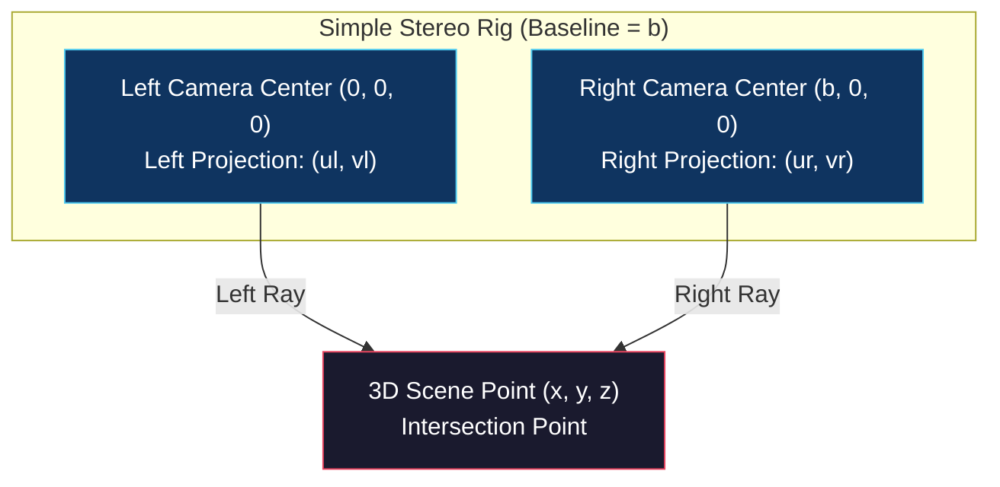

# Simple Stereo Vision and Depth

<!-- toc -->

## 1. Backward Projection Ambiguity

Even when a single camera is fully calibrated with known intrinsic ($K$) and extrinsic ($R, \mathbf{t}$) parameters, **a single 2D image alone is insufficient to reconstruct the 3D depth of a scene**.

Consider a calibrated camera observing a 2D pixel coordinate $(u, v)$ on the image plane. Attempting to recover its unique 3D Euclidean coordinates $(x, y, z)$ encounters a fundamental mathematical limitation.

<figure style="display:flex; justify-content: center; margin: 20px 0;">
  

    
    <figcaption style="margin-top: 0.5em; text-align: center; font-size: 13px; color: #888;"><em>Figure 1: Backward projection ambiguity: Projecting a single pixel $(u,v)$ back into 3D space produces an outgoing ray extending infinitely into the scene.</em></figcaption>
  

</figure>

The pixel $(u,v)$ specifies an outgoing 3D ray originating from the optical center $(0,0,0)$ and passing through the cell center on the image plane:

<figure style="display:flex; justify-content: center; margin: 20px 0;">
  

    
    <figcaption style="margin-top: 0.5em; text-align: center; font-size: 13px; color: #888;"><em>Figure 2: Comparison between 3D-to-2D point projection equations and 2D-to-3D backward ray equations.</em></figcaption>
  

</figure>

$$\text{2D-to-3D Backward Ray:} \quad x = \frac{z}{f_x} (u - o_x), \quad y = \frac{z}{f_y} (v - o_y), \quad z > 0$$

The physical scene point could lie at any depth $z$ along this ray. Thus, recovering depth from a single image is mathematically ill-posed; this is known as **Backward Projection Ambiguity**.

To resolve depth unambiguously, a second camera viewing the scene from a different viewpoint is required to intersect this ray via **triangulation**.

> **Key Insight:** This is why biological vision systems employ two eyes. A single eye provides depth cues through shading and perspective, but binocular vision enables precise 3D depth computation through optical triangulation.

---

## 2. Simple Stereo Geometry

A **Simple Stereo System** consists of two identical cameras placed with parallel optical axes, identical vertical alignment, and separated horizontally by a distance $b$. The horizontal distance $b$ between the optical centers is called the **Baseline**.

<figure style="display:flex; justify-content: center; margin: 20px 0;">
  

    
    <figcaption style="margin-top: 0.5em; text-align: center; font-size: 13px; color: #888;"><em>Figure 3: Simple stereo geometry: Left camera at origin $(0,0,0)$, right camera at $(b,0,0)$. Intersecting rays from both cameras determine the 3D scene point $(x,y,z)$.</em></figcaption>
  

</figure>

In physical hardware, simple stereo systems are built by mounting two identical sensors in a single housing separated by a fixed baseline:

<figure style="display:flex; justify-content: center; margin: 20px 0;">
  

    
    <figcaption style="margin-top: 0.5em; text-align: center; font-size: 13px; color: #888;"><em>Figure 4: Physical stereo camera (Fujifilm 3D HD camera with 75mm fixed baseline).</em></figcaption>
  

</figure>

### Scan-line Correspondence Constraint

Because the cameras differ only by a horizontal shift ($b$ along the $x$-axis), vertical pixel coordinates are identical in both views:

$$v_l = v_r$$

<figure style="display:flex; justify-content: center; margin: 20px 0;">
  

    
    <figcaption style="margin-top: 0.5em; text-align: center; font-size: 13px; color: #888;"><em>Figure 5: Left and right camera images, ground truth disparity map, and vertical scanline equality ($v_l = v_r$).</em></figcaption>
  

</figure>

This geometric constraint eliminates the need to search the entire 2D image plane for matching pixels. The corresponding pixel in the right image must lie **on the exact same horizontal scanline**.

> **Algorithmic Advantage:** Reducing the search space from 2D to 1D drops matching complexity from $O(N^2)$ to $O(N)$, dramatically boosting efficiency and matching accuracy.

---

## 3. Disparity & Depth Relationship

The perspective projection equations for a 3D point $(x, y, z)$ onto the left and right cameras are:

$$\text{Left Camera:} \quad u_l = f_x \frac{x}{z} + o_x \quad \text{and} \quad v_l = f_y \frac{y}{z} + o_y$$

$$\text{Right Camera:} \quad u_r = f_x \frac{x - b}{z} + o_x \quad \text{and} \quad v_r = f_y \frac{y}{z} + o_y$$

<figure style="display:flex; justify-content: center; margin: 20px 0;">
  

    
    <figcaption style="margin-top: 0.5em; text-align: center; font-size: 13px; color: #888;"><em>Figure 6: Searching for template window $T$ along horizontal scanline $L$, defining disparity ($d = u_l - u_r$) and depth ($z = \frac{b f_x}{d}$).</em></figcaption>
  

</figure>

The horizontal pixel shift between corresponding points is defined as **Disparity ($d$)**:

$$d = u_l - u_r$$

Substituting projection equations into the disparity expression yields:

$$d = \left(f_x \frac{x}{z} + o_x\right) - \left(f_x \frac{x - b}{z} + o_x\right) = f_x \frac{b}{z}$$

Triangulating depth and 3D point coordinates from disparity:

$$z = \frac{f_x \cdot b}{u_l - u_r} = \frac{f_x \cdot b}{d}$$

$$x = \frac{b (u_l - o_x)}{u_l - u_r}$$

$$y = \frac{b f_x (v_l - o_y)}{f_y (u_l - u_r)}$$

### Key Physical Principles

1. **Inverse Relationship ($z \propto 1/d$):** Depth is **inversely proportional** to disparity. Nearby objects undergo large pixel shifts (large disparity). As distance increases, disparity shrinks. At infinity ($z \to \infty$), disparity approaches zero ($d \to 0$).
2. **Baseline Scaling ($d \propto b$):** Increasing the baseline $b$ expands disparity across a wider pixel range. For long-range sensing, a wider baseline is essential to maintain depth resolution over discrete pixels.

---

## 4. Stereo Matching Challenges

Computing depth via triangulation requires finding corresponding pixels between left and right images. This process is called **Stereo Matching (The Correspondence Problem)**.

### 4.1 Similarity Metrics: SAD, SSD, and NCC

To match pixels along the horizontal scanline, a template window ($W$) is shifted across the candidate search line:

1. **SAD (Sum of Absolute Differences):** Computes the sum of absolute intensity differences. Computationally fastest:
   $$\text{SAD}(u, v, d) = \sum_{(x,y) \in W} |I_l(u+x, v+y) - I_r(u+x-d, v+y)|$$
2. **SSD (Sum of Squared Differences):** Penalizes larger intensity discrepancies more heavily:
   $$\text{SSD}(u, v, d) = \sum_{(x,y) \in W} (I_l(u+x, v+y) - I_r(u+x-d, v+y))^2$$
3. **NCC (Normalized Cross-Correlation):** Normalizes window intensities by mean and variance. Highly robust against lighting changes and exposure shifts:
   $$\text{NCC}(u, v, d) = \frac{\sum (I_l - \bar{I}_l)(I_r - \bar{I}_r)}{\sqrt{\sum (I_l - \bar{I}_l)^2 \sum (I_r - \bar{I}_r)^2}}$$

### 4.2 Window Size Trade-off

<figure style="display:flex; justify-content: center; margin: 20px 0;">
  

    
    <figcaption style="margin-top: 0.5em; text-align: center; font-size: 13px; color: #888;"><em>Figure 8: Window size trade-off: Small windows ($5 \times 5$) are sensitive to noise; large windows ($30 \times 30$) produce smooth disparity but blur depth boundaries.</em></figcaption>
  

</figure>

* **Small Windows (e.g., $3 \times 3$ or $5 \times 5$):** Provide sharp boundary localization but are sensitive to image noise and spurious matches.
* **Large Windows (e.g., $21 \times 21$ or $31 \times 31$):** Smooth out image noise but blur sharp depth transitions and object boundaries.

### 4.3 Physical Limitations of Stereo Vision

Three main physical scenarios degrade stereo matching performance:

<figure style="display:flex; justify-content: center; margin: 20px 0;">
  

    
    <figcaption style="margin-top: 0.5em; text-align: center; font-size: 13px; color: #888;"><em>Figure 7: Physical challenges in stereo matching: Textureless/repetitive surfaces and foreshortening effects on slanted surfaces.</em></figcaption>
  

</figure>

1. **Textureless Surfaces:** Uniform surfaces (e.g., blank walls) yield flat similarity scores across the scanline, rendering pixel matching ambiguous.
2. **Repetitive Patterns:** Periodic structures (e.g., fences or checkerboards) produce multiple strong correlation peaks, causing matching ambiguity.
3. **Foreshortening:** Slanted surfaces viewed from different angles undergo non-uniform pixel compression, degrading window correlation.

<figure style="display:flex; justify-content: center; margin: 20px 0;">
  

    
    <figcaption style="margin-top: 0.5em; text-align: center; font-size: 13px; color: #888;"><em>Figure 9: Comparison of stereo matching algorithms: Standard SSD, Adaptive Windowing, and State-of-the-Art global optimization.</em></figcaption>
  

</figure>

Modern approaches overcome local window limitations using **Adaptive Windows**, **Global Optimization (Graph Cuts, Belief Propagation)**, and **Deep Learning Stereo Architectures (Stereo CNNs)**.
