# Structure from Motion and Tomasi-Kanade Factorization

<!-- toc -->

One of the most elegant, powerful, and mathematically profound achievements in computer vision is the simultaneous recovery of both the 3D geometric structure of a scene and the 3D motion trajectory of the camera from an uncalibrated casual video stream. 

This chapter presents a comprehensive, mathematically rigorous treatment of the **Structure from Motion (SfM)** problem and the seminal **Tomasi-Kanade Factorization Algorithm** introduced by Carlo Tomasi and Takeo Kanade (1992). We explore the formulation of the **Observation Matrix**, the algebraic beauty of the **Centering Trick**, the fundamental **Rank Theorem**, noise filtering via **Singular Value Decomposition (SVD)**, and the resolution of the affine ambiguity via **Orthonormality Constraints** to extract the metric transformation matrix $Q$.

---

## 1. Overview and Historical Foundations

In classical calibrated stereo and multi-view systems, the geometric relationship between cameras (baseline $b$, rotation matrix $R$, translation vector $\mathbf{t}$) is either calibrated beforehand or determined via pairwise epipolar geometry. However, traditional setups require rigid, pre-calibrated multi-camera rigs or are constrained to two stationary viewpoints.

**Structure from Motion (SfM)** removes these constraints entirely, solving a far more general and powerful reconstruction problem:

1. **Casual Video Stream:** The input is a single video sequence ($F$ frames) recorded by an uncalibrated, handheld moving camera where camera motion parameters (rotations and translations) are completely unknown a priori.
2. **Simultaneous Estimation:** Without any auxiliary sensors, calibration targets, or depth hardware, the algorithm simultaneously estimates:
   - The 3D metric coordinate point cloud of the scene (**Scene Structure - $S$**),
   - The 3D orientation and motion path of the camera across all frames (**Camera Motion - $M$**).

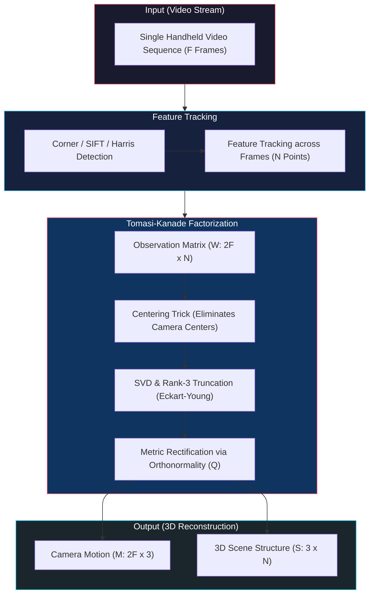

In 1992, **Carlo Tomasi and Takeo Kanade** introduced a landmark factorization method based on an orthographic camera model. They proved that when centroid-subtracted 2D feature trajectories are stacked into a massive $2F \times N$ **Observation Matrix ($W$)**, the matrix has an algebraic rank of at most **3** (**The Rank Theorem**). 

This rank constraint allows the matrix to be directly decomposed into the product of camera motion and scene structure using **Singular Value Decomposition (SVD)**. Today, this foundational theorem underpins modern visual SLAM (Simultaneous Localization and Mapping), photogrammetry, and internet-scale 3D scene reconstruction algorithms (e.g., COLMAP, Bundler).

> **Key Insight:** Regardless of how many frames are captured ($F \gg 3$) or how many feature points are tracked ($N \gg 3$), the noise-free observation matrix resides in a compact 3-dimensional linear subspace. This low-rank property allows simultaneous global noise suppression and closed-form factorization.

---

## 2. The Structure from Motion Problem (SfM Problem)

The input to the orthographic SfM algorithm is an image sequence of a rigid scene captured by a moving camera. The mathematical formulation begins with feature tracking and camera projection modeling.

### 2.1 Feature Detection and Tracking

To establish correspondences across the entire video sequence:

1. **Feature Detection:** Salient and repeatable interest points (e.g., Harris corners, SIFT keypoints, or Kanade-Lucas-Tomasi / KLT features) are detected in the initial frame.
2. **Feature Tracking:** These points are continuously tracked across all consecutive video frames using template matching, optical flow (Lucas-Kanade), or descriptor matching.

<figure style="display:flex; justify-content: center; margin: 20px 0;">
  

    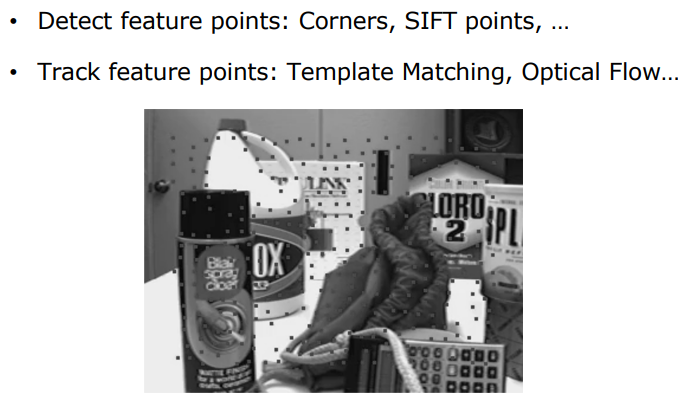
    <figcaption style="margin-top: 0.5em; text-align: center; font-size: 13px; color: #888;"><em>Figure 1: Feature point detection (Harris/SIFT corners) and sequential tracking across video frames using optical flow.</em></figcaption>
  

</figure>

The output of the tracking stage is a set of 2D image coordinates for $N$ scene points observed across $F$ frames:

$$\left\\{ (u_{f,p}, v_{f,p}) \right\\} \quad \text{where} \quad f \in \\{1, \dots, F\\} \quad \text{and} \quad p \in \\{1, \dots, N\\}$$

### 2.2 Orthographic Camera Assumption

To convert the non-linear perspective projection into a tractable linear formulation, the Tomasi-Kanade algorithm assumes an **Orthographic (Parallel Projection) Camera Model**.

<figure style="display:flex; justify-content: center; margin: 20px 0;">
  

    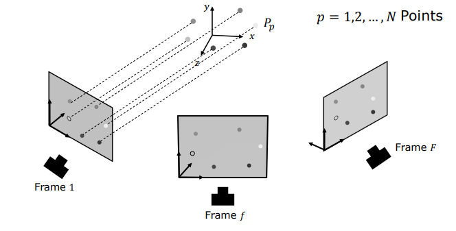
    <figcaption style="margin-top: 0.5em; text-align: center; font-size: 13px; color: #888;"><em>Figure 2: Orthographic projection of N 3D scene points ($P_p$) onto F video frames via parallel projection rays.</em></figcaption>
  

</figure>

This assumption is physically well-justified under the following conditions:

- **Shallow Depth Variation:** When the variation in depth across the object ($\Delta z$) is much smaller than the average distance from the camera to the object ($Z_0$), i.e., $\Delta z \ll Z_0$:
  
  $$\frac{\Delta z}{Z_0} \approx 0 \implies \text{Perspective Scale Factor} \approx \text{Constant}$$

- **Constant Magnification:** All points on the object experience approximately identical magnification, making perspective foreshortening negligible.
- **Parallel Projection Rays:** Projection rays are parallel lines orthogonal to the image plane rather than converging at a single pinhole focal point.

---

## 3. Constructing the Observation Matrix

Let us mathematically analyze how a 3D scene point projects onto the 2D image plane under orthography.

### 3.1 Orthographic Projection in Camera Coordinates

Let the origin of the camera coordinate frame be located at the camera center $C$. We define two orthonormal unit vectors, $\mathbf{i}$ (horizontal row direction) and $\mathbf{j}$ (vertical column direction), aligned with the sensor coordinate axes.

<figure style="display:flex; justify-content: center; margin: 20px 0;">
  

    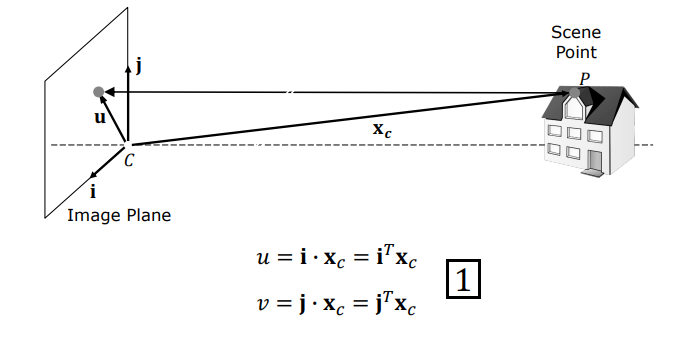
    <figcaption style="margin-top: 0.5em; text-align: center; font-size: 13px; color: #888;"><em>Figure 3: Geometry of orthographic projection in the camera reference frame: scene point P, relative position vector $\mathbf{x}_c$, and projected pixel coordinates $(u, v)$.</em></figcaption>
  

</figure>

Let $\mathbf{x}_c$ be the position vector of a 3D scene point $P$ in the camera frame. Under orthographic projection, the pixel coordinates $(u, v)$ on the image plane are given by the dot products of $\mathbf{x}_c$ with the unit directional vectors $\mathbf{i}$ and $\mathbf{j}$:

$$u = \mathbf{i} \cdot \mathbf{x}_c = \mathbf{i}^T \mathbf{x}_c$$

$$v = \mathbf{j} \cdot \mathbf{x}_c = \mathbf{j}^T \mathbf{x}_c$$

### 3.2 Transition to the World Coordinate Frame

Now consider a fixed world coordinate frame ($\mathcal{W}$) with an arbitrary origin $O$.

<figure style="display:flex; justify-content: center; margin: 20px 0;">
  

    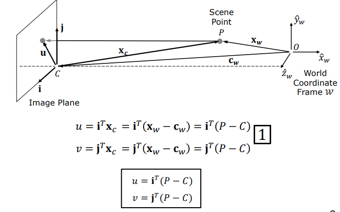
    <figcaption style="margin-top: 0.5em; text-align: center; font-size: 13px; color: #888;"><em>Figure 4: World coordinate frame $\mathcal{W}$ with origin O, scene point $P = \mathbf{x}_w$, camera center $C = \mathbf{c}_w$, and relative displacement $\mathbf{x}_c = \mathbf{x}_w - \mathbf{c}_w$.</em></figcaption>
  

</figure>

- The 3D position of scene point $p$ in world coordinates is $P_p = \mathbf{x}_w$.
- The 3D physical position of the camera center for frame $f$ in world coordinates is $C_f = \mathbf{c}_w$.

By vector subtraction, the camera-relative position vector is:

$$\mathbf{x}_c = \mathbf{x}_w - \mathbf{c}_w = P_p - C_f$$

Substituting this into our projection equations yields the observed 2D coordinates of point $p$ in frame $f$:

$$u_{f,p} = \mathbf{i}_f^T (P_p - C_f) = \mathbf{i}_f^T P_p - \mathbf{i}_f^T C_f$$

$$v_{f,p} = \mathbf{j}_f^T (P_p - C_f) = \mathbf{j}_f^T P_p - \mathbf{j}_f^T C_f$$

Here:
- $P_p \in \mathbb{R}^3$: Unknown 3D coordinates of scene point $p$ ($p = 1, \dots, N$).
- $\mathbf{i}_f, \mathbf{j}_f \in \mathbb{R}^3$: Unknown 3D camera orientation unit vectors for frame $f$ ($f = 1, \dots, F$).
- $C_f \in \mathbb{R}^3$: Unknown 3D camera position for frame $f$ ($f = 1, \dots, F$).

### 3.3 Multi-Frame Geometry and Unknown Parameters

<figure style="display:flex; justify-content: center; margin: 20px 0;">
  

    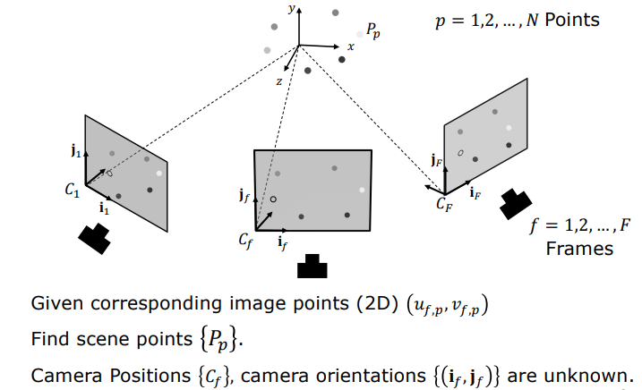
    <figcaption style="margin-top: 0.5em; text-align: center; font-size: 13px; color: #888;"><em>Figure 5: Multi-frame SfM formulation showing unknown camera positions $\{C_f\}$, unknown camera orientations $\{(\mathbf{i}_f, \mathbf{j}_f)\}$, and unknown 3D scene points $\{P_p\}$.</em></figcaption>
  

</figure>

In this system, we have $2FN$ measured pixel coordinates $(u_{f,p}, v_{f,p})$. However, the camera translations $C_f$ introduce redundant translational parameters coupled with the orientations. To decouple camera translations from rotations and 3D structure, Tomasi and Kanade introduced the **Centering Trick**.

### 3.4 The Centering Trick (Eliminating Camera Positions)

Since the world coordinate origin can be placed anywhere without loss of generality, we place the world origin directly at the **3D Centroid ($\bar{P}$)** of all $N$ scene points.

<figure style="display:flex; justify-content: center; margin: 20px 0;">
  

    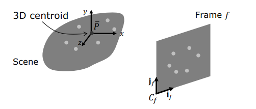
    <figcaption style="margin-top: 0.5em; text-align: center; font-size: 13px; color: #888;"><em>Figure 6: Placing the origin of the world coordinate system at the 3D centroid ($\bar{P}$) of all scene points.</em></figcaption>
  

</figure>

Under this choice of origin:

$$\sum_{p=1}^N P_p = \mathbf{0} \iff \frac{1}{N}\sum_{p=1}^N P_p = \mathbf{0}$$

Now, let us compute the 2D image centroid $(\bar{u}_f, \bar{v}_f)$ of all tracked points in frame $f$:

$$\bar{u}\_f = \frac{1}{N} \sum\_{p=1}^N u\_{f,p} = \frac{1}{N} \sum\_{p=1}^N \left( \mathbf{i}\_f^T P\_p - \mathbf{i}\_f^T C\_f \right)$$

Splitting this summation:

$$\bar{u}\_f = \mathbf{i}\_f^T \left( \frac{1}{N} \sum\_{p=1}^N P\_p \right) - \frac{1}{N} \sum\_{p=1}^N \left( \mathbf{i}\_f^T C\_f \right)$$

Because $\sum P_p = \mathbf{0}$, the first term vanishes completely. The second term is independent of $p$, simplifying directly to:

$$\bar{u}\_f = -\mathbf{i}\_f^T C\_f \quad \text{and similarly} \quad \bar{v}\_f = -\mathbf{j}\_f^T C\_f$$

Subtracting these frame centroids from the raw pixel measurements yields the **centroid-subtracted coordinates** $(\tilde{u}_{f,p}, \tilde{v}_{f,p})$:

$$\tilde{u}\_{f,p} = u\_{f,p} - \bar{u}\_f = \left( \mathbf{i}\_f^T P\_p - \mathbf{i}\_f^T C\_f \right) - \left( -\mathbf{i}\_f^T C\_f \right) = \mathbf{i}\_f^T P\_p$$

$$\tilde{v}\_{f,p} = v\_{f,p} - \bar{v}\_f = \left( \mathbf{j}\_f^T P\_p - \mathbf{j}\_f^T C\_f \right) - \left( -\mathbf{j}\_f^T C\_f \right) = \mathbf{j}\_f^T P\_p$$

> **Key Theoretical Breakthrough:** The centering trick completely eliminates the unknown camera translation vectors $C_f$ from the system! We are left with purely bilinear equations involving only camera orientations ($\mathbf{i}_f, \mathbf{j}_f$) and 3D structure ($P_p$):
> 
> $$\tilde{u}\_{f,p} = \mathbf{i}\_f^T P\_p \quad \text{and} \quad \tilde{v}\_{f,p} = \mathbf{j}\_f^T P\_p$$

### 3.5 Matrix Formulation: $W = M \cdot S$

Collecting all centered coordinates across all $F$ frames and all $N$ points into a single matrix gives the fundamental factorization equation.

<figure style="display:flex; justify-content: center; margin: 20px 0;">
  

    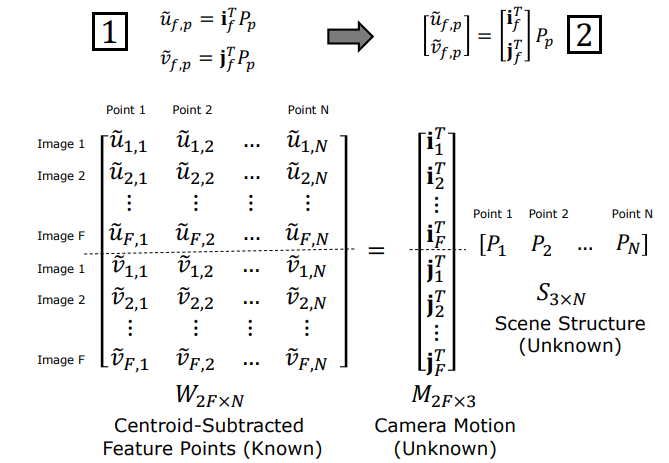
    <figcaption style="margin-top: 0.5em; text-align: center; font-size: 13px; color: #888;"><em>Figure 7: Matrix equation $W_{2F \times N} = M_{2F \times 3} \cdot S_{3 \times N}$ relating Centroid-Subtracted Feature Points ($W$), Camera Motion ($M$), and Scene Structure ($S$).</em></figcaption>
  

</figure>

For each frame $f$ and point $p$:

$$\begin{bmatrix} \tilde{u}\_{f,p} \\\\ \tilde{v}\_{f,p} \end{bmatrix} = \begin{bmatrix} \mathbf{i}\_f^T \\\\ \mathbf{j}\_f^T \end{bmatrix} P\_p$$

Stacking all entries:

$$\mathbf{W}\_{2F \times N} = \mathbf{M}\_{2F \times 3} \cdot \mathbf{S}\_{3 \times N}$$

#### 1. Observation Matrix ($W$)
The $2F \times N$ matrix of known, centered 2D point tracks:

$$W = \left[ \begin{array}{cccc} 
\tilde{u}\_{1,1} & \tilde{u}\_{1,2} & \dots & \tilde{u}\_{1,N} \\\\
\tilde{u}\_{2,1} & \tilde{u}\_{2,2} & \dots & \tilde{u}\_{2,N} \\\\
\vdots & \vdots & \ddots & \vdots \\\\
\tilde{u}\_{F,1} & \tilde{u}\_{F,2} & \dots & \tilde{u}\_{F,N} \\\\
\hline
\tilde{v}\_{1,1} & \tilde{v}\_{1,2} & \dots & \tilde{v}\_{1,N} \\\\
\tilde{v}\_{2,1} & \tilde{v}\_{2,2} & \dots & \tilde{v}\_{2,N} \\\\
\vdots & \vdots & \ddots & \vdots \\\\
\tilde{v}\_{F,1} & \tilde{v}\_{F,2} & \dots & \tilde{v}\_{F,N}
\end{array} \right]_{2F \times N}$$

#### 2. Camera Motion Matrix ($M$)
The $2F \times 3$ matrix of unknown camera orientation vectors:

$$M = \left[ \begin{array}{c} 
\mathbf{i}\_1^T \\\\
\mathbf{i}\_2^T \\\\
\vdots \\\\
\mathbf{i}\_F^T \\\\
\hline
\mathbf{j}\_1^T \\\\
\mathbf{j}\_2^T \\\\
\vdots \\\\
\mathbf{j}\_F^T
\end{array} \right]_{2F \times 3}$$

#### 3. Scene Structure Matrix ($S$)
The $3 \times N$ matrix of unknown 3D scene point coordinates:

$$S = \begin{bmatrix} P_1 & P_2 & \dots & P_N \end{bmatrix}_{3 \times N}$$

---

## 4. Rank of the Observation Matrix

The core discovery that enables Tomasi-Kanade factorization is the algebraic rank property of $W$.

### 4.1 Linear Independence and Vector Spaces (Math Primer)

A set of vectors is **linearly independent** if no vector in the set can be written as a linear combination of the others.

<figure style="display:flex; justify-content: center; margin: 20px 0;">
  

    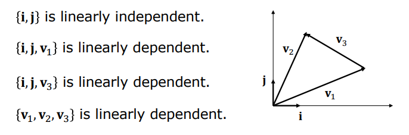
    <figcaption style="margin-top: 0.5em; text-align: center; font-size: 13px; color: #888;"><em>Figure 8: In 2D space, $\{\mathbf{i}, \mathbf{j}\}$ forms a linearly independent basis, whereas adding any third vector ($\mathbf{v}_1$) creates linear dependence.</em></figcaption>
  

</figure>

- In a 2D plane, at most 2 linearly independent vectors can exist. Any third vector is necessarily linearly dependent.
- In 3D space, at most 3 linearly independent vectors can exist.

### 4.2 Matrix Rank and Dimensional Bounds

For an $m \times n$ matrix $A$:
- **Column Rank:** Maximum number of linearly independent columns.
- **Row Rank:** Maximum number of linearly independent rows.

<figure style="display:flex; justify-content: center; margin: 20px 0;">
  

    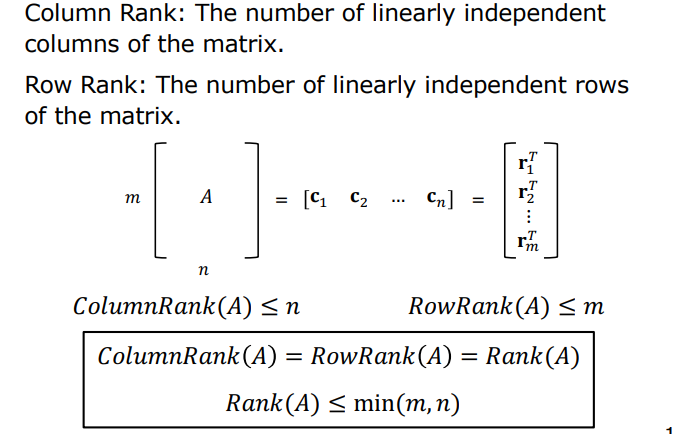
    <figcaption style="margin-top: 0.5em; text-align: center; font-size: 13px; color: #888;"><em>Figure 9: Column rank always equals row rank, bounded by $\text{Rank}(A) \leq \min(m, n)$.</em></figcaption>
  

</figure>

Fundamental linear algebra establishes that column rank equals row rank:

$$\text{ColumnRank}(A) = \text{RowRank}(A) = \text{Rank}(A) \leq \min(m, n)$$

Furthermore, the rank of a matrix product is bounded by the individual ranks:

$$\text{Rank}(A \cdot B) \leq \min(\text{Rank}(A), \text{Rank}(B))$$

### 4.3 Rank Geometry in 3D Space

Let us visualize the geometric meaning of rank for a $3 \times 3$ matrix $A = [\mathbf{a} \ \mathbf{b} \ \mathbf{c}]$:

#### Rank 1 (1D Line)
All column vectors are collinear (scalar multiples of one another), spanning only a 1D line:

<figure style="display:flex; justify-content: center; margin: 20px 0;">
  

    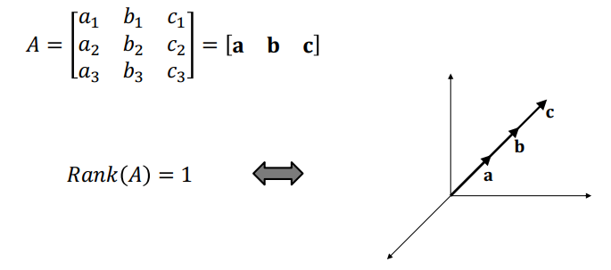
    <figcaption style="margin-top: 0.5em; text-align: center; font-size: 13px; color: #888;"><em>Figure 10: $\text{Rank}(A) = 1$: Columns are collinear, spanning a 1D line.</em></figcaption>
  

</figure>

#### Rank 2 (2D Plane)
Column vectors are coplanar, spanning a 2D plane:

<figure style="display:flex; justify-content: center; margin: 20px 0;">
  

    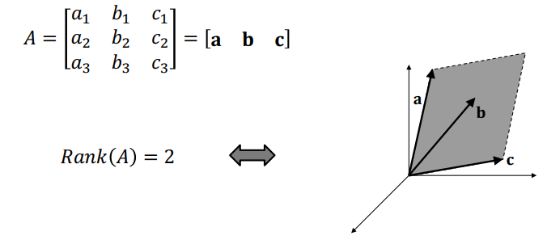
    <figcaption style="margin-top: 0.5em; text-align: center; font-size: 13px; color: #888;"><em>Figure 11: $\text{Rank}(A) = 2$: Columns lie on a common 2D plane.</em></figcaption>
  

</figure>

#### Rank 3 (3D Volume)
Column vectors span the entire 3D volume (full rank):

<figure style="display:flex; justify-content: center; margin: 20px 0;">
  

    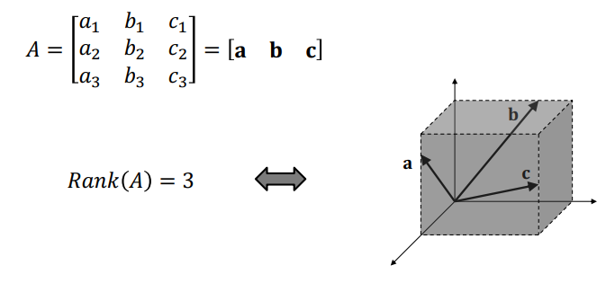
    <figcaption style="margin-top: 0.5em; text-align: center; font-size: 13px; color: #888;"><em>Figure 12: $\text{Rank}(A) = 3$: Columns are linearly independent and span full 3D space.</em></figcaption>
  

</figure>

### 4.4 Proof of the Rank Theorem

Applying these rank rules to our observation equation $W = M \cdot S$:

1. $M$ is a $2F \times 3$ matrix. Hence:
   
   $$\text{Rank}(M) \leq \min(2F, 3) = 3$$

2. $S$ is a $3 \times N$ matrix. Hence:
   
   $$\text{Rank}(S) \leq \min(3, N) = 3$$

3. Applying the product rank theorem:
   
   $$\text{Rank}(W) \leq \min(\text{Rank}(M), \text{Rank}(S)) \leq 3$$

> **The Tomasi-Kanade Rank Theorem (1992):**
> Under orthographic projection and in the absence of noise, the $2F \times N$ Observation Matrix $W$ has a rank of **AT MOST 3**, regardless of how many frames $F$ are recorded or how many points $N$ are tracked.
> 
> $$\text{Rank}(W) \leq 3$$

This theorem is of paramount importance: even if $W$ contains millions of measurements ($2F \times N$), all data points lie strictly within a 3D subspace. Any non-zero singular values beyond rank 3 are solely due to measurement and tracking noise.

---

## 5. The Tomasi-Kanade Factorization Algorithm

Using the Rank Theorem, we can decompose $W$ into $M$ and $S$ using Singular Value Decomposition (SVD).

### 5.1 Singular Value Decomposition (SVD)

Any $2F \times N$ matrix $W$ can be factored via SVD into:

$$W = U \cdot \Sigma \cdot V^T$$

<figure style="display:flex; justify-content: center; margin: 20px 0;">
  

    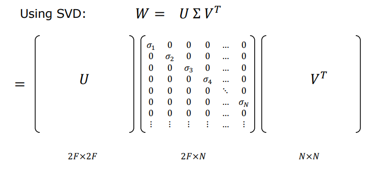
    <figcaption style="margin-top: 0.5em; text-align: center; font-size: 13px; color: #888;"><em>Figure 13: SVD decomposition of $W_{2F \times N}$ into orthonormal $U_{2F \times 2F}$, diagonal $\Sigma_{2F \times N}$, and orthonormal $V^T_{N \times N}$.</em></figcaption>
  

</figure>

Where:
- $U \in \mathbb{R}^{2F \times 2F}$ contains orthonormal left singular vectors ($U^T U = I$).
- $V^T \in \mathbb{R}^{N \times N}$ contains orthonormal right singular vectors ($V^T V = I$).
- $\Sigma \in \mathbb{R}^{2F \times N}$ contains non-negative singular values sorted in descending order: $\sigma_1 \geq \sigma_2 \geq \sigma_3 \geq \sigma_4 \geq \dots \geq 0$.

### 5.2 Rank-3 Truncation and Economical Representation

In an ideal noise-free scenario, $\text{Rank}(W) \le 3$, meaning all singular values beyond $\sigma_3$ are exactly zero:

$$\sigma_1 \geq \sigma_2 \geq \sigma_3 > 0 \quad \text{and} \quad \sigma_4 = \sigma_5 = \dots = 0$$

In real-world data, tracking noise causes $\sigma_4, \sigma_5, \dots$ to be small positive values. By the **Eckart-Young-Mirsky Theorem**, setting $\sigma_i = 0$ for all $i > 3$ yields the optimal rank-3 approximation in the Frobenius norm sense:

<figure style="display:flex; justify-content: center; margin: 20px 0;">
  

    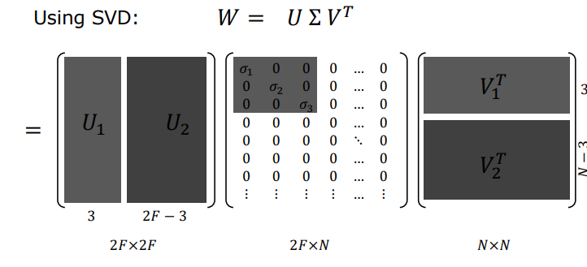
    <figcaption style="margin-top: 0.5em; text-align: center; font-size: 13px; color: #888;"><em>Figure 14: SVD block partitioning showing the dominant rank-3 components ($U_1, \Sigma_1, V_1^T$) and discarded noise components ($U_2, V_2^T$).</em></figcaption>
  

</figure>

Partitioning into submatrices:
- $U = \begin{bmatrix} U\_1 & U\_2 \end{bmatrix}$ where $U\_1$ is $2F \times 3$.
- $\Sigma = \begin{bmatrix} \Sigma\_1 & 0 \\\\ 0 & \Sigma\_2 \end{bmatrix}$ where $\Sigma\_1 = \text{diag}(\sigma\_1, \sigma\_2, \sigma\_3)$ is $3 \times 3$.
- $V^T = \begin{bmatrix} V\_1^T \\\\ V\_2^T \end{bmatrix}$ where $V\_1^T$ is $3 \times N$.

Truncating noise blocks yields the **Economical SVD Representation**:

$$W \approx U\_1 \cdot \Sigma\_1 \cdot V\_1^T$$

### 5.3 Factorization and Affine Ambiguity

Since $\Sigma\_1$ is positive diagonal, its square root $\Sigma\_1^{1/2} = \text{diag}(\sqrt{\sigma\_1}, \sqrt{\sigma\_2}, \sqrt{\sigma\_3})$ is well-defined. Distributing $\Sigma\_1^{1/2}$ symmetrically:

$$\hat{M} = U\_1 \Sigma\_1^{1/2} \quad (2F \times 3) \quad \text{and} \quad \hat{S} = \Sigma\_1^{1/2} V\_1^T \quad (3 \times N)$$

Thus, $W \approx \hat{M} \cdot \hat{S}$.

However, this solution suffers from **Affine Ambiguity**: for any invertible $3 \times 3$ matrix $Q$, inserting $Q Q^{-1} = I$ preserves the equality:

$$W = \hat{M} \hat{S} = \left( \hat{M} Q \right) \left( Q^{-1} \hat{S} \right) = M \cdot S$$

Therefore, $\hat{M}$ and $\hat{S}$ are merely affine-distorted versions of the true physical motion and metric structure:

$$M = \hat{M} Q \quad \text{and} \quad S = Q^{-1} \hat{S}$$

To recover true Euclidean metric motion and 3D structure, we must compute the unique $3 \times 3$ transformation matrix $Q$.

### 5.4 Metric Rectification via Orthonormality Constraints

To resolve the 9 unknowns of $Q$, we exploit the physical geometry of the camera sensor: the row vectors $\mathbf{i}\_f$ and $\mathbf{j}\_f$ must be **orthonormal unit vectors**.

For every frame $f$, three geometric constraints must strictly hold:

$$\mathbf{i}\_f^T \mathbf{i}\_f = 1 \quad (\text{Unit length constraint for } \mathbf{i})$$

$$\mathbf{j}\_f^T \mathbf{j}\_f = 1 \quad (\text{Unit length constraint for } \mathbf{j})$$

$$\mathbf{i}\_f^T \mathbf{j}\_f = 0 \quad (\text{Orthogonality constraint})$$

Let $\hat{\mathbf{i}}\_f^T$ and $\hat{\mathbf{j}}\_f^T$ denote the rows of the unrectified motion matrix $\hat{M}$. Since $M = \hat{M} Q$, the true orientation vectors are $\mathbf{i}\_f = Q^T \hat{\mathbf{i}}\_f$ and $\mathbf{j}\_f = Q^T \hat{\mathbf{j}}\_f$. Substituting into the orthonormality conditions:

$$\hat{\mathbf{i}}\_f^T \left( Q Q^T \right) \hat{\mathbf{i}}\_f = 1$$

$$\hat{\mathbf{j}}\_f^T \left( Q Q^T \right) \hat{\mathbf{j}}\_f = 1$$

$$\hat{\mathbf{i}}\_f^T \left( Q Q^T \right) \hat{\mathbf{j}}\_f = 0$$

The unknown to be solved is the symmetric matrix **$L = Q Q^T$**:

$$L = Q Q^T = \begin{bmatrix} 
l_1 & l_2 & l_3 \\\\
l_2 & l_4 & l_5 \\\\
l_3 & l_5 & l_6
\end{bmatrix}_{3 \times 3}$$

- $L$ is symmetric positive-definite and contains **only 6 independent unknowns**.
- Each frame provides 3 linear equations.
- For $F \geq 3$ frames, we obtain $3F \geq 9$ equations, forming an overdetermined linear system solvable via **Linear Least Squares**.

Once $L$ is computed, we extract $Q$ using **Cholesky Decomposition** or SVD:

$$L = U\_L \Sigma\_L U\_L^T \implies Q = U\_L \Sigma\_L^{1/2}$$

Finally, the metric camera motion $M$ and metric 3D scene structure $S$ are recovered:

$$\mathbf{M} = \hat{M} Q \quad \text{and} \quad \mathbf{S} = Q^{-1} \hat{S}$$

### 5.5 Experimental Validation: Classic Tomasi-Kanade Results

In their original 1992 experiments, Tomasi and Kanade validated the algorithm on a toy house model rotated on a turntable.

<figure style="display:flex; justify-content: center; margin: 20px 0;">
  

    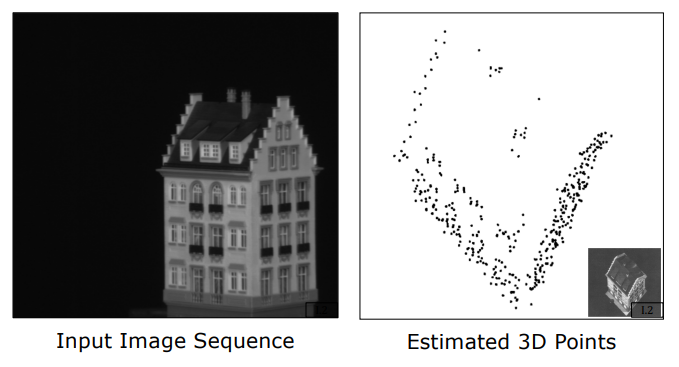
    <figcaption style="margin-top: 0.5em; text-align: center; font-size: 13px; color: #888;"><em>Figure 15: The classic Tomasi-Kanade experiment: Input image sequence of a toy house and the computed 3D point cloud structure.</em></figcaption>
  

</figure>

The reconstructed 3D point cloud showed sub-millimeter geometric accuracy and reconstructed clean perpendicular building walls without any prior calibration.

---

## 6. Algorithmic Comparison Matrix

| Algorithmic Step | Mathematical Structure | Purpose / Role | Core Strength / Advantage | Key Limitation / Challenge |
| :--- | :--- | :--- | :--- | :--- |
| **Centering Trick** | Vector subtraction ($\tilde{u} = u - \bar{u}$) | Eliminates camera translations ($C_f$) | Drastically reduces unknowns and linearizes the system | Requires all points to be tracked continuously across all frames |
| **Observation Matrix ($W$)** | $2F \times N$ dense data matrix | Stacks all 2D trajectory observations | Unifies motion and structure into a bilinear model $W = M \cdot S$ | Outlier tracks or mismatch errors distort the matrix |
| **Rank Theorem** | $\text{Rank}(W) \leq 3$ bound | Constrains theoretical information dimension | Provides subspace basis for global noise suppression | Strictly valid only under orthographic (parallel) projection |
| **SVD & Rank-3 Truncation** | $W \approx U_1 \Sigma_1 V_1^T$ truncation | Projects noisy data onto nearest Rank-3 subspace | Globally optimal least-squares denoising (Eckart-Young) | Weak features may be suppressed by singular value cutoff |
| **Orthonormality Rectification** | $3F$ equations for $L = Q Q^T$ | Resolves affine ambiguity to find metric $M, S$ | Guarantees true Euclidean rotation matrices for camera motion | Potential breakdown if $L$ fails to be positive-definite |

---

## 7. Results, Dense Reconstruction, and Modern SfM Extensions

### 7.1 Dense 3D Surface Reconstruction

While basic factorization produces a sparse point cloud, triangulating tracked features (e.g., Delaunay triangulation) and projecting image intensities via texture mapping yields photorealistic 3D models:

<figure style="display:flex; justify-content: center; margin: 20px 0;">
  

    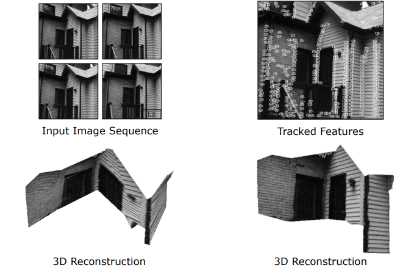
    <figcaption style="margin-top: 0.5em; text-align: center; font-size: 13px; color: #888;"><em>Figure 16: Full architectural reconstruction: Input image sequence, tracked feature points, and textured 3D mesh surface.</em></figcaption>
  

</figure>

### 7.2 Modern Extensions: Projective Factorization and Visual SLAM

The Tomasi-Kanade framework inspired several modern paradigms:

1. **Projective Factorization:** Algorithms by Sturm & Triggs and Hartley extended factorization to perspective cameras by iteratively estimating projective depth weights.
2. **Handling Occlusions (Matrix Completion):** Real-world video contains features that enter and exit the frame. Modern methods use low-rank matrix completion and Expectation-Maximization (EM) to handle missing data.
3. **Internet-Scale SfM:** Pipelines like COLMAP and Bundler combine multi-view geometry, pairwise epipolar verification, and non-linear Bundle Adjustment to reconstruct entire cities from unorganized photo collections.

<figure style="display:flex; justify-content: center; margin: 20px 0;">
  

    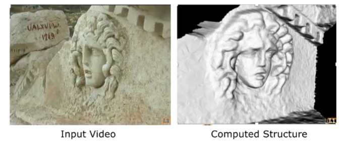
    <figcaption style="margin-top: 0.5em; text-align: center; font-size: 13px; color: #888;"><em>Figure 17: Modern Structure from Motion application: High-resolution 3D surface model computed from handheld video of an archaeological stone relief (Medusa).</em></figcaption>
  

</figure>

---

## 8. Summary of Key Concepts

1. **Simultaneous Estimation:** SfM simultaneously recovers 3D scene structure ($S$) and 3D camera trajectory ($M$) from an uncalibrated video stream without active depth sensors.
2. **Centering Trick:** Translating the world origin to the 3D centroid of scene points eliminates camera translations ($C_f$), yielding the clean linear form $W = M \cdot S$.
3. **Rank Theorem:** Under orthography, the $2F \times N$ observation matrix has rank at most 3 ($\text{Rank}(W) \leq 3$).
4. **SVD Denoising:** SVD truncates singular values beyond rank 3, suppressing measurement noise via optimal low-rank projection ($W \approx U_1 \Sigma_1 V_1^T$).
5. **Metric Rectification:** The affine ambiguity is resolved by enforcing camera orthonormality ($\mathbf{i}_f^T \mathbf{i}_f = 1, \mathbf{j}_f^T \mathbf{j}_f = 1, \mathbf{i}_f^T \mathbf{j}_f = 0$), solving $L = Q Q^T$ linearly to recover the true metric reconstruction.
