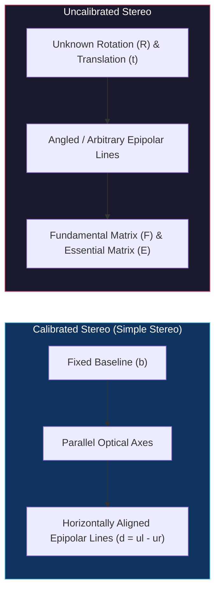
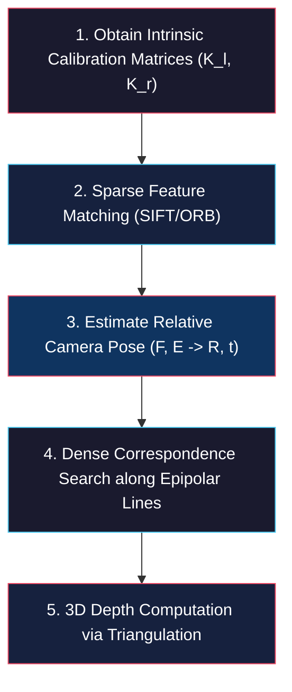

# Uncalibrated Stereo Vision and Epipolar Geometry

<!-- toc -->

One of the most exciting and powerful domains of computer vision is reconstructing the three-dimensional (3D) geometry of a scene from scratch without prior knowledge of camera positions or orientations ($R, \mathbf{t}$). By leveraging pixel correspondences across multiple uncalibrated images alongside intrinsic optical parameters, 3D structure can be estimated robustly. This note provides an in-depth treatment of **Epipolar Geometry**, **Essential Matrix ($E$)**, **Fundamental Matrix ($F$)** estimation via the 8-point algorithm, **1D Epipolar Search** for dense correspondence, **Linear Triangulation**, and the physiological/psychophysical mechanisms of **Stereo Vision in Nature (Stereopsis)** based on the Columbia CAVE curriculum (Prof. Shree K. Nayar).

---

## 1. Overview

In calibrated (simple) stereo systems, the cameras are fixed, their optical axes are strictly parallel, their vertical rows are aligned, and the horizontal baseline distance ($b$) between them is known with millimeter precision.

<figure style="display:flex; justify-content: center; margin: 20px 0;">
  

    
    <figcaption style="margin-top: 0.5em; text-align: center; font-size: 13px; color: #888;"><em>Figure 1: Review of calibrated (simple) stereo constraints: Parallel optical axes, horizontal baseline b, and aligned epipolar lines.</em></figcaption>
  

</figure>

In a simple stereo rig where the left camera is at $(0,0,0)$ and the right camera is displaced at $(b,0,0)$, 3D coordinates $(x,y,z)$ are recovered directly from pixel coordinates $(u_l, v_l), (u_r, v_r)$ and horizontal disparity ($d = u_l - u_r$):

$$x = \frac{b(u_l - o_x)}{u_l - u_r}, \quad y = \frac{b \cdot f_x (v_l - o_y)}{f_y (u_l - u_r)}, \quad z = \frac{b \cdot f_x}{u_l - u_r}$$

However, in real-world scenarios—such as crowd-sourced tourist photos or handheld mobile captures—the relative 3D positions and rotation angles of the cameras are completely unknown.

**Uncalibrated Stereo** enables 3D scene reconstruction from two or more arbitrary images without pre-measuring relative camera translation ($\mathbf{t}$) or rotation ($R$).

Assuming camera intrinsic calibration matrices ($K_l, K_r$) can be obtained (e.g., from EXIF metadata), the uncalibrated stereo pipeline analyzes geometric epipolar constraints to recover relative pose parameters ($R, \mathbf{t}$) and compute dense scene depth simultaneously.

> **Key Insight:** Uncalibrated stereo forms the foundational mathematical engine of modern **Structure from Motion (SfM)** and **Photo Tourism** pipelines. Even with zero prior pose information, 3D world coordinates are successfully recovered strictly from pixel feature matches.

---

## 2. Problem of Uncalibrated Stereo

The core objective of uncalibrated stereo is recovering 3D scene structure from two uncalibrated views with an unknown spatial relationship ($R, \mathbf{t}$).

<figure style="display:flex; justify-content: center; margin: 20px 0;">
  

    
    <figcaption style="margin-top: 0.5em; text-align: center; font-size: 13px; color: #888;"><em>Figure 2: The uncalibrated stereo problem: Arbitrary camera positions and orientations viewing a 3D scene.</em></figcaption>
  

</figure>

The problem is resolved through a systematic 5-step processing pipeline:

<figure style="display:flex; justify-content: center; margin: 20px 0;">
  

    
    <figcaption style="margin-top: 0.5em; text-align: center; font-size: 13px; color: #888;"><em>Figure 3: Overview of the 5-step uncalibrated stereo reconstruction pipeline and geometric parameters.</em></figcaption>
  

</figure>

### 2.1 Step-by-Step Pipeline Breakdown

1. **Obtaining Intrinsic Parameters:** Intrinsic matrices ($K_l, K_r$) containing focal lengths ($f_x, f_y$) and principal points ($o_x, o_y$) are assumed to be known or extracted from image headers:
   $$K = \begin{bmatrix} f_x & 0 & o_x \\\\ 0 & f_y & o_y \\\\ 0 & 0 & 1 \end{bmatrix}$$

<figure style="display:flex; justify-content: center; margin: 20px 0;">
  

    
    <figcaption style="margin-top: 0.5em; text-align: center; font-size: 13px; color: #888;"><em>Figure 4: Known intrinsic camera matrices ($K_l, K_r$) and initial keypoint selection.</em></figcaption>
  

</figure>

2. **Sparse Feature Matching:** Feature detectors such as SIFT or ORB extract a sparse set of reliable corresponding points $(u_l^{(i)}, v_l^{(i)}) \leftrightarrow (u_r^{(i)}, v_r^{(i)})$ across both images.

<figure style="display:flex; justify-content: center; margin: 20px 0;">
  

    
    <figcaption style="margin-top: 0.5em; text-align: center; font-size: 13px; color: #888;"><em>Figure 5: Corresponding sparse feature points matched across left and right views.</em></figcaption>
  

</figure>

3. **Relative Pose Estimation:** Using the sparse matches, the **Fundamental Matrix ($F$)** or **Essential Matrix ($E$)** is computed. Matrix decomposition yields relative rotation ($R$) and translation ($\mathbf{t}$), calibrating the stereo pair ex post facto.
4. **Dense Correspondence:** Epipolar geometry reduces the 2D correspondence search space to 1D epipolar lines. Every pixel in the left image is matched to a corresponding pixel along its epipolar line in the right image.
5. **3D Reconstruction via Triangulation:** Matched pixel pairs are intersected (triangulated) in 3D space to generate a dense 3D point cloud or depth map.

---

## 3. Epipolar Geometry

**Epipolar Geometry** describes the intrinsic geometric projective relationships between two cameras viewing the same 3D scene point.

<figure style="display:flex; justify-content: center; margin: 20px 0;">
  

    
    <figcaption style="margin-top: 0.5em; text-align: center; font-size: 13px; color: #888;"><em>Figure 6: Fundamental elements of epipolar geometry: Optical centers ($O_l, O_r$), epipoles ($e_l, e_r$), epipolar plane, and epipolar lines.</em></figcaption>
  

</figure>

### 3.1 Geometric Definitions

- **Optical Centers ($O_l, O_r$):** The pinhole projection centers of the left and right cameras.
- **Baseline:** The 3D line segment connecting optical centers $O_l$ and $O_r$.
- **Epipoles ($e_l, e_r$):** The projection of one camera's optical center onto the image plane of the other camera (where the baseline intersects the image planes).
- **Epipolar Plane:** The 3D plane formed by a scene point $P$ and the two optical centers ($O_l, O_r$).
- **Epipolar Lines:** The lines formed by the intersection of the epipolar plane with the left and right image planes. Any pixel $\mathbf{u}_l$ in the left image **must** have its corresponding match $\mathbf{u}_r$ lie on the corresponding epipolar line in the right image.

> **Key Insight:** The epipolar constraint reduces the 2D correspondence search problem to a 1D line search, reducing computational complexity from $O(W \times H)$ to $O(W)$ while dramatically eliminating false matches.

### 3.2 Essential Matrix ($E$)

Introduced by **H.C. Longuet-Higgins** in 1981, the Essential Matrix encapsulates the rigid body transformations between two calibrated views. Let $\mathbf{X}_l$ be the 3D coordinates of point $P$ in the left camera frame, and $\mathbf{X}_r$ in the right camera frame:

$$\mathbf{X}_l = R \mathbf{X}_r + \mathbf{t}$$

The normal vector ($\mathbf{n}$) to the epipolar plane is constructed via the cross product of translation vector $\mathbf{t}$ and position vector $\mathbf{X}_l$:

<figure style="display:flex; justify-content: center; margin: 20px 0;">
  

    
    <figcaption style="margin-top: 0.5em; text-align: center; font-size: 13px; color: #888;"><em>Figure 7: Derivation of the epipolar plane normal vector ($\mathbf{n} = \mathbf{t} \times \mathbf{X}_l$).</em></figcaption>
  

</figure>

$$\mathbf{n} = \mathbf{t} \times \mathbf{X}_l$$

Because $\mathbf{X}_l$ lies on the epipolar plane, it is orthogonal to the plane normal $\mathbf{n}$, giving the coplanarity constraint:

$$\mathbf{X}_l \cdot (\mathbf{t} \times \mathbf{X}_l) = 0$$

Expressing the vector cross product as matrix multiplication using skew-symmetric matrix $T_\times$:

$$T_\times = \begin{bmatrix} 0 & -t_z & t_y \\\\ t_z & 0 & -t_x \\\\ -t_y & t_x & 0 \end{bmatrix}$$

This yields $(\mathbf{X}_l - \mathbf{t})^T T_\times \mathbf{X}_l = 0 \implies \mathbf{X}_r^T R^T T_\times \mathbf{X}_l = 0$. Transposing and grouping rotation/translation defines the **Essential Matrix ($E$)**:

$$E = T_\times R$$

$$\mathbf{X}_l^T E \mathbf{X}_r = 0$$

$E$ is a $3 \times 3$ rank-2 matrix with 5 degrees of freedom (3 for rotation, 2 for translation orientation up to scale).

### 3.3 Fundamental Matrix ($F$)

Developed by **Olivier Faugeras** and **Quang-Tuan Luong** in 1992, the Fundamental Matrix generalizes the essential matrix to uncalibrated pixel coordinates.

Because 3D points ($\mathbf{X}_l, \mathbf{X}_r$) are unobservable directly, the essential constraint is converted into 2D pixel coordinates using camera intrinsics ($\mathbf{u}_l = K_l \mathbf{X}_l \implies \mathbf{X}_l = K_l^{-1} \mathbf{u}_l$ and $\mathbf{u}_r = K_r \mathbf{X}_r \implies \mathbf{X}_r = K_r^{-1} \mathbf{u}_r$):

$$(K_l^{-1} \mathbf{u}_l)^T E (K_r^{-1} \mathbf{u}_r) = 0 \implies \mathbf{u}_l^T (K_l^{-T} E K_r^{-1}) \mathbf{u}_r = 0$$

Defining the **Fundamental Matrix ($F$)**:

$$F = K_l^{-T} E K_r^{-1}$$

$$\mathbf{u}_l^T F \mathbf{u}_r = 0$$

<figure style="display:flex; justify-content: center; margin: 20px 0;">
  

    
    <figcaption style="margin-top: 0.5em; text-align: center; font-size: 13px; color: #888;"><em>Figure 8: Comparison between rectified horizontal epipolar lines and uncalibrated general epipolar lines.</em></figcaption>
  

</figure>

The Fundamental Matrix $F$ maps pixel coordinates directly between uncalibrated image pairs without requiring explicit 3D geometry beforehand.

---

## 4. Estimating Fundamental Matrix

The standard algorithm for estimating $F$ from point correspondences is the **8-Point Algorithm**.

### 4.1 8-Point Algorithm Formulation

Given point pairs in homogeneous pixel coordinates $\mathbf{u}_{li} = [u_{li}, v_{li}, 1]^T$ and $\mathbf{u}_{ri} = [u_{ri}, v_{ri}, 1]^T$, expanding $\mathbf{u}_{li}^T F \mathbf{u}_{ri} = 0$ yields a linear equation per point pair:

$$u_{li} u_{ri} f_{11} + v_{li} u_{ri} f_{12} + u_{ri} f_{13} + u_{li} v_{ri} f_{21} + v_{li} v_{ri} f_{22} + v_{ri} f_{23} + u_{li} f_{31} + v_{li} f_{32} + f_{33} = 0$$

Stacking equations for $N \ge 8$ point pairs produces the linear system:

$$A \mathbf{f} = \mathbf{0}$$

where $A$ is an $N \times 9$ measurement matrix and $\mathbf{f}$ is the flattened 9-vector of matrix $F$.

### 4.2 Scale Ambiguity and Constrained Least Squares Solution

Because $F$ operates on homogeneous coordinates, multiplying $F$ by any non-zero scalar $k$ preserves the epipolar constraint ($F \equiv k F$). To fix this **scale ambiguity** and prevent the trivial solution $\mathbf{f} = \mathbf{0}$, the norm constraint $\|\mathbf{f}\|^2 = 1$ is imposed:

$$\min_{\mathbf{f}} \|A \mathbf{f}\|^2 \quad \text{subject to} \quad \|\mathbf{f}\|^2 = 1$$

The solution vector $\mathbf{f}$ is the **eigenvector** corresponding to the smallest eigenvalue of $A^T A$, obtained via SVD of $A = U D V^T$ (the last column of $V$).

### 4.3 Rank-2 Constraint Enforcement and Pose Decomposition

A valid fundamental matrix must satisfy $\det(F) = 0$ (rank 2). To enforce rank 2 on noisy estimates, SVD is applied: $F = U \text{diag}(\sigma_1, \sigma_2, \sigma_3) V^T$. Setting $\sigma_3 = 0$ reconstructs the optimal rank-2 fundamental matrix $F'$.

The Essential Matrix is then recovered via $E = K_l^T F' K_r$. Decomposing $E$ via SVD yields 4 possible geometric solutions for $(R, \mathbf{t})$. Enforcing the **cheirality constraint** (requiring reconstructed 3D points to lie in front of both cameras, $z > 0$) uniquely selects the valid physical camera pose.

---

## 5. Finding Correspondences

Once $F$ is estimated, dense correspondences across the entire image pair are established.

<figure style="display:flex; justify-content: center; margin: 20px 0;">
  

    
    <figcaption style="margin-top: 0.5em; text-align: center; font-size: 13px; color: #888;"><em>Figure 9: Epipolar constraint reducing correspondence search to a 1D line search in the target image.</em></figcaption>
  

</figure>

### 5.1 Computing Epipolar Lines

For any pixel $\mathbf{u}_l = [u_l, v_l, 1]^T$ in the left image, the corresponding epipolar line coefficients $\mathbf{l}_r = [a, b, c]^T$ in the right image are computed directly via matrix-vector multiplication:

$$\mathbf{l}_r = F^T \mathbf{u}_l = \begin{bmatrix} f_{11} & f_{21} & f_{31} \\\\ f_{12} & f_{22} & f_{32} \\\\ f_{13} & f_{23} & f_{33} \end{bmatrix} \begin{bmatrix} u_l \\\\ v_l \\\\ 1 \end{bmatrix}$$

The matching pixel $(u_r, v_r)$ must lie on the line $a u_r + b v_r + c = 0$.

#### Numerical Example (from CAVE Monograph)

Consider the numerical example from Columbia CAVE lecture notes:

$$F = \begin{bmatrix} -0.003 & -0.028 & 13.19 \\\\ -0.003 & -0.008 & -29.2 \\\\ 2.97 & 56.38 & -9999 \end{bmatrix}, \quad \tilde{\mathbf{u}}_l = \begin{bmatrix} 343 \\\\ 221 \\\\ 1 \end{bmatrix}$$

Computing the right epipolar line vector for pixel $(343, 221)$:

$$\mathbf{l}_r = F^T \tilde{\mathbf{u}}_l = \begin{bmatrix} -0.003 & -0.003 & 2.97 \\\\ -0.028 & -0.008 & 56.38 \\\\ 13.19 & -29.2 & -9999 \end{bmatrix} \begin{bmatrix} 343 \\\\ 221 \\\\ 1 \end{bmatrix} \approx \begin{bmatrix} 0.03 \\\\ 0.99 \\\\ -265 \end{bmatrix}$$

This yields the explicit line equation:

$$0.03 u_r + 0.99 v_r - 265 = 0$$

Searching for the match of $(343, 221)$ is thus restricted to this single 1D line in the right image.

### 5.2 1D Line Search and Template Matching

A local patch centered at $\mathbf{u}_l$ is slid along the 1D epipolar line in the right image. Similarity criteria such as **SAD (Sum of Absolute Differences)** or **NCC (Normalized Cross-Correlation)** identify the peak match location.

---

## 6. Computing Depth

Having computed dense correspondences, 3D point positions are reconstructed via **Triangulation**.

<figure style="display:flex; justify-content: center; margin: 20px 0;">
  

    
    <figcaption style="margin-top: 0.5em; text-align: center; font-size: 13px; color: #888;"><em>Figure 10: 3D point cloud reconstruction of St. Peter's Basilica generated from 1,275 uncalibrated photos via Structure from Motion (Snavely et al., 2006).</em></figcaption>
  

</figure>

### 6.1 Triangulation via Projection Matrices

Let the projection equations for the left and right cameras be expressed as:

$$\tilde{\mathbf{u}}_l \equiv P_l \tilde{\mathbf{X}}_r, \quad \tilde{\mathbf{u}}_r \equiv M_{int_r} \tilde{\mathbf{X}}_r$$

where $M_{int_r} = K_r [I \mid \mathbf{0}]$ is the $3 \times 4$ intrinsic projection matrix of the right camera frame, and $P_l = K_l [R \mid \mathbf{t}]$ is the $3 \times 4$ projection matrix of the left camera frame. Expanding the cross-product constraints ($\mathbf{u} \times P \tilde{\mathbf{X}} = \mathbf{0}$) constructs a linear system of 4 equations in 3 unknowns ($x_r, y_r, z_r$):

$$\begin{bmatrix} 
u_r m_{31} - m_{11} & u_r m_{32} - m_{12} & u_r m_{33} - m_{13} \\\\
v_r m_{31} - m_{21} & v_r m_{32} - m_{22} & v_r m_{33} - m_{23} \\\\
u_l p_{31} - p_{11} & u_l p_{32} - p_{12} & u_l p_{33} - p_{13} \\\\
v_l p_{31} - p_{21} & v_l p_{32} - p_{22} & v_l p_{33} - p_{23}
\end{bmatrix} \begin{bmatrix} x_r \\\\ y_r \\\\ z_r \end{bmatrix} = \begin{bmatrix} m_{14} - u_r m_{34} \\\\ m_{24} - v_r m_{34} \\\\ p_{14} - u_l p_{34} \\\\ p_{24} - v_l p_{34} \end{bmatrix}$$

$$A_{4 \times 3} \mathbf{x}_r = \mathbf{b}_{4 \times 1}$$

Solving via pseudo-inverse minimizes squared error:

$$\mathbf{x}_r = (A^T A)^{-1} A^T \mathbf{b}$$

This technique underpins internet-scale **Photo Tourism** and Structure-from-Motion (SfM) systems.

### 6.2 Active Illumination for Textureless Surfaces

For textureless or uniform surfaces (e.g., human faces or blank walls), template matching fails due to lack of local contrast. **Active Illumination** (Zhang et al., 2003) projects artificial spatio-temporally varying stripe or dot patterns onto the scene to enable dense stereo matching.

<figure style="display:flex; justify-content: center; margin: 20px 0;">
  

    
    <figcaption style="margin-top: 0.5em; text-align: center; font-size: 13px; color: #888;"><em>Figure 11: Active illumination pattern projection on textureless human face enabling precise 3D surface reconstruction.</em></figcaption>
  

</figure>

---

## 7. Stereo Vision in Nature (Stereopsis)

Biological vision systems utilize **Stereopsis** (Greek *stereo*: solid/3D, *opsis*: appearance) for natural binocular depth perception.

### 7.1 Predators vs. Prey

Evolutionary adaptations have placed eyes according to survival requirements:

<figure style="display:flex; justify-content: center; margin: 20px 0;">
  

    
    <figcaption style="margin-top: 0.5em; text-align: center; font-size: 13px; color: #888;"><em>Figure 12: Predator forward-facing eyes (depth estimation) vs. prey side-facing eyes (panoramic field of view).</em></figcaption>
  

</figure>

- **Predators (Lion, Owl, Eagle):** Forward-facing eyes with high binocular overlap. This maximises stereopsis for accurate distance estimation to prey.
- **Prey (Gazelle, Mouse, Rabbit):** Side-facing eyes with minimal overlap, maximizing total field of view (~360 degrees) for threat detection.

### 7.2 Human Visual System and Optics

The human interocular distance averages 64 mm. When converging on an object, 6 extraocular muscles rotate the eyes inward (**Vergence**) to intersect optical axes on the target.

<figure style="display:flex; justify-content: center; margin: 20px 0;">
  

    
    <figcaption style="margin-top: 0.5em; text-align: center; font-size: 13px; color: #888;"><em>Figure 13: Extraocular vergence muscles, optic chiasma crossover, LGN relay station, and visual cortex routing.</em></figcaption>
  

</figure>

Optic signals cross at the **Optic Chiasma** and pass through the **Lateral Geniculate Nucleus (LGN)** to the primary visual cortex (area striata) for binocular depth fusion.

### 7.3 Psychophysical Experiments and Illusions

Classic experiments demonstrate the mechanisms of visual stereopsis:

#### Pseudoscope and Telestereoscope

<figure style="display:flex; justify-content: center; margin: 20px 0;">
  

    
    <figcaption style="margin-top: 0.5em; text-align: center; font-size: 13px; color: #888;"><em>Figure 14: Ray diagrams for the Pseudoscope (swapping optical paths for depth reversal) and Telestereoscope (enlarging effective baseline).</em></figcaption>
  

</figure>

- **Pseudoscope:** Uses mirrors to swap light paths entering left and right eyes, causing complete **depth reversal** (convex surfaces appear concave).
- **Telestereoscope:** Uses periscopic mirrors to artificially widen the effective interocular baseline, dramatically enhancing depth relief of distant objects.

#### Pulfrich Pendulum Effect (Arden & Weale, 1954)

Placing a dark filter over one eye causes a temporal latency in retinal transmission due to lower photon intensity.

<figure style="display:flex; justify-content: center; margin: 20px 0;">
  

    
    <figcaption style="margin-top: 0.5em; text-align: center; font-size: 13px; color: #888;"><em>Figure 15: The Pulfrich pendulum effect: Neural transmission latency in one eye turns 2D planar harmonic motion into perceived 3D elliptical rotation.</em></figcaption>
  

</figure>

A pendulum swinging in a flat 2D plane appears to travel in a 3D elliptical orbit due to the artificial temporal latency.

#### Stratton's Inverted Vision Experiment (1896)

George Stratton wore optical harnesses that inverted his visual field for consecutive days.

<figure style="display:flex; justify-content: center; margin: 20px 0;">
  

    
    <figcaption style="margin-top: 0.5em; text-align: center; font-size: 13px; color: #888;"><em>Figure 16: Mirror apparatus used in Stratton's 1896 inverted vision experiments (Stratton, 1896).</em></figcaption>
  

</figure>

Through **neural plasticity**, his brain adapted to perceive the world upright again within days.

#### Held & Hein Kitten Experiment (1963) & Pfister's Chicken Experiment

- **Held & Hein (1963):** Kittens raised in darkness were placed in a carousel: one walked actively while the other was carried passively. Only the **active kitten** developed normal depth perception, proving active sensorimotor interaction is mandatory for stereopsis development.
- **Pfister's Chicken (Hess, 1953):** Chickens fitted with optical prisms failed to adapt, repeatedly missing food, showing that complex stereo adaptation is restricted to higher evolutionary organisms.

---

## 8. Summary Technical Comparison Matrix

| Topic | Primary Mathematical / Physical Logic | Recovered Information | Fundamental Limit / Constraint |
| :--- | :--- | :--- | :--- |
| **Epipolar Geometry** | $\mathbf{u}_l^T F \mathbf{u}_r = 0$ | Projective relationship between left & right views. | Failure on smooth, textureless surfaces. |
| **Fundamental Matrix Estimation** | $A \mathbf{f} = \mathbf{0}, \|\mathbf{f}\|^2=1$ (SVD / Eigenvector) | Decomposes $F \to E \to R, \mathbf{t}$ under known intrinsics. | Requires at least 8 independent non-coplanar point pairs. |
| **Finding Correspondences** | $\mathbf{l}_r = F^T \mathbf{u}_l$, 1D Search ($a u_r + b v_r + c = 0$) | Equation of epipolar line corresponding to left pixel. | Geometric distortion (foreshortening) from camera angle differences. |
| **Computing Depth** | $A_{4 \times 3} \mathbf{x}_r = \mathbf{b}_{4 \times 1} \implies \mathbf{x}_r = (A^T A)^{-1} A^T \mathbf{b}$ | Precise 3D scene coordinates via least squares triangulation. | Measurement pixel noise creates surface ripples in depth maps. |
| **Stereo Vision in Nature** | Vergence, LGN routing, Active interaction | Biological depth perception limits and neural adaptation. | Lower organisms cannot adapt to optical distortions. |
