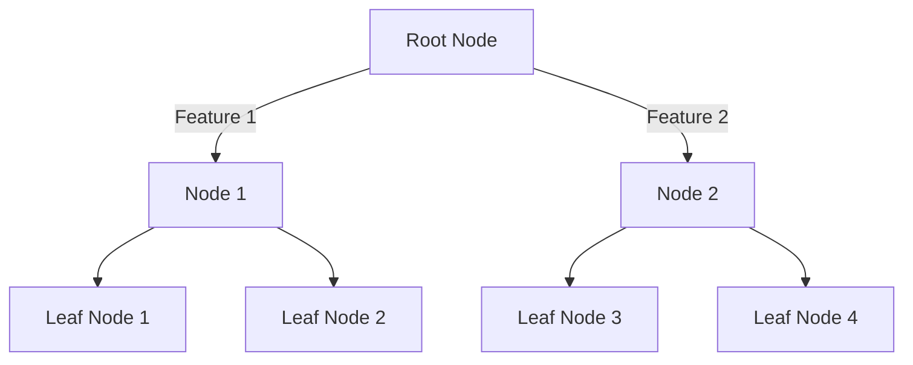
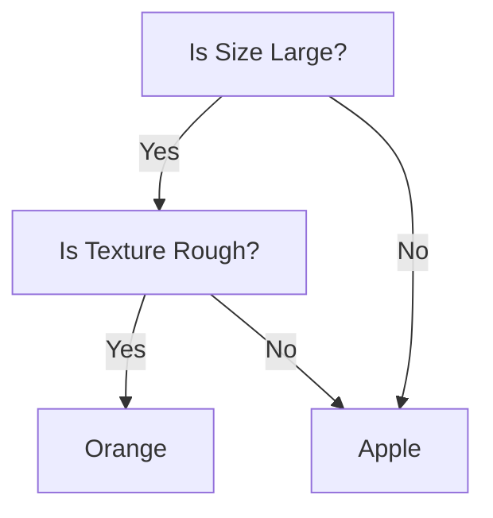
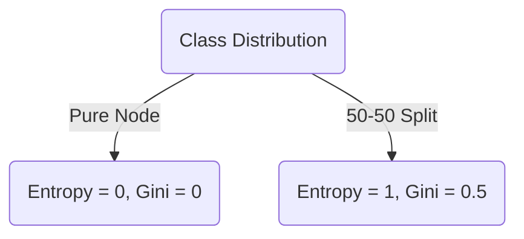
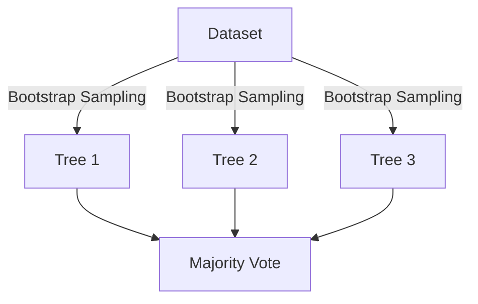
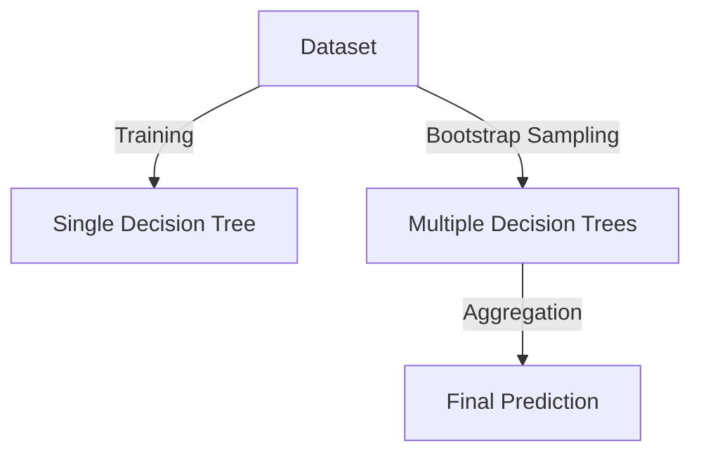
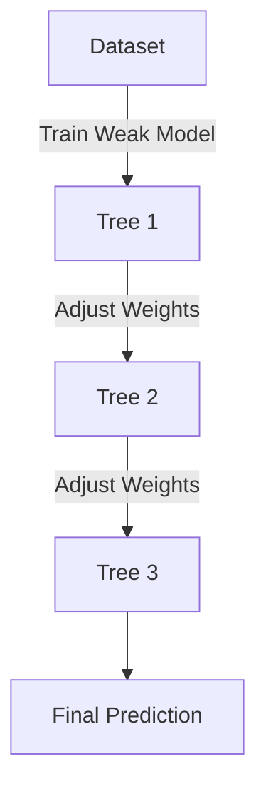

# Decision Trees

<!-- toc -->

## Decision Tree Model

### What is a Decision Tree?

A **decision tree** is a supervised machine learning algorithm used for classification and regression tasks. It mimics human decision-making by splitting data into branches based on feature values, forming a tree-like structure. The key components of a decision tree include:

- **Root Node**: The initial decision point that represents the entire dataset.
- **Internal Nodes**: Decision points where data is split based on a feature.
- **Branches**: The possible outcomes of a decision node.
- **Leaf Nodes**: The terminal nodes that provide the final classification or prediction.



Decision trees work by recursively splitting data based on a selected feature until a stopping condition is met.

### Advantages and Disadvantages of Decision Trees

**Advantages:**

- **Easy to Interpret**: Decision trees provide an intuitive representation of decision-making.
- **Handles Both Numerical and Categorical Data**: They can work with mixed data types.
- **No Need for Feature Scaling**: Unlike algorithms like logistic regression or SVMs, decision trees do not require feature normalization.
- **Works Well with Small Datasets**: Decision trees can be effective even with limited data.

**Disadvantages:**

- **Overfitting**: Decision trees tend to learn patterns too specifically to the training data, leading to poor generalization.
- **Sensitive to Noisy Data**: Small variations in data can lead to different tree structures.
- **Computational Complexity**: For large datasets, training a deep tree can be time-consuming and memory-intensive.

**Example: Classifying Fruits Using a Decision Tree**

Consider a dataset containing different types of fruits characterized by their **color**, **size**, and **texture**. Our goal is to classify whether a given fruit is an apple or an orange.

| Color  | Size  | Texture | Fruit  |
| ------ | ----- | ------- | ------ |
| Red    | Small | Smooth  | Apple  |
| Green  | Small | Smooth  | Apple  |
| Yellow | Large | Rough   | Orange |
| Orange | Large | Rough   | Orange |

**Decision Tree Representation:**



The decision tree follows a top-down approach:

1. The root node first checks whether the fruit is **large**.
2. If **yes**, it checks whether the texture is **rough**.
3. If the texture is rough, it classifies the fruit as an **orange**; otherwise, it's an **apple**.

This example demonstrates how decision trees break down complex decision-making processes into simple binary decisions.

The learning process involves recursively splitting the dataset into smaller subsets. The splitting criterion is chosen based on **purity measures** such as Gini impurity or entropy. Each split creates child nodes until the stopping condition is met.

### Stopping Criteria and Overfitting

A decision tree can continue growing until each leaf contains only one class. However, this often leads to **overfitting**, where the model memorizes the training data but fails to generalize to new data. To prevent this, stopping criteria such as:

- A **minimum number of samples** per leaf
- A **maximum tree depth**
- A **minimum purity gain**

can be used. Additionally, **pruning** techniques help reduce overfitting by removing branches that add little predictive value.

**Pruning Example**

- **Pre-pruning**: Stop the tree from growing beyond a certain depth.
- **Post-pruning**: Grow the full tree and then remove unimportant branches based on validation performance.

<br/>
<br/>

---

## Measuring Purity

In decision trees, "purity" refers to how homogeneous the data in a given node is. A node is considered pure if it contains only samples from a single class. Measuring purity is essential for determining the best way to split a dataset to build an effective decision tree. The two most common metrics used for measuring purity are **Entropy** and **Gini Impurity**.

### Entropy

Entropy, derived from information theory, measures the randomness or disorder in a dataset. The entropy equation for a binary classification problem is:

$$ H(S) = - p_1 \log_2(p_1) - p_2 \log_2(p_2) $$

where:

- $ p_1 $ and $ p_2 $ are the proportions of each class in the set $ S $.

<div style="text-align: center;display:flex; justify-content: center; margin-bottom: 20px; ">
    
</div>

- **Entropy = 0**: The node is pure (all samples belong to one class).
- **Entropy is high**: The node contains a mix of different classes, meaning more disorder.
- **Entropy is maximized at 0.5**: If there is an equal probability of both classes (i.e., 50%-50%), the entropy is at its highest.

**Example Calculation:**

If a node contains 8 positive examples and 2 negative examples, the entropy is calculated as:

$$ H(S) = - \left( \frac{8}{10} \log_2 \frac{8}{10} + \frac{2}{10} \log_2 \frac{2}{10} \right) $$

$$ H(s) = 0.7958$$

<br/>

### Gini Impurity

Gini Impurity measures how often a randomly chosen element from the set would be incorrectly classified if it were randomly labeled according to the class distribution.

The formula for Gini impurity is:

$$
G(S) = 1 - \sum\limits_{i=1}^{C} p_i^2
$$

where:

- $ p_i $ is the probability of class $ i $ in the dataset.



<div style="text-align: center;display:flex; justify-content: center; margin-bottom: 20px; ">
    
</div>

- **Gini = 0**: The node is completely pure.
- **Gini is high**: The node contains a mixture of classes.

**Example Calculation:**

For the same node with 8 positive and 2 negative examples:

$$ G(S) = 1 - \left( \left(\frac{8}{10}\right)^2 + \left(\frac{2}{10}\right)^2 \right) $$

$$ G(S) = 0.32 $$

Both metrics are used to determine the best way to split a node in a decision tree, but they have slight differences:

- **Entropy** is more computationally expensive since it involves logarithmic calculations.
- **Gini Impurity** is faster to compute and often preferred in decision tree implementations like **CART (Classification and Regression Trees)**.

In practice, both perform similarly, and the choice depends on the specific problem and computational constraints.

By using these metrics, we can quantify the impurity of nodes and use them to decide the best possible splits while constructing a decision tree.

<br/>
<br/>

---

## Choosing a Split: Information Gain

When constructing a decision tree, selecting the best feature to split on is crucial for building an optimal model. The goal is to maximize the **Information Gain**, which measures how well a feature separates the data into pure subsets.

<br/>

### Reducing Entropy

Information Gain (IG) is the reduction in entropy after splitting on a feature. It is calculated as:

$$
IG(S, A) = H(S) - \sum\limits_{v \in \text{Values}(A)} \frac{|S_v|}{|S|} H(S_v)
$$

where:

- $ H(S) $ is the entropy of the original set.
- $ S_v $ represents subsets created by splitting on attribute $ A $.
- $ \frac{|S_v|}{|S|} $ is the weighted proportion of samples in each subset.

**Example Calculation**

Consider a dataset with the following samples:

<div style="text-align: center;display:flex; justify-content: center; margin-bottom: 20px; ">
    
</div>

1. Compute initial entropy:

   - 5 `Cat` labels and 5 `Dog` labels.

    <div style="text-align: center;display:flex; justify-content: center; margin-bottom: 20px; ">
    
    </div>

   - $ p_1 = \frac{5}{10} $, $ \quad p_2 = \frac{5}{10} $.

   - $ H(S) = - \frac{5}{10} \log_2\frac{5}{10} - \frac{5}{10} \log_2\frac{5}{10} = 1.0 $.

    <br/>

2. Compute entropy after splitting by **`Ear Shape`**:

   - Subset `Pointy`: {Cat, Cat, Cat, Cat, Dog}

     - $ H = -\frac{4}{5} \log_2\frac{4}{5} - \frac{1}{5} \log_2\frac{1}{5} \approx 0.72 $

   - Subset `Floppy`: {Cat, Dog, Dog, Dog, Dog}

     - $ H = -\frac{1}{5} \log_2\frac{1}{5} - \frac{4}{5} \log_2\frac{4}{5} \approx 0.72 $

   - $ IG = 1.0 - (5/10)(0.72) - (5/10)(0.72) = 0.28 $

    <br/>

3. Compute entropy after splitting by **`Face Shape`**:

   - Subset `Round`: {Cat, Cat, Cat, Dog, Dog, Dog, Cat}

     - $ H = -\frac{4}{7} \log_2\frac{4}{7} - \frac{3}{7} \log_2\frac{3}{7} \approx 0.99 $

   - Subset `Not Round`: {Cat, Dog, Dog}

     - $ H = -\frac{1}{3} \log_2\frac{1}{3} - \frac{2}{3} \log_2\frac{2}{3} \approx 0.92 $

   - $ IG = 1.0 - (7/10)(0.99) - (3/10)(0.92) = 0.03 $

     <br/>

4. Compute entropy after splitting by **`Whiskers`**:

   - Subset `Present`: {Cat, Cat, Cat, Dog}

     - $ H = -\frac{3}{4} \log_2\frac{3}{4} - \frac{1}{4} \log_2\frac{1}{4} \approx 0.81 $

   - Subset `Absent`: {Dog, Dog, Dog, Dog, Cat, Cat}

     - $ H = -\frac{4}{6} \log_2\frac{4}{6} - \frac{2}{6} \log_2\frac{2}{6} \approx 0.92 $

   - $ IG = 1.0 - (4/10)(0.81) - (6/10)(0.92) = 0.12 $

<br/>

<div style="text-align: center;display:flex; justify-content: center; margin-bottom: 20px; ">
    
</div>

Since the highest Information Gain is $0.28$ (Ear Shape), splitting on either of these features is optimal.

<br/>
<br/>

---

<br/>

## Decision Trees for Continuous Features

When working with continuous features, decision trees can still be used effectively to predict outcomes, just like with categorical features.

<div style="text-align: center;display:flex; justify-content: center; margin-bottom: 20px; ">
    
</div>

The key difference is that instead of using categorical values for splitting, decision trees for continuous features will determine optimal cutoffs or thresholds in the data. This allows the algorithm to make predictions for continuous target variables based on continuous input features.

In this example, we will predict whether an animal is a **cat** or **dog** based on its **weight**, using a decision tree that handles continuous features.

Let's say we have the following dataset of animals, and we want to predict if the animal is a **cat** or **dog** based on its **weight**:

| Animal | Weight (kg) |
| ------ | ----------- |
| Cat    | 4.5         |
| Cat    | 5.1         |
| Cat    | 4.7         |
| Dog    | 8.2         |
| Dog    | 9.0         |
| Cat    | 5.3         |
| Dog    | 10.1        |
| Dog    | 11.4        |
| Dog    | 12.0        |
| Dog    | 9.8         |

Here, we aim to build a **decision tree** based on the **Weight** feature to determine whether an animal is a **cat** or a **dog**.

<br/>

**Step 1: Find the Best Split for the Weight Feature**

We will evaluate potential splits based on the **Weight** feature. The decision tree will consider possible cutoffs and calculate the impurity or variance for each split.

Let's consider the following splits:

- **Weight ≤ 7.0 kg**: Assign `Cat`
- **Weight > 7.0 kg**: Assign `Dog`

The decision tree will evaluate these splits by computing the impurity (for classification) or variance (for regression) for each possible split.

<br/>

**Step 2: Train a Decision Tree Model**

We can use a decision tree to learn the best split and predict the animal type based on the weight. Here is how we can implement this in Python:

```python
import numpy as np
from sklearn.tree import DecisionTreeClassifier
import pandas as pd

# Creating the dataset
data = {
    'Weight': [4.5, 5.1, 4.7, 8.2, 9.0, 5.3, 10.1, 11.4, 12.0, 9.8],
    'Animal': ['Cat', 'Cat', 'Cat', 'Dog', 'Dog', 'Cat', 'Dog', 'Dog', 'Dog', 'Dog']
}
df = pd.DataFrame(data)

# Splitting features and target
X = df[['Weight']]  # Feature
y = df['Animal']  # Target

# Training a decision tree classifier
clf = DecisionTreeClassifier(criterion='gini', max_depth=1)
clf.fit(X, y)

# Predicting animal type
predictions = clf.predict(X)
print(f'Predicted Animals: {predictions}')
```

<br/>

**Step 3: Visualizing the Decision Tree**

The decision tree can be visualized to show how the split is made based on the Weight feature.

```python
from sklearn.tree import plot_tree
import matplotlib.pyplot as plt

plt.figure(figsize=(10,8))
plot_tree(clf, feature_names=['Weight'], class_names=['Cat', 'Dog'], filled=True)
plt.show()
```

<br/>

**Step 4: Interpreting the Results**

The resulting decision tree will have a root node where the Weight feature is split at a threshold (e.g., $7.0$ kg). If the animal's weight is less than or equal to $7.0$ kg, it is classified as a `Cat`; otherwise, it is classified as a `Dog`.

<br/>
<br/>

---

## Regression Trees

Regression trees are used when the target variable is continuous rather than categorical. Unlike classification trees, which predict discrete labels, regression trees predict numerical values by recursively partitioning the data and assigning an average value to each leaf node.

**How Regression Trees Work**

<div style="text-align: center;display:flex; justify-content: center; margin-bottom: 20px; ">
    
</div>

1. **Splitting the Data:** The algorithm finds the best feature and threshold to split the data by minimizing variance.
2. **Assigning Values to Leaves:** Instead of class labels, leaf nodes store the mean of the target values in that region.
3. **Prediction:** Given a new sample, traverse the tree based on feature values and return the mean value from the corresponding leaf node.

**Example: Predicting Animal Weights**

We extend our dataset by adding a new feature: **Weight**. Our dataset consists of 10 animals, with the following features:

- **Ear Shape:** (Pointy, Floppy)
- **Face Shape:** (Round, Not Round)
- **Whiskers:** (Present, Absent)
- **Weight (kg):** Continuous target variable

<br/>

| Ear Shape | Face Shape | Whiskers | Animal | Weight (kg) |
| --------- | ---------- | -------- | ------ | ----------- |
| Pointy    | Round      | Present  | Cat    | 4.5         |
| Pointy    | Round      | Present  | Cat    | 5.1         |
| Pointy    | Round      | Absent   | Cat    | 4.7         |
| Pointy    | Not Round  | Present  | Dog    | 8.2         |
| Pointy    | Not Round  | Absent   | Dog    | 9.0         |
| Floppy    | Round      | Present  | Cat    | 5.3         |
| Floppy    | Round      | Absent   | Dog    | 10.1        |
| Floppy    | Not Round  | Present  | Dog    | 11.4        |
| Floppy    | Not Round  | Absent   | Dog    | 12.0        |
| Floppy    | Round      | Absent   | Dog    | 9.8         |

<br/>

**Building a Regression Tree**

We use **Mean Squared Error (MSE)** to determine the best split. The split that results in the lowest MSE is selected.

<br/>

**Step 1: Compute Initial MSE**

The overall mean weight is:

$$ \bar{y} = \frac{4.5 + 5.1 + 4.7 + 8.2 + 9.0 + 5.3 + 10.1 + 11.4 + 12.0 + 9.8}{10} = 7.61 $$

MSE before splitting:
$$ MSE = \frac{1}{10} \sum (y_i - \bar{y})^2 \approx 6.84 $$

<br/>

**Step 2: Find the Best Split**

We evaluate splits based on feature values:

- **Split on Ear Shape:**

  - Pointy: ${(4.5, 5.1, 4.7, 8.2, 9.0)}$ → Mean = $6.3$
  - Floppy: ${(5.3, 10.1, 11.4, 12.0, 9.8)}$ → Mean = $9.72$
  - MSE = $3.2$ (better than initial MSE)

- **Split on Face Shape:**

  - Round: ${(4.5, 5.1, 4.7, 5.3, 10.1, 9.8)}$ → Mean = $6.58$
  - Not Round: ${(8.2, 9.0, 11.4, 12.0)}$ → Mean = $10.15$
  - MSE = $2.9$ (even better)

- **Split on Whiskers:**
  - Present: ${(4.5, 5.1, 8.2, 5.3, 11.4)}$ → Mean = $6.9$
  - Absent: ${(4.7, 9.0, 10.1, 12.0, 9.8)}$ → Mean = $9.12$
  - MSE = $3.1$ (better than initial but worse than Face Shape)

Thus, **Face Shape** is chosen as the first split.

**Implementing in Python**

```python
import numpy as np
from sklearn.tree import DecisionTreeRegressor
import pandas as pd

# Creating the dataset
data = {
    'Ear_Shape': [0, 0, 0, 0, 0, 1, 1, 1, 1, 1],  # 0: Pointy, 1: Floppy
    'Face_Shape': [0, 0, 0, 1, 1, 0, 0, 1, 1, 0],  # 0: Round, 1: Not Round
    'Whiskers': [0, 0, 1, 0, 1, 0, 1, 1, 0, 0],  # 0: Present, 1: Absent
    'Weight': [4.5, 5.1, 4.7, 8.2, 9.0, 5.3, 10.1, 11.4, 12.0, 9.8]
}
df = pd.DataFrame(data)

# Splitting features and target
X = df[['Ear_Shape', 'Face_Shape', 'Whiskers']]
y = df['Weight']

# Training a regression tree
regressor = DecisionTreeRegressor(criterion='squared_error', max_depth=2)
regressor.fit(X, y)

# Predicting weights
predictions = regressor.predict(X)
print(f'Predicted Weights: {predictions}')
```

This regression tree provides predictions for the animal weights based on feature values.

<br/>
<br/>

---

## Using Multiple Decision Trees

Using a single decision tree can sometimes lead to overfitting or instability, especially if the dataset has noise. By using multiple decision trees together, we can improve model performance and robustness. Two main techniques to achieve this are **Bagging** and **Boosting**.

<br/>

### Bagging (Bootstrap Aggregating)

Bagging reduces variance by training multiple decision trees on different random subsets of the dataset and then averaging their predictions. The most well-known example of bagging is the **Random Forest algorithm**.

**Key Steps in Bagging:**

1. Draw **random subsets** (with replacement) from the training data.
2. Train a decision tree on each subset.
3. Combine predictions using majority voting (for classification) or averaging (for regression).

**Visualization of Bagging:**



<br/>

#### Sampling with Replacement

Sampling with replacement is a technique where each data point has an equal probability of being selected multiple times in a new sample. This method is widely used in **Bootstrap Aggregating (Bagging)** to create multiple training datasets from the original dataset, allowing for robust model training and variance reduction.

- **Why use Sampling with Replacement?**
  - It helps in reducing model variance.
  - Generates multiple diverse datasets from the original dataset.
  - Prevents overfitting by averaging multiple models.

<br/>

**Bootstrap Sampling Process**

1. Given a dataset of size $ N $, create a new dataset by randomly selecting $ N $ samples **with replacement**.
2. Some original samples may appear multiple times, while others may not appear at all.
3. Train multiple models on these sampled datasets and aggregate predictions.

Consider a dataset with five samples $ A, B, C, D, E $:

<br/>

| Original Data | Bootstrap Sample 1 | Bootstrap Sample 2 |
| ------------- | ------------------ | ------------------ |
| A             | B                  | A                  |
| B             | A                  | C                  |
| C             | C                  | A                  |
| D             | D                  | B                  |
| E             | A                  | E                  |

Notice that in each bootstrap sample, some samples appear multiple times while others are missing.

<br/>
<br/>

#### Random Forest Algorithm

<div style="text-align: center;display:flex; justify-content: center; margin-bottom: 20px; ">
    
</div>

Random Forest is an ensemble learning method that builds multiple decision trees and merges them to achieve better performance. It is based on the concept of **bagging (Bootstrap Aggregating)**, which helps reduce overfitting and improve accuracy.

<br/>

**How Random Forest Works**

1. **Bootstrap Sampling:** Randomly select subsets of the training data (with replacement).
2. **Decision Trees:** Train multiple decision trees on different subsets.
3. **Feature Randomness:** At each split, only a random subset of features is considered to introduce diversity.
4. **Aggregation:**
   - For classification, it takes a majority vote across all trees.
   - For regression, it averages the predictions of all trees.

$$
Prediction_{RF} = \frac{1}{N} \sum_{i=1}^{N} Tree_i(x)
$$

where $ N $ is the number of trees and $ Tree_i(x) $ is the prediction of the $ i^{th} $ tree.

**Key Hyperparameters**

| Hyperparameter      | Description                                 |
| ------------------- | ------------------------------------------- |
| `n_estimators`      | Number of decision trees in the forest      |
| `max_depth`         | Maximum depth of each tree                  |
| `max_features`      | Number of features considered for splitting |
| `min_samples_split` | Minimum samples required to split a node    |
| `min_samples_leaf`  | Minimum samples required in a leaf node     |

**Decision Tree vs. Random Forest**



**Random Forest example on Telco Customer Churn Dataset**

```python
import pandas as pd
import numpy as np
from sklearn.model_selection import train_test_split
from sklearn.ensemble import RandomForestClassifier
from sklearn.metrics import accuracy_score, classification_report

# Load the dataset
df = pd.read_csv('Telco-Customer-Churn.csv')

# Preprocessing
df = df.drop(columns=['customerID'])  # Remove non-relevant column
df = pd.get_dummies(df, drop_first=True)  # Convert categorical variables

# Splitting data
X = df.drop(columns=['Churn_Yes'])
y = df['Churn_Yes']
X_train, X_test, y_train, y_test = train_test_split(X, y, test_size=0.2, random_state=42)

# Train Random Forest model
rf = RandomForestClassifier(n_estimators=100, max_depth=10, random_state=42)
rf.fit(X_train, y_train)

# Predictions
y_pred = rf.predict(X_test)

# Evaluation
print("Accuracy:", accuracy_score(y_test, y_pred))
print(classification_report(y_test, y_pred))
```

**When to Use Random Forest**

- When you need high accuracy with minimal tuning.
- When dealing with large feature spaces.
- When feature importance is important.
- When you want to reduce overfitting compared to decision trees.

Random Forest is a powerful and flexible model that performs well across various datasets. However, it can be computationally expensive for large datasets.

<br/>
<br/>

### Boosting

Boosting is another ensemble method that builds trees sequentially, with each tree trying to correct the mistakes of the previous one. It focuses on difficult examples by assigning them higher weights.

The most popular boosting method is **XGBoost (Extreme Gradient Boosting)**.

**Key Steps in Boosting:**

1. Train a weak model on the training data.
2. Identify misclassified samples and assign them higher weights.
3. Train the next model focusing on these hard cases.
4. Repeat until a stopping criterion is met.

**Visualization of Boosting:**



<br/>

#### XGBoost

XGBoost (Extreme Gradient Boosting) is a powerful and efficient implementation of gradient boosting that is widely used in machine learning competitions and real-world applications due to its high performance and scalability.

<div style="text-align: center;display:flex; justify-content: center; margin-bottom: 20px; ">
    
</div>

XGBoost builds an ensemble of decision trees sequentially, where each tree corrects the errors of the previous ones. The algorithm optimizes a loss function using gradient descent, allowing it to minimize errors effectively.

**Key Components of XGBoost:**

1. **Gradient Boosting Framework:** Uses boosting to improve weak learners iteratively.
2. **Regularization:** Includes L1 and L2 regularization to reduce overfitting.
3. **Parallelization:** Optimized for fast training using parallel computing.
4. **Handling Missing Values:** Automatically finds optimal splits for missing data.
5. **Tree Pruning:** Uses depth-wise pruning instead of weight pruning for efficiency.
6. **Custom Objective Functions:** Allows defining custom loss functions.

XGBoost optimizes the following objective function:

$$ J(\theta) = \sum L(y_i, \hat{y}\_i) + \sum \Omega(T_k) $$

Where:

- $ L(y_i, \hat{y}\_i) $ is the loss function (e.g., squared error for regression, log loss for classification).
- $ \Omega(T_k) $ is the regularization term controlling model complexity.
- $ T_k $ represents individual trees.

**Implementing XGBoost on Telco Customer Churn Dataset**

We will train an XGBoost model to predict customer churn.

<br/>

**Step 1: Load the dataset**

```python
import pandas as pd
from xgboost import XGBClassifier
from sklearn.model_selection import train_test_split
from sklearn.metrics import accuracy_score

# Load dataset
df = pd.read_csv("Telco-Customer-Churn.csv")

# Preprocess data
df = df.dropna()
df = pd.get_dummies(df, drop_first=True)

X = df.drop("Churn_Yes", axis=1)
y = df["Churn_Yes"]

# Split data
X_train, X_test, y_train, y_test = train_test_split(X, y, test_size=0.2, random_state=42)
```

<br/>

**Step 2: Train the XGBoost Model**

```python
xgb_model = XGBClassifier(n_estimators=100, learning_rate=0.1, max_depth=4, reg_lambda=1, use_label_encoder=False, eval_metric='logloss')
xgb_model.fit(X_train, y_train)
```

<br/>

**Step 3: Evaluate the Model**

```python
y_pred = xgb_model.predict(X_test)
accuracy = accuracy_score(y_test, y_pred)
print(f"Accuracy: {accuracy:.4f}")
```

<br/>

**Hyperparameter Tuning**

Key hyperparameters in XGBoost:

<br/>

| Hyperparameter     | Description                                |
| ------------------ | ------------------------------------------ |
| `n_estimators`     | Number of trees in the model.              |
| `learning_rate`    | Step size for updating weights.            |
| `max_depth`        | Maximum depth of trees.                    |
| `subsample`        | Fraction of samples used per tree.         |
| `colsample_bytree` | Fraction of features used per tree.        |
| `gamma`            | Minimum loss reduction required for split. |

**When to Use XGBoost**

- When you have structured/tabular data.
- When you need high accuracy.
- When you need a model that handles missing values efficiently.
- When feature interactions are important.

XGBoost is one of the most powerful algorithms for predictive modeling. By leveraging its strengths in handling structured data, regularization, and parallel processing, it can significantly outperform traditional machine learning methods in many real-world applications.

<br/>

#### XGBoost vs Random Forest

| Feature                        | XGBoost                   | Random Forest |
| ------------------------------ | ------------------------- | ------------- |
| Training Speed                 | Faster (parallelized)     | Slower        |
| Overfitting Control            | Stronger (Regularization) | Moderate      |
| Performance on Structured Data | High                      | Good          |
| Handles Missing Data           | Yes                       | No            |
