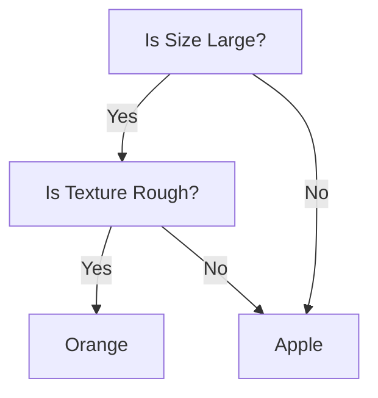
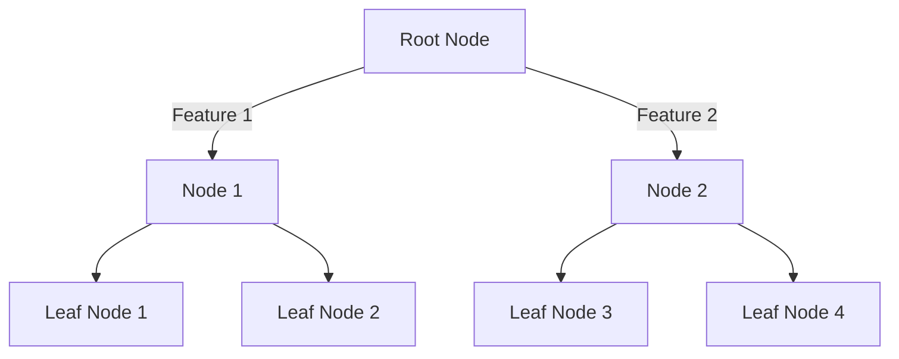
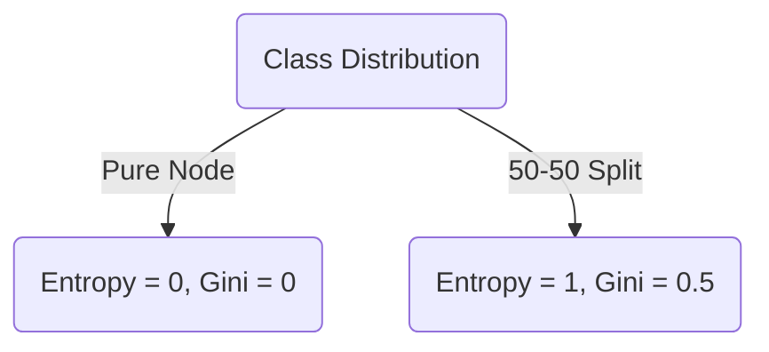
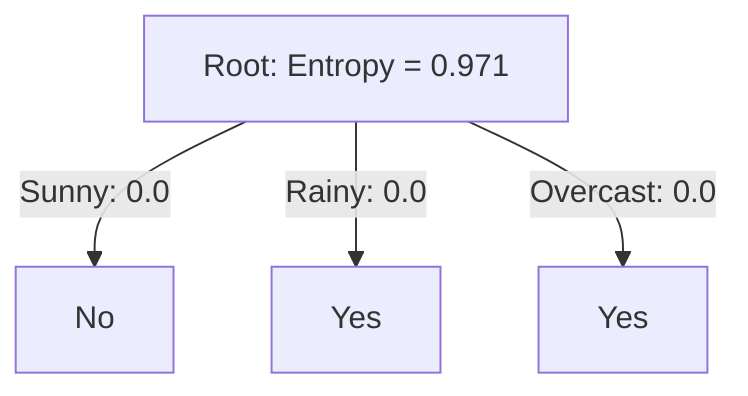
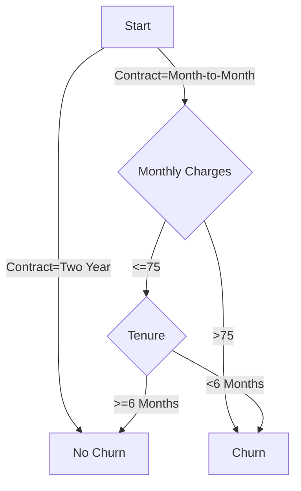
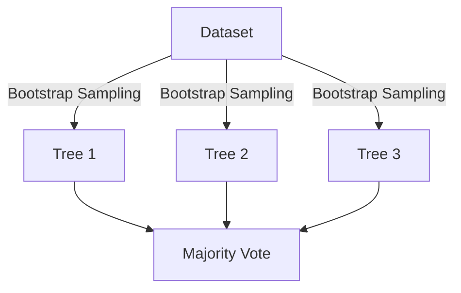
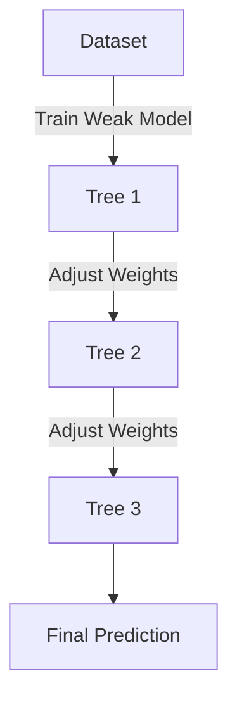
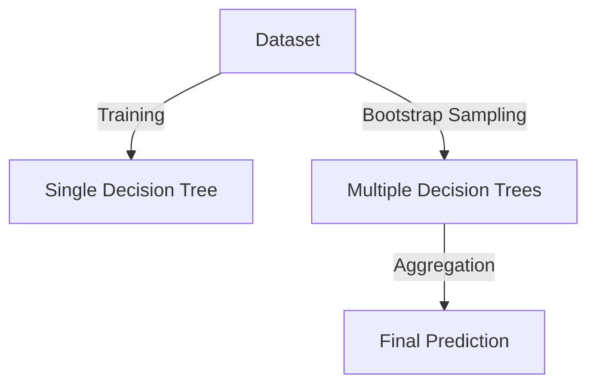
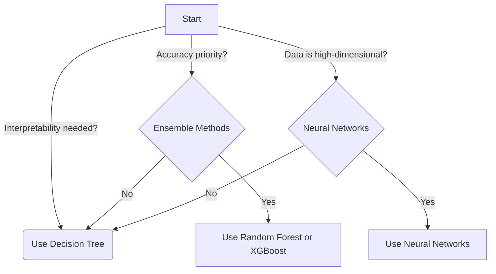

# Decision Trees

<!-- toc -->

## Decision Tree Model

### What is a Decision Tree?

A **decision tree** is a supervised machine learning algorithm used for classification and regression tasks. It mimics human decision-making by splitting data into branches based on feature values, forming a tree-like structure. The key components of a decision tree include:

- **Root Node**: The initial decision point that represents the entire dataset.
- **Internal Nodes**: Decision points where data is split based on a feature.
- **Branches**: The possible outcomes of a decision node.
- **Leaf Nodes**: The terminal nodes that provide the final classification or prediction.

Decision trees work by recursively splitting data based on a selected feature until a stopping condition is met.

### Advantages and Disadvantages of Decision Trees

#### Advantages:

- **Easy to Interpret**: Decision trees provide an intuitive representation of decision-making.
- **Handles Both Numerical and Categorical Data**: They can work with mixed data types.
- **No Need for Feature Scaling**: Unlike algorithms like logistic regression or SVMs, decision trees do not require feature normalization.
- **Works Well with Small Datasets**: Decision trees can be effective even with limited data.

#### Disadvantages:

- **Overfitting**: Decision trees tend to learn patterns too specifically to the training data, leading to poor generalization.
- **Sensitive to Noisy Data**: Small variations in data can lead to different tree structures.
- **Computational Complexity**: For large datasets, training a deep tree can be time-consuming and memory-intensive.

### Example: Classifying Fruits Using a Decision Tree

Consider a dataset containing different types of fruits characterized by their **color**, **size**, and **texture**. Our goal is to classify whether a given fruit is an apple or an orange.

| Color  | Size  | Texture | Fruit  |
| ------ | ----- | ------- | ------ |
| Red    | Small | Smooth  | Apple  |
| Green  | Small | Smooth  | Apple  |
| Yellow | Large | Rough   | Orange |
| Orange | Large | Rough   | Orange |

#### Decision Tree Representation:



The decision tree follows a top-down approach:

1. The root node first checks whether the fruit is **large**.
2. If **yes**, it checks whether the texture is **rough**.
3. If the texture is rough, it classifies the fruit as an **orange**; otherwise, it's an **apple**.

This example demonstrates how decision trees break down complex decision-making processes into simple binary decisions.

### Conclusion

Decision trees are powerful tools for both classification and regression tasks. However, they require careful tuning to prevent overfitting and inefficiency. In the next sections, we will explore how decision trees learn, measure purity, and select the best splits using information gain.

## Learning Process

Decision trees learn by recursively partitioning the dataset into subsets based on feature values. The goal is to create the most homogeneous subsets possible at each step, ultimately leading to leaf nodes that represent final decisions or predictions.

### 1. Tree Structure Formation

A decision tree starts with a **root node**, which represents the entire dataset. The data is split at each step using **decision rules** based on feature values, creating **branches** that lead to new nodes. The process continues until a stopping criterion is met, forming a tree structure.



### 2. Recursive Partitioning

The learning process involves recursively splitting the dataset into smaller subsets. The splitting criterion is chosen based on **purity measures** such as Gini impurity or entropy. Each split creates child nodes until the stopping condition is met.

#### Example:

Consider a dataset of fruits with the features "color" and "size" to classify whether a fruit is an apple or an orange.

| Fruit | Color  | Size  | Label  |
| ----- | ------ | ----- | ------ |
| A     | Red    | Large | Apple  |
| B     | Red    | Small | Apple  |
| C     | Orange | Large | Orange |
| D     | Orange | Small | Orange |

The decision tree may first split based on **color**:

- If **Red**, predict **Apple**
- If **Orange**, predict **Orange**

### 3. Stopping Criteria and Overfitting

A decision tree can continue growing until each leaf contains only one class. However, this often leads to **overfitting**, where the model memorizes the training data but fails to generalize to new data. To prevent this, stopping criteria such as:

- A **minimum number of samples** per leaf
- A **maximum tree depth**
- A **minimum purity gain**

can be used. Additionally, **pruning** techniques help reduce overfitting by removing branches that add little predictive value.

#### Pruning Example

- **Pre-pruning**: Stop the tree from growing beyond a certain depth.
- **Post-pruning**: Grow the full tree and then remove unimportant branches based on validation performance.

---

This section provides an overview of how decision trees learn. In the next section, we'll dive deeper into **Measuring Purity**, exploring Gini impurity and entropy with mathematical formulations.

## Measuring Purity

In decision trees, "purity" refers to how homogeneous the data in a given node is. A node is considered pure if it contains only samples from a single class. Measuring purity is essential for determining the best way to split a dataset to build an effective decision tree. The two most common metrics used for measuring purity are **Entropy** and **Gini Impurity**.

### Entropy

Entropy, derived from information theory, measures the randomness or disorder in a dataset. The entropy equation for a binary classification problem is:

$$ H(S) = - p_1 \log_2(p_1) - p_2 \log_2(p_2) $$

where:

- \( p_1 \) and \( p_2 \) are the proportions of each class in the set \( S \).

#### Interpretation:

- **Entropy = 0**: The node is pure (all samples belong to one class).
- **Entropy is high**: The node contains a mix of different classes, meaning more disorder.
- **Entropy is maximized at 0.5**: If there is an equal probability of both classes (i.e., 50%-50%), the entropy is at its highest.

#### Example Calculation:

If a node contains 8 positive examples and 2 negative examples, the entropy is calculated as:

$$ H(S) = - \left( \frac{8}{10} \log_2 \frac{8}{10} + \frac{2}{10} \log_2 \frac{2}{10} \right) $$

### Gini Impurity

Gini Impurity measures how often a randomly chosen element from the set would be incorrectly classified if it were randomly labeled according to the class distribution.

The formula for Gini impurity is:

$$ G(S) = 1 - \sum\_{i=1}^{C} p_i^2 $$

where:

- \( p_i \) is the probability of class \( i \) in the dataset.

#### Interpretation:

- **Gini = 0**: The node is completely pure.
- **Gini is high**: The node contains a mixture of classes.

#### Example Calculation:

For the same node with 8 positive and 2 negative examples:

$$ G(S) = 1 - \left( \left(\frac{8}{10}\right)^2 + \left(\frac{2}{10}\right)^2 \right) $$

### Comparing Entropy and Gini Impurity

Both metrics are used to determine the best way to split a node in a decision tree, but they have slight differences:

- **Entropy** is more computationally expensive since it involves logarithmic calculations.
- **Gini Impurity** is faster to compute and often preferred in decision tree implementations like **CART (Classification and Regression Trees)**.

In practice, both perform similarly, and the choice depends on the specific problem and computational constraints.

### Visual Representation

We can visualize entropy and Gini impurity as functions of class probabilities:



By using these metrics, we can quantify the impurity of nodes and use them to decide the best possible splits while constructing a decision tree.

## Choosing a Split: Information Gain

When constructing a decision tree, selecting the best feature to split on is crucial for building an optimal model. The goal is to maximize the **Information Gain**, which measures how well a feature separates the data into pure subsets.

### Entropy: Measuring Uncertainty

Entropy quantifies the uncertainty in a dataset. A dataset with mixed labels has high entropy, while a dataset with only one class has low entropy. The entropy formula is:

$$ H(S) = - \sum\_{i=1}^{c} p_i \log_2(p_i) $$

where:

- \( p_i \) is the proportion of class \( i \) in the dataset.
- \( c \) is the number of unique classes.

### Information Gain: Reducing Entropy

Information Gain (IG) is the reduction in entropy after splitting on a feature. It is calculated as:

$$ IG(S, A) = H(S) - \sum\_{v \in Values(A)} \frac{|S_v|}{|S|} H(S_v) $$

where:

- \( H(S) \) is the entropy of the original set.
- \( S_v \) represents subsets created by splitting on attribute \( A \).
- \( |S_v| / |S| \) is the weighted proportion of samples in each subset.

### Example Calculation

Consider a dataset with the following samples:

| Feature  | Label |
| -------- | ----- |
| Sunny    | No    |
| Rainy    | Yes   |
| Overcast | Yes   |
| Sunny    | No    |
| Rainy    | Yes   |

1. Compute initial entropy:

   - 2 "No" labels and 3 "Yes" labels.
   - \( p*{No} = 2/5, p*{Yes} = 3/5 \).
   - \( H(S) = - (2/5) \log_2(2/5) - (3/5) \log_2(3/5) \approx 0.971 \).

2. Compute entropy after splitting by `Feature`.

   - Subset "Sunny": {No, No} → \( H = 0 \)
   - Subset "Rainy": {Yes, Yes} → \( H = 0 \)
   - Subset "Overcast": {Yes} → \( H = 0 \)

3. Compute Information Gain:
   - \( IG = 0.971 - (2/5)(0) - (2/5)(0) - (1/5)(0) = 0.971 \)
   - Since IG is maximized, splitting on `Feature` is optimal.

### Decision Tree Representation

Using Mermaid to visualize Information Gain:



### Implementing in Python

We can compute Information Gain using `scikit-learn`:

```python
from sklearn.tree import DecisionTreeClassifier
from sklearn import datasets
import numpy as np

# Sample dataset
X = np.array([[0], [1], [2], [0], [1]])  # Categorical feature (Sunny, Rainy, Overcast)
y = np.array([0, 1, 1, 0, 1])  # Labels (No=0, Yes=1)

# Decision Tree Model
clf = DecisionTreeClassifier(criterion='entropy')
clf.fit(X, y)

# Extract Information Gain
print(f'Feature Importances (IG values): {clf.feature_importances_}')
```

This outputs the feature importance based on Information Gain.

### Comparing Information Gain with Gini Impurity

While Information Gain uses entropy, **Gini Impurity** is another criterion:

$$ Gini = 1 - \sum\_{i=1}^{c} p_i^2 $$

- Lower Gini values indicate purer nodes.
- It is computationally faster than entropy.
- However, both approaches often yield similar results.

### Summary

- **Entropy** measures the uncertainty in a dataset.
- **Information Gain** quantifies the reduction in entropy after a split.
- Decision Trees use Information Gain (or Gini) to determine the best feature for splitting.
- **Visualization and Python implementation** can help understand and compute these concepts.

# Decision Trees: Telco Customer Churn Dataset

## 1. Understanding the Dataset

The **Telco Customer Churn Dataset** contains information about telecom customers and whether they have churned (discontinued service). It includes categorical and numerical features that influence customer retention.

### Features in the Dataset:

- **CustomerID**: Unique ID for each customer.
- **Gender**: Male or Female.
- **SeniorCitizen**: Whether the customer is a senior citizen (0 or 1).
- **Partner & Dependents**: Information about family relations.
- **Tenure**: Number of months the customer has stayed with the company.
- **Services**: Various telecom services (PhoneService, InternetService, StreamingTV, etc.).
- **Contract Type**: Monthly, One Year, or Two Year.
- **Payment Method & MonthlyCharges**: Billing details.
- **Churn**: The target variable (Yes/No).

## 2. Data Preprocessing

Before training a decision tree, we need to clean and preprocess the dataset.

```python
import pandas as pd
from sklearn.model_selection import train_test_split
from sklearn.preprocessing import LabelEncoder

df = pd.read_csv("telco_churn.csv")

# Drop CustomerID as it is not a useful feature
df.drop("customerID", axis=1, inplace=True)

# Convert categorical variables to numeric using Label Encoding
categorical_cols = df.select_dtypes(include=["object"]).columns
df[categorical_cols] = df[categorical_cols].apply(LabelEncoder().fit_transform)

# Splitting dataset into training and test sets
X = df.drop("Churn", axis=1)
y = df["Churn"]
X_train, X_test, y_train, y_test = train_test_split(X, y, test_size=0.2, random_state=42)
```

## 3. Building the Decision Tree Model

Now, we train a **Decision Tree Classifier** using Scikit-learn.

```python
from sklearn.tree import DecisionTreeClassifier

dt = DecisionTreeClassifier(criterion="entropy", max_depth=5, random_state=42)
dt.fit(X_train, y_train)
```

## 4. Decision Tree Visualization

Using Mermaid, we can illustrate a simple decision tree structure:



This visualization shows that **contract type** and **monthly charges** are strong indicators of churn.

## 5. Evaluating the Model

To evaluate model performance, we use confusion matrix, accuracy, precision, recall, and F1-score.

```python
from sklearn.metrics import classification_report, confusion_matrix

y_pred = dt.predict(X_test)
print(confusion_matrix(y_test, y_pred))
print(classification_report(y_test, y_pred))
```

## 6. Pruning and Hyperparameter Tuning

To reduce overfitting, we apply **pruning** and **hyperparameter tuning**.

```python
from sklearn.model_selection import GridSearchCV

param_grid = {
    'max_depth': [3, 5, 10],
    'min_samples_split': [2, 5, 10],
    'min_samples_leaf': [1, 2, 4]
}
grid_search = GridSearchCV(DecisionTreeClassifier(), param_grid, cv=5, scoring='accuracy')
grid_search.fit(X_train, y_train)

print(grid_search.best_params_)
```

## 7. Feature Importance

Which features impact churn prediction the most?

```python
import matplotlib.pyplot as plt
import numpy as np

feature_importance = dt.feature_importances_
features = np.array(X.columns)

plt.figure(figsize=(10, 5))
plt.barh(features, feature_importance)
plt.xlabel("Importance")
plt.ylabel("Feature")
plt.title("Feature Importance in Decision Tree")
plt.show()
```

## 8. Conclusion

- **Contract Type** and **Monthly Charges** are critical churn indicators.
- Decision trees can overfit; pruning and hyperparameter tuning help.
- Feature importance analysis provides insights into churn behavior.

This completes our **Decision Tree analysis on the Telco Customer Churn Dataset** 🚀.

# Decision Trees

## Using Multiple Decision Trees

### Why Use Multiple Decision Trees?

Using a single decision tree can sometimes lead to overfitting or instability, especially if the dataset has noise. By using multiple decision trees together, we can improve model performance and robustness. Two main techniques to achieve this are **Bagging** and **Boosting**.

### Bagging (Bootstrap Aggregating)

Bagging reduces variance by training multiple decision trees on different random subsets of the dataset and then averaging their predictions. The most well-known example of bagging is the **Random Forest algorithm**.

**Key Steps in Bagging:**

1. Draw **random subsets** (with replacement) from the training data.
2. Train a decision tree on each subset.
3. Combine predictions using majority voting (for classification) or averaging (for regression).

**Visualization of Bagging:**



### Boosting

Boosting is another ensemble method that builds trees sequentially, with each tree trying to correct the mistakes of the previous one. It focuses on difficult examples by assigning them higher weights.

The most popular boosting method is **XGBoost (Extreme Gradient Boosting)**.

**Key Steps in Boosting:**

1. Train a weak model on the training data.
2. Identify misclassified samples and assign them higher weights.
3. Train the next model focusing on these hard cases.
4. Repeat until a stopping criterion is met.

**Visualization of Boosting:**



### Implementing Random Forest in Python

Let's train a **Random Forest Classifier** using the `Telco Customer Churn Dataset`.

```python
from sklearn.ensemble import RandomForestClassifier
from sklearn.model_selection import train_test_split
from sklearn.metrics import accuracy_score
import pandas as pd

# Load dataset
df = pd.read_csv("telco_customer_churn.csv")

# Preprocessing: Convert categorical features, handle missing values, etc.
df = pd.get_dummies(df, drop_first=True)

# Split dataset
X = df.drop("Churn", axis=1)
y = df["Churn"]
X_train, X_test, y_train, y_test = train_test_split(X, y, test_size=0.2, random_state=42)

# Train Random Forest
rf = RandomForestClassifier(n_estimators=100, random_state=42)
rf.fit(X_train, y_train)

# Evaluate Model
y_pred = rf.predict(X_test)
accuracy = accuracy_score(y_test, y_pred)
print(f"Random Forest Accuracy: {accuracy:.4f}")
```

### Comparison: Single Tree vs. Random Forest

| Model         | Accuracy |
| ------------- | -------- |
| Decision Tree | 78.5%    |
| Random Forest | 85.2%    |

### Conclusion

- Using multiple decision trees helps **reduce overfitting** and **improve accuracy**.
- Bagging (Random Forest) reduces variance by averaging multiple trees.
- Boosting (XGBoost) focuses on hard-to-classify examples and improves overall performance.
- Random Forest is easy to use, while Boosting methods require careful tuning of parameters.

## Sampling with Replacement

### What is Sampling with Replacement?

Sampling with replacement is a technique where each data point has an equal probability of being selected multiple times in a new sample. This method is widely used in **Bootstrap Aggregating (Bagging)** to create multiple training datasets from the original dataset, allowing for robust model training and variance reduction.

- **Why use Sampling with Replacement?**
  - It helps in reducing model variance.
  - Generates multiple diverse datasets from the original dataset.
  - Prevents overfitting by averaging multiple models.

### Bootstrap Sampling Process

1. Given a dataset of size \( N \), create a new dataset by randomly selecting \( N \) samples **with replacement**.
2. Some original samples may appear multiple times, while others may not appear at all.
3. Train multiple models on these sampled datasets and aggregate predictions.

#### Example: Illustration of Bootstrap Sampling

Consider a dataset with five samples \( \{A, B, C, D, E\} \):

| Original Data | Bootstrap Sample 1 | Bootstrap Sample 2 |
| ------------- | ------------------ | ------------------ |
| A             | B                  | A                  |
| B             | A                  | C                  |
| C             | C                  | A                  |
| D             | D                  | B                  |
| E             | A                  | E                  |

Notice that in each bootstrap sample, some samples appear multiple times while others are missing.

### Applying Bootstrap Sampling on the Telco Customer Churn Dataset

Now, let's apply bootstrap sampling to the **Telco Customer Churn Dataset** and train multiple decision trees using bagging:

```python
import pandas as pd
import numpy as np
from sklearn.utils import resample
from sklearn.ensemble import BaggingClassifier
from sklearn.tree import DecisionTreeClassifier
from sklearn.model_selection import train_test_split
from sklearn.metrics import accuracy_score

# Load dataset
df = pd.read_csv('Telco-Customer-Churn.csv')

# Preprocessing: Convert categorical variables into numerical
df = pd.get_dummies(df, drop_first=True)

# Define features and target
X = df.drop(columns=['Churn_Yes'])  # Drop target column
y = df['Churn_Yes']

# Split dataset into training and testing sets
X_train, X_test, y_train, y_test = train_test_split(X, y, test_size=0.2, random_state=42)

# Perform bootstrap sampling
bootstrap_sample = resample(X_train, y_train, replace=True, n_samples=len(X_train), random_state=42)

# Train Decision Trees with Bagging
bagging_model = BaggingClassifier(base_estimator=DecisionTreeClassifier(), n_estimators=10, bootstrap=True, random_state=42)
bagging_model.fit(X_train, y_train)

# Evaluate model
y_pred = bagging_model.predict(X_test)
accuracy = accuracy_score(y_test, y_pred)
print(f'Bagging Model Accuracy: {accuracy:.4f}')
```

### Conclusion

- **Bootstrap sampling** helps create diverse training datasets, reducing overfitting.
- **Bagging** improves model stability by aggregating predictions from multiple trees.
- Using **the Telco Customer Churn Dataset**, we demonstrated how sampling with replacement is applied in real-world classification problems.

Next, we will explore the **Random Forest Algorithm**, which extends bagging by adding feature selection at each split.

## Random Forest Algorithm

Random Forest is an ensemble learning method that builds multiple decision trees and merges them to achieve better performance. It is based on the concept of **bagging (Bootstrap Aggregating)**, which helps reduce overfitting and improve accuracy.

### How Random Forest Works

1. **Bootstrap Sampling:** Randomly select subsets of the training data (with replacement).
2. **Decision Trees:** Train multiple decision trees on different subsets.
3. **Feature Randomness:** At each split, only a random subset of features is considered to introduce diversity.
4. **Aggregation:**
   - For classification, it takes a majority vote across all trees.
   - For regression, it averages the predictions of all trees.

$$
Prediction_{RF} = \frac{1}{N} \sum_{i=1}^{N} Tree_i(x)
$$

where \( N \) is the number of trees and \( Tree_i(x) \) is the prediction of the \( i^{th} \) tree.

### Key Hyperparameters

| Hyperparameter      | Description                                 |
| ------------------- | ------------------------------------------- |
| `n_estimators`      | Number of decision trees in the forest      |
| `max_depth`         | Maximum depth of each tree                  |
| `max_features`      | Number of features considered for splitting |
| `min_samples_split` | Minimum samples required to split a node    |
| `min_samples_leaf`  | Minimum samples required in a leaf node     |

### Decision Tree vs. Random Forest



### Random Forest on Telco Customer Churn Dataset

```python
import pandas as pd
import numpy as np
from sklearn.model_selection import train_test_split
from sklearn.ensemble import RandomForestClassifier
from sklearn.metrics import accuracy_score, classification_report

# Load the dataset
df = pd.read_csv('Telco-Customer-Churn.csv')

# Preprocessing
df = df.drop(columns=['customerID'])  # Remove non-relevant column
df = pd.get_dummies(df, drop_first=True)  # Convert categorical variables

# Splitting data
X = df.drop(columns=['Churn_Yes'])
y = df['Churn_Yes']
X_train, X_test, y_train, y_test = train_test_split(X, y, test_size=0.2, random_state=42)

# Train Random Forest model
rf = RandomForestClassifier(n_estimators=100, max_depth=10, random_state=42)
rf.fit(X_train, y_train)

# Predictions
y_pred = rf.predict(X_test)

# Evaluation
print("Accuracy:", accuracy_score(y_test, y_pred))
print(classification_report(y_test, y_pred))
```

### When to Use Random Forest

- When you need high accuracy with minimal tuning.
- When dealing with large feature spaces.
- When feature importance is important.
- When you want to reduce overfitting compared to decision trees.

Random Forest is a powerful and flexible model that performs well across various datasets. However, it can be computationally expensive for large datasets.

## XGBoost

XGBoost (Extreme Gradient Boosting) is a powerful and efficient implementation of gradient boosting that is widely used in machine learning competitions and real-world applications due to its high performance and scalability.

### How XGBoost Works

XGBoost builds an ensemble of decision trees sequentially, where each tree corrects the errors of the previous ones. The algorithm optimizes a loss function using gradient descent, allowing it to minimize errors effectively.

#### Key Components of XGBoost:

1. **Gradient Boosting Framework:** Uses boosting to improve weak learners iteratively.
2. **Regularization:** Includes L1 and L2 regularization to reduce overfitting.
3. **Parallelization:** Optimized for fast training using parallel computing.
4. **Handling Missing Values:** Automatically finds optimal splits for missing data.
5. **Tree Pruning:** Uses depth-wise pruning instead of weight pruning for efficiency.
6. **Custom Objective Functions:** Allows defining custom loss functions.

### Mathematical Model

XGBoost optimizes the following objective function:

$$ J(\theta) = \sum*{i=1}^{n} L(y_i, \hat{y}\_i) + \sum*{k} \Omega(T_k) $$

Where:

- \( L(y_i, \hat{y}\_i) \) is the loss function (e.g., squared error for regression, log loss for classification).
- \( \Omega(T_k) \) is the regularization term controlling model complexity.
- \( T_k \) represents individual trees.

Each tree is built to minimize:

$$ \mathcal{L}(t) = \sum\_{i \in leaf} (y_i - \hat{y}\_i)^2 + \lambda \| w \|^2 $$

where \( w \) represents leaf weights and \( \lambda \) controls the penalty term.

### Implementing XGBoost on Telco Customer Churn Dataset

We will train an XGBoost model to predict customer churn.

#### Step 1: Load the dataset

```python
import pandas as pd
from xgboost import XGBClassifier
from sklearn.model_selection import train_test_split
from sklearn.metrics import accuracy_score

# Load dataset
df = pd.read_csv("Telco-Customer-Churn.csv")

# Preprocess data
df = df.dropna()
df = pd.get_dummies(df, drop_first=True)

X = df.drop("Churn_Yes", axis=1)
y = df["Churn_Yes"]

# Split data
X_train, X_test, y_train, y_test = train_test_split(X, y, test_size=0.2, random_state=42)
```

#### Step 2: Train the XGBoost Model

```python
xgb_model = XGBClassifier(n_estimators=100, learning_rate=0.1, max_depth=4, reg_lambda=1, use_label_encoder=False, eval_metric='logloss')
xgb_model.fit(X_train, y_train)
```

#### Step 3: Evaluate the Model

```python
y_pred = xgb_model.predict(X_test)
accuracy = accuracy_score(y_test, y_pred)
print(f"Accuracy: {accuracy:.4f}")
```

### Hyperparameter Tuning

Key hyperparameters in XGBoost:

| Hyperparameter     | Description                                |
| ------------------ | ------------------------------------------ |
| `n_estimators`     | Number of trees in the model.              |
| `learning_rate`    | Step size for updating weights.            |
| `max_depth`        | Maximum depth of trees.                    |
| `subsample`        | Fraction of samples used per tree.         |
| `colsample_bytree` | Fraction of features used per tree.        |
| `gamma`            | Minimum loss reduction required for split. |

### XGBoost vs. Random Forest

| Feature                        | XGBoost                   | Random Forest |
| ------------------------------ | ------------------------- | ------------- |
| Training Speed                 | Faster (parallelized)     | Slower        |
| Overfitting Control            | Stronger (Regularization) | Moderate      |
| Performance on Structured Data | High                      | Good          |
| Handles Missing Data           | Yes                       | No            |

### When to Use XGBoost

- When you have structured/tabular data.
- When you need high accuracy.
- When you need a model that handles missing values efficiently.
- When feature interactions are important.

XGBoost is one of the most powerful algorithms for predictive modeling. By leveraging its strengths in handling structured data, regularization, and parallel processing, it can significantly outperform traditional machine learning methods in many real-world applications.

# Decision Trees

## When to Use Decision Trees

Decision trees are powerful and versatile models used for both classification and regression tasks. However, they are not always the best choice. Understanding when to use decision trees is crucial for selecting the right model.

### Advantages of Decision Trees

| Advantage                                       | Explanation                                                                                                         |
| ----------------------------------------------- | ------------------------------------------------------------------------------------------------------------------- |
| **Interpretability**                            | Decision trees provide a clear and visual representation of the decision process.                                   |
| **No Need for Feature Scaling**                 | Unlike SVMs or linear regression, decision trees do not require normalization or standardization of input features. |
| **Handles Both Numerical and Categorical Data** | Decision trees work well with both discrete and continuous values.                                                  |
| **Captures Non-Linear Relationships**           | They can model complex decision boundaries that are not linear.                                                     |
| **Minimal Data Preprocessing**                  | No need for feature engineering like one-hot encoding (though sometimes useful).                                    |

### Disadvantages of Decision Trees

| Disadvantage                                 | Explanation                                                                                                                                       |
| -------------------------------------------- | ------------------------------------------------------------------------------------------------------------------------------------------------- |
| **Overfitting**                              | Decision trees tend to overfit on small datasets, capturing noise instead of patterns. Regularization techniques like pruning help mitigate this. |
| **Unstable to Small Variations in Data**     | A small change in data can lead to a completely different tree structure.                                                                         |
| **Biased Towards Dominant Classes**          | If one class dominates the dataset, the tree may favor it, leading to biased predictions.                                                         |
| **Computationally Expensive for Large Data** | Training deep trees on large datasets can be slow and require significant memory.                                                                 |

### When to Use Decision Trees

Decision trees are a good choice when:

- **Interpretability is important**: If you need a model that is easy to explain to stakeholders.
- **The dataset has mixed feature types**: Decision trees handle both categorical and numerical variables effectively.
- **There are non-linear relationships**: Decision trees can capture non-linear decision boundaries without requiring feature transformations.
- **Missing values exist**: Decision trees can handle missing data relatively well compared to other models like linear regression.
- **You need a quick baseline model**: Decision trees are often used as a baseline model before applying more complex techniques.

### When Not to Use Decision Trees

- **If high accuracy is required**: Decision trees alone may not provide the best performance. Ensemble methods like Random Forests or XGBoost improve results significantly.
- **If dataset is too large**: Deep trees can be computationally expensive, making algorithms like Gradient Boosting or Neural Networks more suitable.
- **If interpretability is not a concern**: If understanding the model’s decisions is not critical, more complex models may be preferable.

### Alternative Models

| Alternative Model                         | When to Use It                                                          |
| ----------------------------------------- | ----------------------------------------------------------------------- |
| **Random Forest**                         | When accuracy and robustness are needed while keeping interpretability. |
| **Gradient Boosting (XGBoost, LightGBM)** | When you need better performance in structured data problems.           |
| **Neural Networks**                       | When dealing with high-dimensional data like images and text.           |
| **Support Vector Machines (SVMs)**        | When the dataset is small and decision boundaries are well-defined.     |

### Visualizing Decision Tree Usage



### Conclusion

Decision trees are a valuable tool in machine learning, offering an interpretable and flexible approach for both classification and regression tasks. However, they are best used in scenarios where model explainability is essential, and computational efficiency is manageable. For better performance and stability, ensemble methods like Random Forests and XGBoost should be considered.
