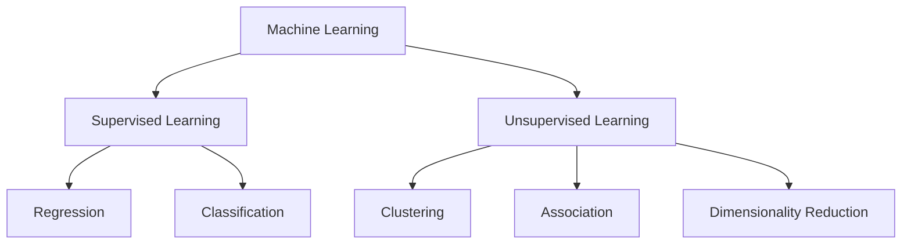

# Supervised and Unsupervised Machine Learning

## Introduction

&emsp; Machine learning is a branch of artificial intelligence that allows systems to learn and make predictions or decisions without explicit programming. Two main types of machine learning are **Supervised Learning** and **Unsupervised Learning**. Below is a summary of their characteristics, subfields, along with a visual representation for clarity.

---

 

## **Supervised Learning**

&emsp; Supervised learning is a type of machine learning where the model is trained on labeled data. Labeled data means that each input has a corresponding output (or target) already provided. The goal is for the model to learn the relationship between the inputs and outputs so that it can make predictions for new, unseen data.

### **Key Characteristics**

- **Input and Output:** The training data contains both input features (X) and target labels (Y).
- **Goal:** Predict the output (Y) for a given input (X).

### **Subfields**

1. **Regression:** Predicting continuous values (e.g., predicting rent prices based on apartment size).
2. **Classification:** Assigning inputs to discrete categories (e.g., diagnosing cancer as benign or malignant).

### **Example: Regression**

- **Scenario:** Predicting rent prices based on apartment size (in m²).
- **Details:**
  - Input features (X): Apartment size, number of rooms, neighborhood, etc.
  - Target variable (Y): Rent price (e.g., $ per month).
- **Model's Job:** Learn the relationship between apartment features and rent prices, then predict the rent for a new apartment.

    

### **Example: Classification**

- **Scenario:** Diagnosing cancer (e.g., benign or malignant tumor).
- **Details:**
  - Input features (X): Measurements like tumor size, texture, cell shape, etc.
  - Target variable (Y): Class label (e.g., "Benign" or "Malignant").
- **Model's Job:** Classify a new tumor as benign or malignant based on input features.

    

---

 

## **Unsupervised Learning**

&emsp; Unsupervised learning deals with unlabeled data. The model tries to find patterns, structures, or relationships within the data without any predefined labels or targets. It’s often used for exploratory data analysis.

### **Key Characteristics**

- **Input Only:** The data contains only input features (X), with no target labels (Y).
- **Goal:** Discover hidden patterns or groupings in the data.

### **Subfields**

1. **Clustering:** Grouping similar data points into clusters (e.g., customer segmentation).
2. **Dimensionality Reduction:** Reducing the number of features in the dataset while preserving important information (e.g., PCA).
3. **Association:** Discovering relationships or associations between variables in large datasets (e.g., market basket analysis).

### **Example: Clustering**

- **Scenario:** Grouping customers for targeted marketing.
- **Details:**
  - Input features (X): Customer age, income, purchase history, location, etc.
  - No predefined labels (Y).
- **Model's Job:** Identify clusters of customers (e.g., "High-spenders," "Budget-conscious buyers").

    

### **Example: Dimensionality Reduction**

- **Scenario:** Visualizing high-dimensional data.
- **Details:**
  - Imagine you have a dataset with 100+ features (e.g., sensor data from a factory).
  - Dimensionality reduction (e.g., PCA) helps reduce it to 2D or 3D for easier visualization.
- **Model's Job:** Keep the important structure of the data while reducing complexity.

    

### **Example: Association**

- **Scenario:** Market basket analysis to identify product associations.
- **Details:**
  - Input features (X): Transaction data showing items purchased together.
  - No predefined labels (Y).
- **Model's Job:** Identify rules like "If a customer buys bread, they are likely to buy butter."
- **Use Case:** Recommendation systems, inventory planning.

    

---

 

## **Comparison Table**

| Feature            | Supervised Learning                     | Unsupervised Learning                            |
| ------------------ | --------------------------------------- | ------------------------------------------------ |
| **Data Type**      | Labeled data (X, Y)                     | Unlabeled data (X only)                          |
| **Goal**           | Predict outcomes                        | Find patterns or structures                      |
| **Key Techniques** | Regression, Classification              | Clustering, Dimensionality Reduction, Assocation |
| **Examples**       | Fraud detection, Stock price prediction | Market segmentation, Image compression           |

---

## **Key Takeaways**

- **Supervised Learning** requires labeled data and is commonly used for prediction tasks like regression and classification.
- **Unsupervised Learning** works with unlabeled data and focuses on finding hidden patterns through clustering or dimensionality reduction.
- Each technique has specific applications and is chosen based on the problem and the data available.

 
