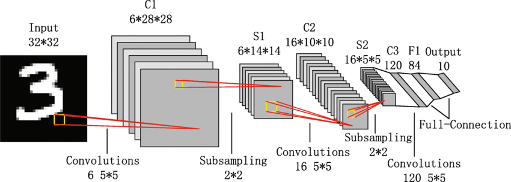
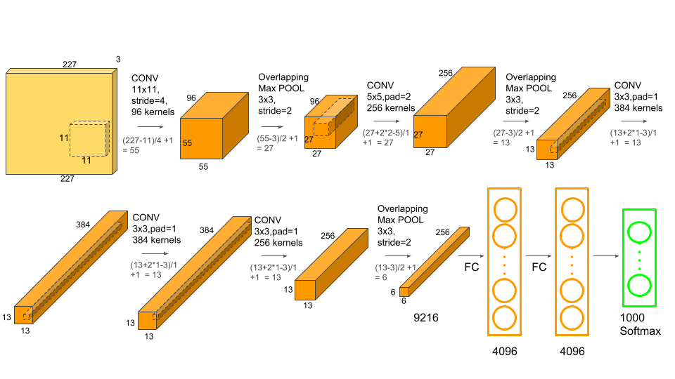

# Klasik Ağlar: LeNet-5, AlexNet, VGG

<!-- toc -->

 
 

Derin öğrenme (deep learning) ve bilgisayarla görü (computer vision) alanlarının ilk dönemlerinde, birkaç temel evrişimli sinir ağı (convolutional neural network — CNN) mimarisi alanı şekillendirmiş ve görüntü tanımada önemli atılımları mümkün kılmıştır. Bu dokümanda, tarihsel olarak en önemli ve teknik açıdan en etkili üç ağı inceliyoruz: **LeNet-5**, **AlexNet** ve **VGG**.

Bu mimariler, CNN tasarımının sığ, basit modellerden ImageNet gibi büyük veri kümelerinde ölçeklenebilen daha derin ve daha güçlü sistemlere doğru ilerleyişini gözler önüne sermektedir.

 
 

---

## Neden Klasik Ağlara Bakmalıyız?

Klasik CNN mimarilerini anlamak aşağıdaki nedenlerle önemlidir:

- Temel yapı taşlarını (örneğin, evrişim katmanları (convolutional layers), havuzlama katmanları (pooling layers), ReLU aktivasyonu) tanıtırlar.
- Derin öğrenme evriminin farklı aşamalarında karşılaşılan zorlukları (örneğin, aşırı öğrenme (overfitting), kaybolan gradyanlar (vanishing gradients)) vurgularlar.
- Modern derin mimarilerin tasarım felsefesine dair içgörüler sağlarlar.

 
 
 

---

## LeNet-5 (1998, Yann LeCun)

### Genel Bakış

LeNet-5, el yazısı rakamları (örneğin, MNIST veri kümesi) tanımak için tasarlanmış en eski CNN modellerinden biriydi. Öğrenilmiş evrişim filtrelerinin (convolutional filters) az sayıda parametreyle birleştirildiğinde ne kadar güçlü olabileceğini göstermiştir.

### Mimari

    

- **Girdi (Input)**: 32x32 gri tonlamalı (grayscale) görüntü
- **C1**: 5x5 boyutunda 6 filtreli evrişim katmanı → çıktı: 28x28x6
- **S2**: Alt örnekleme (ortalama havuzlama) katmanı → çıktı: 14x14x6
- **C3**: 16 filtreli evrişim katmanı → çıktı: 10x10x16
- **S4**: Alt örnekleme katmanı → çıktı: 5x5x16
- **C5**: Tam bağlantılı evrişim katmanı → çıktı: 120
- **F6**: Tam bağlantılı (fully connected) katman → çıktı: 84
- **Çıktı (Output)**: 10 sınıflı softmax katmanı

### Parametreler

LeNet, paylaşılan ağırlıklar (shared weights) kullanarak tam bağlantılı ağlara kıyasla parametre sayısını azaltır.

### İçgörüler

- **Yerel alıcı alanlar (local receptive fields)**, **ağırlık paylaşımı (weight sharing)** ve **alt örnekleme (subsampling)** fikirlerini tanıttı.
- Küçük veri kümeleri için mükemmeldir ancak sığ derinliği nedeniyle büyük ölçekli verilerde zorlanır.

 
 
 

---

## AlexNet (2012, Alex Krizhevsky, Ilya Sutskever, Geoffrey Hinton)

### Atılım

AlexNet, derin öğrenmenin ImageNet Büyük Ölçekli Görsel Tanıma Yarışması'ndaki (ILSVRC 2012) ilk büyük başarısını işaret ederek, ikincinin %26'sına kıyasla **%15,3 top-5 hata** oranı elde etmiştir.

### Mimari

    

- **Girdi**: 224x224x3 RGB görüntü
- **Conv1**: 11x11 boyutunda 96 filtre, adım (stride) 4 → 55x55x96
- **MaxPool1**: 3x3, adım 2 → 27x27x96
- **Conv2**: 5x5 boyutunda 256 filtre → 27x27x256
- **MaxPool2**: 3x3 → 13x13x256
- **Conv3**: 3x3 boyutunda 384 filtre → 13x13x384
- **Conv4**: 3x3 boyutunda 384 filtre → 13x13x384
- **Conv5**: 3x3 boyutunda 256 filtre → 13x13x256
- **MaxPool3**: 3x3 → 6x6x256
- **FC6**: 4096 nöronlu tam bağlantılı katman
- **FC7**: 4096 nöronlu tam bağlantılı katman
- **FC8**: 1000 yollu softmax katmanı

### Temel Yenilikler

- Sigmoid veya tanh yerine **ReLU** (Rectified Linear Unit — Düzeltilmiş Doğrusal Birim) kullanıldı → daha hızlı eğitim
- Düzenlileştirme (regularization) için **dropout** yöntemi tanıtıldı
- Paralel olarak iki GPU'da eğitildi

### İçgörüler

- Dünyaya, büyük veri kümeleri ve GPU'larla eğitilen **derin ağların** geleneksel makine öğrenmesi modellerinden daha iyi performans gösterebileceğini gösterdi.

 
 
 

---

## VGG Ağları (2014, Görsel Geometri Grubu, Oxford)

VGG, basitlik ve derinliği vurgulamıştır: küçük 3x3 filtreler kullanarak ve bunları derinlemesine istifleyerek karmaşık örüntüleri yakalamayı hedeflemiştir.

### Mimari (VGG-16)

    

- **Girdi**: 224x224x3 RGB görüntü
- 3x3 filtreler kullanan **13 evrişim katmanı (convolutional layer)** yığını
- Uzamsal boyutları azaltmak için **5 maksimum havuzlama (max-pooling)** katmanı
- Sonuncusu sınıflandırma için softmax olan **3 tam bağlantılı katman**

Örnek:

- Conv3-64 → Conv3-64 → MaxPool
- Conv3-128 → Conv3-128 → MaxPool
- Conv3-256 → Conv3-256 → Conv3-256 → MaxPool
- Conv3-512 → Conv3-512 → Conv3-512 → MaxPool
- Conv3-512 → Conv3-512 → Conv3-512 → MaxPool
- FC-4096 → FC-4096 → Softmax(1000)

### Özellikler

- Tutarlı bir şekilde **3x3 filtre** kullanımı tasarımı basitleştirir ve daha derin ağlara olanak tanır
- Önemli miktarda bellek ve hesaplama gerektirir (yüz milyonlarca parametre)

### İçgörüler

- **Derinliğin** CNN performansını artırmada kilit bir faktör olduğunu gösterdi
- Bu mimari bir **kıyaslama (benchmark)** hâline geldi ve sonraki birçok modeli etkiledi

 
 
 

---

## Özet Tablosu

| Model   | Yıl | Girdi Boyutu | Derinlik | Benzersiz Yönler                       |
| ------- | --- | ------------ | -------- | -------------------------------------- |
| LeNet-5 | 1998 | 32x32        | 7        | Yerel alıcı alanlar, alt örnekleme     |
| AlexNet | 2012 | 224x224x3    | 8        | ReLU, dropout, GPU paralelliği         |
| VGG-16  | 2014 | 224x224x3    | 16       | Basitlik, 3x3 filtreler, derinlik      |

 
 
 

---

## Son Düşünceler

Bu klasik CNN mimarileri, modern bilgisayarla görü sistemlerinin omurgasını oluşturmaktadır. Her biri, derin ağların eğitiminde karşılaşılan belirli zorluklara çözüm getiren önemli mimari yenilikler sunmuştur.

Bunları anlamak, derin öğrenmenin evrimini takdir etmemizi ve günümüzün büyük veri ve hesaplama kaynaklarına uygun modelleri daha iyi tasarlamamızı sağlar.

 
 
 
