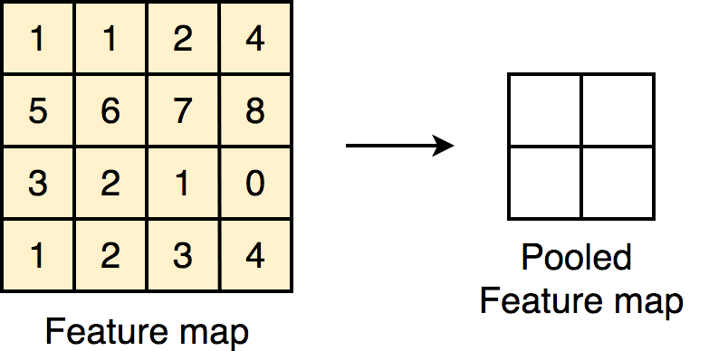
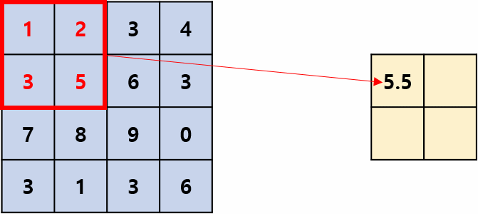
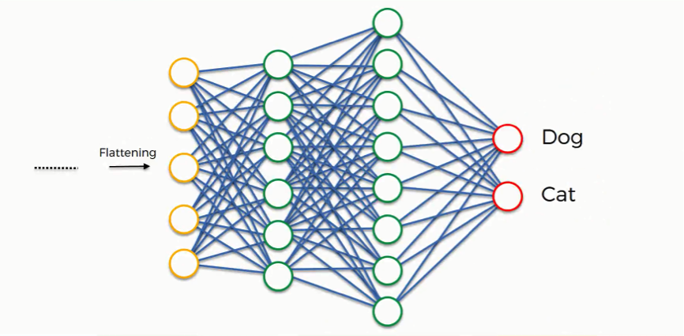
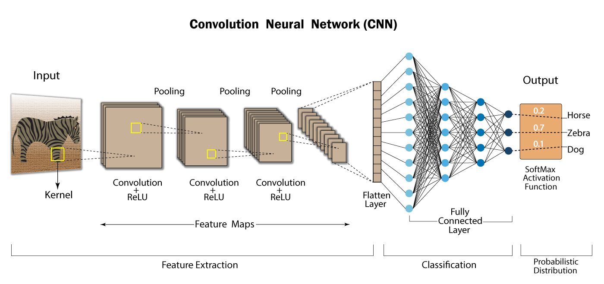

# CNN Mimarisi ve Örnekler (CNN Architecture and Examples)

<!-- toc -->

## 1. Bir Konvolüsyonel Ağ Katmanı (One Layer of a Convolutional Network)

Bir **Konvolüsyonel Sinir Ağı (Convolutional Neural Network - CNN)** tipik olarak üç tür katmandan oluşur:

    

- **Konvolüsyonel katmanlar (Convolutional layers):** Uzamsal öznitelikleri (spatial features) çıkarmak için filtreler uygular.
- **Havuzlama katmanları (Pooling layers):** Hesaplamayı azaltmak için öznitelik haritalarını (feature maps) altörnekler (downsample).
- **Tam bağlantılı katmanlar (Fully connected layers):** Son sınıflandırma veya regresyonu gerçekleştirir.

Her katman, öğrenilebilir parametreler veya sabit işlemler aracılığıyla girdi hacmini (input volume) bir çıktı hacmine (output volume) dönüştürür.

### CNN Katman Türleri (Layer Types of CNN)

#### 1. Konvolüsyonel Katmanlar (Convolutional Layers)

**Amaç (Purpose):**

Filtreleri girdi görüntüsü veya öznitelik haritası üzerinde kaydırarak kenarlar, dokular ve desenler gibi uzamsal öznitelikleri çıkarmak.

**Nasıl çalışır (How it works):**

- $f \times f$ boyutunda bir filtre (veya çekirdek - kernel) girdi üzerinde kayar.
- Her konumda, filtre ile üzerine gelen girdi bölümü arasında eleman bazında çarpma (element-wise multiplication) yapılır.
- Sonuçlar toplanarak çıktı öznitelik haritasında tek bir sayı üretilir.

**Matematiksel İşlem (Mathematical Operation):**

Girdi $X \in \mathbb{R}^{n_H \times n_W \times n_C}$ ve filtre $W \in \mathbb{R}^{f \times f \times n_C}$ olsun.

$$
Z_{i,j} = \sum_{m=0}^{f-1} \sum_{n=0}^{f-1} \sum_{c=0}^{n_C-1} X_{i+m,j+n,c} \cdot W_{m,n,c} + b
$$

**Örnek (Example):**

Girdi: $5 \times 5$ gri tonlamalı görüntü, $3 \times 3$ filtre ile:

    

Filtre girdi üzerinde kayarken, güçlü merkez geçişlerine sahip bölgelerde yüksek aktivasyon üreterek dikey ve yatay kenarları tespit eder.

---

#### 2. Havuzlama Katmanları (Pooling Layers)

**Amaç (Purpose):**

Öznitelik haritalarının uzamsal boyutlarını (yükseklik ve genişlik) azaltmak, böylece:

- Parametre sayısını ve hesaplamayı azaltmak
- Aşırı öğrenmeyi (overfitting) kontrol etmek
- Modeli girdideki küçük ötelemelere (small translations) karşı değişmez (invariant) hale getirmek

**Türler (Types):**

**Maksimum Havuzlama (Max Pooling):**

    

Her bölgedeki maksimum değeri seçer.

**Ortalama Havuzlama (Average Pooling):**

    

Her bölgedeki değerlerin ortalamasını alır.

---

#### 3. Tam Bağlantılı Katmanlar (Fully Connected Layers)

Bir katmandaki her nöronu sonraki katmandaki her nörona bağlayarak son sınıflandırma veya regresyonu gerçekleştirir.

    

**Nasıl çalışır (How it works):**

- Son konvolüsyonel/havuzlama katmanından gelen düzleştirilmiş (flattened) çıktıyı alır
- Bir veya daha fazla yoğun (dense) katmandan geçirir
- Son katman genellikle sınıflandırma için **softmax** kullanır

**Matematiksel Form (Mathematical Form):**

Girdi vektörü $x \in \mathbb{R}^n$, ağırlıklar $W \in \mathbb{R}^{m \times n}$ ve bias $b \in \mathbb{R}^m$ olarak verilsin:

$$
z = Wx + b
$$

$$
a = g(z) \text{ burada } g \text{ bir aktivasyon fonksiyonudur (örneğin, ReLU, Softmax)}
$$

**Örnek (Example):**

Son havuzlama katmanından $5 \times 5 \times 16 = 400$ boyutunda bir öznitelik haritası çıktımız olduğunu varsayalım:

- FC1: 400 → 120 (ReLU)
- FC2: 120 → 84 (ReLU)
- FC3: 84 → 10 (Softmax, 10 sınıflı sınıflandırma için)

Bu yoğun katmanlar, önceki katmanlarda öğrenilen tüm yüksek seviyeli öznitelikleri birleştirir ve bir tahmin çıktısı üretir.

---

#### Özet Tablosu (Summary Table)

| Katman Türü (Layer Type) | Rolü (Role)                            | Tipik Parametreler (Typical Parameters) | Çıktı Şekli Dönüşümü (Output Shape Transformation)                                                |
| ------------------------ | -------------------------------------- | --------------------------------------- | ------------------------------------------------------------------------------------------------ |
| Konvolüsyonel (Convolutional) | Yerel uzamsal öznitelikleri çıkarır | $f$, $s$, $p$, filtreler              | $n_H \times n_W \times n_C \rightarrow n_{H'} \times n_{W'} \times n_{C'}$                   |
| Havuzlama (Pooling)      | Öznitelik haritalarını altörnekler    | $f$, $s$                                | $n_H \times n_W \times n_C \rightarrow n_{H'} \times n_{W'} \times n_C$                      |
| Tam Bağlantılı (Fully Connected) | Son sınıflandırma/regresyon    | katman başına nöron sayısı              | $n \rightarrow m$ (vektör boyutu)                                                                |

Bu katmanlar birlikte Konvolüsyonel Sinir Ağlarının temelini oluşturarak, ham piksellerden soyut kavramlara kadar hiyerarşik temsiller (hierarchical representations) öğrenmelerini sağlar.

### Notasyon ve Terminoloji (Notation and Terminology)

- $ n_H, n_W $: girdi hacminin yüksekliği ve genişliği
- $ n_C $: kanal sayısı (derinlik)
- $ f $: filtre boyutu
- $ s $: adım (stride)
- $ p $: dolgu (padding)
- $ W^{[l]} $, $ b^{[l]} $: $ l $ katmanındaki ağırlıklar ve biaslar

### Parametreler ve Öğrenilebilir Bileşenler (Parameters and Learnable Components)

- **Ağırlıklar ($ W $)**: Filtreleri temsil eder; girdi üzerinde uzamsal olarak paylaşılır.
- **Biaslar ($ b $)**: Filtre başına bir tane.
- **Aktivasyon ($ A $)**: ReLU veya diğer doğrusal olmayan fonksiyonun çıktısı.

Bir katmandaki her nöron, yalnızca önceki katmanın küçük bir bölgesine bağlıdır; bu da seyrek etkileşimler (sparse interactions) ve parametre paylaşımı (parameter sharing) sağlar.

---

## 3. CNN Örneği (Kapsamlı Ağ)

    

 
 

## Neden Konvolüsyonlar? (Why Convolutions?)

Konvolüsyonel katmanlar, **bilgisayarlı görüşteki (computer vision) modern derin öğrenme modellerinin temel taşıdır** ve görüntü işleme görevlerinde geleneksel tam bağlantılı katmanların yerini almıştır. Bu bölüm, konvolüsyonların neden yoğun katmanlar yerine kullanıldığını ve ne gibi avantajlar sağladığını **incelemektedir**.

---

### 1. Tam Bağlantılı Katmanların Görüntüler İçin Sınırlamaları (The Limitations of Fully Connected Layers for Images)

**a. Parametre Patlaması (Parameter Explosion)**

Bir görüntünün her pikselini sonraki katmandaki her nörona bağlayan tam bağlantılı (yoğun) bir katman **çok büyük sayıda parametre** gerektirir.

Örnek:

- Girdi görüntü boyutu: $ 64 \times 64 \times 3 = 12.288 $
- 1000 nöronlu tam bağlantılı katman:
  $ \text{Parametreler} = 12.288 \times 1000 = 12.288.000 $

Bu, yüksek bellek kullanımına, aşırı öğrenme riskine ve uzun eğitim sürelerine yol açar.

**b. Uzamsal Yapıyı Görmezden Gelmesi (Ignores Spatial Structure)**

Yoğun katmanlar girdi özniteliklerini bağımsız olarak ele alır ve görüntü verisinin **uzamsal yerelliğinden (spatial locality)** yararlanmaz.

- Bir kedinin kulağı, sol üst ve sağ alt köşelerde olsa da, yoğun katmanlar tarafından ilişkisiz olarak ele alınır.

---

### 2. Konvolüsyonel Katmanların Faydaları (Benefits of Convolutional Layers)

**a. Seyrek Etkileşimler (Sparse Interactions)**

Her çıktı nöronu, girdinin yalnızca **küçük bir bölgesine** (buna **alıcı alan - receptive field** denir) bağlıdır.

- Daha az parametre
- Daha hızlı hesaplamalar

Örnek:

- 12.288 pikselin tamamına bağlanmak yerine $ f = 5 $ kullanmak

**b. Parametre Paylaşımı (Parameter Sharing)**

Aynı filtre (ağırlıklar) görüntünün tamamında uygulanır:

$$
Z[i, j] = \sum_{m=0}^{f-1} \sum_{n=0}^{f-1} W[m, n] \cdot X[i+m, j+n] + b
$$

Bu, parametre sayısında **büyük bir azalma** sağlar ve **öznitelik tespitinin öteleme değişmez (translation invariant)** olmasına olanak tanır.

**c. Öteleme Eşdeğişirliliği (Translation Equivariance)**

- Bir nesne görüntüde hareket ederse, öznitelik haritası da hareket eder.
- Model **konumdan bağımsız** öznitelikler öğrenir — genelleme (generalization) için önemlidir.

 
 
 

---

 
 
 
 
