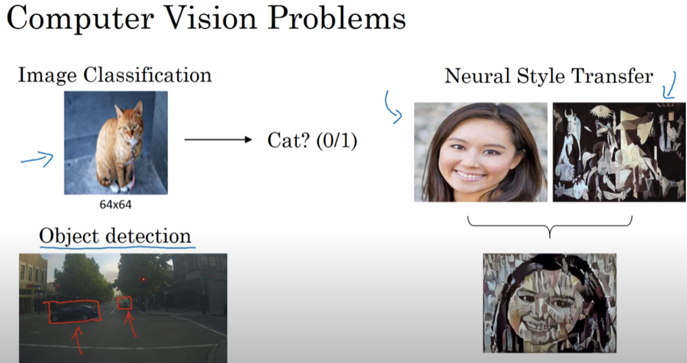
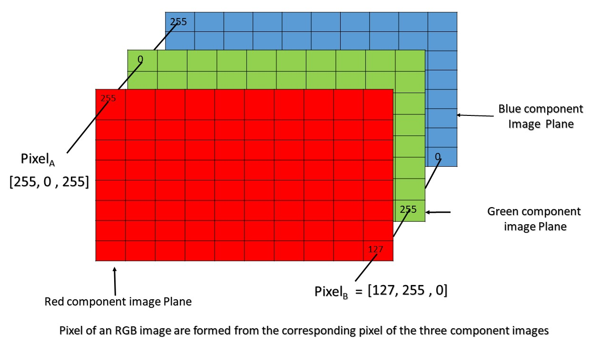
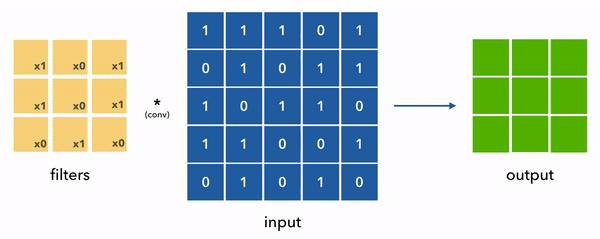
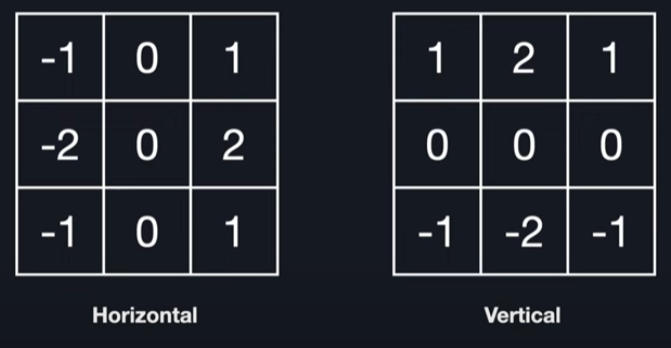
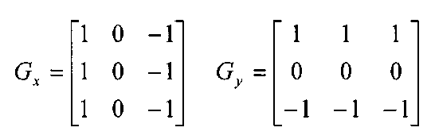
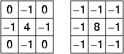

# Bilgisayarlı Görü ve Kenar Tespiti

<!-- toc -->

## Bilgisayarlı Görü

### Bilgisayarlı Görüye Giriş

Bilgisayarlı Görü (Computer Vision), makinelerin dünyadan gelen görsel bilgiyi yorumlamasını ve anlamasını sağlayan bir yapay zeka (AI) alanıdır. Görüntü tanıma, nesne tespiti ve bölütleme (segmentation) gibi görevleri kapsar.

**Gerçek Dünya Uygulamaları**

    

- **Yüz Tanıma:** Güvenlik sistemlerinde ve sosyal medya etiketlemede kullanılır.
- **Tıbbi Görüntüleme:** Röntgen, MR ve BT taramaları kullanarak hastalıkların tespitine yardımcı olur.
- **Otonom Araçlar:** Sürücüsüz arabaların nesneleri ve trafik işaretlerini tanımasını sağlar.
- **Endüstriyel Otomasyon:** Üretimde hata tespiti için kullanılır.

### Temel Kavramlar

- **Pikseller:** Bir görüntüdeki en küçük birim.
- **Gri Tonlamalı ve Renkli Görüntüler:** Tek kanallı ve çok kanallı görüntüler arasındaki fark.
- **Çözünürlük:** Bir görüntüdeki piksel sayısı.
- **Görüntü Temsili:** Görüntülerin piksel değerlerinden oluşan matrisler olarak ifade edilmesi.

### Matematiksel Formülasyon

Bir görüntü bir matris olarak temsil edilebilir:

    

$$
I(x, y) \in \mathbb{R}^{m \times n \times c}
$$

burada $m$ ve $n$ yükseklik ve genişliği, $c$ ise renk kanalı sayısını temsil eder (gri tonlamalı için 1, RGB görüntüler için 3).

 
 
 

---

## Kenar Tespiti

### Kenar Tespiti İçin Neden Evrişim Kullanılır?

Kenar tespiti (edge detection), bir görüntüde yoğunluğun keskin bir şekilde değiştiği noktaları bulmayı amaçlar. Bu noktalar genellikle nesnelerin sınırlarına, doku değişimlerine veya derinlik süreksizliklerine karşılık gelir. Bu değişimleri tespit etmek için belirli filtrelerle **evrişim (convolution) işlemleri** uygularız.

  

**Evrişim (Convolution)**, kenarlar gibi belirli desenleri tespit etmek için küçük bir matrisi (buna **filtre (filter)** veya **çekirdek (kernel)** denir) görüntü boyunca kaydırmamıza yardımcı olan matematiksel bir işlemdir.

#### Bir Filtre Ne İşe Yarar?

Bir filtre, esasen görüntü üzerinde kayan ve belirli özellikleri vurgulayan küçük bir sayı tablosudur (örneğin $3x3$):

- Kenar filtreleri yoğunluk değişimlerini vurgular
- Bulanıklaştırma filtreleri görüntüyü yumuşatır
- Keskinleştirme filtreleri detayları belirginleştirir

Kenar tespitinde, filtreler yüksek uzamsal frekans değişimlerini—yani **kenarları**—tespit edecek şekilde tasarlanmıştır.

### Matematiksel Örnek

$$
I = \left[ \begin{array}{cccccc}
12 & 15 & 14 & 10 & 9 & 10 \\
18 & 20 & 22 & 17 & 14 & 12 \\
24 & 28 & 30 & 26 & 20 & 18 \\
30 & 33 & 35 & 32 & 28 & 25 \\
22 & 25 & 28 & 24 & 22 & 20 \\
15 & 17 & 19 & 18 & 16 & 15
\end{array} \right]
$$

Bir **dikey Sobel filtresi** $ K_v $ uyguluyoruz:

$$
K_v = \left[ \begin{array}{ccc}
-1 & 0 & 1 \\
-2 & 0 & 2 \\
-1 & 0 & 1
\end{array} \right]
$$

Bu filtre, yatay yoğunluk geçişlerini vurgulayarak **dikey kenarları** tespit eder.

---

#### Adım Adım Evrişim (Dolgu Yok, Adım = 1)

Çıktı matrisinin sol üst değerini hesaplayalım. Filtreyi, \\( I \\) matrisinin sol üst 3x3 penceresine yerleştiriyoruz:

**Pencere:**

$$
\left[ \begin{array}{ccc}
12 & 15 & 14 \\
18 & 20 & 22 \\
24 & 28 & 30
\end{array} \right]
$$

**Eleman bazında çarpma ve toplama:**

$$
(-1 \cdot 12) + (0 \cdot 15) + (1 \cdot 14) + (-2 \cdot 18) + (0 \cdot 20) + (2 \cdot 22) + (-1 \cdot 24) + (0 \cdot 28) + (1 \cdot 30)
$$

$$
= -12 + 0 + 14 - 36 + 0 + 44 - 24 + 0 + 30 = 16
$$

Yani, çıktı matrisinin sol üst değeri **16**'dır.

---

#### İkinci Evrişim Adımı (Sağa Kaydırma)

Yeni pencere (filtreyi bir adım sağa kaydırıyoruz):

$$
\left[ \begin{array}{ccc}
15 & 14 & 10 \\
20 & 22 & 17 \\
28 & 30 & 26
\end{array} \right]
$$

Aynı işlemi uyguluyoruz:

$$
(-1 \cdot 15) + (0 \cdot 14) + (1 \cdot 10) + (-2 \cdot 20) + (0 \cdot 22) + (2 \cdot 17) + (-1 \cdot 28) + (0 \cdot 30) + (1 \cdot 26)
$$

$$
= -15 + 0 + 10 - 40 + 0 + 34 - 28 + 0 + 26 = -13
$$

Yani, ikinci değer **-13**'tür.

---

#### Tam Çıktı Matrisi (4x4)

Filtreyi 6x6 görüntü üzerinde kaydırdıktan sonra 4x4 çıktıyı elde ederiz:

$$
I * K_v = \left[ \begin{array}{cccc}
16 & -13 & -25 & -26 \\
20 & -11 & -22 & -24 \\
12 & -8 & -18 & -16 \\
4 & -5 & -9 & -8
\end{array} \right]
$$

Bu matris, orijinal görüntüdeki **dikey kenarları**—piksel yoğunluklarının soldan sağa en çarpıcı şekilde değiştiği alanları—vurgular.

Görüntünün bu filtrelerle evrişiminin sonucu, bize güçlü gradyanın—kenarların—olduğu alanları verir.

### Önemli Kavrayış:

> Filtreler, piksel değerlerindeki _değişim_ fikrini hesaplanabilir bir niceliğe dönüştürür.

---

### Kenar Tespiti Teknikleri

#### 1. **Sobel Operatörü**

- Gauss yumuşatma ve türev almayı birleştirir.
- Yatay ($G_x$) ve dikey ($G_y$) gradyanlar ön tanımlı 3x3 çekirdekler (kernels) kullanılarak hesaplanır.
  $$ 3 x 3 \text{Sobel Çekirdekleri}$$
    

    
    

- Gradyan büyüklüğü:
  $$
  G = \sqrt{G_x^2 + G_y^2}, \quad \theta = \tan^{-1}\left(\frac{G_y}{G_x}\right)
  $$
- Basitliği ve gürültüye karşı direnci nedeniyle yaygın olarak kullanılır.
- Bu youtube videosunu izleyin

#### 2. **Prewitt Operatörü**

- Sobel'e benzer, ancak tek tip ağırlıklara sahiptir.
  $$ 3 x 3 \text{Prewitt Çekirdekleri}$$
    

    
    

- Sobel'e kıyasla gürültüye karşı biraz daha az duyarlıdır.

#### 3. **Gauss Laplasyeni (LoG)**

- İkinci türev yöntemi.
- Gauss ile yumuşatılmış bir görüntüye Laplasyen uygulandıktan sonra sıfır geçişlerini (zero-crossings) belirleyerek kenarları tespit eder.
    

    
    

- Denklem:
  $$
  \nabla^2 I = \frac{\partial^2 I}{\partial x^2} + \frac{\partial^2 I}{\partial y^2}
  $$
- Gürültüye karşı duyarlıdır, bu nedenle önce Gauss yumuşatması uygulanır.

#### 4. **Canny Kenar Tespiti**

Optimal kenar tespiti için tasarlanmış çok aşamalı bir algoritma:

1. **Gauss Filtreleme:** Gürültü azaltma.
2. **Gradyan Hesaplama:** Sobel filtreleri kullanarak.
3. **Maksimum Olmayanı Bastırma (Non-Maximum Suppression):** Kenarları inceltme.
4. **Çift Eşikleme (Double Thresholding):** Kenarları güçlü, zayıf veya kenar değil olarak sınıflandırma.
5. **Histerezis (Hysteresis):** Zayıf kenarları, güçlü kenarlara bitişiklerse onlara bağlama.

> Canny, yüksek doğruluğu ve düşük yanlış tespit oranı nedeniyle pratikte yaygın olarak kullanılır.

#### 5. **Gauss Farkı (DoG)**

- İki Gauss bulanıklaştırılmış görüntüyü birbirinden çıkararak LoG'yi yaklaşıklar:
  $$
  DoG = G_{\sigma_1} * I - G_{\sigma_2} * I
  $$
- LoG'den daha hızlı hesaplanır.
- Lebke tespiti (blob detection) ve özellik eşlemede (feature matching) kullanılır.

 
 
 
