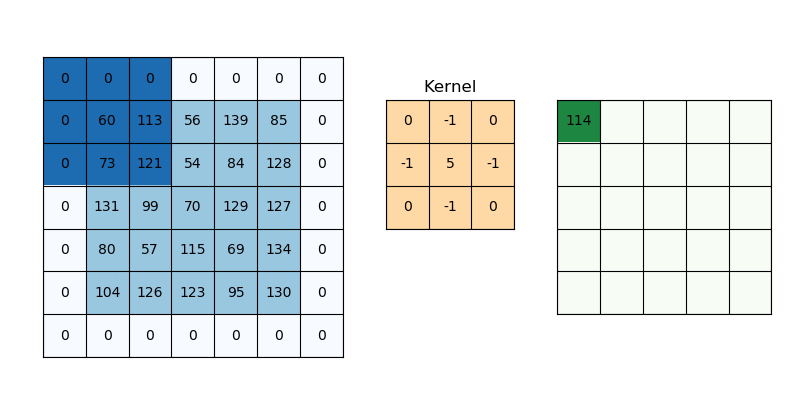
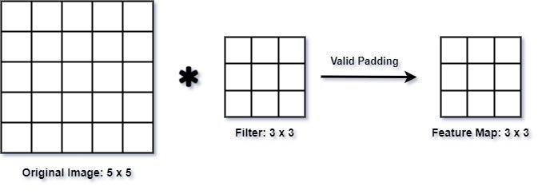
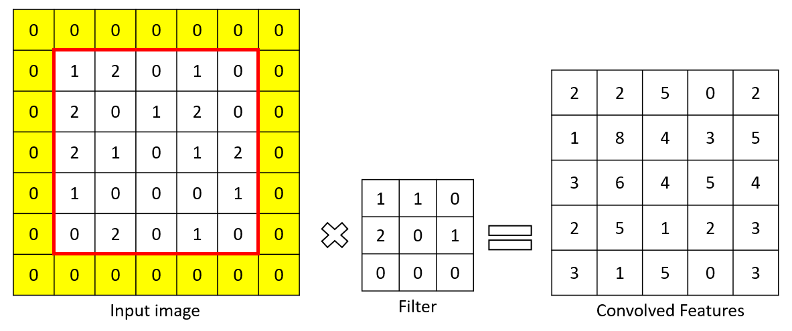
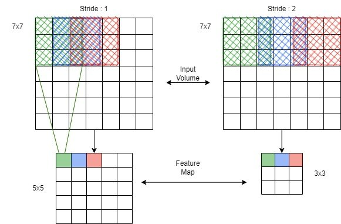
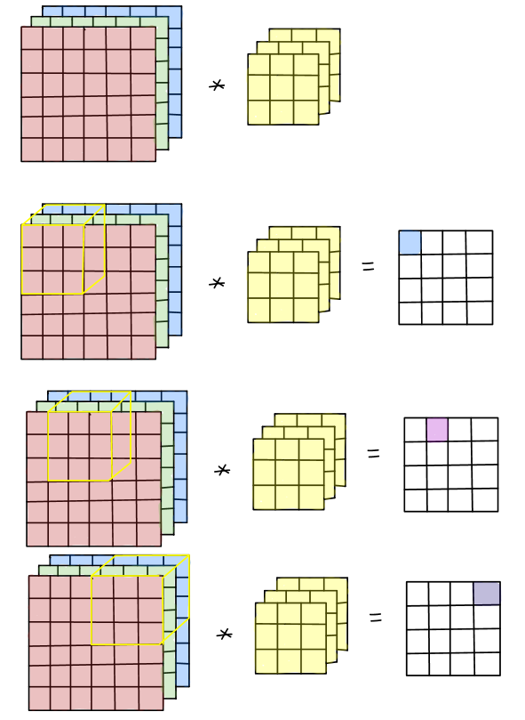
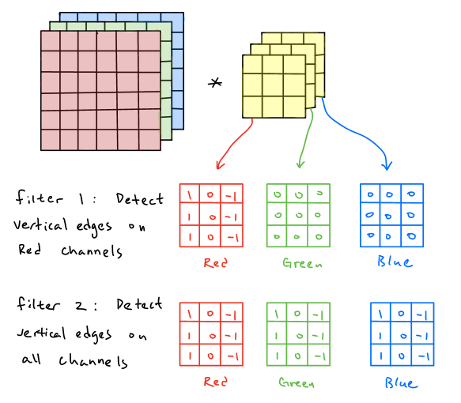
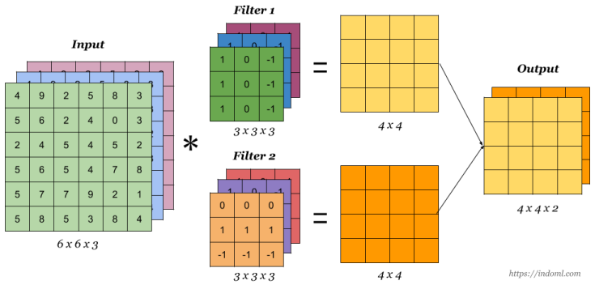

# Konvolüsyonel İşlemler (Convolutional Operations)

<!-- toc -->

## Padding (Dolgu)

    

### Padding Neden Gereklidir

Evrişim (convolution) uygularken, padding (dolgu) yapmadığımız sürece çıktı görüntüsü küçülür. Bu, uzamsal (spatial) boyutların her evrişimden sonra küçüldüğü derin ağlar (deep networks) oluştururken bir sorundur.

#### Padding'siz:

$$
\text{Output size} = n - f + 1
$$

Nerede:

- $n$: girdi boyutu (input size)
- $f$: filtre boyutu (filter size)

##### Örnek

    

Bu görselde:

- $n$: girdi boyutu = $5$
- $f$: filtre boyutu = $3$

$$
\text{Output size} = n - f + 1
$$

$$
\text{Output size} = 5 - 3 + 1
$$

$$
\text{Output size} = 3
$$

#### Padding (Dolgu) ile ($p$):

$$
\text{Output size} = n + 2p - f + 1
$$

Nerede:

- $n$: girdi boyutu (input size)
- $f$: filtre boyutu (filter size)
- $p$: padding boyutu (padding size)

##### Örnek

    

Bu görselde:

- $n$: girdi boyutu = $6$
- $f$: filtre boyutu = $3$
- $p$: padding boyutu = $1$

$$
\text{Output size} = n + 2p - f + 1
$$

$$
\text{Output size} = 6 + (2\cdot 1) - 3 + 1
$$

$$
\text{Output size} = 6
$$

### Padding Türleri

- **Valid Padding (geçerli dolgu - paddingsiz):** Çıktı daha küçüktür.
- **Same Padding (aynı dolgu - sıfır dolgu):** Çıktı boyutu girdi boyutuna eşittir.

**Gerçek Dünya Analojisi**

Bir fotoğrafı büyüteçle incelediğinizi hayal edin: padding olmadan kenarları inceleyemezsiniz. Padding, görüntüyü genişleterek her pikselin eşit ilgi görmesini sağlar.

 
 
 

---

 

## Adımlı Evrişimler (Strided Convolutions)

### Adım (Stride) Nedir?

Adım (stride), filtrenin her adımda kaç piksel hareket ettiğidir.

    

- **Adım (Stride) = 1:** Normal evrişim (her seferinde 1 piksel hareket eder)
- **Adım (Stride) = 2:** Alt örnekleme (downsampling) (her seferinde 2 piksel hareket eder)

### Çıktı Boyutu Formülü

$$
\text{Output size} = \left\lfloor \frac{n + 2p - f}{s} \right\rfloor + 1
$$

Nerede:

- $n$: girdi boyutu (input size)
- $f$: filtre boyutu (filter size)
- $s$: adım (stride)
- $p$: padding (dolgu)

**Görsel Örnek**

Adım (stride) = 2 ise, filtre her alternatif pikseli atlayarak çıktının uzamsal (spatial) boyutunu etkili bir şekilde azaltır.

 
 
 

---

 

## Hacim Üzerinde Evrişimler (Convolutions Over Volume)

### 2B'den 3B'ye

    

RGB görüntülerde 3 kanalımız (channel) vardır: Kırmızı, Yeşil ve Mavi. Bu nedenle, bir evrişim katmanı (convolutional layer) 3B hacimler üzerinde işlem yapar.

    

### Girdi Boyutları (Input Dimensions):

$$
(n_H, n_W, n_C)
$$

- $n_H$: Yükseklik (Height)
- $n_W$: Genişlik (Width)
- $n_C$: Kanallar (Channels) (örneğin RGB için 3)

### Filtre Boyutları (Filter Dimensions):

$$
(f_H, f_W, n_C)
$$

- Filtre sayısı (number of filters): $n_F$

### Çıktı Hacmi (Output Volume):

$$
(n_H', n_W', n_F)
$$

- Her filtre bir 2B aktivasyon haritası (activation map) oluşturur ve bunlar bir araya getirilerek çıktı hacmini oluşturur.

### Pratik Örnek

Diyelim ki (6, 6, 3) boyutunda bir görüntünüz var ve boyutu (3, 3, 3) olan 2 filtre uyguluyorsunuz:

    

- Çıktı şekli (output shape): (4, 4, 2) (valid padding, stride=1 varsayımıyla)

 
 

---

 
 
 
 
