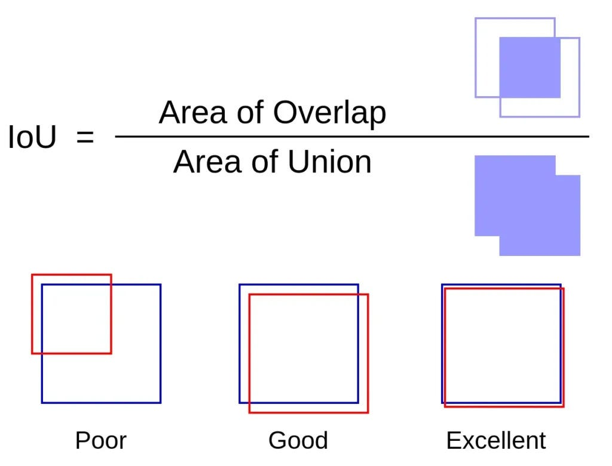
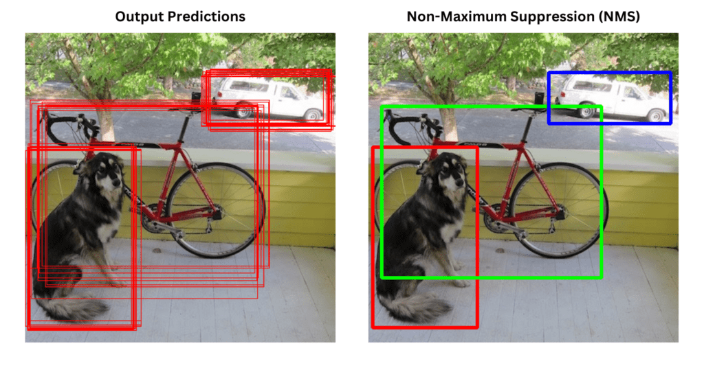
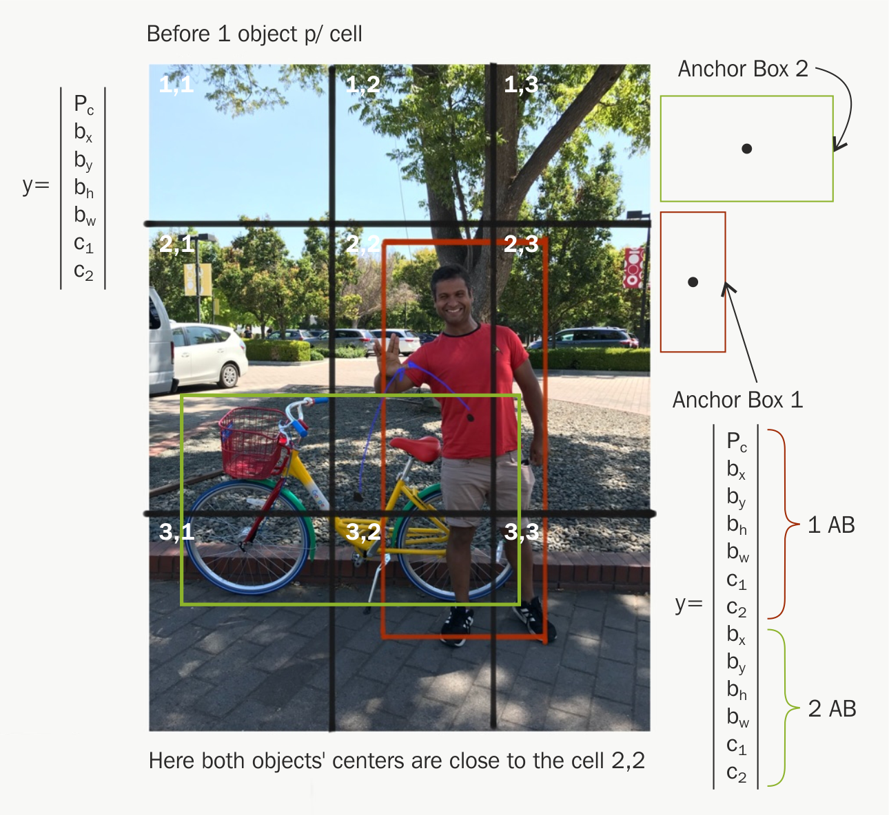

# Değerlendirme ve Optimizasyon: IoU, Non-max Suppression, Anchor Boxes

<!-- toc -->

## Intersection over Union (IoU)

Intersection over Union (IoU), bir nesne dedektörünün belirli bir veri kümesi üzerindeki doğruluğunu değerlendirmek için kullanılan bir metriktir. İki sınırlayıcı kutu (bounding box) arasındaki örtüşmeyi ölçer:

    

- Tahmin edilen sınırlayıcı kutu (predicted bounding box)
- Gerçek sınırlayıcı kutu (ground-truth bounding box)

 

**Matematiksel Tanım**

 

$B_p$ tahmin edilen sınırlayıcı kutu ve $B_{gt}$ gerçek sınırlayıcı kutu (ground truth bounding box) olsun:

$$
IoU = \frac{Area(B_p \cap B_{gt})}{Area(B_p \cup B_{gt})}
$$

- $IoU = 1.0$: mükemmel örtüşme
- $IoU = 0.0$: hiç örtüşme yok

 

**Örnek**

Varsayalım ki:

- Tahmin edilen kutu: sol-üst = (50, 50), sağ-alt = (150, 150)
- Gerçek kutu: sol-üst = (100, 100), sağ-alt = (200, 200)

Örtüşen alan, (100, 100)'den (150, 150)'ye kadar bir karedir → 50x50 = 2500

Toplam alan:

- Tahmin edilen: $100 \times 100 = 10.000$
- GT: $100 \times 100 = 10.000$
- Birleşim: $10.000 + 10.000 - 2.500 = 17.500$

Böylece,

$$
IoU = \frac{2500}{17500} = 0.143
$$

 

**Eğitim ve Değerlendirmede Kullanımı**

- Eğitim sırasında, IoU < 0.5 olan tespitleri göz ardı edebilirsiniz
- Değerlendirme için mAP (mean average precision — ortalama ortalama kesinlik) IoU eşiklerini kullanır (örneğin, 0,5 veya 0,75)

 
 

---

 

## Non-max Suppression (NMS)

**Neden İhtiyaç Duyarız?**

Nesne dedektörleri genellikle tek bir nesne için **birden çok örtüşen kutu** üretir. NMS, en yüksek güven skoruna (confidence score) sahip olanı tutarak gereksiz kutuları filtreler.

    

 

**Algoritma Adımları**

1. Tüm sınırlayıcı kutuları güven skorlarına göre sırala.
2. En yüksek güven skoruna sahip kutuyu seç ve listeden çıkar.
3. Bu kutu ile diğer tüm kutular arasındaki IoU'yu hesapla.
4. IoU'su bir eşik değerin (örneğin, 0,5) üzerinde olan kutuları kaldır.
5. Hiç kutu kalmayana kadar tekrarla.

 

**Matematiksel Sezgi**

$B_i$, $s_i$ skoruna sahip bir kutu olsun. Tüm kutular üzerinde döngü yaparak şunu uygularsınız:

$$
\text{Keep } B_i \text{ if } IoU(B_i, B_j) < T, \forall j < i
$$

Burada $T$ bastırma eşiğidir (suppression threshold).

 
 

---

## Anchor Boxes

**Anchor Boxes Nedir?**

Anchor box'lar (öncelikli kutular — prior boxes olarak da bilinir), farklı şekil ve boyutlarda önceden tanımlanmış sınırlayıcı kutulardır. Nesne dedektörlerinin şunları yapmasını sağlarlar:

- Aynı grid hücresinde **birden çok nesneyi** tespit etmek
- **En-boy oranı ve ölçek** farklılıklarını yönetmek

 

**Neden İhtiyaç Duyulur?**

Anchor box'lar olmadan, tek bir grid hücresi yalnızca bir nesneyi tespit edebilirdi. Ancak gerçek dünya sahneleri genellikle örtüşen veya birbirine yakın nesneler içerir.

    

 

**Anchor Box Tasarımı**

Hücre başına $k$ adet anchor box önceden tanımlarsınız. Her biri şunlarla tanımlanır:

- Genişlik $w$
- Yükseklik $h$
- En-boy oranı (aspect ratio) $r = \frac{w}{h}$

Örneğin, SSD'de:

- 3 özellik haritası (feature map)
- Özellik hücresi başına 6 anchor
- $\\Rightarrow$ Toplam 8732 anchor box

 

**Anchor'lar ile Çıktı Formatı**

Her bir anchor box için ağ (network) şunları tahmin eder:

- $\\Delta x, \\Delta y$: anchor merkezinden sapma (offset)
- $\\Delta w, \\Delta h$: genişlik ve yükseklikte logaritmik ölçek değişimleri
- Güven skoru (confidence score)
- Sınıf olasılıkları (class probabilities)

Bu, anchor box $(x_a, y_a, w_a, h_a)$ değerini tahmin edilen kutu $(x_p, y_p, w_p, h_p)$ değerine dönüştürür:

$$
x_p = x_a + w_a \cdot \Delta x \\
y_p = y_a + h_a \cdot \Delta y \\
w_p = w_a \cdot e^{\Delta w} \\
h_p = h_a \cdot e^{\Delta h}
$$

 
 

---

## Özet

- **IoU** örtüşmeyi ölçer ve kayıp/değerlendirme için kullanılır.
- **Non-max suppression (NMS)** IoU'ya dayalı olarak gereksiz kutuları kaldırır.
- **Anchor box'lar** farklı ölçek/en-boy oranlarında birden çok nesnenin tespit edilmesini sağlar.

Birlikte, bu teknikler YOLO, SSD ve Faster R-CNN gibi **modern nesne tespiti (object detection) sistemlerinin temelini** oluşturur.
 
 
