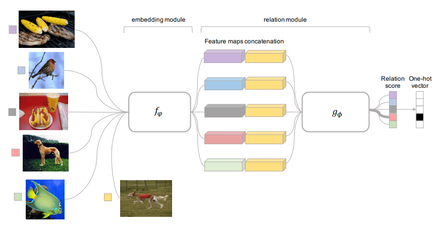
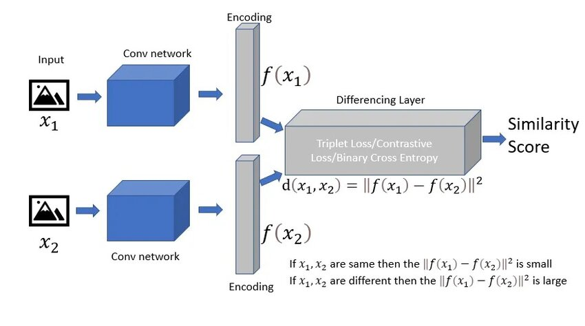
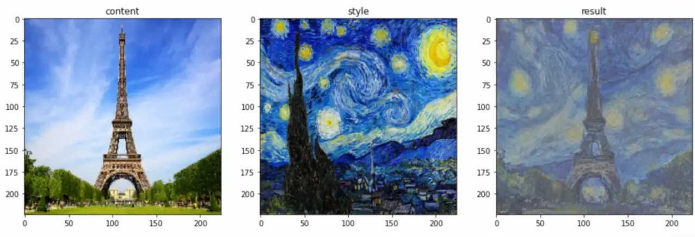
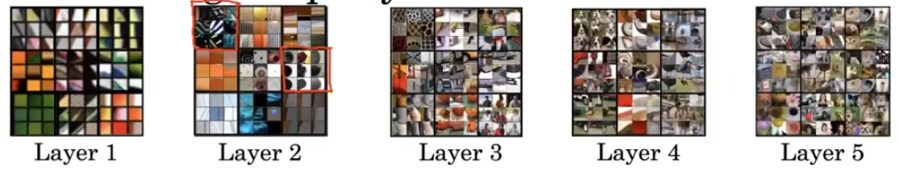
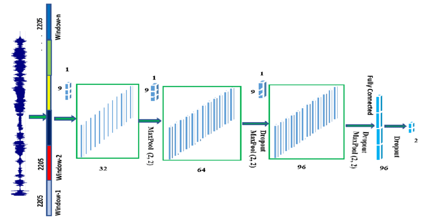
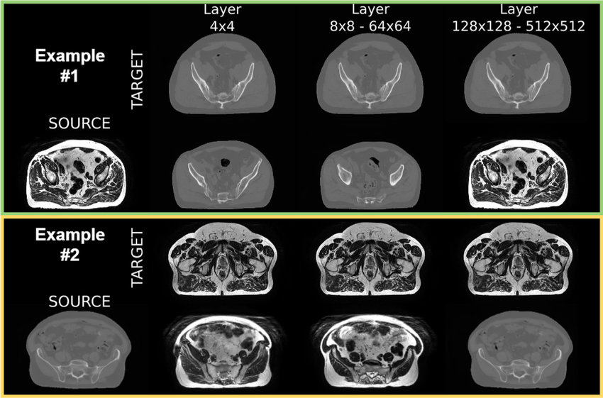

# Yüz Tanıma ve Sinirsel Stil Aktarımı (Face Recognition and Neural Style Transfer)

<!-- toc -->

## Yüz Tanıma Nedir? (What is Face Recognition?)

Yüz tanıma, bir kişinin kimliğini yüz özelliklerini kullanarak tanımlama veya doğrulama görevidir. Üç ana kategoriye ayrılabilir:

- **Yüz Tespiti (Face Detection):** Bir görüntüdeki yüzleri bulma (sınırlayıcı kutu).
- **Yüz Doğrulama (Face Verification):** İki yüzün aynı kişiye ait olup olmadığını kontrol etme (1:1 karşılaştırma).
- **Yüz Tanıma/Tanımlama (Face Recognition/Identification):** Bir kişiyi veritabanından tanımlama (1:N karşılaştırma).

 

**Gerçek Dünya Uygulamaları (Real-World Applications)**

- Akıllı telefon kilidi açma (Face ID)
- Güvenlik gözetimi
- Çevrimiçi sınav gözetimi
- Sosyal medya etiketleme (örn. Facebook)

 

---

### Tek Örnekli Öğrenme (One Shot Learning)

Geleneksel sınıflandırma algoritmaları, her sınıf için çok sayıda eğitim örneği gerektirir. Ancak yüz tanımada:

- Her kişi için yalnızca **tek bir görsele** sahip olabiliriz.
- Görev şu hale gelir: Model, yalnızca bir kez gördüğü bir yüzü tanıyabilir mi?

Buna **Tek Örnekli Öğrenme (One-Shot Learning)** denir.

**Problem Kurulumu (Problem Setup)**

    

- Sınıflandırmayı öğrenmek yerine, model görüntü çiftleri arasındaki **benzerliği (similarity)** öğrenir.
- Aynı kişi için küçük, farklı kişiler için büyük değer döndürecek şekilde bir **uzaklık fonksiyonu (distance function)** eğitilir.

 

---

### Siamese Ağı (Siamese Network)

Siamese Ağı, iki girdiyi karşılaştıran **iki özdeş ConvNet'ten** (paylaşılan ağırlıklarla) oluşur.

 

**Mimariye Genel Bakış (Architecture Overview)**

- İki girdi: $x_1$ ve $x_2$
- Aynı CNN, her ikisini de öznitelik vektörlerine $f(x_1)$ ve $f(x_2)$ haritalar
- Bir uzaklık metriği (örn. L2 normu) uygulanır:

$$
d(x_1, x_2) = \|f(x_1) - f(x_2)\|_2^2
$$

    

 

**Kayıp Fonksiyonu (Loss Function)**

Ağı, aynı kimlikler için mesafeleri **en aza indirgeyecek** ve farklı olanlar için **en üst düzeye çıkaracak** şekilde eğitmek için zıtlayıcı kayıp (contrastive loss) veya üçlü kayıp (triplet loss) kullanılır.

 

---

### Üçlü Kayıp (Triplet Loss)

Üçlü Kayıp, **gömme (embedding)** öğrenimi için güçlü bir kayıp fonksiyonudur. **Üçlülere (triplets)** dayanır:

- **Çapa (Anchor - A):** Bilinen bir görüntü
- **Pozitif (Positive - P):** Aynı kimliğe ait görüntü
- **Negatif (Negative - N):** Farklı bir kimliğe ait görüntü

    

Şunu istiyoruz:

$$
\|f(A) - f(P)\|_2^2 + \alpha < \|f(A) - f(N)\|_2^2
$$

Burada:

- $f(x)$ gömme fonksiyonudur (ConvNet çıktısı)
- $\alpha$, pozitif ve negatif çiftleri ayırmak için bir marjdır

 

**Kayıp Fonksiyonu (Loss Function)**

Üçlü Kayıp şöyledir:

$$
\mathcal{L}(A, P, N) = \max\left(\|f(A) - f(P)\|_2^2 - \|f(A) - f(N)\|_2^2 + \alpha, 0\right)
$$

 

**Önemli Notlar (Important Notes)**

- **Yarı-zor negatif madenciliği (semi-hard negative mining)** yakınsamayı iyileştirir (zor ama çok zor olmayan negatifleri seçin).
- Gömmeler genellikle birim uzunluğa normalize edilir.

 

---

### Yüz Doğrulama ve İkili Sınıflandırma (Face Verification and Binary Classification)

Eğitilmiş bir ağdan (örn. üçlü kayıp kullanarak) gömme vektörleri elde ettiğimizde, **yüz doğrulamayı** ikili sınıflandırma görevi olarak gerçekleştirebiliriz.

 

**Doğrulama Hattı (Verification Pipeline)**

1. Her iki yüz görüntüsünü de gömme vektörlerine kodlayın.
2. Öklid mesafesi veya kosinüs benzerliği hesaplayın.
3. Mesafe < eşik değer $\Rightarrow$ aynı kişi.

 

Eşik değeri $\theta$, bir doğrulama setinde ROC eğrisi kullanılarak **Yanlış Pozitif Oranı (False Positive Rate)** ve **Doğru Pozitif Oranına (True Positive Rate)** göre seçilir.

 

---

## Sinirsel Stil Aktarımı Nedir? (What is Neural Style Transfer?)

Sinirsel Stil Aktarımı (Neural Style Transfer), şu özellikleri taşıyan bir görüntü sentezleme görevidir:

- Bir **içerik (content)** görüntüsünün **içeriğini** korur
- Bir **stil (style)** görüntüsünün **stilini** benimser

İçerik ve stil temsillerini çıkarmak için **önceden eğitilmiş bir ConvNet** (VGG19 gibi) kullanılır.

    

Şöyle tanımlayalım:

- $C$ içerik görüntüsü olsun
- $S$ stil görüntüsü olsun
- $G$ oluşturulan görüntü olsun

Ardından $G$'yi bir maliyet fonksiyonunu en aza indirecek şekilde optimize ederiz:

$$
J(G) = \alpha J_{content}(C, G) + \beta J_{style}(S, G)
$$

---

### Derin ConvNet'ler Ne Öğreniyor? (What are Deep ConvNets Learning?)

Derin ConvNet'ler hiyerarşik temsiller öğrenir:

    

- Erken katmanlar: kenarlar, renkler, dokular
- Orta katmanlar: şekiller, motifler
- Geç katmanlar: nesne düzeyinde kavramlar

NST'de **içerik** daha derin katmanlarda, **stil** ise daha sığ katmanlarda kodlanır.

 

---

### Maliyet Fonksiyonu (Cost Function)

**Toplam maliyet (total cost)** şöyledir:

$$
J(G) = \alpha J_{content}(C, G) + \beta J_{style}(S, G)
$$

Burada:

- $\alpha$: içerik koruma ağırlığı
- $\beta$: stil aktarımı ağırlığı
- Tipik olarak: $\alpha = 1$, $\beta = 10^3$ ila $10^4$

 

#### İçerik Maliyet Fonksiyonu (Content Cost Function)

$a^{[l](C)}$ ve $a^{[l](G)}$, içerik ve oluşturulan görüntüler için $l$ katmanındaki aktivasyonlar olsun.

İçerik maliyeti şöyledir:

$$
J_{content}(C, G) = \frac{1}{2} \|a^{[l](C)} - a^{[l](G)}\|_2^2
$$

Bunun için daha derin bir katman (örn. `conv4_2`) kullanın.

 

#### Stil Maliyet Fonksiyonu (Style Cost Function)

Stil, bir **Gram matrisi (Gram matrix)** kullanılarak **özellik haritaları arasındaki korelasyonlarla** yakalanır.

$a^{[l](S)}$, stil görüntüsü için $l$ katmanındaki aktivasyonlar olsun. Gram matrisini hesaplayın:

$$
G_{ij}^{[l]} = \sum_k a_{ik}^{[l]} a_{jk}^{[l]}
$$

Stil maliyeti şöyledir:

$$
J_{style}^{[l]}(S, G) = \frac{1}{(2n_H n_W n_C)^2} \|G^{[l](S)} - G^{[l](G)}\|_F^2
$$

Ardından birden çok katman üzerinden toplanır:

$$
J_{style}(S, G) = \sum_l \lambda^{[l]} J_{style}^{[l]}(S, G)
$$

 

---

## 1D ve 3D Genellemeler (1D and 3D Generalizations)

### 1D Genelleme

Sinirsel stil aktarımı ilkeleri **ses** sinyallerine uygulanabilir:

    

- Dalga formu üzerinde 1D evrişim
- Zamansal içeriği koru, başka bir sesin stilini uygula

### 3D Genelleme

Aşağıdaki gibi **hacimsel verilere (volumetric data)** uygulanır:

    

- 3D MRI taramaları
- 3D nokta bulutları
- 3D hacimler arasında uzamsal stiller aktarma

Bunlar, 3D evrişimli katmanlar ve özel Gram matrisi hesaplamaları gerektirir.

---

## Özet (Summary)

- **Yüz Tanıma (Face Recognition)**, gömme öğrenimi (Triplet loss, Siamese ağları) kullanır.
- **Tek örnekli öğrenme (One-shot learning)**, modellerin sınırlı veriyle genelleme yapmasını sağlar.
- **Sinirsel Stil Aktarımı (Neural Style Transfer)**, içerik/stil kaybı kombinasyonu kullanarak içerik ve stil görüntülerini harmanlamak için önceden eğitilmiş bir CNN kullanır.
- Her iki uygulama da derin evrişimli ağların klasik sınıflandırmanın ötesindeki ifade gücünü sergiler.
