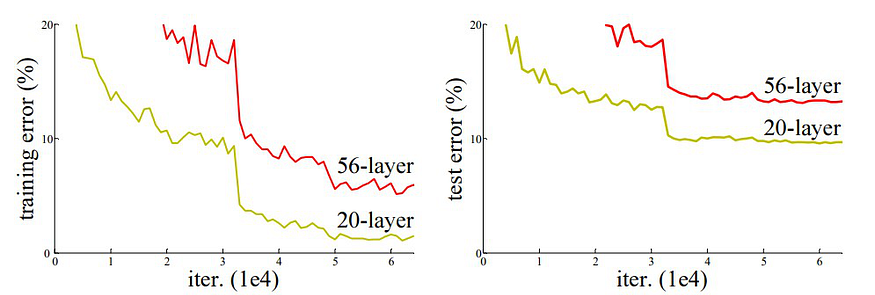
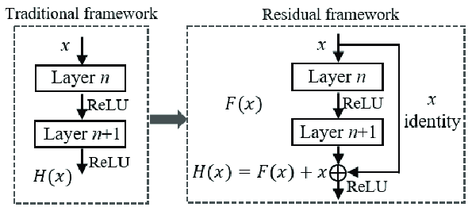
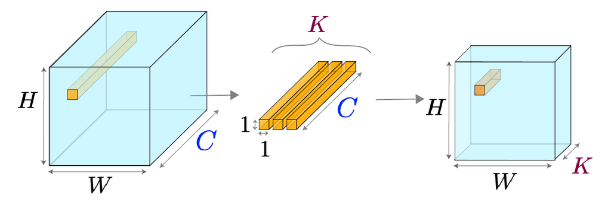
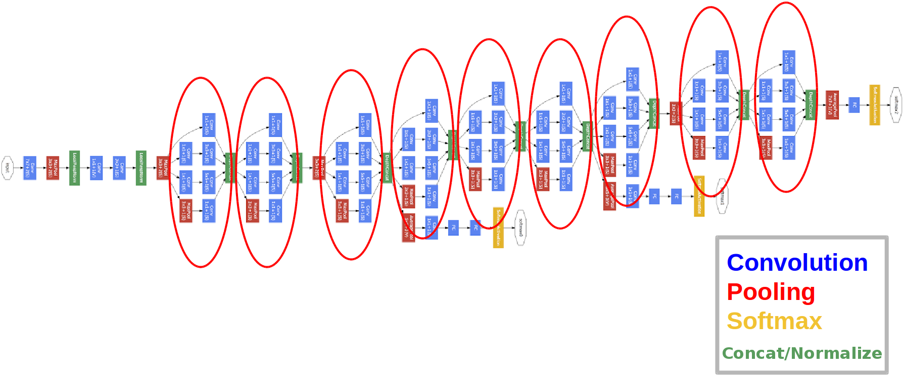
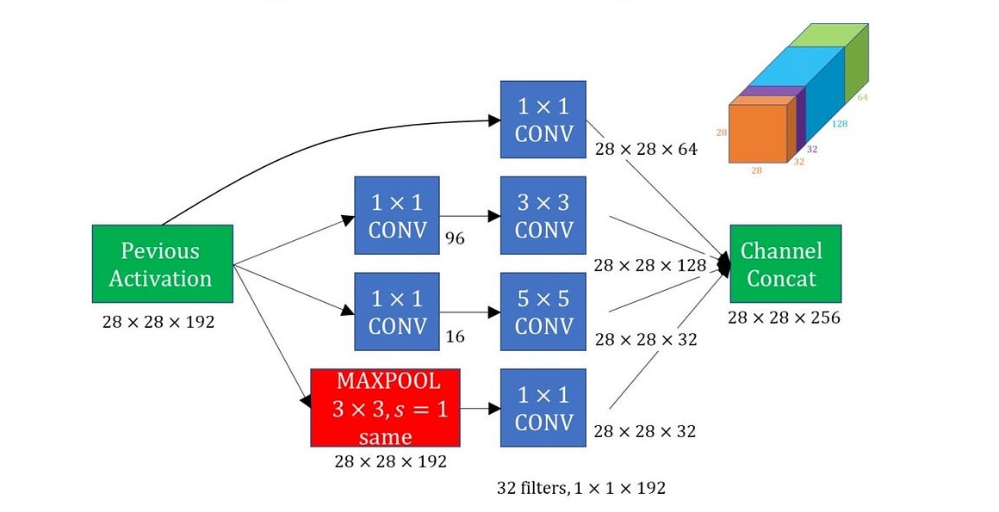
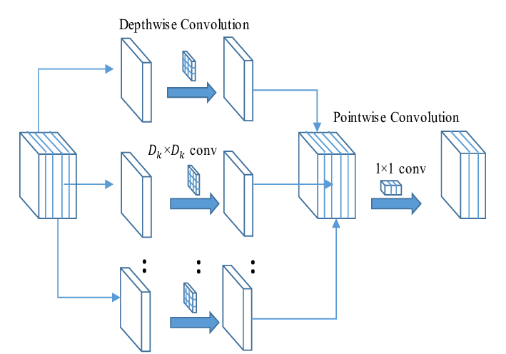
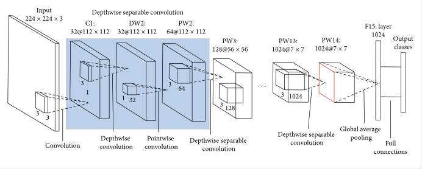
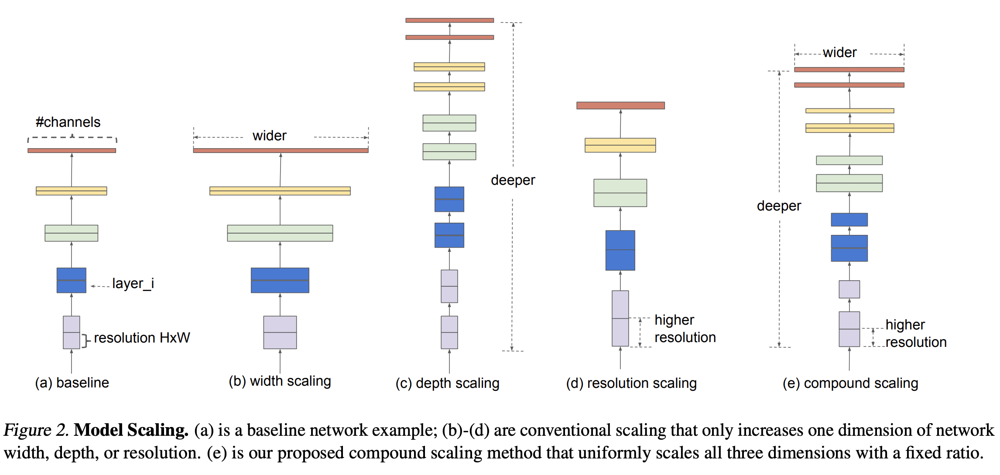

# Modern CNN Mimari̇leri: ResNet, Inception, MobileNet, EfficientNet

<!-- toc -->

 
 
 

# ResNet: Derin Artık Ağlar (Deep Residual Networks)

Sinir ağları derinleştikçe, araştırmacılar sezgisel olmayan bir olgu gözlemledi: **daha derin ağlar, eğitim ve test sırasında genellikle daha sığ olanlara kıyasla daha kötü performans gösteriyordu**. Bu bozulma (degradation) aşırı öğrenmeden (overfitting) değil, bir optimizasyon sorunundan kaynaklanıyordu.

    

Bu soruna **bozulma problemi (degradation problem)** adı verilir. Bu, sadece daha fazla katman eklemenin daha iyi doğruluk garanti etmediğini, aksine çoğu zaman daha yüksek eğitim hatasına yol açtığını gösterir. Bu, beklentilerimizle çelişir, çünkü daha derin modellerin daha karmaşık fonksiyonları temsil edebilmesi gerekir.

Bunu çözmek için ResNet, **artık öğrenme (residual learning)** kavramını tanıttı.

## Artık Öğrenme: Temel Fikir (Residual Learning: Core Idea)

Doğrudan $ H(x) $ eşlemesini öğrenmek yerine, ResNet **artık fonksiyonunu (residual function)** öğrenmeyi önerir:

$$
F(x) = H(x) - x \Rightarrow H(x) = F(x) + x
$$

Bu yeniden formülasyon, ağın **girdi ve çıktı arasındaki farka** odaklanmasını sağlar; bu genellikle optimize edilmesi daha kolaydır.

Bir artık bloğunun (residual block) çıktısı:

$$
\text{Çıktı} = F(x, \{W_i\}) + x
$$

Burada $ F(x, \{W_i\}) $, birkaç istiflenmiş katmanın (örneğin, 2 Conv-BN-ReLU katmanı) çıktısıdır ve $ x $ orijinal girdidir. Bu toplama işlemi **atlama bağlantısı (skip connection)** veya **kısa yol bağlantısı (shortcut connection)** olarak bilinir.

İşte bir **Artık Bloğunun (Residual Block)** temel yapısı:

    

- Girdi ve çıktı boyutları farklıysa, toplama işleminden önce boyutları eşleştirmek için **1x1 evrişim (1x1 convolution)** kullanılır.
- Bu yapı, geri yayılım (backpropagation) sırasında gradyanların daha kolay akmasını sağlar ve **kaybolan gradyan problemini (vanishing gradient problem)** hafifletir.

 

**Özdeşlik Kısa Yol Bağlantısı (Identity Shortcut Connection)**

Bu, temel yeniliktir. Girdinin ara katmanları atlamasına izin vererek model **yararlı özellikleri koruyabilir**, gerektiğinde özdeşlik eşlemelerini öğrenebilir ve aşırı öğrenmeyi önleyebilir.

Kısa yol türleri:

- **Özdeşlik kısa yolu (Identity shortcut)**: Girdi ve çıktı boyutları eşleştiğinde
- **Yansıtma kısa yolu (Projection shortcut)**: Şekilleri eşleştirmek için 1x1 evrişim kullanılır

## ResNet'ler Neden Çalışır?

1. **İyileştirilmiş Gradyan Akışı**: Engellenmemiş gradyan yolları sayesinde derin ağların eğitimi kolaylaşır
2. **Daha Kolay Optimizasyon**: Artık eşleme (residual mapping), öğrenme sürecini basitleştirir
3. **Daha Derin Ağlar**: Bozulma olmadan çok derin ağlar (örneğin, ResNet-152) eğitilebilir
4. **Daha İyi Genelleme**: Görüntü sınıflandırma, tespit ve bölütlemede iyi performans gösterir

## İleri ve Geri Yayılım

Bir artık bloğunda, **ileri yayılım (forward propagation)** sırasında kısa yol, verinin önceki katmanlardan doğrudan akmasını sağlar. **Geri yayılım (backward propagation)** sırasında ise gradyan hem artık yolundan hem de kısa yol bağlantısından geçebilir, böylece gradyan kaybı azalır.

Kayıp gradyanının $ \partial L/\partial y $ olduğunu varsayalım. O halde:

$$
\frac{\partial L}{\partial x} = \frac{\partial L}{\partial y} \cdot (\frac{\partial F}{\partial x} + I)
$$

Burada $ I $ birim matristir (identity matrix) ve $ \partial F/\partial x $ küçük olsa bile gradyanın kaybolmamasını sağlar.

## Gerçek Dünya Analojisi

Bir mobilyayı talimatları kullanarak monte ettiğinizi hayal edin. Her adımı sıfırdan okuyup anlamak (doğrudan eşleme) yerine, her adımı daha önce yaptıklarınızla karşılaştırırsınız (artık karşılaştırması). Neyin eksik olduğunu fark etmek ve düzeltmek daha kolaydır.

### ResNet Çeşitleri

- **ResNet-18, 34, 50, 101, 152**: Artan derinlik
- **ResNeXt**: Evrişim grupları (groups of convolutions)
- **Ön-aktivasyon ResNet (Pre-activation ResNet)**: BN ve ReLU'yu evrişimlerden önceye taşır

 
 
 

---

 

# Inception ve 1x1 Evrişimler

## Ağ İçinde Ağlar (Networks in Networks) ve 1x1 Evrişimler

2014 yılında, "Ağ İçinde Ağ" (Network in Network) mimarisi, **1x1 evrişimler (1x1 convolutions)** kullanma fikrini ortaya attı — modern CNN'lerde şaşırtıcı derecede güçlü ve verimli bir teknik.

### 1x1 Evrişim Nedir?

- Bir **1x1 evrişim**, tüm girdi kanalları boyunca $1×1$ boyutunda bir filtre uygular.
- Uzamsal boyut ($1x1$) önemsiz görünse de, **kanal bazında** bilgiyi işler ve özellikleri derinlik boyunca harmanlar.

    

$ H \times W \times C_{in} $ şeklinde bir girdi varsayalım. $ N $ adet 1x1 filtre uygulamak, $ H \times W \times N $ şeklinde bir çıktı üretir.

### Neden Faydalıdır?

- **Boyut Azaltma (Dimensionality Reduction)**: Hesaplama açısından pahalı filtreler (örneğin, 3x3, 5x5) uygulamadan önce kanal sayısını azaltarak model boyutunu ve hız gereksinimlerini düşürebilirsiniz.
- **Doğrusal Olmamayı Artırma**: Doğrusal olmayan aktivasyonlarla (ReLU gibi) birleştirildiğinde, ağın temsil gücünü artırır.
- **Hafif Hesaplama**: Aynı girdi/çıktı boyutlarına sahip standart bir 3x3 evrişime kıyasla, gereken FLOP (kayan nokta işlemi) sayısı önemli ölçüde daha düşüktür.

 

**Sezgi:**

1x1 evrişimi, her uzamsal konumdaki kanalların **kombinasyonlarını yeniden öğrenmenin** bir yolu olarak düşünün. Her bir özelliğe ağırlık atamak ve bunları akıllıca harmanlamak gibidir — tıpkı bilinen "içeriklerden" yeni anlamlar oluşturmak gibi.

 

---

## Inception Ağı

CNN'ler başlangıçta **sıralı katmanlar (sequential layers)** kullanıyordu — 3x3 veya 5x5 filtreleri art arda istiflemek. Ancak neden tek bir filtre boyutuyla yetinelim?

Bazı desenler şunlarla daha iyi yakalanabilir:

- **1x1** (ince detaylar)
- **3x3** (orta seviye özellikler)
- **5x5** (daha büyük bağlam)

 

**Temel İçgörü:**

Neden **hepsini paralel olarak uygulamayalım** ve **hangisinin en iyi olduğuna ağın karar vermesine** izin vermeyelim?

İşte **Inception Modülü'nün** ardındaki temel fikir budur.

 

**Sorun:**

Birden fazla büyük filtreyi paralel olarak uygulamak, hesaplamayı üstel olarak artırır.

 

---

## GoogLeNet ve Inception Blokları

**GoogLeNet (Inception-v1)** mimarisi, hesaplamayı uygun fiyatlı tutarken **çok ölçekli özellik çıkarımına (multi-scale feature extraction)** izin veren Inception modülünü tanıttı.

    

### Bir Inception Bloğunun Yapısı:

Her Inception bloğu birden fazla dala sahiptir:

- **1x1 evrişim**
- **1x1 → 3x3 evrişim**
- **1x1 → 5x5 evrişim**
- **3x3 maksimum havuzlama → 1x1 evrişim**

> Her pahalı evrişimin, boyut azaltma için **öncesinde bir 1x1 evrişim** olduğuna dikkat edin.

 

**Avantajlar:**

- **Parametre Verimliliği**: Tüm filtreleri safça istiflemekten daha az parametre.
- **Zengin Özellik Öğrenimi**: Aynı anda birden fazla alıcı alanda (receptive field) özellikler öğrenir.
- **Paralellik**: Tek tip katmanlara sahip daha derin veya daha geniş modellerden daha etkilidir.

 

**Örnek:**

$ 28 \times 28 \times 192 $ boyutunda bir girdi varsayalım. Bir Inception modülünden geçtikten sonra şöyle bir şey elde edebiliriz:

    

- 1x1 dalı → 64 kanal
- 3x3 dalı → 128 kanal
- 5x5 dalı → 32 kanal
- Havuzlama dalı → 32 kanal
- **Toplam çıktı derinliği**: 256

 

---

## Zaman İçindeki İyileştirmeler

GoogLeNet, birçok geliştirilmiş versiyona ilham verdi:

- **Inception v2/v3**: Evrişimlerin çarpanlara ayrılması (örneğin, 5x5 → iki adet 3x3 katmanı)
- **Inception v4**: ResNet ve Inception fikirlerinin birleşimi (örneğin, Inception-ResNet)
- **BatchNorm** ve **Yardımcı Sınıflandırıcıların (Auxiliary Classifiers)** kullanımı

Bu teknikler, parametreleri önemli ölçüde artırmadan doğruluğu iyileştirdi.

Inception mimarisi, CNN tasarımında büyük bir sıçramaydı:

- **Çok yollu mimariler (multi-path architectures)** kavramını tanıttı
- **Hesaplama verimliliğini** vurguladı
- Model karmaşıklığını kontrol etmek için **1x1 evrişimlerden** yararlandı

Bu, _MobileNet_ ve _EfficientNet_ gibi daha da verimli modellerin yolunu açtı.

 
 
 

---

 
 

# MobileNet ve EfficientNet

## MobileNet

Derin öğrenme modelleri büyüyüp derinleştikçe, daha fazla bellek ve hesaplama talep ettiler — bu, mobil veya gömülü cihazlar için ideal değildi. Google tarafından 2017'de tanıtılan **MobileNet**, **derinlik bazlı ayrılabilir evrişimler (depthwise separable convolutions)** kullanarak oldukça verimli bir mimari önererek bu zorluğu ele aldı.

---

### Standart Evrişim ve Derinlik Bazlı Ayrılabilir Evrişim

Standart evrişimi hatırlayalım:

$ H \times W \times D_{in} $ boyutunda bir girdi verildiğinde, $ K \times K \times D_{in} $ boyutunda $ N $ filtre uygulamak, $ H' \times W' \times N $ boyutunda bir çıktı üretir.

- **Hesaplama Maliyeti**:
  $$
  K \cdot K \cdot D_{in} \cdot N \cdot H' \cdot W'
  $$

**MobileNet** bunu iki adıma ayırır:

1. **Derinlik Bazlı Evrişim (Depthwise Convolution)**:
   Her girdi kanalına bir filtre uygulanır — kanallar arası birleştirme yapılmaz.
   Maliyet:

   $$
   K \cdot K \cdot D_{in} \cdot H' \cdot W'
   $$

2. **Noktasal Evrişim (Pointwise Convolution / 1x1)**:
   Derinlik bazlı çıktıyı $ N $ adet 1x1 filtre ile harmanlar.
   Maliyet:
   $$
   D_{in} \cdot N \cdot H' \cdot W'
   $$

    

✅ **Toplam Maliyet**:

$$
K^2 \cdot D_{in} \cdot H' \cdot W' + D_{in} \cdot N \cdot H' \cdot W'
$$

Bu, $ K = 3 $ olduğunda standart evrişime göre **~9 kat daha azdır**.

---

### MobileNet Mimarisi (V1 Öne Çıkanlar)

MobileNetV1, normal evrişimler yerine **derinlik bazlı ayrılabilir evrişimleri** istifleyerek oluşturulmuştur. Ayrıca şunları da tanıtır:

    

- **Genişlik Çarpanı (Width Multiplier / α)**: Kanal sayısını küçültür (örneğin, α=0.75 model boyutunu azaltır).
- **Çözünürlük Çarpanı (Resolution Multiplier / ρ)**: Hesaplamadan daha fazla tasarruf etmek için girdi görüntü boyutunu azaltır.

Birlikte, bunlar doğruluk ve kaynak kullanımı arasında bir ödünleşim sağlar.

> MobileNet, genellikle gerçek zamanlı uygulamalarda (örneğin, akıllı telefonlarda nesne tespiti, AR uygulamaları) bir **omurga (backbone)** olarak kullanılır.

---

## EfficientNet

2019'da Google AI tarafından tanıtılan **EfficientNet**, **sinir ağlarını sistematik olarak ölçeklendirerek** model performansının sınırlarını zorlar.

---

### Sorun: Bir CNN Nasıl Ölçeklendirilir?

Bir CNN'i daha güçlü hale getirmek için şunları yapabilirsiniz:

    

- **Derinliği** artırmak (daha fazla katman)
- **Genişliği** artırmak (daha fazla kanal)
- **Çözünürlüğü** artırmak (daha büyük girdi görüntüleri)

Peki her birinden ne kadar?

---

### Bileşik Ölçeklendirme: Verimli Strateji (Compound Scaling)

Bir boyutu keyfi olarak ölçeklendirmek yerine, EfficientNet her üçünü de dengeleyen bir **bileşik katsayı (compound coefficient / ϕ)** sunar:

$$
\begin{aligned}
\text{derinlik:} &\quad d = \alpha^\phi \\
\text{genişlik:} &\quad w = \beta^\phi \\
\text{çözünürlük:} &\quad r = \gamma^\phi \\
\text{şu koşulla:} &\quad \alpha \cdot \beta^2 \cdot \gamma^2 \approx 2
\end{aligned}
$$

- ϕ, **mevcut kaynakları** (örneğin, daha fazla hesaplama gücü) kontrol eder.
- α, β, γ, ızgara araması (grid search) ile belirlenen sabitlerdir.

---

### Performans

EfficientNet modelleri (B0'dan B7'ye), aynı temel mimari (EfficientNet-B0) üzerine inşa edilmiştir ve ϕ değeri kademeli olarak artar.

- EfficientNet-B0: temel (baseline)
- EfficientNet-B1'den B7'ye: artan kapasiteye sahip ölçeklendirilmiş sürümler

✅ **Sonuç**:
EfficientNet, ResNet-152 veya Inception-v4 gibi daha derin ağlara kıyasla **daha az parametre ile daha iyi doğruluk** elde eder.

| Mimari           | Temel Fikir                           | Verimlilik Hilesi                                   |
| ---------------- | ------------------------------------- | --------------------------------------------------- |
| **MobileNet**    | Mobil cihazlar için hafif model       | Derinlik bazlı ayrılabilir evrişimler               |
| **EfficientNet** | Ölçeklenebilir ve doğru model         | Derinlik, genişlik ve çözünürlükte bileşik ölçeklendirme |

Her iki mimari de, CNN tasarımının gerçek dünya yapay zeka dağıtımı için kompakt, hızlı ve güçlü modellere doğru **evrimini** temsil eder.

 
 
 
 
