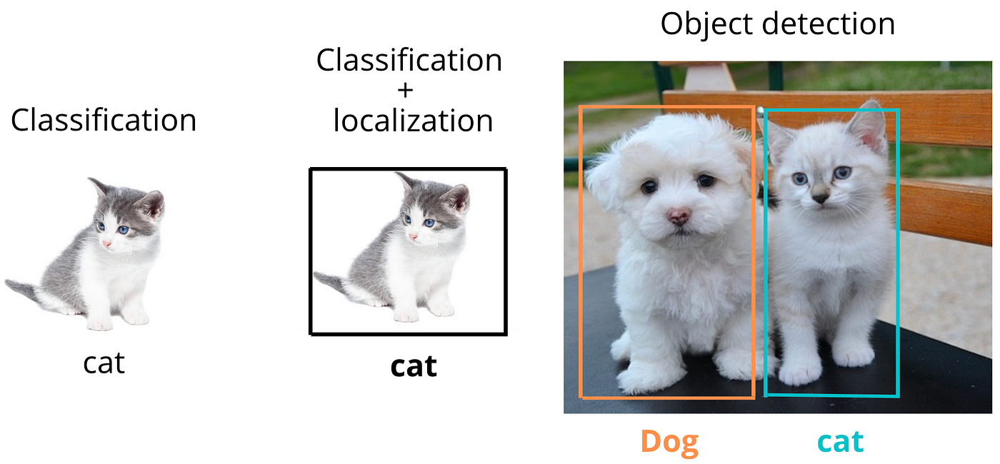
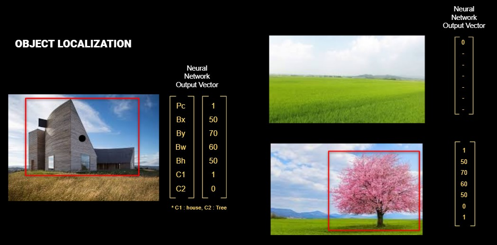
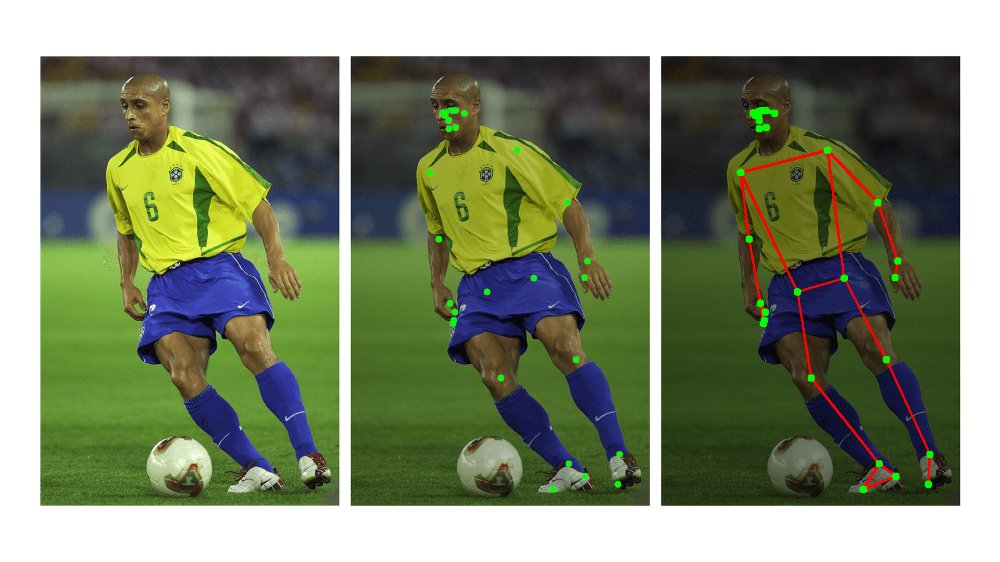
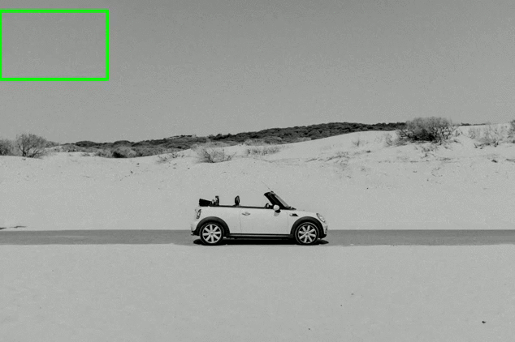
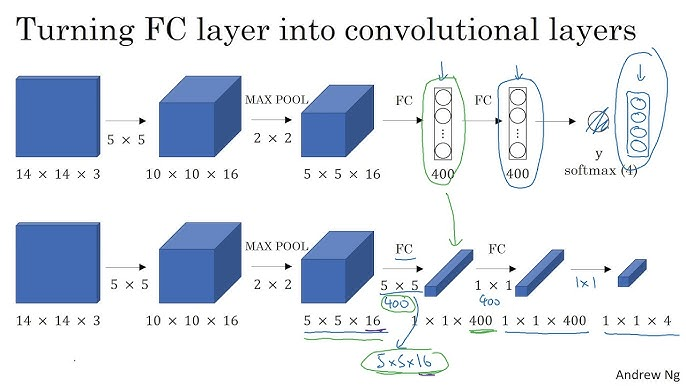
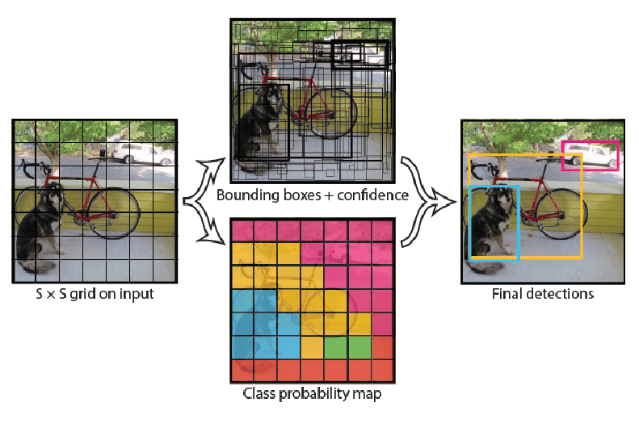

# Nesne Yerelleştirme ve Tespiti (Object Localization and Detection)

<!-- toc -->

 
 

 
 

# Nesne Yerelleştirme (Object Localization)

**Nesne yerelleştirme (object localization)**, bir görüntüde bir nesnenin varlığını tespit etme ve bu nesnenin konumunu bir sınırlayıcı kutu (bounding box) kullanarak belirleme görevidir.

    

Görüntü sınıflandırmadan (image classification) bir adım daha karmaşıktır; çünkü sınıflandırma yalnızca görüntüde **ne** olduğunu söylerken, yerelleştirme **nerede** olduğunu da belirtir.

Bir görüntü verildiğinde, nesne yerelleştirme şunları amaçlar:

- **Nesneyi sınıflandırmak** (örneğin, kedi, köpek, araba).
- **Sınırlayıcı kutu koordinatlarını** döndürmek:
  $$
  (x_{\\text{min}}, y_{\\text{min}}, x_{\\text{max}}, y_{\\text{max}})
  \\quad \\text{veya} \\quad (x, y, w, h)
  $$

Burada:

- $ (x, y) $: sınırlayıcı kutunun merkezi
- $ w, h $: kutunun genişliği ve yüksekliği

## Çıktı Vektörü (Output Vector)

Yerelleştirme için bir sinir ağı kullanıyorsanız, çıktı vektörü şu şekilde olabilir:

    

$$
\\text{Output} = [p_c, x, y, w, h, c_1, c_2, ..., c_n]
$$

Burada:

- $ p_c $: Görüntüde bir nesne bulunma olasılığı
- $ x, y, w, h $: Sınırlayıcı kutu
- $ c_i $: Sınıf olasılıkları (örneğin, kedi = 0.8, köpek = 0.2)

Sınıfı tanımlanan nesne görüntüde tespit edilemiyorsa, $p_c$ değeri $0$ olacaktır. $p_c$'nin $0$ olduğu durumda, sınırlayıcı kutu değerleri ($x ,y, w, h$) ve sınıf değerleri vektörde anlamsızdır. Bu, Kayıp fonksiyonu (Loss function) hesaplanırken bunların dikkate alınmayacağı anlamına gelir.

## Kayıp Fonksiyonu (Loss Function)

Yerelleştirme için genellikle çok parçalı bir kayıp (multi-part loss) kullanılır:

- **Yerelleştirme kaybı (koordinat regresyonu)**: Tahmin edilen kutu konumundaki hatayı ölçer
- **Güven kaybı (nesnelik)**: Nesne varlığındaki hatayı ölçer
- **Sınıflandırma kaybı**: Sınıf tahminindeki hatayı ölçer

Örnek (YOLO'daki gibi basitleştirilmiş versiyon):

$$
\\mathcal{L} = \\lambda_{\\text{coord}} \\cdot \\sum_{i} \\mathbb{1}_{i}^{\\text{obj}} \\left[(x_i - \\hat{x}_i)^2 + (y_i - \\hat{y}_i)^2 + (w_i - \\hat{w}_i)^2 + (h_i - \\hat{h}_i)^2\\right] + \\text{classification loss}
$$

 
 

---

 
 
 

# Nokta Tespiti (Landmark Detection)

**Nokta tespiti (landmark detection)** (anahtar nokta tespiti olarak da bilinir), bir nesne üzerindeki belirli anahtar konumların tespit edilmesini içerir. Sınırlayıcı kutulardan farklı olarak, anahtar noktalar **daha ince taneli yerelleştirme (finer-grained localization)** sağlar.

    

**Örnek**

- Yüz tanıma: Gözler, burun ucu, ağız kenarları
- El tespiti: Parmak uçları ve eklemler
- Tıbbi görüntüleme: Organ sınırlarının belirlenmesi

## Çıktı Gösterimi (Output Representation)

$ K $ tane anahtar nokta tespit edersek:

$$
\\text{Output} = [x_1, y_1, x_2, y_2, ..., x_K, y_K]
$$

Her bir çift, diz noktası veya kulak noktası gibi bir anahtar noktanın $(x, y)$ koordinatını temsil eder.

## Kayıp Fonksiyonu (Loss Function)

Nokta tespiti için tipik kayıp:

$$
\\mathcal{L}_{\\text{keypoints}} = \\sum_{k=1}^{K} \\left[(x_k - \\hat{x}_k)^2 + (y_k - \\hat{y}_k)^2\\right]
$$

 
 

---

 
 
 

# Nesne Tespiti (Object Detection)

**Nesne tespiti (object detection)**, sınıflandırma ve yerelleştirmeyi birleştirir — ancak bu sefer aynı görüntüdeki **birden çok nesne için**.

## Örnek

Tek bir sokak fotoğrafında:

- Bir araba tespit et (sınıf = araba, sınırlayıcı kutu)
- Bir yaya tespit et (sınıf = insan, sınırlayıcı kutu)
- Bir dur işareti tespit et (sınıf = işaret, sınırlayıcı kutu)

## Yerelleştirme ile Karşılaştırma

| Görev (Task)           | Çıktı (Output)                   |
| ---------------------- | -------------------------------- |
| Sınıflandırma          | Sınıf etiketi                    |
| Yerelleştirme          | Sınıf + sınırlayıcı kutu         |
| Tespit                 | Birden çok sınıf + kutu          |

## Model Çıktı Yapısı (Model Output Structure)

Görüntüyü $ S \\times S $'lik bir ızgaraya (grid) böleriz. Her ızgara hücresi için tahmin edilir:

- $ B $ tane sınırlayıcı kutu
- Güven skoru (confidence score)
- Sınıf olasılıkları

$$
\\text{Output Tensor} = S \\times S \\times (B \\cdot 5 + C)
$$

Burada:

- Her kutu $[p_c, x, y, w, h]$ içerir. $5$ bu vektörü ifade eder.
- $ C $: sınıf sayısı

 
 
 

---

 
 
 

# Kayan Pencere Yaklaşımı ve Evrişimsel Uygulaması (Sliding Window Approach and Its Convolutional Implementation)

**Kayan pencere (sliding window)** tekniği, bilgisayarla görmede nesne tespiti için kullanılan klasik bir yöntemdir. Temel fikir, sabit boyutlu dikdörtgen bir pencere alıp bunu giriş görüntüsü üzerinde kaydırarak her bölgeyi sistematik bir şekilde kontrol edip ilgilenilen nesneyi içerip içermediğini belirlemektir.

    

Her pencere konumunda, kırpılan görüntü bölgesi bir sınıflandırıcıya (örneğin, SVM, lojistik regresyon veya küçük bir CNN) gönderilerek bir nesne içerip içermediği belirlenir. Bu pencere, görüntü üzerinde hem yatay hem de dikey yönde, genellikle belirli bir adım (stride) değeriyle "kayar" ve çok sayıda kırpılmış bölge üretir.

Bu yöntem, bir sınıflandırma modelini tüm olası konumları kaba kuvvetle tarayarak bir yerelleştirme aracına dönüştürür.

## Basit Kayan Pencerenin Sınırlamaları (Limitations of Naive Sliding Windows)

Kavramsal olarak basit olsa da, basit kayan pencere yönteminin ciddi dezavantajları vardır:

**1. Yüksek Hesaplama Maliyeti**

- $ W \\times H $ boyutundaki bir görüntü için, $ w \\times h $ boyutunda ve $ s $ adımında bir pencere kullanıldığında pencere sayısı:
  $$
  \\left(\\frac{W - w}{s} + 1\\right) \\cdot \\left(\\frac{H - h}{s} + 1\\right)
  $$
  Bu, orta boyutlu görüntülerde bile binlerce bölgeyle sonuçlanabilir.
- Her pencere, sınıflandırıcı ağ üzerinden ayrı bir ileri geçiş (forward pass) gerektirir; bu da örtüşen pencerelerin piksellerinin çoğunu paylaşması nedeniyle büyük bir gereksiz hesaplamaya yol açar.

**2. Çoklu Ölçekleri İşlemede Zorluk**

- Bir görüntüdeki nesneler farklı ölçeklerde ve en-boy oranlarında görünebilir.
- Bunu ele almak için ya görüntünün birçok kez yeniden boyutlandırılması ya da pencere boyutunun değiştirilmesi gerekir — her ikisi de hesaplamayı daha da artırır.

**3. Sabit Pencere Şekli**

- Kayan pencereler genellikle sabit bir en-boy oranı ve boyut kullanır; bu da onları düzensiz şekillere sahip nesneleri tespit etmede daha az etkili kılar.

## Kayan Pencerelerin Evrişimsel Uygulaması (Convolutional Implementation of Sliding Windows)

Bu verimsizliklerin üstesinden gelmek için modern yaklaşımlar, kayan pencereyi daha verimli bir şekilde uygulamak amacıyla sinir ağlarının evrişimsel (convolutional) yapısını kullanır.

**Temel İçgörü: Paylaşımlı Hesaplama Olarak Evrişimler**

Her pencere üzerinde sınıflandırıcıyı ayrı ayrı çalıştırmak yerine şunları yapabiliriz:

- **Tüm görüntüyü** bir CNN'in evrişim katmanlarından **tek seferde** geçirebiliriz
- Bu katmanlar, **her uzamsal konumun** yerel bir alıcı alan (receptive field) hakkında bilgi kodladığı bir özellik haritası (feature map) üretir
- Bu, doğal olarak bir kayan pencere işlemini simüle eder

Ardından, özellik haritası üzerinde **1x1 evrişimler** veya **evrişime dönüştürülmüş tam bağlı katmanlar** uygulayarak nesne varlığı için yoğun tahminler üretiriz.

    

**Tam Bağlı Katmandan Evrişime (Fully Connected Layer to Convolution)**

Düzleştirilmiş (flattened) bir $ N \\times N \\times D $ girişi bekleyen tam bağlı bir katman, bir $ N \\times N \\times D $ özellik haritası üzerinde **1x1 evrişim** olarak yeniden yazılabilir:

- Ortaya çıkan çıktı haritasındaki her konum, orijinal görüntüdeki belirli bir alıcı alana karşılık gelir
- Bu, paylaşımlı hesaplamayı yeniden kullanarak aynı anda birçok bölge üzerinde sınıflandırma yapmayı etkili bir şekilde gerçekleştirir

---

## Modern Mimarilerde Kullanım

### YOLO (You Only Look Once) Mimarisini Anlamak

**YOLO (You Only Look Once)**, nesne tespitini bir sınıflandırma veya bölge önerme problemi yerine **tek bir regresyon problemi** olarak yeniden tanımlayan gerçek zamanlı bir nesne tespit sistemidir. Görüntüyü birden çok kez taramak veya birden çok öneri üretmek yerine, YOLO **tüm görüntüyü** yalnızca bir kez görür ve tek bir değerlendirmede doğrudan sınırlayıcı kutular ve sınıf olasılıkları çıktısı verir.

Bu uçtan uca (end-to-end) mimari, son derece hızlı çıkarım (inference) sağlar ve sürücüsüz arabalar, robotik, gözetim ve artırılmış gerçeklik gibi gerçek zamanlı uygulamalar için tasarlanmıştır.

#### YOLO Nasıl Çalışır?

Üst düzeyde, YOLO giriş görüntüsünü sabit boyutlu bir ızgaraya böler ve her ızgara hücresi için tahminler yapar. Şimdi mimarinin her bir bölümünü inceleyelim:

    

**1. Görüntü Izgarasına Bölme**

- Giriş görüntüsü $ S \\times S $'lik bir ızgaraya bölünür (örneğin, $ 7 \\times 7 $).
- Her **ızgara hücresi**, merkezi bu hücrenin **içine düşen** nesneleri tespit etmekten sorumludur.

**2. Sınırlayıcı Kutu Tahminleri**

Her ızgara hücresi şunları tahmin eder:

- $ B $ tane sınırlayıcı kutu (genellikle $ B = 2 $)
- Her kutu için:
  - $ x, y $: kutu merkezinin koordinatları (ızgara hücresine göreli)
  - $ w, h $: kutunun genişliği ve yüksekliği (tüm görüntüye göreli)
  - $ p_c $: güven skoru = $ P(\\text{nesne}) \\times \\text{IoU}_{\\text{tahmin, gerçek}} $

**3. Sınıf Olasılıkları**

- Her ızgara hücresi ayrıca $ C $ tane koşullu sınıf olasılığı tahmin eder:

  $$
  P(\\text{sınıf}\\_i \\mid \\text{nesne}) \\quad \\text{for } i = 1, \\dots, C
  $$

- Bu olasılıklar, **hücrede bir nesne bulunması koşuluna bağlı sınıf olasılıklarıdır**.

**4. Nihai Tahminler**

- Her ızgara hücresi için toplam çıktı:
  $$
  B \\times [p_c, x, y, w, h] + C
  $$
  Örneğin, $ S = 7 $, $ B = 2 $, $ C = 20 $ ile toplam tahmin tensörü boyutu:
  $$
  7 \\times 7 \\times (2 \\times 5 + 20) = 7 \\times 7 \\times 30
  $$

**Neden "You Only Look Once" (Yalnızca Bir Kere Bakarsın) Olarak Adlandırılır?**

Geleneksel tespit hatları şunları içerir:

- Bölge önerileri oluşturma (R-CNN'de olduğu gibi)
- Her bölgede bir CNN çalıştırma
- Sınıflandırma ve kutu regresyonunu ayrı ayrı gerçekleştirme

**YOLO** bu hattı **tek bir CNN geçişinde** birleştirir; bu nedenle "You Only Look Once" (Yalnızca Bir Kere Bakarsın) olarak adlandırılır. Model, tüm görüntü bağlamını görür ve tüm sınırlayıcı kutular ile sınıf skorlarını tek seferde çıktı olarak verir.

### SSD (Single Shot MultiBox Detector)

- Farklı katmanlardan gelen özellik haritalarını kullanarak nesneleri birden çok ölçekte tespit eder
- Özellik haritasındaki her konumda sınıf ve kutu sapmalarını tahmin etmek için evrişim katmanlarını kullanır

## Özet

| Yaklaşım (Approach)        | Özellikler                                                  |
| -------------------------- | ----------------------------------------------------------- |
| Basit Kayan Pencere        | Yavaş, verimsiz, gereksiz hesaplama                         |
| Evrişimsel Kayan Pencere   | Verimli, paylaşımlı hesaplama, gerçek zamanlı tespit için uygun |

Kaba kuvvet taramasından evrişimsel tahmine geçişi anlayarak, evrişimli ağların yalnızca bir görüntüde **ne** olduğunu değil, aynı zamanda **nerede** olduğunu da tanıyarak ölçeklenebilir nesne tespitini nasıl mümkün kıldığını takdir edebiliriz.

 
 
 
 
 
 
