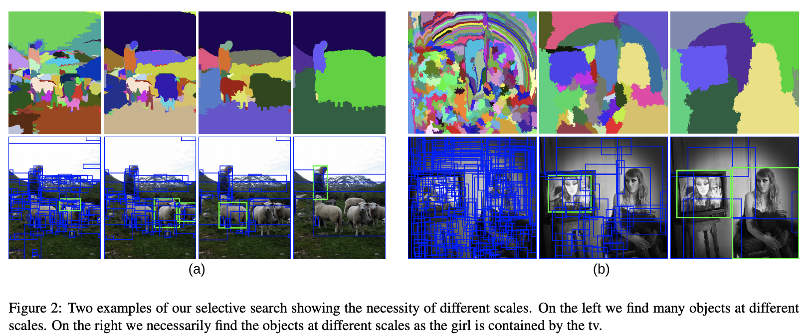
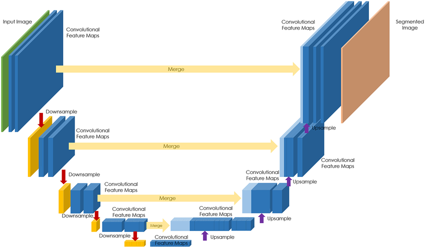
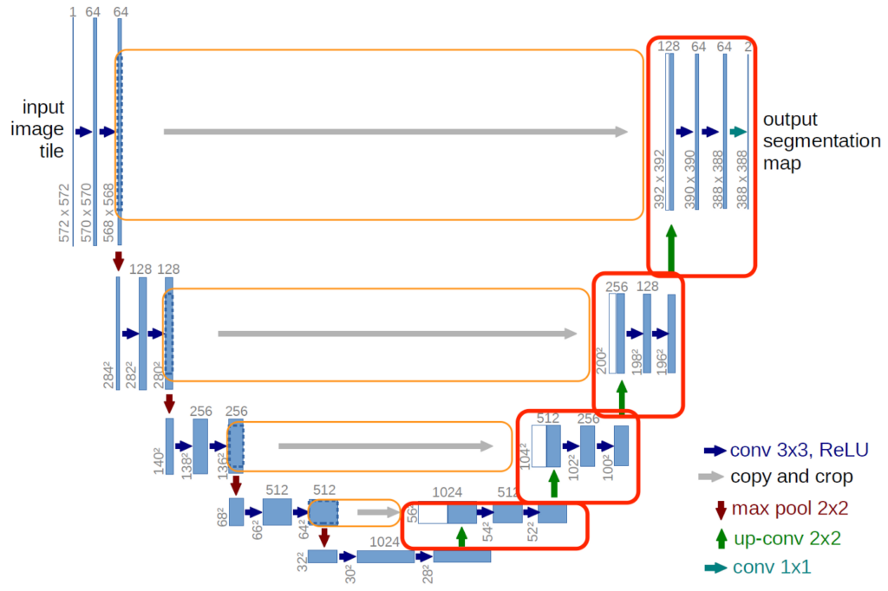

# Bölge Önerileri ve Anlamsal Segmentasyon: U-Net

<!-- toc -->

## Bölge Önerileri (Region Proposals)

### Neden Bölge Önerileri?

Geleneksel nesne dedektörleri (object detector), görüntüdeki her olası bölgeyi taramaları nedeniyle hesaplama açısından pahalıdır. **Bölge Önerisi (Region Proposal)** yöntemleri, nesne içerme olasılığı yüksek olan az sayıda aday bölge üreterek bu sorunu çözer.

### Seçici Arama (Selective Search)

<div style="text-align: center;display:flex; justify-content: center; margin-bottom: 20px; ">
    
</div>

- Benzer pikselleri **süperpiksellere (superpixel)** gruplandırma
- Bölgeleri benzerliğe göre birleştirme
- Görüntü başına ~2000 öneri üretir

### R-CNN İşlem Hattı (Pipeline)

1. Bölge önermek için **Seçici Arama (Selective Search)** kullan.
2. Her bölgeyi sabit bir boyuta (ör. 224×224) yeniden boyutlandır (warp).
3. Öznitelik çıkarmak için bir ConvNet'ten geçir.
4. Sınıflandırma için SVM'ler ve sınırlayıcı kutular (bounding box) için regresörler kullan.

> Sınırlama: Her bölgede bağımsız ConvNet çalıştırılması nedeniyle çok yavaştır.

---

## Anlamsal Segmentasyon (Semantic Segmentation)

### Anlamsal Segmentasyon Nedir?

Anlamsal segmentasyon (semantic segmentation), bir görüntüdeki her pikseli bir sınıf etiketine sınıflandırma görevidir.

- **Görüntü Sınıflandırma (Image Classification)**: Görüntüde ne var?
- **Nesne Tespiti (Object Detection)**: Nesne nerede?
- **Anlamsal Segmentasyon (Semantic Segmentation)**: Hangi piksel hangi sınıfa ait?

### Uygulamalar

- Tıbbi görüntüleme (ör. tümör segmentasyonu)
- Otonom sürüş (şerit ve yaya tespiti)
- Uydu görüntüsü analizi
- Endüstriyel kusur tespiti

---

## Transpoze Evrişimler (Transpose Convolution / Dekonvolüsyon)

### Motivasyon

Segmentasyon görevlerinde, öznitelik haritalarını orijinal görüntü boyutuna **yukarı örneklememiz (upsample)** gerekir. Transpoze evrişimler (dekonvolüsyon olarak da bilinir) bu konuda yardımcı olur.

### Nasıl Çalışır

Transpoze evrişim, normal bir evrişimin tersidir:

- Evrişim uzamsal boyutu **azaltırken** (alt örnekleme - downsampling),
- Transpoze evrişim **artırır** (yukarı örnekleme - upsampling).

### Matematiksel İşlem

Girdi boyutunun $N \times N$ ve çekirdek boyutunun $k \times k$ ve adım $s$ olduğunu varsayalım.

- Evrişim çıktı boyutu:

  $$
  O = \left\lfloor \frac{N - k}{s} + 1 \right\rfloor
  $$

- Transpoze evrişim (yukarıdakinin tersi):
  $$
  O_{up} = (N - 1) \cdot s + k
  $$

### Alternatifler

- En yakın komşu (nearest-neighbor) veya çift doğrusal (bilinear) yukarı örnekleme + 1×1 evrişim (daha ucuz, daha az ifade gücü)
- Öğrenilebilir transpoze evrişimler (daha zengin)

---

## U-Net Mimarisi Sezgisi (Intuition)

**Ana Fikir**

U-Net, aşağıdakilerden oluşan tamamen evrişimli bir ağdır (fully convolutional network):

- Bağlamı yakalamak için bir **daralma yolu (contracting path)** (alt örnekleme)
- Hassas yerelleştirmeyi sağlamak için bir **genişleme yolu (expanding path)** (yukarı örnekleme)

<div style="text-align: center;display:flex; justify-content: center; margin-bottom: 20px; ">
    
</div>

U-Net aslında **biyomedikal görüntü segmentasyonu** için tasarlanmıştır ancak günümüzde birçok alanda kullanılmaktadır.

### Daralma Yolu (Contracting Path / Encoder)

- Standart CNN'e benzer (ör. VGG)
- 2 kez tekrarlanır:
  - Conv (ReLU) → Conv (ReLU) → Maks Havuzlama (MaxPooling)

### Genişleme Yolu (Expanding Path / Decoder)

- Yukarı örnekleme için transpoze evrişim
- Atlamalı bağlantılar (skip connection), kodlayıcıdan gelen öznitelikleri birleştirir

### Neden Atlamalı Bağlantılar?

Atlamalı bağlantılar, kodlayıcıdan kod çözücüye yüksek çözünürlüklü öznitelikler ileterek aşağıdakileri sağlar:

- Daha iyi sınır yerelleştirmesi
- İnce ayrıntıların korunması

---

## U-Net Mimarisi (Tam Tasarım)

<div style="text-align: center;display:flex; justify-content: center; margin-bottom: 20px; ">
    
</div>

### Yapıya Genel Bakış

- Girdi boyutu: $572 \times 572$
- Her katman: iki $3 \times 3$ evrişim + ReLU
- Alt örnekleme: $2 \times 2$ maksimum havuzlama
- Yukarı örnekleme: transpoze evrişimler
- Nihai çıktı: $C$ sınıfına (piksel başına) haritalamak için $1 \times 1$ evrişim

### Örnek Mimari

```plaintext
Input → Conv → Conv → Pool
      ↓             ↑
     Conv → Conv → Pool
      ↓             ↑
     Conv → Conv → Pool
      ↓             ↑
     Bottleneck     ← Skip Connections
      ↓             ↑
     Upconv → Concat → Conv → Conv
      ↓
    Output (Segmentation Map)
```

### Kayıp Fonksiyonu (Loss Function)

Tipik kayıp: **Piksel bazlı çapraz entropi kaybı (Pixel-wise cross-entropy loss)**.

$$
\mathcal{L} = - \sum_{i=1}^{H} \sum_{j=1}^{W} \sum_{c=1}^{C} y_{ij}^{(c)} \log(\hat{y}_{ij}^{(c)})
$$

Burada:

- $H, W$: görüntünün yüksekliği ve genişliği
- $C$: sınıf sayısı
- $y_{ij}^{(c)}$: gerçek etiket göstergesi (piksel $(i,j)$ $c$ sınıfına aitse 1)
- $\hat{y}_{ij}^{(c)}$: piksel $(i,j)$'de $c$ sınıfı için tahmin edilen olasılık

### Performans Metrikleri

- **Piksel Doğruluğu (Pixel Accuracy)**: genel doğru sınıflandırma
- **Sınıf başına IoU**: nesne tespiti ile aynı, piksel bazında uygulanır
- **Dice Katsayısı (Dice Coefficient)**: tıbbi segmentasyonda yaygın

---

## Özet

- Bölge önerileri, R-CNN gibi verimli nesne tespiti işlem hatlarının anahtarıdır.
- Anlamsal segmentasyon her pikseli sınıflandırır ve yukarı örnekleme katmanları gerektirir.
- Transpoze evrişimler öğrenilebilir yukarı örnekleme sağlar.
- U-Net, atlamalı bağlantılar aracılığıyla düşük seviyeli ve yüksek seviyeli öznitelikleri birleştirir ve birçok segmentasyon görevi için en son teknolojidir (state-of-the-art).
