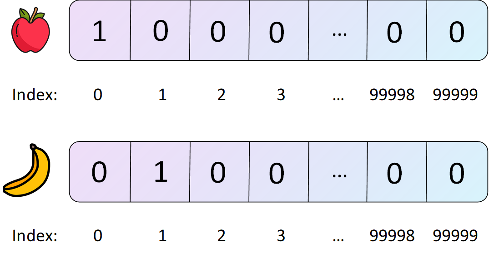
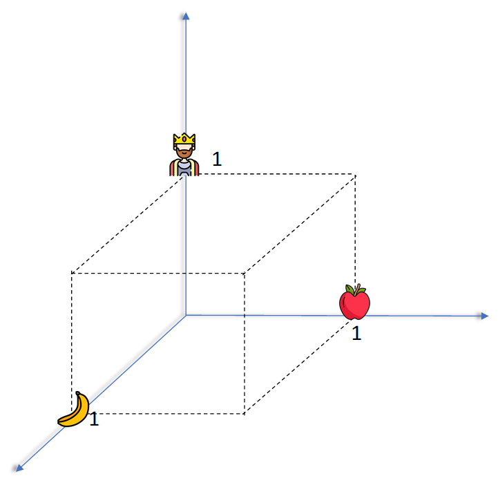
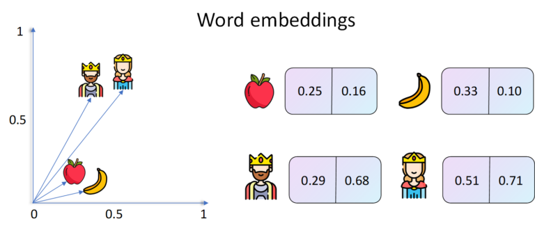
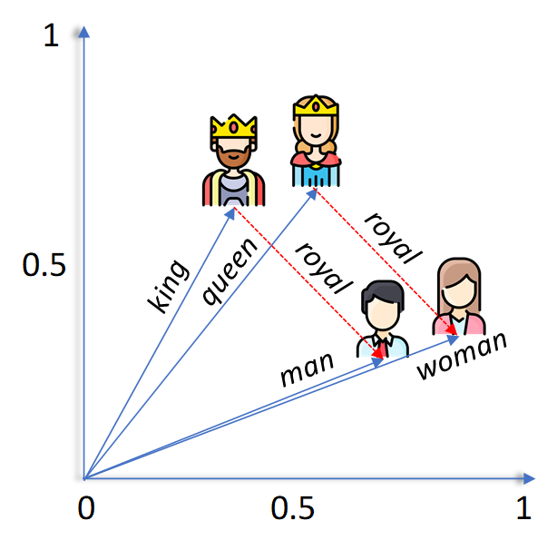
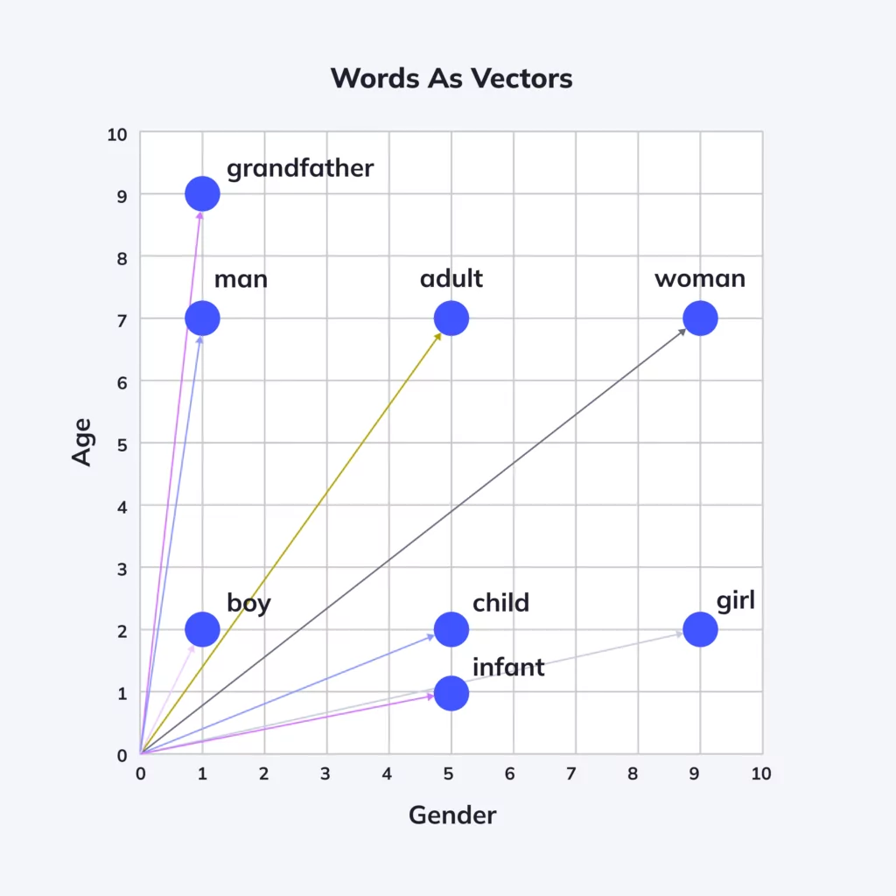
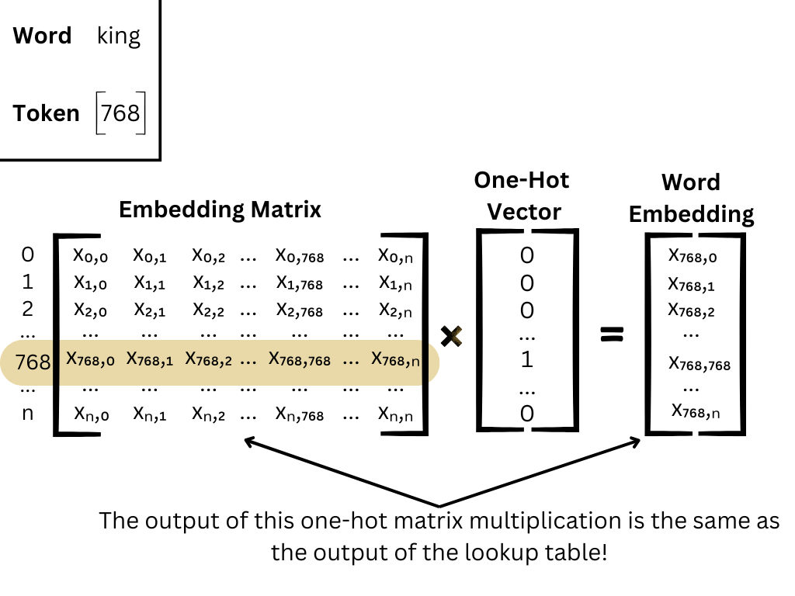
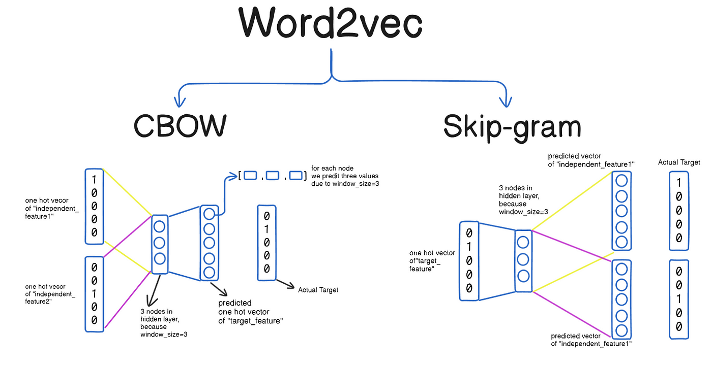
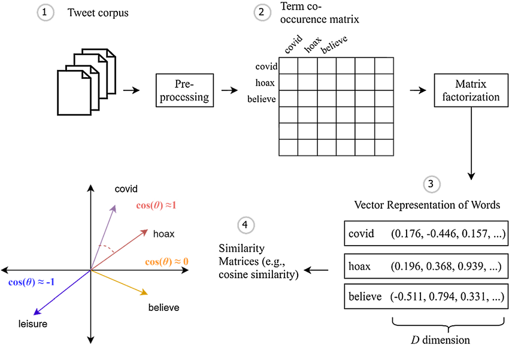

# Doğal Dil İşleme ve Kelime Gömmeleri (Natural Language Processing and Word Embeddings)

<!-- toc -->

## Kelime Temsili (Word Representation)

Doğal Dil İşleme'de (Natural Language Processing - NLP), kelime temsili, kelimelerin bir makine öğrenmesi modelinin anlayabileceği sayısal bir forma nasıl dönüştürüldüğünü ifade eder. Geleneksel yaklaşımlar, her kelimenin kelime dağarcığı boyutunda bir ikili vektör ile temsil edildiği tek-sıcak kodlamayı (one-hot encoding) kullanır. Ancak, tek-sıcak vektörler yüksek boyutluluk ve anlamsal bilgi eksikliği gibi sorunlar yaşar.

**Örnek:**

Bu görsel, tek-sıcak gömmeye (one-hot embedding) bir örnek göstermektedir.

<div style="text-align: center;display:flex; justify-content: center; margin-bottom: 20px; ">
    
</div>

```
Vocabulary: ["king", "banana", "apple"]
One-hot representation of "king": [1, 0, 0]
One-hot representation of "banana": [0, 1, 0]
One-hot representation of "apple": [0, 0, 1]
```

<div style="text-align: center;display:flex; justify-content: center; margin-bottom: 20px; ">
    
</div>

Bu temsil, "banana" ve "apple" arasındaki ilişkiyi ya da her ikisinin de meyve olduğunu yakalamaz. Bu nedenle **kelime gömmeleri** (word embeddings) gibi daha iyi yöntemlere ihtiyaç duyarız.

---

## Kelime Gömmelerini Kullanma (Using Word Embeddings)

Kelime gömmeleri, anlamsal olarak benzer kelimelerin birbirine daha yakın haritalandığı sürekli bir vektör uzayındaki yoğun vektör temsilleridir.

<div style="text-align: center;display:flex; justify-content: center; margin-bottom: 20px; ">
    
</div>

**Örnek:**
3B bir görselleştirme, şu şekilde vektörler gösterebilir:

- vektor("king") - vektor("man") + vektor("woman") ≈ vektor("queen")

<div style="text-align: center;display:flex; justify-content: center; margin-bottom: 20px; ">
    
</div>

Bu aritmetik, kelimeler arasındaki anlamsal ilişkiyi yansıtarak makinelerin benzetmeleri (analojileri) anlamasını sağlar.

---

## Kelime Gömmelerinin Özellikleri (Properties of Word Embeddings)

Kelime gömmeleri ilgi çekici özellikler sergiler:

<div style="text-align: center;display:flex; justify-content: center; margin-bottom: 20px; ">
    
</div>

- **Anlamsal benzerlik (Semantic similarity):** Benzer kelimelerin vektörleri birbirine yakındır (örneğin, "good" ve "great").
- **Doğrusal alt yapılar (Linear substructures):** İlişkiler basit vektör aritmetiği ile yakalanabilir (örneğin, "Paris" - "France" + "Italy" ≈ "Rome").
- **Boyut indirgeme (Dimensionality reduction):** Gömmeler, yüksek boyutlu tek-sıcak vektörleri daha düşük boyutlu yoğun vektörlere indirger (örneğin, 10.000'den 300 boyuta).

---

## Gömmeye Matrisi (Embedding Matrix)

Bir **gömmeye matrisi** (embedding matrix), sinir ağında her satırın bir kelimenin vektörüne karşılık geldiği eğitilebilir bir matristir.

**Yapı:**

- Kelime dağarcığı boyutunun `V = 10.000` ve gömmeye boyutunun `N = 300` olduğunu varsayalım.
- Gömmeye matrisi `E`, `(V, N)` şeklinde bir boyuta sahip olacaktır.

`i` kelimesinin gömme vektörünü almak için şu şekilde kullanılır:

```python
embedding_vector = E[i]
```

<div style="text-align: center;display:flex; justify-content: center; margin-bottom: 20px; ">
    
</div>

Bu matris, eğitim sırasında güncellenir, böylece gömmeler göreve özgü bilgileri yakalar.

---

## Kelime Gömmelerini Öğrenme (Learning Word Embeddings)

Kelime gömmeleri iki şekilde öğrenilebilir:

1. **Denetimli Öğrenme (Supervised Learning):** Bir alt görev (downstream task) üzerinde bir model eğitin (örneğin, duygu sınıflandırması) ve eğitim sırasında gömmeleri güncelleyin.
2. **Denetimsiz Öğrenme (Unsupervised Learning):** Genel amaçlı temsiller öğrenmek için büyük metin külliyatları (corpora) üzerinde gömmeler eğitin (örneğin, Word2Vec, GloVe).

---

## Word2Vec

Word2Vec, kelime gömmelerini öğrenmek için popüler bir denetimsiz modeldir. İki mimariye sahiptir:

#### Mimariler: CBOW ve Skip-Gram

Word2Vec, iki ana model mimarisinde gelir:

<div style="text-align: center;display:flex; justify-content: center; margin-bottom: 20px; ">
    
</div>

1. **Sürekli Kelime Torbası (Continuous Bag of Words - CBOW):**

   Mevcut kelimeyi bağlamına (context) göre tahmin eder.<br>
   Çevreleyen kelimeler verildiğinde, model merkez kelimeyi tahmin etmeye çalışır.<br/>
   Daha büyük veri kümeleri ve daha sık görülen kelimeler için verimlidir.

   **Örnek:**

   - Girdi: ["the", "cat", "on", "the", "mat"]
   - Merkez Kelime: "sat"
   - Bağlam: ["the", "cat", "on", "the", "mat"]
   - CBOW, "sat" kelimesini bağlamdan tahmin etmeye çalışır.

2. **Skip-Gram:**

   Mevcut kelime verildiğinde çevreleyen bağlam kelimelerini tahmin eder.<br>
   Merkez kelime verildiğinde, model bağlamı tahmin etmeye çalışır.<br>
   Daha küçük veri kümeleri ve nadir kelimelerle iyi performans gösterir.

   **Örnek:**

   - Girdi: "sat"
   - Hedef Çıktılar: ["the", "cat", "on", "the", "mat"]
   - Skip-Gram, "sat" kelimesinden çevreleyen kelimeleri tahmin etmeye çalışır.

<br/>

**Word2Vec'in Kelime Gömmelerini Nasıl Öğrendiği**

- Word2Vec, tek gizli katmanlı sığ bir sinir ağı (shallow neural network) kullanır.
- Kelime dağarcığı boyutu `V`, istenen vektör boyutu ise `N`'dir.
- Girdi katmanı, `V` boyutunda bir tek-sıcak vektördür.
- Gizli katman (aktivasyon fonksiyonu yok) `N` boyutundadır.
- Çıktı katmanı da `V` boyutundadır ve tüm kelimeler üzerinde bir olasılık dağılımı tahmin eder.

**Adımlar:**

1. Girdi kelimesini tek-sıcak kodlanmış bir vektöre dönüştürün.
2. Gizli katman temsilini elde etmek için bunu girdi ağırlık matrisiyle çarpın.
3. Kelime dağarcığındaki tüm kelimeler için puanlar elde etmek için bunu çıktı ağırlık matrisiyle çarpın.
4. Bir olasılık dağılımı oluşturmak için softmax uygulayın.
5. Kaybı en aza indirmek için gradyan inişi (gradient descent) kullanarak geri yayılım (backpropagation) yoluyla ağırlıkları güncelleyin.

#### Eğitim Hedefi: Log Olasılığını Maksimize Etme

Skip-Gram modeli için amaç, ortalama log olasılığını maksimize etmektir:

$$
\frac{1}{T} \sum_{t=1}^{T} \sum_{-m \leq j \leq m, j \neq 0} \log p(w_{t+j} | w_t)
$$

Burada:

- $ T $, külliyattaki (corpus) toplam kelime sayısıdır.
- $ m $, bağlam penceresi (context window) boyutudur.
- $ w_t $ merkez kelime ve $ w_{t+j} $ bağlam kelimeleridir.

---

**Hesaplama Zorluğu: Softmax ve Büyük Kelime Dağarcığı**

Büyük bir kelime dağarcığı üzerinde softmax hesaplamak hesaplama açısından maliyetlidir. Bunu ele almak için Word2Vec, optimizasyon teknikleri sunar:

- **Negatif Örnekleme (Negative Sampling)**
- **Hiyerarşik Softmax (Hierarchical Softmax)**

Bu yöntemler, öğrenilen gömmelerin kalitesini korurken eğitim süresini önemli ölçüde azaltır.

---

**Örnek: Bir Cümleden Öğrenme**

Diyelim ki cümle şu şekilde:

`"The quick brown fox jumps over the lazy dog"`

2 boyutunda bir bağlam penceresi ile, merkez kelime "brown" için bağlam ["The", "quick", "fox", "jumps"] şeklindedir.  
Skip-Gram modelinde, ağı "brown" kelimesinden bu bağlam kelimelerinin her birini tahmin etmesi için eğitiriz.

---

**Word2Vec Neden Çalışır**

Word2Vec, aşağıdaki nedenlerle faydalı temsiller öğrenir:

- Hem sözdizimsel (syntactic) hem de anlamsal (semantic) ilişkileri yakalar.
- Bir külliyattaki kelimelerin birlikte görülme (co-occurrence) istatistiklerinden yararlanır.
- Vektör uzayı, birçok dilbilimsel düzenliliği (linguistic regularities) korur.

Örneğin:

- `vec("Paris") - vec("France") + vec("Italy") ≈ vec("Rome")`
- `vec("walking") - vec("walk") + vec("swim") ≈ vec("swimming")`

---

**Word2Vec'in Uygulamaları**

- **Metin sınıflandırması (Text classification)**
- **Duygu analizi (Sentiment analysis)**
- **Adlandırılmış varlık tanıma (Named entity recognition)**
- **Soru cevaplama (Question answering)**
- **Anlamsal arama (Semantic search)**
- **Makine çevirisi (Machine translation)**

Bu gömmeler önceden eğitilebilir (örneğin, Google News üzerinde) veya belirli alanlara (örneğin, tıbbi metinler, hukuki belgeler) uyarlamak için özel külliyatlar üzerinde eğitilebilir.

<br/>

---

## Negatif Örnekleme (Negative Sampling)

Word2Vec'te, kelime dağarcığındaki tüm kelimeler için ağırlıkları güncellemek yerine, **negatif örnekleme** sadece birkaçını günceller:

- Bir pozitif çift (kelime ve bağlam) seçin.
- Rastgele `k` tane negatif kelime örnekleyin.

Bu, verimliliği önemli ölçüde artırır ve modelin büyük külliyatlara ölçeklenmesini sağlar.

**Kayıp fonksiyonu (basitleştirilmiş):**

$$
\log(\sigma(v_c \cdot v_w)) + \sum_{j=1}^k \mathbb{E}_{w_j \sim P_n(w)}[\log(\sigma(-v_{w_j} \cdot v_w))]
$$

Burada:

- `v_w` girdi kelime vektörüdür
- `v_c` bağlam vektörüdür
- `P_n(w)` gürültü dağılımıdır (noise distribution)

<br/>

---

## GloVe Kelime Vektörleri (GloVe Word Vectors)

GloVe (Global Vectors for Word Representation — Kelime Temsili için Küresel Vektörler), Word2Vec'e bir alternatiftir. Bir birlikte görülme matrisi (co-occurrence matrix) `X` oluşturur ve kelimeler arasındaki ilişkileri küresel birlikte görülme istatistiklerine dayanarak modeller.

<div style="text-align: center;display:flex; justify-content: center; margin-bottom: 20px; ">
    
</div>

**Maliyet fonksiyonu:**

$$
J = \sum_{i,j=1}^{V} f(X_{ij})(w_i^T \tilde{w}_j + b_i + \tilde{b}_j - \log X_{ij})^2
$$

Burada:

- $X_{ij}$ = $i$ kelimesinin $j$ kelimesiyle birlikte görülme sayısı
- $w_i$, $\tilde{w}_j$ = kelime vektörleri
- $b_i$, $\tilde{b}_j$ = bias (sapma) terimleri
- $f(X)$ = ağırlıklandırma fonksiyonu

Bu yaklaşım, hem yerel hem de küresel kelime ilişkilerini yakalar.

---

## Duygu Sınıflandırması (Sentiment Classification)

Kelime gömmeleri, **duygu analizi** (sentiment analysis) gibi görevler için LSTM veya CNN gibi modellere girdi olarak kullanılabilir.

**Örnek iş akışı:**

1. Metni gömmeler dizisine dönüştürün.
2. Diziyi bir LSTM'ye besleyin.
3. Bir duygu etiketi tahmin edin: pozitif, negatif veya nötr.

Gömmeler, geleneksel yöntemlerin gözden kaçırabileceği bağlamsal duygu bilgilerini yakalamaya yardımcı olur.

---

## Kelime Gömmelerinde Önyargı Giderme (Debiasing Word Embeddings)

Kelime gömmeleri, toplumsal önyargıları (örneğin, cinsiyet önyargısı) yansıtabilir ve güçlendirebilir.

**Örnek:**

- Önyargılı gömmelerde vektor("doctor"), vektor("woman") yerine vektor("man")'e daha yakın olabilir.

**Önyargı Giderme Teknikleri (Debiasing Techniques):**

1. **Önyargı alt uzayını belirleyin (Identify bias subspace):** örneğin, cinsiyet yönü (he-she).
2. **Nötralize edin (Neutralize):** Cinsiyet açısından nötr kelimeleri (örneğin, "doctor") cinsiyet yönüne dik (orthogonal) hale getirin.
3. **Eşitleyin (Equalize):** Kelime çiftlerini (örneğin, "man" ve "woman") nötr terimlerden eşit uzaklıkta olacak şekilde ayarlayın.

Bu teknikler, NLP uygulamalarını adil ve kapsayıcı hale getirmek için gereklidir.

---

Bu, kelime gömmeleri ve bunların doğal dil işlemede kullanımına ilişkin kapsamlı bir genel bakışı sonlandırmaktadır. Buradaki her kavram, Transformer'lar ve BERT gibi daha ileri düzey NLP modellerinin temelini oluşturur.
