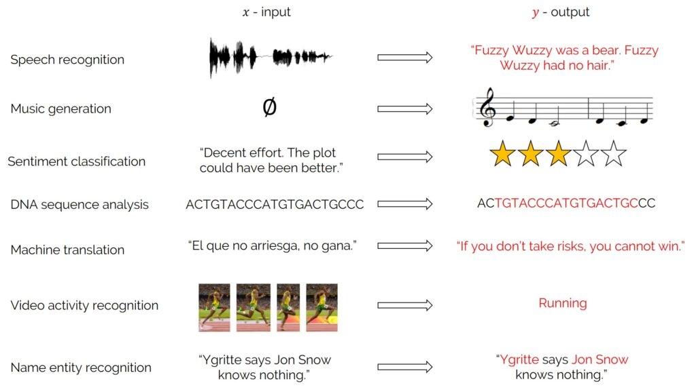
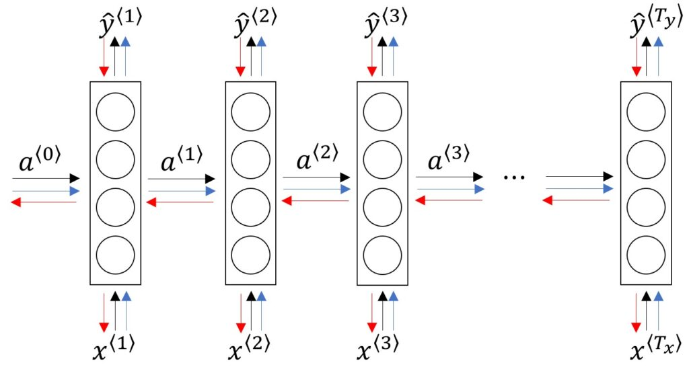
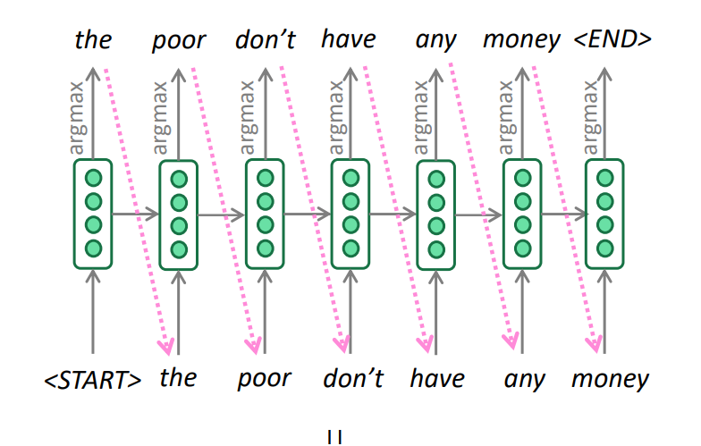
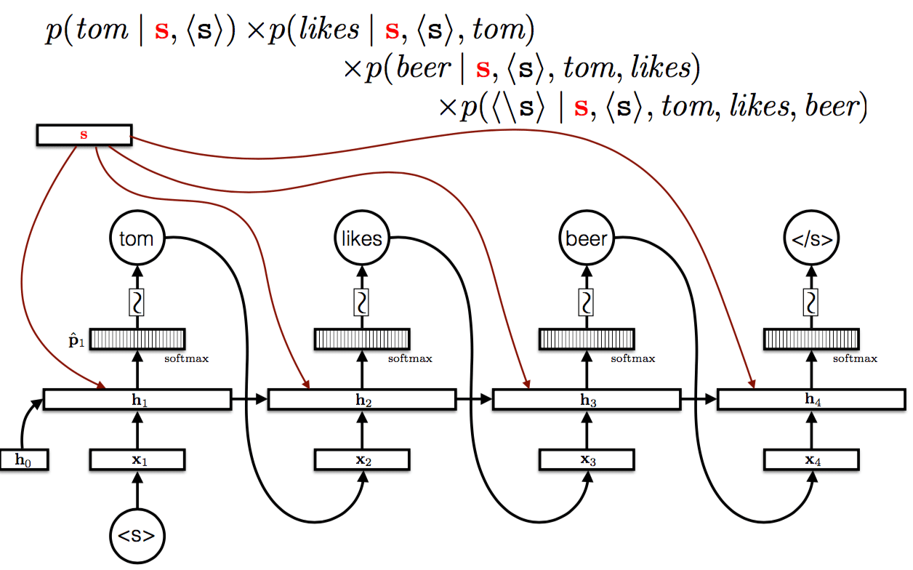
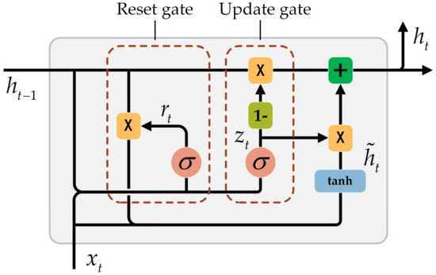
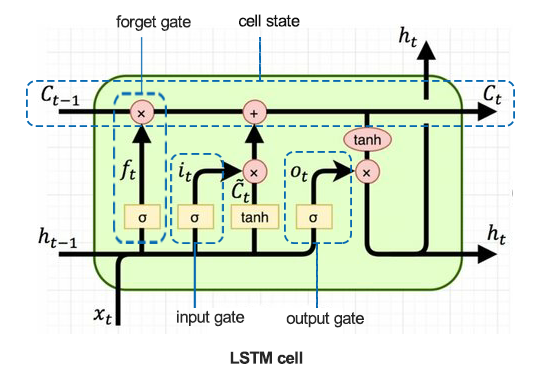
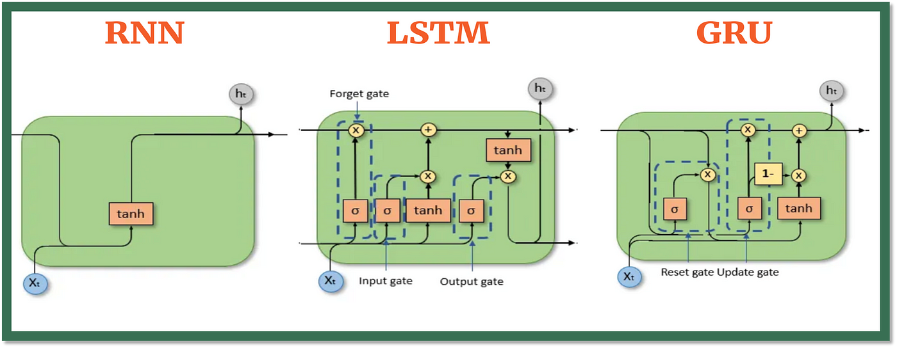
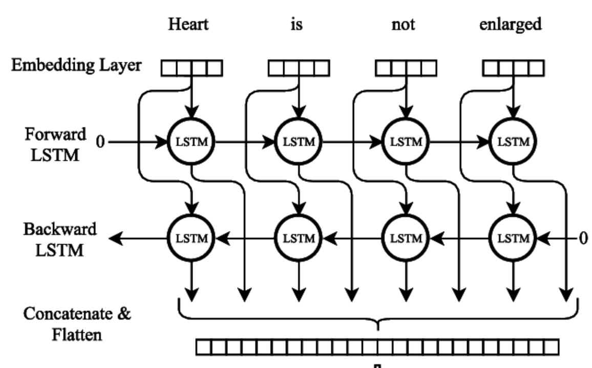

# Tekrarlayan Sinir Ağları (Recurrent Neural Networks - RNNs)

<!-- toc -->

## Neden Dizi Modelleri (Sequence Models)?

Dizi modelleri, girdi ve/veya çıktının sıralı (sequential) olduğu durumlarda kullanılır. Örneğin:

    

Bu modeller, zaman veya dizi konumları arasındaki bağımlılıkları (dependencies) modeller; standart ileri beslemeli sinir ağlarının (feedforward neural networks) verimli bir şekilde yapamadığı budur.

## Gösterim (Notation)

- $x^{(t)}$: $t$ zaman adımındaki girdi (input)
- $y^{(t)}$: $t$ zaman adımındaki çıktı (output)
- $a^{(t)}$: $t$ zaman adımındaki gizli durum (hidden state)
- $\hat{y}^{(t)}$: $t$ zaman adımındaki tahmin edilen çıktı (predicted output)
- $T$: dizi uzunluğu (sequence length)

## Tekrarlayan Sinir Ağı Modeli (Recurrent Neural Network Model)

RNN şu şekilde hesaplama yapar:

- $a^{(t)} = \tanh(W_{aa}a^{(t-1)} + W_{ax}x^{(t)} + b_a)$
- $\hat{y}^{(t)} = \text{softmax}(W_{ya}a^{(t)} + b_y)$

RNN'ler parametreleri zaman boyunca paylaşarak farklı dizi uzunluklarına genelleme yapabilir.

## Zamanda Geriye Yayılım (Backpropagation Through Time)

RNN'leri eğitmek için zamanda geriye yayılım (Backpropagation Through Time - BPTT) kullanırız:

    

- RNN'yi $T$ adım için aç (unroll)
- Tüm zaman adımları boyunca kayıp (loss) ve gradyanları (gradients) hesapla
- Zaman bağımlılıkları boyunca gradyanlar için zincir kuralını (chain rule) uygula

## Farklı RNN Türleri

- **Çoktan-Çoğa (Many-to-Many)**: dizi girdi ve dizi çıktı (örneğin, makine çevirisi)
- **Çoktan-Bire (Many-to-One)**: dizi girdi, tek çıktı (örneğin, duygu analizi)
- **Bire-Çoğa (One-to-Many)**: tek girdi, dizi çıktı (örneğin, görüntü altyazılama)

## Dil Modeli ve Dizi Üretimi (Language Model and Sequence Generation)

Dil modelleri, bir dizi verildiğinde bir sonraki kelimeyi tahmin eder:

- $P(y^{(t)} | y^{(1)}, ..., y^{(t-1)})$

    

Eğitim: tahmin edilen ve gerçek sonraki kelimeler arasındaki çapraz entropi kaybını (cross-entropy loss) en aza indir.

## Yeni Diziler Örnekleme (Sampling Novel Sequences)

- Bir tohumla (seed) başla (örneğin, <START>)
- $y^{(1)}$'i örnekle, geri besle
- <END> veya maksimum uzunluğa kadar devam et

    

Örnekleme sıcaklığı (sampling temperature) rastgeleliği kontrol edebilir:

- Düşük sıcaklık = tutucu (muhafazakar seçimler)
- Yüksek sıcaklık = yaratıcı (çeşitli çıktılar)

## RNN'lerde Kaybolan Gradyanlar (Vanishing Gradients with RNNs)

RNN'leri eğitirken karşılaşılan temel zorluklardan biri, özellikle uzun vadeli bağımlılıklar (long-term dependencies) modellenirken ortaya çıkan **kaybolan gradyan problemidir (vanishing gradient problem)**.

**Zamanda Geriye Yayılım (BPTT)** kullanılarak gradyanlar hesaplanırken, önceki zaman adımlarındaki gradyanlar, küçük değerlerin (tanh veya sigmoid gibi aktivasyon fonksiyonlarının türevlerinden gelen) tekrarlanan çarpımından etkilenir. Bu durum şunlara yol açar:

- Gradyanların **çok küçülmesi (kaybolması)**: önceki zaman adımlarındaki ağırlıklar neredeyse hiç güncellenmez
- Gradyanların **çok büyümesi (patlaması)**: eğitimde kararsızlık ve ıraksama (divergence)

 

**Örnekle Sezgi (Intuition with Example):**

Bir dizi düşünün: "Fransa'da büyüdüm... Akıcı bir şekilde \_\_\_ konuşuyorum"

Modelin, "Fransızca" kelimesinin birçok zaman adımı önce görülen "Fransa" bağlam kelimesine bağlı olduğunu öğrenmesi gerekir. Gradyan bu adımlar boyunca çok fazla küçülürse, model bu bağımlılığı öğrenemez.

 

**Sonuçlar:**

- **Kısa vadeli bağımlılıklar** etkili bir şekilde öğrenilir.
- **Uzun vadeli bağımlılıklar** genellikle kaybolur.

## Geçitli Tekrarlayan Birim (Gated Recurrent Unit - GRU)

**Neden GRU'lara ihtiyacımız var?**

Geleneksel RNN'ler, kaybolan gradyan problemi nedeniyle uzun vadeli bağımlılıkları öğrenmekte zorlanır. Diziler uzadıkça, geriye yayılım sırasında kullanılan gradyanlar ya küçülür ya da patlar, bu da ağın bilgiyi zaman içinde tutmasını zorlaştırır.

GRU'lar, hangi bilginin hatırlanması, güncellenmesi veya unutulması gerektiğini kontrol eden geçit mekanizmaları (gating mechanisms) ekleyerek bu sorunu çözmek için tasarlanmıştır. Bu geçitler, ağı uzun dizilerdeki bağımlılıkları öğrenmede daha verimli hale getirir.

GRU, bilgi akışını kontrol etmek için geçitler sunar:

    

Bir GRU'nun iki ana geçidi vardır:

1. Güncelleme Geçidi (Update Gate - $z$):

   - Önceki belleğin ne kadarının korunacağını belirler.

   - z ≈ 1 ise, eski belleği korur.

   - z ≈ 0 ise, yeni bilgiyle günceller.

2. Sıfırlama Geçidi (Reset Gate - $r$):

   - Önceki durumun ne kadarının yok sayılacağını kontrol eder.

   - Yeni bellek oluşturulurken eski durumun unutulup unutulmayacağına karar vermeye yardımcı olur.

Denklemler:

- $z^{(t)} = \sigma(W_zx^{(t)} + U_za^{(t-1)} + b_z)$
- $r^{(t)} = \sigma(W_rx^{(t)} + U_ra^{(t-1)} + b_r)$
- $\tilde{a}^{(t)} = \tanh(Wx^{(t)} + U(r^{(t)} \ast a^{(t-1)}) + b)$
- $a^{(t)} = (1 - z^{(t)}) * a^{(t-1)} + z^{(t)} * \tilde{a}^{(t)}$

 

**GRU ve Geleneksel RNN Karşılaştırması**

| Özellik                | RNN           | GRU                               |
| ---------------------- | ------------- | --------------------------------- |
| Bellek kontrolü        | Yok           | Var (güncelleme/sıfırlama geçitleri) |
| Kaybolan gradyanlar    | Yaygın        | Daha az sık                       |
| Parametre verimliliği  | Daha az parametre | Daha fazla, ancak LSTM'den az    |
| Eğitim hızı            | Hızlı         | RNN'den yavaş, LSTM'den hızlı     |

---

**Örnek: Bağlamlı Dizi (Sequence with Context)**

Bir cümlenin duygusunu sınıflandırmaya çalıştığımızı düşünelim:

> “Film berbattı... ama finali inanılmazdı.”

- Bir **vanilya RNN**, önceki **"berbat"** kelimesini unutup **"inanılmaz"** kelimesine aşırı ağırlık vererek yanlış bir **pozitif** sınıflandırmaya yol açabilir.
- Bir **GRU**, her iki duyguyu da **koruyarak** ve uzun vadeli bağlamı muhafaza ederek daha **dengeli bir temsil** verebilir.

 

## Uzun Kısa Vadeli Bellek (Long Short-Term Memory - LSTM)

**Neden LSTM'e İhtiyacımız Var?**

Geleneksel RNN'ler, kaybolan gradyanlar nedeniyle uzun vadeli bağımlılıkları öğrenmekte zorlanır; bu durum uzun diziler boyunca öğrenmeyi engeller.

Bunu çözmek için LSTM'ler, bilgiyi zaman adımları boyunca korumaya ve düzenlemeye yardımcı olan bellek hücreleri (memory cells) ve geçitler sunar.

 

**LSTM Mimarisi Sezgisi (LSTM Architecture Intuition)**

LSTM hücreleri, bilgiyi kontrol etmek için üç geçit sunar:

- **Unutma Geçidi (Forget Gate)**: Hücre durumundan hangi bilginin atılacağına karar verir.
- **Girdi Geçidi (Input Gate)**: Hücre durumunda hangi yeni bilginin saklanması gerektiğine karar verir.
- **Çıktı Geçidi (Output Gate)**: Hücre durumuna göre neyin çıktı olarak verileceğine karar verir.

Bu geçit mekanizması, modelin gereksiz verileri atarken **ilgili bilgileri uzun süreler boyunca tutmasını** sağlar.

 

**LSTM Hücresi: Adım Adım (LSTM Cell: Step-by-Step)**

Tek bir $ t $ zaman adımı için bir LSTM hücresi hesaplamasını adım adım inceleyelim:

    

- $ x^{\langle t \rangle} $: $ t $ zamanındaki girdi
- $ a^{\langle t-1 \rangle} $: önceki adımdaki gizli durum
- $ c^{\langle t-1 \rangle} $: önceki adımdaki hücre durumu

Ardından LSTM aşağıdaki işlemleri gerçekleştirir:

1. **Unutma Geçidi** $ f^{\langle t \rangle} $:

   $$
   f^{\langle t \rangle} = \sigma(W_f \cdot [a^{\langle t-1 \rangle}, x^{\langle t \rangle}] + b_f)
   $$

   Önceki hücre durumundan neyin unutulacağına karar verir.

2. **Girdi Geçidi** $ i^{\langle t \rangle} $ ve **Aday Değerler** $ \tilde{c}^{\langle t \rangle} $:

   $$
   i^{\langle t \rangle} = \sigma(W_i \cdot [a^{\langle t-1 \rangle}, x^{\langle t \rangle}] + b_i)
   $$

   $$
   \tilde{c}^{\langle t \rangle} = \tanh(W_c \cdot [a^{\langle t-1 \rangle}, x^{\langle t \rangle}] + b_c)
   $$

   Hücre durumuna hangi yeni bilginin ekleneceğini belirler.

3. **Hücre Durumunu Güncelle**:

   $$
   c^{\langle t \rangle} = f^{\langle t \rangle} * c^{\langle t-1 \rangle} + i^{\langle t \rangle} * \tilde{c}^{\langle t \rangle}
   $$

4. **Çıktı Geçidi** $ o^{\langle t \rangle} $ ve **Gizli Durum** $ a^{\langle t \rangle} $:
   $$
   o^{\langle t \rangle} = \sigma(W_o \cdot [a^{\langle t-1 \rangle}, x^{\langle t \rangle}] + b_o)
   $$
   $$
   a^{\langle t \rangle} = o^{\langle t \rangle} * \tanh(c^{\langle t \rangle})
   $$

 

**Örnek: RNN ve LSTM Karşılaştırması**

Bir cümledeki sonraki kelimeyi tahmin etmek istediğimizi varsayalım. Karşılaştıralım:

**RNN**:

- Cümleler uzun olduğunda bağlamı korumakta zorlanır.
- Örneğin: `"Köpek tarafından kovalanan kedi, ağaca..." → "tırmandı"` → özne olan "kedi" unutulabilir.

**LSTM**:

- "Kedi" bağlamını korur ve başarıyla `"tırmandı"` tahminini yapar.

 

| Özellik                         | RNN | LSTM                        |
| ------------------------------- | --- | --------------------------- |
| Uzun Vadeli Bağımlılıkları İşler | ❌  | ✅                          |
| Kaybolan Gradyana Dayanıklı     | ❌  | ✅                          |
| Geçit Kullanır                  | ❌  | ✅ (Unutma, Girdi, Çıktı)   |
| Hesaplama Karmaşıklığı          | Düşük | Daha yüksek, ancak daha ifade güçlü |

 

    

LSTM'ler, doğal dil işleme, konuşma tanıma, zaman serisi tahminlemesi ve **uzun vadeli belleğin** kritik olduğu her alanda yaygın olarak kullanılır.

 
 

## Çift Yönlü RNN (Bidirectional RNN)

Standart bir RNN'de bilgi tek bir yönde akar — genellikle geçmişten geleceğe. Ancak birçok görevde (konuşma tanıma veya adlandırılmış varlık tanıma gibi), mevcut girdiyi anlamak için hem geçmiş hem de gelecek kelimelerden gelen bağlam faydalıdır. İşte bu noktada **Çift Yönlü RNN'ler (Bidirectional RNNs - BiRNNs)** devreye girer.

 

**Neden Çift Yönlü RNN Kullanmalıyız?**

Çift Yönlü RNN, girdi dizisini iki ayrı gizli katmanla her iki yönde de işler:

    

- Biri **ileri** yönde hareket eder ($x_1$'den $x_T$'ye)
- Biri **geri** yönde hareket eder ($x_T$'den $x_1$'e)

Her iki yönün çıktıları her zaman adımında birleştirilir (concatenate):

$$
\overrightarrow{h}^{(t)} = \text{$t$ zamanındaki ileri RNN çıktısı} \\
\overleftarrow{h}^{(t)} = \text{$t$ zamanındaki geri RNN çıktısı} \\
h^{(t)} = [\overrightarrow{h}^{(t)}; \overleftarrow{h}^{(t)}]
$$

- **Gelecek bağlamına erişim**: Modelin her zaman adımında daha iyi tahminler yapmasına yardımcı olur.
- **Geliştirilmiş performans**: Özellikle bir kelimenin anlamının hem önceki hem de sonraki kelimelere bağlı olduğu görevlerde etkilidir.

 

Şu cümleyi düşünün:

> "Yarasayı gördüğünü söyledi."

Cümleyi yalnızca soldan sağa işlersek, "yarasa" kelimesinin anlamı (hayvan mı yoksa spor aleti mi) sonraki bağlamı görene kadar belirsiz kalır. Çift Yönlü RNN, her iki yönü de işleyerek tüm cümle bağlamını kullanarak anlamı daha iyi ayırt edebilir.

 

**Uygulamalar (Applications)**

- Adlandırılmış Varlık Tanıma (Named Entity Recognition - NER)
- Kelime Türü Etiketleme (Part-of-Speech - POS tagging)
- Konuşma tanıma
- Metin sınıflandırma

Çift Yönlü RNN'ler genellikle LSTM veya GRU birimleriyle birlikte kullanılarak her iki yönde de uzun vadeli bağımlılıkların daha etkili bir şekilde yakalanmasını sağlar.

## Derin RNN'ler (Deep RNNs)

Derin RNN'ler, birden fazla tekrarlayan katmanı üst üste istifleyerek ağın dizilerin hiyerarşik temsillerini (hierarchical representations) öğrenmesini sağlar. Derinliği artırarak model daha karmaşık zamansal örüntüleri (temporal patterns) ve soyutlamaları (abstractions) yakalayabilir.

- Her katmanın çıktısı, bir sonraki tekrarlayan katmanın girdisi olarak hizmet eder.
- Zaman adımları boyunca daha yüksek seviyeli özniteliklerin (higher-level features) öğrenilmesini sağlar.
- Model kapasitesini ve ifade gücünü artırabilir.

**Zorluklar:**

- Daha fazla parametre nedeniyle aşırı öğrenme (overfitting) riskinin artması.
- Kaybolan/patlayan gradyanlar nedeniyle eğitimin daha yavaş ve daha zor olması.

**Uygulamalar:**

- Konuşma tanıma, dil modelleme ve video analizi gibi karmaşık dizi modelleme görevleri.

Derin RNN'ler, eğitim zorluklarını hafifletmek ve uzun vadeli bağımlılıkları etkili bir şekilde yakalamak için genellikle LSTM veya GRU gibi gelişmiş birimlerle birleştirilir.
