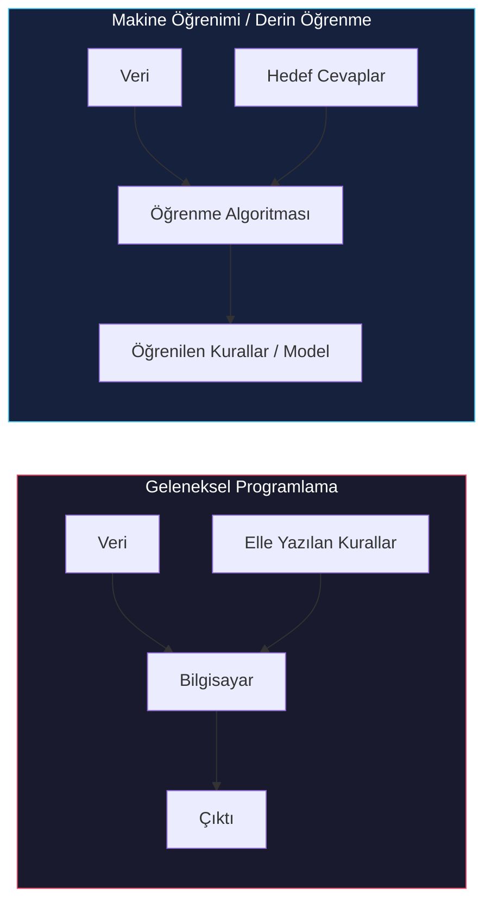
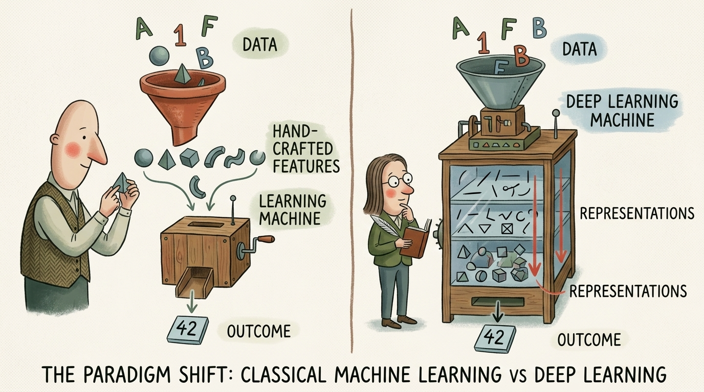
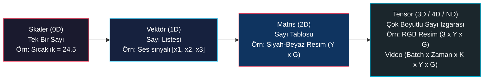
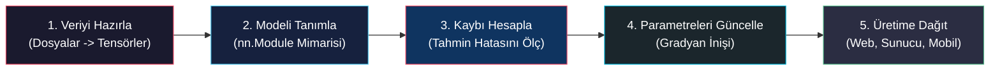
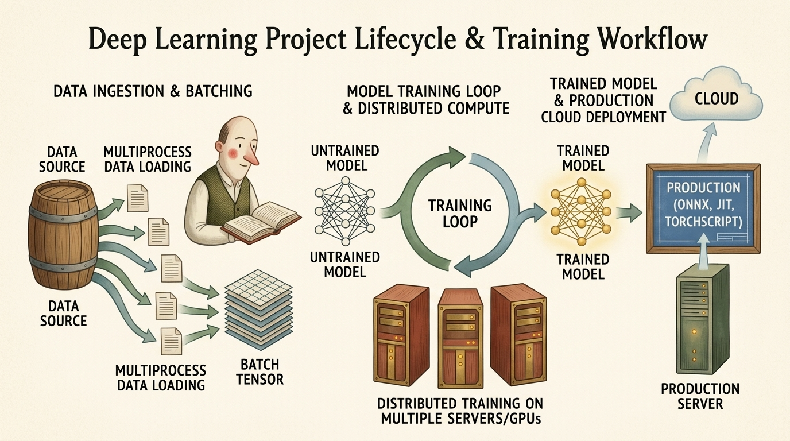

# Derin Öğrenmeye Giriş ve PyTorch Kütüphanesi

<!-- toc -->

<div style="margin-bottom: 20px;">
  <a href="https://colab.research.google.com/github/emreaslan7/ai/blob/main/notebooks/deep-learning-with-pytorch/01-introducing-deep-learning-and-the-pytorch-library.ipynb" target="_blank">
    
  </a>
</div>

PyTorch ile derin öğrenme dünyasına hoş geldiniz. Bilgisayarların fotoğraflardaki yüzleri nasıl tanıdığını, konuşulan cümleleri anında başka dillere nasıl çevirdiğini veya birkaç kelimelik bir metinden gerçeğe yakın görselleri nasıl ürettiğini merak ettiyseniz; tüm bu gelişmelerin arkasındaki temel teknoloji derin öğrenmedir (deep learning).

Bu bölüm, derin öğrenmenin temellerini en sıfırdan, anlaşılır ve adım adım bir anlatımla ele almaktadır. Derin öğrenmenin ne olduğunu, klasik makine öğreniminden nasıl ayrıldığını, tensör (tensor) kavramının en sade tanımını, PyTorch'un neden dünya genelindeki araştırmacıların ve mühendislerin bir numaralı tercihi haline geldiğini ve bir derin öğrenme projesinin baştan sona nasıl inşa edildiğini öğreneceksiniz.

---

## 1. Derin Öğrenme Nedir?

On yıllar boyunca geleneksel bilgisayar programları, insanlar tarafından elle yazılan kesin kurallarla geliştirildi. Bir yazılımcı şu şekilde mantık kuralları yazardı: *"Eğer sıcaklık 30 derecenin üzerindeyse ve nem yüksekse, klimayı çalıştır."*

Ancak bir kamera görüntüsündeki yayayı tanımak ya da farklı aksanlarla konuşulan bir dili anlamak gibi karmaşık görevlerde elle tek tek kural yazmak imkansızdır. Işık koşulları, kamera açıları, kıyafetler ve ses tonları sonsuz çeşitlilik gösterir.



Derin öğrenme bu programlama mantığını tersine çevirir. Kuralları elle yazmak yerine bilgisayara binlerce örnek (girdiler ve olması gereken doğru çıktılar) verilir; bilgisayar bu girdileri çıktılara dönüştüren matematiksel kuralları **kendi kendine öğrenir**.

Bilgisayar bilimci Edsger W. Dijkstra'nın meşhur sözünde ifade ettiği gibi:
> *"Bir makinenin düşünüp düşünemeyeceği sorusu, bir denizaltının yüzüp yüzemeyeceği sorusu kadar anlamsızdır."*

Derin öğrenmede makinelerin insan bilincine sahip olması gerekmez; bizim için önemli olan, girdileri doğru çıktılara eşleyen karmaşık matematiksel fonksiyonları güvenilir bir şekilde yakalayabilmeleridir.

---

## 2. Makine Öğreniminden Derin Öğrenmeye Geçiş

Derin öğrenmenin yapay zekada neden devrim yarattığını anlamak için klasik makine öğrenimi ile derin öğrenmenin veriyi nasıl işlediğini karşılaştırmak gerekir.

```mermaid
flowchart TD
    subgraph Classical["Klasik Makine Öğrenimi (Elle Öznitelik Çıkarımı)"]
        C1["Ham Görüntü (Pikseller)"] --> C2["İnsan Mühendisliği ile Öznitelik Çıkarımı\n(Kenar Filtreleri, Doku Histogramları, SIFT)"]
        C2 --> C3["Sığ Sınıflandırıcı\n(Lojistik Regresyon, SVM)"]
        C3 --> C4["Tahmin: 'Köpek'"]
    end

    subgraph Modern["Derin Öğrenme (Uçtan Uca Temsil Öğrenimi)"]
        M1["Ham Görüntü (Pikseller)"] --> M2["1. Katman: Düşük Seviye (Kenarlar ve Noktalar)"]
        M2 --> M3["2. Katman: Orta Seviye (Köşeler ve Dokular)"]
        M3 --> M4["3. Katman: Yüksek Seviye (Gözler, Kulaklar, Burun)"]
        M4 --> M5["Tahmin: 'Köpek'"]
    end

    style Classical fill:#1a1a2e,stroke:#e94560,color:#fff
    style Modern fill:#0f3460,stroke:#00b4d8,color:#fff
```



### 2.1 Öznitelik Mühendisliğinin Darboğazı

Klasik makine öğreniminde (Destek Vektör Makineleri veya Lojistik Regresyon gibi), algoritmalar ham piksel matrislerini doğrudan yüksek doğrulukla işleyemez. Bir insan mühendisin haftalarca uğraşarak "öznitelikler" (features) tasarlaması gerekirdi:
- Renk histogramları hesaplamak
- Kenar bulma filtreleri tasarlamak
- Köşe noktalarını tespit eden algoritmalar yazmak (SIFT, Harris vb.)

Eğer insan iyi öznitelikler çıkaramazsa, model başarısız olurdu. Sistemin başarısı doğrudan insanın uzmanlığıyla sınırlıydı.

### 2.2 Hiyerarşik Temsil Öğrenimi

Derin öğrenme, bu elle öznitelik çıkarma zorunluluğunu **katmanlı temsiller** ile ortadan kaldırır. Bir derin sinir ağı, ardışık yapay nöron katmanlarından oluşur. Her katman bir önceki katmanın çıktısını alıp dönüştürür:

1. **İlk Katmanlar:** Basit geometrik şekilleri, çizgi yönlerini, renk sınırlarını ve parlaklık değişimlerini öğrenir.
2. **Orta Katmanlar:** Kenarları birleştirerek dokuları, köşeleri, konturları ve basit şekilleri (daireler, şeritler) tespit eder.
3. **Daha Derin Katmanlar:** Şekilleri birleştirerek semantik parçaları (göz, tekerlek, köpek kulağı, kapı kolu) yakalar.
4. **Son Katman:** Bu parçaları bir araya getirerek nihai sınıflandırma kararını verir.

Ağın tüm katmanları türevlenebilir matematiksel işlemlerden oluştuğu için, bu hiyerarşinin tamamı **gradyan inişi (gradient descent)** ile aynı anda optimize edilir.

<figure style="display:flex; justify-content: center; margin: 25px 0;">
  <div style="text-align: center;">
    
    <figcaption style="margin-top: 0.6em; text-align: center; font-size: 13px; color: #888;"><em>Hiyerarşik temsil öğrenimi: ham ve kaotik duyusal verilerin ardışık katmanlar boyunca soyut ve yapılandırılmış kavramlara dönüştürülmesi.</em></figcaption>
  </div>
</figure>

---

## 3. Tensör (Tensor) Nedir?

PyTorch ile çalışmaya başlarken bilmeniz gereken en temel veri yapısı **Tensör (Tensor)**'dür.

Tensör kelimesi ilk başta karmaşık veya teorik gelebilir. Ancak bilgisayar biliminde tensör; tek bir sayının, vektörlerin ve matrislerin **herhangi bir boyuta genelleştirilmiş halidir**:

```
0 Boyut (Skaler / Scalar):      42
1 Boyut (Vektör / Vector):      [1.0, 2.5, 3.8]
2 Boyut (Matris / Matrix):      [[1, 2],
                                [3, 4]]
3 Boyut (3D Tensör):            Derinlik, Yükseklik, Genişlik (örneğin Renkli Fotoğraf)
4 Boyut (4D Tensör):            Fotoğraf Paketi veya Video (Paket, Kanallar, Yükseklik, Genişlik)
```



### 3.1 Çalıştırılabilir PyTorch Örneği: Tensör Oluşturma

PyTorch'ta tensör oluşturmanın ve boyutlarını incelemenin ne kadar kolay olduğunu gösteren örnek Python kodu:

```python
import torch

# 1. Skaler (0 boyutlu tensör)
scalar = torch.tensor(42.0)
print("Scalar:", scalar)
print("Scalar dimension (ndim):", scalar.ndim)

# 2. Vektör (1 boyutlu tensör)
vector = torch.tensor([1.5, 3.0, 4.5])
print("\nVector:", vector)
print("Vector shape:", vector.shape)

# 3. Matris (2 boyutlu tensör: 2 satir, 3 sutun)
matrix = torch.tensor([[1, 2, 3], 
                       [4, 5, 6]], dtype=torch.float32)
print("\nMatrix:\n", matrix)
print("Matrix shape (Rows, Columns):", matrix.shape)

# 4. 3 Boyutlu Tensor: Kucuk bir 3 kanalli (RGB) renkli goruntu (3 x 2 x 2)
rgb_image = torch.zeros((3, 2, 2))
print("\n3D Tensor (Channels x Height x Width) shape:", rgb_image.shape)
```

---

## 4. Neden PyTorch?

PyTorch, Meta AI (eski adıyla Facebook AI Research) bünyesinde geliştirilmiş ve 2017 yılında açık kaynak olarak yayınlanmıştır. Kısa sürede hem akademik araştırmaların hem de endüstriyel yapay zeka sistemlerinin ana omurgası haline gelmiştir.

PyTorch'u bu kadar başarılı kılan temel unsurlar şunlardır:

### 4.1 Pythonik ve Sezgisel (Eager Execution)

Eski nesil derin öğrenme kütüphanelerinde (TensorFlow 1.x gibi), kod yazmak iki aşamalıydı: Önce soyut bir "sembolik grafik" tanımlanır, ardından bu grafik ayrı bir "oturum (session)" içinde çalıştırılırdı. Bir hata oluştuğunda hata mesajı yazdığınız Python kodunu değil, arka plandaki C++ motorunu gösterirdi.

PyTorch **Eager Modu (Define-by-Run)** anlayışını getirdi:
- Yazdığınız her kod satırı tıpkı standart Python ve NumPy gibi anında çalışır.
- `print()` ile istediğiniz anda tensörün değerini ve boyutunu görebilirsiniz.
- Standart Python `for` döngülerini, `if` koşullarını ve hata ayıklayıcıları (`pdb`) doğrudan kullanabilirsiniz.

```python
import torch

# Saf Python mantigiyla dinamik akis
x = torch.tensor([2.0, -3.0, 5.0])

for val in x:
    if val > 0:
        print(f"Positive value detected: {val.item()}")
    else:
        print(f"Negative value detected: {val.item()}")
```

### 4.2 Zahmetsiz GPU Hızlandırması

PyTorch'ta bir hesaplamayı ekran kartına (GPU) taşımak sadece `.to("cuda")` demek kadar basittir:

```python
import torch

# NVIDIA CUDA GPU varligini kontrol et
device = "cuda" if torch.cuda.is_available() else "cpu"
print(f"Using device: {device}")

# Iki matris olustur ve hedef cihazda carp
a = torch.randn(1000, 1000, device=device)
b = torch.randn(1000, 1000, device=device)
c = torch.matmul(a, b)

print(f"Matrix multiplication result shape on {device}: {c.shape}")
```

### 4.3 Üretime Geçiş Köprüsü: PyTorch 2.x ve `torch.compile`

Modern PyTorch 2.0 ve sonraki sürümlerde, araştırma esnekliği ile üretim hızı arasında seçim yapmak zorunda kalmazsınız. Kodunuza tek bir satır `torch.compile(model)` eklemek, arka planda tüm işlemleri otomatik olarak optimize ederek yüksek hızlı C++/Triton GPU çekirdeklerine dönüştürür.

---

## 5. Bir Derin Öğrenme Projesinin Anatomisi

PyTorch ile geliştirilen her derin öğrenme projesi 5 temel aşamadan oluşan bir döngüyü takip eder:



1. **Veri Hazırlığı (`Dataset` & `DataLoader`):** Diskteki ham dosyalar (resimler, sesler, metinler, medikal taramalar) okunur, sayısal tensörlere dönüştürülür, normalize edilir ve küçük gruplara (mini-batch) ayrılır.
2. **Model Tanımı (`nn.Module`):** Matematiksel katmanların (doğrusal katmanlar, konvolüsyonlar, dikkat blokları) birbirine bağlandığı sinir ağı mimarisi kurulur.
3. **Kayıp Fonksiyonu (Loss Function):** Modelin tahminleri ile gerçek etiketler karşılaştırılarak modelin ne kadar hata yaptığını gösteren tek bir sayısal ceza puanı (kayıp) hesaplanır.
4. **Optimizasyon Döngüsü (Autograd & Optimizer):** Optimizasyon algoritması (SGD veya AdamW), PyTorch'un otomatik türev motoru (`autograd`) ile gradyanları hesaplar ve hatayı azaltacak şekilde modelin ağırlıklarını ufak adımlarla günceller.
5. **Üretime Dağıtım:** Eğitilen model kaydedilir, dışa aktarılır (ONNX, LibTorch veya `torch.export`) ve bir API sunucusu (FastAPI) veya uç cihazlar (mobil telefonlar, gömülü sistemler) üzerinde kullanıma sunulur.

<figure style="display:flex; justify-content: center; margin: 25px 0;">
  <div style="text-align: center;">
    
    <figcaption style="margin-top: 0.6em; text-align: center; font-size: 13px; color: #888;"><em>Uçtan uca derin öğrenme proje döngüsü: çoklu işlemle veri yükleme ve GPU kümelerinde dağıtık eğitimden canlı üretime dağıtıma kadar olan süreç.</em></figcaption>
  </div>
</figure>

---

## 6. Kurulum ve Donanım Doğrulama

Kitaptaki uygulamaları ve kodları takip edebilmek için Python ortamınızda veya Jupyter Notebook'unuzda şu kontrol kodunu çalıştırabilirsiniz:

```python
import sys
import torch

print("=== System and PyTorch Diagnostics ===")
print(f"Python Version: {sys.version.split()[0]}")
print(f"PyTorch Version: {torch.__version__}")

# GPU Varligi Kontrolu
cuda_available = torch.cuda.is_available()
print(f"CUDA Available: {cuda_available}")

if cuda_available:
    device_count = torch.cuda.device_count()
    device_name = torch.cuda.get_device_name(0)
    print(f"Number of GPUs: {device_count}")
    print(f"Primary GPU Device Name: {device_name}")
else:
    print("Running on CPU mode. Standard training in Part 1 will run fine.")

print("PyTorch environment successfully verified!")
```

---

## 7. Özet ve Temel Çıkarımlar

- **Derin Öğrenme ve Klasik ML:** Klasik makine öğrenimi elle yapılan öznitelik mühendisliğine dayanırken; derin öğrenme doğrudan ham veriden hiyerarşik katmanlı temsilleri otomatik olarak öğrenir.
- **Tensörler:** Tensörler, PyTorch'un evrensel veri dilidir; sayıların, vektörlerin, matrislerin ve çok boyutlu dizilerin genel adıdır.
- **Eager Yürütme:** PyTorch kodu satır satır dinamik olarak çalıştırır, bu da model geliştirmeyi ve hata ayıklamayı son derece doğal ve sezgisel kılar.
- **Proje Yaşam Döngüsü:** Derin öğrenme projeleri standart bir döngü izler: Veri Yükleme $\to$ Model Mimarisi $\to$ Kayıp Hesabı $\to$ Geriye Yayılım ile Optimizasyon $\to$ Dağıtım.
