# Tensörlerle Başlamak: Storage, Strides ve Bellek Mimarisi

<!-- toc -->

<div style="margin-bottom: 20px;">
  <a href="https://colab.research.google.com/github/emreaslan7/ai/blob/main/notebooks/deep-learning-with-pytorch/03-it-starts-with-a-tensor.ipynb" target="_blank">
    
  </a>
</div>

Derin yapay sinir ağları ham JPEG dosyaları, Türkçe veya İngilizce cümleler ya da doğrudan ses dalgaları üzerinde doğrudan işlem yapamaz. Herhangi bir sinirsel hesaplama, kayıp (*loss*) değerlendirmesi veya geriye yayılım (*backpropagation*) gerçekleşmeden önce, tüm girdi modaliteleri kayan noktalı (*floating-point*) sayı dizilerinden oluşan çok boyutlu yapılara dönüştürülmelidir: **tensörler**.

Tensör, PyTorch'un temel matematiksel soyutlaması ve ana veri yapısıdır. Ancak bir tensörü yalnızca iç içe geçmiş bir Python listesi veya kapalı bir veri kabı olarak görmek, modern derin öğrenmeyi mümkün kılan hesaplama ve bellek motorunun gözden kaçırılmasına neden olur. Her PyTorch tensörünün arkasında, fiziksel ve bitişik tek boyutlu bir bellek buffer'ı (**`Storage`**) yer alır. Bu bellek bloğu; sıfır kopyalı (*zero-copy*) görünümler, yüksek verimli bellek transferleri ve GPU hızlandırması sağlamak amacıyla matematiksel **strides (adımlar)** ve **offsets (ofsetler)** üzerinden indekslenir.

Bu bölüm, *Deep Learning with PyTorch (2nd Edition)* kitabının *3. Bölümünü* temel alarak PyTorch tensörlerinin tüm anatomisini ilk prensiplerden incelemektedir:
1. **Kayan Noktalı Sayılar Olarak Dünya:** Sürekli temsillerin gradyan tabanlı optimizasyonu nasıl mümkün kıldığı.
2. **Tensörler ve Python Listeleri:** Kutulanmış (*boxed*) nesne yükü ve önbellek ıskalamaları (*cache misses*) karşısında C düzeyinde bitişik bellek tahsisi.
3. **İndeksleme, Dilimleme ve Yayınlama (*Broadcasting*):** Çok eksenli erişim kalıpları ve sanal boyut genişletme kuralları.
4. **İsimlendirilmiş Tensörler (*Named Tensors*):** Anlamsal boyut etiketleme ve derleme zamanı şekil doğrulaması.
5. **Tensör Veri Tipleri (`dtype`):** Sayısal hassasiyet formatları (`float32`, `bfloat16`, `float16`, `int64`) ve bellek tüketimleri.
6. **Tensör API'si ve Yerinde (*In-Place*) İşlemler:** Fonksiyonel dönüşümler, boyut indirgemeleri ve alt çizgi (`_`) mutasyon güvenlik kuralları.
7. **Fiziksel Bellek Mimarisi (*Storage*):** 1D bitişik `Storage` buffer'ı, ham bellek göstericileri (*pointers*) ve tiplendirilmemiş bellek alanları.
8. **Stride Matematiği ve Sıfır Kopyalı Görünümler:** $\text{Offset} = \text{storage\\_offset} + \sum\_{k=0}^{n-1} i\_k \cdot \text{stride}[k]$ haritalama denklemi, transpoz (`.t()`, `.permute()`) ve bellek bitişikliği (`.is_contiguous()`, `.contiguous()`).
9. **Düşük Seviyeli Bellek Manipülasyonu:** `as_strided()` ile özel kayar pencere (*sliding window*) görünümleri.
10. **Donanım ve Cihaz Yönetimi:** Host RAM $\leftrightarrow$ GPU VRAM transferleri, CUDA akışları ve kilitli (*pinned*) bellek optimizasyonu.
11. **NumPy ile Birlikte Çalışabilirlik:** Python bilimsel ekosistemiyle sıfır kopyalı ortak bellek paylaşımı.
12. **Genelleştirilmiş Tensörler:** Kuantize (*quantized*), seyrek (*sparse*) ve iç içe (*nested*) tensör soyutlamaları.
13. **Tensör Serileştirme ve Depolama:** PyTorch ağırlık kayıtları (`torch.save` / `torch.load`) ve yüksek başarımlı **HDF5 (`h5py`)** dosya formatı.
14. **Bölüm Çözümleri ve Analitik Alıştırmalar:** 3. Bölümün bellek ve depolama problemlerinin adım adım çözümü.

---

## 1. Kayan Noktalı Sayılar Olarak Dünya

Geleneksel sembolik yapay zekada bilgi, ayrık semboller (doğruluk tabloları, çizge düğümleri ve Boole önermeleri gibi) üzerinden temsil edilirdi. Derin öğrenme, ayrık sembol manipülasyonunu temelden terk ederek yerine **sürekli vektör uzayları üzerindeki geometrik dönüşümleri** koymuştur.

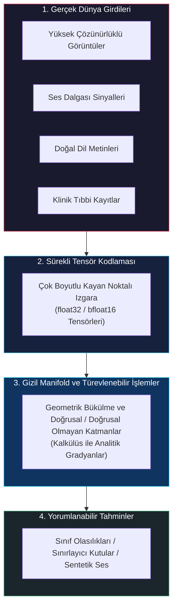

Kayan noktalı (*floating-point*) sayılar, yapay sinir ağlarının diferansiyel hesap (türev) aracılığıyla sonsuz küçük yönlü güncellemeler yapmasına olanak tanır. Bir görüntü pikselinin parlaklığı çok az değiştiğinde, modelin ürettiği kayıp değeri de sürekli bir şekilde değişir:

$$ \lim\_{\Delta x \to 0} \frac{f(x + \Delta x) - f(x)}{\Delta x} = \frac{\partial f}{\partial x} $$

Kayan noktalı sayılar gerçel sayıları ($\mathbb{R}$) temsil ettiği için gradyan inişi (*gradient descent*), milyonlarca ağırlığı yüksek boyutlu bir kayıp yüzeyinde minimum hata noktasına doğru pürüzsüzce yönlendirebilir.


<figure style="display:flex; justify-content: center; margin: 25px 0;">
  <div style="text-align: center;">
    
    <figcaption style="margin-top: 0.6em; text-align: center; font-size: 13px; color: #888;"><em>Sürekli duyusal girdilerin (piksel değerleri) yapay sinir ağı ara temsillerine ve nihai sınıf olasılık dağılımlarına dönüştürülmesi.</em></figcaption>
  </div>
</figure>

> **Anahtar İçgörü:** Derin öğrenme modelleri sürekli fonksiyon yaklaştırıcılarıdır (*continuous function approximators*). Kayan noktalı tensörler, türevlenebilir optimizasyonun üzerinde koştuğu temel zemini oluşturur.

---

## 2. Çok Boyutlu Tensörler

Matematiksel düzeyde bir skaler 0D tensör, bir vektör 1D tensör, bir matris 2D tensör ve üç veya daha fazla eksene sahip bir dizi ise N-boyutlu bir tensördür.

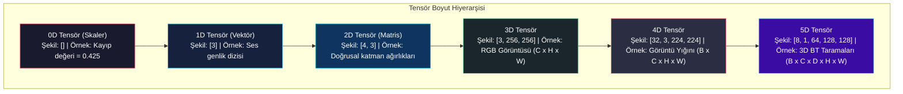


<figure style="display:flex; justify-content: center; margin: 25px 0;">
  <div style="text-align: center;">
    
    <figcaption style="margin-top: 0.6em; text-align: center; font-size: 13px; color: #888;"><em>Tensör boyut hiyerarşisi: 0D skalerler ve 1D vektörlerden 2D matrislere, 3D uzamsal ızgaralara ve N-boyutlu tensörlere geçiş.</em></figcaption>
  </div>
</figure>

### 2.1 Python Listelerinden PyTorch Tensörlerine

Neden doğrudan Python'ın yerleşik listelerini (`list`) kullanmıyoruz? Python dinamik tipli ve yorumlanan bir dildir. Standart bir Python listesinde:
1. Her bir sayı heap üzerinde tam bir `PyObject` yapısı içinde saklanır (**kutulanmış/boxed temsil**). Tek bir 64-bit tam sayı veya kayan noktalı sayı için 24–28 bayt bellek harcanır.
2. Listenin kendisi heap'e dağılmış bellek göstericilerinden (*pointers*) oluşan bir dizidir. Elemanlara erişim işaretçi takibi gerektirir ve bu durum yoğun **CPU önbellek ıskalamalarına (*cache misses*)** yol açar.
3. Python listeleri SIMD vektör yazmaçlarında veya GPU çekirdeklerinde paralel olarak yürütülemez.

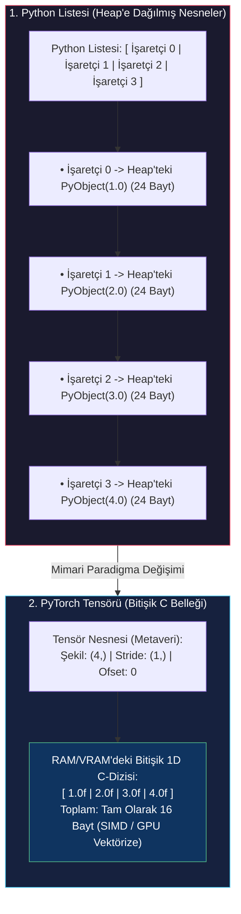


<figure style="display:flex; justify-content: center; margin: 25px 0;">
  <div style="text-align: center;">
    
    <figcaption style="margin-top: 0.6em; text-align: center; font-size: 13px; color: #888;"><em>Bellek yerleşim mimarisi: Python listelerindeki heap'e dağılmış kutulu nesneler ile PyTorch tensörlerindeki ardışık 1D C dizisi karşılaştırması.</em></figcaption>
  </div>
</figure>

Buna karşılık, bir `torch.Tensor` nesnesi C/C++ düzeyinde tahsis edilmiş bitişik bir bellek bloğunda ham ikili değerleri saklar. 1.000.000 elemanlı bir `float32` tensörü tam olarak $1{,}000{,}000 \times 4 \text{ bayt} = 4 \text{ MB}$ alan kaplar ve CPU L1/L2/L3 önbelleklerine kusursuzca sığarak AVX-512 veya CUDA çekirdekleri tarafından vektörize edilir.

### 2.2 İlk Tensörlerimizi Oluşturmak

Temel fabrika fonksiyonlarını kullanarak ilk tensörlerimizi oluşturalım. Boyutlarını, eleman sayılarını ve mertebelerini inceleyelim.

İlk olarak PyTorch'u içe aktarıp yerel bir Python listesinden 1D tensör oluşturalım:

```python
import torch

# Python listesinden 1D tensör oluşturma
a = torch.tensor([1.0, 2.0, 3.0])
print(f"Tensör a: {a}")
print(f"Şekil: {a.shape} | Eleman sayısı: {a.numel()} | Boyut mertebesi: {a.dim()}")
```

Ardından, ara Python listeleri oluşturmadan sabit değerlerle (birler, sıfırlar veya rastgele sayılar) çok boyutlu tensörler tanımlayalım:

```python
# 3 satır ve 2 sütundan oluşan 2D birler matrisi
ones_2d = torch.ones(3, 2)
print(f"2D Birler Tensörü (3x2):\n{ones_2d}")

# 4x4'lük uzamsal ızgaraya sahip 2 kanallı 3D sıfırlar tensörü
zeros_3d = torch.zeros(2, 4, 4)
print(f"3D Sıfırlar Tensörü (2x4x4) şekli: {zeros_3d.shape}")
```

---

## 3. Tensör İndeksleme ve Dilimleme

PyTorch tensörleri, NumPy dizileriyle birebir aynı olan tam Python dilimleme (*slicing*) sözdizimini destekler. Çok boyutlu dilimleme; alt bölge çıkarımı, satır/sütun seçimi ve negatif indeksleme sağlar.

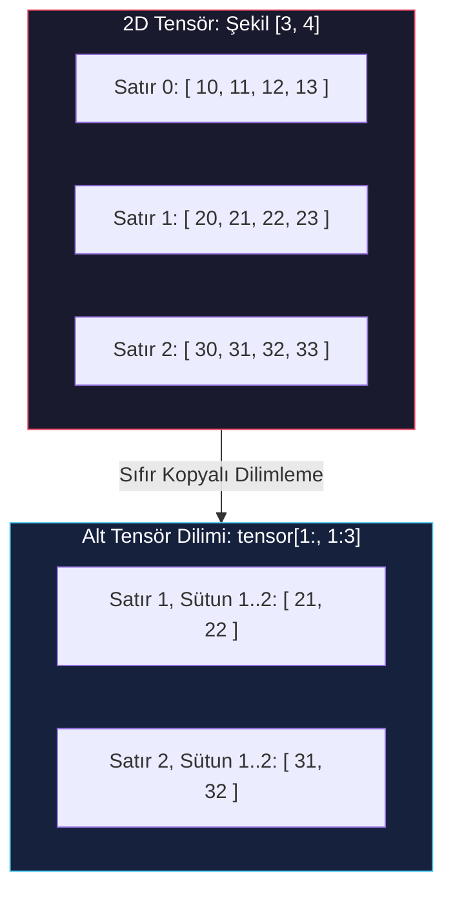

$3 \times 4$ boyutunda bir matris oluşturup çok boyutlu dilimleme ile alt tensörleri ayıralım:

```python
# 1'den 12'ye kadar ardışık değerlere sahip 3x4 tensör
grid = torch.arange(1, 13, dtype=torch.float32).reshape(3, 4)
print(f"Orijinal 3x4 ızgara:\n{grid}")

# 1. satır, 2. sütundaki skaler elemanı çıkarma
element = grid[1, 2]
print(f"Satır 1, Sütun 2 elemanı: {element.item()}")

# 0. sütunun tüm satırlarını alma (1D dilim)
first_column = grid[:, 0]
print(f"İlk sütun (tüm satırlar, sütun 0): {first_column}")

# 2x2'lik alt matris çıkarma: 1. satırdan sona, 1'den 3'e kadar olan sütunlar
sub_grid = grid[1:, 1:3]
print(f"Alt matris grid[1:, 1:3]:\n{sub_grid}")
```

---

## 4. Yayınlama (Broadcasting) Mekanizması

Farklı boyutlara sahip iki tensör arasında eleman düzeyinde (*element-wise*) aritmetik işlem yapıldığında, PyTorch otomatik olarak **broadcasting kurallarını** işletir. Broadcasting, tekil boyutları (boyutu 1 olan eksenleri) bellekte fiziksel veri kopyalaması yapmadan sanal olarak genişletir.

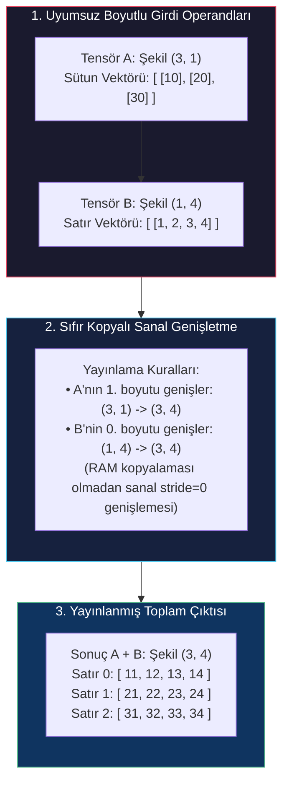

### Broadcasting'in İki Temel Kuralı:
1. **Boyut Hizalama:** Hizalama **en sağdaki (sondaki) boyuttan** başlar ve sola doğru ilerler.
2. **Uyumluluk Şartı:** İki boyut şu durumlarda uyumludur:
   - Boyut değerleri birbirine eşitse, veya
   - Boyutlardan biri $1$'e eşitse, veya
   - Boyutlardan biri mevcut değilse (sanal olarak boyutu $1$ kabul edilir).

Broadcasting mekanizmasını kod üzerinde gözlemleyelim:

```python
# (3, 1) boyutunda sütun vektörü
col_vector = torch.tensor([[10.0], [20.0], [30.0]])
print(f"col_vector şekli: {col_vector.shape}")

# (1, 4) boyutunda satır vektörü
row_vector = torch.tensor([[1.0, 2.0, 3.0, 4.0]])
print(f"row_vector şekli: {row_vector.shape}")

# Sıfır bellek çoğaltmasıyla (3, 4) matris toplamı
broadcasted_sum = col_vector + row_vector
print(f"Yayınlama sonucu şekli: {broadcasted_sum.shape}")
print(f"Yayınlama sonucu değerleri:\n{broadcasted_sum}")
```

---

## 5. İsimlendirilmiş Tensörler ve Modern Boyut Yönetimi (`einops`)

4D veya 5D tensörlerin kullanıldığı üretim boru hatlarında (örneğin Bilgisayarlı Görüde `[Batch, Channel, Height, Width]` veya Transformer'larda `[Batch, Sequence, Heads, HeadDim]`), konumsal tam sayılarla indeksleme yapmak (örneğin `x.transpose(1, 2)`) eksenlerin karışmasına ve sessiz hatalara yol açabilir.

PyTorch, boyutlara açık dizge etiketleri atamaya izin veren **İsimlendirilmiş Tensörler (*Named Tensors*)** yapısını deneysel bir özellik olarak sunmuştur:

```python
# Açık boyut isimleriyle 4D tensör oluşturma (Deneysel PyTorch API)
images = torch.zeros(2, 3, 28, 28, names=('batch', 'channels', 'rows', 'cols'))
print(f"İsimlendirilmiş Tensör boyutları: {images.names}")

# align_to ile sayısal indeks ezberlemeden boyutları yeniden sıralama
reordered_images = images.align_to('batch', 'rows', 'cols', 'channels')
print(f"Yeniden sıralanmış tensör boyutları: {reordered_images.names}")
print(f"Yeniden sıralanmış tensör şekli: {reordered_images.shape}")
```

### 5.1 Modern Endüstri Standardı: `einops`

PyTorch'un yerel isimlendirilmiş tensörleri güçlü bir konsept sunsa da deneysel aşamada kalmış ve sınırlı operatör desteği nedeniyle geniş çapta benimsenmemiştir. Modern derin öğrenmede (PyTorch 2.x+) ve günümüz Vision Transformer / LLM kod tabanlarında boyut manipülasyonunun fiili endüstri standardı **`einops`** kütüphanesidir (`from einops import rearrange, reduce, repeat`).

`einops`, tensör boyutlarını açıkça belirten ve yeniden düzenleyen bildirimsel (*declarative*) bir sözdizimi sunar:

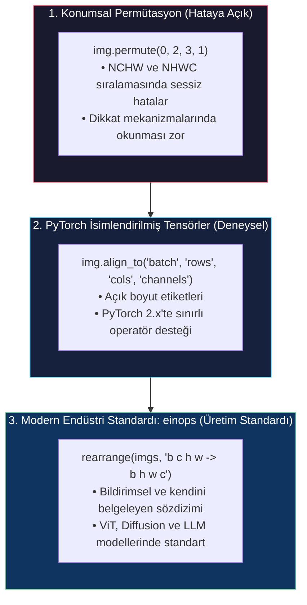

`einops` ile tensör boyutlarını yeniden düzenleyelim:

```python
# %pip install einops
import torch
from einops import rearrange

# 1. Tensörü oluştur (NCHW)
imgs = torch.randn(2, 3, 28, 28)

# 2. Önce isimleri belirt, sonra hedef sıralamaya çevir (NCHW -> NHWC)
imgs_reordered = rearrange(imgs, 'batch channels rows cols -> batch rows cols channels')

print("Orijinal Şekil :", imgs.shape)          # torch.Size([2, 3, 28, 28])
print("Yeniden Sıralı :", imgs_reordered.shape)  # torch.Size([2, 28, 28, 3])
```

---

## 6. Tensör Veri Tipleri (`dtype`) (`dtype`)

Bir tensörün sayısal temsili **`dtype`** (veri tipi) ile belirlenir. Doğru veri tipini seçmek; matematiksel hassasiyet, bellek tüketimi ve GPU işlem hızı arasındaki dengeyi kurmak açısından kritiktir.

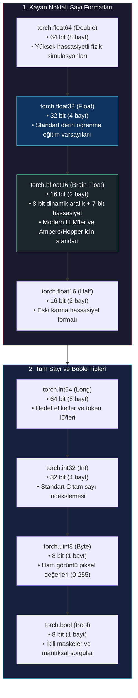

### 6.1 Hassasiyet Karşılaştırma Tablosu

| Veri Tipi | PyTorch Tip İsmi | Bayt Boyutu | Dinamik Aralık (Üs/Exponent) | Sayısal Hassasiyet (Mantissa) | Tipik Kullanım Alanı |
| :--- | :--- | :--- | :--- | :--- | :--- |
| **Double** | `torch.float64` / `torch.double` | 8 bayt (64 bit) | 11 bit | 52 bit | Yüksek hassasiyetli fizik ve diferansiyel denklemler |
| **Float** | `torch.float32` / `torch.float` | 4 bayt (32 bit) | 8 bit | 23 bit | Standart model eğitimi |
| **Bfloat16** | `torch.bfloat16` | 2 bayt (16 bit) | 8 bit (fp32 ile aynı) | 7 bit | Modern LLM / Transformer karma hassasiyet eğitimi |
| **Half** | `torch.float16` / `torch.half` | 2 bayt (16 bit) | 5 bit | 10 bit | Eski GPU'larda karma hassasiyet (loss scaling gerekir) |
| **Long** | `torch.int64` / `torch.long` | 8 bayt (64 bit) | Yok | Yok | Hedef etiketler, embedding arama indeksleri |
| **Byte** | `torch.uint8` | 1 bayt (8 bit) | Yok | Yok | Ham görüntü veri setleri ($0 \dots 255$) |

### 6.2 `dtype` Dönüşümleri ve Yönetimi

Varsayılan `dtype` yapısını inceleyelim ve `.to()` fonksiyonuyla tipler arası dönüşüm yapalım:

```python
# Varsayılan kayan noktalı sayı tensörü float32 tipindedir
default_float = torch.tensor([1.0, 2.0, 3.0])
print(f"Varsayılan float dtype: {default_float.dtype}")

# Yüksek verimli eğitim için bfloat16'ya dönüştürme
bf16_tensor = default_float.to(dtype=torch.bfloat16)
print(f"bfloat16 dönüşümü: {bf16_tensor.dtype} | Eleman boyutu: {bf16_tensor.element_size()} bayt")

# Sınıflandırma etiketleri için int64 dönüşümü
int_labels = torch.tensor([0, 2, 1], dtype=torch.int64)
print(f"Sınıflandırma etiketleri dtype: {int_labels.dtype}")
```

---

## 7. Tensör API'si ve Operasyon Semantiği

PyTorch Tensör API'si; matematiksel fonksiyonlar, lineer cebir rutinleri ve şekil indirgemeleri dahil yüzlerce operatör barındırır.


<figure style="display:flex; justify-content: center; margin: 25px 0;">
  <div style="text-align: center;">
    
    <figcaption style="margin-top: 0.6em; text-align: center; font-size: 13px; color: #888;"><em>PyTorch Dağıtıcı (Dispatcher) mimarisi: tensör operasyonlarının cihaz, bellek düzeni ve veri tipine göre özelleşmiş C++/CUDA çekirdeklerine dinamik yönlendirilmesi.</em></figcaption>
  </div>
</figure>

### 7.1 Matematiksel Fonksiyonlar ve Boyut İndirgemeleri

Çoğu matematiksel işlem (`torch.sin`, `torch.exp`, `torch.sqrt` vb.) eleman düzeyinde çalışır. `torch.mean` ve `torch.sum` gibi indirgeme operasyonları ise `dim` parametresi kullanılarak belirli eksenler boyunca uygulanır.

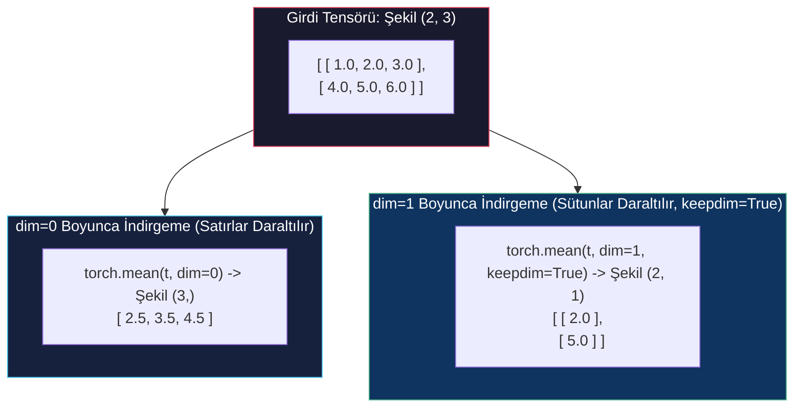

Boyut indirgemelerini kodlayalım:

```python
# 2x3 matris oluşturma
matrix = torch.tensor([[1.0, 2.0, 3.0], [4.0, 5.0, 6.0]])

# Boyut 0 boyunca indirgeme (satırları daraltarak sütun ortalamasını alma)
mean_dim0 = torch.mean(matrix, dim=0)
print(f"dim=0 ortalaması: {mean_dim0} | Şekil: {mean_dim0.shape}")

# Boyut 1 boyunca keepdim=True ile indirgeme (2D mertebeyi koruma)
mean_dim1_kept = torch.mean(matrix, dim=1, keepdim=True)
print(f"dim=1 ortalaması (keepdim=True):\n{mean_dim1_kept} | Şekil: {mean_dim1_kept.shape}")
```

### 7.2 Yerinde İşlemler (*In-Place Operations*, `_` Son Eki)

PyTorch'ta sonu alt çizgi ile biten tüm operasyonlar (`.zero_()`, `.add_()`, `.mul_()`, `.copy_()`), yeni bir tensör tahsis etmek yerine mevcut tensörün belleğini **yerinde (*in-place*)** günceller.

> [!WARNING]
> **Autograd Yerinde Değişiklik Güvenlik Kuralı:** Yerinde işlemler doğrudan bellek buffer'ını değiştirir. Eğer yapılan değişiklik geriye yayılım (*backward pass*) sırasında gradyan hesaplamak için gereken bir tensör değerini ezerse, PyTorch'un Autograd motoru çalışma zamanı hatası fırlatır. Türevlenebilir hesaplama çizgelerinde yerinde işlemleri dikkatle kullanın.

```python
# Tensör oluşturma ve değerlerini yerinde değiştirme
x = torch.ones(2, 2)
print(f"Orijinal x:\n{x}")

# Her elemana yerinde 5 ekleme
x.add_(5.0)
print(f"x.add_(5.0) sonrası x:\n{x}")

# Tensörü yerinde sıfırlama
x.zero_()
print(f"x.zero_() sonrası x:\n{x}")
```

---

## 8. Bellek Temsili (Storage Buffers)

PyTorch performansına hakim olmak için belleğin fiziksel olarak nasıl yapılandığını anlamak gerekir. Bir `torch.Tensor`, özünde metaverileri (`shape`, `stride`, `storage_offset`, `dtype`, `device`) barındıran hafif bir **görünüm nesnesidir (*view object*)** ve arka planda tek boyutlu ardışık bir bellek dizisine (**`Storage`**) işaret eder.

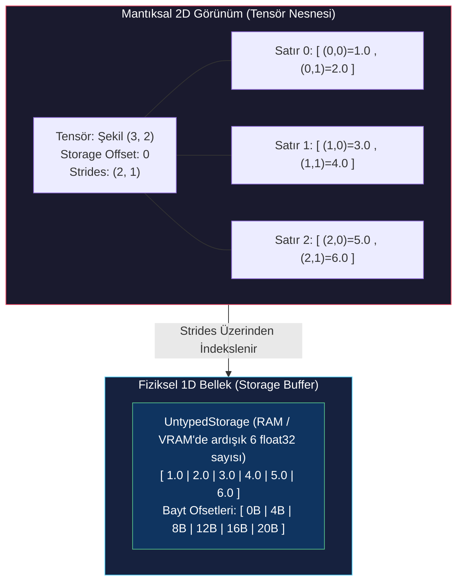


<figure style="display:flex; justify-content: center; margin: 25px 0;">
  <div style="text-align: center;">
    
    <figcaption style="margin-top: 0.6em; text-align: center; font-size: 13px; color: #888;"><em>Farklı şekillere sahip birden çok mantıksal tensör görünümünün, bellekteki aynı tek boyutlu fiziksel Storage buffer'ını ortaklaşa kullanması.</em></figcaption>
  </div>
</figure>

### 8.1 1D Fiziksel Storage'ı İnceleme (PyTorch 2.x'te `UntypedStorage`)

2D bir tensörün temelindeki 1D storage alanına `.untyped_storage()` ile erişelim:

```python
# (3, 2) boyutunda 2D tensör oluşturma
points = torch.tensor([[1.0, 2.0], [3.0, 4.0], [5.0, 6.0]])
print(f"Tensör points (3x2):
{points}")

# Fiziksel 1D depolama alanına erişim
points_storage = points.untyped_storage()
print(f"Fiziksel 1D Storage boyutu: {len(points_storage)} bayt")
print(f"Storage ham bayt içeriği: {[points_storage[i] for i in range(len(points_storage))]}")
```

> [!NOTE]
> **PyTorch 2.x `UntypedStorage` Mimarisi:**  
> Eski PyTorch sürümlerinde `points.storage()` tipi olan bir depolama (örneğin `FloatStorage`) döndürürdü. Modern PyTorch 2.x ile gelen `untyped_storage()` doğrudan ham bayt dizisi (`raw bytes / uint8`) tutar. Bu nedenle `len(points_storage)` değeri eleman sayısını değil, **toplam bayt sayısını** ($6 \text{ float} \times 4 \text{ bayt} = 24 \text{ bayt}$) verir.

### 8.2 Storage'ı Değiştirmek Tüm Görünümleri Etkiler

Birden fazla tensör görünümü tam olarak aynı fiziksel storage buffer'ına işaret edebileceğinden, storage üzerinde veya bir görünüm üzerinden yapılan değişiklik o belleği paylaşan diğer tüm tensörlerde anında görülür.

Modern PyTorch'ta `UntypedStorage` doğrudan ham bayt tuttuğu için doğrudan depolama indeksine float ataması yapılamaz ($0 \dots 255$ arası bir tamsayı/bayt beklenir). Tensör görünümü üzerinden yapılan atamalar ise storage'daki float bitlerini günceller ve tüm görünümlere anında yansır:

```python
# 1. Depolama baytını doğrudan değiştirme (PyTorch 2.x'te 0-255 arası int bayt olmalıdır)
points_storage[0] = 99

# 2. Veya tensör görünümü üzerinden kayan noktalı (float) değiştirme
points[0, 0] = 99.0

# 2D tensör görünümü bu değişikliği anında yansıtır
print(f"Storage değiştikten sonra points tensörü:
{points}")
```

---

## 9. Stride Matematiği ve Bellek Bitişikliği ve Bellek Bitişikliği

PyTorch, çok boyutlu bir koordinatı $(i\_0, i\_1, \dots, i\_{n-1})$ tek boyutlu düz storage indeksine nasıl dönüştürür? Bunun için **adım (stride) doğrusal haritalama denklemini** hesaplar:

$$ \text{Fiziksel Storage Ofseti} = \text{storage\\_offset} + \sum\_{k=0}^{n-1} i\_k \cdot \text{stride}[k] $$

Burada:
- $\text{storage\\_offset}$: Tensörün ilk elemanının $(0, 0, \dots, 0)$ 1D storage içindeki başlangıç indeksidir.
- $\text{stride}[k]$: $k$ boyutunda 1 birim ilerlemek için 1D bellekte kaç eleman atlanması gerektiğini belirtir.

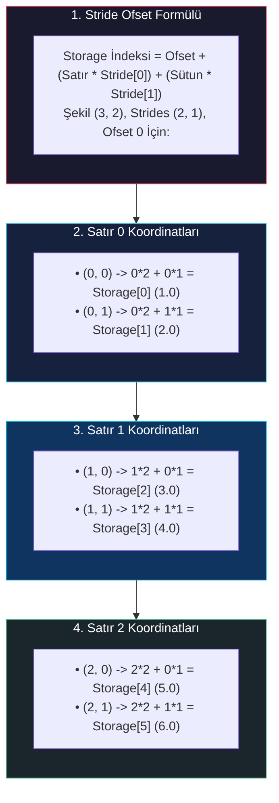


<figure style="display:flex; justify-content: center; margin: 25px 0;">
  <div style="text-align: center;">
    
    <figcaption style="margin-top: 0.6em; text-align: center; font-size: 13px; color: #888;"><em>Tensör metaveri anatomisi: storage ofseti ve satır/sütun adımları (strides) aracılığıyla 2D matris koordinatlarının 1D fiziksel storage indeksine haritalanması.</em></figcaption>
  </div>
</figure>

### 9.1 Dilimleme ile Alt Tensör Görünümleri (Sıfır Bellek Tahsisi)

Bir tensörü dilimlediğimizde (`second_point = points[1]`), PyTorch yeni bir bellek alanı ayırmaz ve veri kopyalamaz. Yalnızca güncellenmiş bir `storage_offset` değerine sahip yeni bir `torch.Tensor` başlık nesnesi oluşturur:

```python
# points tensörünü oluşturma
points = torch.tensor([[1.0, 2.0], [3.0, 4.0], [5.0, 6.0]])

# 2. satırı alma (indeks 1)
second_point = points[1]

print(f"second_point değerleri: {second_point}")
print(f"second_point şekli: {second_point.shape}")
print(f"second_point storage_offset: {second_point.storage_offset()}")
print(f"second_point stride: {second_point.stride()}")

# Ortak bellek işaretçisini doğrulama
print(f"Bellek paylaşıldı mı? {points.untyped_storage().data_ptr() == second_point.untyped_storage().data_ptr()}")
```

### 9.2 Kopyalamadan Transpoz Alma (Sıfır Kopyalı Transpoz)

$(M, N)$ boyutundaki bir 2D matrisin transpozunu almak için PyTorch bellekteki sayıların yerini **değiştirmez**. Yalnızca 0. boyut ile 1. boyutun **adımlarını (*strides*) takas eder**:

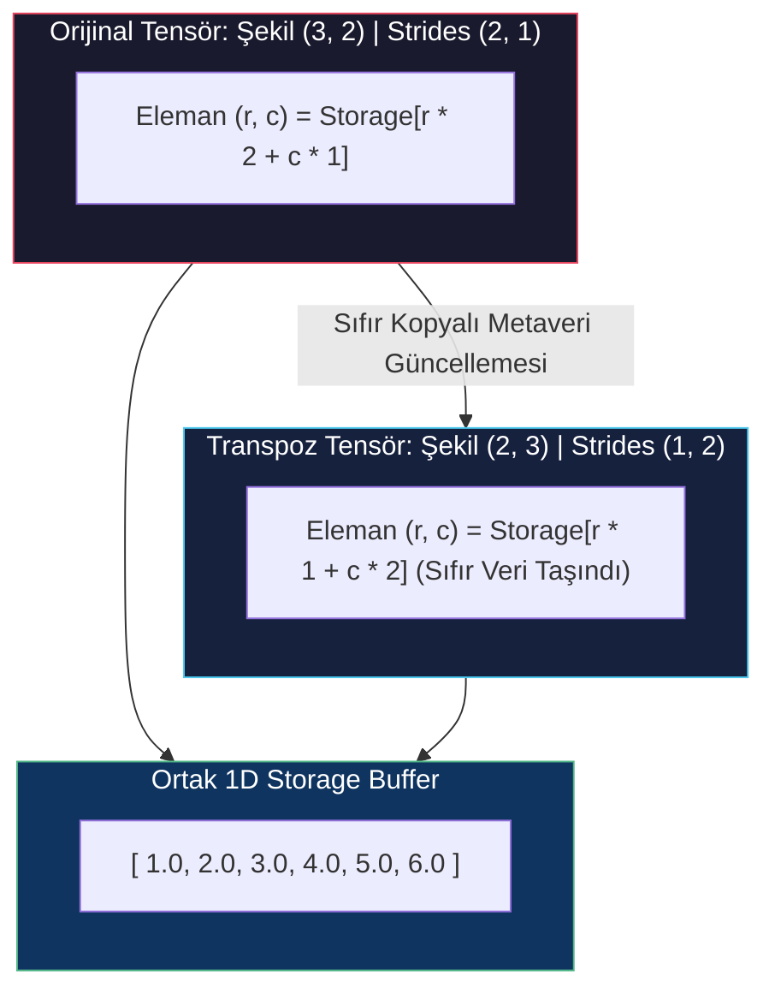


<figure style="display:flex; justify-content: center; margin: 25px 0;">
  <div style="text-align: center;">
    
    <figcaption style="margin-top: 0.6em; text-align: center; font-size: 13px; color: #888;"><em>Sıfır kopyalı matris transpozu: adım (stride) boyutlarının takas edilmesi sayesinde fiziksel bellek kopyalanmadan satır ve sütun düzeninin yeniden yorumlanması.</em></figcaption>
  </div>
</figure>

Transpoz adımlarını Python'da doğrulayalım:

```python
# Orijinal 3x2 tensör
points = torch.tensor([[1.0, 2.0], [3.0, 4.0], [5.0, 6.0]])
print(f"points şekli: {points.shape} | stride: {points.stride()}")

# 2D tensörün transpozunu alma
points_t = points.t()
print(f"points_t şekli: {points_t.shape} | stride: {points_t.stride()}")
print(f"points_t değerleri:\n{points_t}")

# Bellek gösterici adresinin aynı olduğunu doğrulama
print(f"Ortak bellek adresi: {points.data_ptr() == points_t.data_ptr()}")
```

### 9.3 Yüksek Boyutlu Transpoz (`.permute()` ve `.transpose()`)

3 veya daha fazla boyuta sahip tensörlerde `torch.transpose` belirtilen iki boyutu takas ederken, `.permute()` tüm eksenleri aynı anda yeniden sıralar:

```python
# (2, 3, 4) boyutunda 3D tensör
tensor_3d = torch.zeros(2, 3, 4)
print(f"tensor_3d şekli: {tensor_3d.shape} | stride: {tensor_3d.stride()}")

# Boyutları (4, 2, 3) olarak permüte etme
permuted_3d = tensor_3d.permute(2, 0, 1)
print(f"permuted_3d şekli: {permuted_3d.shape} | stride: {permuted_3d.stride()}")
```

### 9.4 Bellek Bitişikliği (*Contiguity*, `.is_contiguous()` ve `.contiguous()`)

Bir tensör; ardışık indeks sırasına göre gezildiğinde fiziksel 1D bellekteki elemanlara hiçbir atlama olmadan $0, 1, 2, \dots$ sırasında ulaşıyorsa **C-bitişik (*C-contiguous*, row-major)** olarak adlandırılır.

Bir tensörün transpozu alındığında adımları yer değiştirdiği için bellek yerleşimi **bitişik olmayan (*non-contiguous*)** hale gelir. `.view()` gibi yüksek başarımlı birçok operasyon bitişik bellek düzeni gerektirir.

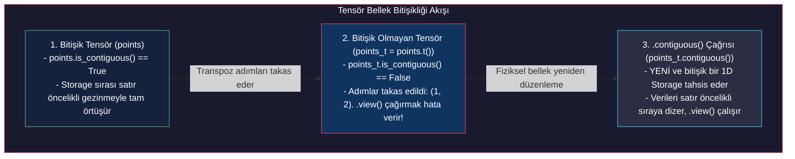

Bitişikliği kod ile inceleyelim:

```python
# Orijinal ve transpoz tensörlerin bitişikliğini kontrol etme
print(f"points.is_contiguous(): {points.is_contiguous()}")
print(f"points_t.is_contiguous(): {points_t.is_contiguous()}")

# Bitişik olmayan tensörde .view() çağırmak hata verir
try:
    points_t.view(6)
except RuntimeError as e:
    print(f"Bitişik olmayan tensörde view hatası: {e}")

# .contiguous() ile verileri yeni ve bitişik bir storage'a kopyalama
points_t_cont = points_t.contiguous()
print(f"points_t_cont.is_contiguous(): {points_t_cont.is_contiguous()}")
print(f"points_t_cont stride: {points_t_cont.stride()}")
print(f"points_t_cont.view(6) başarıyla çalıştı: {points_t_cont.view(6)}")
```

---

## 10. `as_strided` ile Düşük Seviyeli Bellek Manipülasyonu

Konvolüsyonel kayar pencereler (*sliding windows*) veya görüntü yama çıkarımı gibi özel düşük seviyeli işlemler için `torch.as_strided()` fonksiyonu; `size`, `stride` ve `storage_offset` parametrelerini doğrudan belirleyerek özel tensör görünümleri oluşturmayı sağlar.

```python
# 1D temel tensör
base = torch.arange(10, dtype=torch.float32)
print(f"Temel 1D tensör: {base}")

# (7, 4) şeklinde ve (1, 1) adımlı kayar pencere görünümü oluşturma
# 10 eleman üzerinde pencere boyutu = 4, kayma adımı = 1 -> 7 pencere
sliding_windows = base.as_strided(size=(7, 4), stride=(1, 1), storage_offset=0)
print(f"Kayar pencere görünümü (sıfır kopyalama!):\n{sliding_windows}")
```

---

## 11. Tensörleri GPU'ya Taşıma

PyTorch tensör hesaplamalarını donanım hızlandırıcıları (NVIDIA CUDA GPU'lar, Apple MPS, AMD ROCm) üzerinde koşturabilir. Bir tensörün konumu `device` özniteliği ile yönetilir.

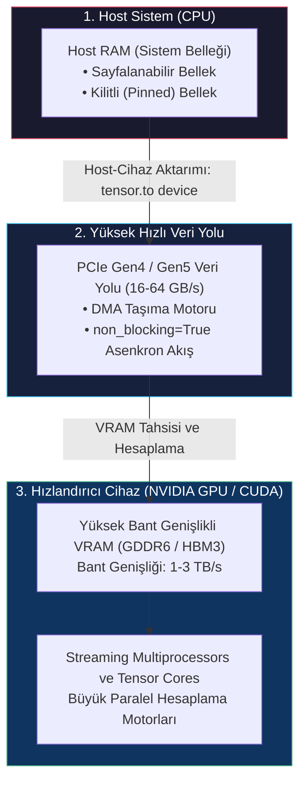

### 11.1 `device` Özniteliğini Yönetme

Donanım hızlandırıcısını dinamik olarak seçelim ve tensörü doğrudan cihazda çalıştıralım:

```python
# Cihazı dinamik olarak belirleme
device = torch.device('cuda' if torch.cuda.is_available() else 'cpu')
print(f"Seçilen hesaplama cihazı: {device}")

# CPU tensörünü GPU'ya taşıma
cpu_tensor = torch.ones(3, 3)
gpu_tensor = cpu_tensor.to(device=device)
print(f"Tensör cihazı: {gpu_tensor.device}")

# Doğrudan GPU üzerinde matematiksel işlem yapma
gpu_result = 2.0 * gpu_tensor + 1.0
print(f"GPU sonuç cihazı: {gpu_result.device}")
```

> [!IMPORTANT]
> **Cihaz Eşleşme Kısıtı:** Farklı cihazlarda bulunan tensörler arasında işlem yapmak (örneğin CPU tensörü ile GPU tensörünü toplamak) kural dışıdır ve `RuntimeError: Expected all tensors to be on the same device` hatası verir. Girdi verilerini ve model parametrelerini her zaman aynı cihaza taşıyın.

---

## 12. NumPy ile Birlikte Çalışabilirlik

PyTorch, CPU üzerindeki NumPy dizileriyle **sıfır kopyalı (*zero-copy*)** çift yönlü entegrasyon sunar. PyTorch CPU tensörleri ve NumPy dizileri C düzeyinde aynı ardışık bellek adresini paylaştığı için birbirlerine dönüştürülmelerinin bellek maliyeti sıfırdır.

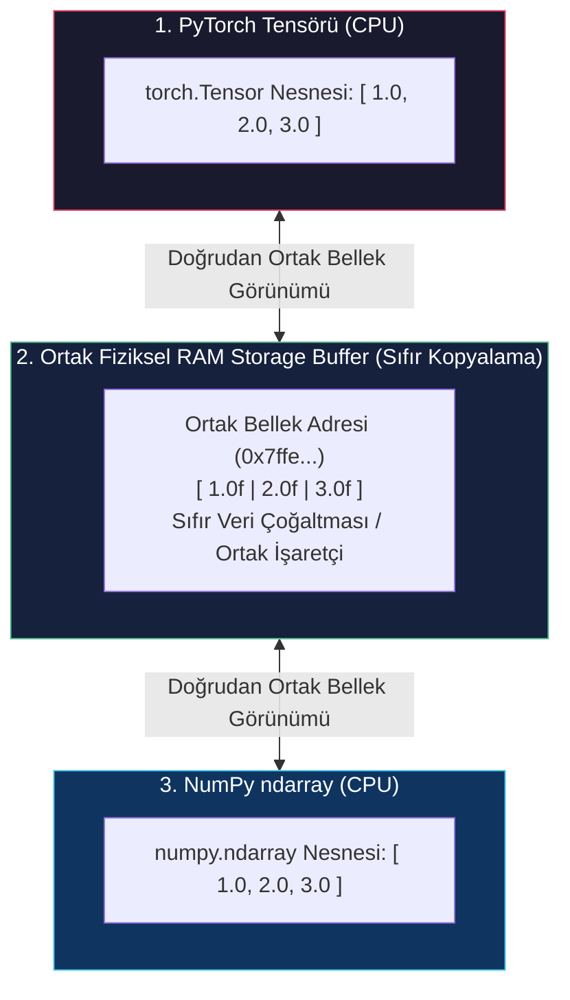

Sıfır kopyalı bellek paylaşımını test edelim:

```python
import numpy as np

# PyTorch tensörünü NumPy dizisine dönüştürme
torch_orig = torch.ones(3, dtype=torch.float32)
numpy_view = torch_orig.numpy()
print(f"NumPy görünümü: {numpy_view}")

# PyTorch tensörünü yerinde değiştirme
torch_orig.add_(10.0)

# NumPy görünümü değişikliği anında yansıtır
print(f"PyTorch mutasyonu sonrası NumPy görünümü: {numpy_view}")

# torch.from_numpy ile NumPy dizisini PyTorch tensörüne dönüştürme
np_arr = np.array([5.0, 6.0, 7.0], dtype=np.float32)
torch_from_np = torch.from_numpy(np_arr)
print(f"NumPy'dan dönüştürülen PyTorch tensörü: {torch_from_np}")
```

---

## 13. Genelleştirilmiş Tensörler

Modern PyTorch; yoğun adımlı standart tensör yapısını bellek sıkıştırması ve düzensiz veri yapıları için geliştirilmiş genelleştirilmiş tensör türleriyle zenginleştirmiştir:

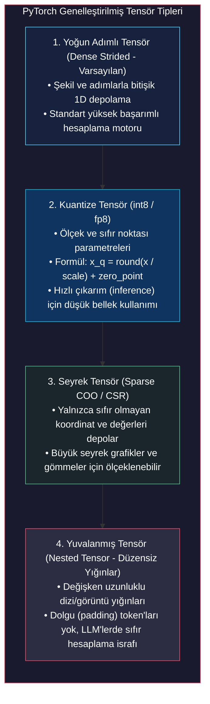

Yalnızca 3 adet sıfır dışı elemanı olan $1000 \times 1000$'lik bir seyrek koordinat (COO) tensörü tanımlayalım:

```python
# Sıfır olmayan elemanların koordinatları: (0, 2), (1, 0), (2, 1)
indices = torch.tensor([[0, 1, 2], [2, 0, 1]], dtype=torch.int64)
values = torch.tensor([3.0, 4.0, 5.0], dtype=torch.float32)

# 1000x1000 seyrek tensör oluşturma
sparse_tensor = torch.sparse_coo_tensor(indices, values, (1000, 1000))
print(f"Seyrek tensördeki sıfır dışı eleman sayısı: {sparse_tensor._nnz()}")
print(f"Seyrek tensör şekli: {sparse_tensor.shape}")
```

---

## 14. Tensör Serileştirme ve Depolama

Eğitilmiş model ağırlıklarını, gömme matrislerini ve ara tensör temsillerini diske kaydetmek derin öğrenme sistemlerinin temel gereksinimidir.

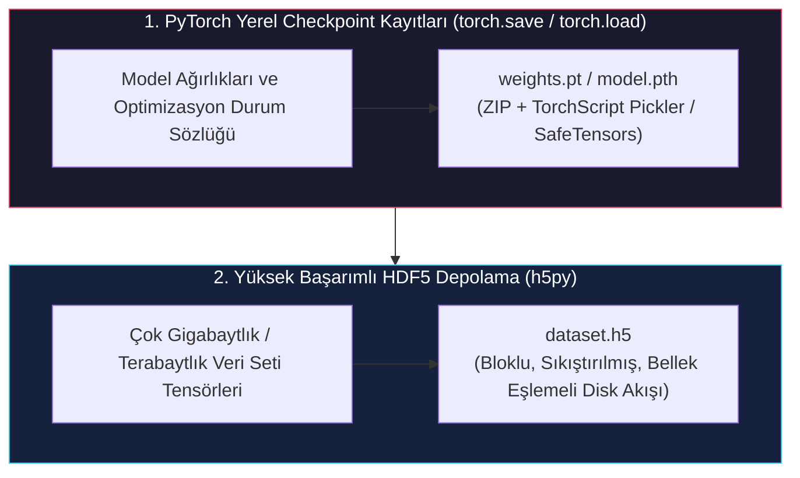

### 14.1 PyTorch Yerel Serileştirme (`torch.save` ve `torch.load`)

Bir tensör sözlüğünü kaydedip `weights_only=True` ile güvenli şekilde geri yükleyelim:

```python
import os

# Örnek durum sözlüğü (state dictionary)
checkpoint = {
    'model_weights': torch.randn(4, 4),
    'epoch': 10,
    'learning_rate': 1e-3
}

# Checkpoint'i diske kaydetme
torch.save(checkpoint, 'checkpoint.pt')

# Checkpoint'i güvenli şekilde yükleme (kod enjeksiyonunu engeller)
loaded_checkpoint = torch.load('checkpoint.pt', weights_only=True)
print(f"Yüklenen anahtarlar: {list(loaded_checkpoint.keys())}")
print(f"Yüklenen ağırlıkların şekli: {loaded_checkpoint['model_weights'].shape}")

# Geçici dosyayı temizleme
if os.path.exists('checkpoint.pt'):
    os.remove('checkpoint.pt')
```

### 14.2 Yüksek Başarımlı HDF5 Depolama (`h5py`)

Çok terabaytlık bilimsel veri setlerinde (örneğin 3D tıbbi BT taramaları) standart pickling yetersiz kalır. **HDF5** ikili formatı, tüm veri setini RAM'e yüklemeden doğrudan disk üzerinden bellek eşlemeli (*memory-mapped*) ve bloklu erişim sağlar:

```python
import h5py

# Tensör verisini doğrudan HDF5 ikili kabına yazma
tensor_to_save = torch.arange(100, dtype=torch.float32).reshape(10, 10)

with h5py.File('dataset_sample.h5', 'w') as h5f:
    h5f.create_dataset('features', data=tensor_to_save.numpy())

# Dosyanın tamamını RAM'e almadan yalnızca belirli dilimleri okuma
with h5py.File('dataset_sample.h5', 'r') as h5f:
    hdf5_data = h5f['features']
    # Yalnızca 2'den 5'e kadar olan satırları PyTorch'a yükleme
    sub_tensor = torch.from_numpy(hdf5_data[2:5, :])
    print(f"Yüklenen HDF5 alt tensör şekli: {sub_tensor.shape}")

# Geçici dosyayı temizleme
if os.path.exists('dataset_sample.h5'):
    os.remove('dataset_sample.h5')
```

---

## 15. Bölüm Çözümleri ve Analitik Alıştırmalar

Tensör depolama, adımlar ve bellek yerleşimleri konusundaki sezgiyi pekiştirmek için *Deep Learning with PyTorch (2nd Edition)* kitabının *Bölüm 3.15* resmi alıştırmalarını çözelim.

### Alıştırma 1: Storage, Görünümler ve Ofset Analizi

**Görev 1.a:** `a = torch.tensor(list(range(9)))` tensörünü oluşturun. Boyutunu, storage ofsetini ve adımlarını tahmin edip doğrulayın. Ardından `b = a.view(3, 3)` oluşturun ve `a` ile `b`'nin aynı depolama alanını paylaşıp paylaşmadığını kontrol edin.

```python
# 9 elemanlı 1D tensör
a = torch.tensor(list(range(9)))
print(f"Tensör a: boyut={a.size()}, ofset={a.storage_offset()}, stride={a.stride()}")

# view ile 3x3 matrise yeniden şekillendirme
b = a.view(3, 3)
print(f"Tensör b: boyut={b.size()}, ofset={b.storage_offset()}, stride={b.stride()}")

# Ortak bellek kontrolü
print(f"a ve b aynı bellek adresini mi paylaşıyor? {a.untyped_storage().data_ptr() == b.untyped_storage().data_ptr()}")
```

**Görev 1.b:** `c = b[1:, 1:]` alt tensörünü oluşturun. Boyutunu, storage ofsetini ve adımlarını tahmin edip doğrulayın.

```python
# 1. satır ve 1. sütundan başlayan alt matris dilimi
c = b[1:, 1:]
print(f"Tensör c:\n{c}")
print(f"Tensör c: boyut={c.size()}, ofset={c.storage_offset()}, stride={c.stride()}")
```

*Matematiksel Doğrulama:*
- `c` tensörünün $(0, 0)$ elemanı `b[1, 1]` elemanına denk gelir. Bu eleman orijinal 1D storage içinde $1 \times 3 + 1 = 4$ indeksindedir. Dolayısıyla $\text{storage\\_offset} = 4$'tür.
- Şekil $(2, 2)$ ve adımlar $(3, 1)$ olarak kalır.

---

### Alıştırma 2: Matematiksel Operasyonlar ve Yerinde Dönüşümler

**Görev 2:** Karekök veya kosinüs gibi bir matematiksel fonksiyon seçin. PyTorch'ta bu fonksiyonun yerinde (*in-place*) versiyonunu test edin ve gerekli tip dönüşümlerini inceleyin.

```python
# Tam sayı tensörü oluşturma
int_tensor = torch.tensor([1, 4, 9, 16], dtype=torch.int32)

# Tam sayı tensöründe yerinde sqrt_() çalıştırmak RuntimeError fırlatır
try:
    int_tensor.sqrt_()
except RuntimeError as e:
    print(f"Tam sayı tensöründe beklenen hata: {e}")

# İşlem öncesi float32'ye dönüştürme
float_tensor = int_tensor.to(dtype=torch.float32)
float_tensor.sqrt_()
print(f"Float tensöründe başarılı yerinde karekök: {float_tensor}")
```

---

## 16. Özet ve Temel Mimari Çıkarımlar

1. **Sürekli Tensör Temsili:** Derin öğrenme modelleri, analitik gradyanları hesaplayabilmek ve kayıp yüzeylerini optimize edebilmek için sürekli kayan noktalı vektör uzaylarına (`float32`, `bfloat16`) ihtiyaç duyar.
2. **Fiziksel Storage ve Mantıksal Görünüm:** PyTorch, çok boyutlu indeksleme görünümünü fiziksel 1D ardışık bellek buffer'ından (`torch.Storage`) ayırır.
3. **Stride İndeksleme Denklemi:** Bellek konumları $\text{Offset} = \text{storage\\_offset} + \sum\_{k=0}^{n-1} i\_k \cdot \text{stride}[k]$ ile hesaplanır. Dilimleme, transpoz ve permütasyon işlemleri yalnızca metaveriyi günceller ve **sıfır veri kopyalaması** yapar.
4. **Bitişiklik ve Yeniden Sıralama:** Transpoz işlemleri adımların yerini değiştirerek tensörü bitişik olmayan hale getirir. `.view()` gibi yüksek başarımlı işlemler için `.contiguous()` çağrılarak elemanlar sıralı yeni bir storage'a kopyalanmalıdır.
5. **Sıfır Kopyalı NumPy Entegrasyonu:** PyTorch ve NumPy, CPU bellek göstericilerini `torch.from_numpy` ve `.numpy()` aracılığıyla doğrudan ortaklaşa kullanır.
6. **Cihaz Bellek Hiyerarşisi:** PCIe veri yolu üzerinden CPU RAM ile GPU VRAM arasında veri taşımak derin öğrenme boru hatlarında ana darboğazdır. Bant genişliğini doyurmak için kilitli (*pinned*) bellek ve yığın işlem stratejileri kullanılmalıdır.
