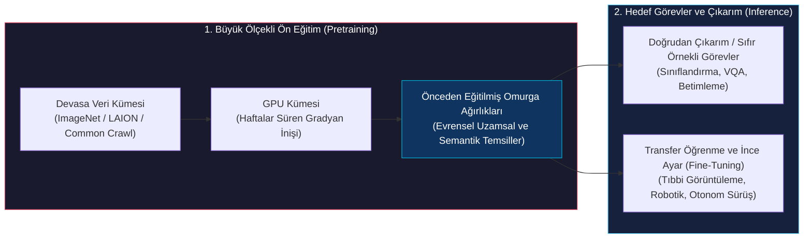
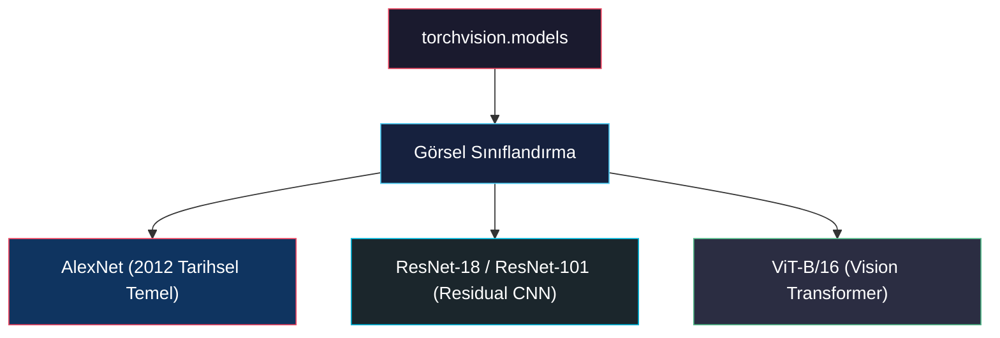
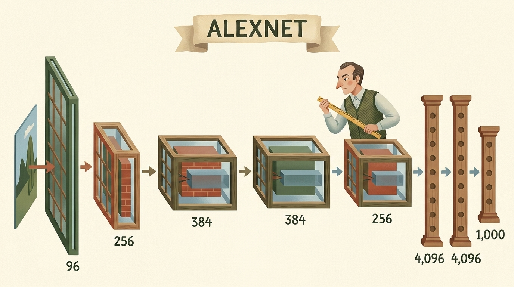
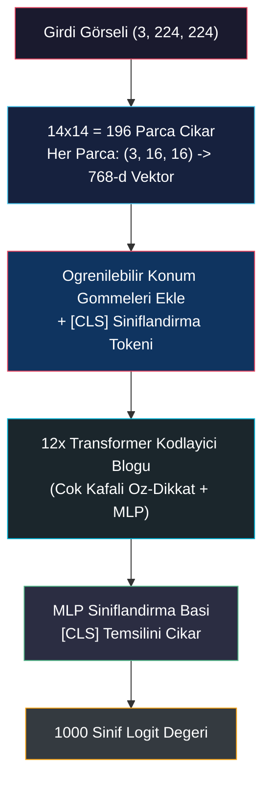
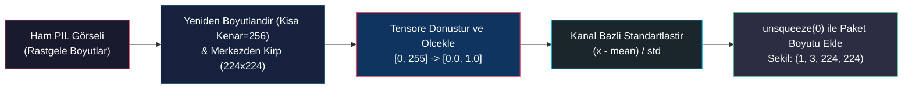
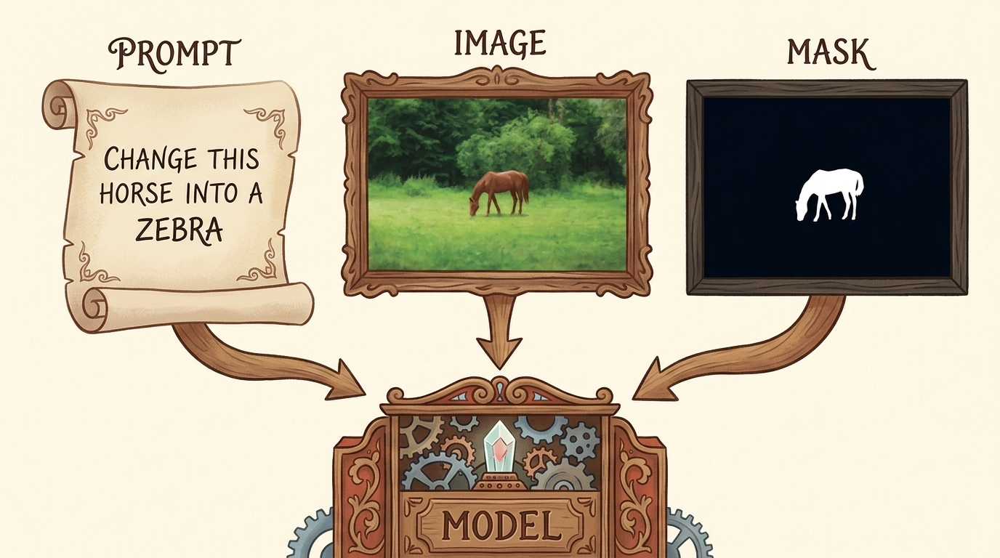
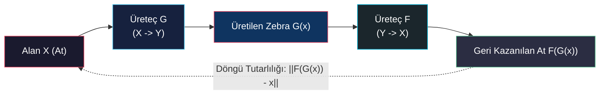
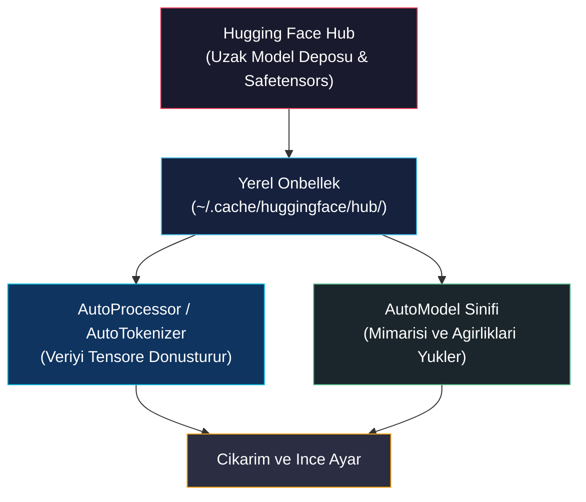
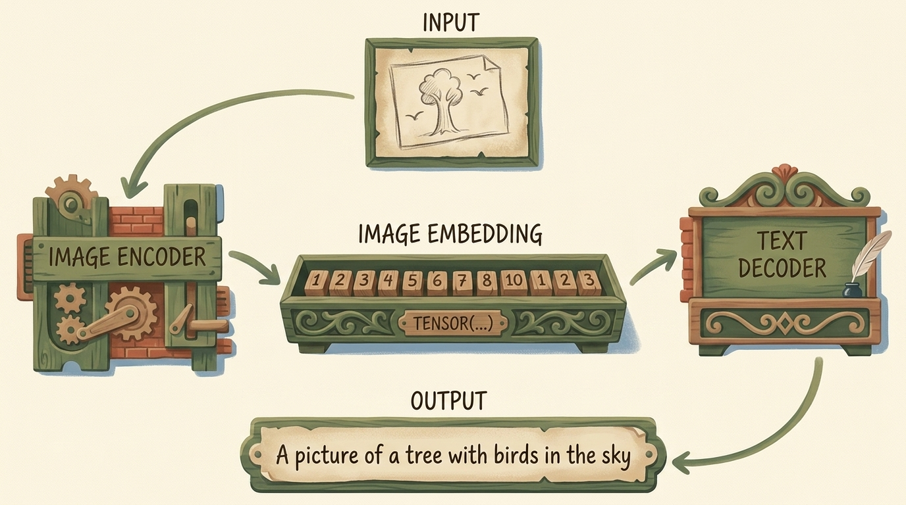

# Önceden Eğitilmiş Ağlar ve Model Zoo

<!-- toc -->

<div style="margin-bottom: 20px;">
  <a href="https://colab.research.google.com/github/emreaslan7/ai/blob/main/notebooks/deep-learning-with-pytorch/02-pretrained-networks-and-model-zoo.ipynb" target="_blank">
    
  </a>
</div>

Modern derin sinir ağlarını **ImageNet** (1.000 sınıf ve 1,2 milyon etiketli görsel) veya **LAION** gibi devasa veri kümeleri üzerinde sıfırdan eğitmek yüzlerce GPU saati, devasa sunucu kümeleri ve ciddi mühendislik bütçeleri gerektirir. Modern derin öğrenme mühendisliğinde modelleri her seferinde rastgele ağırlıklarla ($W \sim \mathcal{N}(0, \sigma^2)$) başlatmak yerine, devasa veriler üzerinde önceden eğitilmiş ve evrensel görsel temsiller kazanmış **temel omurgalar (pretrained foundation backbones)** kullanılır.

Bu bölüm, *Deep Learning with PyTorch (2nd Edition)* kitabının **2. Bölümü** doğrultusunda adım adım şu konuları incelemektedir:
1. **Görsel Tanıma:** Klasik evrişimli ağlar (**AlexNet**, **ResNet-101**) ve modern **Vision Transformers (ViT)**.
2. **Üretken Görsel Sentezi:** Metin istemleriyle yönlendirilen iç tamamlama (**Latent Diffusion / Stable Diffusion**) ve eşleşmemiş görsel dönüşümü (**CycleGAN: At $\to$ Zebra**).
3. **Hugging Face Ekosistemi:** Evrensel açık model havuzu ve standartlaştırılmış işlemci/model arayüzleri.
4. **Çok Modlu Görsel-Dil Modelleri:** Sahne anlama ve otomatik görsel betimleme (**BLIP**).

---

## 1. Önceden Eğitilmiş Temel Modeller Paradigması

Klasik yazılım mühendisliğinde şifreleme veya veri tabanı algoritmalarını her projede sıfırdan yazmak yerine test edilmiş güvenilir kütüphaneleri kullanırız. Önceden eğitilmiş sinir ağları da yapay zekada aynı modülerliği ve yeniden kullanılabilirliği sağlar:



### ImageNet Karşılaştırma Ölçütü ve Görsel Hiyerarşi
Bilgisayarlı görü alanının temel mihenk taşı olan **ImageNet**, **WordNet** hiyerarşik isim veritabanına göre yapılandırılmıştır. ImageNet yarışma alt kümesi (**ILSVRC**), günlük nesnelerden hayvan türlerine ve araçlara kadar **1.000 farklı sınıfa** ait 1,2 milyondan fazla eğitim görseli içerir.

Bir sinir ağı bu 1.000 sınıfı ayırt etmeyi öğrendiğinde katmanları şu hiyerarşik görsel sözlüğü oluşturur:
- **İlk katmanlar:** Düşük seviyeli uzamsal yapıları (Gabor benzeri yönlü kenarlar, renk geçişleri, çizgi yönelimleri) yakalar.
- **Orta katmanlar:** Kenarları birleştirerek dokuları, köşe birleşimlerini, yüzey kavislerini ve konturları oluşturur.
- **Derin katmanlar:** Dokuları birleştirerek göz, tekerlek, pati veya nesne parçaları gibi karmaşık semantik şablonları inşa eder.

> **Temel Çıkarım:** Önceden eğitilmiş ağırlıklar, binlerce GPU saatlik gradyan optimizasyonunun tensör dosyalarında dondurulmuş halidir. Bu ağırlıkları yüklemek, modelinize anında gelişmiş uzamsal ve anlamsal görme yeteneği kazandırır.

---

## 2. Görsel Tanıma Hattı: Torchvision Model Zoo

Torchvision kütüphanesinin `torchvision.models` modülü, klasik ve modern bilgisayarlı görü mimarilerine ve bunların eğitilmiş ağırlıklarına doğrudan erişim sağlar.



### 2.1 Mevcut Mimarileri Listeleme

Bir modeli başlatmadan önce, Torchvision kataloğundaki tüm modelleri `models.list_models()` fonksiyonu ile sorgulayabiliriz.

```python
import torch
import torchvision
from torchvision import models

# Torchvision'daki tum hazir modelleri listele
available_models = models.list_models()
print(f"Torchvision icindeki toplam model sayisi: {len(available_models)}")
print("Ornek modeller:", available_models[:10])
```

---

### 2.2 AlexNet: 2012 Derin Öğrenme Devrimi

**AlexNet** (Krizhevsky, Sutskever ve Hinton, 2012), ILSVRC 2012 yarışmasını kazanarak ve en iyi 5 hata oranını (top-5 error rate) klasik öznitelik yöntemlerinin (SIFT/HOG) aldığı **%28.2** seviyesinden **%16.4** seviyesine düşürerek modern derin öğrenme çağını başlatmıştır.

<figure style="display:flex; justify-content: center; margin: 25px 0;">
  <div style="text-align: center;">
    
    <figcaption style="margin-top: 0.6em; text-align: center; font-size: 13px; color: #888;"><em>AlexNet Mimarisi: 5 ardışık evrişimli blok (96, 256, 384, 384, 256 kanal) ve ardından 3 tam bağlantılı sınıflandırıcı katmanı (4096, 4096, 1000 logit).</em></figcaption>
  </div>
</figure>

AlexNet, 5 evrişim katmanı ve 3 tam bağlantılı (fully connected) katman üzerinde toplam **61.1 milyon parametreye** sahiptir.

#### Adım 1: AlexNet Modelini Ağırlıklarıyla Başlatma
Modern Torchvision sürümünde (v0.13+), modeller eski `pretrained=True` bayrağı yerine açık `Weights` enum sınıfları kullanılarak yüklenir. Bu sayede eğitimde kullanılan kesin ön işleme dönüşümleri de modele bağlı olarak otomatik olarak elde edilir.

```python
from torchvision.models import AlexNet_Weights

# AlexNet modelini varsayilan ImageNet agirliklariyla yukle
alexnet_weights = AlexNet_Weights.DEFAULT
alexnet = models.alexnet(weights=alexnet_weights)

# Ag topolojisini ekrana yazdir
print(alexnet)
```

Çıktıyı incelediğimizde iki ana alt modül görürüz:
1. `features`: Uzamsal çözünürlüğü kademeli olarak düşürürken kanal sayısını artıran ($3 \to 64 \to 192 \to 384 \to 256$) `Conv2d`, `ReLU` ve `MaxPool2d` katmanları.
2. `classifier`: Aşırı öğrenmeyi engelleyen `Dropout(p=0.5)` ve 1.000 ImageNet sınıfı için logit skorları üreten `Linear(in_features=4096, out_features=1000)` katmanları.

---

### 2.3 Vision Transformer (ViT): Evrişimin Yerini Alan Dikkat Mekanizması

2020 yılında Dosovitskiy ve arkadaşları tarafından sunulan **Vision Transformer (ViT)**, evrişimli ağların yerel filtreleme ve kayma değişmezliği (translation equivariance) varsayımlarını bir kenara bırakarak, görseli metin cümlelerindeki kelimeler gibi parçalara (patch) böler ve **Öz-Dikkat (Self-Attention)** mekanizması uygular.



#### Adım 1: ViT-B/16 Modelini Yükleme
$16 \times 16$ piksel yama çözünürlüğüne sahip temel Vision Transformer modelini (`vit_b_16`) yüklüyoruz:

```python
from torchvision.models import ViT_B_16_Weights

# ViT-B/16 modelini hazir agirliklariyla yukle
vit_weights = ViT_B_16_Weights.DEFAULT
vit = models.vit_b_16(weights=vit_weights)

# Ag yapisini incele
print(vit)
```

`vit_b_16` modelinde $224 \times 224$ görsel, $14 \times 14 = 196$ adet $16 \times 16 \times 3 = 768$ boyutlu vektöre dönüştürülür. Dizi başına bir `[CLS]` sınıflandırma token'ı eklenir (dizi uzunluğu 197 olur) ve 12 Transformer bloğu boyunca tüm görsel alanındaki global ilişkiler modellenir.

---

### 2.4 Görsel Ön İşleme Hattının Matematiksel Formülasyonu

Sinir ağı ağırlıkları, eğitildikleri veri kümesinin kesin ortalamasına ve varyansına göre kalibre edilmiştir. Ham RGB piksel değerlerini doğrudan modele göndermek dağılım kaymasına (distribution shift) yol açarak anlamsız tahminler üretir.



Matematiksel dönüşüm hattı 3 deterministik aşamadan oluşur:

1. **Uzamsal Ölçekleme ve Merkezden Kırpma:**
   Görselin kısa kenarı 256 piksele ölçeklenir, ardından merkezden $224 \times 224$ kare kırpılır:
   $$ \mathbf{X} \in \mathbb{R}^{3 \times 224 \times 224} $$

2. **Piksel Değerlerini Normalize Etme:**
   $[0, 255]$ tamsayı piksel değerleri $[0.0, 1.0]$ kayan noktalı sayılarına çekilir:
   $$ x_{\text{norm}} = \frac{x}{255.0} $$

3. **Kanal Bazlı Standartlaştırma:**
   RGB renk kanalları ImageNet ortalamaları ve standart sapmaları ile standartlaştırılır:
   $$ x'\_{c,i,j} = \frac{x\_{c,i,j} - \mu\_c}{\sigma\_c} $$
   $$ \boldsymbol{\mu} = [0.485, 0.456, 0.406], \quad \boldsymbol{\sigma} = [0.229, 0.224, 0.225] $$

#### Adım 1: Modele Ait Resmi Ön İşleme Hattını Alma
Dönüşüm değerlerini elle kodlamak yerine, doğrudan ağırlık nesnesine bağlı olan dönüşüm hattını çekeriz:

```python
# Modele ait resmi donusum boru hattini al
preprocess = alexnet_weights.transforms()
print("On Isleme Boru Hatti:")
print(preprocess)
```

#### Adım 2: Gerçek Bir Test Görseli İndirme
PyTorch resmi deposundaki standart Golden Retriever test fotoğrafını `urllib.request` ile indirip açıyoruz:

```python
import urllib.request
from PIL import Image

# PyTorch resmi deposundaki gercek Golden Retriever test fotografini yukle
url = "https://raw.githubusercontent.com/pytorch/hub/master/images/dog.jpg"
with urllib.request.urlopen(url) as response:
    img = Image.open(response).convert("RGB")

print(f"Orijinal gorsel formati: {img.format}, boyutlari: {img.size}")
```

#### Adım 3: Ön İşleme Dönüşümlerini Uygulama
PIL görselini standartlaştırılmış $(3, 224, 224)$ boyutlu bir kayan noktalı tensöre dönüştürürüz:

```python
# On isleme adimlarini uygula: PIL Gorseli -> (3, 224, 224) Tensore donusur
img_t = preprocess(img)
print(f"Islenmis tensor sekli: {img_t.shape}")
print(f"Tensor veri tipi: {img_t.dtype}, min: {img_t.min():.2f}, max: {img_t.max():.2f}")
```

#### Adım 4: `unsqueeze(0)` ile Paket (Batch) Boyutu Ekleme
PyTorch görü modelleri `(Paket, Kanallar, Yukseklik, Genislik)` şeklinde 4 boyutlu bir tensör bekler:

```python
import torch

# Paket (batch) boyutunu ekle: (3, 224, 224) -> (1, 3, 224, 224)
batch_t = torch.unsqueeze(img_t, 0)
print(f"Girdi paket tensor sekli: {batch_t.shape}")
```

---

### 2.5 Çıkarım Yürütme ve Sınıf Olasılıklarını Ayrıştırma

#### Adım 1: Modeli Değerlendirme Moduna Alma ve İleri Yayılım
Çıkarım yapmadan önce modeli MUTLAKA `model.eval()` moduna almalıyız. Bu işlem `Dropout` katmanını etkisizleştirir ve `BatchNorm2d` katmanının hareketli ortalama istatistiklerini dondurur.

Gereksiz bellek kullanımını engellemek için ileri yayılımı `with torch.inference_mode():` bağlamında çalıştırırız:

```python
# 1. Modeli degerlendirme moduna al
alexnet.eval()

# 2. Donanim hedefini sec (GPU / CPU)
device = torch.device("cuda" if torch.cuda.is_available() else "cpu")
alexnet = alexnet.to(device)
batch_t = batch_t.to(device)

# 3. Gradyan takibini kapatip ileri yayilimi calistir
with torch.inference_mode():
    out = alexnet(batch_t)

print(f"Cikti ham logit tensonunun sekli: {out.shape}")  # (1, 1000)
```

#### Adım 2: Softmax Olasılıkları ve En Yüksek 5 Sınıfı (Top-5) Bulma
Modelin çıktısı 1.000 boyutlu normalize edilmemiş bir logit vektörüdür ($\mathbf{z} \in \mathbb{R}^{1000}$). Bu logitleri $\sum_k P(Y=k) = 1$ koşulunu sağlayan geçerli olasılıklara dönüştürmek için **Softmax** fonksiyonu uygulanır:

$$ P(Y = k \mid \mathbf{x}) = \text{Softmax}(z_k) = \frac{\exp(z_k)}{\sum_{j=1}^{1000} \exp(z_j)} $$

Ardından `torch.topk` ile en yüksek güvene sahip ilk 5 sınıfı listeleriz:

```python
# 1. Sinif ekseni boyunca (dim=1) Softmax uygula
probabilities = torch.softmax(out, dim=1)

# 2. En yuksek ilk 5 tahmini cek
top5_prob, top5_catid = torch.topk(probabilities, 5)

# 3. Agirlik metadata'sindan kategori isimlerini al
categories = alexnet_weights.meta["categories"]

print("\n=== Golden Retriever Icin AlexNet Top-5 Sinif Tahminleri ===")
for i in range(top5_prob.size(1)):
    cat_id = top5_catid[0][i].item()
    score = top5_prob[0][i].item() * 100.0
    print(f"{i+1}. {categories[cat_id]:<35} (%{score:.2f})")
```

#### Adım 3: Vision Transformer (ViT-B/16) ile Karşılaştırmalı Çıkarım
Aynı test görselini ViT-B/16 modeline vererek global öz-dikkat mekanizmasının tahmin dağılımını inceliyoruz:

```python
vit.eval()
vit_preprocess = vit_weights.transforms()
vit_batch_t = torch.unsqueeze(vit_preprocess(img), 0).to(device)

with torch.inference_mode():
    vit_out = vit(vit_batch_t)

vit_probs = torch.softmax(vit_out, dim=1)
vit_top5_prob, vit_top5_catid = torch.topk(vit_probs, 5)
vit_categories = vit_weights.meta["categories"]

print("=== ViT-B/16 Top-5 Sinif Tahminleri ===")
for i in range(vit_top5_prob.size(1)):
    cat_id = vit_top5_catid[0][i].item()
    score = vit_top5_prob[0][i].item() * 100.0
    print(f"{i+1}. {vit_categories[cat_id]:<35} (%{score:.2f})")
```

---

## 3. Üretken Görsel Hatları: Inpainting ve CycleGAN

Sınıflandırma modelleri ayrıştırıcı sınırları öğrenirken ($P(Y \mid X)$), **üretken modeller** verinin kendi dağılımını modelleyerek sıfırdan veya istemler doğrultusunda yeni görsel içerikler sentezler ($P(X)$ veya $P(X \mid \text{Metin})$).

### 3.1 Latent Diffusion Inpainting (Stable Diffusion) ile İç Tamamlama

Üretken inpainting, bir görselin hasarlı, istenmeyen veya maskelenmiş bir bölgesini doğal dil açıklamasına uygun olarak yeniden çizer.

<figure style="display:flex; justify-content: center; margin: 25px 0;">
  <div style="text-align: center;">
    
    <figcaption style="margin-top: 0.6em; text-align: center; font-size: 13px; color: #888;"><em>Inpainting Girdi Düzeni: Metin İstemi ('Change this horse into a zebra'), ham Görsel ve hedef boyama bölgesini belirten tek kanallı Maske paneli.</em></figcaption>
  </div>
</figure>

#### Neden Gizil Uzay (Latent Space)?
Klasik difüzyon modellerinin doğrudan piksel uzayında ($512 \times 512 \times 3 = 786.432$ değer) onlarca adım gürültü gidermesi aşırı hesaplama maliyeti yaratır. 

**Latent Diffusion Modelleri (LDM)**, bir Varyasyonel Otokodlayıcı (VAE) aracılığıyla görseli uzamsal olarak 8 kat sıkıştırarak $(4, 64, 64) = 16.384$ elemanlı kompakt bir gizil uzaya ($z = \mathcal{E}(x)$) taşır. Denoising U-Net ağı tamamen bu gizil manifoldda çalışır:

$$ \mathcal{L}\_{\text{LDM}}(\theta) = \mathbb{E}\_{\mathbf{x}, \mathbf{y}, \boldsymbol{\epsilon}, t} \left[ \left\\| \boldsymbol{\epsilon} - \boldsymbol{\epsilon}\_\theta(\mathbf{z}\_t, t, \tau\_\theta(\mathbf{y})) \right\\|\_2^2 \right] $$

Burada:
- $\mathbf{z}_t$: $t$ zaman adımındaki gürültülü gizil tensör.
- $\tau_\theta(\mathbf{y})$: CLIP metin kodlayıcısından çıkarılan istem gömmesi.
- $\boldsymbol{\epsilon}_\theta$: Eklenen yapay gürültüyü tahmin eden U-Net mimarisi.

#### Adım 1: Diffusers ile Inpainting Model Boru Hattını Yükleme
Halka açık topluluk ağırlıklarını (`sd2-community/stable-diffusion-2-inpainting`) kullanarak Stable Diffusion 2.0 Inpainting boru hattını başlatıyoruz:

```python
from diffusers import StableDiffusionInpaintPipeline
import torch

# GPU varsa bellek tasarrufu icin float16 hassasiyeti kullan
device = "cuda" if torch.cuda.is_available() else "cpu"
dtype = torch.float16 if device == "cuda" else torch.float32

# Stable Diffusion 2.0 Inpainting modelini yukle
pipe = StableDiffusionInpaintPipeline.from_pretrained(
    "sd2-community/stable-diffusion-2-inpainting",
    dtype=dtype
).to(device)

# Stable Diffusion 2.0 FP16 VAE sayisal tasmasini (NaN/Siyah gorsel) onlemek icin VAE'yi Float32'ye yukselt
if device == "cuda" and dtype == torch.float16:
    if hasattr(pipe, "upcast_vae"):
        pipe.upcast_vae()
    else:
        pipe.vae.to(dtype=torch.float32)

print(f"Model basariyla yuklendi. Calisma cihazi: {device}")
```

#### Adım 2: Referans Test Görseli, İkili Maske ve Metin İstemi Yükleme
Inpainting üç temel girdi gerektirir:
1. `image`: Orijinal taban görsel ($512 \times 512$).
2. `mask_image`: Beyaz piksellerin ($255$) yeniden boyanacak alanı, siyah piksellerin ($0$) korunacak alanı temsil ettiği gri tonlamalı ikili maske.
3. `prompt`: Üretimi yönlendiren doğal dil metin istemi.

CompVis resmi Latent Diffusion deposundan standart test görselini ve maskesini çekiyoruz:

```python
from PIL import Image
import urllib.request

# CompVis resmi Latent Diffusion deposundaki referans inpainting gorseli ve maskesi
img_url = "https://raw.githubusercontent.com/CompVis/latent-diffusion/main/data/inpainting_examples/overture-creations-5sI6fQgYIuo.png"
mask_url = "https://raw.githubusercontent.com/CompVis/latent-diffusion/main/data/inpainting_examples/overture-creations-5sI6fQgYIuo_mask.png"

with urllib.request.urlopen(img_url) as response:
    init_image = Image.open(response).convert("RGB").resize((512, 512))

with urllib.request.urlopen(mask_url) as response:
    mask_image = Image.open(response).convert("L").resize((512, 512))

prompt = "a sitting cat on a park bench, 8k resolution, photorealistic"

print(f"Taban Gorsel Boyutu: {init_image.size} | Maske Gorsel Boyutu: {mask_image.size}")
print(f"Hedef Metin Istemi: '{prompt}'")
```

#### Adım 3: Inpainting Çıkarımını Yürütme
25 gürültü giderme adımı ve 7.5 yönlendirme ölçeği (guidance scale) ile üretimi başlatıyoruz:

```python
# Difuzyon cikarimini calistir
with torch.inference_mode():
    output = pipe(
        prompt=prompt,
        image=init_image,
        mask_image=mask_image,
        num_inference_steps=25,
        guidance_scale=7.5,
        generator=torch.Generator(device=device).manual_seed(42) if device == "cuda" else None
    )

inpainted_image = output.images[0]
print(f"Uretim tamamlandi! Olusan gorsel boyutu: {inpainted_image.size}")
```

---

### 3.2 Eşleşmemiş Görsel Dönüşümü: CycleGAN (At $\to$ Zebra)

Klasik denetimli öğrenmede bir görseli dönüştürmek için birebir eşleşmiş çiftler gerekir ($(x_i, y_i)$ — örneğin bir atın tam olarak aynı duruş, açı ve arka plandaki zebra fotoğrafı). Bu tür veri setlerini elde etmek imkansız olduğundan, **CycleGAN** (Zhu vd., 2017) **eşleşmemiş görsel dönüşümü (unpaired translation)** kavramını geliştirmiştir.



#### Döngü Tutarlılığı Prensibi
İngilizce bir cümleyi Fransızcaya çevirip ($G$), ardından tekrar İngilizceye çevirdiğinizde ($F$) orijinal cümleye ulaşmanız gerekir. CycleGAN'da bu matematiksel prensip şu şekilde ifade edilir:

$$ F(G(x)) \approx x \quad \text{ve} \quad G(F(y)) \approx y $$

Toplam kayıp fonksiyonu, çekişmeli GAN kayıpları ($\mathcal{L}\_{\text{GAN}}$) ile $L_1$ **Döngü Tutarlılığı Kaybının** ($\mathcal{L}\_{\text{cyc}}$) ağırlıklı toplamıdır:

$$ \mathcal{L}\_{\text{toplam}}(G, F, D_X, D_Y) = \mathcal{L}\_{\text{GAN}}(G, D_Y, X, Y) + \mathcal{L}\_{\text{GAN}}(F, D_X, Y, X) + \lambda \mathcal{L}\_{\text{cyc}}(G, F) $$

$$ \mathcal{L}\_{\text{cyc}}(G, F) = \mathbb{E}\_x \left[ \\| F(G(x)) - x \\\|\_1 \right] + \mathbb{E}\_y \left[ \\| G(F(y)) - y \\\|\_1 \right] $$

#### Adım 1: ResNet Tabanlı CycleGAN Bloğunu Tanımlama
Üreteç mimarisi, uzamsal bağlamı korumak için artık (residual) bağlantılar içeren ResNet bloklarından oluşur:

```python
import torch
import torch.nn as nn

# Standart CycleGAN ResNet blogu
class ResNetBlock(nn.Module):
    def __init__(self, dim):
        super().__init__()
        self.conv_block = nn.Sequential(
            nn.ReflectionPad2d(1),
            nn.Conv2d(dim, dim, kernel_size=3, padding=0, bias=False),
            nn.InstanceNorm2d(dim),
            nn.ReLU(True),
            nn.ReflectionPad2d(1),
            nn.Conv2d(dim, dim, kernel_size=3, padding=0, bias=False),
            nn.InstanceNorm2d(dim)
        )

    def forward(self, x):
        return x + self.conv_block(x)  # Artik (skip) baglanti

print("CycleGAN ResNetBlogu basariyla tanimlandi.")
```

---

## 4. Hugging Face Ekosistemi ve Model Zoo

Torchvision standart bilgisayarlı görü modellerinde uzmanlaşmışken; **Hugging Face Hub**, NLP, Ses, Bilgisayarlı Görü, Pekiştirmeli Öğrenme ve Çok Modlu alanlarda 500.000'den fazla açık kaynak modele ev sahipliği yapan evrensel bir ekosistemdir.



Her Hugging Face modeli standart iki bileşenden oluşur:
1. **AutoProcessor / AutoTokenizer:** Modelin ön eğitimi sırasındaki kelime parçalama (tokenization), piksel ölçekleme ve normalizasyon adımlarını birebir yeniden oluşturur.
2. **AutoModelFor...:** Model mimarisini kurar, ağırlıkları uzak depodan indirir ve GPU belleğine yerleştirir.

---

## 5. Çok Modlu Görsel-Dil Çıkarımı: BLIP

Çok Modlu Modeller (Vision-Language Models - VLMs), görsel algılama ile doğal dil üretimini birleştirir. Salesforce tarafından geliştirilen **BLIP (Bootstrapping Language-Image Pre-training)** şu görevleri gerçekleştirebilir:
- **Koşulsuz Betimleme (Unconditional Captioning):** Herhangi bir metin yönlendirmesi olmadan doğrudan görselin ne içerdiğini açıklayan cümleler üretir.
- **Koşullu Betimleme / Soru-Cevap (VQA):** Verilen bir metin başlangıcına göre görseli detaylandırır veya görselle ilgili soruları cevaplar.

<figure style="display:flex; justify-content: center; margin: 25px 0;">
  <div style="text-align: center;">
    
    <figcaption style="margin-top: 0.6em; text-align: center; font-size: 13px; color: #888;"><em>BLIP Çok Modlu Mimarisi: Vision Transformer (ViT) Görsel Kodlayıcı ile Çapraz Dikkatli Çok Modlu Metin Kod Çözücünün Birleşimi.</em></figcaption>
  </div>
</figure>

### Görsel-Metin Çapraz Dikkat (Cross-Attention) Mekanizması
Kod çözücü katmanlarında görsel temsiller, **Çapraz Dikkat** formülü ile metin üretim akışına dahil edilir:

$$ \text{CrossAttention}(\mathbf{Q}, \mathbf{K}, \mathbf{V}) = \text{softmax}\left( \frac{\mathbf{Q} \mathbf{K}^T}{\sqrt{d_k}} \right) \mathbf{V} $$

Burada sorgular ($\mathbf{Q}$) önceki üretilen metin token'larından; anahtar ($\mathbf{K}$) ve değerler ($\mathbf{V}$) ise ViT görsel kodlayıcısından çıkarılan görsel token dizisinden gelir.

---

### 5.1 Çalıştırılabilir BLIP Kodu

#### Adım 1: İşlemciyi ve Modeli Hugging Face Üzerinden Yükleme
`BlipProcessor` ve `BlipForConditionalGeneration` sınıflarını yüklüyoruz:

```python
from transformers import BlipProcessor, BlipForConditionalGeneration
from PIL import Image
import torch
import urllib.request

device = torch.device("cuda" if torch.cuda.is_available() else "cpu")

# 1. Islemciyi ve modeli yukle
processor = BlipProcessor.from_pretrained("Salesforce/blip-image-captioning-base")
blip_model = BlipForConditionalGeneration.from_pretrained("Salesforce/blip-image-captioning-base").to(device)
blip_model.eval()

print("BLIP modeli basariyla hazirlandi.")
```

#### Adım 2: Koşulsuz Sahne Betimleme (Unconditional Captioning)
Gerçek bir test fotoğrafını (örneğin Golden Retriever) herhangi bir yönlendirme metni vermeden modele gönderip betimletiyoruz:

```python
# Ornek fotograf yukle
img_url = "https://raw.githubusercontent.com/pytorch/hub/master/images/dog.jpg"
with urllib.request.urlopen(img_url) as response:
    raw_image = Image.open(response).convert("RGB")

# Gorseli PyTorch tensonune donustur
inputs_unconditional = processor(images=raw_image, return_tensors="pt").to(device)

# Otoregresif olarak metin uret
with torch.inference_mode():
    output_tokens = blip_model.generate(**inputs_unconditional, max_new_tokens=30)
    caption = processor.decode(output_tokens[0], skip_special_tokens=True)

print(f"Kosulsuz Sahne Betimlemesi: '{caption}'")
```

#### Adım 3: Koşullu / İstem Yönlendirmeli Betimleme (Conditional Captioning)
Görsel açıklamayı yönlendirmek için bir metin ön eki (prompt) ekliyoruz:

```python
prompt_text = "a photography of"

# Hem gorseli hem de yonlendirme metnini islemciye gonder
inputs_conditional = processor(images=raw_image, text=prompt_text, return_tensors="pt").to(device)

# Kosullu metin uretimini calistir
with torch.inference_mode():
    output_tokens = blip_model.generate(**inputs_conditional, max_new_tokens=30)
    conditional_caption = processor.decode(output_tokens[0], skip_special_tokens=True)

print(f"Kosullu Betimleme:           '{conditional_caption}'")
```

---

## 6. Model Boyutları, FLOPs ve GPU Bellek Hiyerarşisi

Üretim ortamına model seçerken mühendisler **model doğruluğu**, **parametre sayısı (VRAM)** ve **hesaplama karmaşıklığı (gecikme / FLOPs)** arasındaki dengeyi iyi analiz etmelidir.

### 6.1 Mimari Karşılaştırma Tablosu

| Mimari | Paradigma | Parametre Sayısı | Hesaplama Maliyeti (FLOPs) | ImageNet Top-1 Başarısı | Birincil Kullanım Alanı |
| :--- | :--- | :---: | :---: | :---: | :--- |
| **AlexNet (2012)** | Klasik CNN | 61.1 M | 0.72 GFLOPs | %56.5 | Tarihsel temel, eğitim |
| **ResNet-18 (2015)** | Residual CNN | 11.7 M | 1.82 GFLOPs | %69.8 | Uç cihazlar (Edge/IoT), mobil |
| **ResNet-101 (2015)** | Derin Residual CNN | 44.5 M | 7.85 GFLOPs | %81.9 | Güçlü genel görsel omurga |
| **ViT-B/16 (2020)** | Vision Transformer | 86.6 M | 17.60 GFLOPs | %84.2 | Yüksek doğruluklu temel görü |
| **BLIP-Base (2022)** | Çok Modlu VLM | 223.0 M | ~35.00 GFLOPs | - (VQA / Betimleme) | Görsel arama, sahne açıklama |
| **SD-2.1 Inpaint (2022)** | Latent Diffusion | 865.0 M | ~150.00 GFLOPs | - (Üretken) | Görsel düzenleme, inpainting |

### 6.2 Statik GPU VRAM İhtiyacı Formülü

Model parametrelerinin ekran kartında (GPU) kapladığı statik bellek şu formülle hesaplanır:

$$ \text{VRAM} = N\_{\text{params}} \times B\_{\text{dtype}} $$

Burada $B\_{\text{dtype}}$ kullanılan sayısal hassasiyetin bayt karşılığıdır:
- **FP32 (Tek Hassasiyet):** $B = 4\text{ bayt}$
- **FP16 / BF16 (Yarım Hassasiyet):** $B = 2\text{ bayt}$
- **INT8 (8-bit Kuantize):** $B = 1\text{ bayt}$
- **INT4 (4-bit NF4 / GPTQ):** $B = 0.5\text{ bayt}$

Örneğin standart FP32 formatında **ResNet-101** ($44.5 \times 10^6$ parametre) yüklemek:

$$ 44.5 \times 10^6 \times 4 \text{ bayt} \approx 178 \text{ MB VRAM} $$

**Stable Diffusion 2.1** modelini (~$865 \times 10^6$ parametre) FP16 hassasiyetinde yüklemek ise:

$$ 865 \times 10^6 \times 2 \text{ bayt} \approx 1.73 \text{ GB VRAM} $$

---

## 7. Özet ve Temel Çıkarımlar

1. **Transfer Öğrenmenin Verimliliği:** Önceden eğitilmiş temel modeller, görsel öznitelik çıkarıcıları sıfırdan eğitme ihtiyacını ortadan kaldırarak ImageNet gibi devasa veri kümelerinde öğrenilen temsilleri hedef görevlere aktarır.
2. **Ön İşleme Tutarlılığı:** Girdi görselleri daima modelin eğitim dağılımındaki ImageNet RGB ortalamaları ($[0.485, 0.456, 0.406]$) ve standart sapmaları ($[0.229, 0.224, 0.225]$) ile standartlaştırılmalıdır.
3. **Çıkarım Disiplini:** Çıkarım sırasında `model.eval()` çağrılarak rastlantısal katmanlar dondurulmalı, `with torch.inference_mode():` bağlamı ile gradyan takibi kapatılarak gereksiz bellek kullanımı engellenmelidir.
4. **Çok Modlu Genişleme:** Hugging Face ve Diffusers kütüphaneleri BLIP ve Stable Diffusion gibi çok modlu ve üretken modeller için uçtan uca standartlaştırılmış işlem hatları sunar.
