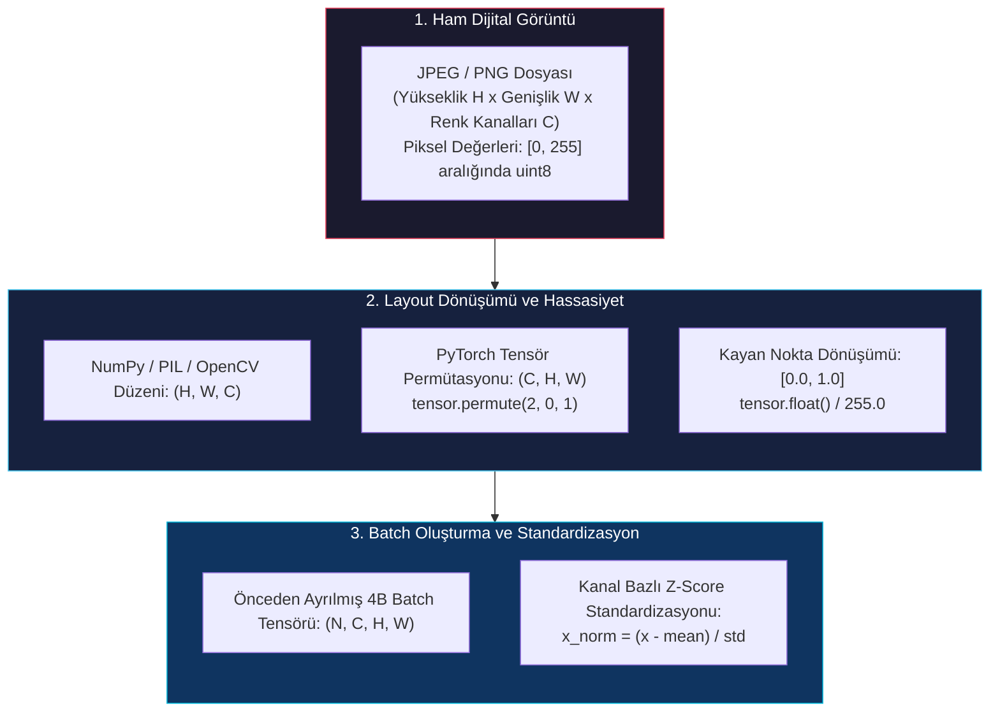
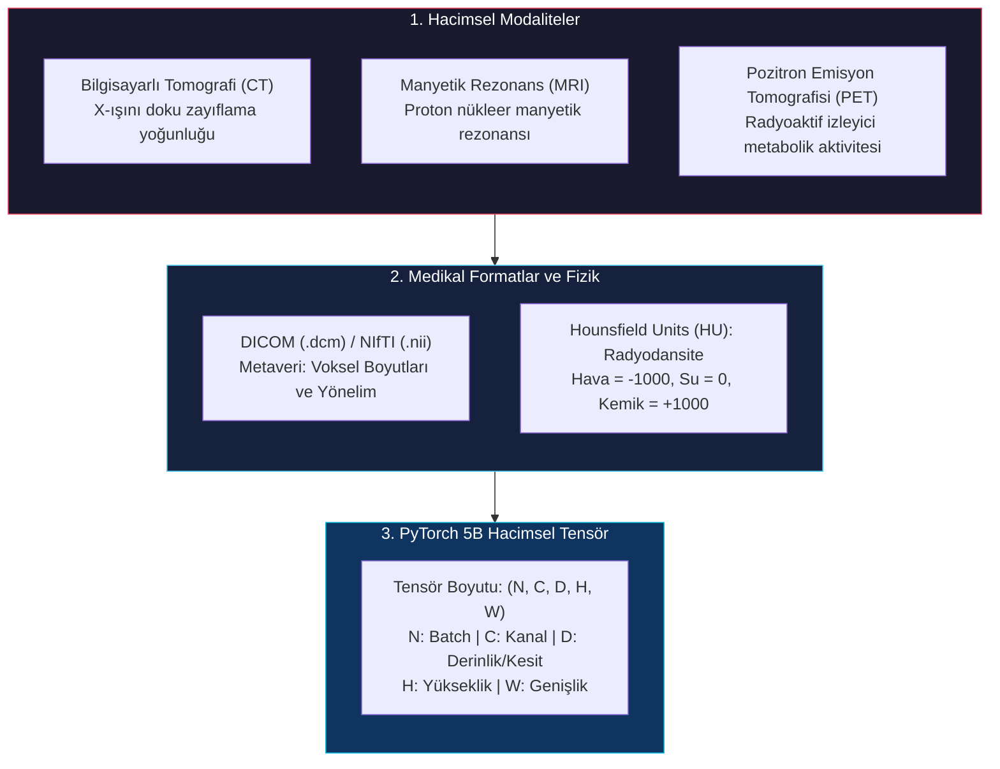
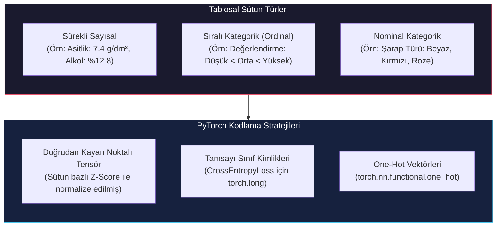
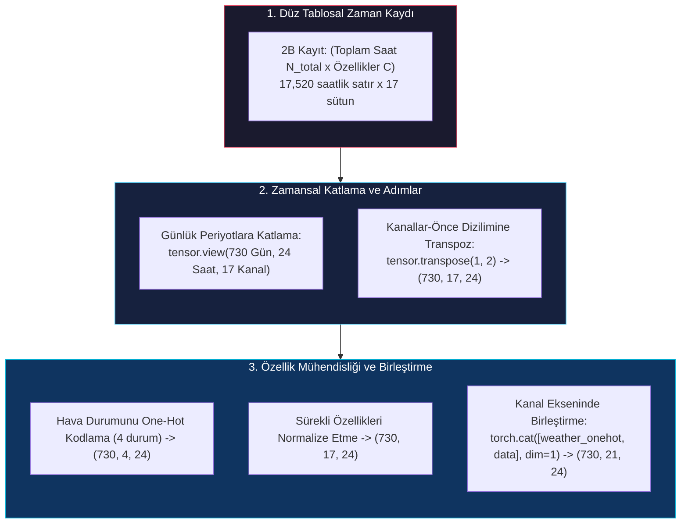
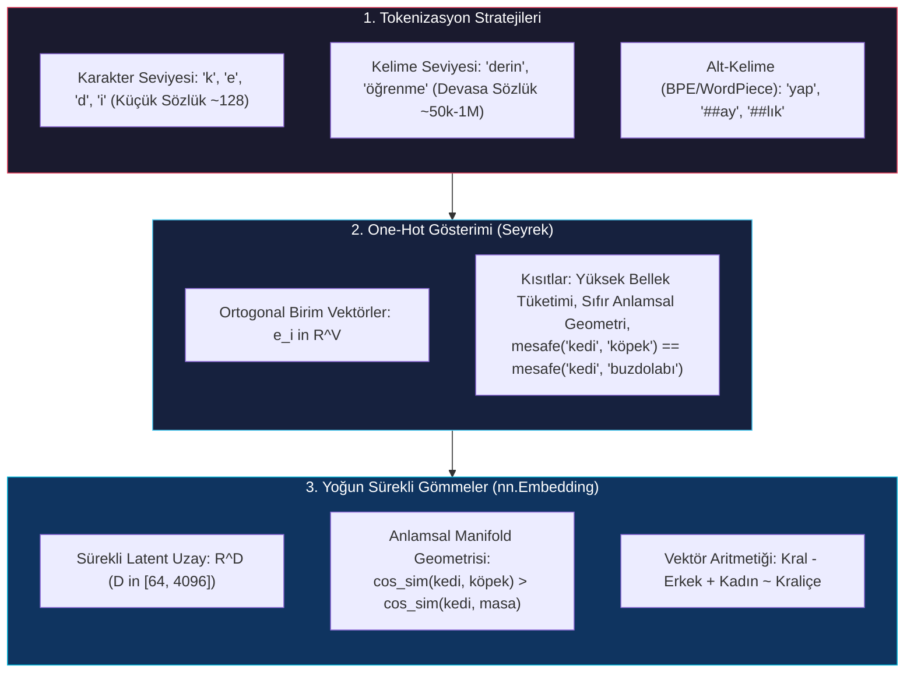

# Tensörlerle Gerçek Dünya Verilerini Temsil Etme: Görüntü, Hacimsel Veri, Tablo, Zaman Serisi ve Metin

<!-- toc -->

<div style="margin-bottom: 20px;">
  <a href="https://colab.research.google.com/github/emreaslan7/ai/blob/main/notebooks/deep-learning-with-pytorch/04-real-world-data-representation-using-tensors.ipynb" target="_blank">
    
  </a>
</div>

Derin öğrenme modelleri ham JPEG dosyalarını, DICOM medikal taramalarını, elektronik tablo satırlarını, sensör kayıtlarını veya doğal dil paragraflarını doğrudan kendi doğal hallerinde işleyemez. Fiziksel dünyadan toplanan her türlü duyusal ve dijital veri, derin sinir ağlarına beslenmeden önce mutlaka sürekli kayan noktalı (floating-point) sayılardan oluşan çok boyutlu bir ızgaraya, yani bir **PyTorch tensörüne** dönüştürülmelidir.

Ancak gerçek dünya verilerini tensörlere dönüştürmek tek tip ve basit bir işlem değildir. Farklı veri türleri kendilerine has uzamsal geometrilere, zamansal korelasyonlara, ayrık kategorik yapılara ve dinamik değer aralıklarına sahiptir. 2B bir fotoğraf uzamsal yerellik içeren çok kanallı bir ızgara gerektirirken; 3B bir bilgisayarlı tomografi (CT) taraması fiziksel doku yoğunluğu (Hounsfield Units) ölçeklemesi gerektirir; tablosal veri sürekli ölçümler ile ayrık kategorik kodların birleşiminden oluşur; zaman serileri sirkadiyen döngüleri ve zamansal dinamikleri modeller; doğal dil metinleri ise ayrık sembolik simgelerin (tokens) yoğun ve sürekli latent manifoldlara haritalanmasını zorunlu kılar.

Eli Stevens, Luca Antiga, Thomas Viehmann ve Howard Huang tarafından kaleme alınan *Deep Learning with PyTorch (2. Baskı)* kitabının *4. Bölümü* temel alınarak hazırlanan bu dokümantasyon, gerçek dünya verilerinin PyTorch tensörlerine dönüştürülme sürecini tüm matematiksel ve mimari detaylarıyla ele almaktadır:
1. **Görüntülerle Çalışmak (2B Görsel Veri):** Renk kanalları (Gri Tonlama, RGB, RGBA), bit derinlikleri (`uint8` vs `float32`), $H \times W \times C \to C \times H \times W$ layout dönüşümleri (`.permute`), bitişik (contiguous) vs `torch.channels_last` bellek mimarileri, önceden ayrılmış (pre-allocated) batch tensörleri ve kanal bazlı istatistiksel standardizasyon.
2. **3B Görüntüler (Hacimsel Medikal Veri):** Medikal CT/MRI taramaları, DICOM/NIfTI standartları, Hounsfield Units (HU) radyodansite kalibrasyonu, kesit istifleme ve 5B tensör mimarisi $(N, C, D, H, W)$.
3. **Tablosal Verileri Temsil Etme:** Sürekli, sıralı (ordinal) ve nominal kategorik değişkenler; UCI Wine Quality veri seti; sürekli vs kategorik hedef değişkenler; One-Hot Encoding mekaniği (`scatter_` vs `torch.nn.functional.one_hot`); $Z$-score standardizasyonu ve kural tabanlı sınıflandırma.
4. **Zaman Serileri ile Çalışmak:** 2B düz zaman kayıtlarının 3B sekans tensörlerine dönüştürülmesi $(N, L, C)$, layout transpozisyonu (`.transpose(1, 2)`), döngüsel özellik mühendisliği ve kategorik hava durumu kanallarının sürekli ölçümlerle birleştirilmesi (`torch.cat`).
5. **Metinleri Temsil Etme (Doğal Dil İşleme):** Tokenizasyon hiyerarşisi (karakter, alt-kelime, kelime), One-Hot matrisleri, boyut laneti (curse of dimensionality) ve ortogonallik kısıtı, `nn.Embedding` ile yoğun sürekli gömmeler (dense embeddings), anlamsal vektör geometrisi ve tablosal varlık gömmeleri (entity embeddings).
6. **Kapsamlı Veri Türü & Tensör Cheat-Sheet:** Tüm derin öğrenme alanlarındaki tensör şekillerini, bellek formatlarını, veri tiplerini ve normalizasyon stratejilerini karşılaştıran başvuru tablosu.
7. **Bölüm Egzersizleri ve Analitik Çözümler:** 4. Bölüm sonundaki tüm soruların adım adım matematiksel ve kod çözümleri.

---

## 1. Görüntülerle Çalışmak (2B Görsel Veri)

Dijital görüntüler, renk piksellerinden oluşan ayrık 2 boyutlu uzamsal ızgaralardır. Görsel bilgiyi Evrişimli Sinir Ağlarına (CNN) veya Vision Transformer'lara (ViT) beslemeden önce pikseller yüklenmeli, doğru bellek düzenine sokulmalı, mini-batch'ler halinde toplanmalı ve istatistiksel olarak normalize edilmelidir.



<figure style="display:flex; justify-content: center; margin: 25px 0;">
  <div style="text-align: center;">
    
    <figcaption style="margin-top: 0.6em; text-align: center; font-size: 13px; color: #888;"><em>2B dijital bir görüntünün Kırmızı (Red), Yeşil (Green) ve Mavi (Blue) kanal yoğunluk düzlemlerine ayrıştırılması.</em></figcaption>
  </div>
</figure>

### 1.1 Piksel Kanalları, Bit Derinliği ve Veri Tipleri

Dijital görüntülemede piksel, bir fotosensör tarafından yakalanan elektromanyetik radyasyonun kuantize edilmiş sayısal karşılığıdır:
* **Gri Tonlama (1 Kanal):** Siyahtan ($0$) beyaza ($255$) kadar olan parlaklığı temsil eden tek bir yoğunluk kanalı.
* **RGB (3 Kanal):** Kırmızı, Yeşil ve Mavi spektral bantlarından oluşan üç birincil toplamsal renk kanalı.
* **RGBA (4 Kanal):** RGB kanallarına ek olarak pikselin opaklığını/şeffaflığını ifade eden **Alpha** kanalı.
* **Çok Spektralli (Multispectral):** Uydu ve uzaktan algılama sensörleri tarafından toplanan yakın kızılötesi (NIR), termal ve ultraviyole gibi onlarca farklı spektral bant.

Standart fotoğraf formatları (JPEG, PNG) piksel değerlerini **8-bit işaretsiz tamsayı** (`uint8`) olarak saklar ve kanal başına $[0, 255]$ aralığında $2^8 = 256$ ayrık seviye sunar. Medikal kameralar ve HDR sensörler ise **12-bit, 14-bit veya 16-bit** tamsayılar ($[0, 65535]$) ya da 32-bit kayan noktalı fiziksel ışınım değerleri kaydeder.

> **Temel Çıkarım:** Görüntüler disk üzerinde yer tasarrufu amacıyla sıkıştırılmış `uint8` formatında saklansa da, derin öğrenme modelleri gradyanların geriye yayılım ile hesaplanabilmesi için `float32` (veya `bfloat16`/`float16`) tensörlere ihtiyaç duyar.

---

### 1.2 Layout Standartları: HWC vs. CHW

Görüntü işleme kütüphanelerinden (OpenCV, PIL, Matplotlib, Scikit-Image) PyTorch'a geçerken karşılaşılan en yaygın boyut hatası, uzamsal eksen diziliminden kaynaklanır:
1. **NumPy / OpenCV / PIL / Scikit-Image:** **Channels-Last (HWC)** formatını kullanır:
   $$ \text{Şekil}_{\text{NumPy}} = (H, W, C) = (\text{Yükseklik}, \text{Genişlik}, \text{Kanallar}) $$
2. **PyTorch Çekirdek İşlemleri (`torch.nn.Conv2d`):** Tekil görüntüler için **Channels-First (CHW)**, batch halindeki tensörler için ise **NCHW** formatını bekler:
   $$ \text{Şekil}_{\text{PyTorch}} = (N, C, H, W) = (\text{Batch Boyutu}, \text{Kanallar}, \text{Yükseklik}, \text{Genişlik}) $$

PyTorch'ta bir görüntüyü $(H, W, C)$ düzeninden $(C, H, W)$ düzenine dönüştürmek için `torch.permute()` kullanılır:

```python
import torch
import imageio.v2 as imageio

# Adım 1: ImageIO ile görüntüyü yükleme (H x W x C şeklinde NumPy dizisi döner)
img_arr = imageio.imread('https://raw.githubusercontent.com/deep-learning-with-pytorch/dlwpt-code/master/data/p1ch4/image-dog/bobby.jpg')
print("NumPy dizi boyutu (H, W, C):", img_arr.shape)  # Örn: (720, 1280, 3)

# Adım 2: Belleği kopyalamadan NumPy dizisini PyTorch tensörüne dönüştürme
img_tensor = torch.from_numpy(img_arr)
print("İlk PyTorch tensör boyutu:", img_tensor.shape)       # torch.Size([720, 1280, 3])

# Adım 3: Boyutları permute ile (H, W, C) -> (C, H, W) şeklinde yeniden sıralama
img_chw = img_tensor.permute(2, 0, 1)
print("Dönüştürülmüş PyTorch tensör boyutu (C, H, W):", img_chw.shape)  # torch.Size([3, 720, 1280])
print("Tensör bellekte bitişik (contiguous) mi?", img_chw.is_contiguous())  # False (adımlar yeniden düzenlendi)
```

> [!NOTE]
> `torch.permute(2, 0, 1)` işlemi temel `Storage` tamponunu kopyalamaz; yalnızca tensörün `stride` (adım) metaverisini güncelleyerek sıfır maliyetli bir **strided view** oluşturur. Eğer belleğin fiziksel olarak ardışık olması gerekiyorsa `.contiguous()` çağrısı yapılabilir.

---

### 1.3 Önceden Ayrılmış (Pre-Allocated) Batch Tensörleri

Derin öğrenme eğitim hatlarında görüntüler tek tek değil, mini-batch'ler halinde işlenir. Bellekte sürekli dinamik yeniden tahsis (reallocation) yapan `torch.cat()` yerine, **önceden tek bir 4B batch tensörü ayırmak** en yüksek performanslı yöntemdir:

```python
import os
import torch
import imageio.v2 as imageio

# Adım 1: Veri seti parametrelerini tanımlama
batch_size = 3
channels = 3
height = 256
width = 256

# Adım 2: Ana bellekte 4B bitişik batch tensörü için yer ayırma
batch = torch.zeros(batch_size, channels, height, width, dtype=torch.uint8)
print("Ayrılan Batch Tensör Boyutu (N, C, H, W):", batch.shape)

# Adım 3: Görüntüleri yükleyip permute ederek doğrudan batch dilimlerine yerleştirme
filenames = ['cat1.png', 'cat2.png', 'cat3.png']
for i in range(batch_size):
    # Sentetik görüntü yüklemesi simülasyonu:
    dummy_img = torch.randint(0, 256, (height, width, channels), dtype=torch.uint8)
    # (H, W, C) -> (C, H, W) dönüşümü yaparak doğrudan batch dilimine atama
    batch[i] = dummy_img.permute(2, 0, 1)

print("Batch belleğe başarıyla yüklendi. Veri tipi:", batch.dtype)
```

---

### 1.4 İstatistiksel Standardizasyon ve Normalizasyon

Sinir ağları, girdi özellikleri sıfır ortalama ve birim varyansa ($\mu = 0, \sigma = 1$) sahip olduğunda veya $[0, 1]$ / $[-1, 1]$ aralığına sınırlandırıldığında en kararlı şekilde eğitilir. Normalize edilmemiş büyük piksel değerleri ($[0, 255]$), aktivasyon fonksiyonlarında doygunluğa (saturation) ve gradyan patlamalarına yol açar.

#### 1. Adım: Birim Aralığa Ölçekleme $[0.0, 1.0]$
Öncelikle `uint8` tamsayı tensörü 32-bit kayan noktalı sayıya (`float32`) dönüştürülür ve maksimum dinamik aralığa bölünür:

```python
# Adım: float32'ye dönüştürme ve [0.0, 1.0] aralığına ölçekleme
batch_float = batch.float() / 255.0
print("Piksel değer aralığı:", batch_float.min().item(), "ila", batch_float.max().item())
```

#### 2. Adım: Kanal Bazlı Standardizasyon ($Z$-Score)
Görsel algı modellerinde standardizasyon, **her renk kanalı $c \in \{R, G, B\}$ için bağımsız olarak** tüm pikseller ve batch üzerinde hesaplanır:

$$ \mu\_c = \frac{1}{N \cdot H \cdot W} \sum\_{n=1}^{N} \sum\_{h=1}^{H} \sum\_{w=1}^{W} x\_{n, c, h, w} $$

$$ \sigma^2\_c = \frac{1}{N \cdot H \cdot W} \sum\_{n=1}^{N} \sum\_{h=1}^{H} \sum\_{w=1}^{W} (x\_{n, c, h, w} - \mu\_c)^2 $$

$$ \tilde{x}\_{n, c, h, w} = \frac{x\_{n, c, h, w} - \mu\_c}{\sigma\_c + \epsilon} $$

```python
# Adım 1: Batch (dim 0), yükseklik (dim 2) ve genişlik (dim 3) üzerinden ortalama alma
# Yalnızca kanal boyutu (dim 1) korunur
n_channels = batch_float.shape[1]
mean = batch_float.mean(dim=[0, 2, 3])
std = batch_float.std(dim=[0, 2, 3])

print("Kanal bazlı ortalama (R, G, B):", mean)
print("Kanal bazlı standart sapma (R, G, B):", std)

# Adım 2: view(1, C, 1, 1) ile PyTorch broadcasting kullanarak normalize etme
batch_normalized = (batch_float - mean.view(1, n_channels, 1, 1)) / std.view(1, n_channels, 1, 1)

print("Normalize edilmiş batch boyutu:", batch_normalized.shape)
print("Normalize 0. kanal ortalaması:", batch_normalized[:, 0].mean().item())  # Yaklaşık 0.0
print("Normalize 0. kanal std değeri :", batch_normalized[:, 0].std().item())   # Yaklaşık 1.0
```

> [!TIP]
> ImageNet üzerinde önceden eğitilmiş modellerde (ResNet, ViT vb.) kullanılan standart normalizasyon sabitleri:
> * $\mu\_{\text{ImageNet}} = [0.485, 0.456, 0.406]$
> * $\sigma\_{\text{ImageNet}} = [0.229, 0.224, 0.225]$

---

## 2. 3B Görüntüler: Hacimsel Medikal Veri

Fotoğraflar 3 boyutlu dünyanın 2B düzlemsel izdüşümleri iken; bilgisayarlı tomografi (CT) ve manyetik rezonans (MRI) gibi medikal cihazlar anatomik yapıların eksiksiz **3 boyutlu fiziksel hacimlerini** kaydeder.



<figure style="display:flex; justify-content: center; margin: 25px 0;">
  <div style="text-align: center;">
    
    <figcaption style="margin-top: 0.6em; text-align: center; font-size: 13px; color: #888;"><em>Üst (kafatası ve beyin), Orta (gözler, burun ve beyin) ve Alt (dişler ve omurga) seviyelerindeki 3B hacimsel CT tarama kesitleri.</em></figcaption>
  </div>
</figure>

### 2.1 5B Hacimsel Tensör Yapısı

PyTorch'ta 3 boyutlu medikal veriler **5 boyutlu bir tensör** olarak modellenir:

$$ \text{Şekil}_{\text{Hacimsel}} = (N, C, D, H, W) $$

Burada:
* $N$: Batch boyutu (aynı anda işlenen hasta taraması sayısı).
* $C$: Kanal sayısı (tek modaliteli CT için $1$, çoklu parametrik MRI için T1, T2, FLAIR gibi $>1$).
* $D$: Derinlik / Kesit sayısı ($Z$ ekseni boyunca alınan aksiyel dilimler).
* $H$: Uzamsal yükseklik ($Y$ ekseni piksel satırları).
* $W$: Uzamsal genişlik ($X$ ekseni piksel sütunları).

---

### 2.2 DICOM Yükleme ve Hounsfield Ölçeklemesi

Bilgisayarlı Tomografide (CT) her piksel değeri, dokunun fiziksel radyodansitesini temsil eden **Hounsfield Birimi (HU)** cinsindendir:
* $\text{Hava} = -1000\ \text{HU}$
* $\text{Su} = 0\ \text{HU}$
* $\text{Yumuşak Doku / Kas} = +40\ \text{ila}\ +80\ \text{HU}$
* $\text{Yoğun Kemik} = +700\ \text{ila}\ +3000\ \text{HU}$

```python
import torch
import imageio.v2 as imageio

# Adım 1: Kesitleri derinlik ekseni boyunca sıralayarak 3B hacim dizisi oluşturma
vol_depth, vol_height, vol_width = 99, 512, 512
vol_numpy = torch.randint(-1000, 1500, (vol_depth, vol_height, vol_width), dtype=torch.int16).numpy()

# Adım 2: PyTorch tensörüne dönüştürme
vol_tensor = torch.from_numpy(vol_numpy).float()
print("Ham 3B Hacim Boyutu (D, H, W):", vol_tensor.shape)  # torch.Size([99, 512, 512])

# Adım 3: PyTorch 5B formatına uygun hale getirme: (N, C, D, H, W)
vol_5d = vol_tensor.unsqueeze(0).unsqueeze(0)
print("5B Hacimsel Batch Boyutu (N, C, D, H, W):", vol_5d.shape)  # torch.Size([1, 1, 99, 512, 512])

# Adım 4: Akciğer Pencereleme (Windowing) ve Kırpma: [-1000 HU, +400 HU]
lung_min, lung_max = -1000.0, 400.0
vol_clipped = torch.clamp(vol_5d, min=lung_min, max=lung_max)
vol_normalized = (vol_clipped - lung_min) / (lung_max - lung_min)

print("Normalize CT hacim değer aralığı:", vol_normalized.min().item(), "ila", vol_normalized.max().item())
```

> **Temel Fark:** 2B görüntüler `torch.nn.Conv2d` ile işlenirken, 3B hacimsel veriler üç uzamsal ekseni $(D, H, W)$ aynı anda tarayan `torch.nn.Conv3d` katmanları ile işlenir.

---

## 3. Tablosal Verileri Temsil Etme

Tablosal veri; veritabanlarının, CSV dosyalarının ve elektronik tabloların temel formatıdır. Her pikselin benzer bir renk değerinden oluştuğu homojen görüntü ızgaralarının aksine tablosal veriler **heterojendir**: farklı sütunlar tamamen farklı veri tiplerini, fiziksel birimleri, dinamik aralıkları ve anlamsal yapıları barındırır.



<figure style="display:flex; justify-content: center; margin: 25px 0;">
  <div style="text-align: center;">
    
    <figcaption style="margin-top: 0.6em; text-align: center; font-size: 13px; color: #888;"><em>Tablosal özellik sütunlarının (Kükürt Dioksit ve Kalite) 2B saçılım ve korelasyon grafiğine dönüştürülmesi.</em></figcaption>
  </div>
</figure>

### 3.1 Tablosal Veri Yükleme: UCI Wine Quality Örneği

Portekiz *Vinho Verde* beyaz şarabına ait $4,898$ örneği ve $11$ fizikokimyasal laboratuvar ölçümü ile $1$ duyusal kalite puanını ($0-10$) içeren **UCI Wine Quality** (`winequality-white.csv`) veri setini inceliyoruz:

| Sütun İndeksi | Özellik Adı | Açıklama | Örnek Değer |
| :--- | :--- | :--- | :--- |
| 0 | `fixed acidity` | Tartarik asit konsantrasyonu ($\text{g}/\text{dm}^3$) | $7.0$ |
| 1 | `volatile acidity` | Asetik asit konsantrasyonu ($\text{g}/\text{dm}^3$) | $0.27$ |
| 2 | `citric acid` | Sitrik asit miktarı ($\text{g}/\text{dm}^3$) | $0.36$ |
| 3 | `residual sugar` | Fermantasyon sonrası kalan şeker ($\text{g}/\text{dm}^3$) | $20.7$ |
| 4 | `chlorides` | Sodyum klorür tuz miktarı ($\text{g}/\text{dm}^3$) | $0.045$ |
| 5 | `free sulfur dioxide` | Serbest $\text{SO}_2$ gazı ($\text{mg}/\text{dm}^3$) | $45.0$ |
| 6 | `total sulfur dioxide` | Toplam $\text{SO}_2$ ($\text{mg}/\text{dm}^3$) | $170.0$ |
| 7 | `density` | Su/alkol yoğunluk oranı ($\text{g}/\text{cm}^3$) | $1.001$ |
| 8 | `pH` | Asitlik/alkalinite derecesi ($0-14$) | $3.00$ |
| 9 | `sulphates` | Potasyum sülfat katkısı ($\text{g}/\text{dm}^3$) | $0.45$ |
| 10 | `alcohol` | Hacimce alkol yüzdesi ($\%$) | $8.8$ |
| 11 | `quality` | İnsan tadımcı kalite puanı ($0-10$) | $6$ |

Veri setini NumPy ve PyTorch ile yükleme:

```python
import numpy as np
import torch
import urllib.request
import io

# Adım 1: CSV verisini uzak depodan çekme ve NumPy ile matrise dönüştürme
wine_path = 'https://raw.githubusercontent.com/deep-learning-with-pytorch/dlwpt-code/master/data/p1ch4/tabular-wine/winequality-white.csv'
response = urllib.request.urlopen(wine_path)
csv_text = response.read().decode('utf-8')

wineq_numpy = np.loadtxt(io.StringIO(csv_text), dtype=np.float32, delimiter=';', skiprows=1)

# Adım 2: PyTorch Tensörüne dönüştürme
wineq = torch.from_numpy(wineq_numpy)
print("Yüklenen Tablo Tensörü Boyutu:", wineq.shape)  # torch.Size([4898, 12])
print("Tensör Veri Tipi:", wineq.dtype)                # torch.float32
```

---

### 3.2 Girdi Özellikleri ve Hedef Değişkeni Ayırma

Makine öğrenimi modellerini eğitmek için tensörü **girdi özellikleri** ($\mathbf{X} \in \mathbb{R}^{4898 \times 11}$) ve **hedef etiketler** ($\mathbf{y} \in \mathbb{R}^{4898}$) olarak ikiye ayırırız:

```python
# Adım 1: Son sütun hariç tüm sütunları girdi özellikleri (X) olarak alma
data = wineq[:, :-1]
print("Girdi özellikleri boyutu (N, D):", data.shape)  # torch.Size([4898, 11])

# Adım 2: Son sütunu hedef kalite puanı (y) olarak alma
target = wineq[:, -1].long()
print("Hedef etiket boyutu (N):", target.shape)        # torch.Size([4898])
print("Örnek hedef değerleri:", target[:5])          # tensor([6, 6, 6, 6, 6])
```

---

### 3.3 Hedef Değişken Kodlama Stratejileri ve Kategorize Etme Karar Ağacı

<figure style="display:flex; justify-content: center; margin: 25px 0;">
  <div style="text-align: center;">
    
    <figcaption style="margin-top: 0.6em; text-align: center; font-size: 13px; color: #888;"><em>Tablosal sütunları kodlama karar matrisi: değerleri doğrudan sürekli sayı olarak kullanma, sıralı kabul etme veya One-Hot/gömme katmanına yönlendirme.</em></figcaption>
  </div>
</figure>

Kalite puanını modele nasıl besleyeceğimiz, problemin formülasyonuna bağlıdır:
1. **Sürekli Regresyon Hedefi:** Kaliteyi sürekli bir reel sayı ($y \in \mathbb{R}$) olarak kabul etmek (MSE kaybı için).
2. **Ayrık Sınıf İndeksi:** Kaliteyi tamsayı sınıf etiketi ($y \in \{0, 1, \dots, C-1\}$, `torch.long`) olarak kabul etmek (`CrossEntropyLoss` için).
3. **One-Hot Vektörü:** Her sınıfı $\mathbb{R}^{10}$ uzayında birbirine dik bir birim vektör olarak temsil etmek:
   $$ \mathbf{y}\_i = [0, 0, \dots, 0, \underbrace{1}_{\text{indeks } k}, 0, \dots, 0]^T $$

#### `scatter_` ve `torch.nn.functional.one_hot` ile One-Hot Kodlama

```python
import torch
import torch.nn.functional as F

num_classes = 10

# 1. Yöntem: Düşük seviyeli scatter_ yöntemi
target_onehot_scatter = torch.zeros(target.shape[0], num_classes)
target_onehot_scatter.scatter_(1, target.unsqueeze(1), 1.0)
print("Scatter One-Hot Boyutu:", target_onehot_scatter.shape)  # torch.Size([4898, 10])

# 2. Yöntem: Modern PyTorch Fonksiyonel API (Tavsiye Edilen)
target_onehot_fn = F.one_hot(target, num_classes=num_classes).float()
print("F.one_hot Tensör Boyutu:", target_onehot_fn.shape)      # torch.Size([4898, 10])

# İki yöntemin eşitliğini doğrulama
assert torch.equal(target_onehot_scatter, target_onehot_fn)
print("Her iki One-Hot tensörü birebir özdeştir.")
```

> **Kategorik Değişken Kuralları:**
> * **Sürekli Değişkenler (Sıcaklık, Yoğunluk):** Doğal bir ölçek ve sıralamaya sahiptir. Kayan noktalı sayı olarak kalmalıdır.
> * **Sıralı Değişkenler (Küçük < Orta < Büyük):** Belli bir sıralama vardır ancak aralıklar kesin eşit değildir.
> * **Nominal Kategorik Değişkenler (Beyaz, Kırmızı, Roze):** **Hiçbir doğal sıralama yoktur.** Beyaz=1, Kırmızı=2, Roze=3 olarak kodlanırsa model Roze'nin Beyaz'dan büyük olduğunu varsayar. **Nominal değişkenler DAİMA One-Hot olarak kodlanmalıdır.**

---

### 3.4 Tablosal Standardizasyon ($Z$-Score)

Özelliklerin ölçekleri birbirinden çok farklı olduğundan (`density` $\approx 0.99$, `total sulfur dioxide` $\approx 200$), sütun bazlı $Z$-score normalizasyonu uygulanır:

$$ \mu\_j = \frac{1}{N} \sum\_{i=1}^{N} x\_{i, j}, \quad \sigma^2\_j = \frac{1}{N} \sum\_{i=1}^{N} (x\_{i, j} - \mu\_j)^2 $$

$$ z\_{i, j} = \frac{x\_{i, j} - \mu\_j}{\sqrt{\sigma^2\_j + \epsilon}} $$

```python
# Adım 1: Sütun bazlı ortalama ve varyans hesaplama
data_mean = torch.mean(data, dim=0)
data_var = torch.var(data, dim=0, unbiased=False)

# Adım 2: Vektörize broadcasting ile tüm tabloyu normalize etme
data_normalized = (data - data_mean) / torch.sqrt(data_var + 1e-7)

print("Normalize Tablo Boyutu:", data_normalized.shape)
print("Normalize 0. Sütun Ortalaması:", data_normalized[:, 0].mean().item())  # Yaklaşık 0.0
print("Normalize 0. Sütun Std Değeri :", data_normalized[:, 0].std().item())   # Yaklaşık 1.0
```

---

### 3.5 Eşik Değerleri ile Basit Kural Tabanlı İkili Sınıflandırma

Tensör maskeleme işlemlerini pekiştirmek için şarapları **İyi Şaraplar** ($\text{Puan} > 5$) ve **Kötü Şaraplar** ($\text{Puan} \le 5$) olarak sınıflandıran bir kural kuralım:

```python
# Adım 1: Boolean maskeleri oluşturma
bad_indexes = target <= 5
good_indexes = target > 5

print("Kötü Şarap Sayısı (<= 5):", bad_indexes.sum().item())   # 1640
print("İyi Şarap Sayısı (> 5)  :", good_indexes.sum().item())  # 3258

# Adım 2: Toplam Kükürt Dioksit (6. sütun) eşik değeri ile tahmin yapma (< 141.83)
total_sulfur_threshold = 141.83
predicted_good = data[:, 6] < total_sulfur_threshold
actual_good = target > 5

# Adım 3: Doğruluk oranını hesaplama
accuracy = (predicted_good == actual_good).float().mean().item()
print(f"Kural Tabanlı Doğruluk Oranı: %{accuracy * 100:.2f}")
```

---

## 4. Zaman Serileri ile Çalışmak

Zaman serilerinde ardışık satırlar birbirinden bağımsız (i.i.d.) değildir; her bir zaman adımı önceki ve sonraki adımlarla yüksek korelasyona sahiptir.



<figure style="display:flex; justify-content: center; margin: 25px 0;">
  <div style="text-align: center;">
    
    <figcaption style="margin-top: 0.6em; text-align: center; font-size: 13px; color: #888;"><em>Günlük kayıtların (1. Gün, 2. Gün, 3. Gün) 24 saatlik döngüler boyunca katlanarak Gün, Saat ve Özellik Kanalı eksenlerinde 3B tensör bloğuna dönüştürülmesi.</em></figcaption>
  </div>
</figure>

### 4.1 Capital Bikeshare Veri Seti

Washington D.C.'deki 2 yıllık ($2011-2012$) saatlik bisiklet kiralama kayıtlarını içeren `hour-fixed.csv` veri setini ($17,520$ saat $= 730$ gün $\times 24$ saat, $17$ sütun) yüklüyoruz:

```python
import numpy as np
import torch
import io
import urllib.request

# Adım 1: CSV dosyasını çekme
bike_url = 'https://raw.githubusercontent.com/deep-learning-with-pytorch/dlwpt-code/master/data/p1ch4/bike-sharing-dataset/hour-fixed.csv'
response = urllib.request.urlopen(bike_url)
csv_bytes = response.read()

bikes_numpy = np.loadtxt(io.BytesIO(csv_bytes), dtype=np.float32, delimiter=',', skiprows=1,
                         converters={1: lambda s: float(s[8:10])})

bikes = torch.from_numpy(bikes_numpy)
print("Düz 2B Zaman Serisi Tensör Boyutu:", bikes.shape)  # torch.Size([17520, 17])
```

---

### 4.2 2B Düz Kayıtları 3B Zamansal Tensörlere Dönüştürme & Layout Düzenleri

24 saatlik döngüsel ritimleri yakalamak için veriyi şu şekle katlıyoruz:

$$ \text{Şekil}_{\text{Zaman Serisi}} = (N, L, C) = (730\ \text{Gün}, 24\ \text{Saat}, 17\ \text{Kanal}) $$

<figure style="display:flex; justify-content: center; margin: 25px 0;">
  <div style="text-align: center;">
    
    <figcaption style="margin-top: 0.6em; text-align: center; font-size: 13px; color: #888;"><em>Zaman serisi diziliminde Kanallar-Önce $(N \times C \times L)$ ve Dizi-Önce $(N \times L \times C)$ tensör düzenlerinin karşılaştırılması.</em></figcaption>
  </div>
</figure>

```python
# Adım 1: view() ile 3B tensöre katlama
daily_bikes = bikes.view(-1, 24, bikes.shape[1])
print("Katlanmış 3B Tensör Boyutu (N, L, C):", daily_bikes.shape)  # torch.Size([730, 24, 17])

# Adım 2: 1B Evrişimler için Kanallar-Önce (N, C, L) formatına transpoz etme
daily_bikes_ncl = daily_bikes.transpose(1, 2)
print("Transpoze Edilmiş Boyut (N, C, L):", daily_bikes_ncl.shape)  # torch.Size([730, 17, 24])
```

---

### 4.3 Kategorik Hava Durumu Özelliklerini Kodlama ve Birleştirme

9. sütun **Hava Durumu** bilgisidir ($1$: Açık, $2$: Bulutlu, $3$: Hafif Yağmurlu/Karlı, $4$: Şiddetli Fırtına). Bu sütunu One-Hot olarak kodlayıp diğer özelliklerle birleştiriyoruz:

```python
import torch.nn.functional as F

# Adım 1: Hava durumu sütununu 0-indeksli sınıflara çekme [0, 3]
weather_classes = (daily_bikes[:, :, 9].long() - 1).clamp(0, 3)

# Adım 2: One-Hot kodlama -> (N, L, 4)
weather_onehot = F.one_hot(weather_classes, num_classes=4).float()

# Adım 3: (N, 4, L) formatına transpoz etme
weather_onehot_ncl = weather_onehot.transpose(1, 2)

# Adım 4: Orijinal tensörle kanal ekseninde (dim=1) birleştirme
bikes_augmented = torch.cat([weather_onehot_ncl, daily_bikes_ncl], dim=1)
print("Birleştirilmiş Tensör Boyutu (N, C_total, L):", bikes_augmented.shape)  # torch.Size([730, 21, 24])
```

---

## 5. Metinleri Temsil Etme (Doğal Dil İşleme)

İnsan dili sürekli fiziksel ızgaralardan değil; **ayrık, sembolik ve değişken uzunluklu** sözcüklerden oluşur.



<figure style="display:flex; justify-content: center; margin: 25px 0;">
  <div style="text-align: center;">
    
    <figcaption style="margin-top: 0.6em; text-align: center; font-size: 13px; color: #888;"><em>'IMPOSSIBLE' kelimesinin temsili: karakter seviyesinde eşleme $(10 \times 128)$ ile kelime seviyesinde eşleme $(3394)$ ve yoğun gömme matrisi $(1 \times 300)$ çıkarımının karşılaştırılması.</em></figcaption>
  </div>
</figure>

### 5.1 Karakter Seviyesinde One-Hot Kodlama

```python
import torch

raw_text = "PyTorch ile Derin Ogrenme"
vocab_size = 128  # Standart ASCII karakter seti

char_tensor = torch.zeros(len(raw_text), vocab_size)
for i, char in enumerate(raw_text):
    char_code = ord(char)
    if char_code < vocab_size:
        char_tensor[i, char_code] = 1.0

print("Karakter One-Hot Matrisi Boyutu (L, V):", char_tensor.shape)  # torch.Size([25, 128])
```

---

### 5.2 Kelime Seviyesinde One-Hot ve Boyut Laneti

Kelime seviyesinde one-hot matrisi inşa etmek:

```python
import re
import torch

sentence = "PyTorch ile derin ogrenme modelleri gelistirmek cok guclu araclar sunar."
words = re.findall(r'\w+', sentence.lower())

word2idx = {word: idx for idx, word in enumerate(sorted(set(words)))}
vocab_len = len(word2idx)

word_tensor = torch.zeros(len(words), vocab_len)
for i, word in enumerate(words):
    word_tensor[i, word2idx[word]] = 1.0

print("Kelime One-Hot Matrisi Boyutu (N_kelime, V):", word_tensor.shape)
```

#### One-Hot Kodlamanın Kısıtları:
1. **Boyut Laneti (Curse of Dimensionality):** $100,000$ kelimelik bir sözlükte tek bir kelimeyi temsil etmek için $99,999$ adet sıfır ve tek bir $1$ saklamak gerekir.
2. **Ortogonallik ve Anlamsal Mesafe Yoksunluğu:** İki farklı One-Hot vektör $\mathbf{e}\_i, \mathbf{e}\_j$ birbirine diktir ($\mathbf{e}\_i^T \mathbf{e}\_j = 0$). `"kedi"` ile `"köpek"` arasındaki mesafe, `"kedi"` ile `"buzdolabı"` arasındaki mesafeyle aynıdır ($\sqrt{2}$).

---

### 5.3 Yoğun Sürekli Gömmeler (`torch.nn.Embedding`) & Anlamsal Geometri

<figure style="display:flex; justify-content: center; margin: 25px 0;">
  <div style="text-align: center;">
    
    <figcaption style="margin-top: 0.6em; text-align: center; font-size: 13px; color: #888;"><em>2B sürekli anlamsal gömme uzayında meyveler/renkler (sol), çiçekler (orta) ve köpek ırkları/hayvanların (sağ) doğal kümelenmesi.</em></figcaption>
  </div>
</figure>

Ayrık kelime kimlikleri, sürekli ve düşük boyutlu bir vektör uzayına ($\mathbb{R}^d$, $d \in [64, 4096]$) haritalanır:

```python
import torch
import torch.nn as nn

vocab_size = 10000
embedding_dim = 128

# Öğrenilebilir ağırlık matrisine sahip Gömme Katmanı
embedding_layer = nn.Embedding(num_embeddings=vocab_size, embedding_dim=embedding_dim)
print("Gömme Ağırlık Matrisi Boyutu (V x D):", embedding_layer.weight.shape)  # torch.Size([10000, 128])

# Kelime indekslerini yoğun tensöre dönüştürme
token_ids = torch.tensor([42, 108, 999, 12, 501], dtype=torch.long)
dense_vectors = embedding_layer(token_ids)
print("Yoğun Vektör Çıktı Boyutu (L, D):", dense_vectors.shape)  # torch.Size([5, 128])
```

#### Anlamsal Vektör Aritmetiği
Eğitilmiş bir gömme uzayında (Word2Vec, GloVe veya LLM gömmeleri):
$$ \vec{v}\_{\text{Kral}} - \vec{v}\_{\text{Erkek}} + \vec{v}\_{\text{Kadın}} \approx \vec{v}\_{\text{Kraliçe}} $$

---

## 6. Kapsamlı Veri Türü & Tensör Cheat-Sheet

| Veri Modalitesi | Standart PyTorch Şekli | Düzen Kuralı | Tipik `dtype` | Normalizasyon / Ölçekleme |
| :--- | :--- | :--- | :--- | :--- |
| **2B Gri Tonlama Görüntü** | $(N, 1, H, W)$ | Kanallar-Önce (NCHW) | `float32` | $x / 255.0$ veya $(x - \mu) / \sigma$ |
| **2B Renkli Görüntü** | $(N, 3, H, W)$ | NCHW / Channels-Last | `float32` / `bfloat16` | Kanal bazlı ImageNet standardizasyonu |
| **3B Medikal Hacim (CT/MRI)** | $(N, C, D, H, W)$ | 5B Hacimsel | `float32` | Hounsfield Pencereleme / Min-Max $[0, 1]$ |
| **Video Dizileri** | $(N, C, T, H, W)$ | Batch, Kanal, Zaman, Yükseklik, Genişlik | `float32` | Kare/Kanal bazlı standardizasyon |
| **Ses Dalga Formu (Audio)** | $(N, C, L)$ | Batch, Ses Kanalı, Örnekleme Uzunluğu | `float32` | Tepe normalizasyonu $[-1.0, 1.0]$ veya RMS |
| **Ses Spektrogramı (Mel/STFT)** | $(N, C, F, T)$ | Batch, Kanal, Frekans Bantları, Zaman | `float32` | Desibel logaritmik güç ölçeklemesi |
| **Tablosal Sürekli Özellikler** | $(N, D)$ | Batch, Özellik Boyutu | `float32` | Sütun bazlı $Z$-Score: $(x - \mu_j) / \sigma_j$ |
| **Tablosal Kategorik Etiketler** | $(N)$ veya $(N, C)$ | Sınıf İndeksi (`long`) / One-Hot (`float32`) | `int64` / `float32` | Tamsayı indeksleme veya `F.one_hot` |
| **Zaman Serisi Dizileri** | $(N, C, L)$ veya $(N, L, C)$ | Kanallar-Önce / Kanallar-Sonra | `float32` | Kanal standardizasyonu + Döngüsel One-Hot |
| **Metin (Token Dizileri)** | $(N, L)$ | Batch, Dizi Uzunluğu | `int64` | `nn.Embedding` ile $(N, L, D)$ yoğun tensörüne |

---

## 7. Bölüm Egzersizleri ve Analitik Çözümler

### Egzersiz 1: Görüntü Dizisi Üzerinde Kanal Bazlı Ortalama Hesaplama

**Soru:** Farklı hayvan görüntülerini yükleyin, tek tip bir boyuta ($256 \times 256$) getirin, 4B batch tensörü $(N, C, H, W)$ oluşturun ve veri seti genelindeki kanal bazlı ortalama ve standart sapmayı hesaplayın.

```python
import torch

batch_size = 4
C, H, W = 3, 256, 256

torch.manual_seed(42)
imgs = torch.stack([
    torch.normal(mean=0.6, std=0.15, size=(C, H, W)),
    torch.normal(mean=0.4, std=0.20, size=(C, H, W)),
    torch.normal(mean=0.5, std=0.10, size=(C, H, W)),
    torch.normal(mean=0.7, std=0.25, size=(C, H, W)),
]).clamp(0.0, 1.0)

# Batch, yükseklik ve genişlik eksenleri üzerinde indirgeme
dataset_mean = imgs.mean(dim=[0, 2, 3])
dataset_std = imgs.std(dim=[0, 2, 3])

print("Hesaplanan Kanal Ortalamaları (R, G, B):", dataset_mean)
print("Hesaplanan Kanal Standart Sapmaları (R, G, B):", dataset_std)
```

---

### Egzersiz 2: Zaman Serisinde Kayan Pencereler (Rolling Strided Windows)

**Soru:** $(N\_{\text{toplam}}, C)$ boyutundaki bir zaman serisinden `unfold()` fonksiyonunu kullanarak pencere boyutu $L = 24$ ve adım boyutu $S = 1$ olan kayan pencereler $(N\_{\text{pencere}}, L\_{\text{pencere}}, C)$ çıkarın.

```python
import torch

total_hours = 100
n_features = 5
time_data = torch.randn(total_hours, n_features)

window_size = 24
step_size = 1

# dim=0 üzerinde 24 uzunluğunda pencereler açma
rolling_windows = time_data.unfold(dimension=0, size=window_size, step=step_size)
rolling_windows_nlc = rolling_windows.permute(0, 2, 1)

print("Kayan Pencereler Tensör Boyutu (N_pencere, L, C):", rolling_windows_nlc.shape)  # torch.Size([77, 24, 5])
```

---

### Egzersiz 3: Metin Karakter Tokenizasyonu ve Yoğun Projeksiyon

**Soru:** Bir Python kaynak kodunu karakter seviyesinde sözlüğe eşleyin, token kimliklerine dönüştürün ve $d = 64$ boyutlu `nn.Embedding` katmanından geçirin.

```python
import torch
import torch.nn as nn

code_sample = """def compute_loss(y_pred, y_true):
    loss = torch.mean((y_pred - y_true) ** 2)
    return loss"""

unique_chars = sorted(list(set(code_sample)))
char2idx = {char: idx for idx, char in enumerate(unique_chars)}
vocab_size = len(char2idx)

token_ids = torch.tensor([char2idx[c] for c in code_sample], dtype=torch.long)
char_embedding = nn.Embedding(num_embeddings=vocab_size, embedding_dim=64)
embedded_code = char_embedding(token_ids)

print("Yoğun Kod Temsili Tensör Boyutu (Dizi_Uzunlugu, D):", embedded_code.shape)  # torch.Size([92, 64])
```

---

## 8. Özet ve Sonraki Adım

Bu bölümde gerçek dünyadaki tüm temel veri türlerinin PyTorch tensörlerine nasıl dönüştürüldüğünü inceledik:
* **Görüntüler:** $H \times W \times C \to C \times H \times W$ layout dönüşümü, $N \times C \times H \times W$ batch mimarisi ve kanal bazlı $Z$-score standardizasyonu.
* **3B Hacimsel Medikal Veri:** Kesitlerin 5B $(N, C, D, H, W)$ tensörüne istiflenmesi ve Hounsfield radyodansite pencerelemesi.
* **Tablosal Veri:** Sürekli özelliklerin $Z$-score ile ölçeklenmesi, kategorik sütunların One-Hot ($F.one\_hot$) ile kodlanması.
* **Zaman Serileri:** 2B düz logların 3B $(N, L, C)$ veya $(N, C, L)$ periyotlarına katlanması ve döngüsel özelliklerle birleştirilmesi.
* **Metin & NLP:** Ayrık karakter ve kelimelerin `nn.Embedding` ile sürekli anlamsal uzaylara haritalanması.

Girdilerimizi sürekli kayan noktalı tensörler olarak yapılandırdıktan sonra, artık bu temsillerden öğrenen türetilebilir modeller kurmaya hazırız. **5. Bölüm: Öğrenmenin Mekaniği (The Mechanics of Learning)** konusunda ilk parametrik modelimizi inşa edecek, kayıp fonksiyonlarını tanımlayacak ve gradyan azalma ile parametre optimizasyonu gerçekleştireceğiz.
