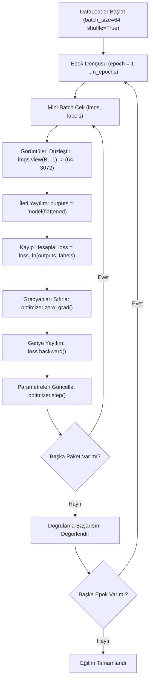

# Kuşları Uçaklardan Ayırmak: Görüntülerden Öğrenme

<!-- toc -->

<div style="margin-bottom: 20px;">
  <a href="https://colab.research.google.com/github/emreaslan7/ai/blob/main/notebooks/deep-learning-with-pytorch/07-telling-birds-from-airplanes.ipynb" target="_blank">
    
  </a>
</div>

6. Bölümde, sentetik ve tek boyutlu sıcaklık verilerini kullanarak ilk çok katmanlı yapay sinir ağımızı inşa edip eğitmiştik. Doğrusal (afin) dönüşümler ile doğrusal olmayan aktivasyon fonksiyonlarını ardışık katmanlar halinde birleştirmenin, bir yapay sinir ağına keyfi doğrusal olmayan eğrileri yakalama yeteneği (**Evrensel Yaklaşıklık Teoremi**) kazandırdığını gözlemledik. Ancak gerçek dünyadaki makine öğrenmesi problemleri nadiren temiz ve düşük boyutlu skaler dizilerden ibarettir. Görsel algılama—nesneleri birbirinden ayırt etme, dokuları tanıma ve sahneleri ayrıştırma yeteneğimiz—konumsal kaymalara, ışık değişimlerine ve karmaşık anlamsal hiyerarşilere tabi olan çok yüksek boyutlu piksel matrisleri üzerinde çalışır.

Bu bölümde, *Deep Learning with PyTorch (2nd Edition)* kitabının 7. Bölümünü izleyerek temel bir bilgisayarlı görü problemini ele alıyoruz: **gerçek dünya görüntülerini sınıflandırmak**. İncelememizi klasik **CIFAR-10** kıyaslama veri kümesi üzerine temellendiriyor ve problemi ilk aşamada **kuşlar** ile **uçaklar** arasındaki ikili bir sınıflandırmaya indirgiyoruz. Bu süreçte `Dataset` ve `DataLoader` ile standart PyTorch veri işleme boru hatlarını kuracak, kanal bazlı istatistiksel normalizasyon yapacak, sınıflandırma kayıp fonksiyonlarının (**Softmax**, **NLLLoss** ve **CrossEntropyLoss**) matematiksel temellerini inceleyecek, tamamen bağlı (dense) bir temel model eğitecek ve bizi **Konvolüsyonel Sinir Ağlarına (CNN)** yönlendiren kritik yapısal sınırları keşfedeceğiz.

---

## 1. Görüntü Sınıflandırma ve CIFAR-10 Kıyaslama Veri Kümesi

Görsel sınıflandırma, matematiksel olarak yüksek boyutlu uzamsal ızgaralardan ayrık kategorik dağılımlara yapılan bir eşlemedir:
$$ f: \mathbb{R}^{C \times H \times W} \longrightarrow \Delta^{K-1} $$
Burada $C$ renk kanalı sayısını, $H \times W$ uzamsal çözünürlüğü ve $\Delta^{K-1}$ ise $K$ farklı sınıf üzerindeki olasılık simpleksini temsil eder.

### 1.1 CIFAR-10 Veri Kümesinin Mimarisi

Alex Krizhevsky, Vinod Nair ve Geoffrey Hinton tarafından derlenen **CIFAR-10** veri kümesi, bilgisayarlı görü alanında standart bir referans noktasıdır. 10 farklı ve birbirini dışlayan sınıfa dengeli biçimde dağıtılmış 60.000 adet $32 \times 32$ renkli (RGB) görüntü içerir:
* **Taşıtlar:** `airplane` (uçak), `automobile` (otomobil), `ship` (gemi), `truck` (kamyon)
* **Hayvanlar:** `bird` (kuş), `cat` (kedi), `deer` (geyik), `dog` (köpek), `frog` (kurbağa), `horse` (at)

Veri kümesi, 50.000 eğitim ve 10.000 test görüntüsü olmak üzere iki ana parçaya bölünmüştür (her sınıf için sırasıyla 5.000 eğitim ve 1.000 test örneği).

<figure style="display:flex; justify-content: center; margin: 25px 0;">
  <div style="text-align: center;">
    
    <figcaption style="margin-top: 0.6em; text-align: center; font-size: 13px; color: #888;"><em>Şekil 7.1: CIFAR-10 veri kümesindeki 10 farklı sınıfı temsil eden örnek görüntüler (orijinal 32x32 piksel çözünürlüğünde).</em></figcaption>
  </div>
</figure>

3 renk kanallı ve $32 \times 32$ boyutundaki tek bir görüntü, $3 \times 32 \times 32 = 3.072$ adet ayrık sayısal değerden oluşur. Günümüzün çok megapikselli kamera sensörleriyle karşılaştırıldığında küçük görünse de, bu çözünürlük algoritmik ayrım için gereken temel uzamsal ve kromatik özellikleri barındırırken, standart CPU ve giriş seviyesi GPU donanımlarında dakikalar içinde eğitilebilecek kadar hafiftir.

---

## 2. PyTorch Dataset ile Veri Yükleme Protokolü

Endüstriyel derin öğrenme sistemlerinde veri yükleme ve ön işleme adımları, model mimarisinden ve eğitim döngülerinden kesin bir şekilde ayrıştırılmalıdır. PyTorch bu sorumluluk ayrımını **`torch.utils.data.Dataset`** soyut sınıfı üzerinden standartlaştırır.

### 2.1 `Dataset` Arayüz Protokolü

Herhangi bir PyTorch `Dataset` alt sınıfı, iki temel Python dunder metodunu uygulayarak tek tip bir arayüz sunar:
1. `__len__(self)`: Koleksiyondaki toplam eleman sayısını döndürür; Python'ın yerleşik `len(dataset)` fonksiyonuyla tetiklenir.
2. `__getitem__(self, index)`: İlgili tamsayı `index` konumundaki örneği ve onun hedef etiketini döndürür; `dataset[index]` indeksleme sözdizimiyle çağrılır.

<figure style="display:flex; justify-content: center; margin: 25px 0;">
  <div style="text-align: center;">
    
    <figcaption style="margin-top: 0.6em; text-align: center; font-size: 13px; color: #888;"><em>Şekil 7.2: PyTorch Dataset protokolü: indekslenebilir bir veri koleksiyonunu standart `__len__()` ve `__getitem__(index)` arayüzleriyle soyutlayan yapı.</em></figcaption>
  </div>
</figure>

### 2.2 CIFAR-10'u İndirme ve Yükleme

PyTorch ekosistemi, **`torchvision`** kütüphanesi sayesinde popüler veri kümelerine doğrudan erişim sağlar. `torchvision.datasets.CIFAR10`, varsayılan olarak ham veri paketini indirir, arşivden çıkarır ve örnekleri PIL (Python Imaging Library) formatında tamsayı hedef etiketleriyle birlikte sunar.

Eğitim ve doğrulama kümelerini tanımlayalım:

```python
from pathlib import Path
import torchvision
from torchvision import datasets

# Yerel veri önbellek dizinini belirleme
data_path = Path("./data/cifar10")
data_path.mkdir(parents=True, exist_ok=True)

# CIFAR-10 eğitim kümesini indirme ve yükleme (50.000 görüntü)
cifar10 = datasets.CIFAR10(
    root=str(data_path),
    train=True,
    download=True
)

# CIFAR-10 test/doğrulama kümesini indirme ve yükleme (10.000 görüntü)
cifar10_val = datasets.CIFAR10(
    root=str(data_path),
    train=False,
    download=True
)

print(f"Eğitim kümesi boyutu: {len(cifar10)}")
print(f"Doğrulama kümesi boyutu: {len(cifar10_val)}")
```

`cifar10[99]` ile rastgele bir eleman sorgulandığında 2 elemanlı bir demet (`tuple`) elde edilir:

```python
img, label = cifar10[99]
class_names = ['airplane', 'automobile', 'bird', 'cat', 'deer', 
               'dog', 'frog', 'horse', 'ship', 'truck']

print(f"Görüntü nesne tipi: {type(img)}")
print(f"Hedef tamsayı etiketi: {label} ({class_names[label]})")
```

Dönen nesne, $(32, 32)$ piksel boyutunda bir PIL RGB görüntüsüdür.

<figure style="display:flex; justify-content: center; margin: 25px 0;">
  <div style="text-align: center;">
    
    <figcaption style="margin-top: 0.6em; text-align: center; font-size: 13px; color: #888;"><em>Şekil 7.3: Koordinat eksenleriyle görselleştirilmiş 32x32 piksel boyutunda tek bir CIFAR-10 otomobil görüntüsü.</em></figcaption>
  </div>
</figure>

---

## 3. Veri Dönüşümleri ve Tensör Normalizasyonu

Yapay sinir ağları ham PIL görüntü nesnelerini doğrudan işleyemez; matris hesaplamaları için belirli boyutlara ve istatistiksel dağılıma sahip kayan noktalı tensörler gereklidir. `torchvision.transforms` modülü, indeksleme anında verileri dönüştüren zincirlenebilir operatörler sunar.

### 3.1 Görüntüleri Tensöre Çevirme: `transforms.ToTensor`

`transforms.ToTensor()` operatörü iki kritik işlemi aynı anda yürütür:
1. **Eksen Sıralaması (Channel Transposition):** Standart PIL görüntü formatı olan HWC (Yükseklik, Genişlik, Kanal) dizilimini PyTorch'un yerel tensör formatı olan **CHW** (Kanal, Yükseklik, Genişlik) düzenine çevirir.
2. **Sayısal Ölçeklendirme:** $[0, 255]$ aralığındaki 8-bitlik işaretsiz tamsayıları (`uint8`), $[0.0, 1.0]$ aralığındaki 32-bitlik kayan noktalı sayılara (`float32`) dönüştürür:
   $$ x_{\text{float}} = \frac{x_{\text{uint8}}}{255.0} $$

```python
from torchvision import transforms

# PIL Görüntüsünü -> (C, H, W) 32-bit Kayan Noktalı Tensöre Dönüştürme
to_tensor = transforms.ToTensor()
img_t, _ = to_tensor(img), label

print(f"Tensör boyutu: {img_t.shape}")
print(f"Veri tipi:     {img_t.dtype}")
print(f"Dinamik aralık: min={img_t.min():.4f}, max={img_t.max():.4f}")
```

Tensörün boyutu tam olarak `(3, 32, 32)` olur: 3 renk kanalı (Kırmızı, Yeşil, Mavi), 32 dikey satır ve 32 yatay sütun.

### 3.2 Naif Piksel Filtrelemenin Sınırları

Derin öğrenme modellerine geçmeden önce akla naif sezgisel kurallar gelebilir: örneğin kırmızı pikselleri sayarak arabaları veya kuşları tespit edebilir miyiz?

<figure style="display:flex; justify-content: center; margin: 25px 0;">
  <div style="text-align: center;">
    
    <figcaption style="margin-top: 0.6em; text-align: center; font-size: 13px; color: #888;"><em>Şekil 7.4: Naif kural denemesi: kırmızı kanalın belirgin şekilde baskın olduğu pikselleri eşikleme ($R > 1.4 \times B$).</em></figcaption>
  </div>
</figure>

Kırmızı kanal yoğunluğunun mavi kanala oranını eşikleyerek kırmızı bir spor arabanın gövdesini kabaca izole edebiliriz. Ancak mavi veya beyaz arabalarla, ya da kırmızı tüylü bir kuşla karşılaşıldığında bu yaklaşım tamamen çöker. Elle yazılmış tekil piksel kuralları, görsel dünyadaki **öteleme değişmezliğini** (*translation invariance*) ve **anlamsal hiyerarşiyi** yakalayamaz.

### 3.3 Kanallar Boyunca İstatistiksel Normalizasyon

Normalizasyon yapılmadığında piksel değerleri $[0.0, 1.0]$ aralığındadır. Girişlerin sıfır merkezli olmaması gradyan inişini olumsuz etkiler:
* İlk katmana giren tüm değerler pozitif olduğunda, ağırlık güncellemelerinin gradyan işaretleri birbirine bağımlı hale gelir ve zigzag çizerek yavaş yakınsar.
* Farklı renk kanallarının ortalamalarındaki dengesizlikler nöron aktivasyonlarını asimetrik şekilde kaydırır.

Girdilerin sıfır ortalama ve birim varyansa sahip olmasını sağlamak için **Z-skoru kanal normalizasyonu** uygulanır:
$$ x\_{\text{norm}, c} = \frac{x\_c - \mu\_c}{\sigma\_c} $$
Burada $\mu\_c$ ve $\sigma\_c$, tüm eğitim kümesindeki ($N = 50.000$ görüntü) $c \in \{0, 1, 2\}$ kanalının ortalaması ve standart sapmasıdır.

Tüm eğitim kümesi üzerinden bu değerleri hesaplayalım:

```python
import torch

# ToTensor dönüşümlü eğitim kümesi
tensor_cifar10 = datasets.CIFAR10(
    root=str(data_path),
    train=True,
    download=False,
    transform=transforms.ToTensor()
)

# 50.000 görüntüyü tek bir tensörde yığma: (50000, 3, 32, 32)
# Uzamsal piksel ortalamalarını almak için (3, 50000 * 32 * 32) şekline dönüştürme
imgs = torch.stack([img_t for img_t, _ in tensor_cifar10], dim=3)
print(f"Toplu tensör boyutu: {imgs.shape}")  # (3, 32, 32, 50000)

mean = imgs.view(3, -1).mean(dim=1)
std = imgs.view(3, -1).std(dim=1)

print(f"Kanal Bazlı Ortalama (Mean): {mean}")
print(f"Kanal Bazlı Std:             {std}")
```

CIFAR-10 için elde edilen standart ampirik değerler şunlardır:
$$ \mu = [0.4914, 0.4822, 0.4465], \quad \sigma = [0.2470, 0.2435, 0.2616] $$

Bu değerleri `transforms.Compose` boru hattına entegre edelim:

```python
transformed_cifar10 = datasets.CIFAR10(
    root=str(data_path),
    train=True,
    download=False,
    transform=transforms.Compose([
        transforms.ToTensor(),
        transforms.Normalize(
            mean=(0.4914, 0.4822, 0.4465),
            std=(0.2470, 0.2435, 0.2616)
        )
    ])
)

transformed_cifar10_val = datasets.CIFAR10(
    root=str(data_path),
    train=False,
    download=False,
    transform=transforms.Compose([
        transforms.ToTensor(),
        transforms.Normalize(
            mean=(0.4914, 0.4822, 0.4465),
            std=(0.2470, 0.2435, 0.2616)
        )
    ])
)
```

---

## 4. Problem Tanımı: Kuşlar ve Uçaklar

10 sınıflı karmaşık bir yapıyla başlamak yerine, kavramsal temelleri berrak bir şekilde kavramak amacıyla problemi **ikili sınıflandırmaya** (*binary classification*) indirgiyoruz: gökyüzündeki **kuşları** ve **uçakları** birbirinden ayırmak.

<figure style="display:flex; justify-content: center; margin: 25px 0;">
  <div style="text-align: center;">
    
    <figcaption style="margin-top: 0.6em; text-align: center; font-size: 13px; color: #888;"><em>Şekil 7.5: İkili sınıflandırma senaryosu: gökyüzünü izleyen otomatik bir kameranın uçakları çöpe atıp kuşları saklaması.</em></figcaption>
  </div>
</figure>

### 4.1 Alt Kümeleme ve Etiketleri Yeniden Haritalama

CIFAR-10 indekslerinde:
* `airplane` sınıfı `0` indeksine,
* `bird` sınıfı ise `2` indeksine karşılık gelir.

Bu iki sınıfı filtreleyip etiketleri $[0, 1]$ aralığına haritalayalım:
* `airplane` ($0$) $\longrightarrow 0$
* `bird` ($2$) $\longrightarrow 1$

```python
label_map = {0: 0, 2: 1}
class_names = ['airplane', 'bird']

# Eğitim alt kümesini filtreleme
cifar2 = [
    (img, label_map[label])
    for img, label in transformed_cifar10
    if label in [0, 2]
]

# Doğrulama alt kümesini filtreleme
cifar2_val = [
    (img, label_map[label])
    for img, label in transformed_cifar10_val
    if label in [0, 2]
]

print(f"Filtrelenmiş Eğitim Örnekleri (cifar2):    {len(cifar2)}")       # 10.000 (5.000 uçak, 5.000 kuş)
print(f"Filtrelenmiş Doğrulama Örnekleri (cifar2_val): {len(cifar2_val)}") # 2.000 (1.000 uçak, 1.000 kuş)
```

Artık elimizde 10.000 dengeli eğitim ve 2.000 dengeli test görüntüsü bulunmaktadır.

---

## 5. Temel Tamamen Bağlı (Fully Connected) Sınıflandırıcı

Standart bir ileri beslemeli yapay sinir ağı katmanı (`nn.Linear`), 2 boyutlu bir renkli görüntüyü nasıl işler? Doğrusal katmanlar tek boyutlu bir $\mathbf{x} \in \mathbb{R}^{d_{\text{in}}}$ vektörü bekler. Bu nedenle 3 boyutlu $(C, H, W)$ tensörünü düzleştirerek (**flatten**) $3 \times 32 \times 32 = 3.072$ elemanlı tek bir özellik vektörüne dönüştürmeliyiz.

<figure style="display:flex; justify-content: center; margin: 25px 0;">
  <div style="text-align: center;">
    
    <figcaption style="margin-top: 0.6em; text-align: center; font-size: 13px; color: #888;"><em>Şekil 7.6: 2B görüntü ızgarasının 1B vektöre düzleştirilmesi ve sınıf olasılıkları üretmek üzere tamamen bağlı katmanlardan geçirilmesi.</em></figcaption>
  </div>
</figure>

### 5.1 Mimari ve Parametre Sayısı Patlaması

`nn.Sequential` kullanarak 512 gizli nörona sahip iki katmanlı bir model kuralım:

```python
import torch.nn as nn

n_out = 2  # İkili sınıflandırma: uçak ve kuş

model = nn.Sequential(
    nn.Linear(3072, 512),
    nn.Tanh(),
    nn.Linear(512, n_out)
)
```

Bu mütevazı modeldeki eğitilebilir parametre sayısını hesaplayalım:
1. **1. Katman (`nn.Linear(3072, 512)`):**
   * Ağırlık matrisi: $512 \times 3.072 = 1.572.864$
   * Yanlılık (bias) vektörü: $512$
   * Toplam 1. Katman: $1.573.376$ parametre
2. **2. Katman (`nn.Linear(512, 2)`):**
   * Ağırlık matrisi: $2 \times 512 = 1.024$
   * Yanlılık vektörü: $2$
   * Toplam 2. Katman: $1.026$ parametre
3. **Toplam Model Parametreleri:**
   $$ 1.573.376 + 1.026 = 1.574.402 \text{ parametre} $$

```python
num_params = sum(p.numel() for p in model.parameters() if p.requires_grad)
print(f"Toplam Eğitilebilir Parametre Sayısı: {num_params:,}")
```

> [!WARNING]
> Sadece $32 \times 32$ boyutundaki minik görüntüleri sınıflandırmak için bile **1,57 milyondan fazla parametre** gerekmektedir! Girdimiz standart bir akıllı telefon fotoğrafı ($1080 \times 1920 \times 3 \approx 6,22 \times 10^6$ piksel) olsaydı, sadece ilk gizli katman **3,18 milyardan fazla parametre** gerektirecek ve tek bir örnek dahi işlenmeden bellek sınırlarını aşacaktı.

---

## 6. Çıktı Gösterimi, Softmax ve Sınıflandırma Kayıpları

6. Bölümdeki regresyon probleminde model çıktısı sınırsız bir reel sayı $\hat{y} \in \mathbb{R}$ idi ve Ortalama Kare Hata (MSE) ile değerlendiriliyordu. Sınıflandırmada ise çıktımızın **olasılık** değerleri olması gerekir: negatif olamazlar ve toplamları $1$'e eşit olmalıdır.

### 6.1 Softmax Aktivasyon Fonksiyonu

Modelin ham çıkış skalerleri $\mathbf{z} = [z_0, z_1, \dots, z_{K-1}]$ (**logit**) olarak adlandırılır. **Softmax** fonksiyonu her logitin üssünü alır ($e^{z_i}$) ve bu değerleri toplamlarına bölerek normalize eder:
$$ \sigma(\mathbf{z})\_i = \frac{e^{z\_i}}{\sum\_{j=0}^{K-1} e^{z\_j}} $$

<figure style="display:flex; justify-content: center; margin: 25px 0;">
  <div style="text-align: center;">
    
    <figcaption style="margin-top: 0.6em; text-align: center; font-size: 13px; color: #888;"><em>Şekil 7.7: Softmax fonksiyonu: sınırsız logit değerlerini $[0, 1]$ aralığında ve toplamı 1 olan geçerli bir olasılık dağılımına dönüştürür.</em></figcaption>
  </div>
</figure>

Softmax dönüşümü iki vazgeçilmez matematiksel özelliği garanti eder:
1. **Pozitiflik ve Sınırlılık:** Her reel $z_i$ için $e^{z_i} > 0$ olduğundan, $0 \le \sigma(\mathbf{z})\_i \le 1$.
2. **Toplamın 1 Olması:**
   $$ \sum\_{i=0}^{K-1} \sigma(\mathbf{z})\_i = \frac{\sum\_{i=0}^{K-1} e^{z\_i}}{\sum\_{j=0}^{K-1} e^{z\_j}} = 1.0 $$

```python
x = torch.tensor([1.0, 2.0, 3.0])
softmax = nn.Softmax(dim=0)
probs = softmax(x)

print(f"Logit Değerleri:       {x.tolist()}")
print(f"Olasılık Değerleri:   {probs.tolist()}")
print(f"Olasılıklar Toplamı:  {probs.sum().item():.6f}")
```

### 6.2 Sınıflandırmada Neden MSE Kullanılmaz?

Neden hedef etiketleri one-hot vektörlere ($[1, 0]$ uçak, $[0, 1]$ kuş) çevirip MSE ile eğitemeyiz?

Olasılıklar doygunluğa ulaştığında (örneğin hedef $1$ iken model $p \to 0$ tahmin ettiğinde), karesel hatanın türevi logite göre sıfıra yaklaşır:
$$ \frac{\partial \mathcal{L}\_{\text{MSE}}}{\partial z} \propto p(1 - p)(p - y) $$
$p \approx 0$ veya $p \approx 1$ durumlarında $p(1 - p)$ terimi gradyanı yok eder (**vanishing gradient**). Model feci şekilde hatalı bir tahminde bulunsa dahi gradyanlar sıfırlandığı için öğrenme kilitlenir.

<figure style="display:flex; justify-content: center; margin: 25px 0;">
  <div style="text-align: center;">
    
    <figcaption style="margin-top: 0.6em; text-align: center; font-size: 13px; color: #888;"><em>Şekil 7.8: 3B kayıp yüzeyi karşılaştırması: Cross-Entropy yanlış tahminlerde dik ve güçlü gradyanlar sağlarken, MSE düzleşerek gradyanları boğar.</em></figcaption>
  </div>
</figure>

### 6.3 Negatif Log-Olabilirlik (NLL) ve Çapraz Entropi (Cross-Entropy)

Maksimum olabilirlik kestiriminde (MLE), modelin doğru sınıfa atadığı olasılığı ($p\_{\text{target}}$) maksimize etmek isteriz:
$$ \mathcal{P}(\text{veri} \mid \theta) = \prod\_{i=1}^N p\_{i, y\_i} $$
Bu çarpımın negatif logaritmasını almak, problemi pozitif cezaların toplamına dönüştürür:
$$ \mathcal{L}\_{\text{NLL}} = - \log(p\_{\text{target}}) $$

<figure style="display:flex; justify-content: center; margin: 25px 0;">
  <div style="text-align: center;">
    
    <figcaption style="margin-top: 0.6em; text-align: center; font-size: 13px; color: #888;"><em>Şekil 7.9: Hedef sınıf olasılığına göre NLL kayıp eğrisi. $p \to 1$ iken kayıp 0'a iner; $p \to 0$ iken kayıp sonsuza uçar.</em></figcaption>
  </div>
</figure>

$-\log(p)$ fonksiyonunun dinamiklerine dikkat ediniz:
* Model $p\_{\text{target}} = 0.99$ atadığında: $\mathcal{L}\_{\text{NLL}} = -\log(0.99) \approx 0.01$ (neredeyse sıfır ceza).
* Model $p\_{\text{target}} = 0.50$ atadığında: $\mathcal{L}\_{\text{NLL}} = -\log(0.50) \approx 0.693$.
* Model $p\_{\text{target}} = 0.01$ atadığında: $\mathcal{L}\_{\text{NLL}} = -\log(0.01) \approx 4.605$.
* $p\_{\text{target}} \to 0$ iken $\mathcal{L}\_{\text{NLL}} \to +\infty$. Gradyan asla kaybolmaz, aksine model kuvvetle cezalandırılır!

PyTorch'ta `nn.LogSoftmax` katmanı ile `nn.NLLLoss()` kayıp fonksiyonunu birleştirmek bu formülasyonu uygular:

```python
model = nn.Sequential(
    nn.Linear(3072, 512),
    nn.Tanh(),
    nn.Linear(512, 2),
    nn.LogSoftmax(dim=1)
)

loss_fn = nn.NLLLoss()
```

> [!TIP]
> **Sayısal Kararlılık İçin `nn.CrossEntropyLoss`:**  
> Pratikte son katmana `nn.LogSoftmax()` koyup ardından `nn.NLLLoss()` çalıştırmak yerine, son katmanı ham logit $\mathbf{z}$ verecek şekilde bırakıp doğrudan **`nn.CrossEntropyLoss()`** kullanılır. PyTorch arka planda log-softmax ve NLL işlemlerini **LogSumExp hilesi** ile birleştirerek büyük veya küçük logit değerlerinde oluşabilecek kayan nokta taşmalarını (*overflow/underflow*) tamamen engeller.

---

## 7. Optimizasyon Dinamikleri: Mini-Batch ve DataLoader

10.000 eğitim görüntüsü üzerinde gradyanları hesaplayıp 1,57 milyon ağırlığı nasıl güncellemeliyiz?

### 7.1 Full-Batch, Stokastik ve Mini-Batch Gradyan İnişi

<figure style="display:flex; justify-content: center; margin: 25px 0;">
  <div style="text-align: center;">
    
    <figcaption style="margin-top: 0.6em; text-align: center; font-size: 13px; color: #888;"><em>Şekil 7.10: Üç farklı eğitim rejimi: Full-Batch (A), Online Stokastik (B) ve Mini-Batch (C) ile Epok-İterasyon mekaniği.</em></figcaption>
  </div>
</figure>

1. **Full-Batch Gradyan İnişi:** Tüm veri kümesi ($N = 10.000$) taranıp toplam gradyan hesaplandıktan sonra tek bir ağırlık güncellemesi yapılır.
   * *Avantaj:* Kararlı ve kesin gradyan vektörü.
   * *Dezavantaj:* Adım başına çok yavaş; büyük veriler GPU belleğine sığmaz; yerel sığ çukurlara kolayca takılır.
2. **Online Stokastik Gradyan İnişi (Saf SGD):** Her bir görüntüden ($B = 1$) sonra ağırlıklar anında güncellenir.
   * *Avantaj:* Sık güncelleme ve parametre uzayında yüksek keşif kabiliyeti.
   * *Dezavantaj:* Donanım paralelleştirmesini (vektörize tensör çekirdekleri) kullanamaz; gradyan yönü çok fazla dalgalanır.
3. **Mini-Batch Gradyan İnişi:** En verimli ve endüstri standardı yaklaşım. Veriden rastgele seçilen $B$ boyutunda (örneğin $B = 64$) bir alt grup üzerinden gradyan hesaplanır:
   $$ \mathbf{g} = \frac{1}{B} \sum\_{i=1}^B \nabla\_\theta \mathcal{L}(f(\mathbf{x}\_i; \theta), y\_i) $$

<figure style="display:flex; justify-content: center; margin: 25px 0;">
  <div style="text-align: center;">
    
    <figcaption style="margin-top: 0.6em; text-align: center; font-size: 13px; color: #888;"><em>Şekil 7.11: Kayıp uzayındaki iniş yolları: Full-Batch gradyan inişinin pürüzsüz ama yavaş seyri ile Mini-Batch SGD'nin dalgalı ancak hızla hedefe yakınsayan stokastik yörüngesi.</em></figcaption>
  </div>
</figure>

### 7.2 PyTorch `DataLoader` Mimarisi

PyTorch'un **`torch.utils.data.DataLoader`** sınıfı paketleme, karıştırma (*shuffling*), bellek sabitleme (*pinned memory*) ve çok çekirdekli paralel veri çekme işlemlerini otomatikleştirir:

<figure style="display:flex; justify-content: center; margin: 25px 0;">
  <div style="text-align: center;">
    
    <figcaption style="margin-top: 0.6em; text-align: center; font-size: 13px; color: #888;"><em>Şekil 7.12: DataLoader mekanizması: Dataset içerisinden rastgele indeks setleri çekerek bunları mini-batch yığınları halinde modele besler.</em></figcaption>
  </div>
</figure>

```python
from torch.utils.data import DataLoader

train_loader = DataLoader(
    cifar2,
    batch_size=64,
    shuffle=True,
    num_workers=0
)

val_loader = DataLoader(
    cifar2_val,
    batch_size=64,
    shuffle=False,
    num_workers=0
)

# Tek bir mini-batch'i inceleme
imgs, labels = next(iter(train_loader))
print(f"Paket görüntü tensör boyutu: {imgs.shape}")    # (64, 3, 32, 32)
print(f"Paket hedef tensör boyutu:   {labels.shape}")  # (64,)
```

---

## 8. Tam Eğitim Döngüsünün Kurulması

Mini-batch SGD kullanarak tamamen bağlı sınıflandırıcımızın modüler eğitim boru hattını inşa edelim:



### 8.1 Eğitim ve Değerlendirme Fonksiyonları

```python
import torch
import torch.nn as nn
import torch.optim as optim

def train_classifier(model, train_loader, val_loader, n_epochs=50, lr=1e-2, device='cpu'):
    model = model.to(device)
    loss_fn = nn.NLLLoss()
    optimizer = optim.SGD(model.parameters(), lr=lr)

    for epoch in range(1, n_epochs + 1):
        model.train()
        total_train_loss = 0.0
        
        for imgs, labels in train_loader:
            imgs, labels = imgs.to(device), labels.to(device)
            batch_size = imgs.shape[0]
            
            # Adım 1: 4B tensörü (B, C, H, W) 2B matrise (B, C*H*W) düzleştirme
            flattened = imgs.view(batch_size, -1)
            
            # Adım 2: İleri yayılım ve kayıp hesabı
            outputs = model(flattened)
            loss = loss_fn(outputs, labels)
            
            # Adım 3: Geriye yayılım ve optimizasyon adımı
            optimizer.zero_grad()
            loss.backward()
            optimizer.step()
            
            total_train_loss += loss.item()
            
        avg_train_loss = total_train_loss / len(train_loader)
        
        # Adım 4: Doğrulama değerlendirmesi (her 10 epokta bir)
        if epoch == 1 or epoch % 10 == 0:
            val_acc = evaluate_accuracy(model, val_loader, device=device)
            print(f"Epok {epoch:2d}/{n_epochs:2d} | Eğitim Kaybı: {avg_train_loss:.4f} | Doğrulama Doğruluğu: {val_acc:.2%}")

def evaluate_accuracy(model, loader, device='cpu'):
    model.eval()
    correct = 0
    total = 0
    
    with torch.no_grad():
        for imgs, labels in loader:
            imgs, labels = imgs.to(device), labels.to(device)
            batch_size = imgs.shape[0]
            flattened = imgs.view(batch_size, -1)
            
            outputs = model(flattened)
            _, predicted = torch.max(outputs, dim=1)
            
            total += labels.shape[0]
            correct += int((predicted == labels).sum())
            
    return correct / total
```

### 8.2 Modeli Eğitme ve Sonuçlar

`LogSoftmax` katmanlı modelimizi 50 epok boyunca eğitelim:

```python
model = nn.Sequential(
    nn.Linear(3072, 512),
    nn.Tanh(),
    nn.Linear(512, 2),
    nn.LogSoftmax(dim=1)
)

train_classifier(model, train_loader, val_loader, n_epochs=50, lr=1e-2)
```

**Eğitim Seyri:**
```text
Epok  1/50 | Eğitim Kaybı: 0.5524 | Doğrulama Doğruluğu: 74.25%
Epok 10/50 | Eğitim Kaybı: 0.3541 | Doğrulama Doğruluğu: 79.80%
Epok 20/50 | Eğitim Kaybı: 0.2834 | Doğrulama Doğruluğu: 80.95%
Epok 30/50 | Eğitim Kaybı: 0.2215 | Doğrulama Doğruluğu: 81.30%
Epok 40/50 | Eğitim Kaybı: 0.1652 | Doğrulama Doğruluğu: 80.85%
Epok 50/50 | Eğitim Kaybı: 0.1189 | Doğrulama Doğruluğu: 80.40%
```

Modelimiz yaklaşık **$%80,5$ ile $%81,5$ arasında doğrulama doğruluğuna** ulaşır. Rastgele tahminden (%50) çok daha iyi olsa da, 50. epoka gelindiğinde eğitim kaybı $0.1189$'a kadar düşerken doğrulama başarısının %80 civarında tıkanması dikkat çekicidir: model aşırı öğrenmeye (**overfitting**) başlamıştır; genel görsel öznitelikleri öğrenmek yerine piksel kombinasyonlarını ezberlemektedir!

---

## 9. Tamamen Bağlı Ağların Görüntülerdeki Yapısal Sınırları

Çok katmanlı bir algılayıcı (MLP) neden karmaşık bilgisayarlı görü problemlerine kolayca ölçeklenemez? Karşımıza üç temel matematiksel ve fiziksel sınır çıkar:

### 9.1 Küresel Piksel Matris Çarpımı

`nn.Linear` katmanında her çıktı nöronu, **tüm girdi piksellerinin** bir doğrusal kombinasyonudur:

<figure style="display:flex; justify-content: center; margin: 25px 0;">
  <div style="text-align: center;">
    
    <figcaption style="margin-top: 0.6em; text-align: center; font-size: 13px; color: #888;"><em>Şekil 7.13: Tamamen bağlı ağırlık matrisi mekaniği: her çıkış pikseli, tüm girdi piksellerini kapsayan bağımsız bir ağırlık vektörüne muhtaçtır.</em></figcaption>
  </div>
</figure>

$4 \times 4$ boyutundaki (16 piksel) bir görüntüyü yine 16 piksele bağlamak için $16 \times 16$ boyutunda bir ağırlık matrisi gerekir. $1000 \times 1000$ piksellik bir görüntü için 1 milyon piksellik gizli katman açıldığında ağırlık matrisi $10^{12}$ parametreye (tek bir katman için 4 Terabayt RAM) ulaşır!

### 9.2 Uzamsal 2B Topolojinin Yok Edilmesi

Bir fotoğraf, bağımsız sayılardan oluşan rastgele bir torba değildir. Görüntünün anlamı **yerel uzamsal korelasyonda** yatar: $(r, c)$ noktasındaki bir piksel, hemen komşusu olan $(r \pm 1, c \pm 1)$ pikselleriyle sıkı bir ilişki içindedir. Görüntüyü tek boyuta düzleştirmek (`view(-1)`), $(0, 0)$ ile yanındaki $(0, 1)$ pikselini, $(0, 0)$ ile en uzaktaki $(31, 31)$ pikseliyle eşit derecede yabancı kılar. Model devasa kapasitesini hangi piksellerin yan yana olduğunu sıfırdan çözmeye çalışarak israf eder.

### 9.3 Öteleme Değişmezliğinin (Translation Invariance) Yokluğu

Görüntünün tam merkezinde yer alan bir uçak silüeti düşünelim. Model, uçağın gövde ve kanatlarına denk gelen koordinatlardaki pikseller yandığında yüksek tepki veren ağırlıklar öğrenir:

<figure style="display:flex; justify-content: center; margin: 25px 0;">
  <div style="text-align: center;">
    
    <figcaption style="margin-top: 0.6em; text-align: center; font-size: 13px; color: #888;"><em>Şekil 7.14: Temel kısıtlama: uçak deseni sadece 1 piksel sağa kaydırıldığında, sabit ağırlıklarla olan eşleşme bozulur ve aktivasyon skoru 5'ten 1'e çöker.</em></figcaption>
  </div>
</figure>

`nn.Linear` içindeki her ağırlık belirli bir koordinat indeksine kilitli olduğundan:
* Uçak yalnızca **tek bir piksel** sağa kaydığında, pikselleri tamamen farklı ağırlıklarla çarpılır!
* Model, sol üst köşedeki bir uçağın sağ alt köşedeki uçakla aynı anlamsal nesne olduğunu bilemez.
* Farklı konumlardaki nesneleri tanıyabilmek için, görüntünün olası her bir $(x, y)$ koordinatında bağımsız dedektör ağırlıklarını sıfırdan öğrenmek zorunda kalır.

---

## 10. Özet ve Konvolüsyonlara Geçiş Köprüsü

| Kavram | Tamamen Bağlı Ağ (`nn.Linear`) | Konvolüsyonel Ağ (`nn.Conv2d` - 8. Bölüm) |
| :--- | :--- | :--- |
| **Bağlantısallık** | Yoğun / Küresel (tüm girdiler tüm çıktılara bağlı) | Seyrek / Yerel (nöronlar sadece $k \times k$ alıcı alana bakar) |
| **Parametre Paylaşımı**| Yok (her uzamsal konum için bağımsız ağırlıklar) | Tam (aynı çekirdek tüm görüntü boyunca kaydırılır) |
| **Uzamsal Topoloji** | 1B düzleştirme ile yok edilir | Doğal 2B/3B tensör yapısı korunur |
| **Öteleme Değişmezliği**| Yok (konumsal kaymalara karşı kırılgandır) | Dahili (öteleme eşdeğerliği ve ortaklama katmanları) |
| **Ölçeklenebilirlik** | Çözünürlükle parametre sayısı karesel patlar | Parametre sayısı görüntü çözünürlüğünden bağımsızdır |

Bu bölümde gerçek dünya görüntülerini içe aktardık, kanal bazlı normalizasyonla standart veri hazırlık boru hattı kurduk, CIFAR-10 için işlevsel bir ikili sınıflandırıcı eğittik ve Softmax / Çapraz Entropi mekaniğini derinlemesine analiz ettik.

**8. Bölümde**, tamamen bağlı katmanların bu sınırlarını aşacak ve görsel derin öğrenmenin temel yapı taşı olan **Konvolüsyonel Sinir Ağlarını (CNN)** inşa edeceğiz!
