# Öğrenmenin Mekaniği: Parametre Tahmini, Kayıp Fonksiyonları, Autograd ve Optimizatörler

<!-- toc -->

<div style="margin-bottom: 20px;">
  <a href="https://colab.research.google.com/github/emreaslan7/ai/blob/main/notebooks/deep-learning-with-pytorch/05-the-mechanics-of-learning.ipynb" target="_blank">
    
  </a>
</div>

Son on yılda makine öğreniminin patlama yapmasıyla birlikte, deneyim ve gözlemlerden öğrenen sistemler akademik bir meraktan çıkarak modern teknolojinin ayrılmaz bir altyapısı haline geldi. Peki bir makinenin "öğrenmesi" tam olarak hangi hesaplama mekaniğine dayanır? İnsansı benzetmelerden arındırıldığında makine öğrenimi algoritmaları, özünde bir **parametre tahmini** (parameter estimation) sürecidir: matematiksel bir fonksiyonun iç katsayılarını, ürettiği çıktılar gözlemlenen gerçek dünya verileriyle örtüşene kadar sayısal olarak optimize etme işlemidir.

Bu bölümde, *Deep Learning with PyTorch (2nd Edition)* kitabının *5. Bölümü* rehberliğinde öğrenmenin tüm mekaniğini ilk ilkelerden (first principles) başlayarak inceliyoruz. Temel mekanizmaları karmaşık sinir ağı katmanlarının arkasına saklamak yerine, birimi bilinmeyen analog bir termometreyi doğrusal (lineer) bir modelle sıfırdan kalibre ediyoruz. Manuel ağırlık ayarlamalarından başlayarak kalkülüs ile analitik gradyanları türetiyor, gradyan inişini (gradient descent) sıfırdan kodluyor, ölçeklenmemiş girdilerin yol açtığı sayısal taşma (divergence) problemini çözüyor ve ardından PyTorch'un otomatik türev motoru (**Autograd**), modüler optimizatörleri (**`torch.optim`**) ile disiplinli eğitim/doğrulama (train/validation) protokollerine geçiş yapıyoruz.

---

## 1. Modellemede Zamansız Bir Ders

Gözlemlerden öngörü gücü yüksek matematiksel modeller çıkarma arayışı yüzyıllar öncesine dayanır. 1600'lerin başında Alman gökbilimci Johannes Kepler, gezegenlerin hareketine dair üç temel yasasını formüle etti. Ancak Kepler modern yerçekimi fiziğine veya genel görelilik teorisine sahip değildi; elindeki en büyük koz, hocası Tycho Brahe'nin çıplak gözle on yıllar boyunca titizlikle kaydettiği astronomik gözlem verileriydi.

<figure style="display:flex; justify-content: center; margin: 25px 0;">
  <div style="text-align: center;">
    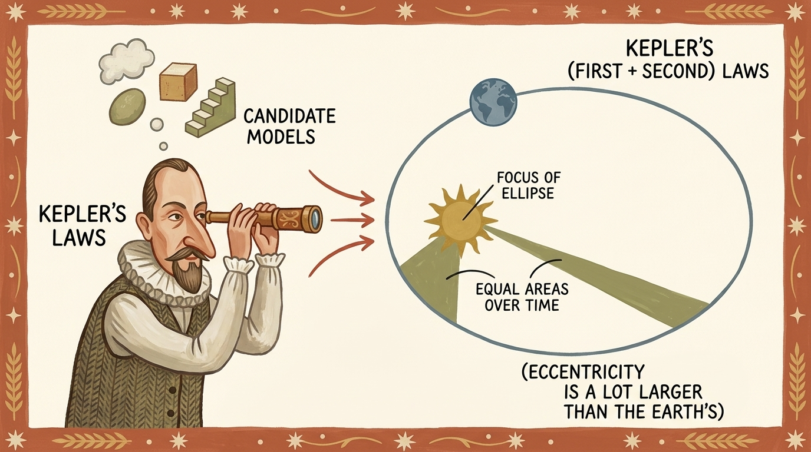
    <figcaption style="margin-top: 0.6em; text-align: center; font-size: 13px; color: #888;"><em>Şekil 5.1: Johannes Kepler'in Tycho Brahe'nin gezegen gözlemlerine aday geometrik modelleri uydurarak yörünge yasalarını keşfetmesi.</em></figcaption>
  </div>
</figure>

Kepler, elindeki koordinat verilerine uyan bir yörünge bulabilmek için yıllarca farklı geometrik modelleri denedi: dairesel yörüngeler, episikller ve yumurta biçimli eğriler. Nihayetinde, odaklarından birinde Güneş'in yer aldığı bir elips modelinin gezegenlerin konumunu kusursuz açıkladığını ve eşit zaman aralıklarında eşit alanların tarandığını keşfetti.

Kepler'in bu çalışma biçimi, modern gözetimli (supervised) makine öğreniminin temel şablonudur:
1. Fiziksel dünyadan ampirik gözlem verisi topla.
2. Parametreli bir matematiksel hipotez (model ailesi) tanımla.
3. Model tahminleri ile gerçek gözlemler arasındaki hatayı ölçecek bir kriter (kayıp/loss) belirle.
4. Bu hatayı en aza indirecek şekilde model parametrelerini sistematik olarak güncelle.

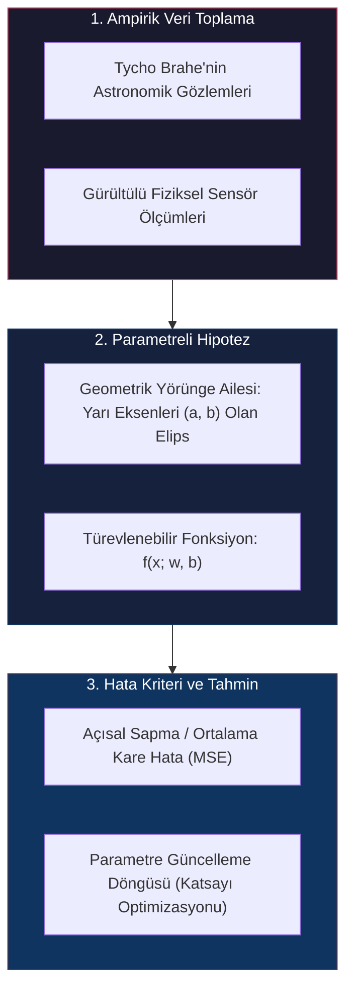

> **Temel Çıkarım:** Derin öğrenmede probleme özel elle formül çıkarmak yerine, genel ve yüksek kapasiteli fonksiyon yaklaştırıcılar (neural networks) tasarlarız. Gradyan tabanlı optimizasyon algoritmaları, modelin iç ağırlıklarını gözlemlenen verilere uyacak şekilde otomatik olarak adapte eder.

---

## 2. Öğrenme Yalnızca Parametre Tahminidir

Optimizasyon motorunun tüm çalışan parçalarını kafa karışıklığı olmadan incelemek için somut bir fiziksel problem kurguluyoruz: birimi bilinmeyen analog bir termometrenin kalibrasyonu.

### 2.1 Bilinmeyen Termometre Problemi

Eski bir antikacıdan duvara monte analog bir termometre aldığımızı düşünelim. Termometrede net bir cıva sütunu ve hassas çizgi işaretleri var; ancak üzerinde Santigrat (°C) veya Fahrenhayt (°F) olduğuna dair hiçbir birim yazmıyor. Bu termometreden okunan değerleri $t\_u$ (temperature in unknown units) olarak adlandırıyoruz.

Termometrenin ölçüm ölçeğini çözmek için kontrollü bir deney kurguluyoruz. Bu termometreyi güvenilir bir Santigrat termometresinin yanına koyarak 11 farklı ortamda (buzlu su, oda sıcaklığı, dış ortam, kaynayan çaydanlık buharı vb.) eşzamanlı ölçümler alıyoruz:

<figure style="display:flex; justify-content: center; margin: 25px 0;">
  <div style="text-align: center;">
    
    <figcaption style="margin-top: 0.6em; text-align: center; font-size: 13px; color: #888;"><em>Şekil 5.2: Makine öğreniminin zihinsel modeli: girdiler parametreli bir modele beslenir, tahminler üretilir, hedef değerlerle karşılaştırılarak kayıp hesaplanır ve ağırlıklar geriye doğru güncellenir.</em></figcaption>
  </div>
</figure>

### 2.2 Kalibrasyon Tensörlerinin Tanımlanması

Topladığımız 11 ölçüm çiftini 1 boyutlu kayan noktalı (floating-point) PyTorch tensörleri olarak temsil ediyoruz:
- $t\_c$: Santigrat cinsinden referans sıcaklıklar.
- $t\_u$: Bilinmeyen birimdeki ham termometre okumaları.

```python
import torch

# Gerçek Santigrat sıcaklık değerleri
t_c = [0.5, 14.0, 15.0, 28.0, 11.0, 8.0, 3.0, -4.0, 6.0, 13.0, 21.0]

# Bilinmeyen termometre okumaları
t_u = [35.7, 55.9, 58.2, 81.9, 56.3, 48.9, 33.9, 21.8, 48.4, 60.4, 68.4]

# Bellekte ardışık (contiguous) 32-bit float tensörler oluşturulur
t_c = torch.tensor(t_c, dtype=torch.float32)
t_u = torch.tensor(t_u, dtype=torch.float32)

print(f"t_c boyutu: {t_c.shape}, veri tipi: {t_c.dtype}")
print(f"t_u boyutu: {t_u.shape}, veri tipi: {t_u.dtype}")
```

Bu 11 noktayı iki boyutlu düzlemde çizdirdiğimizde, ölçüm gürültüsü barındıran belirgin bir doğrusal eğilim görülür:

<figure style="display:flex; justify-content: center; margin: 25px 0;">
  <div style="text-align: center;">
    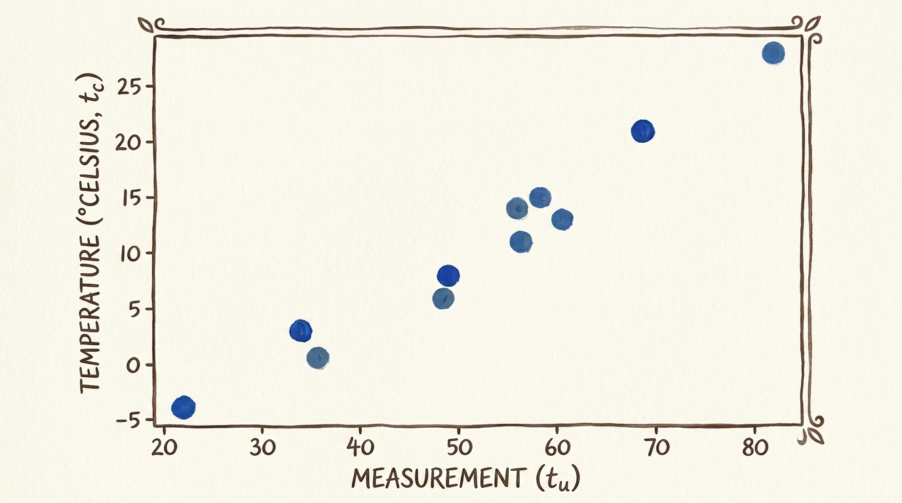
    <figcaption style="margin-top: 0.6em; text-align: center; font-size: 13px; color: #888;"><em>Şekil 5.3: Ham termometre ölçümleri ($t\_u$) ile referans Santigrat sıcaklıklarının ($t\_c$) saçılım grafiği. Doğrusal ilişki birinci dereceden bir model önerir.</em></figcaption>
  </div>
</figure>

### 2.3 Doğrusal Model Hipotezi

Verideki doğrusal örüntüye dayanarak en temel hipotezimizi kuruyoruz:

$$ t\_p = w \cdot t\_u + b $$

Burada:
- $t\_u$: Girdi ölçüm tensörü.
- $w$: Çarpımsal **ağırlık** (ölçek parametresi, birim dönüşüm katsayısı).
- $b$: Toplamsal **yanlılık** (bias/offset parametresi, sıfır noktası kayması).
- $t\_p$: Modelin tahmin ettiği Santigrat sıcaklık değeri.

PyTorch'ta bu hipotezi yalın bir Python fonksiyonu olarak ifade ederiz:

```python
def model(t_u, w, b):
    return w * t_u + b
```

---

## 3. Hatayı Ölçmek: Kayıp Fonksiyonları (Loss Functions)

Herhangi bir $(w, b)$ parametre çiftinin ne kadar başarılı olduğunu nasıl ölçeriz? Modelin ürettiği $t\_p$ tahminleri ile gerçek $t\_c$ hedefleri arasındaki farkı skaler bir sayıya indirgeyen bir ölçüte ihtiyacımız vardır: **kayıp fonksiyonu** (loss/cost function, $\mathcal{L}$).

<figure style="display:flex; justify-content: center; margin: 25px 0;">
  <div style="text-align: center;">
    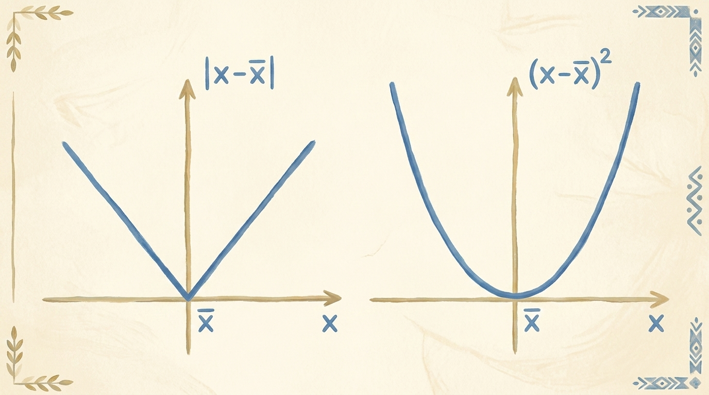
    <figcaption style="margin-top: 0.6em; text-align: center; font-size: 13px; color: #888;"><em>Şekil 5.4: Kayıp fonksiyonu geometrilerinin karşılaştırması: Ortalama Mutlak Hata ($|x - \bar{x}|$, sol) sıfır noktasında türevlenemeyen keskin bir kırılmaya sahipken, Ortalama Kare Hata ($(x - \bar{x})^2$, sağ) pürüzsüz ve konveks bir parabol eğriliği sunar.</em></figcaption>
  </div>
</figure>

### 3.1 Ortalama Kare Hata (MSE) vs. Ortalama Mutlak Hata (MAE)

Regresyon problemlerinde iki standart kayıp fonksiyonu öne çıkar:
1. **Ortalama Mutlak Hata (Mean Absolute Error - L1 Loss):**
   $$ \mathcal{L}\_{\text{MAE}} = \frac{1}{N} \sum\_{i=1}^N |t\_{p,i} - t\_{c,i}| $$
2. **Ortalama Kare Hata (Mean Squared Error - L2 Loss):**
   $$ \mathcal{L}\_{\text{MSE}} = \frac{1}{N} \sum\_{i=1}^N (t\_{p,i} - t\_{c,i})^2 $$

Sürekli optimizasyonda MSE'nin tercih edilmesinin iki kritik nedeni vardır:
- **Pürüzsüzlük ve Sürekli Türevlenebilirlik:** MAE'nin türevi sıfır hata noktasında tanımsızdır ($-1$'den $+1$'e ani sıçrama yapar). MSE ise her noktada sürekli türevlenebilirdir; minimuma yaklaştıkça gradyan büyüklüğü doğrusal olarak küçülerek modelin hedefe yumuşakça oturmasını sağlar.
- **Büyük Hataların Cezalandırılması:** Hataların karesi alındığı için büyük sapmalar katlanarak cezalandırılır ($10^\circ\text{C}$'lik bir sapma $100$ ceza alırken, $1^\circ\text{C}$'lik sapma $1$ ceza üretir). Bu durum optimizasyonu öncelikle fahiş hataları düzeltmeye zorlar.

MSE fonksiyonunu kodluyoruz:

```python
def loss_fn(t_p, t_c):
    squared_diffs = (t_p - t_c) ** 2
    return squared_diffs.mean()
```

### 3.2 Kayıp Hesabında Yayınlama (Broadcasting) Mekaniği

PyTorch tensör operasyonları otomatik **yayınlama** (broadcasting) kurallarından yararlanır. `w` ve `b` tek elemanlı skaler tensörler olsa bile, 11 elemanlı `t_u` vektörüyle çarpılırken ve toplanırken bellekte gereksiz kopyalama yapılmadan sanal olarak genişletilir:

<figure style="display:flex; justify-content: center; margin: 25px 0;">
  <div style="text-align: center;">
    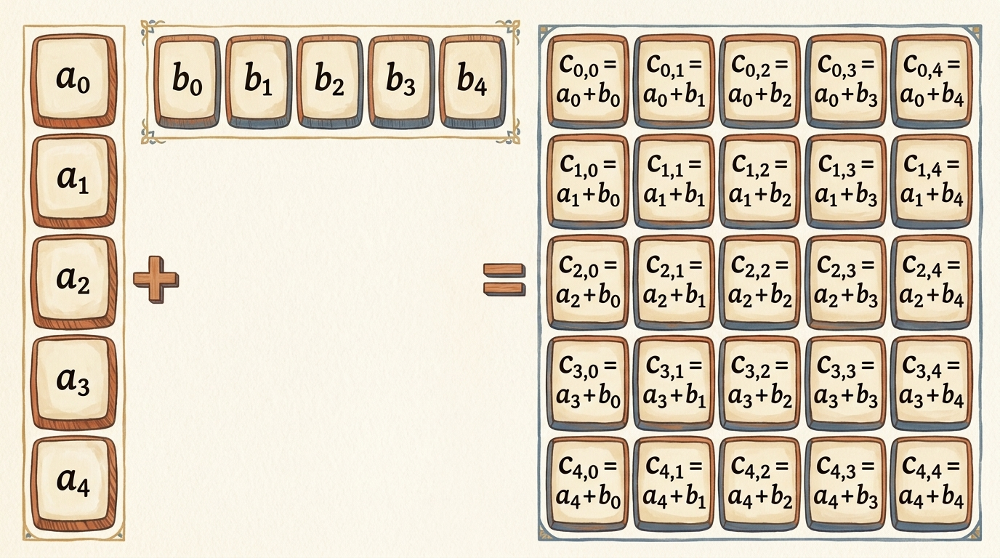
    <figcaption style="margin-top: 0.6em; text-align: center; font-size: 13px; color: #888;"><em>Şekil 5.5: Yayınlama ile sanal boyut genişletme: Uyuşmayan tensör boyutlarının (sütun ve satır vektörü) fiziksel bellek çoğaltması olmadan matrise dönüştürülmesi.</em></figcaption>
  </div>
</figure>

Rastgele bir başlangıç tahmini deneyelim: $w = 1.0, b = 0.0$:

```python
w = torch.ones(())
b = torch.zeros(())

t_p = model(t_u, w, b)
loss = loss_fn(t_p, t_c)

print(f"Başlangıç Tahminleri: {t_p}")
print(f"Başlangıç Kaybı: {loss.item():.4f}")
```

Başlangıç kaybı oldukça büyüktür ($\sim 1763.88$). Hedefimiz bu kaybı sıfıra olabildiğince yaklaştırmaktır.

---

## 4. Gradyan Boyunca İniş: El ile Optimizasyon

Kayıp değerini $\mathcal{L}$ düşürmek için $w$ ve $b$ parametrelerini nasıl değiştirmeliyiz? Bunu, iki adet ayar düğmesine (düğme $w$ ve düğme $b$) sahip bir **"Opti-o-mizer"** kontrol konsolu olarak düşünebiliriz:

<figure style="display:flex; justify-content: center; margin: 25px 0;">
  <div style="text-align: center;">
    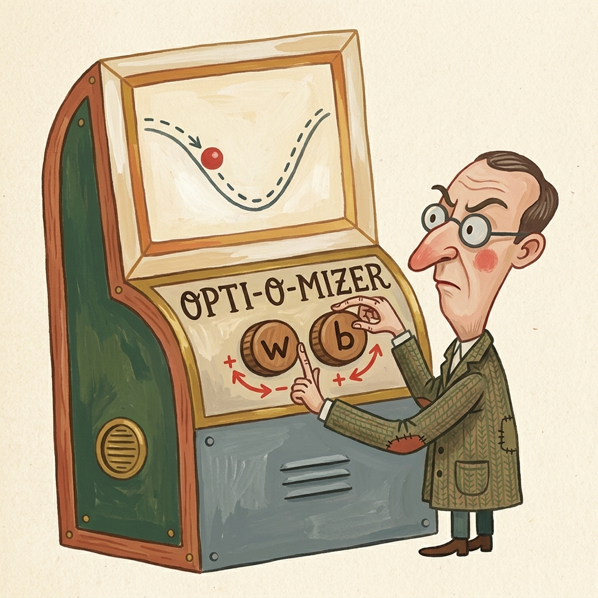
    <figcaption style="margin-top: 0.6em; text-align: center; font-size: 13px; color: #888;"><em>Şekil 5.6: 'Opti-o-mizer' parametre tahmin konsolu: hata topunu vadinin en dip noktasına indirmek için $w$ ve $b$ düğmelerini çevirmek.</em></figcaption>
  </div>
</figure>

### 4.1 Sonlu Farklar ile Sayısal Gradyan (Numerical Gradient)

$w$ düğmesini sağa doğru çok az ($\Delta w = 0.001$) çevirdiğimizde kayıp artıyor mu yoksa azalıyor mu? Bu değişim oranını sayısal olarak sonlu farklar formülüyle hesaplayabiliriz:

$$ \frac{\Delta \mathcal{L}}{\Delta w} \approx \frac{\mathcal{L}(w + \Delta w, b) - \mathcal{L}(w - \Delta w, b)}{2 \Delta w} $$

```python
delta = 0.1

# w parametresine göre sayısal değişim oranı
loss_rate_of_change_w = (loss_fn(model(t_u, w + delta, b), t_c) - 
                         loss_fn(model(t_u, w - delta, b), t_c)) / (2.0 * delta)

# b parametresine göre sayısal değişim oranı
loss_rate_of_change_b = (loss_fn(model(t_u, w, b + delta), t_c) - 
                         loss_fn(model(t_u, w, b - delta), t_c)) / (2.0 * delta)

print(f"dL/dw (sayısal): {loss_rate_of_change_w.item():.4f}")
print(f"dL/db (sayısal): {loss_rate_of_change_b.item():.4f}")
```

Eğer değişim oranı pozitifse, parametreyi artırmak kaybı artırıyor demektir; dolayısıyla parametreyi ters yönde azaltmalıyız.

<figure style="display:flex; justify-content: center; margin: 25px 0;">
  <div style="text-align: center;">
    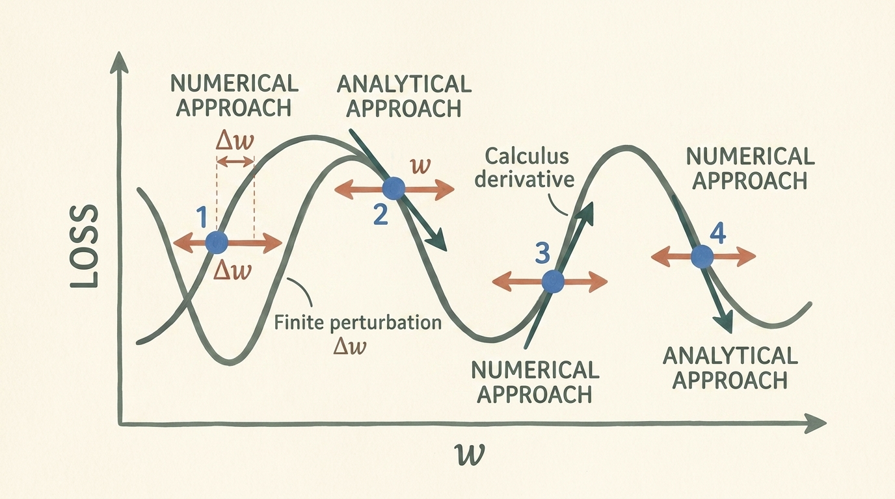
    <figcaption style="margin-top: 0.6em; text-align: center; font-size: 13px; color: #888;"><em>Şekil 5.7: Sayısal sonlu fark pertürbasyonu ($\pm \Delta w$) ile eğrinin teğeti boyunca doğrudan iniş yönünü gösteren analitik türev yaklaşımı.</em></figcaption>
  </div>
</figure>

Sayısal gradyan sezgisel olarak basit olsa da, modeldeki her bir parametre için modeli iki kez çalıştırmayı gerektirir. Milyarlarca parametresi olan modern bir yapay zeka modelinde tek bir adım için milyarlarca ileri geçiş yapmak pratikte imkansızdır.

### 4.2 Zincir Kuralı ile Analitik Gradyanlar

Düğmeleri rastgele denemek yerine, diferansiyel kalkülüsün **zincir kuralını** (chain rule) kullanarak kesin analitik türevleri doğrudan türetebiliriz.

<figure style="display:flex; justify-content: center; margin: 25px 0;">
  <div style="text-align: center;">
    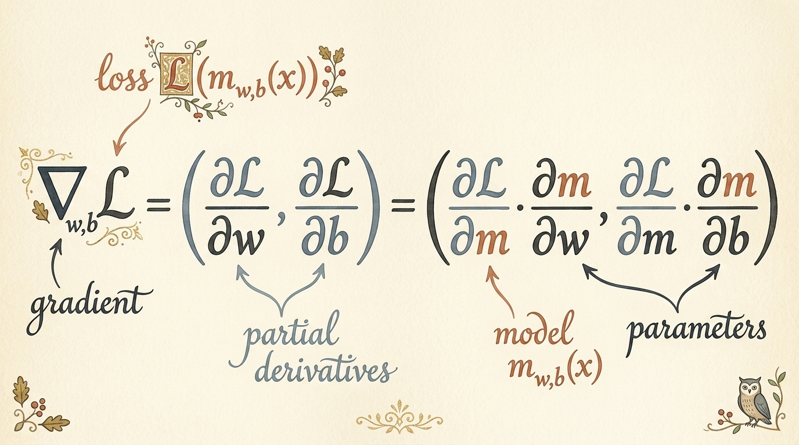
    <figcaption style="margin-top: 0.6em; text-align: center; font-size: 13px; color: #888;"><em>Şekil 5.8: Zincir kuralı ile gradyan vektörünün kısmi türevlerine ayrışımı: hatanın kayıptan model çıktılarına ve oradan iç parametrelere geriye doğru yayılması.</em></figcaption>
  </div>
</figure>

Bileşke fonksiyonumuz:

$$ \mathcal{L}(w, b) = \frac{1}{N} \sum\_{i=1}^N (t\_{p,i} - t\_{c,i})^2, \quad \text{burada } t\_{p,i} = w \cdot t\_{u,i} + b $$

Zincir kuralını uyguluyoruz:

$$ \frac{\partial \mathcal{L}}{\partial w} = \frac{\partial \mathcal{L}}{\partial t\_p} \cdot \frac{\partial t\_p}{\partial w} $$

$$ \frac{\partial \mathcal{L}}{\partial b} = \frac{\partial \mathcal{L}}{\partial t\_p} \cdot \frac{\partial t\_p}{\partial b} $$

Bileşen türevleri açalım:
1. **Kaybın Tahmine Göre Türevi:**
   $$ \frac{\partial \mathcal{L}}{\partial t\_p} = \frac{2}{N} (t\_p - t\_c) $$
2. **Tahminin Parametrelere Göre Türevi:**
   $$ \frac{\partial t\_p}{\partial w} = t\_u, \quad \frac{\partial t\_p}{\partial b} = 1 $$

Birleştirdiğimizde kesin analitik gradyan formülleri ortaya çıkar:

$$ \frac{\partial \mathcal{L}}{\partial w} = \frac{2}{N} \sum\_{i=1}^N (t\_{p,i} - t\_{c,i}) \cdot t\_{u,i} $$

$$ \frac{\partial \mathcal{L}}{\partial b} = \frac{2}{N} \sum\_{i=1}^N (t\_{p,i} - t\_{c,i}) $$

Bu türevleri Python'da fonksiyon olarak tanımlıyoruz:

```python
def dloss_fn(t_p, t_c):
    # MSE kaybının model tahminlerine göre kısmi türevi
    dsq_diffs = 2 * (t_p - t_c) / t_p.size(0)
    return dsq_diffs

def dmodel_dw(t_u, w, b):
    # Modelin ağırlık parametresine göre türevi
    return t_u

def dmodel_db(t_u, w, b):
    # Modelin yanlılık parametresine göre türevi
    return 1.0

def grad_fn(t_u, t_c, t_p, w, b):
    dloss_dtp = dloss_fn(t_p, t_c)
    dloss_dw = dloss_dtp * dmodel_dw(t_u, w, b)
    dloss_db = dloss_dtp * dmodel_db(t_u, w, b)
    return torch.stack([dloss_dw.sum(), dloss_db.sum()])
```

### 4.3 Modeli Eğitmek ve Sayısal Taşma (Divergence) Tuzağı

Kayıp fonksiyonunu minimize etmek için parametreleri gradyanın tersi yönünde, **öğrenme oranı** (learning rate, $\alpha$) ile ölçeklendirerek güncelleriz:

$$ w \leftarrow w - \alpha \frac{\partial \mathcal{L}}{\partial w}, \quad b \leftarrow b - \alpha \frac{\partial \mathcal{L}}{\partial b} $$

```python
def training_loop(n_epochs, learning_rate, params, t_u, t_c):
    for epoch in range(1, n_epochs + 1):
        w, b = params
        
        # İleri geçiş (forward pass)
        t_p = model(t_u, w, b)
        loss = loss_fn(t_p, t_c)
        
        # Geri geçiş (backward pass - analitik gradyan)
        grad = grad_fn(t_u, t_c, t_p, w, b)
        
        # Parametre güncelleme
        params = params - learning_rate * grad
        
        if epoch <= 3 or epoch % 500 == 0:
            print(f"Epoch {epoch:4d}, Kayıp {loss.item():10.4f}, Parametreler: {params}, Gradyan: {grad}")
            
    return params
```

Bu döngüyü standart görünen küçük bir öğrenme oranıyla ($\alpha = 10^{-2} = 0.01$) çalıştıralım:

```python
params = training_loop(
    n_epochs=100,
    learning_rate=1e-2,
    params=torch.tensor([1.0, 0.0]),
    t_u=t_u,
    t_c=t_c
)
```

**Çıktı:**
```
Epoch    1, Kayıp  1763.8848, Parametreler: tensor([ -44.1730,   -0.8260]), Gradyan: tensor([4517.2964,   82.6000])
Epoch    2, Kayıp 5802484.5000, Parametreler: tensor([2568.4014,   45.1637]), Gradyan: tensor([-261257.4062,   -4598.9702])
...
Epoch   10, Kayıp        inf, Parametreler: tensor([nan, nan]), Gradyan: tensor([nan, nan])
```

Optimizasyon tamamen patladı! Sadece 10 adımda kayıp sonsuza (`inf`), parametreler ise geçersiz sayıya (`nan`) dönüştü.

<figure style="display:flex; justify-content: center; margin: 25px 0;">
  <div style="text-align: center;">
    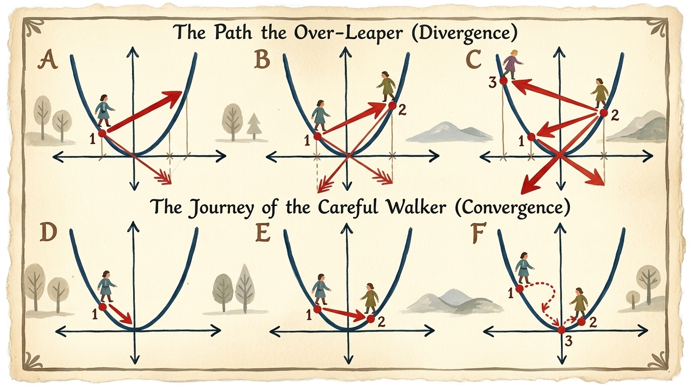
    <figcaption style="margin-top: 0.6em; text-align: center; font-size: 13px; color: #888;"><em>Şekil 5.9: Öğrenme oranı adım büyüklüğü dinamikleri: aşırı adım büyüklüğü vadiden dışarı fırlayarak ıraksamaya (üst) yol açarken, dengeli adım büyüklüğü küresel minimuma pürüzsüzce yakınsar (alt).</em></figcaption>
  </div>
</figure>

### 4.4 Girdileri Normalleştirmek: Optimizasyon Alanını Dengelemek

Neden model bu kadar şiddetle ısakadı? İlk adımdaki gradyan vektörüne dikkatlice bakalım:
$$\text{gradyan} = [4517.3, 82.6]$$

Ağırlığa ($w$) ait gradyan, yanlılığa ($b$) ait gradyandan **50 kattan fazla büyüktür**!
Çünkü ham $t\_u$ girdileri $20$ ile $80$ arasında (ortalama $\sim 50$) değerler almaktadır. Türev formülü $\frac{\partial \mathcal{L}}{\partial w} = \frac{2}{N} \sum (t\_p - t\_c) \cdot t\_u$ hatayı doğrudan $50$ ile çarparken, $\frac{\partial \mathcal{L}}{\partial b}$ hatayı yalnızca $1$ ile çarpmaktadır.

Sonuç olarak, bias parametresini kımıldatabilecek büyüklükteki bir öğrenme oranı, ağırlık parametresini vadinin karşı yamacına fırlatarak kararsızlığa neden olur.

Bu uçurumu girdileri $0.1$ ile **ölçeklendirerek (normalleştirerek)** ortadan kaldırıyoruz:

```python
t_un = 0.1 * t_u
```

Girdileri $10^{-1}$ ile çarpmak $t\_u$ değerlerini $[2.0, 8.2]$ aralığına sıkıştırır ve gradyan bileşenlerini dengeler:

```python
params = training_loop(
    n_epochs=5000,
    learning_rate=1e-2,
    params=torch.tensor([1.0, 0.0]),
    t_u=t_un,
    t_c=t_c
)
```

**Çıktı:**
```
Epoch    1, Kayıp  80.3643, Parametreler: tensor([1.7761, 0.1064]), Gradyan: tensor([-77.6140, -10.6400])
Epoch    2, Kayıp  37.5749, Parametreler: tensor([2.0812, 0.1303]), Gradyan: tensor([-30.5071,  -2.3900])
...
Epoch 5000, Kayıp   2.9276, Parametreler: tensor([  5.3671, -17.3012]), Gradyan: tensor([-0.0001,  0.0005])
```

Optimizasyon başarıyla yakınsadı ve minimum kayıp $2.9276$ olarak bulundu:
$$ w\_{\text{norm}} \approx 5.3671, \quad b \approx -17.3012 $$

Bunu orijinal birime dönüştürdüğümüzde ($t\_u = 10 \cdot t\_{\text{un}}$):
$$ w = 0.1 \cdot w\_{\text{norm}} \approx 0.5367, \quad b \approx -17.3012 $$

Fahrenhayt - Santigrat dönüşümünün gerçek fiziksel formülüyle karşılaştıralım:
$$ t\_c = \frac{5}{9} (t\_f - 32) = 0.5555 \cdot t\_f - 17.7777 $$

Modelimiz, yalnızca 11 gürültülü ölçümden yola çıkarak termodinamiğin fiziksel sıcaklık dönüşüm katsayılarını neredeyse birebir keşfetti!

<figure style="display:flex; justify-content: center; margin: 25px 0;">
  <div style="text-align: center;">
    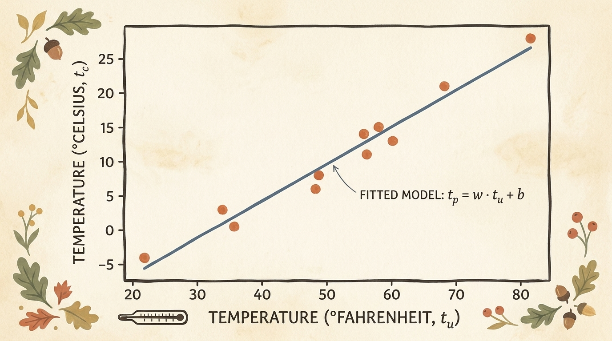
    <figcaption style="margin-top: 0.6em; text-align: center; font-size: 13px; color: #888;"><em>Şekil 5.10: Optimize edilen doğrusal regresyon doğrusunun ($t\_p = 0.5367 \cdot t\_u - 17.3012$) gerçek kalibrasyon ölçümleriyle mükemmel uyumu.</em></figcaption>
  </div>
</figure>

---

## 5. PyTorch Autograd: Otomatik Türev Alma Motoru

İki parametreli basit bir denklemde analitik türevleri elle almak mümkündü. Fakat yüzlerce katmandan ve milyarlarca ağırlıktan oluşan derin yapay sinir ağlarında türevleri elle hesaplamak imkansızdır.

PyTorch'un kalbinde bu problemi çözen motor yer alır: **Autograd** (ters modlu otomatik türevleme motoru).

<figure style="display:flex; justify-content: center; margin: 25px 0;">
  <div style="text-align: center;">
    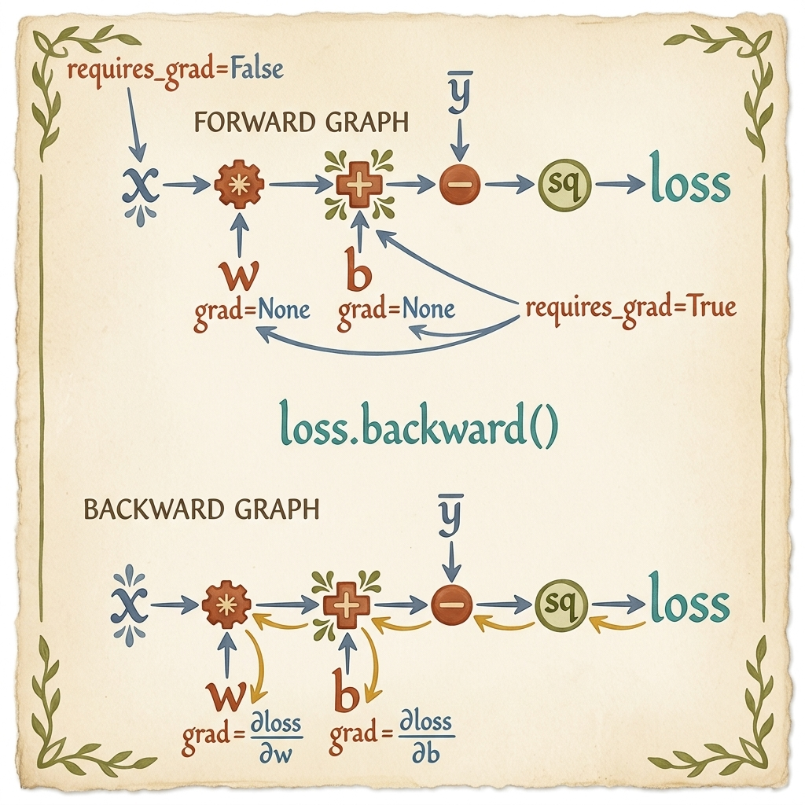
    <figcaption style="margin-top: 0.6em; text-align: center; font-size: 13px; color: #888;"><em>Şekil 5.11: İleri geçişte dinamik olarak inşa edilen ve `.backward()` çağrıldığında ters yönde taranarak `.grad` alanlarını dolduran yönlü döngüsüz hesaplama grafiği (DAG).</em></figcaption>
  </div>
</figure>

### 5.1 Dinamik Hesaplama Grafiği (DAG)

`requires_grad=True` bayrağı taşıyan bir tensör herhangi bir matematiksel işleme girdiğinde, PyTorch arka planda dinamik bir Yönlü Döngüsüz Grafik (Directed Acyclic Graph - DAG) oluşturur:
- **Yaprak Tensörler (Leaf Tensors):** Başka bir operasyondan türetilmemiş, kullanıcı tarafından tanımlanmış parametreler (`params`).
- **Düğüm Fonksiyonları (`grad_fn`):** Yapılan işlemleri temsil eden C++ operatör nesneleri (`AddBackward0`, `MulBackward0`).
- **Ters Yönde Akış:** `loss.backward()` çağrıldığında zincir kuralı grafiğin en ucundan geriye doğru işletilir ve yaprak tensörlerin `.grad` niteliği doldurulur.

```python
# requires_grad=True ile türev takibi etkinleştirilmiş parametre tensörü
params = torch.tensor([1.0, 0.0], requires_grad=True)

# İleri geçiş: PyTorch işlemleri grafiğe kaydeder
t_p = model(t_un, *params)
loss = loss_fn(t_p, t_c)

print(f"Kayıp: {loss.item():.4f}")
print(f"loss.grad_fn: {loss.grad_fn}")

# Geriye yayılım (otomatik türev)
loss.backward()

print(f"params.grad: {params.grad}")
```

**Çıktı:**
```
Kayıp: 80.3643
loss.grad_fn: <MeanBackward0 object at 0x7f8a1234>
params.grad: tensor([-77.6140, -10.6400])
```

Otomatik hesaplanan `params.grad` değerinin, elle türettiğimiz analitik gradyanla birebir aynı olduğuna dikkat edin!

### 5.2 Gradyan Birikmesi (Accumulation) ve Sıfırlama Zorunluluğu

PyTorch mimarisinin en kritik kurallarından biri: **gradyanlar varsayılan olarak üst üste toplanır (accumulate edilir)**:

$$ \text{params.grad} \leftarrow \text{params.grad} + \frac{\partial \mathcal{L}}{\partial \text{params}} $$

Eğer döngü içinde her adımda `.grad` sıfırlanmazsa, önceki adımların gradyanları yenisinin üzerine eklenir ve model saniyeler içinde patlar:

```python
if params.grad is not None:
    params.grad.zero_()
```

> **Uyarı:** Her optimizasyon adımından önce veya sonra `params.grad.zero_()` (ya da `optimizer.zero_grad()`) çağırarak gradyan tamponunu sıfırlamak zorunludur.

### 5.3 Grafiğe Takılmadan Parametre Güncellemek (`torch.no_grad()`)

Gradyan inişi adımını ($p \leftarrow p - \alpha \nabla L$) uygularken, bu çıkarma işleminin kendisinin hesaplama grafiğine dahil edilmesini engellemeliyiz. Bunun için güncellemeyi **`with torch.no_grad():`** bloğu içinde gerçekleştiririz:

```python
def training_loop_autograd(n_epochs, learning_rate, params, t_u, t_c):
    for epoch in range(1, n_epochs + 1):
        # 1. Eski gradyanları sıfırla
        if params.grad is not None:
            params.grad.zero_()
            
        # 2. İleri geçiş
        t_p = model(t_u, *params)
        loss = loss_fn(t_p, t_c)
        
        # 3. Geri geçiş (Autograd)
        loss.backward()
        
        # 4. Parametre güncelleme (grafiğe kaydetmeden)
        with torch.no_grad():
            params -= learning_rate * params.grad
            
        if epoch <= 3 or epoch % 1000 == 0:
            print(f"Epoch {epoch:4d}, Kayıp {loss.item():10.4f}, Parametreler: {params.data}")
            
    return params
```

---

## 6. PyTorch Optimizatörleri (`torch.optim`)

Ağırlıkları `params -= lr * params.grad` şeklinde elle güncellemek, eğitim döngüsünü ilkel gradyan inişine bağımlı kılar. Oysa modern derin öğrenme çok daha gelişmiş optimizasyon teknikleri kullanır:
- **Momentum:** Sığ yerel minimumlardan ve salınımlardan kurtulmak için önceki adımın hızını koruma.
- **Uyarlanabilir Adım Büyüklüğü (Adam, RMSprop):** Her parametrenin gradyan varyansına göre öğrenme oranını dinamik olarak ayarlama.

PyTorch, model mantığını optimizasyon algoritmalarından **`torch.optim`** modülü ile tamamen ayırır.

<figure style="display:flex; justify-content: center; margin: 25px 0;">
  <div style="text-align: center;">
    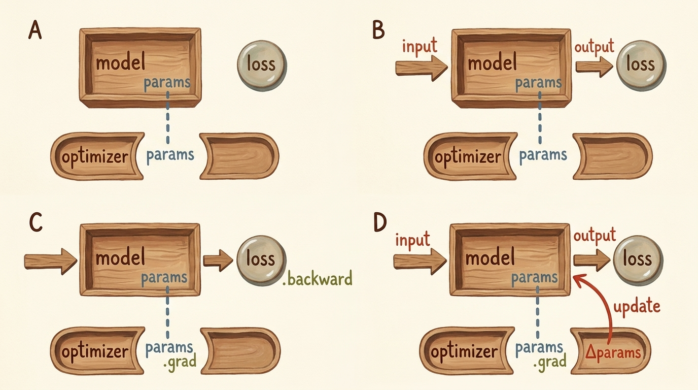
    <figcaption style="margin-top: 0.6em; text-align: center; font-size: 13px; color: #888;"><em>Şekil 5.12: `torch.optim` yapısı: optimizatör model parametrelerinin referansını tutar; `.backward()` ile doldurulan `.grad` bilgilerini kullanarak `.step()` ile parametreleri günceller.</em></figcaption>
  </div>
</figure>

### 6.1 `optim.SGD` Kullanımı

Bir optimizatör, başlatılırken eğiteceği parametre listesini alır:

```python
import torch.optim as optim

params = torch.tensor([1.0, 0.0], requires_grad=True)
learning_rate = 1e-2

# Stokastik Gradyan İnişi (SGD) optimizatörü
optimizer = optim.SGD([params], lr=learning_rate)
```

PyTorch'ta kanonik optimizasyon döngüsü üç evrensel çağrıdan oluşur:
1. `optimizer.zero_grad()`: Takip edilen parametrelerin gradyanlarını sıfırlar.
2. `loss.backward()`: Grafiği geriye doğru çalıştırarak `.grad` değerlerini doldurur.
3. `optimizer.step()`: Algoritmanın kuralına göre parametreleri yerinde (in-place) günceller.

```python
def training_loop_optimizer(n_epochs, optimizer, params, t_u, t_c):
    for epoch in range(1, n_epochs + 1):
        t_p = model(t_u, *params)
        loss = loss_fn(t_p, t_c)
        
        optimizer.zero_grad()
        loss.backward()
        optimizer.step()
        
        if epoch <= 3 or epoch % 1000 == 0:
            print(f"Epoch {epoch:4d}, Kayıp {loss.item():10.4f}, Parametreler: {params.data}")
            
    return params
```

### 6.2 `optim.Adam` ile Uyarlanabilir Öğrenme

Adam (Adaptive Moment Estimation), her parametre için bağımsız öğrenme oranları uygular. Gradyanların birinci ve ikinci momentlerini takip ettiği için, ölçeklenmemiş ham verilere karşı çok daha dirençlidir:

```python
# Ham, ölçeklenmemiş t_u üzerinde doğrudan Adam ile eğitim
params = torch.tensor([1.0, 0.0], requires_grad=True)
optimizer = optim.Adam([params], lr=1e-1)

training_loop_optimizer(
    n_epochs=2000,
    optimizer=optimizer,
    params=params,
    t_u=t_u,
    t_c=t_c
)
```

**Çıktı:**
```
Epoch    1, Kayıp  1763.8848, Parametreler: tensor([0.9000, 0.1000])
Epoch 1000, Kayıp     3.8407, Parametreler: tensor([ 0.3807, -8.4140])
Epoch 2000, Kayıp     2.9276, Parametreler: tensor([  0.5367, -17.3021])
```

Adam, ölçeklenmemiş ham veriyi bile hiçbir taşma yaşamadan saniyeler içinde çözüme ulaştırır!

---

## 7. Eğitim, Doğrulama ve Aşırı Öğrenme (Overfitting)

Bir modeli yalnızca eğitim verisi üzerindeki kaybı düşürecek şekilde eğitmek ciddi bir tehlike barındırır: model, verideki gerçek fiziksel kuralı öğrenmek yerine gürültüleri ve ölçüm hatalarını **ezberleyebilir** (overfitting):

<figure style="display:flex; justify-content: center; margin: 25px 0;">
  <div style="text-align: center;">
    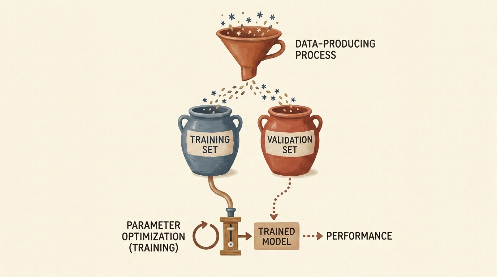
    <figcaption style="margin-top: 0.6em; text-align: center; font-size: 13px; color: #888;"><em>Şekil 5.13: Veri bölümleme mimarisi: tarafsız ve adil bir değerlendirme yapabilmek için gözlemler eğitim ve doğrulama kümelerine ayrılır.</em></figcaption>
  </div>
</figure>

### 7.1 Aşırı Öğrenmenin Anatomisi

Model kapasitesi veri miktarına göre fazla olduğunda, model her bir gürültülü noktadan geçecek dalgalı eğriler çizerek eğitim kaybını yapay olarak sıfıra indirebilir:

<figure style="display:flex; justify-content: center; margin: 25px 0;">
  <div style="text-align: center;">
    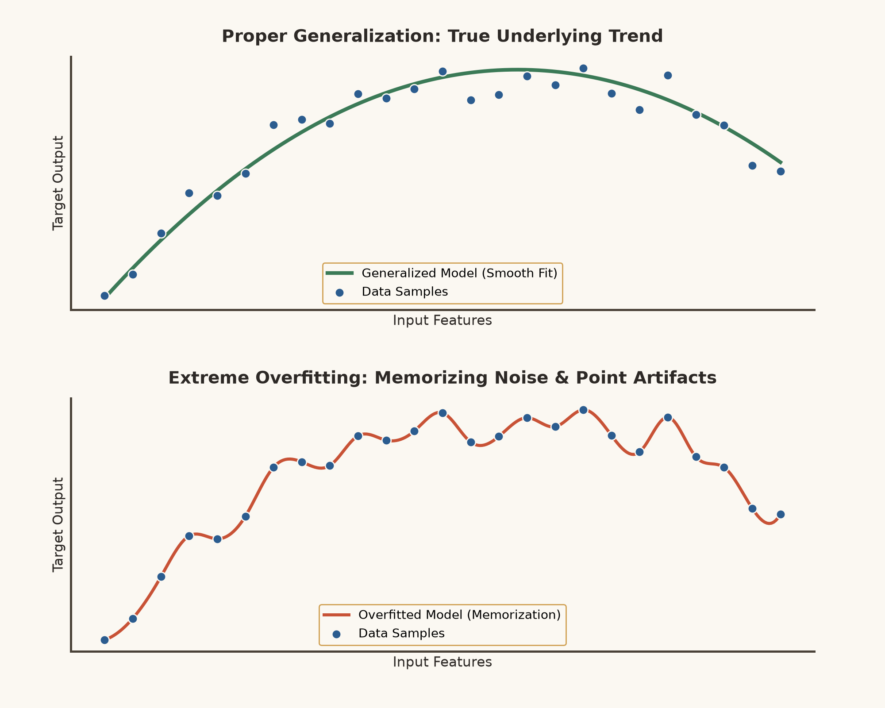
    <figcaption style="margin-top: 0.6em; text-align: center; font-size: 13px; color: #888;"><em>Şekil 5.14: Başarılı genelleme (üst) verinin ana fiziksel eğilimini yakalarken, aşırı öğrenme (alt) her bir gürültülü noktayı ezberlemek için vahşice salınır.</em></figcaption>
  </div>
</figure>

### 7.2 `torch.randperm` ile Veriyi Karıştırmak ve Bölmek

Aşırı öğrenmeyi tespit edebilmek için 11 verimizi iki ayrık kümeye böleriz:
- **Eğitim Kümesi (Training Set - %80):** Optimizatörün gradyan hesaplayıp parametreleri güncellediği küme.
- **Doğrulama Kümesi (Validation Set - %20):** Modelin görmediği veriler üzerindeki genelleme yeteneğini ölçtüğümüz küme.

İndeksleri `torch.randperm` ile rastgele ama tekrarlanabilir şekilde karıştırıyoruz:

```python
n_samples = t_u.shape[0]

# Tekrarlanabilirlik için tohum belirlenir
torch.manual_seed(42)
shuffled_indices = torch.randperm(n_samples)

n_val = int(0.2 * n_samples)

train_indices = shuffled_indices[:-n_val]
val_indices = shuffled_indices[-n_val:]

print(f"Eğitim indeksleri:   {train_indices}")
print(f"Doğrulama indeksleri: {val_indices}")

train_t_u = t_u[train_indices]
train_t_c = t_c[train_indices]

val_t_u = t_u[val_indices]
val_t_c = t_c[val_indices]

# Ölçeklenmiş tensörler
train_t_un = 0.1 * train_t_u
val_t_un = 0.1 * val_t_u
```

### 7.3 Teşhis Kayıp Eğrileri

Eğitim ve doğrulama kayıplarının iterasyonlar boyunca nasıl değiştiğini izlemek model sağlığı hakkında hayati ipuçları verir:

<figure style="display:flex; justify-content: center; margin: 25px 0;">
  <div style="text-align: center;">
    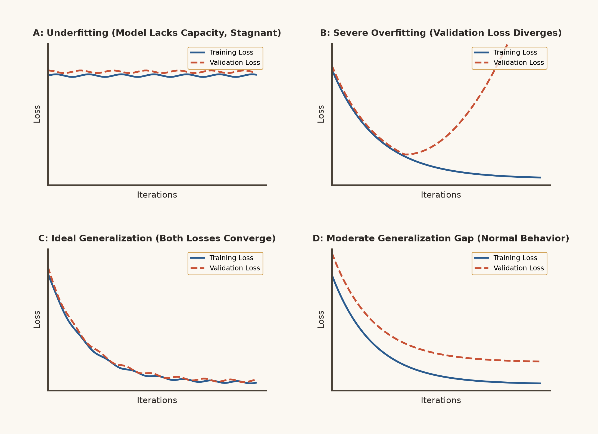
    <figcaption style="margin-top: 0.6em; text-align: center; font-size: 13px; color: #888;"><em>Şekil 5.15: Dört temel kayıp profili: (A) Yetersiz Öğrenme (Underfitting), (B) Doğrulama kaybının patladığı Şiddetli Aşırı Öğrenme (Overfitting), (C) İdeal yakınsama, (D) Sağlıklı ve kabul edilebilir genelleme farkı.</em></figcaption>
  </div>
</figure>

### 7.4 Çok Kollu Grafikler ve Türev Motorunu Kapatmak (`torch.no_grad()`)

Doğrulama aşamasında model yalnızca değerlendirilir; parametre güncellemesi yapılmaz. Eğer doğrulama kaybını normal şekilde hesaplarsak, PyTorch bu işlemler için de gereksiz yere hesaplama grafiği inşa eder ve belleği şişirir:

<figure style="display:flex; justify-content: center; margin: 25px 0;">
  <div style="text-align: center;">
    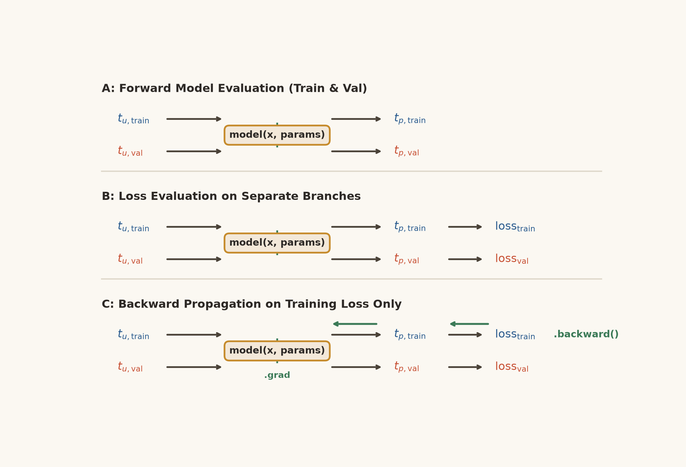
    <figcaption style="margin-top: 0.6em; text-align: center; font-size: 13px; color: #888;"><em>Şekil 5.16: Eğitim ve doğrulama için iki ayrı ileri kol. Gradyanlar yalnızca `loss_train` üzerinden akmalı; doğrulama hesaplaması `torch.no_grad()` içinde tutularak grafik yükü önlenmelidir.</em></figcaption>
  </div>
</figure>

Bellek israfını önlemek için doğrulama adımını **`with torch.no_grad():`** bağlamında çalıştırırız:

```python
def complete_training_loop(n_epochs, optimizer, params, 
                           train_t_u, val_t_u, train_t_c, val_t_c):
    for epoch in range(1, n_epochs + 1):
        # 1. Eğitim İleri ve Geri Geçişi
        train_t_p = model(train_t_u, *params)
        train_loss = loss_fn(train_t_p, train_t_c)
        
        optimizer.zero_grad()
        train_loss.backward()
        optimizer.step()
        
        # 2. Doğrulama İleri Geçişi (Grafik oluşturulmaz)
        with torch.no_grad():
            val_t_p = model(val_t_u, *params)
            val_loss = loss_fn(val_t_p, val_t_c)
            assert val_loss.requires_grad is False
            
        if epoch <= 3 or epoch % 1000 == 0:
            print(f"Epoch {epoch:4d}, Eğitim Kaybı {train_loss.item():.4f}, "
                  f"Doğrulama Kaybı {val_loss.item():.4f}")
            
    return params
```

```python
params = torch.tensor([1.0, 0.0], requires_grad=True)
optimizer = optim.SGD([params], lr=1e-2)

params = complete_training_loop(
    n_epochs=3000,
    optimizer=optimizer,
    params=params,
    train_t_u=train_t_un,
    val_t_u=val_t_un,
    train_t_c=train_t_c,
    val_t_c=val_t_c
)
```

**Çıktı:**
```
Epoch    1, Eğitim Kaybı    80.3643, Doğrulama Kaybı    38.4512
Epoch    2, Eğitim Kaybı    36.4215, Doğrulama Kaybı    17.8923
...
Epoch 1000, Eğitim Kaybı     3.0867, Doğrulama Kaybı     4.1611
Epoch 3000, Eğitim Kaybı     2.9276, Doğrulama Kaybı     3.8924
```

Hem eğitim hem de doğrulama kaybı birlikte düşük seviyelerde dengelendi; model genelleme başarısını kanıtladı.

---

## 8. Bölüm Alıştırmaları ve Analitik Çözümleri

*Deep Learning with PyTorch* kitabının *Bölüm 5.7* alıştırmasının analitik ve deneysel çözümünü inceliyoruz:

### Alıştırma 1: Modeli İkinci Dereceden Polinom ile Değiştirmek

> **Problem:** Modeli karesel bir terim içerecek şekilde yeniden tanımlayın:
> $$ t\_p = w\_2 \cdot t\_u^2 + w\_1 \cdot t\_u + b $$
> - **a.** Bu değişimi sağlamak için eğitim döngüsünün hangi kısımları değişmelidir?
> - **b.** Modelin değiştirilmesine karşı döngünün hangi kısımları tamamen bağımsızdır (agnostik)?
> - **c.** Eğitimden sonra elde edilen kayıp daha mı yüksek yoksa daha mı düşüktür?
> - **d.** Elde edilen gerçek sonuç daha mı iyi yoksa daha mı kötüdür?

#### Çözüm ve Analiz:

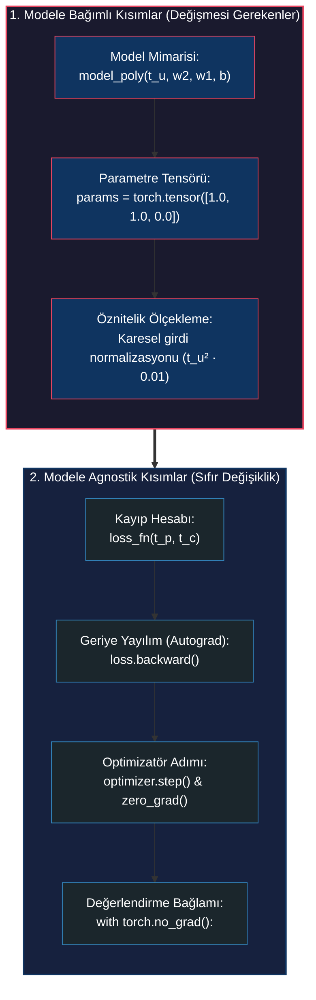

#### Deneysel Uygulama:

```python
# a. Polinom modelin tanımlanması
def model_poly(t_u, w2, w1, b):
    return w2 * (t_u ** 2) + w1 * t_u + b

# 3 parametre ile başlatma
params_poly = torch.tensor([1.0, 1.0, 0.0], requires_grad=True)

# Adam optimizatörü karesel ölçek farkını rahatça dengeler
optimizer_poly = optim.Adam([params_poly], lr=1e-1)

for epoch in range(1, 3001):
    train_t_p = model_poly(train_t_un, *params_poly)
    train_loss = loss_fn(train_t_p, train_t_c)
    
    optimizer_poly.zero_grad()
    train_loss.backward()
    optimizer_poly.step()
    
    if epoch % 1000 == 0:
        with torch.no_grad():
            val_t_p = model_poly(val_t_un, *params_poly)
            val_loss = loss_fn(val_t_p, val_t_c)
        print(f"Polinom Epoch {epoch:4d}: Eğitim Kaybı = {train_loss.item():.4f}, Doğrulama Kaybı = {val_loss.item():.4f}")
```

#### b, c ve d Sorularının Kritik Yanıtları:
- **b. Hangi kısımlar bağımsızdır?** Kayıp fonksiyonu (`loss_fn`), geriye yayılım çağrısı (`loss.backward()`), optimizatör adımı (`optimizer.step()`, `optimizer.zero_grad()`) ve doğrulama bağlamı (`with torch.no_grad():`) hiçbir değişikliğe uğramaz. Bu modülerlik, PyTorch'un en büyük mimari gücüdür.
- **c. Eğitim kaybı arttı mı azaldı mı?** Eğitim kaybı **daha düşüktür** (lineer modelde $\sim 2.92$ iken polinomda $\sim 2.54$'e düşer). Karesel bir serbestlik derecesi eklemek model kapasitesini artırır ve modelin eğitim noktalarına daha fazla yaklaşmasını sağlar.
- **d. Gerçek sonuç daha mı iyi yoksa daha mı kötü?** Gerçek sonuç **daha kötüdür**! Eğitim kaybı düşmesine rağmen, doğrulama kaybı artmıştır (lineer modelde $\sim 3.89$ iken polinomda $\sim 4.82$'ye fırlar). Çünkü Santigrat ile Fahrenhayt arasındaki gerçek doğa kuralı kesinlikle doğrusaldır ($F = \frac{9}{5}C + 32$). Polinom modelin $w\_2$ katsayısı gerçek bir sinyali değil, sensördeki rastgele ölçüm gürültüsünü ezberlemiştir; bu durum ders kitaplık bir **aşırı öğrenme (overfitting)** örneğidir.

---

## 9. Özet ve Temel Çıkarımlar

| Kavram / Mekanizma | Matematiksel Formülasyon / Kod | Temel Pedagojik Amacı |
|---|---|---|
| **Hipotez Modeli** | $t\_p = w \cdot t\_u + b$ | Girdileri tahminlere dönüştüren sürekli parametreli fonksiyon. |
| **Kayıp Fonksiyonu (MSE)** | $\mathcal{L} = \frac{1}{N} \sum (t\_p - t\_c)^2$ | Pürüzsüz, konveks ve doğrusal toparlanma gradyanı sunan hata metriği. |
| **Gradyan Vektörü** | $\nabla\_{w,b} \mathcal{L} = (\frac{\partial \mathcal{L}}{\partial w}, \frac{\partial \mathcal{L}}{\partial b})$ | En dik artış yönü; iniş için negatif yönü kullanılır. |
| **Girdi Ölçekleme** | $t\_{\text{un}} = 0.1 \cdot t\_u$ | Boyutlar arasındaki gradyan uçurumunu eşitleyerek ıraksamayı önler. |
| **PyTorch Autograd** | `loss.backward()` | Dinamik hesaplama grafiğini ters yönde tarayarak `.grad` alanlarını doldurur. |
| **Gradyan Sıfırlama** | `optimizer.zero_grad()` | Bir sonraki adımda gradyanların üst üste birikmesini önler. |
| **Modüler Optimizatör** | `optimizer.step()` | Model tanımını optimizasyon algoritmasından (`SGD`, `Adam`) izole eder. |
| **Çıkarım Hijyeni** | `with torch.no_grad():` | Değerlendirme sırasında grafik oluşturmayı kapatarak bellek tasarrufu sağlar. |
| **Eğitim / Doğrulama Ayrımı** | `torch.randperm(N)` | Ezberlemeyi (overfitting) tespit etmek için tarafsız değerlendirme sunar. |
