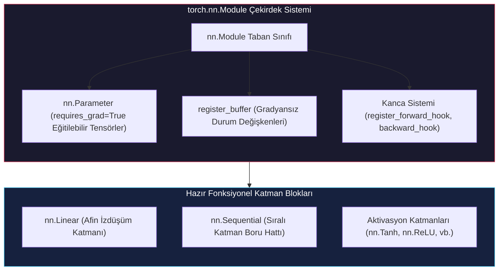

# Veriye Uydurmak İçin Bir Yapay Sinir Ağı Kullanmak: Yapay Nöronlar, Aktivasyon Fonksiyonları ve Modüler PyTorch Mimarisi

<!-- toc -->

<div style="margin-bottom: 20px;">
  <a href="https://colab.research.google.com/github/emreaslan7/ai/blob/main/notebooks/deep-learning-with-pytorch/06-using-a-neural-network-to-fit-the-data.ipynb" target="_blank">
    
  </a>
</div>

Bölüm 5'te, analog bir termometreyi manuel türevler ve otomatik türev alma (**Autograd**) motorunu kullanarak minimal bir doğrusal denklem ($w \cdot x + b$) ile kalibre etmiştik. Bu doğrusal model; gradyan inişini, kayıp fonksiyonlarını ve öğrenme oranlarını anlamak için mükemmel bir zemin sunsa da, gerçek fiziksel evren nadiren salt doğrusal bir yapı sergiler. Bilgisayarla görmeden konuşma tanımaya, protein katlanmasından finansal zaman serilerine kadar tüm karmaşık olgular çok boyutlu ve doğrusal olmayan (non-linear) dinamiklerle yönetilir.

Bu bölümde, *Deep Learning with PyTorch (2nd Edition)* kitabının 6. Bölümünü temel alarak basit doğrusal regresyondan çok katmanlı yapay sinir ağlarına (Multilayer Perceptrons - MLP) geçiş yapıyoruz. Temel yapı taşlarının—yani afin dönüşümler ile doğrusal olmayan aktivasyon fonksiyonlarının—bir araya gelerek keyfi sürekli fonksiyonları nasıl yakalayabildiğini (**Evrensel Fonksiyon Yaklaşımı Teoremi / Universal Approximation Theorem**) keşfedeceğiz. Ardından PyTorch'un endüstri standardı nesne yönelimli çatısına adım atacağız: **`torch.nn`** modülü, **`nn.Linear`**, **`nn.Sequential`**, parametre yönetimi ve özel mimariler için **`nn.Module`** sınıfını miras alma (`subclassing`).

---

## 1. Öğrenme Sürecinin Zihinsel Modeli

Doğrusal olmayan katmanlara geçmeden önce, Bölüm 5'te kurduğumuz temel makine öğrenimi zihinsel modelini yeniden hatırlayalım. Tüm popüler söylemlerden arındırıldığında denetimli derin öğrenme; ileri yayılım, kayıp hesaplama, geriye yayılım (gradyan birikimi) ve parametre güncellemesinden oluşan döngüsel bir sayısal optimizasyon sürecidir.

<figure style="display:flex; justify-content: center; margin: 25px 0;">
  <div style="text-align: center;">
    
    <figcaption style="margin-top: 0.6em; text-align: center; font-size: 13px; color: #888;"><em>Şekil 6.1: Uçtan uca öğrenme süreci: eğitim girdileri parametrik bir model boyunca ileriye iletilir, tahminler bir kayıp fonksiyonu üzerinden gerçek değerlerle kıyaslanır, hata gradyanları geriye doğru akarak ağırlıkları günceller ve modelin genelleştirme gücü doğrulama verisi üzerinde test edilir.</em></figcaption>
  </div>
</figure>

Önceki termometre kalibrasyonumuzda model mimarimiz oldukça kısıtlıydı:
$$ \hat{y} = w \cdot x + b $$

Bu denklem yalnızca iki skaler parametreye ($w$ ve $b$) sahip olduğu için geometrik izdüşümü uzayda katı bir doğru parçasından ibarettir. Gerçek veri dağılımında bir eğrilik, doygunluk platosu veya çok modlu kümelenmeler bulunuyorsa, doğrusal model yüksek bir **tümevarımsal yanlılık** (inductive bias / underfitting) gösterir. Bu sınırın ötesine geçebilmek için koordinat uzayını bükebilen ve esnetebilen fonksiyon bileşkelerine ihtiyacımız vardır.

---

## 2. Yapay Nöronlar ve Doğrusal Olmama (Non-Linearity)

Biyolojik ve yapay sinirsel hesaplamanın merkezinde **nöron** kavramı yer alır: gelen sinyalleri ağırlıklı olarak toplayan (afin dönüşüm) ve bu toplamı doğrusal olmayan bir eşik veya modülasyondan geçiren hesaplama düğümü.

### 2.1 Bir Yapay Nöronun Anatomisi

Matematiksel olarak tek bir yapay nöron birbirini izleyen iki işlem yürütür:
1. **Afin (Doğrusal) Dönüşüm:** $d$-boyutlu girdi vektörünü $\mathbf{x} \in \mathbb{R}^d$ alır, her boyutu $w_i$ katsayısı ile çarpar ve bir skaler bias $b$ ekler:
   $$ z = \mathbf{w}^T \mathbf{x} + b = \sum_{i=1}^d w_i x_i + b $$
2. **Doğrusal Olmayan Aktivasyon:** Elde edilen $z$ ara değerini türevlenebilir, sabit bir doğrusal olmayan $\sigma(\cdot)$ fonksiyonundan geçirir:
   $$ o = \sigma(z) = \sigma(\mathbf{w}^T \mathbf{x} + b) $$

<figure style="display:flex; justify-content: center; margin: 25px 0;">
  <div style="text-align: center;">
    
    <figcaption style="margin-top: 0.6em; text-align: center; font-size: 13px; color: #888;"><em>Şekil 6.2: Bir yapay nöronun anatomisi: girdi sinyali $x$, öğrenilmiş $w$ ve $b$ parametreleriyle doğrusal bir dönüşüme ($wx+b$) tabi tutulur, ardından doğrusal olmayan bir aktivasyon fonksiyonuna ($\tanh$) girerek sınırlı ve non-lineer bir $o$ çıktısı üretir.</em></figcaption>
  </div>
</figure>

Öğrenilmiş parametreleri $w = 2$ ve $b = 6$ olan, aktivasyon olarak hiperbolik tanjant ($\tanh$) kullanan bir nöronu ele alalım:
$$ o = \tanh(2x + 6) $$

Bu nöronun üç farklı girdi değerindeki tepkisini inceleyelim:
* $x = 18$ için:
  $$ z = 2(18) + 6 = 42 \implies o = \tanh(42) \approx 1.0 $$
* $x = -2.79$ için:
  $$ z = 2(-2.79) + 6 = 0.042 \implies o = \tanh(0.042) \approx 0.0397 $$
* $x = -10$ için:
  $$ z = 2(-10) + 6 = -14 \implies o = \tanh(-14) \approx -1.0 $$

Uç pozitif ve negatif değerlerin $[-1, 1]$ aralığına nasıl pürüzsüzce sıkıştırıldığına, buna karşılık $z \approx 0$ civarındaki değerlerin son derece duyarlı bir şekilde değiştiğine dikkat ediniz.

---

### 2.2 Doğrusal Olmama Neden Zorunludur? Doğrusal Katman Çöküşü

Burada temel bir soru akla gelebilir: Neden aktivasyon fonksiyonları kullanmadan sadece ardışık doğrusal katmanları üst üste eklemiyoruz?

İki doğrusal katmanın ardışık olarak bağlandığını varsayalım:
$$ \mathbf{h} = \mathbf{W}_1 \mathbf{x} + \mathbf{b}_1 $$
$$ \hat{\mathbf{y}} = \mathbf{W}_2 \mathbf{h} + \mathbf{b}_2 $$

İlk denklemi ikincisinde yerine koyarsak:
$$ \hat{\mathbf{y}} = \mathbf{W}_2 (\mathbf{W}_1 \mathbf{x} + \mathbf{b}_1) + \mathbf{b}_2 = (\mathbf{W}_2 \mathbf{W}_1) \mathbf{x} + (\mathbf{W}_2 \mathbf{b}_1 + \mathbf{b}_2) $$

İki matrisin çarpımı $\mathbf{W}_3 = \mathbf{W}_2 \mathbf{W}_1$ yine tek bir matris ve $\mathbf{b}_3 = \mathbf{W}_2 \mathbf{b}_1 + \mathbf{b}_2$ sabit bir vektör olduğundan, iki katman cebirsel olarak tek bir doğrusal modele çöker:
$$ \hat{\mathbf{y}} = \mathbf{W}_3 \mathbf{x} + \mathbf{b}_3 $$

> **Temel Çıkarım:** Aralarında doğrusal olmayan aktivasyon fonksiyonu bulunmayan bin katmanlı bir ağ dahi matematiksel olarak tek bir doğrusal regresyon modeline eşdeğerdir. Doğrusal olmayan aktivasyonlar, katmanların birbirine çökmesini engelleyen ve derin temsillerin oluşmasını sağlayan yegane matematiksel araçtır.

<figure style="display:flex; justify-content: center; margin: 25px 0;">
  <div style="text-align: center;">
    
    <figcaption style="margin-top: 0.6em; text-align: center; font-size: 13px; color: #888;"><em>Şekil 6.3: Çok katmanlı bir sinir ağı mimarisi: araya serpiştirilmiş afin katmanlar ve non-lineer aktivasyon katmanları, derin bir parametrik boru hattı ($o = \tanh(\mathbf{W}_n(\dots \tanh(\mathbf{W}_1 \mathbf{x} + \mathbf{b}_1) \dots) + \mathbf{b}_n)$) meydana getirir.</em></figcaption>
  </div>
</figure>

---

## 3. Aktivasyon Fonksiyonları ve Temsil Dinamikleri

Kullandığımız aktivasyon fonksiyonunun türü, gerek ileri yayılım esnasında bilginin taşınmasını gerekse geriye yayılım sırasında gradyanların akışını doğrudan belirler.

### 3.1 Hiperbolik Tanjant ($\tanh$) ve Doygunluk (Saturation)

Hiperbolik tanjant fonksiyonu reel sayıları $\mathbb{R} \to (-1, 1)$ aralığına eşler:
$$ \tanh(z) = \frac{e^z - e^{-z}}{e^z + e^{-z}} = \frac{e^{2z} - 1}{e^{2z} + 1} $$

Birinci türevi doğrudan kendi çıktısı cinsinden son derece zarif bir biçimde ifade edilir:
$$ \frac{d}{dz}\tanh(z) = 1 - \tanh^2(z) $$

<figure style="display:flex; justify-content: center; margin: 25px 0;">
  <div style="text-align: center;">
    
    <figcaption style="margin-top: 0.6em; text-align: center; font-size: 13px; color: #888;"><em>Şekil 6.4: $\tanh$ aktivasyon fonksiyonunun üç çalışma bölgesi: yetersiz doygunluk (under-saturated, $-1$ civarında düz), doğrusal duyarlılık bölgesi ($0$ civarında dik), ve aşırı doygunluk (over-saturated, $+1$ civarında düz).</em></figcaption>
  </div>
</figure>

Şekil 6.4'te görüldüğü üzere $\tanh$ fonksiyonunun üç belirgin çalışma bölgesi vardır:
1. **Yetersiz Doygunluk Bölgesi ($z \ll -1$):** Büyük negatif değerler çıktıyı asimptotik olarak $-1.0$'e yapıştırır. Bu bölgede türev sıfıra yaklaşır ($\frac{d}{dz}\tanh(z) \to 0$).
2. **Duyarlı Bölge ($-1 \le z \le 1$):** Orijin etrafında fonksiyon yaklaşık olarak doğrusal bir eğimle ($1.0$'e yakın) davranır; gradyanlar canlı bir şekilde akar.
3. **Aşırı Doygunluk Bölgesi ($z \gg 1$):** Büyük pozitif girdiler çıktıyı $+1.0$'e sabitler ve türev yine sıfıra yaklaşır ($\frac{d}{dz}\tanh(z) \to 0$).

> **Kaybolan Gradyanlar Problemi (Vanishing Gradients):** Ağ katmanları derinleştikçe veya girdiler uygun şekilde ölçeklenmediğinde nöronlar doygunluk bölgelerine itilebilir. Zincir kuralı uygulandığında ($\frac{\partial \mathcal{L}}{\partial \mathbf{w}} = \frac{\partial \mathcal{L}}{\partial o} \cdot \frac{do}{dz} \cdot \frac{\partial z}{\partial \mathbf{w}}$), sıfıra yakın $\frac{do}{dz}$ türevleriyle art arda çarpım yapılması gradyanların erken katmanlara ulaşamadan üstel olarak yok olmasına yol açar.

---

### 3.2 Temel Aktivasyon Fonksiyonları Galerisi

PyTorch, `torch.nn` altında zengin bir aktivasyon kütüphanesi barındırır. Her biri farklı matematiksel avantaj ve dezavantajlara sahiptir:

<figure style="display:flex; justify-content: center; margin: 25px 0;">
  <div style="text-align: center;">
    
    <figcaption style="margin-top: 0.6em; text-align: center; font-size: 13px; color: #888;"><em>Şekil 6.5: Altı klasik ve modern aktivasyon fonksiyonunun $y = x$ referans doğrusuyla karşılaştırılması: $\tanh$, Hardtanh, Sigmoid, Softplus, ReLU ve LeakyReLU.</em></figcaption>
  </div>
</figure>

1. **Hiperbolik Tanjant (`nn.Tanh`):**
   $$ \sigma(x) = \tanh(x) $$
   - **Aralık:** $(-1, 1)$ (sıfır merkezli).
   - **Avantaj:** Sıfır merkezli olması, ağırlık güncellemelerinin zikzak yapmasını önleyerek gradyan inişini hızlandırır.
   - **Dezavantaj:** Derin ağlarda ($L > 4$) doygunluk ve kaybolan gradyanlara açıktır.

2. **Hardtanh (`nn.Hardtanh`):**
   $$ \text{Hardtanh}(x) = \min(\max(x, -1), 1) $$
   - **Aralık:** $[-1, 1]$.
   - **Avantaj:** $\tanh$'ın parçalı doğrusal yaklaşımıdır. Üstel hesaplamayı ($e^x$) ortadan kaldırdığı için mobil ve gömülü sistemlerde (ExecuTorch) olağanüstü hızlıdır.

3. **Sigmoid (`nn.Sigmoid`):**
   $$ \sigma(x) = \frac{1}{1 + e^{-x}} $$
   - **Aralık:** $(0, 1)$.
   - **Kullanım:** İkili sınıflandırma (binary classification) modellerinin çıktı katmanında olasılık $\mathbb{P}(Y=1 \mid X)$ üretmek için vazgeçilmezdir.
   - **Dezavantaj:** Sıfır merkezli değildir ve maksimum türevi yalnızca $0.25$'tir; bu da gradyan sönümünü hızlandırır.

4. **Softplus (`nn.Softplus`):**
   $$ \text{Softplus}(x) = \ln(1 + e^x) $$
   - **Aralık:** $(0, \infty)$.
   - **Özellik:** ReLU fonksiyonunun pürüzsüz ve her noktada sürekli türevlenebilir analitiğidir. $x \to \infty$ iken $x$'e, $x \to -\infty$ iken $0$'a yakınsar.

5. **Rectified Linear Unit (`nn.ReLU`):**
   $$ \text{ReLU}(x) = \max(0, x) $$
   - **Aralık:** $[0, \infty)$.
   - **Avantaj:** Pozitif girdilerde ($x > 0$) türevi tam olarak $1$'dir; bu sayede kaybolan gradyan problemine karşı bağışıktır ve donanım seviyesinde çok hızlı hesaplanır.
   - **Dezavantaj:** **Ölü ReLU Problemi (Dying ReLU)**. Bir nöronun bias değeri çok negatif bir seviyeye kayarsa, tüm eğitim örnekleri için $x \le 0$ olur ve nöron bir daha asla uyanamayarak tamamen "ölür".

6. **Leaky ReLU (`nn.LeakyReLU`):**
   $$ \text{LeakyReLU}(x) = \max(\alpha x, x), \quad (\text{genellikle } \alpha = 0.01) $$
   - **Aralık:** $(-\infty, \infty)$.
   - **Avantaj:** Negatif bölgede küçük bir eğim ($\alpha$) bırakarak gradyanların hiçbir zaman tamamen sıfırlanmamasını garanti eder ve ölü nöron riskini bertaraf eder.

---

### 3.3 Evrensel Yaklaşım Mekaniği: Fonksiyon Heykeltıraşlığı

Tek tek nöronlar bir araya geldiklerinde keyfi sürekli eğrileri nasıl modelleyebilir?

**Evrensel Yaklaşım Teoremi** (Universal Approximation Theorem - Cybenko 1989, Hornik 1991); tek bir gizli katmana ve sonlu sayıda doğrusal olmayan nörona sahip ileri beslemeli bir ağın, kompakt bir küme üzerindeki herhangi bir sürekli fonksiyonu istenen herhangi bir $\epsilon > 0$ hassasiyetinde yakalayabileceğini kanıtlar.

<figure style="display:flex; justify-content: center; margin: 25px 0;">
  <div style="text-align: center;">
    
    <figcaption style="margin-top: 0.6em; text-align: center; font-size: 13px; color: #888;"><em>Şekil 6.6: Evrensel fonksiyon yaklaşımının adım adım görselleştirilmesi: dört bağımsız nöron ($A, B, C, D$) doğrusal olarak toplandığında ($A+B, C+D$) ve hiyerarşik olarak katmanlandığında ($C(A+B) + D(A+B)$), basit monoton $\tanh$ eğrilerinden karmaşık vadiler, tepeler ve yerel çukurlar inşa edilir.</em></figcaption>
  </div>
</figure>

Şekil 6.6'daki matematiksel inşa basamaklarını takip edelim:
1. **Bağımsız Nöronlar (1. ve 2. Satır, 1. ve 2. Sütun):**
   Her bir $A, B, C, D$ nöronu afin bir dönüşümün ardından $\tanh$ hesaplar:
   $$ A(x) = \tanh(-2x - 1.25), \quad B(x) = \tanh(x + 0.75) $$
   $$ C(x) = \tanh(4x + 1.0), \quad D(x) = \tanh(-3x + 1.5) $$
   Her nöron, bias ile konumu ötelenmiş ve ağırlık ile dikliği ayarlanmış monoton bir basamak üretir.
2. **İlk Katman Toplamları (3. Sütun):**
   - $A + B$: Biri azalan diğeri artan iki eğri toplanarak hafif yerel dalgalanmalar içeren asimetrik bir S-eğrisi oluşturur.
   - $C + D$: İki zıt basamak birleşerek yaklaşık $1.72$ tepe değerine ulaşan belirgin bir pozitif çan (tepe) meydana getirir.
3. **Hiyerarşik Katmanlama (3. Satır):**
   İlk katmanın çıktısı olan $(A+B)$ sinyali ikinci katmandaki $C$ ve $D$ nöronlarına girdi olarak verildiğinde:
   - $C(A+B)$ ve $D(A+B)$ yeni yerel çukurlar açar.
   - İki katmanlı nihai kompozisyon $C(A+B) + D(A+B)$; iki belirgin negatif çukur ve aralarında bir plato barındıran son derece sofistike bir yüzey meydana getirir—üstelik yalnızca iki katmanda dört nöron kullanarak!

> **Temel Çıkarım:** Bir yapay sinir ağı kuralları ezberlemez. Parametrelerini optimize ederek, aktivasyon eşiklerinin uzayda yapıcı ve yıkıcı girişimler (constructive & destructive interference) oluşturmasını sağlar; böylece eğitim verisi üzerinde pürüzsüz bir çokkatlı (manifold) heykeli yontar.

---

## 4. PyTorch `nn` Modülü Mimarisi

Bölüm 5'te ağırlık ve bias tensörlerini elle tanımlamış, açık matematiksel ifadeler yazmış ve parametre listelerini manuel olarak güncellemiştik. Ancak milyarlarca parametreli derin öğrenme modellerinde bu yaklaşım sürdürülemez.

PyTorch, bu karmaşıklığı yönetmek için nesne yönelimli bir alt sistem olan **`torch.nn`** paketini sunar.



---

### 4.1 Batch Boyutu Kuralı: $N \times C_{\text{in}}$ Zorunluluğu

PyTorch'taki tüm `nn.Module` katmanları, paralel donanım mimarilerinden (GPU SIMD çekirdekleri) azami verim alacak şekilde tasarlanmıştır. Bu nedenle modeller verileri tek tek değil, **yığınlar (batches)** halinde işler.

<figure style="display:flex; justify-content: center; margin: 25px 0;">
  <div style="text-align: center;">
    
    <figcaption style="margin-top: 0.6em; text-align: center; font-size: 13px; color: #888;"><em>Şekil 6.7: PyTorch'ta yığın (batch) boyutu mantığı: birden fazla veri örneği ($B=3$ adet $B \times C \times H \times W$ boyutlu RGB görüntü) sinir ağı katmanlarından eşzamanlı olarak geçirilerek $B=3$ boyutlu çıktı tensörleri üretilir.</em></figcaption>
  </div>
</figure>

> **ZORUNLU KURAL:** İstisnasız tüm `torch.nn` katmanları, girdi tensörünün **sıfırıncı boyutunun (0-th dimension) yığın boyutunu ($B$ veya $N$)** temsil etmesini bekler:
> - Tablo ve öznitelik verisi: `(N, C_in)`
> - 2D Görüntü verisi: `(N, C, H, W)`
> - 3D Hacimsel veri: `(N, C, D, H, W)`
> - Sıralı metin/zaman serisi: `(N, L, C)` veya `(L, N, C)`

Eğer `(11,)` şeklinde 1D bir tensörü doğrudan `nn.Linear(1, 1)` katmanına verirseniz PyTorch boyut uyumsuzluğu hatası fırlatır. Tensör mutlaka `.unsqueeze(1)` veya `.view(-1, 1)` ile `(11, 1)` formuna getirilmelidir.

---

### 4.2 `nn.Linear` ile Afin Dönüşüm

En temel `torch.nn` katmanı olan `nn.Linear`, şu matris işlemini yürütür:
$$ \mathbf{y} = \mathbf{x} \mathbf{W}^T + \mathbf{b} $$

PyTorch'un ağırlık tensörünü `(in_features, out_features)` yerine devrik olarak `(out_features, in_features)` şeklinde sakladığına dikkat ediniz. Bu bellek düzeni, standart BLAS matris çarpımının $N \times C_{\text{in}}$ boyutlu girdi yığınlarıyla doğrudan çalışabilmesini sağlar:
$$ (N \times C_{\text{in}}) \times (C_{\text{in}} \times C_{\text{out}}) = (N \times C_{\text{out}}) $$

Python üzerinden bu katmanı inceleyelim:

```python
import torch
import torch.nn as nn

# 1 girdi özniteliğini 1 çıktı özniteliğine eşleyen lineer katman
linear_model = nn.Linear(in_features=1, out_features=1, bias=True)

# Dahili parametreleri ve tensör şekillerini denetleyelim
print("Ağırlık şekli (weight):", linear_model.weight.shape)
print("Bias şekli (bias):     ", linear_model.bias.shape)
print("Ağırlık tensörü:       ", linear_model.weight)
print("Bias tensörü:          ", linear_model.bias)
```

```text
Ağırlık şekli (weight): torch.Size([1, 1])
Bias şekli (bias):      torch.Size([1])
Ağırlık tensörü:        Parameter containing:
tensor([[0.5406]], requires_grad=True)
Bias tensörü:           Parameter containing:
tensor([-0.2216], requires_grad=True)
```

---

### 4.3 Neden `model.forward(x)` Değil de `model(x)` Çağrılmalıdır?

PyTorch'ta `nn.Module`'den türetilen her sınıf bir `forward(*args, **kwargs)` metodu uygular. Ancak model ile tahmin yaparken **asla `model.forward(x)` doğrudan çağrılmamalıdır**. Bunun yerine model nesnesi çağrılabilir bir fonksiyon gibi çalıştırılmalıdır: `model(x)`.

`model(x)` çalıştırıldığında Python arka planda `nn.Module.__call__` metodunu devreye sokar. Bu metot sırasıyla:
1. Kayıtlı tüm **pre-forward kancalarını** (`register_forward_pre_hook`) tetikler.
2. Kullanıcının tanımladığı `forward(x)` mantığını yürütür.
3. Çıktı üzerinde çalışan tüm **forward kancalarını** (`register_forward_hook`) tetikler (Grad-CAM, model telemetrisi ve ara katman aktivasyon takibi için kritiktir).
4. PyTorch Profiler izleme olaylarını yönetir.

Doğrudan `model.forward(x)` çağırmak tüm bu kanca altyapısını sessizce baypas eder ve fark edilmesi son derece güç hatalara yol açar.

---

### 4.4 Termometre Probleminin `nn.Linear` ile Yeniden İnşası

Bölüm 5'teki kalibrasyon verimizi PyTorch'un yığın standartlarına göre biçimlendirerek eğitim döngümüzü kuralım:

```python
# Ham termometre ölçümleri
t_c = [0.5, 14.0, 15.0, 28.0, 11.0, 8.0, 3.0, -4.0, 6.0, 13.0, 21.0]
t_u = [35.7, 55.9, 58.2, 81.9, 56.3, 48.9, 33.9, 21.8, 48.4, 60.4, 68.4]

# 32-bit kayan noktalı tensörlere dönüştürme
t_c = torch.tensor(t_c, dtype=torch.float32)
t_u = torch.tensor(t_u, dtype=torch.float32)

# Yığın (batch) boyutu ekleme: (11,) -> (11, 1)
t_c = t_c.unsqueeze(1)
t_u = t_u.unsqueeze(1)

# Gradyan patlamasını önlemek için ölçeklendirme
t_un = 0.1 * t_u

print(f"t_u boyutu:  {t_u.shape}")
print(f"t_c boyutu:  {t_c.shape}")
print(f"t_un boyutu: {t_un.shape}")
```

```text
t_u boyutu:  torch.Size([11, 1])
t_c boyutu:  torch.Size([11, 1])
t_un boyutu: torch.Size([11, 1])
```

Şimdi `nn.Linear`, hazır kayıp fonksiyonu `nn.MSELoss` ve `torch.optim.SGD` optimizatörünü bir araya getiren modüler eğitim döngüsünü çalıştıralım:

```python
import torch.optim as optim

# Modeli ve kayıp fonksiyonunu tanımlama
linear_model = nn.Linear(1, 1)
loss_fn = nn.MSELoss()

# Optimizatöre model parametrelerini bağlama
optimizer = optim.SGD(linear_model.parameters(), lr=1e-2)

# Eğitim döngüsü
for epoch in range(1, 3001):
    # 1. Adım: İleri yayılım (model nesnesi çağrılarak)
    t_p = linear_model(t_un)
    
    # 2. Adım: Kayıp hesaplama
    loss = loss_fn(t_p, t_c)
    
    # 3. Adım: Gradyanları sıfırlama, geriye yayılım ve optimizasyon
    optimizer.zero_grad()
    loss.backward()
    optimizer.step()
    
    if epoch % 500 == 0:
        print(f"Epok {epoch:4d} | Kayıp (Loss): {loss.item():.4f}")

print("\nEğitilmiş Lineer Model Parametreleri:")
print(f"Ağırlık (w): {linear_model.weight.item():.4f} (beklenen ~5.367)")
print(f"Bias (b):    {linear_model.bias.item():.4f} (beklenen ~-17.30)")
```

```text
Epok  500 | Kayıp (Loss): 7.0850
Epok 1000 | Kayıp (Loss): 3.5539
Epok 1500 | Kayıp (Loss): 3.0308
Epok 2000 | Kayıp (Loss): 2.9532
Epok 2500 | Kayıp (Loss): 2.9417
Epok 3000 | Kayıp (Loss): 2.9400

Eğitilmiş Lineer Model Parametreleri:
Ağırlık (w): 5.3671 (beklenen ~5.367)
Bias (b):    -17.3012 (beklenen ~-17.30)
```

---

## 5. `nn.Sequential` ile Gerçek Bir Sinir Ağı İnşası

`nn.Linear` ile döngümüzün çalıştığını doğruladık; ancak bu model henüz doğrusal bir çizginin ötesine geçemez. Gerçek bir sinir ağı inşa etmek için ara gizli katmanlar (hidden layers) ve doğrusal olmayan aktivasyon fonksiyonları eklemeliyiz.

### 5.1 İki Katmanlı Mimari: $1 \to 13 \to 1$

Kitaptaki mimariyi birebir uygulayarak şu katman yapısını kuruyoruz:
1. $1$-boyutlu girdiyi ($t\_u$) alan giriş katmanı.
2. Bu girdiyi $13$ boyuta genişleten ara katman: `nn.Linear(1, 13)`.
3. Eleman bazlı doğrusal olmayan aktivasyon katmanı: `nn.Tanh()`.
4. $13$ boyuttan tekrar $1$ skaler çıktıya indirgeyen projeksiyon katmanı: `nn.Linear(13, 1)`.

<figure style="display:flex; justify-content: center; margin: 25px 0;">
  <div style="text-align: center;">
    
    <figcaption style="margin-top: 0.6em; text-align: center; font-size: 13px; color: #888;"><em>Şekil 6.8: İki katmanlı sinir ağı mimarisinin iki eşdeğer görsel temsili: solda 1 girdi, 13 gizli nöron ($\tanh$) ve 1 çıktı nöronunu gösteren grafik şeması; sağda PyTorch'un modüler blok ardışıklığı.</em></figcaption>
  </div>
</figure>

PyTorch'ta bu yapıyı `nn.Sequential` ile sadece birkaç satırda bir araya getirebiliriz:

```python
seq_model = nn.Sequential(
    nn.Linear(1, 13),
    nn.Tanh(),
    nn.Linear(13, 1)
)

print(seq_model)
```

```text
Sequential(
  (0): Linear(in_features=1, out_features=13, bias=True)
  (1): Tanh()
  (2): Linear(in_features=13, out_features=1, bias=True)
)
```

---

### 5.2 Parametrelerin ve Tensör Boyutlarının İncelenmesi

Model içerisindeki tüm eğitilebilir parametreleri listeleyelim:

```python
total_params = 0
for name, param in seq_model.named_parameters():
    print(f"Katman: {name:15s} | Boyut: {str(param.shape):20s} | Eleman Sayısı: {param.numel()}")
    total_params += param.numel()

print(f"\nToplam Eğitilebilir Parametre Sayısı: {total_params}")
```

```text
Katman: 0.weight        | Boyut: torch.Size([13, 1])  | Eleman Sayısı: 13
Katman: 0.bias          | Boyut: torch.Size([13])     | Eleman Sayısı: 13
Katman: 2.weight        | Boyut: torch.Size([1, 13])  | Eleman Sayısı: 13
Katman: 2.bias          | Boyut: torch.Size([1])      | Eleman Sayısı: 1

Toplam Eğitilebilir Parametre Sayısı: 40
```

`nn.Sequential` nesnesinin katmanları `0`, `1` ve `2` şeklinde indekslediğini görüyoruz. `1` numaralı katman (`nn.Tanh`) parametre listesinde yer almaz; çünkü aktivasyon fonksiyonları eğitilebilir ağırlıklara sahip olmayan deterministik matematiksel işlemlerdir.

Katmanlara sayısal indeksler yerine anlamlı isimler vermek istersek `collections.OrderedDict` kullanabiliriz:

```python
from collections import OrderedDict

named_model = nn.Sequential(OrderedDict([
    ('hidden_linear', nn.Linear(1, 13)),
    ('hidden_activation', nn.Tanh()),
    ('output_linear', nn.Linear(13, 1))
]))

print("İsimlendirilmiş model parametreleri:")
for name, param in named_model.named_parameters():
    print(f"  {name}")
```

```text
İsimlendirilmiş model parametreleri:
  hidden_linear.weight
  hidden_linear.bias
  output_linear.weight
  output_linear.bias
```

---

### 5.3 Sinir Ağının Eğitilmesi: Adam ve SGD Karşılaştırması

Sinir ağları konveks olmayan (non-convex), eyer noktaları ve yöne göre değişen eğrilikler barındıran karmaşık kayıp yüzeylerine sahiptir. Standart SGD bu tür yüzeylerde salınım yapabilir veya yavaş ilerleyebilir.

Bu nedenle burada **Adam** (`torch.optim.Adam`) algoritmasını kullanıyoruz. Adam, her parametre için hem gradyanların hareketli ortalamasını (birinci moment) hem de karelerinin ortalamasını (ikinci moment) ayrı ayrı takip ederek adaptif öğrenme adımları atar:

```python
# Model ve kayıp fonksiyonu
seq_model = nn.Sequential(
    nn.Linear(1, 13),
    nn.Tanh(),
    nn.Linear(13, 1)
)

loss_fn = nn.MSELoss()

# 1e-2 öğrenme oranlı Adam optimizatörü
optimizer = optim.Adam(seq_model.parameters(), lr=1e-2)

# Eğitim döngüsü
for epoch in range(1, 5001):
    t_p = seq_model(t_un)
    loss = loss_fn(t_p, t_c)
    
    optimizer.zero_grad()
    loss.backward()
    optimizer.step()
    
    if epoch % 1000 == 0:
        print(f"Epok {epoch:5d} | Kayıp (Loss): {loss.item():.4f}")
```

```text
Epok  1000 | Kayıp (Loss): 2.8942
Epok  2000 | Kayıp (Loss): 2.3781
Epok  3000 | Kayıp (Loss): 1.8492
Epok  4000 | Kayıp (Loss): 1.4215
Epok  5000 | Kayıp (Loss): 1.2009
```

Nihai MSE kaybı, doğrusal modeldeki $2.9400$ seviyesinden $1.2009$'a geriledi! Sinir ağı, en iyi düz doğruya kıyasla **hata oranında %59'un üzerinde net bir iyileşme** sağladı.

---

### 5.4 Doğrusal Olmayan Çözümün Görselleştirilmesi

Modelimizin yakaladığı davranışı görmek için $20^\circ\text{F}$ ile $90^\circ\text{F}$ arasındaki sürekli sıcaklık değerlerini ağdan geçirip tahmin eğrisini gerçek veri noktalarıyla birlikte çizdirelim:

<figure style="display:flex; justify-content: center; margin: 25px 0;">
  <div style="text-align: center;">
    
    <figcaption style="margin-top: 0.6em; text-align: center; font-size: 13px; color: #888;"><em>Şekil 6.9: İki katmanlı sinir ağımızın $[20^\circ\text{F}, 90^\circ\text{F}]$ aralığındaki non-lineer cevabı: mavi daireler kalibrasyon ölçümlerini, siyah çarpılar bu noktalardaki model çıktılarını, kesintisiz turkuaz çizgi ise ağın örnekler arasında yakaladığı pürüzsüz interpolasyonu gösterir.</em></figcaption>
  </div>
</figure>

Şekil 6.9, sinir ağlarının temel ödünleşimini (trade-off) açıkça sergiler:
- **Temsil Yeteneği:** Ağ, doğrusal regresyonun uzlaşmaya zorlandığı uç noktalardaki sapmaları yakalayabilen zarif bir S-eğrisi öğrenmiştir.
- **Aşırı Öğrenme Riski (Overfitting):** Eğrinin $56^\circ\text{F}$ ve $58^\circ\text{F}$ civarındaki iki gürültülü aykırı değere doğru nasıl agresifçe büküldüğüne dikkat ediniz. Model sadece 11 veri noktasına uymak için 40 parametreye sahip olduğundan, fiziksel olgunun yanı sıra sensörün ölçüm gürültüsünü de ezberleme eğilimi gösterir. Bu durum, veri kısıtlı ortamlarda düzenlileştirmenin (regularization / weight decay / dropout) hayati önemini gösterir.

---

## 6. İleri Nesne Yönelimli Tasarım: `nn.Module` Sınıfını Miras Alma (`Subclassing`)

`nn.Sequential` sıralı boru hatları için pratik olsa da; **ResNet** (artık/skip bağlantıları), **Transformer** (çok başlı çapraz dikkat) ve **Diffusion U-Net** gibi modern yapay zeka mimarileri tek bir doğrusal zincirle ifade edilemez. Bu mimariler dallanan yollar, artık toplamlar ve döngüsel durumlar gerektirir.

PyTorch'ta keyfi mimariler inşa etmenin altın standardı, doğrudan **`nn.Module` sınıfını miras almaktır**.

### 6.1 Özel Bir `nn.Module` Sınıfının Anatomisi

`nn.Module` sınıfından türetme yaparken üç temel kurala uyulmalıdır:
1. Üst sınıf kurucusunu mutlaka çağırınız: `super().__init__()`.
2. Alt katmanları ve eğitilebilir parametreleri `__init__` içinde örnek niteliği (`self.katman = ...`) olarak atayınız. PyTorch, `self` nesnesine bağlanan her `nn.Module` veya `nn.Parameter` nesnesini otomatik olarak kaydeder.
3. Hesaplama akışını tanımlayan `forward(self, x)` metodunu eziniz (override).

```python
class SubclassedNeuralNetwork(nn.Module):
    """
    Modüler nn.Module miras alımını gösteren
    iki katmanlı Çok Katmanlı Algılayıcı (MLP).
    """
    def __init__(self, in_features: int = 1, hidden_dim: int = 13, out_features: int = 1):
        super().__init__()
        # 1. Modüler alt katmanların tanımlanması
        self.fc_hidden = nn.Linear(in_features, hidden_dim)
        self.activation = nn.Tanh()
        self.fc_out = nn.Linear(hidden_dim, out_features)
        
    def forward(self, x: torch.Tensor) -> torch.Tensor:
        """
        Dinamik hesaplama grafiğini yürütür.
        """
        # Ara gizli temsiller
        h = self.fc_hidden(x)
        h_act = self.activation(h)
        
        # Çıktı projeksiyonu
        out = self.fc_out(h_act)
        return out

# Modeli oluşturma
custom_model = SubclassedNeuralNetwork(in_features=1, hidden_dim=13, out_features=1)
print(custom_model)
```

```text
SubclassedNeuralNetwork(
  (fc_hidden): Linear(in_features=1, out_features=13, bias=True)
  (activation): Tanh()
  (fc_out): Linear(in_features=13, out_features=1, bias=True)
)
```

---

### 6.2 Özel İleri Yayılım Mantığı ve Artık Bağlantılar (Residual Connections)

`forward` metodu saf Python olduğu için içerisine koşullu ifadeler, döngüler veya artık bağlantılar eklemek tamamen doğaldır:

```python
class ResidualBlock(nn.Module):
    """
    Skip bağlantılarını gösteren minimal artık (residual) blok:
    y = x + f(x)
    """
    def __init__(self, dim: int):
        super().__init__()
        self.linear = nn.Linear(dim, dim)
        self.act = nn.ReLU()
        
    def forward(self, x: torch.Tensor) -> torch.Tensor:
        # Girdiyi doğrudan ekleyerek gradyan akışını koruma
        return x + self.act(self.linear(x))
```

---

## 7. Özet ve Temel Mühendislik İlkeleri

Bu bölümde basit doğrusal regresyondan derin sinir ağlarına geçiş yaptık. Çıkardığımız temel prensipler bundan sonraki tüm ileri seviye vizyon ve dil modellerinin temelini oluşturur:

1. **Doğrusal Olmamanın Rolü:** Aktivasyonsuz ardışık katmanlar tek bir doğrusal modele çöker. $\tanh$, $\text{ReLU}$, $\text{GELU}$ gibi non-lineer aktivasyonlar uzayı bükerek karmaşık temsiller oluşturmanın anahtarıdır.
2. **Evrensel Yaklaşım Gücü:** Sınırlı aktivasyonlara sahip nöronlar doğrusal ve hiyerarşik olarak birleştiğinde yapıcı ve yıkıcı girişimlerle keyfi sürekli fonksiyonları modelleyebilir.
3. **`torch.nn` Paradigması:**
   - `nn.Module`; parametre takibini, kancaları, cihaz transferlerini (`.to(device)`) ve model ağırlıklarının serileştirilmesini (`state_dict()`) yönetir.
   - Eğitilebilir değişkenler `requires_grad=True` içeren `nn.Parameter` olarak kapsüllenir.
   - Kanca (hook) sisteminin düzgün çalışması için asla `model.forward(x)` doğrudan çağrılmamalı, `model(x)` kullanılmalıdır.
4. **Yığın (Batch) Boyutu Kuralı:** PyTorch katmanları girdi tensörünün sıfırıncı ekseninin daima yığın boyutu ($B \times C \times \dots$) olmasını şart koşar.
5. **Optimizasyon:** Karmaşık hata yüzeylerinde Adam gibi adaptif optimizatörler, her parametre için ayrı momentum takibi yaparak standart SGD'ye kıyasla çok daha kararlı ve hızlı yakınsar.
6. **Kapasite ve Genelleştirme:** Model kapasitesinin artması karmaşık kalıpları yakalama gücü kazandırsa da, veri miktarının az olduğu durumlarda gürültüyü ezberleme (aşırı öğrenme) riskini beraberinde getirir.
