# Genelleme Yapmak İçin Konvolüsyonları Kullanmak

<!-- toc -->

<div style="margin-bottom: 20px;">
  <a href="https://colab.research.google.com/github/emreaslan7/ai/blob/main/notebooks/deep-learning-with-pytorch/08-using-convolutions-to-generalize.ipynb" target="_blank">
    
  </a>
</div>

Bölüm 7'de, tam bağlantılı (*fully connected*) yapay sinir ağları kullanarak CIFAR-10 veri kümesi üzerinde görüntü sınıflandırma görevini ele almıştık. Temel çok katmanlı algılayıcımız rastgele tahminden daha iyi bir başarım sergilese de, hızla iki temel darboğazla karşılaşmıştık: parametre sayısındaki devasa patlama (yalnızca ilk katmanda $3{,}072 \times 512 = 1.57\text{M}$ ağırlık) ve mekânsal tümevarımsal önyargının (*spatial inductive bias*) tamamen yokluğu. Tam bağlantılı bir ağ, $(0, 0)$ pikseli ile $(0, 1)$ pikselini birbirinden tamamen bağımsız iki özellik olarak değerlendirir; pikseller arasındaki komşuluk, yerel kenarlar veya öteleme değişmezliği kavramına sahip değildir. Eğer bir uçak görüntü içinde beş piksel sağa kayarsa, yoğun bir ağ bunu tamamen farklı ve bağımsız ağırlık kümesini ilgilendiren yepyeni bir girdi olarak algılar.

Bu bölümde, *Deep Learning with PyTorch (2nd Edition)* kitabının 8. Bölümünü izleyerek, bilgisayarlı görünün temel yapı taşı olan **konvolüsyonları (evrişimleri)** ele alıyoruz. **Yerellik (locality)** ve **öteleme değişmezliği (translation invariance)** ilkelerinin, parametre sayısını radikal biçimde azaltırken modelin genelleme yeteneğini nasıl olağanüstü artırdığını inceliyoruz. El yapımı filtreleri analiz ediyor, 2B konvolüsyon ve havuzlama (*pooling*) işlemlerini uyguluyor, modüler konvolüsyonel sinir ağları inşa ediyor, regularizasyon stratejilerini (**L2 weight decay**, **dropout** ve **batch normalization**) inceliyor ve sinyal iletimini yüzlerce katman boyunca koruyan **artık bağlantıları (residual connections / ResNet)** öğreniyoruz.

---

## 1. Konvolüsyonların Gerekliliği: Yerellik ve Öteleme Değişmezliği

Tam bağlantılı ağlar, her girdi özelliğinin her gizli birimle doğrudan etkileşime girdiğini varsayar. $I \in \mathbb{R}^{C \times H \times W}$ boyutlarındaki 2B bir görüntü için mekânsal boyutları düzleştirmek (*flattening*), görsel dünyanın yapısal koordinat geometrisini yok eder. Gerçek dünyadaki görsel sahneler iki temel fiziksel özelliğe sahiptir:

1. **Yerellik (Locality):** Birbirine mekânsal olarak yakın pikseller güçlü bir korelasyona sahiptir. Bir kenar, köşe veya doku parçası; görüntünün uzak zıt köşelerindeki piksellerin etkileşimiyle değil, birbirine bitişik komşu pikseller tarafından oluşturulur.
2. **Öteleme Değişmezliği (Translation Invariance):** Bir nesnenin kimliği, görüntü düzlemi üzerinde yer değiştirdiğinde değişmez. Sol üst kadranda yer alan bir kuş gagası, merkezde veya sağ altta yer alan bir gagayla tamamen aynı yerel görsel özelliklere sahiptir.

<figure style="display:flex; justify-content: center; margin: 25px 0;">
  <div style="text-align: center;">
    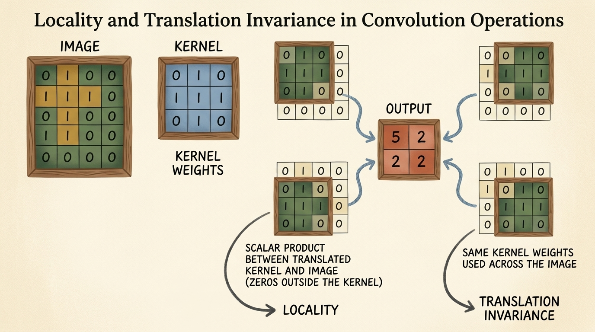
    <figcaption style="margin-top: 0.6em; text-align: center; font-size: 13px; color: #888;"><em>Şekil 8.1: Ayrık 2B konvolüsyon, küçük bir parametre çekirdeğini (kernel) girdi ızgarası üzerinde kaydırır. Küçük alıcı alanlar üzerinde skaler çarpım hesaplamak yerelliği zorunlu kılarken, çekirdek ağırlıklarının tüm mekânda paylaşılması öteleme değişmezliğini garanti eder.</em></figcaption>
  </div>
</figure>

### 1.1 Ayrık 2B Konvolüsyonun Matematiksel Formülasyonu

Sürekli analizde iki fonksiyonun evrişimi $(f * g)(t) = \int\_{-\infty}^{\infty} f(\tau) g(t - \tau) d\tau$ şeklinde tanımlanır. Ayrık görüntü işlemede ve derin öğrenme çerçevelerinde ise ayrık çapraz korelasyon (*discrete cross-correlation*, literatürde yaygın olarak konvolüsyon olarak adlandırılır) hesaplanır:

$$ (I * K)(i, j) = \sum\_{m=-k\_h}^{k\_h} \sum\_{n=-k\_w}^{k\_w} I(i + m, j + n) K(m, n) $$

Burada $I$ 2B girdi matrisini, $K \in \mathbb{R}^{K\_H \times K\_W}$ öğrenilebilir filtre çekirdeğini (*kernel*) ve $(i, j)$ çıktı özellik haritasının mekânsal koordinatlarını temsil eder.

Görüntünün tamamındaki her koordinat çiftine bağımsız bir ağırlık atamak yerine, bir konvolüsyon katmanı aynı küçük $K$ ağırlık kümesini tüm mekânsal konumlarda ortak olarak kullanır (*weight sharing*).

> **Temel Çıkarım:** Ağırlık paylaşımı, parametre karmaşıklığını tam bağlantılı katmanlardaki $\mathcal{O}(H\_{\text{in}} W\_{\text{in}} H\_{\text{out}} W\_{\text{out}})$ seviyesinden, görüntü çözünürlüğünden bağımsız olarak kanal çifti başına $\mathcal{O}(K\_H K\_W)$ seviyesine düşürür.

### 1.2 Sınır Koşulları ve Dolgu (Padding)

$H \times W$ boyutundaki bir görüntü üzerinde $K\_H \times K\_W$ boyutundaki bir çekirdeği $S=1$ adımla (*stride*) ve dolgu olmaksızın kaydırdığımızda (**geçerli konvolüsyon / valid convolution**), çıktı mekânsal boyutları küçülür:

$$ H\_{\text{out}} = H\_{\text{in}} - K\_H + 1, \quad W\_{\text{out}} = W\_{\text{in}} - K\_W + 1 $$

Çok katmanlı derin ağlarda mekânsal boyutlar hızla sıfıra çöker. Ayrıca görüntünün en dış sınırındaki pikseller, iç piksellere kıyasla çok daha az sayıda kaydırma penceresine dahil edilir. Mekânsal çözünürlüğü korumak ve sınır piksellerini eşit derecede temsil etmek için tensörün çevresine sıfırlar ekleriz (**sıfır dolgusu / zero-padding**).

<figure style="display:flex; justify-content: center; margin: 25px 0;">
  <div style="text-align: center;">
    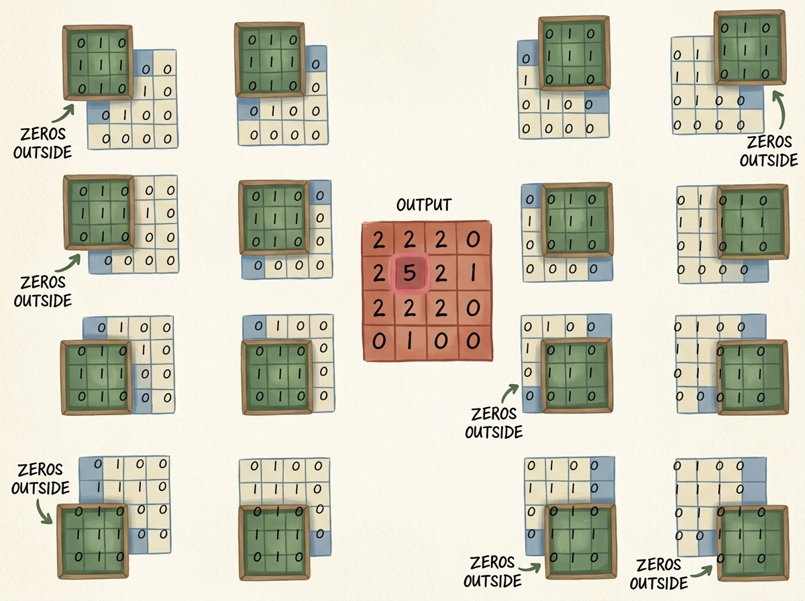
    <figcaption style="margin-top: 0.6em; text-align: center; font-size: 13px; color: #888;"><em>Şekil 8.2: Sıfır dolgusu mekanizması. Girdinin etrafına 1 piksellik sıfır çerçevesi eklenerek, 3x3 çekirdeğin sınır piksellerine ortalanması sağlanır ve orijinal çözünürlük korunur.</em></figcaption>
  </div>
</figure>

Tek sayılı bir $K$ çekirdek boyutu için dolgu miktarı $P$:

$$ P = \left\lfloor \frac{K}{2} \right\rfloor $$

olarak seçildiğinde, $S=1$ iken $H\_{\text{out}} = H\_{\text{in}}$ eşitliği sağlanır (**aynı konvolüsyon / same convolution**). Standart $3 \times 3$ bir çekirdek için $P = \lfloor 3/2 \rfloor = 1$'dir.

---

## 2. Uygulamada Konvolüsyonlar: El Yapımı Filtreler ve Özellik Tespiti

Ağları uçtan uca eğitmeden önce fiziksel sezgi kazanmak adına, kenarları, gradyanları ve düzleştirmeleri tespit eden el yapımı filtreler tasarlayabiliriz.

<figure style="display:flex; justify-content: center; margin: 25px 0;">
  <div style="text-align: center;">
    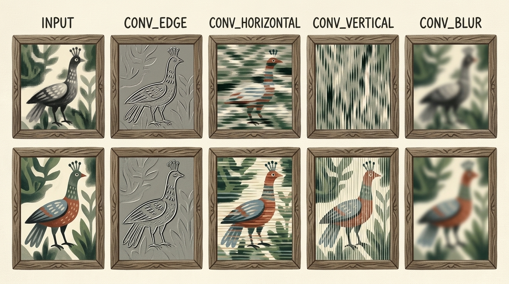
    <figcaption style="margin-top: 0.6em; text-align: center; font-size: 13px; color: #888;"><em>Şekil 8.3: CIFAR-10 görüntüsü üzerine uygulanan el yapımı 3x3 konvolüsyon filtreleri. Yüksek geçiren filtreler mekânsal türevleri (kenarlar, yatay ve dikey çizgiler) vurgularken, tekdüze ortalama filtreleri yüksek frekansları bulanıklaştırır.</em></figcaption>
  </div>
</figure>

### 2.1 `nn.Conv2d` ile El Yapımı Filtrelerin Tanımlanması

Tek kanallı bir `nn.Conv2d` modülü oluşturup `bias=False` yaparak ağırlık tensörüne el ile değer atayabiliriz:

```python
import torch
import torch.nn as nn

# Kenar tespit çekirdeği (Laplacian benzeri)
edge_kernel = torch.tensor([
    [-1.0, -1.0, -1.0],
    [-1.0,  8.0, -1.0],
    [-1.0, -1.0, -1.0]
])

# 1 kanallı Conv2d katmanı oluşturma
conv = nn.Conv2d(in_channels=1, out_channels=1, kernel_size=3, padding=1, bias=False)

# Ağırlık tensörüne manuel çekirdeği kopyalama (Şekil: out_channels, in_channels, k_h, k_w)
with torch.no_grad():
    conv.weight.copy_(edge_kernel.unsqueeze(0).unsqueeze(0))
```

Kenar filtresi homojen parlaklıktaki bir bölgeden geçtiğinde, merkezdeki pozitif ağırlık ($+8$) çevreleyen negatif ağırlıkları (sekiz adet $-1$) tam olarak sıfırlar ve çıktı $0$ olur. Keskin bir yoğunluk sınırında ise bu denge bozulur ve yüksek genlikli aktivasyonlar üretilir.

### 2.2 Çok Kanallı Konvolüsyonlar ve Parametre Boyutları

Gerçek görsel girdiler birden fazla renk kanalı barındırır (RGB için $C\_{\text{in}} = 3$) ve ara katmanlar onlarca veya yüzlerce özellik haritası içerir.

$\mathbf{X} \in \mathbb{R}^{B \times C\_{\text{in}} \times H\_{\text{in}} \times W\_{\text{in}}}$ girdi tensörü için $C\_{\text{out}}$ çıkış kanalına sahip bir katman; 4B bir ağırlık tensörü $\mathbf{W} \in \mathbb{R}^{C\_{\text{out}} \times C\_{\text{in}} \times K\_H \times K\_W}$ ve 1B bir sapma vektörü $\mathbf{b} \in \mathbb{R}^{C\_{\text{out}}}$ gerektirir.

<figure style="display:flex; justify-content: center; margin: 25px 0;">
  <div style="text-align: center;">
    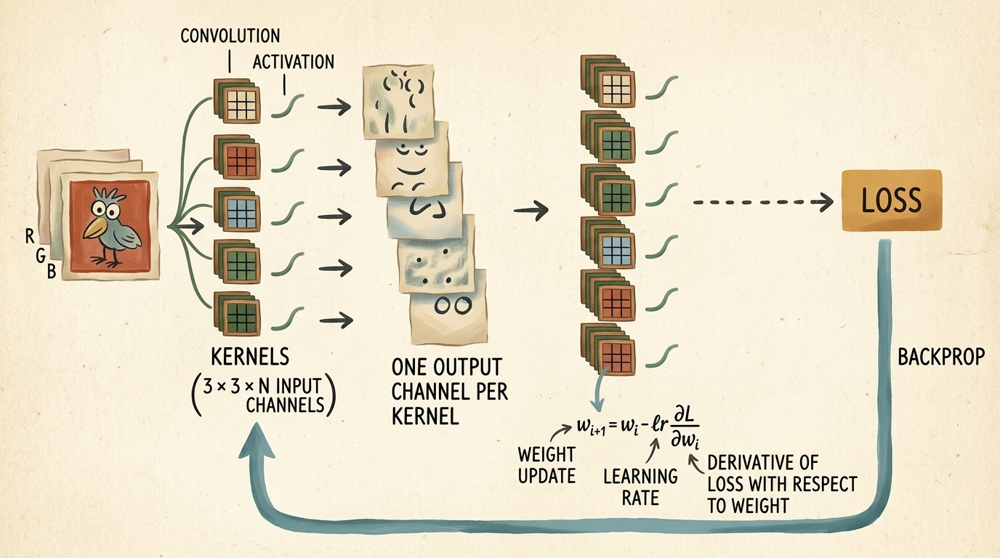
    <figcaption style="margin-top: 0.6em; text-align: center; font-size: 13px; color: #888;"><em>Şekil 8.4: Çok kanallı konvolüsyon iş akışı. Her bir çıktı özellik haritası, tüm girdi kanalları üzerindeki 2B konvolüsyonların toplanmasıyla elde edilir. Çekirdek ağırlıkları, kaybın ağırlıklara göre gradyanı hesaplanarak geriye yayılımla güncellenir.</em></figcaption>
  </div>
</figure>

Çıktı kanalı $c\_{\text{out}}$'un $(i, j)$ konumundaki değeri, tüm girdi kanalları üzerinden toplanarak hesaplanır:

$$ \mathbf{Y}\_{c\_{\text{out}}, i, j} = \mathbf{b}\_{c\_{\text{out}}} + \sum\_{c\_{\text{in}}=0}^{C\_{\text{in}}-1} \sum\_{m=-k\_h}^{k\_h} \sum\_{n=-k\_w}^{k\_w} \mathbf{X}\_{c\_{\text{in}}, i+m, j+n} \mathbf{W}\_{c\_{\text{out}}, c\_{\text{in}}, m, n} $$

Öğrenilebilir parametre sayısı:

$$ \text{Parametreler} = C\_{\text{out}} \times \left( C\_{\text{in}} \times K\_H \times K\_W + 1 \right) $$

$C\_{\text{in}} = 3$, $C\_{\text{out}} = 16$ ve $3 \times 3$ çekirdekler için:
$$ \text{Parametreler} = 16 \times (3 \times 3 \times 3 + 1) = 16 \times 28 = 448 $$
Bu sayı, denk bir doğrusal katmandan katbekat küçüktür.

---

## 3. Mekânsal Alt-Örnekleme ve Boyut İndirgeme: Max Pooling

Konvolüsyonlar yerel ilişkileri korurken, bir kuşu veya uçağı bütünüyle tanımak geniş bir mekânsal bağlamı birleştirmeyi gerektirir. $3 \times 3$ konvolüsyonları 1 adımla art arda dizmek, alıcı alanı katman başına yalnızca 2 piksel genişletir. Bilgiyi hiyerarşik olarak birleştirmek ve bellek tüketimini azaltmak için **havuzlama (pooling)** katmanları kullanılır.

<figure style="display:flex; justify-content: center; margin: 25px 0;">
  <div style="text-align: center;">
    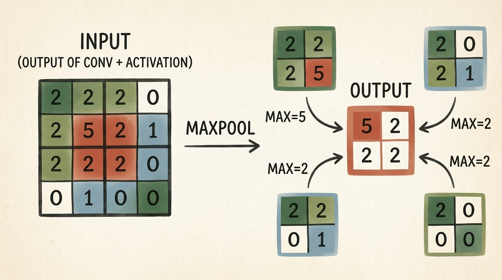
    <figcaption style="margin-top: 0.6em; text-align: center; font-size: 13px; color: #888;"><em>Şekil 8.5: 2x2 Max Pooling ile boyut indirgeme. Girdi özellik haritası örtüşmeyen 2x2 ızgaralara bölünür; her penceredeki en büyük aktivasyon ileriye iletilir, baskın özellikleri koruyarak çözünürlüğü yarıya indirir.</em></figcaption>
  </div>
</figure>

### 3.1 Max Pooling ve Average Pooling Karşılaştırması

- **Maksimum Havuzlama (`nn.MaxPool2d`):** Pencere içindeki en büyük değeri seçer:
  $$ Y\_{i, j} = \max\_{m, n \in [0, K-1]} X\_{i \cdot S + m, j \cdot S + n} $$
  Özellik haritaları belirli görsel kalıpların varlık olasılıklarını temsil ettiğinden, maksimum değerin seçilmesi o bölgedeki en güçlü tespit sinyalini korur ve yerel öteleme değişmezliği kazandırır.
- **Ortalama Havuzlama (`nn.AvgPool2d`):** Pencere ortalamasını alır; keskin kenar tepkilerini yumuşatarak seyreltebilir.

### 3.2 Alıcı Alanın (Receptive Field) Genişlemesi

Bir nöronun **alıcı alanı**, orijinal girdi görüntüsünde o nöronun aktivasyonunu etkileyebilen bölgesel alandır. Havuzlama ile boyut indirgemek, sonraki konvolüsyon katmanlarının alıcı alanını katlanarak büyütür.

<figure style="display:flex; justify-content: center; margin: 25px 0;">
  <div style="text-align: center;">
    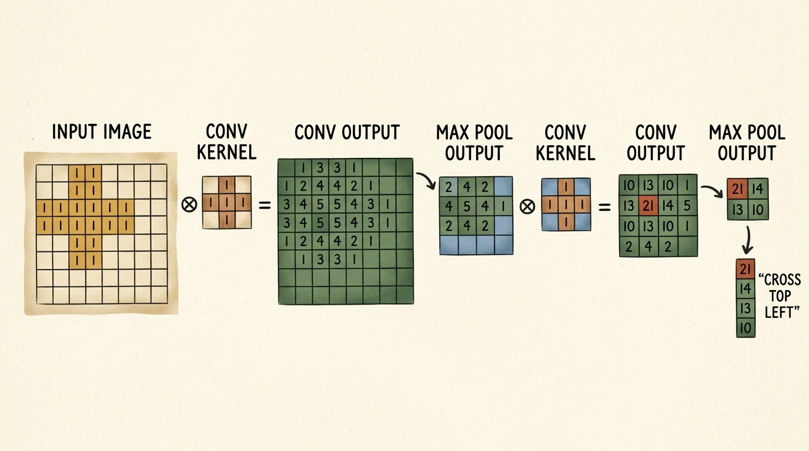
    <figcaption style="margin-top: 0.6em; text-align: center; font-size: 13px; color: #888;"><em>Şekil 8.6: Kademeli konvolüsyon ve havuzlama ile hiyerarşik temsil. İlk katmanlar mikro kenarları tespit ederken; derin havuzlanmış katmanlar küresel kompozit yapıları ("Cross Top Left") algılar.</em></figcaption>
  </div>
</figure>

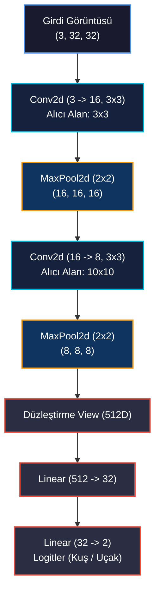

---

## 4. Temel Konvolüsyonel Ağın İnşası (`Net`)

Konvolüsyonları, aktivasyonları, havuzlamaları ve tam bağlantılı katmanları birleştirerek uçtan uca bir CNN mimarisi kuruyoruz.

<figure style="display:flex; justify-content: center; margin: 25px 0;">
  <div style="text-align: center;">
    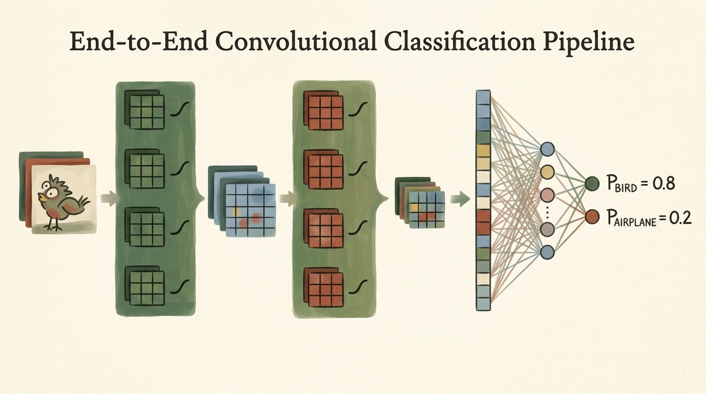
    <figcaption style="margin-top: 0.6em; text-align: center; font-size: 13px; color: #888;"><em>Şekil 8.7: 3 kanallı piksellerden başlayarak mekânsal özellik çıkarımı, düzleştirme ve yoğun karar katmanlarıyla sınıf olasılıkları üreten uçtan uca hat.</em></figcaption>
  </div>
</figure>

### 4.1 Mimari Tasarım ve Tensör Boyut Akışı

Kitabın 8. Bölümündeki temel model, iki konvolüsyonel aşama ve ardından iki katmanlı bir MLP başlığı içerir:

<figure style="display:flex; justify-content: center; margin: 25px 0;">
  <div style="text-align: center;">
    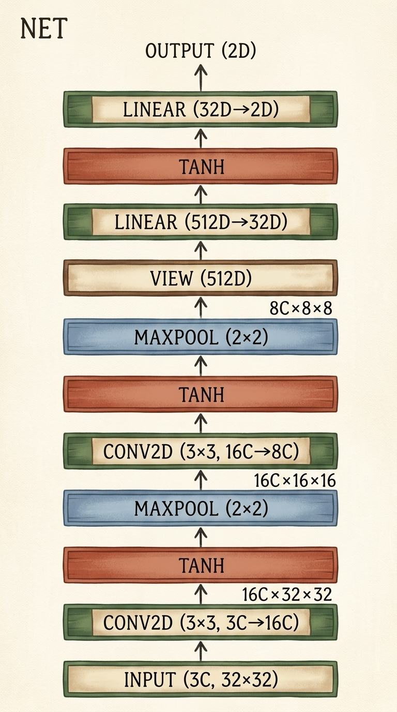
    <figcaption style="margin-top: 0.6em; text-align: center; font-size: 13px; color: #888;"><em>Şekil 8.8: Temel Net modelinin adım adım tensör boyut akışını belgeleyen katman mimarisi.</em></figcaption>
  </div>
</figure>

Tensör boyutlarının katman katman izi:
1. **Girdi:** $\mathbf{X} \in \mathbb{R}^{B \times 3 \times 32 \times 32}$.
2. **Conv 1:** `nn.Conv2d(3, 16, kernel_size=3, padding=1)`. Çıktı: $(B, 16, 32, 32)$.
3. **Act 1:** `nn.Tanh()`.
4. **Pool 1:** `nn.MaxPool2d(2)`. Çıktı: $(B, 16, 16, 16)$.
5. **Conv 2:** `nn.Conv2d(16, 8, kernel_size=3, padding=1)`. Çıktı: $(B, 8, 16, 16)$.
6. **Act 2:** `nn.Tanh()`.
7. **Pool 2:** `nn.MaxPool2d(2)`. Çıktı: $(B, 8, 8, 8)$.
8. **Düzleştirme:** `.view(-1, 8 * 8 * 8)`. Çıktı: $(B, 512)$.
9. **Linear 1:** `nn.Linear(512, 32)`. Çıktı: $(B, 32)$.
10. **Act 3:** `nn.Tanh()`.
11. **Linear 2:** `nn.Linear(32, 2)`. Çıktı: $(B, 2)$.

### 4.2 Parametre Sayımı: Yoğun vs. Konvolüsyonel

| Katman | Tür | Yapılandırma | Ağırlık Parametreleri | Sapma (Bias) | Toplam Parametre |
| :--- | :--- | :--- | :--- | :--- | :--- |
| `conv1` | `nn.Conv2d` | $3 \to 16$, $3 \times 3$ | $16 \times 3 \times 3 \times 3 = 432$ | $16$ | $448$ |
| `conv2` | `nn.Conv2d` | $16 \to 8$, $3 \times 3$ | $8 \times 16 \times 3 \times 3 = 1{,}152$ | $8$ | $1{,}160$ |
| `fc1` | `nn.Linear` | $512 \to 32$ | $32 \times 512 = 16{,}384$ | $32$ | $16{,}416$ |
| `fc2` | `nn.Linear` | $32 \to 2$ | $2 \times 32 = 64$ | $2$ | $66$ |
| **Toplam** | | | | | **$18{,}090$** |

Bölüm 7'deki tam bağlantılı ağımız **$1{,}574{,}402$ parametreye** ihtiyaç duyuyordu. Konvolüsyonel model parametre sayısını **%98'in üzerinde azaltmış**, aynı zamanda genelleme başarımını radikal olarak artırmıştır.

---

## 5. Fonksiyonel API ile Temiz Kod Mimarisi (`torch.nn.functional`)

PyTorch'ta parametre barındıran katmanlar (`nn.Conv2d`, `nn.Linear`, `nn.BatchNorm2d`) `__init__` bloğunda alt modül olarak tanımlanmalıdır. Ancak ağırlığı olmayan durumsuz (*stateless*) işlemler (`F.relu`, `torch.tanh`, `F.max_pool2d`) doğrudan `forward()` içinde fonksiyonel olarak çağrılır:

```python
import torch
import torch.nn as nn
import torch.nn.functional as F

class Net(nn.Module):
    def __init__(self):
        super().__init__()
        self.conv1 = nn.Conv2d(3, 16, kernel_size=3, padding=1)
        self.conv2 = nn.Conv2d(16, 8, kernel_size=3, padding=1)
        self.fc1 = nn.Linear(8 * 8 * 8, 32)
        self.fc2 = nn.Linear(32, 2)

    def forward(self, x):
        out = F.max_pool2d(torch.tanh(self.conv1(x)), kernel_size=2)
        out = F.max_pool2d(torch.tanh(self.conv2(out)), kernel_size=2)
        out = out.view(-1, 8 * 8 * 8)
        out = torch.tanh(self.fc1(out))
        out = self.fc2(out)
        return out
```

---

## 6. Model Kapasitesinin Kontrolü ve Düzenlileştirme (Regularization)

Kapasite arttıkça model eğitim verisini ezberleyebilir (**aşırı öğrenme / overfitting**). Genelleme yeteneğini artırmak için dört temel yöntem kullanılır:
1. **Genişlik (Width):** Katman başına kanal sayısını artırmak.
2. **L2 Regularizasyonu (Weight Decay):** Ağırlıkların aşırı büyümesini cezalandırmak.
3. **Dropout:** Nöronlar arasındaki ortak uyumu rastgele kırmak.
4. **Batch Normalization:** Katman girdilerinin dağılımını normalize etmek.

### 6.1 L2 Regularizasyonu ve Weight Decay

L2 regularizasyonu, kayıp fonksiyonuna ağırlıkların karesiyle orantılı bir ceza ekler:

$$ \mathcal{L}\_{\text{total}}(\mathbf{w}) = \mathcal{L}\_0(\mathbf{w}) + \frac{\lambda}{2} \sum\_{l} \left\\| \mathbf{W}\_l \right\\|\_2^2 $$

Stokastik gradyan inişinde ağırlık güncellemesi şu şekle dönüşür:

$$ \mathbf{w}\_{t+1} = (1 - \eta \lambda) \mathbf{w}\_t - \eta \nabla\_{\mathbf{w}} \mathcal{L}\_0 $$

Burada $(1 - \eta \lambda) < 1$ olduğundan her adımda ağırlıklar sıfıra doğru küçültülür (*weight decay*). PyTorch optimizatöründe doğrudan ayarlanabilir:

```python
optimizer = torch.optim.SGD(model.parameters(), lr=1e-2, weight_decay=1e-3)
```

### 6.2 Dropout ve Mekânsal Dropout (`nn.Dropout2d`)

Görüntü verisinde komşu pikseller yüksek korelasyona sahip olduğundan, standart dropout yerine tüm 2B kanalı topyekûn sıfırlayan **`nn.Dropout2d`** tercih edilir:

```python
self.conv1_dropout = nn.Dropout2d(p=0.4)
```

> [!IMPORTANT]
> Dropout eğitim sırasında aktivasyonları $\frac{1}{1-p}$ ile ölçekler; çıkarım aşamasında devre dışı bırakılması için değerlendirmeden önce mutlaka `model.eval()` çağrılmalıdır.

### 6.3 Batch Normalization

Batch Normalization, derin ağlarda katman girdilerinin eğitim boyunca sürekli kaymasını (*internal covariate shift*) engeller.

<figure style="display:flex; justify-content: center; margin: 25px 0;">
  <div style="text-align: center;">
    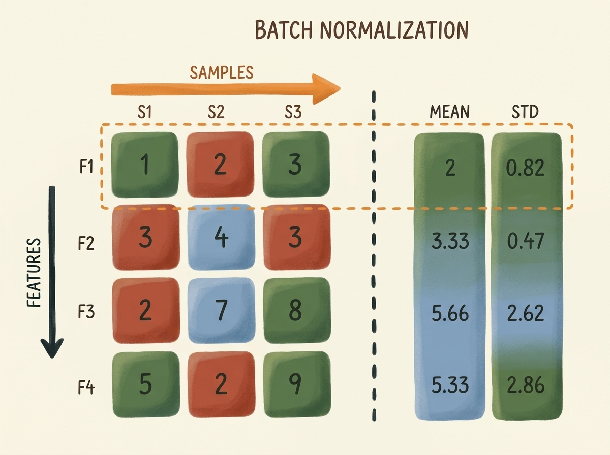
    <figcaption style="margin-top: 0.6em; text-align: center; font-size: 13px; color: #888;"><em>Şekil 8.9: Batch Normalization işleyişi. Mini-batch içindeki her özellik kanalı için ortalama ve varyans hesaplanarak değerler sıfır ortalama ve birim varyansa çekilir, ardından öğrenilebilir ölçek ve kaydırma parametreleri uygulanır.</em></figcaption>
  </div>
</figure>

Mini-batch $\mathcal{B}$ için kanal istatistikleri:
$$ \mu\_{\mathcal{B}} = \frac{1}{m} \sum\_{i=1}^{m} x\_i, \quad \sigma\_{\mathcal{B}}^2 = \frac{1}{m} \sum\_{i=1}^{m} (x\_i - \mu\_{\mathcal{B}})^2 $$
Normalize edilmiş aktivasyon ve öğrenilebilir parametreler:
$$ \hat{x}\_i = \frac{x\_i - \mu\_{\mathcal{B}}}{\sqrt{\sigma\_{\mathcal{B}}^2 + \epsilon}}, \quad y\_i = \gamma \hat{x}\_i + \beta $$

---

## 7. Daha Derine İnmek: ResNet'ler ve Atlama Bağlantıları

Geleneksel ileri beslemeli ağlar 20-30 katmanın üzerine çıktığında, **kaybolan gradyanlar (vanishing gradients)** sebebiyle başarım çöker.

<figure style="display:flex; justify-content: center; margin: 25px 0;">
  <div style="text-align: center;">
    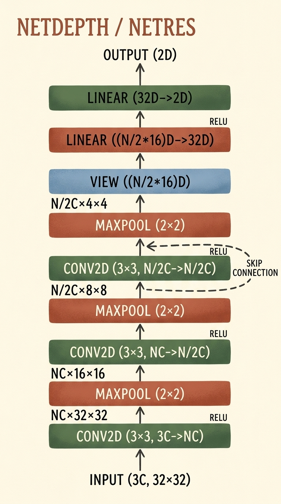
    <figcaption style="margin-top: 0.6em; text-align: center; font-size: 13px; color: #888;"><em>Şekil 8.10: Özdeşlik atlama bağlantısı (skip connection) içeren NetRes mimarisi. Gradyan sinyallerinin geriye yayılım sırasında zayıflamadan iletilmesini sağlayan otoyollar oluşturur.</em></figcaption>
  </div>
</figure>

### 7.1 Artık Öğrenme Formülasyonu

Kaiming He ve arkadaşları (2015), katmanların doğrudan $\mathcal{H}(\mathbf{x})$ eşlemesini öğrenmesi yerine artık eşlemeyi öğrenmesini önermiştir:

$$ \mathcal{F}(\mathbf{x}) = \mathcal{H}(\mathbf{x}) - \mathbf{x} \implies \mathcal{H}(\mathbf{x}) = \mathcal{F}(\mathbf{x}) + \mathbf{x} $$

<figure style="display:flex; justify-content: center; margin: 25px 0;">
  <div style="text-align: center;">
    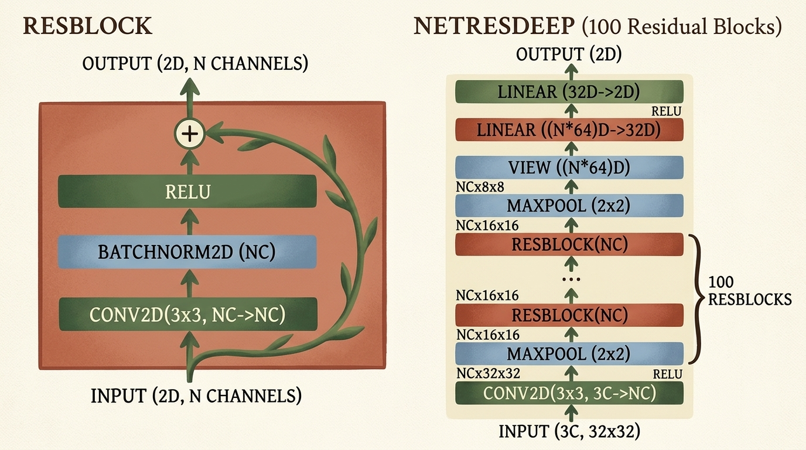
    <figcaption style="margin-top: 0.6em; text-align: center; font-size: 13px; color: #888;"><em>Şekil 8.11: Batch Normalization ve atlama bağlantısına sahip ResBlock yapısı ve bu blokların 100 kat art arda dizilmesiyle oluşturulan NetResDeep mimarisi.</em></figcaption>
  </div>
</figure>

Gradyan türevi alındığında:

$$ \frac{\partial \mathcal{L}}{\partial \mathbf{x}} = \frac{\partial \mathcal{L}}{\partial \mathcal{H}} \frac{\partial \mathcal{F}(\mathbf{x})}{\partial \mathbf{x}} + \frac{\partial \mathcal{L}}{\partial \mathcal{H}} $$

$\frac{\partial \mathcal{L}}{\partial \mathcal{H}}$ terimi doğrudan hiçbir ağırlık matrisiyle çarpılmadan ilk katmanlara kadar kesintisiz akar!

### 7.2 PyTorch ile `ResBlock` ve `NetResDeep`

```python
class ResBlock(nn.Module):
    def __init__(self, n_chans):
        super().__init__()
        self.conv = nn.Conv2d(n_chans, n_chans, kernel_size=3, padding=1, bias=False)
        self.bn = nn.BatchNorm2d(num_features=n_chans)
        
    def forward(self, x):
        out = self.conv(x)
        out = self.bn(out)
        out = torch.relu(out)
        return out + x  # Artık özdeşlik bağlantısı

class NetResDeep(nn.Module):
    def __init__(self, n_chans=32, n_blocks=100):
        super().__init__()
        self.n_chans = n_chans
        self.conv1 = nn.Conv2d(3, n_chans, kernel_size=3, padding=1)
        # 100 artık blok ardışık olarak bağlanır
        self.resblocks = nn.Sequential(
            *(n_blocks * [ResBlock(n_chans=n_chans)])
        )
        self.fc1 = nn.Linear(8 * 8 * n_chans, 32)
        self.fc2 = nn.Linear(32, 2)

    def forward(self, x):
        out = F.max_pool2d(torch.relu(self.conv1(x)), 2)
        out = self.resblocks(out)
        out = F.max_pool2d(out, 2)
        out = out.view(-1, 8 * 8 * self.n_chans)
        out = torch.relu(self.fc1(out))
        return self.fc2(out)
```

---

## 8. Mimarilerin Karşılaştırmalı Başarım Analizi

Farklı mimari seçimlerin ve düzenlileştirme yöntemlerinin CIFAR-2 (Kuşlar ve Uçaklar) üzerindeki sonuçları:

<figure style="display:flex; justify-content: center; margin: 25px 0;">
  <div style="text-align: center;">
    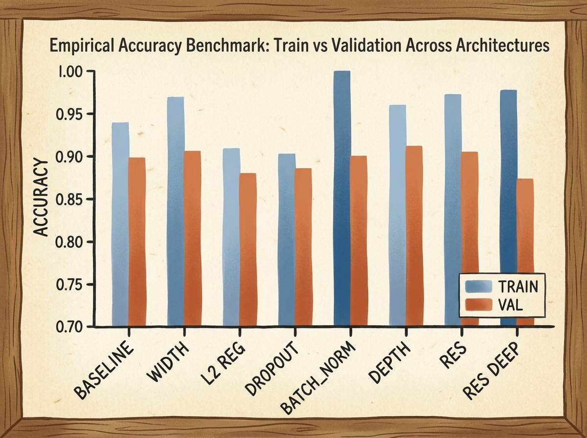
    <figcaption style="margin-top: 0.6em; text-align: center; font-size: 13px; color: #888;"><em>Şekil 8.12: CIFAR-2 üzerinde 8 farklı mimarinin eğitim ve doğrulama başarımları. Daha geniş modeller eğitimi %100'e yaklaştırırken, regularizasyon ve artık bağlantılar test genellemesini en üst seviyeye taşır.</em></figcaption>
  </div>
</figure>

### 8.1 Karşılaştırma Tablosu

| Model Mimarisi | Eğitim Başarımı | Doğrulama Başarımı | Genelleme Farkı | Temel Nitelik |
| :--- | :--- | :--- | :--- | :--- |
| **`BASELINE`** | %93.8 | %89.7 | %4.1 | Kompakt 2 katmanlı CNN ($18\text{K}$ parametre). |
| **`WIDTH`** | %96.8 | %90.4 | %6.4 | İki kat kanal sayısı; yüksek ifade gücü, hafif aşırı öğrenme. |
| **`L2 REG`** | %90.8 | %87.9 | %2.9 | Parametre büyüklüklerini sınırlar, aşırı öğrenmeyi baskılar. |
| **`DROPOUT`** | %90.2 | %88.5 | %1.7 | En düşük genelleme farkı; ortak uyumu engeller. |
| **`BATCH_NORM`** | %99.8 | %89.9 | %9.9 | Hızlı yakınsama, iç katman dağılımlarını dengeler. |
| **`DEPTH`** | %95.8 | %91.0 | %4.8 | İlave katman alıcı alanı genişletir. |
| **`RES`** | %97.1 | %90.3 | %6.8 | Atlama bağlantısı gradyan akışını korur. |
| **`RES DEEP`** | %97.6 | %87.2 | %10.4 | 100 artık katman; kaybolan gradyan olmadan stabil eğitim. |

---

## 9. Özet ve Temel Çıkarımlar

1. **Görsel Veride İndüktif Önyargı:** Tam bağlantılı katmanlar görüntüler için son derece verimsizdir. Konvolüsyonlar **yerellik** ve **öteleme değişmezliği** ilkelerini kullanarak parametre sayısını radikal biçimde azaltır.
2. **Dolgu ve Havuzlama:** Sıfır dolgusu ($P = \lfloor K/2 \rfloor$) sınır koordinatlarını korur. Maksimum havuzlama ise mekânsal çözünürlüğü düşürerek yerel değişmezlik sağlar ve alıcı alanı büyüterek küresel semantiği yakalar.
3. **Temiz PyTorch Mimarisi:** Parametreli katmanlar `__init__` içinde, durumsuz aktivasyon ve havuzlama işlemleri ise `torch.nn.functional` üzerinden `forward` içinde çağrılır.
4. **Düzenlileştirme:** L2 weight decay ağırlıkları küçültür; dropout nöron ezberini bozar; batch normalization mini-batch dağılımını dengeler.
5. **Artık Ağlar (ResNet):** Özdeşlik bağlantıları ($\mathcal{F}(\mathbf{x}) + \mathbf{x}$) gradyan sinyalini doğrudan taşıyarak ağların yüzlerce katman derinliğe kaybolan gradyan problemi yaşamaksızın ölçeklenmesini sağlar.
