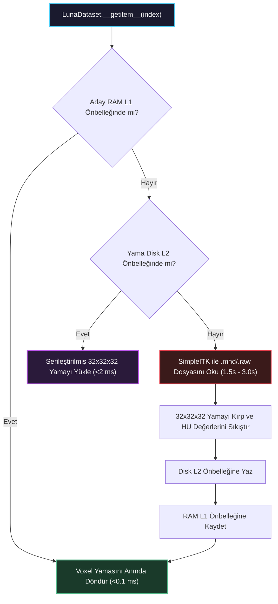

```mermaid
flowchart TD
    subgraph StorageLayer ["Disk Depolama Katmanı"]
        direction TB
        subgraph CTFiles ["Hacimsel BT Dosyaları (.mhd / .raw)"]
            direction LR
            MHD[".mhd Başlık Dosyası<br/>(Origin, Spacing, Direction)"]
            RAW[".raw İkili Dosya<br/>(Little-Endian Int16 HU)"]
        end
        subgraph CSVFiles ["Tablosal Anotasyon Dosyaları (.csv)"]
            direction LR
            CSVAnn["annotations.csv<br/>(Doğrulanmış Gerçek Nodüller)"]
            CSVCand["candidates.csv<br/>(Tüm Şüpheli Aday Noktalar)"]
        end
        CTFiles --> CSVFiles
    end

    subgraph ParsingEngine ["Veri Bütünleştirme ve Koordinat Çözümleme"]
        direction TB
        AnnotParse["Anotasyonları series_uid ve<br/>Öklid Uzaklığı ile Eşleştirme"]
        SITKLoad["SimpleITK Hacimsel Okuma:<br/>Origin, Spacing ve Voxel Dizisini Çıkarma"]
        AffineCoord["Afin Koordinat Dönüşümü:<br/>Hasta Uzayı (mm) ➔ Voxel Uzayı (IRC)"]
        AnnotParse --> SITKLoad --> AffineCoord
    end

    subgraph MemoryOptimization ["Yama Kırpma ve Kademeli Önbellekleme"]
        direction TB
        PatchCrop["3B Hacimsel Yama Kırpma<br/>(32 x 32 x 32 Voxel)"]
        HUClamp["Hounsfield Kırpma:<br/>[-1000 HU, +1000 HU] ➔ Float32 Normalizasyonu"]
        TierCache["Kademeli Önbellek:<br/>Bellek İçi (lru_cache) + Disk Kalıcılığı (diskcache)"]
        PatchCrop --> HUClamp --> TierCache
    end

    subgraph DatasetInterface ["PyTorch Dataset Arayüzü (LunaDataset)"]
        direction TB
        SampleTuple["__getitem__ Çıktısı:<br/>(Tensör[1, 32, 32, 32], Etiket[0/1], series_uid, Merkez_IRC)"]
        GroupSplit["Gruplu Bölümleme:<br/>10-Katlı Series UID Çapraz Doğrulama (Sıfır Sızıntı)"]
        SampleTuple --> GroupSplit
    end

    StorageLayer --> ParsingEngine
    ParsingEngine --> MemoryOptimization
    MemoryOptimization --> DatasetInterface

    style StorageLayer fill:#1a1a2e,stroke:#4cc9f0,stroke-width:2px,color:#fff
    style CTFiles fill:#16213e,stroke:#4cc9f0,stroke-width:1px,color:#fff
    style CSVFiles fill:#16213e,stroke:#4cc9f0,stroke-width:1px,color:#fff
    style ParsingEngine fill:#1a3a2a,stroke:#52b788,stroke-width:2px,color:#fff
    style MemoryOptimization fill:#2a1a3a,stroke:#bd53ed,stroke-width:2px,color:#fff
    style DatasetInterface fill:#3a2a1a,stroke:#ffaa00,stroke-width:2px,color:#fff
```

# Veri Kaynaklarını Birleştirilmiş Bir Veri Kümesinde Toplamak

<!-- toc -->

<div style="margin-bottom: 20px;">
  <a href="https://colab.research.google.com/github/emreaslan7/ai/blob/main/notebooks/deep-learning-with-pytorch/12-combining-data-sources-into-a-unified-dataset.ipynb" target="_blank">
    
  </a>
</div>

---

## 1. 3 Boyutlu Medikal Derin Öğrenmede Veri Yükleme Darboğazı

Standart 2 boyutlu bilgisayarlı görü iş akışlarında (örneğin ImageNet üzerinde sınıflandırma veya COCO üzerinde nesne tespiti), veri kümeleri çoğunlukla piksel indislerinin doğrudan görüntü koordinatlarına karşılık geldiği bağımsız JPEG veya PNG dosyalarından oluşur. Ancak medikal görüntüleme ve özellikle yüksek çözünürlüklü torasik Bilgisayarlı Tomografi (BT / CT), bu basitliği temel mimari boyutlarda kökten değiştirir:

1. **Büyük Hacimsel Ölçek (Volumetric Scale):** Tek bir torasik BT taraması, yüzlerce ardışık 2B kesitten (genellikle 150–500 transvers düzlem boyunca $512 \times 512$ voxel) oluşan 3 boyutlu bir ızgaradır ve hasta başına sıkıştırılmamış $50\text{ MB ila }200\text{ MB}$ ham bellek tüketir.
2. **Fiziksel Uzay ile Ayrık Bellek Dizinlerinin Ayrışması:** İnsan anatomisindeki fiziksel yapılar mutlak milimetreler ($X, Y, Z$) ile ölçülürken, tensörler tam sayı matris indisleri ($[I, R, C]$) ile adreslenir. Cihazlar farklı kesit kalınlıkları ve tarama alanları (field of view) kullandığından, milimetre ile ayrık voxeller arasındaki uzamsal oran hastadan hastaya değişir.
3. **Aşırı Sınıf Dengesizliği (Class Imbalance):** LUNA (LUng Nodule Analysis) yarışması veri kümesinde, uzman radyologlar 888 hasta taramasında yaklaşık $1.351$ gerçek nodül etiketlemişken, klasik aday tespit filtreleri $550.000$'den fazla şüpheli doku konumu üretmiştir. Gerçek nodüller tüm adayların $\%0,25$'inden daha azını oluşturur.
4. **Veri Sızıntısı (Data Leakage) Riski:** Bir hastanın akciğer hacminde birden fazla şüpheli aday bulunabilir. Adayları rastgele eğitim ve doğrulama kümelerine dağıtmak, aynı hastanın farklı dilimlerinin her iki kümeye de sızmasına yol açarak doğrulama başarımını yanıltıcı hale getirir.

Bu modül, uçtan uca akciğer kanseri tespit sistemimizin **1. Adımını (Veri Yükleme ve Ön İşleme Hattı)** kurarak heterojen BT disk dosyalarını ve CSV anotasyon kataloglarını optimize edilmiş, önbellek destekli ve 3B tensör yamaları (`patches`) üreten bir PyTorch `Dataset` yapısına dönüştürür.

<figure style="display:flex; justify-content: center; margin: 25px 0;">
  <div style="text-align: center;">
    
    <figcaption style="margin-top: 0.6em; text-align: center; font-size: 13px; color: #888;"><em>Şekil 1: Uçtan uca akciğer kanseri tespit boru hattı. 1. Adım, sonraki 3B CNN sınıflandırma ve U-Net segmentasyon modellerini besleyen hacimsel veri yükleme motorunu inşa eder.</em></figcaption>
  </div>
</figure>



---

## 2. Ana Veri Hattı Mimarisi (Master Pipeline)

Bütünleştirilmiş veri kümesi mimarisi iki temel veri akışını bir araya getirir:
1. **Hacimsel Medikal Görüntü Akışı:** MetaImage formatında (`.mhd` + `.raw`) saklanan yüksek çözünürlüklü 3B BT taramaları.
2. **Tablosal Anotasyon Akışı:** Aday koordinatlarını ve klinik etiketleri barındıran CSV dosyaları.

<figure style="display:flex; justify-content: center; margin: 25px 0;">
  <div style="text-align: center;">
    
    <figcaption style="margin-top: 0.6em; text-align: center; font-size: 13px; color: #888;"><em>Şekil 2: Veri yükleme hattının ana mimarisi. Ham BT hacimleri ve CSV anotasyonları, bir afin uzamsal dönüşüm matrisi aracılığıyla yapılandırılmış eğitim demetlerinde birleştirilir.</em></figcaption>
  </div>
</figure>

Bu boru hattı her bir aday için 4 elemanlı yapılandırılmış bir demet (`tuple`) üretir:
- **`candidate_tensor`:** Aday nodül merkezli $32 \times 32 \times 32$ boyutunda 3 boyutlu kayan noktalı (`float32`) tensör yaması.
- **`is_nodule_bool`:** Boole yer gerçeği etiketi (gerçek nodüller için $1$, yalancı pozitifler için $0$).
- **`series_uid`:** Taramanın ait olduğu hastayı temsil eden benzersiz alfanumerik kimlik dizgisi.
- **`candidate_location_irc`:** Kırpılan yamanın merkezini temsil eden ayrık tamsayı voxel koordinatı $(I, R, C)$.

---

## 3. LUNA Anotasyon ve Aday Kayıtlarının Ayrıştırılması

### 3.1 Tablosal Verinin Yapısı

LUNA Grand Challenge yarışması iki ayrı CSV tablosu sunar:
1. `annotations.csv`: Uzman radyologlar tarafından doğrulanmış gerçek nodül kayıtlarını içerir:
   - `series_uid`: Tarama kimliği.
   - `coordX`, `coordY`, `coordZ`: Hasta koordinat sisteminde milimetre cinsinden nodül merkezi.
   - `diameter_mm`: Nodülün milimetre cinsinden yaklaşık küresel çapı.
2. `candidates.csv`: Sezgisel aday tespit algoritmaları tarafından taranmış şüpheli noktaları içerir:
   - `series_uid`: Tarama kimliği.
   - `coordX`, `coordY`, `coordZ`: Aday merkezi (milimetre).
   - `class`: İkili sınıf belirteci ($1$ = doğrulanmış nodül, $0$ = yalancı pozitif doku).

<figure style="display:flex; justify-content: center; margin: 25px 0;">
  <div style="text-align: center;">
    
    <figcaption style="margin-top: 0.6em; text-align: center; font-size: 13px; color: #888;"><em>Şekil 3: CSV anotasyonlarının ayrıştırılması. Sürekli uzamsal koordinatlar $(X, Y, Z)$ okunur, gerçek nodül etiketleri ve tarama kimlikleriyle eşleştirilir.</em></figcaption>
  </div>
</figure>

### 3.2 Anotasyonların ve Aday Koordinatlarının Eşleştirilmesi

Aday üretme algoritmalarının çıkardığı koordinatlar radyologların işaretlediği merkezlerle milimetrik olarak birebir örtüşmeyebilir. Bu nedenle, adayın koordinatının aynı `series_uid` altındaki herhangi bir gerçek nodül merkezine olan Öklid uzaklığı $r \le \frac{1}{2}\text{diameter\\_mm}$ yarıçapında ise, bu adayı ilgili nodül çapıyla eşleştiririz.

```python
import csv
import functools
import glob
import os
from collections import namedtuple

# Değişmez temiz kayıt tipi
CandidateInfoTuple = namedtuple(
    'CandidateInfoTuple',
    ['is_nodule_bool', 'diameter_mm', 'series_uid', 'center_xyz']
)

@functools.lru_cache(maxsize=1)
def get_candidate_info_list(require_on_disk_bool=True):
    """
    annotations.csv ve candidates.csv dosyalarını ayrıştırır,
    gerçek nodül çapları ile aday konumlarını tek bir listede birleştirir.
    """
    mhd_list = glob.glob('data-unversioned/part2/luna/subset*/*.mhd')
    present_on_disk_set = {os.path.split(p)[-1][:-4] for p in mhd_list}

    # Adım 1: Gerçek anotasyonları oku ve series_uid'ye göre grupla
    diameter_dict = {}
    with open('data/part2/luna/annotations.csv', 'r') as f:
        for row in list(csv.reader(f))[1:]:
            series_uid = row[0]
            annotation_center_xyz = tuple(float(x) for x in row[1:4])
            annotation_diameter_mm = float(row[4])

            diameter_dict.setdefault(series_uid, []).append(
                (annotation_center_xyz, annotation_diameter_mm)
            )

    # Adım 2: Tüm adayları oku ve nodül çaplarıyla eşleştir
    candidate_info_list = []
    with open('data/part2/luna/candidates.csv', 'r') as f:
        for row in list(csv.reader(f))[1:]:
            series_uid = row[0]
            if require_on_disk_bool and series_uid not in present_on_disk_set:
                continue

            is_nodule_bool = bool(int(row[4]))
            candidate_center_xyz = tuple(float(x) for x in row[1:4])

            candidate_diameter_mm = 0.0
            for annotation_center_xyz, annotation_diameter_mm in diameter_dict.get(series_uid, []):
                # Milimetre uzayında Öklid mesafesini hesapla
                delta_mm = sum((c - a) ** 2 for c, a in zip(candidate_center_xyz, annotation_center_xyz)) ** 0.5
                if delta_mm <= (annotation_diameter_mm / 2.0):
                    candidate_diameter_mm = annotation_diameter_mm
                    break

            candidate_info_list.append(CandidateInfoTuple(
                is_nodule_bool=is_nodule_bool,
                diameter_mm=candidate_diameter_mm,
                series_uid=series_uid,
                center_xyz=candidate_center_xyz
            ))

    # Pozitif nodülleri başa alarak sırala (inceleme ve katmanlı bölme kolaylığı)
    candidate_info_list.sort(reverse=True)
    return candidate_info_list
```

---

## 4. Ham BT Taramaları ve MetaImage Formatı (.mhd / .raw)

### 4.1 Dosya Yapısı

LUNA veri kümesindeki her bir BT taraması ortak bir kök ada sahip iki dosyadan oluşur:
- **`series_uid.mhd` (Meta-Header Dosyası):** Düz metin formatında hayati uzamsal kalibrasyon parametrelerini saklar:
  - `DimSize = 512 512 215`: $(X, Y, Z)$ veya $(C, R, I)$ boyunca voxel sayısı.
  - `ElementSpacing = 0.703125 0.703125 1.25`: Voxel başına düşen fiziksel milimetre $(\Delta X, \Delta Y, \Delta Z)$.
  - `Offset = -167.3 -172.5 -385.0`: Voxel $(0, 0, 0)$ noktasının hasta koordinat orijini.
  - `TransformMatrix = 1 0 0 0 1 0 0 0 1`: Tarayıcı gantry yönelim kosinüsleri matrisi.
  - `ElementType = MET_SHORT`: 16-bit işaretli tamsayı formatı (`int16`).
- **`series_uid.raw` (İkili Voxel Dizisi):** $512 \times 512 \times 215 \times 2\text{ bayt} \approx 112.7\text{ MB}$ boyutunda ham ikili bayt dizisidir ve kalibre edilmiş Hounsfield Unit değerlerini saklar.

<figure style="display:flex; justify-content: center; margin: 25px 0;">
  <div style="text-align: center;">
    
    <figcaption style="margin-top: 0.6em; text-align: center; font-size: 13px; color: #888;"><em>Şekil 4: BT hacminin okunması. SimpleITK kütüphanesi .mhd başlığını ve .raw ikili verisini eşzamanlı yükleyerek uzamsal üstverileri 3B voxel dizisiyle birlikte sunar.</em></figcaption>
  </div>
</figure>

### 4.2 SimpleITK ile BT Hacimlerinin Belleğe Alınması

```python
import SimpleITK as sitk
import numpy as np

class Ct:
    def __init__(self, series_uid):
        mhd_path = glob.glob(f"data-unversioned/part2/luna/subset*/{series_uid}.mhd")[0]
        
        # SimpleITK başlık ve ikili veriyi birlikte okur
        ct_itk = sitk.ReadImage(mhd_path)
        
        # 3B NumPy ndarray'e dönüştür (PyTorch için float32)
        # Dikkat: SimpleITK dizileri (Index, Row, Column) -> (Z, Y, X) sırasında döndürür
        ct_array = np.array(sitk.GetArrayFromImage(ct_itk), dtype=np.float32)
        
        # Radyodansite kırpması: Akciğer dokusu -1000 HU (hava) ile +1000 HU (kemik) arasındadır
        ct_array.clip(-1000, 1000, ct_array)
        
        self.series_uid = series_uid
        self.hu_array = ct_array
        self.origin_xyz = tuple(ct_itk.GetOrigin())          # (X, Y, Z) mm cinsinden
        self.spacing_xyz = tuple(ct_itk.GetSpacing())        # (dX, dY, dZ) mm/voxel
        self.direction_matrix = np.array(ct_itk.GetDirection()).reshape(3, 3)
```

---

## 5. Uzamsal Koordinat Sistemleri ve Afin Dönüşüm Matematiği

Medikal hacimsel verilerde iki ayrı uzamsal koordinat sistemi kullanılır.

### 5.1 Hasta Koordinat Sistemi (Millimeter Space)

**Hasta Koordinat Sistemi** (DICOM Patient LPS/RAS uzayı olarak da bilinir), fiziksel anatomiyi mutlak milimetre cinsinden tanımlar:
- **Orijin $(0, 0, 0)$:** Genellikle tarayıcı gantry tünelinin merkezine veya hastanın göğüs kafesi orta hattına kalibre edilir.
- **$X$-Ekseni (Sol / Sağ):** Pozitif değerler hastanın **Soluna (Left)**; negatif değerler **Sağına (Right)** işaret eder.
- **$Y$-Ekseni (Arka / Ön):** Pozitif değerler hastanın **Arkasına (Posterior - Omurga)**; negatif değerler **Önüne (Anterior - Göğüs)** işaret eder.
- **$Z$-Ekseni (Üst / Alt):** Pozitif değerler hastanın **Başına (Superior)**; negatif değerler **Ayaklarına (Inferior)** işaret eder.

<figure style="display:flex; justify-content: center; margin: 25px 0;">
  <div style="text-align: center;">
    
    <figcaption style="margin-top: 0.6em; text-align: center; font-size: 13px; color: #888;"><em>Şekil 5: 3 Boyutlu Hasta Koordinat Sistemi. Milimetre koordinatları $(X, Y, Z)$, hasta anatomisine göre Üst-Alt, Sol-Sağ ve Arka-Ön eksenleri boyunca fiziksel konumu belirler.</em></figcaption>
  </div>
</figure>

### 5.2 Voxel Koordinat Sistemi (Dizi Uzayı)

Sürekli milimetrik uzayın aksine bilgisayar belleğindeki tensörler ayrık tamsayı indislerle $[I, R, C]$ adreslenir:
- **$I$ (Index / Kesit):** Boyuna vücut ekseni boyunca axial dilim indisi ($Z$).
- **$R$ (Row / Satır):** Koronal/transvers eksen boyunca düşey matris indisi ($Y$).
- **$C$ (Column / Sütun):** Sagital/transvers eksen boyunca yatay matris indisi ($X$).
- **Dizi Orijini $(0, 0, 0)$:** En üstteki kesitin en sol-üst köşesindeki ilk voxelde bulunur.

<figure style="display:flex; justify-content: center; margin: 25px 0;">
  <div style="text-align: center;">
    
    <figcaption style="margin-top: 0.6em; text-align: center; font-size: 13px; color: #888;"><em>Şekil 6: Dizi Koordinatları vs Hasta Koordinatları. Index 41 kesitindeki ayrık bir piksel adresi $(220, 150)$, anatomik orta hat $(0,0)$ orijinine göre sürekli milimetre uzayına eşlenir.</em></figcaption>
  </div>
</figure>

### 5.3 Afin Koordinat Dönüşüm Formülü

Ayrık voxel koordinatlarından $\mathbf{v} = \begin{bmatrix} C & R & I \end{bmatrix}^T$ sürekli milimetre uzayına $\mathbf{x} = \begin{bmatrix} X & Y & Z \end{bmatrix}^T$ geçiş bir afin dönüşümle ifade edilir:

$$ \begin{bmatrix} X \\ Y \\ Z \end{bmatrix} = \mathbf{T}\_0 + \mathbf{R} \cdot \mathbf{S} \cdot \begin{bmatrix} C \\ R \\ I \end{bmatrix} $$

Burada:
- $\mathbf{T}\_0 = \begin{bmatrix} X_0 & Y_0 & Z_0 \end{bmatrix}^T$: Voxel $(0, 0, 0)$ noktasının fiziksel milimetre konumudur.
- $\mathbf{S} = \text{diag}(\Delta X, \Delta Y, \Delta Z)$: Anizotropik voxel aralıkları matrisidir.
- $\mathbf{R}$: Yönelim kosinüsleri rotasyon matrisidir (LUNA'da $\mathbf{R} = \mathbf{I}_{3 \times 3}$).

Aday CSV dosyasında verilen milimetre koordinatını $\mathbf{x} = \begin{bmatrix} X & Y & Z \end{bmatrix}^T$ dizideki voxel indislerine çevirmek için afin denklemin tersini alırız:

$$ \begin{bmatrix} C \\ R \\ I \end{bmatrix} = \text{round}\left( \mathbf{S}^{-1} \cdot \mathbf{R}^{-1} \cdot \left( \begin{bmatrix} X \\ Y \\ Z \end{bmatrix} - \mathbf{T}\_0 \right) \right) $$

Bileşenlerine ayırdığımızda:

$$ C = \text{round}\left( \frac{X - X_0}{\Delta X} \right) $$

$$ R = \text{round}\left( \frac{Y - Y_0}{\Delta Y} \right) $$

$$ I = \text{round}\left( \frac{Z - Z_0}{\Delta Z} \right) $$

> **Kritik Çıkarım:** SimpleITK dizileri ile hasta koordinatları arasındaki eksen ters çevrimine dikkat edin! Hasta koordinatları $(X, Y, Z)$ biçiminde verilirken, NumPy ve PyTorch dizileri C-bellek sıralamasında $[I, R, C] \equiv [Z, Y, X]$ olarak indekslenir. İndislerin ters çevrilmemesi anatomiyi transpoze ederek konvolüsyonları tamamen bozar.

```python
from collections import namedtuple

IrcTuple = namedtuple('IrcTuple', ['index', 'row', 'col'])
XyzTuple = namedtuple('XyzTuple', ['x', 'y', 'z'])

def xyz2irc(coord_xyz, origin_xyz, spacing_xyz, direction_matrix):
    """
    Sürekli hasta milimetre koordinatlarını (X, Y, Z)
    BT voxel dizisi indislerine (Index, Row, Col) dönüştürür.
    """
    origin_a = np.array(origin_xyz)
    spacing_a = np.array(spacing_xyz)
    coord_a = np.array(coord_xyz)
    
    # Öteleme ve rotasyonun tersini al
    difference_a = coord_a - origin_a
    current_a = np.dot(np.linalg.inv(direction_matrix), difference_a)
    
    # Voxel aralığına böl ve en yakın tamsayı voxel indisine yuvarla
    current_a = current_a / spacing_a
    cri_a = np.round(current_a).astype(int)
    
    # Ters sırada döndür: (C, R, I) -> (I, R, C)
    return IrcTuple(index=int(cri_a[2]), row=int(cri_a[1]), col=int(cri_a[0]))

def irc2xyz(coord_irc, origin_xyz, spacing_xyz, direction_matrix):
    """
    Ayrık voxel indislerini (Index, Row, Col)
    sürekli hasta milimetre koordinatlarına (X, Y, Z) dönüştürür.
    """
    cri_a = np.array([coord_irc.col, coord_irc.row, coord_irc.index])
    spacing_a = np.array(spacing_xyz)
    origin_a = np.array(origin_xyz)
    
    scaled_a = cri_a * spacing_a
    rotated_a = np.dot(direction_matrix, scaled_a)
    coord_a = rotated_a + origin_a
    
    return XyzTuple(x=float(coord_a[0]), y=float(coord_a[1]), z=float(coord_a[2]))
```

---

## 6. Üç Ortogonal Anatomik Düzlem

3 boyutlu bir torasik BT hacmini incelerken medikal yazılımlar anatomiyi üç dik projeksiyonda görüntüler:
1. **Axial (Transvers) Düzlem:** Omurga eksenine dik kesit ($Z$-ekseni / Index). Hastaya baştan ayağa doğru enine bakar.
2. **Coronal (Frontal) Düzlem:** Göğüs kafesine paralel kesit ($Y$-ekseni / Row). Akciğerleri ve diyafram kubbelerini önden gösterir.
3. **Sagittal (Lateral) Düzlem:** Önden arkaya düşey kesit ($X$-ekseni / Column). Hastayı yandan profilden gösterir; hava yolları ve omurga derinliğini ortaya koyar.

<figure style="display:flex; justify-content: center; margin: 25px 0;">
  <div style="text-align: center;">
    
    <figcaption style="margin-top: 0.6em; text-align: center; font-size: 13px; color: #888;"><em>Şekil 7: Üç ortogonal anatomik projeksiyon kesiti: Axial (enine, Index 41), Coronal (ön, Row 229) ve Sagittal (yan profil, Col 457).</em></figcaption>
  </div>
</figure>

---

## 7. 3 Boyutlu Hacimsel Aday Yamalarının Kırpılması

Eğitim sırasında $512 \times 512 \times 300$ boyutundaki devasa bir BT hacmini doğrudan 3B konvolüsyonel ağa beslemek GPU VRAM sınırları nedeniyle imkansızdır. Bunun yerine, modelimiz adayın $(I, R, C)$ koordinatı merkezli yerel **aday sınırlayıcı küpleri (3D voxel patches)** üzerinde eğitilir.

<figure style="display:flex; justify-content: center; margin: 25px 0;">
  <div style="text-align: center;">
    
    <figcaption style="margin-top: 0.6em; text-align: center; font-size: 13px; color: #888;"><em>Şekil 8: Hacimsel yama kırpma. Ayrık voxel indisi $(I, R, C)$ merkez alınarak global BT dizisinden $32 \times 32 \times 32$ boyutunda bir alt hacim kırpılır ve sinir ağına girdi olarak verilir.</em></figcaption>
  </div>
</figure>

### 7.1 Dilimleme ve Sınır Kontrolü (Boundary Handling)

Nodüllerin büyük bir kısmı ($30\text{ mm}$'ye kadar olanlar dahil) $32 \times 32 \times 32$ voxel boyutundaki bir küpün içine rahatça sığar:

```python
def get_raw_candidate(hu_array, center_irc, width_irc):
    """
    center_irc merkezli, width_irc boyutunda 3B alt hacim kırpar.
    Dizi sınırlarının aşılmasını engelleyen kırpma (clamping) mantığı içerir.
    """
    slice_list = []
    for axis, center_val in enumerate(center_irc):
        start_idx = int(round(center_val - width_irc[axis] / 2))
        end_idx = int(start_idx + width_irc[axis])
        
        # Sınır kontrolleri
        if start_idx < 0:
            start_idx = 0
            end_idx = int(width_irc[axis])
        if end_idx > hu_array.shape[axis]:
            end_idx = hu_array.shape[axis]
            start_idx = int(end_idx - width_irc[axis])
            
        slice_list.append(slice(start_idx, end_idx))
        
    ct_chunk = hu_array[tuple(slice_list)]
    return ct_chunk
```

---

## 8. Kademeli Önbellekleme ve PyTorch Dataset Mimarisi

$100\text{ MB}$'lık ham bir `.raw` dosyasını her aday için diskten okumak yaklaşık $1.5\text{ ila }3.0\text{ saniye}$ sürer. $550.000$ aday düşünüldüğünde, önbellek kullanılmadığında sadece 0. epoch'un tamamlanması haftalar alacaktır!

Saniyede binlerce örnek işleme hızına ulaşmak için **iki kademeli bir önbellek (tiered caching)** kurarız:
1. **Bellek İçi Önbellek (`functools.lru_cache`):** Son erişilen tam BT taramalarını RAM'de tutar; böylece aynı hastanın ardışık adayları sıfır disk I/O ile işlenir.
2. **Disk Üzerinde Kalıcı Önbellek (`diskcache`):** Kırpılmış $32 \times 32 \times 32$ float32 yamalarını doğrudan disk önbelleğine serileştirir; sonraki epoch'larda SimpleITK çağrılarını tamamen baypas eder.



### 8.1 Sızıntısız Bölümleme ile `LunaDataset` Uygulaması

```python
import copy
import random
import torch
from torch.utils.data import Dataset

class LunaDataset(Dataset):
    def __init__(self,
                 val_stride=0,
                 is_val_set_bool=None,
                 series_uid=None,
                 sortby_str='random'):
        """
        LUNA aday nodül yamaları için PyTorch Dataset sınıfı.
        
        Parametreler:
            val_stride (int): Hasta bazlı çapraz doğrulama adımı (örn. 10).
            is_val_set_bool (bool): True ise doğrulama, False ise eğitim kümesi döner.
            series_uid (str): Veri kümesini tek bir hastayla sınırlandırmak için filtre.
            sortby_str (str): Sıralama mantığı ('random', 'series_uid', 'label_and_size').
        """
        self.candidate_info_list = copy.copy(get_candidate_info_list())
        self.series_uid = series_uid

        if series_uid:
            self.candidate_info_list = [
                x for x in self.candidate_info_list if x.series_uid == series_uid
            ]

        # Kritik: Veri sızıntısını önlemek için hasta (series_uid) bazlı bölme!
        if is_val_set_bool is not None:
            assert val_stride > 0, "Bölümleme yaparken val_stride > 0 olmalıdır"
            if is_val_set_bool:
                self.candidate_info_list = [
                    x for x in self.candidate_info_list
                    if hash(x.series_uid) % val_stride == 0
                ]
            else:
                self.candidate_info_list = [
                    x for x in self.candidate_info_list
                    if hash(x.series_uid) % val_stride != 0
                ]

        if sortby_str == 'random':
            random.seed(42)
            random.shuffle(self.candidate_info_list)
        elif sortby_str == 'label_and_size':
            self.candidate_info_list.sort(reverse=True)

    def __len__(self):
        return len(self.candidate_info_list)

    def __getitem__(self, ndx):
        candidate_info_tup = self.candidate_info_list[ndx]
        width_irc = (32, 32, 32)
        
        # get_ct_raw_candidate önbellekleme ve yama kırpmayı yönetir
        candidate_a, center_irc = get_ct_raw_candidate(
            candidate_info_tup.series_uid,
            candidate_info_tup.center_xyz,
            width_irc
        )

        # PyTorch tensörüne çevir ve kanal boyutunu ekle -> (1, D, H, W)
        candidate_t = torch.from_numpy(candidate_a).to(torch.float32)
        candidate_t = candidate_t.unsqueeze(0)

        # One-hot hedef tensörü oluştur: [nodül_değil_olasılığı, nodül_olasılığı]
        pos_t = torch.tensor([
            not candidate_info_tup.is_nodule_bool,
            candidate_info_tup.is_nodule_bool
        ], dtype=torch.long)

        return (
            candidate_t,
            pos_t,
            candidate_info_tup.series_uid,
            torch.tensor(center_irc)
        )
```

---

## 9. Özet ve Sonraki Aşamaya Geçiş

Bu modül, kanser tespit sistemimizin temel veri yükleme hattını başarıyla tamamlar. Sürekli hasta milimetre koordinatları ile ayrık voxel indisleri arasındaki afin dönüşüm matematiğini çözerek, anizotropik tarama çözünürlüklerini ele alarak ve kademeli bir önbellekleme mimarisi kurarak devasa 3B medikal hacimleri temiz, homojen ve yüksek performanslı PyTorch örnek demetlerine dönüştürdük.

Sonraki modülde (**Bölüm 2.5**), bu `LunaDataset` üzerinde ilk 3 Boyutlu Konvolüsyonel Sinir Ağımızı (`nn.Conv3d`, `nn.MaxPool3d`) tasarlayıp eğitecek, $\%99,75$'lik aşırı sınıf dengesizliği ortamında modelimizi özel ağırlıklı kayıp fonksiyonları ve ROC-AUC metrikleriyle optimize edeceğiz.
