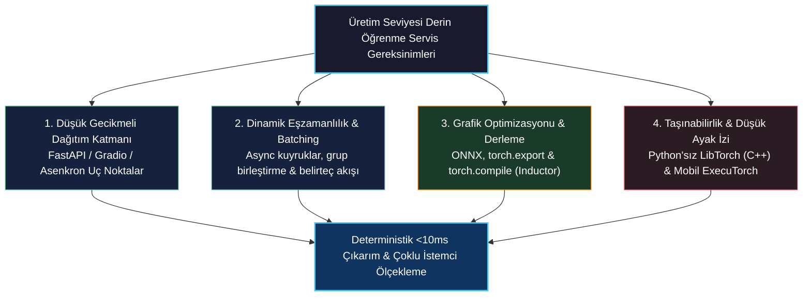
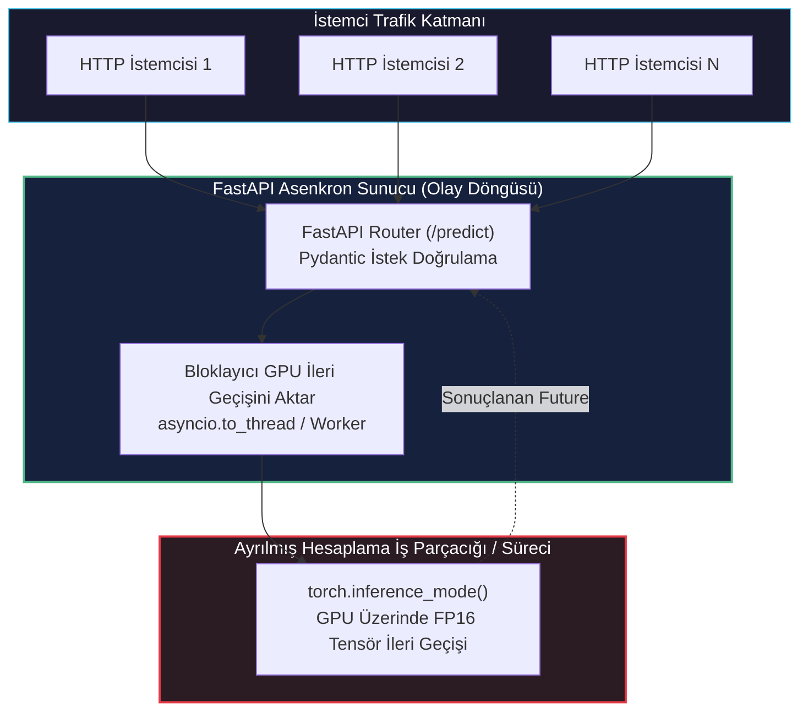
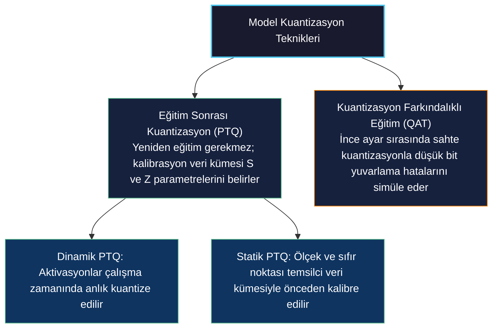
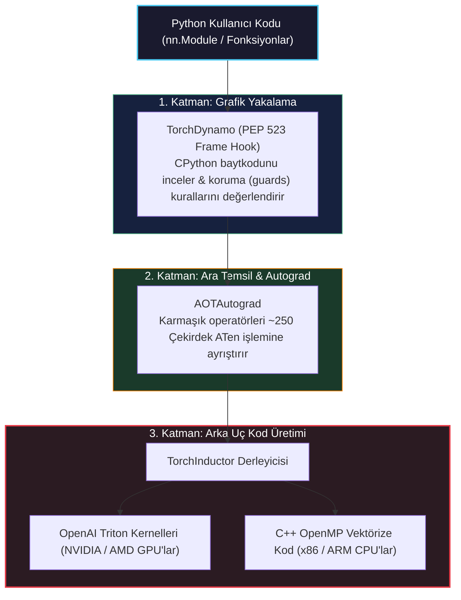
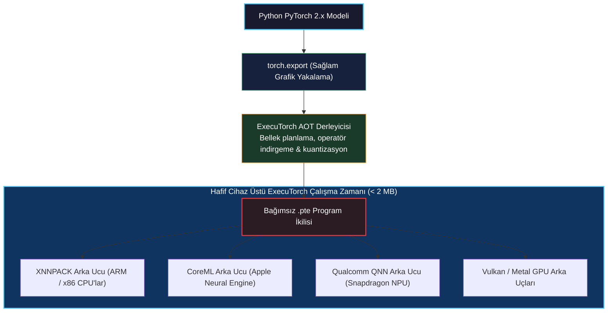
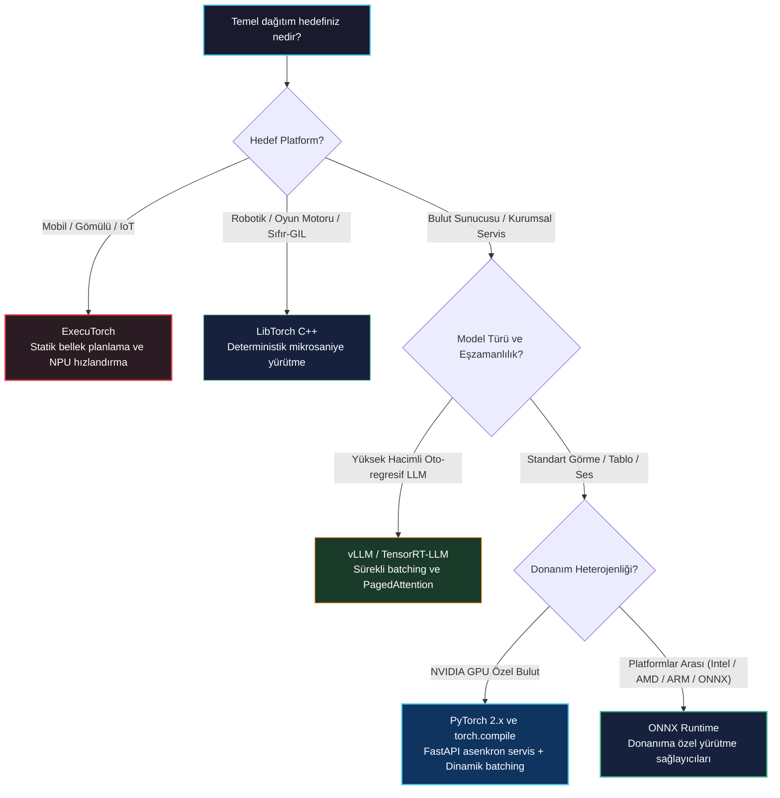

# Üretime Dağıtım (Deploying to Production)

<!-- toc -->

---

## 1. Üretim Zorunluluğu: Araştırma Kodundan Endüstriyel Dağıtıma

Kısım 1 ve Kısım 2'nin önceki bölümleri boyunca odak noktamız mimari tasarım, matematiksel modelleme ve eğitim mekanikleri üzerineydi. Konvolüsyonel görme omurgaları, üretici difüzyon modelleri, 3B hacimsel tümör sınıflandırma ağları, semantik segmentasyon modelleri ve çoklu GPU dağıtık eğitim kümeleri inşa ettik. Tüm bu iş akışlarında yürütme, modellerin autograd dinamik bantlarına, yüksek bant genişlikli hızlandırıcı belleğine ve Python çalışma zamanına tam erişimle çalıştığı etkileşimli bir Python geliştirme ortamında gerçekleşti.

Ancak eğitilmiş bir yapay sinir ağını **üretime (production)** taşımak bambaşka bir mühendislik zihniyeti gerektirir. Bir üretim ortamı, araştırma aşamasında karşılaşılmayan katı kısıtlamalar dayatır:

1. **Deterministik Gecikme ve Katı SLA Hedefleri:** İstemci uygulamaları kesin milisaniye sınırları içinde yanıt talep eder. Eğitim süreci iterasyon başına değişken süreleri tolere edebilirken, klinik bir tanı API'si veya otonom robot kontrol döngüsü **İlk Belirtece Kadar Geçen Süre (Time to First Token - TTFT)** veya maksimum istek gecikmesi üzerinde pazarlıksız bir hizmet düzeyi sözleşmesine (SLA) sahiptir.
2. **Eşzamanlı Yük Altında Yüksek İşlem Hacmi:** Yüzlerce veya binlerce eşzamanlı gelen isteğe hizmet vermek, naif ardışık çıkarım ardışık düzenlerini hızla tıkar. Üretim sistemleri, tekil kullanıcıları gecikmeye boğmadan farklı istekleri dinamik olarak birleştirmelidir (batching).
3. **Donanım ve Çalışma Zamanı İzolasyonu:** Modern üretim arka uçları, Python'un Küresel Yorumlayıcı Kilidi (GIL) tarafından dayatılan bellek ayak izini, başlatma gecikmesini veya tek iş parçacıklı eşzamanlılık sınırlarını tolere edemez. Otonom mobil araçlar, otomotiv mikrodenetleyicileri ve mikrosaniye ölçeğindeki sistemler, C++ çalışma zamanları veya özel donanım derleyicileri aracılığıyla yürütülen bağımsız ikili dosyalara (binary) ihtiyaç duyar.
4. **Enerji, Hesaplama ve Bellek Ayak İzi:** Milyarlarca parametreli temel modelleri veya büyük 3B CNN'leri bulut hızlandırıcılarında tam 32-bit kayan nokta hassasiyetinde çalıştırmak ekonomik ve termal açıdan sürdürülemezdir. Modeller, yüksek bant genişlikli bellek (HBM) doygunluğunu en aza indirmek için kuantize edilmeli, füzyona tabi tutulmalı ve derlenmelidir.



> **Temel Kavrayış:** Derin öğrenme üretim sistemlerinde yüksek işlem hacmi (throughput) ile düşük gecikme (latency) mimari olarak birbirine zıttır. İşlem hacmini maksimize etmek, GPU tensör çekirdeklerinde yüksek aritmetik yoğunluğa ulaşmak için istekleri büyük partiler halinde toplamayı gerektirir; gecikmeyi minimize etmek ise istek gelir gelmez çıkarımı derhal başlatmayı zorunlu kılar. Üretim mühendisliği; dinamik batching, asenkron akış ve çekirdek düzeyinde grafik derlemesi ile bu zıtlığı çözme disiplinidir.

---

## 2. PyTorch Modellerini Dağıtmak: Etkileşimli Arayüzler vs. Endüstriyel Mikroservisler

Eğitilmiş bir modeli çıkarım için sunarken mühendisler arayüzü hedef kitleye göre seçer: insan doğrulayıcılar veya otomatik istemci yazılımları.

### 2.1 Gradio ile Hızlı İnsan-Döngüde (HITL) Doğrulama

Model geliştirme, klinik denemeler veya kullanıcı kabul testleri sırasında, teknik olmayan paydaşların görüntü yükleyebileceği, kaydırıcılarla parametreleri değiştirebileceği ve ağ tahminlerini anında inceleyebileceği etkileşimli bir arayüze ihtiyaç duyulur. **Gradio**, makine öğrenimi modelleri için özel olarak tasarlanmış sıfır-şablon bir soyutlama sunar.

Aşağıdaki kod, önceden eğitilmiş bir görme modelini başlatır ve ham görüntü girdilerini kabul eden, ImageNet normalizasyonunu uygulayan ve en olası 5 sınıf olasılığını gerçek zamanlı olarak görüntüleyen bir Gradio kullanıcı arayüzü oluşturur:

```python
import gradio as gr
import torch
import torchvision.models as models
import torchvision.transforms as transforms
from PIL import Image

# 1. Cihaz yapılandırması ve model başlatma
device = torch.device("cuda" if torch.cuda.is_available() else "cpu")
model = models.resnet50(weights=models.ResNet50_Weights.DEFAULT)
model.eval().to(device)

# 2. Üretim ön işleme ardışık düzeni
preprocess = transforms.Compose([
    transforms.Resize(256),
    transforms.CenterCrop(224),
    transforms.ToTensor(),
    transforms.Normalize(
        mean=[0.485, 0.456, 0.406],
        std=[0.229, 0.224, 0.225]
    ),
])

def predict_image(image: Image.Image) -> dict:
    # 3. Mikro-modüler çıkarım adımı
    tensor = preprocess(image).unsqueeze(0).to(device)
    
    with torch.inference_mode():
        logits = model(tensor)
        probabilities = torch.nn.functional.softmax(logits[0], dim=0)
    
    # 4. En yüksek 5 sınıf olasılığını ayrıştırma
    top5_prob, top5_catid = torch.topk(probabilities, 5)
    categories = models.ResNet50_Weights.DEFAULT.meta["categories"]
    return {categories[cat_id]: float(prob) for prob, cat_id in zip(top5_prob, top5_catid)}

demo = gr.Interface(
    fn=predict_image,
    inputs=gr.Image(type="pil"),
    outputs=gr.Label(num_top_classes=5),
    title="Klinik ResNet-50 Tanı Demosu",
    description="ImageNet sınıflandırması için etkileşimli değerlendirme arayüzü."
)
```

Gradio, etkileşimli demolar ve konsept kanıtlama testleri için mükemmeldir. Ancak yüzlerce harici servisin HTTP veya gRPC üzerinden eşzamanlı API çağrıları yaptığı yüksek yüklü mikroservis mimarileri için tasarlanmamıştır.

### 2.2 FastAPI ile Endüstriyel Mikroservis Mimarisi

Programatik üretim dağıtımları için PyTorch modellerimizi **FastAPI** arkasına kapsülleriz. FastAPI; Python'un modern `asyncio` olay döngüsünden, `Pydantic` ile tip doğrulamasından ve `uvicorn` gibi ASGI sunucuları üzerinden asenkron yönlendirmeden yararlanır.

Asenkron bir web sunucusu içinde derin öğrenme modelleri sunmanın en kritik mimari zorluğu **olay döngüsünün kilitlenmesini (event loop starvation)** önlemektir. Standart PyTorch tensör işlemleri (`torch.matmul`, konvolüsyonel ileri geçişler) CPU/GPU'yu senkron olarak kilitleyen çağrılardır. Eğer ağır bir tensör işlemi ana olay döngüsü iş parçacığında doğrudan `async def` rotası içinde yürütülürse, sunucu yeni ağ bağlantılarını kabul edemez ve durum kontrollerine yanıt veremez hale gelir.



Aşağıdaki kod; gelen yapılandırılmış istekleri Pydantic ile doğrulayan, olay döngüsünü akıcı tutmak için tensör hesaplamasını ayrılmış bir iş parçacığı havuzuna aktaran ve JSON çıkarım metrikleri döndüren asenkron bir FastAPI sunucusu uygular:

```python
import asyncio
from contextlib import asynccontextmanager
from fastapi import FastAPI, HTTPException
from pydantic import BaseModel, Field
import torch
import torchvision.models as models

# 1. Pydantic istek ve yanıt şemaları
class InferenceRequest(BaseModel):
    features: list[float] = Field(..., min_length=10, max_length=10, description="10 elemanlı girdi vektörü")

class InferenceResponse(BaseModel):
    prediction: list[float]
    device_used: str

# 2. Küresel model durumu için yaşam döngüsü yönetimi
ml_models = {}

@asynccontextmanager
async def lifespan(app: FastAPI):
    # Başlatma: Sunucu ayağa kalkarken model ağırlıklarını GPU'ya tahsis et
    dev = torch.device("cuda" if torch.cuda.is_available() else "cpu")
    net = torch.nn.Sequential(
        torch.nn.Linear(10, 64),
        torch.nn.ReLU(),
        torch.nn.Linear(64, 2)
    ).to(dev)
    net.eval()
    ml_models["network"] = net
    ml_models["device"] = dev
    yield
    # Kapanış: Belleği güvenle temizle
    ml_models.clear()
    if torch.cuda.is_available():
        torch.cuda.empty_cache()

app = FastAPI(lifespan=lifespan)

def compute_forward_sync(raw_data: list[float], model: torch.nn.Module, device: torch.device) -> list[float]:
    # Olay döngüsünden izole edilmiş senkron ileri geçiş
    with torch.inference_mode():
        x = torch.tensor([raw_data], dtype=torch.float32, device=device)
        logits = model(x)
        probs = torch.nn.functional.softmax(logits, dim=-1)
        return probs[0].tolist()

@app.post("/predict", response_model=InferenceResponse)
async def predict_endpoint(req: InferenceRequest):
    if "network" not in ml_models:
        raise HTTPException(status_code=503, detail="Model henüz başlatılıyor")
    
    # 3. Bloklayıcı tensör yürütmesini iş parçacığına devret
    result = await asyncio.to_thread(
        compute_forward_sync,
        req.features,
        ml_models["network"],
        ml_models["device"]
    )
    return InferenceResponse(prediction=result, device_used=str(ml_models["device"]))
```

---

## 3. Dinamik İstek Gruplama (Batching) ve Belirteç Akışı (Streaming) Mimarisi

Bir üretim mikroservisinde istekler bağımsız istemcilerden rastgele zaman damgalarında ulaşır. Her isteği $B = 1$ parti boyutuyla tek başına işlemek GPU hesaplama çekirdeklerini atıl bırakır, bu da düşük işlem hacmine ve sorgu başına yüksek maliyete yol açar.

<figure style="display:flex; justify-content: center; margin: 25px 0;">
  <div style="text-align: center;">
    
    <figcaption style="margin-top: 0.6em; text-align: center; font-size: 13px; color: #888;"><em>Şekil 1: Dinamik istek gruplama (batching) ve belirteç akışı (streaming) mimarisi. Dağıtık istemciler bağımsız asenkron üretim isteklerini HTTP POST ile çıkarım kuyruğuna gönderir. Arka plandaki model çalışanı (worker), kuyruktaki istekleri tek bir donanım partisinde toplar, hızlandırıcı çekirdeklerinde ileri geçişi yürütür ve artımlı belirteç sonuçlarını her istemcinin kendi kanalına akış halinde iletir.</em></figcaption>
  </div>
</figure>

### 3.1 Dinamik Batching Mekanizması

Hızlandırıcı verimini maksimize etmek için üretim sunucuları **Dinamik Batching** uygular. Asenkron bir kuyruk gelen istemci isteklerini toplar. Arka plandaki model çalışanı, maksimum parti kapasitesine ($B\_{\max}$) ulaşılana kadar veya tanımlanan maksimum bekleme zaman aşımı süresi ($\tau\_{\text{batch}}$) dolana kadar istekleri biriktirir:

$$ B = \min\left( B\_{\max}, \quad \text{queue.size}() \right) \quad \text{koşul: } t - t\_{\text{varış}} \ge \tau\_{\text{batch}} $$

Tek bir istemci tarafından gözlemlenen toplam gecikme $L(B)$, kuyrukta bekleme süresi ile GPU hesaplama süresinin toplamıdır:

$$ L(B) = W\_{\text{kuyruk}}(B) + L\_{\text{hesap}}(B) $$

$W\_{\text{kuyruk}}(B)$ daha büyük parti sınırlarıyla artarken, $L\_{\text{hesap}}(B)$ GPU donanım doygunluğuna kadar alt-doğrusal (sub-linear) bir artış gösterir ve toplam sistem işlem hacmini ciddi oranda artırır:

$$ \text{İşlem Hacmi}(B) = \frac{B}{L\_{\text{hesap}}(B)} $$

Aşağıdaki kod; eşzamanlı istemci isteklerinin bir `asyncio.Queue` aracılığıyla partiler halinde toplandığı, tek bir tensör ileri geçişiyle yürütüldüğü ve sonuçların her istemcinin kendi `Future` nesnesine çözüldüğü bir dinamik gruplayıcı uygular:

```python
import asyncio
from dataclasses import dataclass
from typing import Any
import torch

@dataclass
class QueueItem:
    input_tensor: torch.Tensor
    future: asyncio.Future

class DynamicBatcher:
    def __init__(self, model: torch.nn.Module, max_batch_size: int = 16, max_wait_time: float = 0.005):
        self.model = model
        self.max_batch_size = max_batch_size
        self.max_wait_time = max_wait_time
        self.queue: asyncio.Queue[QueueItem] = asyncio.Queue()
        self.worker_task = asyncio.create_task(self._batch_worker())

    async def predict(self, x: torch.Tensor) -> torch.Tensor:
        # İsteği kuyruğa ekle ve özel yanıt future'ını bekle
        loop = asyncio.get_running_loop()
        item = QueueItem(input_tensor=x, future=loop.create_future())
        await self.queue.put(item)
        return await item.future

    async def _batch_worker(self):
        while True:
            first_item = await self.queue.get()
            batch = [first_item]
            deadline = asyncio.get_event_loop().time() + self.max_wait_time

            # Parti boyutu dolana veya süre bitene kadar istekleri topla
            while len(batch) < self.max_batch_size:
                timeout = deadline - asyncio.get_event_loop().time()
                if timeout <= 0:
                    break
                try:
                    item = await asyncio.wait_for(self.queue.get(), timeout=timeout)
                    batch.append(item)
                except asyncio.TimeoutError:
                    break

            # 1. Tekil tensörleri tek bir donanım partisinde birleştir
            batch_inputs = torch.cat([item.input_tensor for item in batch], dim=0)

            # 2. Birleşik GPU ileri geçişini yürüt
            with torch.inference_mode():
                outputs = self.model(batch_inputs)

            # 3. Çıktı dilimlerini ilgili istemci future'larına dağıt
            for i, item in enumerate(batch):
                item.future.set_result(outputs[i:i+1])
```

### 3.2 Server-Sent Events (SSE) ile Asenkron Belirteç Akışı

Oto-regresif büyük dil modelleri veya iteratif difüzyon modelleri için, herhangi bir yanıt döndürmeden önce tüm dizi üretiminin bitmesini beklemek kullanıcı deneyimini zedeler. Üretilen belirteçleri istemciye örnekleme anında akıtarak (streaming), algılanan bekleme süresini tam üretim süresinden **İlk Belirtece Kadar Geçen Süreye (TTFT)** düşürürüz.

FastAPI'de akış, asenkron bir Python üretecini (generator) saran `StreamingResponse` ile gerçekleştirilir:

```python
from fastapi.responses import StreamingResponse
import asyncio

async def token_generator(prompt: str):
    # Simüle edilmiş oto-regresif belirteç üretim akışı
    tokens = ["Model,", " doku", " üzerinde", " şüpheli", " bir", " lezyon", " tespit", " etmedi."]
    for token in tokens:
        await asyncio.sleep(0.04)  # Belirteçler arası gecikmeyi simüle et
        yield f"data: {token}\n\n"

@app.get("/stream-generate")
async def stream_generate(prompt: str):
    return StreamingResponse(
        token_generator(prompt),
        media_type="text/event-stream"
    )
```

---

## 4. Çıkarım Hızlandırma Teknikleri: Hassasiyet, Kuantizasyon ve Bellek Düzenleri

Modelleri üretimde varsayılan 32-bit kayan nokta (`torch.float32`) aritmetiğiyle çalıştırmak hesaplama gücünü israf eder ve hızlandırıcı bellek bant genişliğini tüketir.

### 4.1 İndirgenmiş Hassasiyet: FP16 ve BF16

Modern GPU tensör çekirdekleri (NVIDIA Volta, Ampere, Hopper, Blackwell), yarım hassasiyetli matris çarpımları yaparken kat kat daha yüksek işlem hacmine ulaşır:

| Kayan Nokta Formatı | İşaret Biti | Üs (Exponent) Biti | Kesir (Mantissa) Biti | Dinamik Aralık ($10^{\pm x}$) | Hassasiyet (Ondalık Hane) |
| :--- | :--- | :--- | :--- | :--- | :--- |
| **IEEE FP32** | 1 | 8 | 23 | $\approx 10^{\pm 38}$ | $\approx 7.2$ |
| **IEEE FP16** | 1 | 5 | 10 | $\approx 10^{\pm 5}$ | $\approx 3.3$ |
| **Bfloat16 (BF16)** | 1 | 8 | 7 | $\approx 10^{\pm 38}$ | $\approx 2.1$ |

Çıkarım modunda gradyanlar hesaplanmadığı için dinamik kayıp ölçeklemeye (loss scaling) gerek kalmaz. Model ağırlıklarını `torch.float16` veya `torch.bfloat16` türüne dönüştürmek, bellek ayak izini doğrudan $\%50$ azaltır ve bellek aktarım hızlarını iki katına çıkarır:

```python
# Ağırlıkları yarım hassasiyete dönüştür
model = model.to(device=device, dtype=torch.bfloat16)

# Autocast ile çıkarım yürüt
with torch.inference_mode():
    with torch.autocast(device_type=device.type, dtype=torch.bfloat16):
        predictions = model(input_tensor.to(dtype=torch.bfloat16))
```

### 4.2 Kuantizasyon Yelpazesi: PTQ vs. QAT

Kuantizasyon, sürekli 32-bit veya 16-bit kayan nokta tensörlerini düşük bitli ayrık tamsayılara (genellikle 8-bit `int8` veya 4-bit `int4`) eşler:

$$ q = \text{round}\left( \frac{x}{S} \right) + Z $$

burada $S \in \mathbb{R}^+$ keyfi ölçek katsayısı, $Z \in \mathbb{Z}$ ise sıfır noktası ofsetidir.



Büyük dil modelleri ve görme transformatörleri için 4-bit ağırlık kuantizasyonu (AWQ, GPTQ) ve 1-bit ikili gösterimler (BitNet $b1.58$), HBM bellek bant genişliği darboğazlarını kırarak milyarlarca parametreli modellerin tüketici sınıfı donanımlarda bile akıcı çalışmasını sağlar.

### 4.3 Bellek Düzeni: Konvolüsyonlar İçin Channels-Last

Varsayılan olarak PyTorch, 4B konvolüsyonel görüntü tensörlerini bitişik **NCHW** düzeninde (Parti, Kanal, Yükseklik, Genişlik) tahsis eder. Ancak modern x86 CPU AVX-512 vektör birimleri ve NVIDIA Tensör Çekirdekleri, bellek **NHWC** formatında düzenlendiğinde konvolüsyonları belirgin şekilde daha hızlı çalıştırır; bu düzen PyTorch'ta `torch.channels_last` olarak adlandırılır:

```python
# Modeli ve girdi tensörlerini channels-last bellek düzenine dönüştür
model = model.to(memory_format=torch.channels_last)
input_tensor = input_tensor.to(memory_format=torch.channels_last)
```

`torch.channels_last` düzeninde, fiziksel RAM'deki bitişik elemanlar aynı pikselin farklı kanallarını temsil eder; bu sayede donanım vektör yazmaçları kanal boyutu boyunca sıfır bellek sıçramasıyla tam nokta çarpımları gerçekleştirebilir.

---

## 5. Model Grafik Yakalama ve Dışa Aktarma: Python Kodundan Statik Grafiklere

PyTorch modellerini yüksek başarımlı ve Python bağımsız ortamlara dağıtmak, modelin dinamik hesaplama grafiğinin serileştirilmiş bir temsile dönüştürülmesini gerektirir.

<figure style="display:flex; justify-content: center; margin: 25px 0;">
  <div style="text-align: center;">
    
    <figcaption style="margin-top: 0.6em; text-align: center; font-size: 13px; color: #888;"><em>Şekil 2: Model dışa aktarma ve yürütme yaşam döngüsü. 1. Üst düzey kullanıcı model kodu (Python nn.Module). 2. ONNX ve torch.export üzerinden TorchDynamo'ya aktarılan grafik yakalama ve izleme katmanı. 3. ONNX Runtime, AOTInductor ve mobil hızlandırıcılar dahil olmak üzere hedef donanımlarda yürütülen ara ExportedProgram temsili.</em></figcaption>
  </div>
</figure>

### 5.1 Evrim: TorchScript'ten Modern `torch.export`'a

Geçmişte PyTorch, modelleri Python'dan bağımsız bir ara formata dönüştürmek için **TorchScript** (`torch.jit.trace` ve `torch.jit.script`) sunmaktaydı. Ancak TorchScript önemli kısıtlamalara sahipti:
- `torch.jit.trace`, kukla girdilerle tek bir yürütme yolunu körü körüne takip ediyor; veriye bağlı `if` koşullarını ve döngüleri sessizce yok sayıyordu.
- `torch.jit.script`, Python sözdiziminin bir alt kümesini bir AST'ye dönüştürmeye çalışıyor, modern Python yapıları ve dinamik kütüphaneler karşısında sık sık çöküyordu.

PyTorch 2.x+ sürümünde resmi grafik yakalama standardı **`torch.export`** olmuştur. TorchScript'in aksine `torch.export`:
1. PyTorch'un ATen operatör kümesini temsil eden kesin ve matematiksel olarak sağlam bir hesaplama grafiği üretir.
2. Dinamik boyutları açık sembolik şekillerle (`torch.export.Dim`) temiz bir şekilde yakalar.
3. Desteklenmeyen dinamik bir yapı görüldüğünde sessizce bozuk bir grafik üretmek yerine dışa aktarma anında açık bir hata fırlatmayı garanti eder.

Aşağıdaki kod; çok katmanlı bir sinir ağını, çalışma zamanında farklı parti boyutlarını destekleyebilmesi için dinamik bir parti boyutu boyutuyla birlikte `torch.export` kullanarak dışa aktarır:

```python
import torch

class Classifier(torch.nn.Module):
    def __init__(self):
        super().__init__()
        self.fc1 = torch.nn.Linear(64, 32)
        self.relu = torch.nn.ReLU()
        self.fc2 = torch.nn.Linear(32, 2)

    def forward(self, x: torch.Tensor) -> torch.Tensor:
        return self.fc2(self.relu(self.fc1(x)))

model = Classifier().eval()
sample_input = (torch.randn(1, 64),)

# 1. Esnek parti boyutları için sembolik dinamik boyut tanımla
batch_dim = torch.export.Dim("batch_size", min=1, max=128)
dynamic_shapes = {"x": {0: batch_dim}}

# 2. Grafiği ExportedProgram olarak yakala
exported_program: torch.export.ExportedProgram = torch.export.export(
    model,
    args=sample_input,
    dynamic_shapes=dynamic_shapes
)

# Yakalanan ATen grafik düğümlerini incele
print(exported_program.graph)
```

Elde edilen `ExportedProgram` tamamen bağımsızdır; matematiksel hesaplama grafiğini, parametre tensörlerini, girdi/çıktı spesifikasyonlarını ve koruma kurallarını içerir ve diske `torch.export.save(exported_program, "model.pt2")` ile kaydedilebilir.

### 5.2 Açık Yapay Sinir Ağı Değişimi (ONNX) ve ONNX Runtime

Platformlar arası ve çok donanımlı dağıtımlar için (örneğin Windows DirectML, Intel OpenVINO veya PyTorch çalışma zamanı olmadan NVIDIA TensorRT üzerinde çalıştırma), **ONNX** küresel endüstri standardıdır.

Modern PyTorch'ta ONNX dışa aktarıcısı, `torch.onnx.export` API'si aracılığıyla doğrudan TorchDynamo ile entegre çalışır:

```python
import torch

model = Classifier().eval()
dummy_input = torch.randn(1, 64)

# Doğrudan ONNX ikili formatına aktar
torch.onnx.export(
    model,
    dummy_input,
    "model.onnx",
    export_params=True,
    opset_version=17,
    do_constant_folding=True,
    input_names=["input"],
    output_names=["output"],
    dynamic_axes={
        "input": {0: "batch_size"},
        "output": {0: "batch_size"}
    }
)
```

Dışa aktarıldıktan sonra, **ONNX Runtime** gibi yüksek başarımlı C++ motorları, serileştirilmiş modeli donanıma özgü yürütme sağlayıcılarıyla çalıştırır:

```python
import onnxruntime as ort
import numpy as np

# CUDA hızlandırmalı ONNX Runtime oturumu başlat
session = ort.InferenceSession("model.onnx", providers=["CUDAExecutionProvider", "CPUExecutionProvider"])

# Standart NumPy tamponlarıyla çıkarım yap
input_name = session.get_inputs()[0].name
output_name = session.get_outputs()[0].name
data = np.random.randn(4, 64).astype(np.float32)

raw_outputs = session.run([output_name], {input_name: data})
```

---

## 6. `torch.compile` ve Inductor Derleyici Motorunun Derinlikleri

PyTorch 2.0 ile sunulan `torch.compile`, doğal Python geliştirici deneyimini bozmadan derin derleyici düzeyi optimizasyonlar sunar. Sıfır kod değişikliği gerektirir:

```python
compiled_model = torch.compile(model, mode="max-autotune")
```

Bu basit çağrının altında üç katmanlı sofistike bir derleyici altyapısı çalışır:



### 6.1 `torch.compile`'ın Üç Alt Sistemi

1. **TorchDynamo (Ön Uç):** Baytkod yürütülmeden önce araya girmek için Python C-API çerçeve değerlendirme kancasını (`PEP 523`) kullanır. Python baytkodunu analiz eder, saf tensör işlemlerini bir FX hesaplama grafiğine dönüştürür ve **Korumalar (Guards)** kurar. Korumalar, tensör tipleri, boyutları ve global değişkenlerin değişmediğini doğrular; bir koruma bozulursa standart Python yorumlayıcısına geri döner.
2. **AOTAutograd (Orta Katman):** Binlerce üst düzey PyTorch API'sini yan etkilerden arındırılmış yaklaşık 250 ilkel **Çekirdek ATen** işlemine ayrıştırarak matematiksel semantiği standartlaştırır.
3. **TorchInductor (Arka Uç):** Her işlem için önceden derlenmiş CUDA kütüphanelerine (cuDNN, cuBLAS) bağımlı kalmak yerine, GPU'lar için özel **OpenAI Triton** kodları, CPU'lar için ise SIMD vektör genişletmeli C++ kodları sentezler.

### 6.2 Operatör Füzyonunun Gücü (Bellek Duvarını Aşmak)

`torch.compile` GPU'larda neden dramatik hızlanmalar sağlar?

Modern hızlandırıcılarda teorik hesaplama kapasitesi (TFLOPs), yüksek bant genişlikli bellek (HBM) ile çip üzerindeki SRAM önbellekleri arasındaki veri aktarım hızından çok daha hızlı büyümüştür. Klasik PyTorch'ta ardışık nokta bazlı işlemler zinciri hesaplanırken:

$$ y = \text{GELU}(W x + b) $$

hızlandırıcı şu adımları atmak zorunda kalır:
1. $W$ ve $x$'i HBM'den SRAM'e yükle, matris çarpımını yap, ara tensörü tekrar HBM'e yaz.
2. Ara tensörü HBM'den SRAM'e geri oku, $b$ bias değerini ekle, sonucu tekrar HBM'e yaz.
3. Bias eklenmiş sonucu HBM'den tekrar SRAM'e oku, doğrusal olmayan GELU aktivasyonunu uygula ve nihai sonucu HBM'e yaz.

Bellek yolu üzerindeki bu sürekli gidiş-geliş, bellek bant genişliğini kilitler ve GPU tensör çekirdeklerini işsiz bırakır. **TorchInductor bu ardışık işlemleri tek bir özel Triton GPU çekirdeğinde (kernel) birleştirir (operator fusion)**. Bias toplama ve GELU aktivasyonu, tensör verisi SRAM'de ve yazmaçlarda tutulurken gerçekleşir; ana belleğe yalnızca tek bir nihai yazma yapılır.

### 6.3 Grafik Kırılmalarını (Graph Breaks) Teşhis Etme ve Düzeltme

Bir **Grafik Kırılması (Graph Break)**, TorchDynamo'nun FX grafiğine izleyemediği bir Python yapısıyla karşılaştığında meydana gelir (örneğin ekrana yazdırma `print()`, desteklenmeyen bir C uzantısı veya tensör öğesine dayalı koşul ifadesi `if tensor.item() > 0:`).

Bir grafik kırılması yaşandığında TorchDynamo yürütmeyi iki ayrı derlenmiş alt grafiğe bölmek ve arada yavaş Python CPython yorumlayıcısına dönmek zorunda kalır:

$$\text{1. Grafik (Derlenmiş)} \longrightarrow \text{Python Yorumlayıcı Kırılması} \longrightarrow \text{2. Grafik (Derlenmiş)}$$

Üretim kodundaki grafik kırılmalarını teşhis etmek için PyTorch özel araçlar sunar:

```python
import torch

# Grafik kırılmalarının nedenini açıklayan teşhis aracı
explanation = torch._dynamo.explain(model, sample_input)
print(f"Grafik kırılma sayısı: {explanation.graph_break_count}")
print(f"Kırılma nedenleri: {explanation.break_reasons}")
```

---

## 7. `torch.profiler` ile Çalışma Zamanı Profil Çıkarma

Bir üretim servisini optimize etmeden önce mühendisler gerçek darboğazları tespit etmek için profilleme yapmalıdır: yürütme hesaplama kısıtlı mı, bellek bant genişliği kısıtlı mı, yoksa CPU tarafındaki çatı kısıtlarından mı muzdariptir?

Aşağıdaki kod; CPU ve CUDA aktivitelerini yakalayan, GPU bellek tahsislerini izleyen ve yürütme izlerini Chrome Trace Event formatında dışa aktaran bir `torch.profiler` kurulumu yapar:

```python
import torch
import torchvision.models as models

device = torch.device("cuda" if torch.cuda.is_available() else "cpu")
model = models.resnet18().to(device)
inputs = torch.randn(16, 3, 224, 224, device=device)

# PyTorch profil oluşturucusunu yapılandır
with torch.profiler.profile(
    activities=[
        torch.profiler.ProfilerActivity.CPU,
        torch.profiler.ProfilerActivity.CUDA,
    ],
    record_shapes=True,
    profile_memory=True,
    with_stack=True
) as prof:
    # Isınma (warmup) adımı
    model(inputs)
    torch.cuda.synchronize() if torch.cuda.is_available() else None

    # Profil hedefi olan iterasyon
    with torch.profiler.record_function("production_inference_forward"):
        outputs = model(inputs)
        torch.cuda.synchronize() if torch.cuda.is_available() else None

# Toplam GPU çalışma süresine göre sıralanmış operatör tablosunu yazdır
print(prof.key_averages().table(sort_by="cuda_time_total", row_limit=10))

# chrome://tracing veya Perfetto'da görselleştirmek için iz dosyasını dışa aktar
prof.export_chrome_trace("production_profile_trace.json")
```

`chrome://tracing` veya Perfetto üzerinde iz dosyasını incelemek şunları ortaya koyar:
- **GPU Kernel Eşzamanlılığı:** GPU'nun sürekli meşgul olup olmadığı veya CPU gecikmeleri yüzünden boşluklar (bubbles) yaşayıp yaşamadığı.
- **Bellek Tahsis Tepe Noktaları:** Maliyetli CUDA bellek kilitlemelerini tetikleyen bellek ayırma ve serbest bırakma olayları.
- **Kernel Başlatma Gecikmesi:** CPU'nun işlemi göndermesi ile GPU akışında fiziksel yürütmenin başlaması arasındaki gecikme.

---

## 8. Python'sız Sıfır Ek Yüklü Dağıtım: LibTorch (C++)

Python derin öğrenme araştırmaları için tartışmasız lider dil olsa da, yüksek başarımlı üretim sistemleri Python'u çıkarım hattından tamamen çıkarır. Otonom araç kontrol sistemleri, yüksek frekanslı alım-satım platformları, ROS 2 çalıştıran robotlar ve oyun motorları şunları talep eder:
1. **Deterministik Gecikme:** Python çöp toplayıcı (Garbage Collector) duraklamalarından tam bağımsızlık.
2. **Gerçek Çoklu İş Parçacıklı Eşzamanlılık:** Python Global Interpreter Lock (GIL) engelinin tamamen aşılması.
3. **Minimum Bellek Ayak İzi:** Sistemde Python çalışma zamanı veya paket yöneticisi olmadan çalışan yalın ikili dosyalar.

PyTorch, eksiksiz ATen tensör kütüphanesini ve `torch::nn` arayüzlerini içeren saf C++ kütüphanesi **LibTorch**'u sunar.

### 8.1 Dışa Aktarılan Modelleri C++'ta Yükleme ve Yürütme

Python'dan dışa aktarılan modeller (AOTInductor veya TorchScript aracılığıyla) doğrudan C++ içinde çalıştırılabilir:

```cpp
#include <torch/script.h> // Veya tam LibTorch API'si için torch/all.h
#include <iostream>
#include <memory>

int main(int argc, const char* argv[]) {
    if (argc != 2) {
        std::cerr << "Kullanım: inference_server <model-yolu>\n";
        return -1;
    }

    // 1. Hedef yürütme cihazını yapılandır
    torch::DeviceType device_type = torch::cuda::is_available() ? torch::kCUDA : torch::kCPU;
    torch::Device device(device_type);
    std::cout << "Çıkarım cihazı: " << (device.is_cuda() ? "CUDA GPU" : "Host CPU") << std::endl;

    // 2. Model ikili dosyasını diske yükle
    torch::jit::script::Module module;
    try {
        module = torch::jit::load(argv[1]);
        module.to(device);
        module.eval();
    } catch (const c10::Error& e) {
        std::cerr << "Model yüklenirken hata oluştu: " << e.msg() << std::endl;
        return -1;
    }

    // 3. C++ ATen API'si ile girdi tensörü oluştur
    std::vector<torch::jit::IValue> inputs;
    torch::Tensor input_tensor = torch::randn({1, 3, 224, 224}, device);
    inputs.push_back(input_tensor);

    // 4. Sıfır ek yüklü C++ ileri geçişi
    at::Tensor output = module.forward(inputs).toTensor();
    std::cout << "Çıkarım başarıyla tamamlandı. Çıktı boyutu: " << output.sizes() << std::endl;

    return 0;
}
```

### 8.2 CMake ile Derleme

LibTorch, CMake aracılığıyla standart C++ derleme sistemlerine kolayca entegre olur:

```cmake
cmake_minimum_required(VERSION 3.18 FATAL_ERROR)
project(production_inference_service CXX)

set(CMAKE_CXX_STANDARD 17)
find_package(Torch REQUIRED)

add_executable(inference_server main.cpp)
target_link_libraries(inference_server "${TORCH_LIBRARIES}")
set_property(TARGET inference_server PROPERTY CXX_STANDARD 17)
```

LibTorch ile derlenen yerel ikili dosya sıfır Python bağımlılığıyla çalışır, mikrosaniye seviyesinde deterministik gecikmeye ulaşır ve C++ iş parçacığı havuzlarıyla mükemmel bir uyum sergiler.

---

## 9. Mobil ve Uç Nokta Dağıtımı: ExecuTorch

Derin öğrenme modellerini pille çalışan, sınırlı bellekli uç donanımlara (akıllı telefonlar, IoT sensörleri, giyilebilir medikal cihazlar) taşımak, sunucu ölçeğindeki çalışma zamanlarından radikal bir kopuş gerektirir. LibTorch ve standart PyTorch çalışma zamanları $50\text{--}100\text{ MB}$'ı aşan dosya boyutlarına sahiptir ve sürekli dinamik bellek tahsis eder.

PyTorch 2.x, cihaz üzerinde yapay zeka için sıfırdan tasarlanan modern uç nokta çalışma zamanı **ExecuTorch**'u sunar.



### ExecuTorch'un Temel Mimari Prensipleri:

1. **Ultra Hafif İkili Boyutu:** Çekirdek ExecuTorch C++ çalışma zamanı $2\text{ MB}$'ın altındaki bir ayak izine sığar; böylece katı mobil uygulamalara ve gömülü aygıt yazılımlarına kolayca dahil edilir.
2. **Çalışma Zamanında Sıfır Dinamik Bellek Tahsisi:** ExecuTorch, tüm ara aktivasyonlar için statik bir bellek havuzu tahsis eden bir AOT **Bellek Planlayıcısı** (Memory Planner) çalıştırır. Çıkarım sırasında sıfır dinamik yığın (`malloc` / `new`) tahsisi gerçekleşir; bu da gecikme dalgalanmalarını önler ve bellek yetersizliği çökmelerini ortadan kaldırır.
3. **Donanım Hızlandırma Temsilcileri:** Alt grafikleri uç işlemcilere sorunsuz bir şekilde devreder:
   - **XNNPACK:** ARM Cortex-A/M ve x86 CPU'lar için optimize edilmiş SIMD çekirdekleri.
   - **CoreML:** Apple Silicon Neural Engine (ANE) donanımına doğrudan erişim.
   - **Qualcomm QNN:** Snapdragon Hexagon NPU'larında yerel donanım hızlandırması.

---

## 10. Üretim Karar Çerçevesi: Doğru Dağıtım Yığınını Seçmek

Derin öğrenme dağıtım teknolojileri arasında seçim yapmak; donanım kısıtları, istek eşzamanlılığı, gecikme SLA'ları ve altyapı karmaşıklığı arasında doğru dengeyi kurmayı gerektirir.

| Dağıtım Hedefi | Birincil Teknoloji | Güçlü Yönleri | Sınırları ve Ödünleşimleri | İdeal Kullanım Alanı |
| :--- | :--- | :--- | :--- | :--- |
| **Etkileşimli Araştırma & HITL** | Gradio / Streamlit | Sıfır şablon arayüz, hızlı parametre denemeleri | Tek istemci odaklı, istek başına yüksek ek yük | Klinik tanı doğrulama, paydaş sunumları |
| **Asenkron Web Mikroservisi** | FastAPI + Uvicorn + Dynamic Batching | Python uyumlu, asenkron eşzamanlılık, kolay ölçekleme | Python GIL kısıtları, manuel kuyruk ayarı | Orta ölçekli dahili API'ler, mikroservis ağları |
| **Yüksek İşlem Hacimli LLM Servisi** | Triton Server / vLLM / TGI | PagedAttention, sürekli parti oluşturma, çoklu GPU paylaşımı | Karmaşık Docker orkestrasyonu, yüksek kurulum bariyeri | Kurumsal LLM servisleri, çok kiracılı bulut sunucuları |
| **Yüksek Başarımlı Python Üretimi** | `torch.compile` (Inductor) | Saf PyTorch, otomatik Triton füzyonu, sıfır kod değişikliği | İlk çalıştırmada derleme süresi, olası grafik kırılmaları | Yüksek verimli bilgisayarla görme ve NLP modelleri |
| **Platformlar Arası Kurumsal Dağıtım** | ONNX + ONNX Runtime | Geniş donanım desteği (TensorRT, OpenVINO, DirectML), standart format | Dinamik kontrol akışlarında dışa aktarma zorlukları | Heterojen kurumsal sunucular, C#/Java/Go altyapıları |
| **Sıfır Ek Yüklü Yerel Dağıtım** | LibTorch (C++) | Mikrosaniye deterministik gecikme, GIL'siz, C++ gömülebilirliği | C++ derleme araçları gerektirir, manuel bellek yönetimi | Otonom sürüş, robotik (ROS 2), oyun motorları |
| **Kısıtlı Bellekli Mobil ve Uç Nokta** | ExecuTorch | &lt;2MB çalışma zamanı, sıfır dinamik bellek, NPU/DSP temsilcileri | Sınırlı operatör kapsamı, katı dışa aktarma süreci | iOS/Android uygulamaları, giyilebilir medikal cihazlar |

### Üretim Mimarisi Karar Ağacı



---

## 11. Alıştırmalar ve Kavramsal Doğrulama

Derin öğrenme üretim sistemlerindeki ustalığınızı pekiştirmek için aşağıdaki mühendislik problemlerini çözün:

1. **Dinamik Batching Gecikme Analizi:**
   - Maksimum parti boyutu $B\_{\max} = 32$ ve zaman aşımı $\tau\_{\text{batch}} = 10\text{ ms}$ olan bir sunucuda isteklerin ortalama $\lambda = 500\text{ istek/sn}$ hızında Poisson dağılımıyla geldiğini varsayın.
   - Çalışan tarafından oluşturulan ortalama parti boyutunu $\mathbb{E}[B]$ hesaplayın.
   - Boş bir kuyruğa giren ilk isteğin deneyimlediği beklenen bekleme süresini $W\_{\text{kuyruk}}$ formüle edin.

2. **Eager vs. `torch.compile` Karşılaştırmalı Testi:**
   - Standart bir ResNet-50 veya Vision Transformer mimarisi alın.
   - Eager mod ile `torch.compile(mode="reduce-overhead")` altında 100 iterasyon boyunca ileri geçiş sürelerini profille çıkarın.
   - GPU bellek bant genişliği kullanımını ölçün ve TorchInductor tarafından oluşturulan birleştirilmiş (fused) operatörleri tespit edin.

3. **Grafik Kırılmalarını Giderme:**
   - Bir Python `print()` ifadesi ve dinamik boyuta bağlı dilimleme `x[:x.shape[0] // 2]` içeren özel bir `nn.Module` tasarlayın.
   - Grafik kırılmasını tespit etmek için `torch._dynamo.explain()` çalıştırın.
   - Modülü saf fonksiyonel tensör işlemlerine dönüştürerek `torch.compile`'ın hiçbir kırılma olmadan tek bir birleşik grafik yakalamasını sağlayın.

---

## 12. Sonuç ve Özet

Kısım 2'nin bu son bölümünde yapay sinir ağı teorisi ve dağıtık eğitimden tam ölçekli üretim dağıtımına uzanan yolculuğu tamamladık:

- **Servis Paradigmaları:** İnsan-döngüde hızlı arayüzler (Gradio) ile yüksek eşzamanlılıklı asenkron mikroservisleri (FastAPI) karşılaştırdık ve Python olay döngüsünü bloklayıcı tensör işlemlerinden koruma modellerini inceledik.
- **Dinamik Batching ve Akış:** Asenkron kuyrukların tekil istemci isteklerini yüksek verimli donanım partilerine nasıl dönüştürdüğünü ve Server-Sent Events ile belirteç akışı sağlayarak İlk Belirtece Kadar Geçen Süreyi (TTFT) nasıl minimize ettiğimizi modelledik.
- **Çıkarım Optimizasyonu:** Hassasiyet ve kuantizasyon yelpazesini (FP16, BF16, INT8, INT4, 1-bit) ve `channels_last` bellek düzeninin bellek bant genişliği avantajlarını değerlendirdik.
- **Modern Grafik İhracı:** Eski TorchScript'ten `torch.export` ile sağlam tam grafik yakalamaya ve ONNX / ONNX Runtime ile platformlar arası yürütmeye geçişi inceledik.
- **Derleyici Hızlandırması:** `torch.compile`'ın üç katmanlı mimarisini (TorchDynamo, AOTAutograd, TorchInductor) ve operatör füzyonunun bellek duvarını nasıl aştığını analiz ettik.
- **Python'sız Çalışma Zamanları:** LibTorch ile sıfır ek yüklü C++ dağıtımını ve ExecuTorch ile ultra yalın, sıfır dinamik bellek tahsisli mobil uç nokta yürütmesini modelledik.

Bu üretim temelleriyle donanarak, modern derin öğrenme sistemlerini her türlü endüstriyel altyapıda tasarlama, eğitme, ölçekleme, derleme ve yüksek başarımla sunma becerisine sahip oldunuz.
