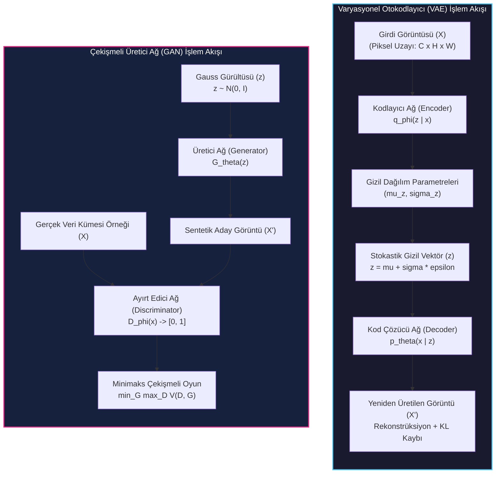
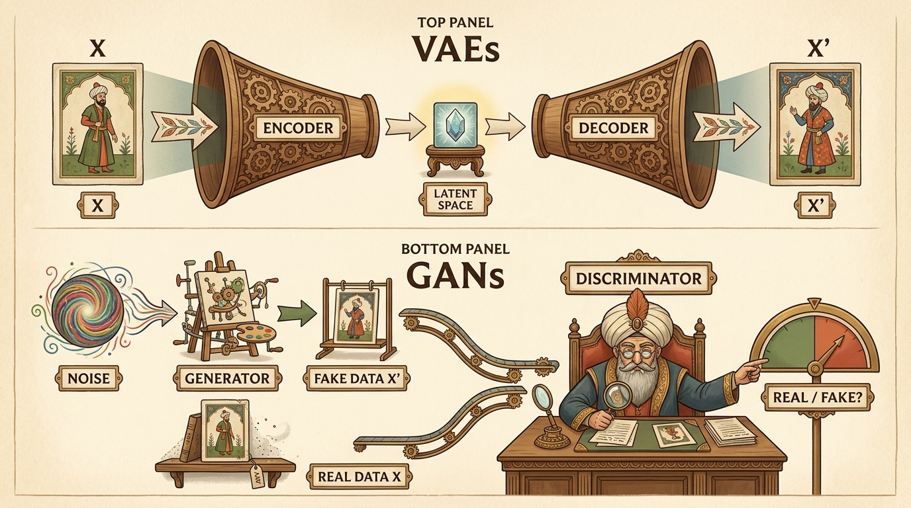
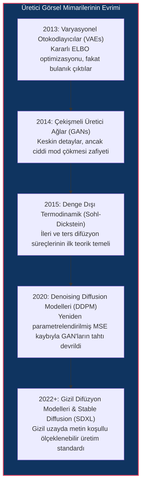
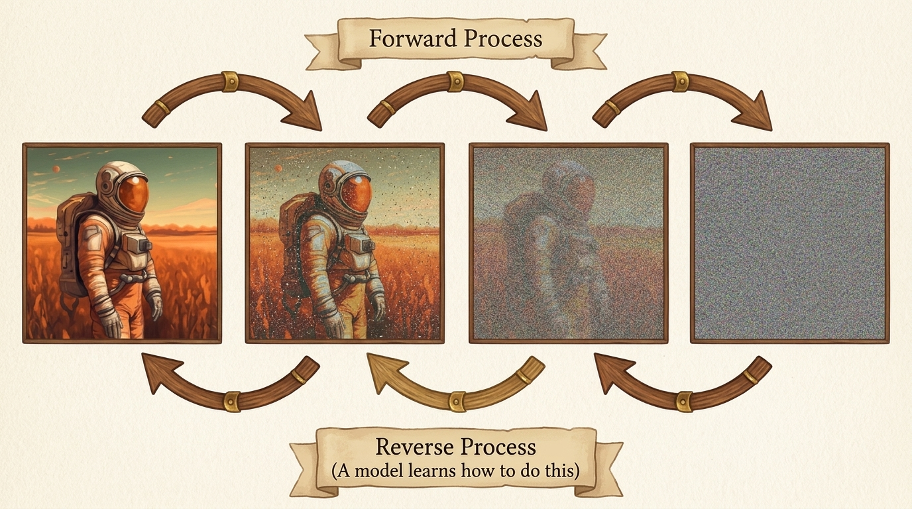
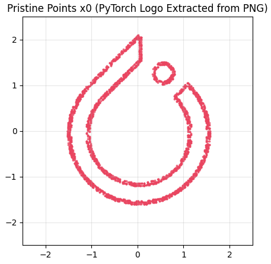
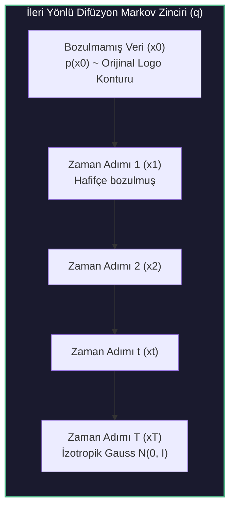
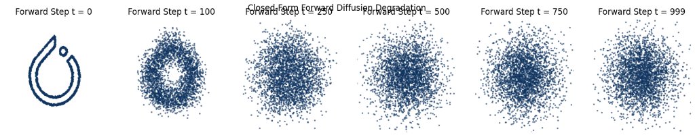
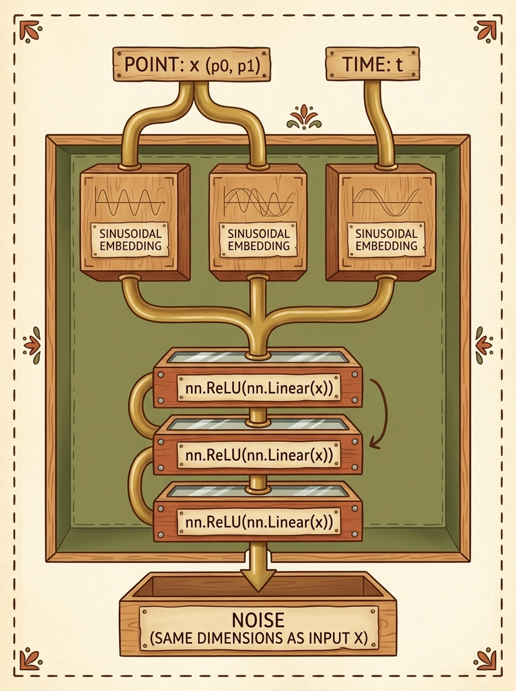
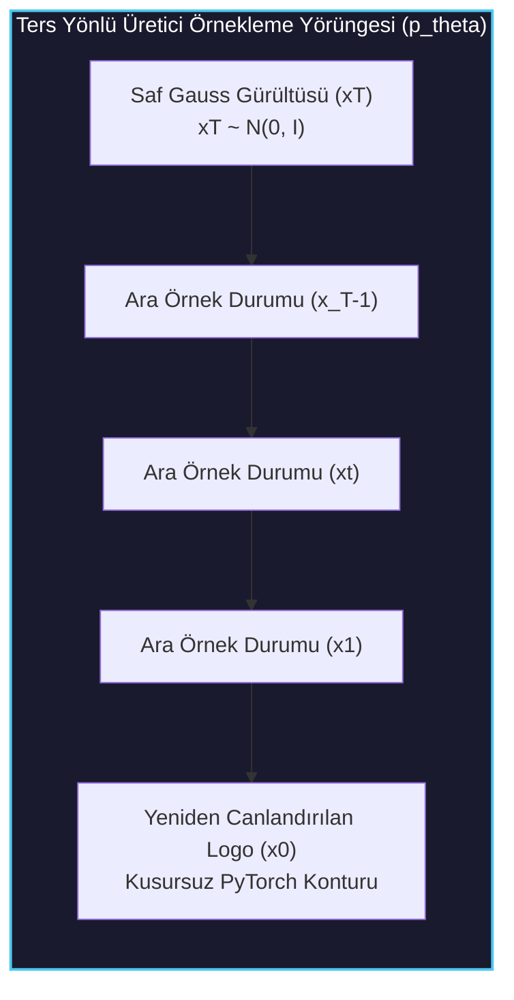
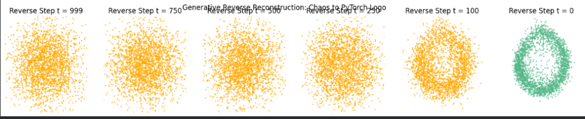

# Görüntüler İçin Difüzyon Modelleri (Diffusion Models for Images)

<!-- toc -->

<div style="margin-bottom: 20px;">
  <a href="https://colab.research.google.com/github/emreaslan7/ai/blob/main/notebooks/deep-learning-with-pytorch/10-diffusion-models-for-images.ipynb" target="_blank">
    
  </a>
</div>

---

## 1. Üretici Görsel Paradigması: VAE ve GAN'lardan Difüzyona

Bilgisayarla görmede üretici yapay zeka (generative artificial intelligence), doğası gereği ters bir problemi (inverse problem) çözmeyi hedefler: Çok boyutlu gerçek dünya gözlemleri (görüntüler) verildiğinde, bir algoritma verinin gerçek olasılık dağılımını ($p\_{\text{data}}(\mathbf{x})$) nasıl modellemelidir ki bu dağılımdan çekilen her yeni örnek, hem tamamen özgün hem de görsel olarak tutarlı ve fiziksel olarak inandırıcı olsun?

Önceki dizilim modelleme ve transformer bölümünde, token'lar ardışık bağımlılıklar sergilemekteydi ve olasılık dağılımları tek boyutlu bir zaman ekseni boyunca otoregresif olarak ayrıştırılabiliyordu:

$$ p(\mathbf{w}) = \prod\_{i=1}^N p(w\_i \mid w\_1, w\_2, \dots, w\_{i-1}) $$

Görüntü üretimi ise basit bir soldan-sağa veya yukarıdan-aşağıya otoregresif sıralamayı reddeder. Bir görüntü $\mathbf{x} \in \mathbb{R}^{C \times H \times W}$, iki boyutlu ızgarada piksellerin birbiriyle mekânsal olarak kenetlendiği bir tensördür. Yerel yamalar, anlamsal nesne sınırları, küresel aydınlatma ve yüksek frekanslı dokular, iki boyutlu uzayda birbirlerini nedensel olmayan (non-causal) biçimde kısıtlar. Difüzyon modellerinin sahneye çıkışından önce görsel senteze iki ana paradigma yön vermiştir: **Varyasyonel Otokodlayıcılar (VAEs)** ve **Çekişmeli Üretici Ağlar (GANs)**.



### 1.1 Varyasyonel Otokodlayıcılar (VAEs)

Kingma ve Welling tarafından 2013 yılı sonunda literatüre kazandırılan **Varyasyonel Otokodlayıcılar (VAE)**, veri üretimini olasılıksal bir gizil değişken (latent variable) çıkarımı olarak modeller. Bir kodlayıcı ağ $q\_\phi(\mathbf{z} \mid \mathbf{x})$, yüksek boyutlu piksel uzayını gözlemlenemeyen düşük boyutlu bir gizil uzay $\mathbf{z} \in \mathbb{R}^d$ üzerindeki çok değişkenli Gauss dağılımının parametrelerine eşler:

$$ q\_\phi(\mathbf{z} \mid \mathbf{x}) = \mathcal{N}\left(\mathbf{z};\, \boldsymbol{\mu}\_\phi(\mathbf{x}),\, \operatorname{diag}(\boldsymbol{\sigma}\_\phi^2(\mathbf{x}))\right) $$

Bir kod çözücü ağ $p\_\theta(\mathbf{x} \mid \mathbf{z})$ ise, yeniden parametrelendirme hilesiyle ($\mathbf{z} = \boldsymbol{\mu} + \boldsymbol{\sigma} \odot \boldsymbol{\epsilon}$, $\boldsymbol{\epsilon} \sim \mathcal{N}(\mathbf{0}, \mathbf{I})$) çekilen örnekten orijinal veriyi yeniden inşa eder. Eğitim, Kanıt Alt Sınırını (Evidence Lower Bound - ELBO) maksimize eder:

$$ \log p(\mathbf{x}) \ge \mathbb{E}\_{q\_\phi(\mathbf{z} \mid \mathbf{x})}\left[\log p\_\theta(\mathbf{x} \mid \mathbf{z})\right] - D\_{\text{KL}}\left(q\_\phi(\mathbf{z} \mid \mathbf{x}) \parallel p(\mathbf{z})\right) $$

Tamamen yeni bir görsel üretmek için kodlayıcı devre dışı bırakılır; doğrudan standart normal dağılımdan rastgele bir $\mathbf{z} \sim \mathcal{N}(\mathbf{0}, \mathbf{I})$ vektörü çekilip kod çözücüye beslenir. Teorik olarak son derece kararlı ve zarif olsa da VAE'lerin bilinen en büyük zafiyeti **bulanıklıktır (blurriness)**. Piksel düzeyinde ortalama kare hata (MSE) veya Gauss olabilirlik fonksiyonları, yüksek frekanslı ince dokularda ortalama almayı ödüllendirdiğinden üretilen görüntüler keskinlikten yoksundur.

### 1.2 Çekişmeli Üretici Ağlar (GANs)

2014 yılında Ian Goodfellow ve ekibi, açık olasılık yoğunluğu kestirimini tamamen bir kenara bırakıp iki oyunculu sıfır toplamlı bir minimaks oyunu kurgulayan **Çekişmeli Üretici Ağları (GAN)** tanıttı:

$$ \min\_G \max\_D V(D, G) = \mathbb{E}\_{\mathbf{x} \sim p\_{\text{data}}(\mathbf{x})}\left[\log D(\mathbf{x})\right] + \mathbb{E}\_{\mathbf{z} \sim p\_{\mathbf{z}}(\mathbf{z})}\left[\log(1 - D(G(\mathbf{z})))\right] $$

**Üretici (Generator)** $G\_\theta$, rastgele gürültüyü sentetik görüntülere dönüştürür. **Ayırt Edici (Discriminator)** $D\_\phi$ ise ikili bir sınıflandırıcı gibi çalışarak önüne gelen görselin gerçek veri kümesinden mi yoksa üreticinin sahte tezgahından mı çıktığını ayırt etmeye çalışır.

Eşzamanlı gradyan güncellemeleri sayesinde GAN'lar jilet gibi keskin kenarlar ve göz alıcı fotogerçekçilik üretmeyi başardı. Ancak eğitim dinamikleri son derece kırılgandır:
1. **Mod Çökmesi (Mode Collapse):** Üretici, ayırt ediciyi kandırmayı garantileyen birkaç dar görsel kalıbı (örneğin sadece tek bir köpek cinsi) ezberler ve gerçek veri kümesinin zengin çeşitliliğini tamamen göz ardı eder.
2. **Gradyan Kaybolması ve Nash Dengesi Kararsızlığı:** Ayırt edici ağ üreticiden çok daha hızlı öğrendiğinde gradyanlar kaybolur veya optimizasyon salınıma girip çöker.

<figure style="display:flex; justify-content: center; margin: 25px 0;">
  <div style="text-align: center;">
    
    <figcaption style="margin-top: 0.6em; text-align: center; font-size: 13px; color: #888;"><em>Şekil 10.1: VAE ve GAN mimari paradigmaları. Üst: VAE veriyi bir kodlayıcı üzerinden düzenlileştirilmiş gizil uzaya sıkıştırır ve geri çözer. Alt: GAN, sentetik parşömen üreten zanaatkar üretici ile sahteyi tespit eden bilge ayırt ediciyi çekişmeli bir oyunda yarıştırır.</em></figcaption>
  </div>
</figure>

---

## 2. Modern Difüzyon Devrimi (DALL-E ve Stable Diffusion)

2015 yılında Jascha Sohl-Dickstein ve çalışma arkadaşları (*Deep Unsupervised Learning Using Nonequilibrium Thermodynamics*), fiziksel difüzyon prensibinden esinlenen radikal bir yaklaşım sundu. Veriyi rastgele bir gürültüden tek bir devasa adımda üretmeye çalışmak yerine (GAN'larda olduğu gibi), verinin yapısal düzenini kontrollü ve yavaş bir biçimde adım adım yok etmeyi; ardından derin bir sinir ağına bu bozulma sürecini adım adım tersine çevirmeyi öğretmeyi önerdiler.

İlk yıllarda GAN'ların gölgesinde kalsa da, Jonathan Ho, Ajay Jain ve Pieter Abbeel'in 2020 tarihli çığır açıcı makalesi **Denoising Diffusion Probabilistic Models (DDPM)** ile difüzyon modelleri patlama yaptı. Ho ve ekibi, yeniden parametrelendirilmiş gürültü tahmin kaybı ve U-Net omurgası ile difüzyonun GAN'ları hem görsel kalitede hem de örnek çeşitliliğinde geride bıraktığını kanıtladı.

Bu başarı kısa sürede endüstriyel sistemlere dönüştü:
- **DALL-E 2 (OpenAI):** Metinden görüntüye (Text-to-Image) yüksek çözünürlüklü koşullu difüzyon.
- **Stable Diffusion ve SDXL (CompVis, Runway, Stability AI):** Piksel uzayı yerine düşük boyutlu gizil uzayda çalışan **Gizil Difüzyon Modelleri (Latent Diffusion Models - LDMs)** sayesinde tüketici sınıfı ekran kartlarında saniyeler içinde 1024x1024 fotogerçekçi görsel sentezi.



---

## 3. Temel Çalışma Mantığı: Üç Aşamada Difüzyon

Difüzyon modellerinin arkasındaki temel mühendislik fikri üç ana adımdan oluşur:

1. **İleri Süreç (Gürültü Ekleme):** Elimizdeki temiz veriye ($\mathbf{x}\_0$), küçük adımlarla ($t = 1, \dots, T$) kontrollü Gauss gürültüsü ekleriz. Yeterli adım sonunda (örneğin $T = 1000$), veri tamamen tanınmaz hale gelerek saf rastgele gürültüye ($\mathbf{x}\_T \sim \mathcal{N}(\mathbf{0}, \mathbf{I})$) dönüşür.
2. **Eğitim (Gürültüyü Kestirme):** Bir yapay sinir ağına, rastgele seçilen herhangi bir $t$ anındaki gürültülü duruma ($\mathbf{x}\_t$) bakarak **"bu adıma kadar eklenmiş olan gürültü neydi?"** sorusunu çözmeyi öğretiriz. Model, temiz resmi doğrudan tahmin etmek yerine, resmin üzerindeki paraziti ($\boldsymbol{\epsilon}$) kestirir.
3. **Ters Süreç (Üretim / Sampling):** Sıfırdan yeni bir veri üretmek istediğimizde, standart bir rastgele normal dağılımdan saf gürültü çekeriz ($\mathbf{x}\_T$). Eğitilmiş modelimizi kullanarak her adımda tahmini gürültüyü parça parça çıkartırız ($t = T \to 0$). Adım adım temizlenen gürültü, sonunda daha önce hiç var olmamış yepyeni ve keskin bir veriye dönüşür.

<figure style="display:flex; justify-content: center; margin: 25px 0;">
  <div style="text-align: center;">
    
    <figcaption style="margin-top: 0.6em; text-align: center; font-size: 13px; color: #888;"><em>Şekil 10.2: Difüzyon modellerinde ileri ve ters yönlü süreçler. Üst: Orijinal verinin adım adım eklenen Gauss gürültüsüyle saf rassallığa dönüştürülmesi. Alt: Eğitilmiş sinir ağının her adımda eklenen gürültüyü tahmin edip arındırarak kaostan temiz veriyi adım adım inşa etmesi.</em></figcaption>
  </div>
</figure>

---

## 4. Pedagojik Kurgu: 2D Nokta Bulutu Konturu (PyTorch Logosu)

Milyonlarca parametreli konvolüsyonel omurgalar ve saatler süren devasa GPU eğitimlerine girmeden önce, difüzyonun kalbindeki matematiksel mantığı kristal netliğinde kavramak için Howard Huang'ın 2. baskıda sunduğu harika pedagojik rotayı takip edeceğiz: **İki Boyutlu Nokta Bulutları Üzerinde Difüzyon (PyTorch Logosu)**.

Keyfi bir görüntü $\mathbf{x} \in \mathbb{R}^{H \times W \times C}$, belirli konumlardaki skaler piksel değerleridir. İki boyutlu bir kontur ise $N$ adet $(p\_0, p\_1) \in \mathbb{R}^2$ koordinat çiftidir. 2D koordinatlar üzerinde difüzyon çalıştırmak; varyans çizelgesi, gürültü ekleme denklemi, kapalı form atlaması ve DDPM örnekleme mekanizmasını birebir aynı matematikle öğrenmemizi sağlar.

### 4.1 Logo Görselinden 2D Kontur Koordinatlarının Çıkarılması

Difüzyon sürecini başlatmadan önce, orijinal PyTorch logosunun sınır koordinatlarını çıkarırız. Logo doğrudan yüksek çözünürlüklü şeffaf PNG URL'inden indirilebilir, $256 \times 256$ piksel boyutuna yeniden ölçeklendirilir ve kontur noktaları kenar/alfa filtreleme ile elde edilir:

```python
import io
import urllib.request
import numpy as np
import torch
import torch.nn as nn
import torch.nn.functional as F
import matplotlib.pyplot as plt
from PIL import Image, ImageFilter

# 1. Eylem: Geometrinin tekrarlanabilirliği için rastgelelik tohumu ve donanım seçimi
device = torch.device("cuda" if torch.cuda.is_available() else "cpu")
torch.manual_seed(42)
np.random.seed(42)
print(f"Aktif Hesaplama Donanımı: {device}")
```

URL veya yerel dosya yolundan logoyu indirip $256 \times 256$ boyutuna ölçekleyen, Sobel/kenar filtresiyle dış hatları çıkaran ve sıfır ortalama, birim varyansa ($1.0$) normalize eden fonksiyon:

```python
# 2. Eylem: Görselden veya URL'den 2D koordinat noktaları çeken yardımcı fonksiyon
def load_pytorch_logo_points(
    source="https://res.cloudinary.com/startup-grind/image/upload/c_fill,w_500,h_500,g_center/c_fill,dpr_2.0,f_auto,g_center,q_auto:good/v1/gcs/platform-data-linuxhq/events/PyTorch_Symbol_01_OrangeOnTransparent_nUWxXkQ.png",
    num_points=3000,
    target_size=(256, 256),
):
    """
    PyTorch logo PNG görselini URL veya yerelden yükler, 256x256 boyutuna getirir,
    kontur sınırlarını filtreler ve noktaları sıfır merkezli birim varyansa normalize eder.
    """
    try:
        if source.startswith("http://") or source.startswith("https://"):
            req = urllib.request.Request(source, headers={"User-Agent": "Mozilla/5.0"})
            with urllib.request.urlopen(req, timeout=10) as resp:
                img_bytes = resp.read()
            img = Image.open(io.BytesIO(img_bytes)).convert("RGBA")
        else:
            img = Image.open(source).convert("RGBA")
    except Exception as err:
        print(f"URL yüklemesi başarısız oldu ({err}). Parametrik sentetik logo üretiliyor...")
        # İnternet kesintisi için yedek parametrik alev ve çember üretimi
        theta = np.linspace(0, 2 * np.pi, int(num_points * 0.65), endpoint=False)
        ring_x, ring_y = 1.8 * np.cos(theta), 1.8 * np.sin(theta)
        flame_pts = int(num_points * 0.35)
        flame_x = np.concatenate([np.linspace(-0.5, 0.5, flame_pts // 2), np.zeros(flame_pts - flame_pts // 2)])
        flame_y = np.concatenate([np.linspace(-1.0, 1.2, flame_pts // 2), np.linspace(0.2, 1.5, flame_pts - flame_pts // 2)])
        coords = np.stack([np.concatenate([ring_x, flame_x]), np.concatenate([ring_y, flame_y])], axis=1).astype(np.float32)
        coords -= coords.mean(axis=0, keepdims=True)
        coords /= coords.std()
        return torch.tensor(coords, dtype=torch.float32)

    # 256 x 256 boyutuna ölçekleme
    img = img.resize(target_size, Image.Resampling.LANCZOS)
    
    # Sobel / FIND_EDGES ile kontur sınırlarını tespit etme
    gray = img.convert("L")
    edges = gray.filter(ImageFilter.FIND_EDGES)
    edge_array = np.array(edges)
    
    y_indices, x_indices = np.where(edge_array > 40)
    total_found = len(x_indices)
    
    # Eğer kenar pikselleri azsa alfa (şeffaflık) maskesine geçiş
    if total_found < 500:
        alpha = np.array(img)[:, :, 3]
        y_indices, x_indices = np.where(alpha > 50)
        total_found = len(x_indices)
        
    chosen_indices = np.random.choice(total_found, num_points, replace=(total_found < num_points))
    x_pts = x_indices[chosen_indices].astype(np.float32)
    y_pts = -y_indices[chosen_indices].astype(np.float32) # Kartezyen düzlem için Y eksenini dik çevir
    
    coords = np.stack([x_pts, y_pts], axis=1)
    coords -= coords.mean(axis=0, keepdims=True)
    coords /= np.std(coords) # Birim varyans normalizasyonu
    return torch.tensor(coords, dtype=torch.float32)
```

Görsel kontur noktaları yüklendiğinde veri kümesi tensörümüz $\mathbf{x}\_0$, $[N, 2]$ boyutlarında saf bir PyTorch tensörüdür:

```python
# 3. Eylem: PyTorch logosunu URL'den indirip tensöre dönüştürme
LOGO_URL = "https://res.cloudinary.com/startup-grind/image/upload/c_fill,w_500,h_500,g_center/c_fill,dpr_2.0,f_auto,g_center,q_auto:good/v1/gcs/platform-data-linuxhq/events/PyTorch_Symbol_01_OrangeOnTransparent_nUWxXkQ.png"
x0 = load_pytorch_logo_points(source=LOGO_URL, num_points=3000, target_size=(256, 256))
print(f"Veri Kümesi x0 Boyutu: {x0.shape} | Ortalama: {x0.mean():.4f} | Standart Sapma: {x0.std():.4f}")
```

<figure style="display:flex; justify-content: center; margin: 25px 0;">
  <div style="text-align: center;">
    
    <figcaption style="margin-top: 0.6em; text-align: center; font-size: 13px; color: #888;"><em>Şekil 10.4: Resmi PyTorch logosundan (256x256 piksele ölçeklenmiş şeffaf PNG) filtrelenerek sıfır merkezli ve birim varyansa normalize edilmiş bozulmamış $\mathbf{x}\_0$ koordinat veri kümesi.</em></figcaption>
  </div>
</figure>

---

## 5. İleri Yönlü Difüzyon Süreci (Verinin Kademeli Yok Edilmesi)

**İleri yönlü difüzyon süreci** (noising process), orijinal veri $\mathbf{x}\_0$'a ayrık $T$ zaman adımı boyunca azar azar sentetik Gauss gürültüsü ekleyerek giderek daha gürültülü bir durumlar dizisi ($\mathbf{x}\_1, \mathbf{x}\_2, \dots, \mathbf{x}\_T$) oluşturur.



### 5.1 Adım Adım Markov Zinciri

İleri süreç bir Markov zinciri olarak formüle edilir; her $q(\mathbf{x}\_t \mid \mathbf{x}\_{t-1})$ geçişi sadece hemen önceki $\mathbf{x}\_{t-1}$ durumuna bağlıdır. Eklenen gürültünün dozu $\beta\_t \in (0, 1)$ varyans skateriyle kontrol edilir:

$$ q(\mathbf{x}\_t \mid \mathbf{x}\_{t-1}) = \mathcal{N}\left(\mathbf{x}\_t;\, \sqrt{1 - \beta\_t}\,\mathbf{x}\_{t-1},\, \beta\_t \mathbf{I}\right) $$

Burada ortalamaya uygulanan $\sqrt{1 - \beta\_t}$ katsayısı kritik bir rol oynar: Eğer önceki durumu küçültmeden doğrudan gürültü ekleseydik ($\mathbf{x}\_t = \mathbf{x}\_{t-1} + \sqrt{\beta\_t}\boldsymbol{\epsilon}$), tensörün toplam varyansı her adımda kontrolsüzce büyürdü. Bu ağırlıklandırma sayesinde sistemin toplam varyansı her adımda tam olarak birimde (1.0) sabit kalır:

$$ \operatorname{Var}(\mathbf{x}\_t) = (1 - \beta\_t)\operatorname{Var}(\mathbf{x}\_{t-1}) + \beta\_t \operatorname{Var}(\boldsymbol{\epsilon}) = (1 - \beta\_t)(1) + \beta\_t(1) = 1 $$

### 5.2 Doğrusal Varyans Çizelgesi (Linear Beta Schedule)

$\beta\_1, \beta\_2, \dots, \beta\_T$ dizisi önceden belirlenmiş bir **gürültü çizelgesiyle (noise schedule)** yönetilir. Bu bölümde $T = 1000$ adımda $\beta\_1 = 10^{-4}$ değerinden başlayıp doğrusal olarak $\beta\_T = 0.02$ değerine yükselen standart Ho et al. çizelgesini kullanıyoruz:

$$ \beta\_t = \beta\_1 + \frac{t - 1}{T - 1}(\beta\_T - \beta\_1) $$

```python
# 1. Eylem: Doğrusal beta varyans çizelgesini tanımlama
def linear_beta_schedule(timesteps=1000, start=0.0001, end=0.02):
    """
    Ayrık zaman adımları boyunca eklenecek gürültü varyansını
    doğrusal artıran 1D PyTorch tensörü üretir.
    """
    return torch.linspace(start, end, timesteps)

T = 1000
betas = linear_beta_schedule(timesteps=T)
print(f"Beta Çizelgesi: beta_0 = {betas[0]:.6f} | beta_500 = {betas[500]:.6f} | beta_999 = {betas[-1]:.6f}")
```

Adım adım ileri yönlü gürültü işletimi:

```python
# 2. Eylem: Tek adımlı Markovian difüzyon geçişi
def diffuse_single_step(points, beta):
    """
    Tek bir q(x_t | x_{t-1}) Markovian Gauss bozulma adımı uygular.
    """
    new_mean = torch.sqrt(1.0 - beta) * points
    noise = torch.randn_like(points)
    perturbation = torch.sqrt(beta) * noise
    return new_mean + perturbation, noise
```

### 5.3 Kapalı Form Atlaması: Döngüleri Ortadan Kaldıran Matematik

Eğer model eğitirken $t=800$. adımdaki gürültülü hali hesaplamak için 800 adımlık bir Python for döngüsü çalıştırmak zorunda kalsaydık, eğitim ve bellek maliyeti felç olurdu.

Bağımsız Gauss rassal değişkenlerinin toplamının yine bir Gauss değişkeni olması sayesinde, $q(\mathbf{x}\_1 \mid \mathbf{x}\_0) \dots q(\mathbf{x}\_t \mid \mathbf{x}\_{t-1})$ zinciri doğrudan $\mathbf{x}\_0$'dan $\mathbf{x}\_t$'ye **tek bir adımda zıplayan kapalı form denklemine** indirgenebilir.

$\alpha\_t = 1 - \beta\_t$ tanımlayalım ve kümülatif çarpımı kuralım:

$$ \bar{\alpha}\_t = \prod\_{s=1}^t \alpha\_s $$

$\boldsymbol{\epsilon}\_0, \boldsymbol{\epsilon}\_1, \dots \sim \mathcal{N}(\mathbf{0}, \mathbf{I})$ standart normal gürültü değişkenlerini kullanarak geriye doğru açalım:

$$ \mathbf{x}\_t = \sqrt{\alpha\_t}\mathbf{x}\_{t-1} + \sqrt{1 - \alpha\_t}\boldsymbol{\epsilon}\_{t-1} $$

$\mathbf{x}\_{t-1}$ yerine değerini yazarsak:

$$ \mathbf{x}\_t = \sqrt{\alpha\_t}\left(\sqrt{\alpha\_{t-1}}\mathbf{x}\_{t-2} + \sqrt{1 - \alpha\_{t-1}}\boldsymbol{\epsilon}\_{t-2}\right) + \sqrt{1 - \alpha\_t}\boldsymbol{\epsilon}\_{t-1} $$
$$ \mathbf{x}\_t = \sqrt{\alpha\_t \alpha\_{t-1}}\mathbf{x}\_{t-2} + \sqrt{\alpha\_t(1 - \alpha\_{t-1})}\boldsymbol{\epsilon}\_{t-2} + \sqrt{1 - \alpha\_t}\boldsymbol{\epsilon}\_{t-1} $$

İki bağımsız Gauss değişkeni $\sqrt{\alpha\_t(1 - \alpha\_{t-1})}\boldsymbol{\epsilon}\_{t-2}$ ve $\sqrt{1 - \alpha\_t}\boldsymbol{\epsilon}\_{t-1}$ toplandığında varyansları toplanır:

$$ \alpha\_t(1 - \alpha\_{t-1}) + (1 - \alpha\_t) = \alpha\_t - \alpha\_t \alpha\_{t-1} + 1 - \alpha\_t = 1 - \alpha\_t \alpha\_{t-1} $$

Tümevarım $\mathbf{x}\_0$'a kadar yürütüldüğünde aradaki tüm terimler sadeleşir:

$$ \mathbf{x}\_t = \sqrt{\bar{\alpha}\_t}\mathbf{x}\_0 + \sqrt{1 - \bar{\alpha}\_t}\boldsymbol{\epsilon}, \quad \boldsymbol{\epsilon} \sim \mathcal{N}(\mathbf{0}, \mathbf{I}) $$

$$ q(\mathbf{x}\_t \mid \mathbf{x}\_0) = \mathcal{N}\left(\mathbf{x}\_t;\, \sqrt{\bar{\alpha}\_t}\mathbf{x}\_0,\, (1 - \bar{\alpha}\_t)\mathbf{I}\right) $$

#### Bu Formül Pratikte Ne Söylüyor?
Denklemi iki parçalı bir terazi gibi düşünebiliriz:
- $\sqrt{\bar{\alpha}\_t}\mathbf{x}\_0$: **Orijinal Sinyal Payı.** Zaman adımı $t$ büyüdükçe katsayı $\bar{\alpha}\_t \to 0$ olur; yani orijinal verinin görünürlüğü azalır.
- $\sqrt{1 - \bar{\alpha}\_t}\boldsymbol{\epsilon}$: **Eklenen Gürültü Payı.** Zaman ilerledikçe $1 - \bar{\alpha}\_t \to 1$ olur; yani rastgele gürültü baskın hale gelir.
- İki katsayının kareleri toplamı $(\sqrt{\bar{\alpha}\_t})^2 + (\sqrt{1 - \bar{\alpha}\_t})^2 = \bar{\alpha}\_t + 1 - \bar{\alpha}\_t = 1$ olduğu için, toplam varyans her adımda tam $1.0$ seviyesinde korunur.

> **Kritik Çıkarım:** Herhangi bir $t \in [1, T]$ anındaki gürültülü durum $\mathbf{x}\_t$, aradaki yüzlerce adımı tek tek çalıştırmadan $\mathcal{O}(1)$ sürede doğrudan tek bir matematiksel işlemle üretilebilir. Bu özellik, modeli eğitirken rastgele bir zaman adımı seçip doğrudan o adımdaki gürültülü veriyi modele vermemizi sağlar.

### 5.4 Kapalı Form Örnekleyicinin PyTorch Uygulaması

Sabit katsayıları önceden hesaplayıp belleğe alırız:

```python
# 1. Eylem: Kümülatif difüzyon katsayılarını önceden hesaplama
alphas = 1.0 - betas
alphas_cumprod = torch.cumprod(alphas, dim=0)
alphas_cumprod_prev = F.pad(alphas_cumprod[:-1], (1, 0), value=1.0)

sqrt_alphas_cumprod = torch.sqrt(alphas_cumprod)
sqrt_one_minus_alphas_cumprod = torch.sqrt(1.0 - alphas_cumprod)

# 2. Eylem: 1D çizelge değerlerini N-boyutlu tensörlerle yayınlama (broadcasting) yardımcısı
def reshape_for_x(a, x):
    """
    Zaman adımıyla indekslenen 1D 'a' tensörünü, 'x' tensörünün boyutlarıyla
    yayınlanabilecek (broadcast) şekilde yeniden şekillendirir.
    """
    batch_size = x.shape[0]
    ones_to_broadcast = len(x.shape) - 1
    return a.view(batch_size, *([1] * ones_to_broadcast)).to(x.device)

# 3. Eylem: Tek adımlı kapalı form ileri difüzyon fonksiyonu
def forward_diffusion_sample(x0, t, device=device):
    """
    q(x_t | x_0) dağılımından tek bir kapalı form hamlesiyle x_t ve eklenen epsilon gürültüsünü döndürür.
    """
    x0 = x0.to(device)
    noise = torch.randn_like(x0)
    
    sqrt_alpha_bar = reshape_for_x(sqrt_alphas_cumprod[t], x0)
    sqrt_one_minus_alpha_bar = reshape_for_x(sqrt_one_minus_alphas_cumprod[t], x0)
    
    xt = sqrt_alpha_bar * x0 + sqrt_one_minus_alpha_bar * noise
    return xt, noise
```

<figure style="display:flex; justify-content: center; margin: 25px 0;">
  <div style="text-align: center;">
    
    <figcaption style="margin-top: 0.6em; text-align: center; font-size: 13px; color: #888;"><em>Şekil 10.5: Analitik kapalı form formülasyonuyla $t \in [0, 100, 250, 500, 750, 999]$ zaman adımlarında ileri yönlü bozulma. $t = 999$ anına ulaşıldığında PyTorch logosunun tüm geometrisi yok olur ve saf izotropik Gauss gürültüsüne $\mathcal{N}(\mathbf{0}, \mathbf{I})$ dönüşür.</em></figcaption>
  </div>
</figure>

---

## 6. Zamanın Okunu Tersine Çevirmek: Model Mimarisi ve Eğitim

### 6.1 Görev Tanımı: Görüntüyü Değil, Eklenen Gürültüyü Kestirmek

Difüzyon modelinin amacı, gürültülü $\mathbf{x}\_t$ durumundan bir önceki daha temiz $\mathbf{x}\_{t-1}$ durumunu tahmin etmektir.

İlk bakışta yapay sinir ağının doğrudan temiz görüntüyü ($\mathbf{x}\_0$) tahmin etmesi gerektiği düşünülebilir. Ancak Ho et al. (2020), ağın **o ana kadar eklenmiş olan $\boldsymbol{\epsilon}$ gürültü vektörünü kestirmesi** şeklinde parametrelendirildiğinde eğitimin çok daha kararlı olduğunu kanıtlamıştır.

#### Neden Resmi Değil de Gürültüyü Tahmin Ediyoruz?
1. **Hedefin Sabit Dağılımı:** Veri kümesindeki resimler son derece karmaşık, çok-modlu ve çeşitlidir (yüzler, manzaralar, logolar). Ancak eklediğimiz gürültü $\boldsymbol{\epsilon}$ her zaman standart normal dağılıma ($\mathcal{N}(\mathbf{0}, \mathbf{I})$) uyar; yani ortalaması sıfır, varyansı birdir. Sinir ağının iyi bilinen, simetrik bir dağılımı tahmin etmesi optimizasyonu çok daha kararlı kılar.
2. **Doğrudan Çıkarım:** Ağ $\boldsymbol{\epsilon}\_\theta(\mathbf{x}\_t, t)$ ile eklenen gürültüyü kestirdiğinde, temiz $\mathbf{x}\_0$ tahminini basit bir cebirsel işlemle anında elde edebiliriz:

$$ \hat{\mathbf{x}}\_0 = \frac{\mathbf{x}\_t - \sqrt{1 - \bar{\alpha}\_t}\boldsymbol{\epsilon}\_\theta(\mathbf{x}\_t, t)}{\sqrt{\bar{\alpha}\_t}} $$

### 6.2 Sinüsoidal Konumsal Gömme (Sinusoidal Positional Embeddings)

Tek bir sinir ağı, $t=1$ anındaki mikroskobik bozulmalardan $t=999$ anındaki saf kaosa kadar her aşamadaki gürültüyü tahmin etmek zorundadır. Bu nedenle model **hangi $t$ zaman adımında çalıştığını kesinlikle bilmelidir**.

Ham $t \in [0, 999]$ skalerini doğrudan lineer bir katmana beslemek yetersizdir; çünkü derin ağlar ham skalerlerden yüksek frekanslı harmonik ilişkileri öğrenmekte zorlanır. Bunun yerine transformer mimarilerinden tanıdığımız **sinüsoidal konumsal gömme (sinusoidal embeddings)** kullanılır:

$$ \text{PE}(t, 2i) = \sin\left(\frac{t}{10000^{2i / d}}\right), \quad \text{PE}(t, 2i+1) = \cos\left(\frac{t}{10000^{2i / d}}\right) $$

```python
# 1. Eylem: Sinüsoidal Konumsal Gömme Modülü
class SinusoidalEmbedding(nn.Module):
    """
    1D skaler zaman adımlarını veya sürekli koordinatları
    geometrik frekanslara yayarak yüksek boyutlu harmonik vektörlere dönüştürür.
    """
    def __init__(self, dim):
        super().__init__()
        self.dim = dim
        assert dim % 2 == 0, "Gömme boyutu çift sayı olmalıdır."

    def forward(self, x):
        device = x.device
        half_dim = self.dim // 2
        emb_scale = torch.log(torch.tensor(10000.0, device=device)) / (half_dim - 1)
        freqs = torch.exp(torch.arange(half_dim, device=device, dtype=torch.float32) * -emb_scale)
        
        args = x.view(-1, 1) * freqs.view(1, -1)
        embedding = torch.cat([torch.sin(args), torch.cos(args)], dim=-1)
        return embedding

    def __len__(self):
        return self.dim
```

### 6.3 Denoising MLP Model Mimarisi

Denoising ağımız iki koordinat girdisi $(p\_0, p\_1)$ ve zaman adımı $t$ alır. Her biri 128 boyutlu sinüsoidal gömme katmanından geçirilerek 384 boyutlu bir özellik vektöründe birleştirilir. Ardından 3 katmanlı `Linear + ReLU` bloğundan geçirilerek eklenen 2D gürültü $(\hat{\epsilon}\_0, \hat{\epsilon}\_1) \in \mathbb{R}^2$ tahmin edilir:

<figure style="display:flex; justify-content: center; margin: 25px 0;">
  <div style="text-align: center;">
    
    <figcaption style="margin-top: 0.6em; text-align: center; font-size: 13px; color: #888;"><em>Şekil 10.3: Denoising model mimarisi. Sürekli 2D koordinatlar (p0, p1) ve zaman adımı t ayrı sinüsoidal gömme bloklarında işlenir, birleştirilir ve lineer katmanlar üzerinden eklenen gürültüyü tahmin eder.</em></figcaption>
  </div>
</figure>

```python
# 2. Eylem: Gürültü Tahmin Eden Denoising Sinir Ağı
class DenoisingModel(nn.Module):
    """
    2D nokta koordinatlarına t anında eklenmiş olan epsilon gürültüsünü kestirir.
    """
    def __init__(self, hidden_dim=128, num_layers=3):
        super().__init__()
        self.pos1_mlp = SinusoidalEmbedding(hidden_dim)
        self.pos2_mlp = SinusoidalEmbedding(hidden_dim)
        self.time_mlp = SinusoidalEmbedding(hidden_dim)
        
        concat_dim = hidden_dim * 3
        layers = [nn.Linear(concat_dim, hidden_dim), nn.ReLU()]
        for _ in range(num_layers):
            layers.extend([nn.Linear(hidden_dim, hidden_dim), nn.ReLU()])
        layers.append(nn.Linear(hidden_dim, 2))
        
        self.joint_mlp = nn.Sequential(*layers)

    def forward(self, x, t):
        x1_emb = self.pos1_mlp(x[:, 0])
        x2_emb = self.pos2_mlp(x[:, 1])
        t_emb = self.time_mlp(t.float())
        
        joint_features = torch.cat([x1_emb, x2_emb, t_emb], dim=-1)
        predicted_noise = self.joint_mlp(joint_features)
        return predicted_noise
```

### 6.4 Basitleştirilmiş Kayıp Fonksiyonu ($L\_{\text{simple}}$)

Ho et al., karmaşık varyasyonel çıkarım sınırının ağırlıksız bir Ortalama Kare Hata (MSE) kaybına indirgendiğini ispatlamıştır:

$$ L\_{\text{simple}}(\theta) = \mathbb{E}\_{t, \mathbf{x}\_0, \boldsymbol{\epsilon}} \left[ \left\Vert \boldsymbol{\epsilon} - \boldsymbol{\epsilon}\_\theta\left(\sqrt{\bar{\alpha}\_t}\mathbf{x}\_0 + \sqrt{1 - \bar{\alpha}\_t}\boldsymbol{\epsilon},\, t\right) \right\Vert^2 \right] $$

```python
# 3. Eylem: Kayıp hesaplama fonksiyonu
def get_loss(model, x0, t, device=device):
    """
    L_simple(theta): Gerçek eklenen gürültü ile model tahmini arasındaki MSE kaybı.
    """
    xt, true_noise = forward_diffusion_sample(x0, t, device=device)
    predicted_noise = model(xt, t)
    return F.mse_loss(predicted_noise, true_noise)
```

### 6.5 Eksiksiz Eğitim Döngüsü

Her optimizasyon adımında veri kümesinden bir mini-yığın çekilir, her örnek için bağımsız rastgele bir $t \sim \operatorname{Uniform}(\{0, 1, \dots, T-1\})$ seçilir, kapalı formla $\mathbf{x}\_t$ üretilir ve MSE kaybı üzerinden geri yayılım (backpropagation) gerçekleştirilir:

```python
# 4. Eylem: Modeli oluşturma ve eğitim döngüsünü çalıştırma
model = DenoisingModel(hidden_dim=128, num_layers=3).to(device)
optimizer = torch.optim.Adam(model.parameters(), lr=0.001)

def train_diffusion(model, optimizer, x_data, num_epochs=5000, batch_size=512):
    model.train()
    num_samples = x_data.shape[0]
    
    for epoch in range(1, num_epochs + 1):
        indices = torch.randint(0, num_samples, (batch_size,))
        batch_x0 = x_data[indices].to(device)
        batch_t = torch.randint(0, T, (batch_size,), device=device)
        
        optimizer.zero_grad()
        loss = get_loss(model, batch_x0, batch_t, device=device)
        loss.backward()
        optimizer.step()
        
        if epoch % 1000 == 0 or epoch == 1:
            print(f"Epok {epoch:5d} / {num_epochs} | Denoising MSE Kaybı: {loss.item():.6f}")

# Eğitimi başlat
train_diffusion(model, optimizer, x0, num_epochs=5000)
```

---

## 7. Ters Yönlü Difüzyon: DDPM Örnekleme Algoritması

### 7.1 Geriye Doğru Örnekleme Neden Tek Adımda Zıplayamaz?

İleri yönlü süreç $\mathbf{x}\_0$'dan $\mathbf{x}\_t$'ye tek adımda kapalı formla atlayabilirken, **ters yönlü üretici süreç** $p\_\theta(\mathbf{x}\_{t-1} \mid \mathbf{x}\_t)$ neden $t=T$ anından $t=0$ anına tek seferde atlayamaz?

Saf gürültüden ($\mathbf{x}\_T \sim \mathcal{N}(\mathbf{0}, \mathbf{I})$) tek bir adımda temiz veriye sıçramak çözümsüz çok-modlu (multimodal) bir belirsizlik yaratır. Belirli bir gürültü matrisiyle uyuşan milyarlarca farklı geçerli görüntü vardır. Tek bir adımda kestirim yapmaya çalışmak, tüm olası modların ortalamasını almaya zorlar ve sonuçta VAE benzeri bulanık bir leke oluşur. Kademeli stokastik örnekleme ise, her adımda ufak bir belirsizliği gidererek modelin belirli bir moda yumuşakça odaklanmasını ve keskin detayları kusursuzca örmesini sağlar.

### 7.2 Analitik Ters Geçiş Formülasyonu

Bayes kuralı gereğince gerçek a posteriori geçiş $q(\mathbf{x}\_{t-1} \mid \mathbf{x}\_t, \mathbf{x}\_0)$ bir Gauss dağılımıdır:

$$ q(\mathbf{x}\_{t-1} \mid \mathbf{x}\_t, \mathbf{x}\_0) = \mathcal{N}\left(\mathbf{x}\_{t-1};\, \tilde{\boldsymbol{\mu}}\_t(\mathbf{x}\_t, \mathbf{x}\_0),\, \tilde{\beta}\_t \mathbf{I}\right) $$

Burada posterior varyansı $\tilde{\beta}\_t$:

$$ \tilde{\beta}\_t = \frac{1 - \bar{\alpha}\_{t-1}}{1 - \bar{\alpha}\_t} \beta\_t $$

Modelin $\boldsymbol{\epsilon}\_\theta(\mathbf{x}\_t, t)$ kestirimi denklemde yerine konduğunda, tahmin edilen posterior ortalaması şu hale gelir:

$$ \boldsymbol{\mu}\_\theta(\mathbf{x}\_t, t) = \frac{1}{\sqrt{\alpha\_t}} \left( \mathbf{x}\_t - \frac{\beta\_t}{\sqrt{1 - \bar{\alpha}\_t}} \boldsymbol{\epsilon}\_\theta(\mathbf{x}\_t, t) \right) $$

$\mathbf{x}\_t$ durumundan bir önceki $\mathbf{x}\_{t-1}$ durumunu çekmek için:

$$ \mathbf{x}\_{t-1} = \frac{1}{\sqrt{\alpha\_t}} \left( \mathbf{x}\_t - \frac{\beta\_t}{\sqrt{1 - \bar{\alpha}\_t}} \boldsymbol{\epsilon}\_\theta(\mathbf{x}\_t, t) \right) + \sigma\_t \mathbf{z} $$

#### Bu Güncelleme Adımı Ne Yapıyor?
1. **Gürültüyü Çıkartma:** Modelin tahmin ettiği gürültü $\boldsymbol{\epsilon}\_\theta$, ağırlıklandırılarak mevcut durumdan $\mathbf{x}\_t$ çıkartılır ($\mathbf{x}\_t - \dots \boldsymbol{\epsilon}\_\theta$).
2. **Yeniden Ölçekleme:** Kalan sinyal, varyans dengesini korumak için $1/\sqrt{\alpha\_t}$ ile hafifçe büyütülür.
3. **Küçük Stokastik Rastgelelik ($\sigma\_t \mathbf{z}$):** Modelin tek bir noktaya kilitlenip detaysız kalmaması için $t > 1$ iken çok ufak bir miktar taze gürültü eklenir ($\mathbf{z} \sim \mathcal{N}(\mathbf{0}, \mathbf{I})$). Son adımda ($t = 0$) ise bu terim sıfırlanır ve tertemiz nihai çıktı elde edilir.



### 7.3 Saf Gauss Gürültüsünden PyTorch Logosunun Yeniden İnşası

Ters örnekleme algoritmasını kodlayıp $T-1$ adımından 0'a doğru geriye yürütürüz:

```python
# 1. Eylem: Posterior varyans katsayılarını hazırlama
sqrt_recip_alphas = torch.sqrt(1.0 / alphas)
posterior_variance = betas * (1.0 - alphas_cumprod_prev) / (1.0 - alphas_cumprod)

# 2. Eylem: Tek adımlı ters örnekleme fonksiyonu
@torch.no_grad()
def sample_timestep(model, x, t):
    """
    Mevcut x_t durumundan ve t zaman adımından x_{t-1} durumunu örnekler.
    """
    betas_t = reshape_for_x(betas[t], x)
    sqrt_one_minus_alpha_bar_t = reshape_for_x(sqrt_one_minus_alphas_cumprod[t], x)
    sqrt_recip_alpha_t = reshape_for_x(sqrt_recip_alphas[t], x)
    
    # Model ortalaması (Ho et al. Denklem 11)
    model_mean = sqrt_recip_alpha_t * (
        x - (betas_t * model(x, t) / sqrt_one_minus_alpha_bar_t)
    )
    
    if t[0] == 0:
        return model_mean
    else:
        posterior_var_t = reshape_for_x(posterior_variance[t], x)
        z = torch.randn_like(x)
        return model_mean + torch.sqrt(posterior_var_t) * z

# 3. Eylem: Baştan sona geriye doğru üretim döngüsü
@torch.no_grad()
def generate_samples(model, num_points=2000):
    model.eval()
    # 1. Adım: Saf izotropik Gauss gürültüsüyle başla
    current_x = torch.randn(num_points, 2, device=device)
    
    trajectory = {}
    save_timesteps = [999, 750, 500, 250, 100, 0]
    
    # 2. Adım: T-1'den 0'a geriye doğru yinele
    for i in reversed(range(T)):
        t = torch.full((num_points,), i, dtype=torch.long, device=device)
        current_x = sample_timestep(model, current_x, t)
        
        if i in save_timesteps:
            trajectory[i] = current_x.cpu().numpy()
            
    return current_x.cpu().numpy(), trajectory

reconstructed_logo, sampling_trajectory = generate_samples(model)
print("Kaostan PyTorch logosu başarıyla yeniden üretildi!")
```

Görsel inceleme yapıldığında, $t=999$ anında $(0, 0)$ merkezli rastgele bir duman bulutu olan noktalar, zaman azaldıkça belirginleşir ve $t=0$ anında PyTorch logosunun alev ve halka hatlarına kusursuzca yerleşir.

<figure style="display:flex; justify-content: center; margin: 25px 0;">
  <div style="text-align: center;">
    
    <figcaption style="margin-top: 0.6em; text-align: center; font-size: 13px; color: #888;"><em>Şekil 10.6: Saf rastgele Gauss gürültüsünden ($t=999$) PyTorch logosuna ($t=0$) üretici DDPM tersine rekonstrüksiyon yörüngesi. Eğitilen MLP ağı, her atadan gelen zaman adımında eklenen gürültüyü kestirip çıkararak verinin saf halini adım adım yeniden inşa eder.</em></figcaption>
  </div>
</figure>

---

## 8. 2D Noktalardan Gerçek Görsellere Ölçekleme (U-Net ve Gizil Difüzyon)

2D koordinatlarda çalıştırdığımız bu denklemler yüksek çözünürlüklü gerçek görüntülere nasıl genişletilir?

### 8.1 2D Konvolüsyonel U-Net Mimarisi

Doğal görüntülerde ($\mathbf{x} \in \mathbb{R}^{B \times C \times H \times W}$), basit MLP katmanlarının yerini **2D Konvolüsyonel U-Net** omurgası alır:
1. **Daralan Yol (Encoder):** Artık bloklar (ResNet blocks), strided konvolüsyonlarla uzamsal çözünürlüğü düşürürken kanal derinliğini artırır ($64 \to 128 \to 256 \to 512$).
2. **Darboğaz ve Öz-Dikkat (Self-Attention):** Düşük çözünürlük seviyesinde küresel mekânsal bağımlılıkları yakalayan Multi-Head Self-Attention katmanları devreye girer.
3. **Genişleyen Yol (Decoder):** Ters konvolüsyonlar veya piksel yukarı-örneklemeler (upsampling) uzamsal boyutu geri kazandırırken, kodlayıcıdan gelen yüksek çözünürlüklü detaylar **Atlama Bağlantıları (Skip Connections)** ile doğrudan aktarılır.
4. **Zaman ve Koşul Enjeksiyonu:** Zaman adımı $t$, sinüsoidal gömmelerden geçirilip `AdaGN` (Adaptive Group Normalization) katmanları aracılığıyla her evrişim bloğunun ölçek ve kaydırma parametrelerine enjekte edilir:

$$ \text{AdaGN}(\mathbf{h}, t) = \mathbf{w}(t) \odot \left[\frac{\mathbf{h} - \mu}{\sigma}\right] + \mathbf{b}(t) $$

### 8.2 Gizil Difüzyon Modelleri (Latent Diffusion Models - LDMs)

Doğrudan piksel uzayında $1024 \times 1024$ boyutlarında difüzyon çalıştırmak devasa hesaplama maliyeti gerektirir.

**Gizil Difüzyon Modelleri (LDMs / Stable Diffusion)** bu sorunu iki aşamada çözer:
1. **Algısal Sıkıştırma (Autoencoder):** Önceden eğitilmiş bir VAE kodlayıcısı, $3 \times 512 \times 512$ piksel görüntüsünü 8 kat sıkıştırarak $4 \times 64 \times 64$ boyutunda kompakt bir gizil tensöre ($\mathbf{z}$) indirger.
2. **Gizil Uzayda Difüzyon:** Difüzyon gürültüsü piksellere değil, bu $4 \times 64 \times 64$ tensörüne uygulanır.
3. **Çapraz Dikkat (Cross-Attention):** Metin prompt'ları CLIP metin kodlayıcısından geçirilip U-Net katmanlarına Çapraz Dikkat ile bağlanır:

$$ \operatorname{Attention}(\mathbf{Q}, \mathbf{K}, \mathbf{V}) = \operatorname{softmax}\left(\frac{\mathbf{Q}\mathbf{K}^T}{\sqrt{d\_k}}\right)\mathbf{V} $$

---

## 9. Bölüm Egzersizleri ve Analitik Çözümler

### Soru 1: Temel Paradigma Farklılıkları
*Görsel üretiminde VAE, GAN ve Difüzyon modelleri arasındaki temel matematiksel ve operasyonel farklar nelerdir?*

**Çözüm:**
- **VAE:** Kodlayıcı-kod çözücü mimarisiyle ELBO'yu maksimize eder. Gizil uzay KL diverjansı ile $\mathcal{N}(\mathbf{0}, \mathbf{I})$ dağılımına düzenlileştirilir. Tek adımda hızlı üretim sağlar ancak piksel MSE kaybı nedeniyle görüntüler bulanıktır.
- **GAN:** Üretici ve ayırt edici arasında minimaks sıfır toplamlı bir oyun kurgular. Olasılık yoğunluğu hesaplamaz. Tek adımda keskin görüntüler üretir ancak mod çökmesi ve eğitim kararsızlığı yaşar.
- **Difüzyon:** Veriye Gauss gürültüsü ekleyen ileri Markov zincirini tersine çevirmeyi öğrenir. Kararlı ve dışbükey bir MSE kaybını ($\left\Vert \boldsymbol{\epsilon} - \boldsymbol{\epsilon}\_\theta \right\Vert^2$) optimize eder. Mod çökmesi yaşamaz, dağılımı eksiksiz kapsar ve en yüksek görsel kaliteyi sunar. Dezavantajı, iteratif örnekleme nedeniyle üretim hızının daha yavaş olmasıdır.

### Soru 2: 2D Koordinat Noktaları ile Piksel Karşılaştırması
*2D koordinat noktalarına $(p\_0, p\_1)$ gürültü eklemek ile RGB görsel piksellerine $\mathbf{x} \in \mathbb{R}^{3 \times H \times W}$ gürültü eklemek matematiksel açıdan nasıl karşılaştırılır?*

**Çözüm:**
Matematiksel işlemler birebir aynıdır. Her iki durumda da veri sürekli reel sayılardan oluşan bir PyTorch tensörüdür. $\mathbf{x}\_t = \sqrt{\bar{\alpha}\_t}\mathbf{x}\_0 + \sqrt{1 - \bar{\alpha}\_t}\boldsymbol{\epsilon}$ kapalı form formülü tensörün şeklinden bağımsız olarak eleman bazında (element-wise) çalışır. Tek fark gürültüyü tahmin eden ağ mimarisindedir: 2D noktalarda sinüsoidal gömmeli basit MLP kullanılırken, görüntülerde uzamsal komşulukları ve dikkat mekanizmalarını işleten 2D Konvolüsyonel U-Net omurgaları kullanılır.

### Soru 3: Gürültü Çizelgesi Dinamikleri
*$\beta\_t$ değerleri neden küçük tutulmalıdır ($\beta\_1 = 10^{-4}$)? İlk adımdan itibaren sabit $\beta\_t = 0.1$ kullanılsaydı ne olurdu?*

**Çözüm:**
Ters adım yaklaşımı $p\_\theta(\mathbf{x}\_{t-1} \mid \mathbf{x}\_t) \approx q(\mathbf{x}\_{t-1} \mid \mathbf{x}\_t)$, her ileri geçiş adımının mikroskobik bir değişim olduğu ve dolayısıyla ters dağılımın da Gauss formunu koruduğu matematiksel kabulüne dayanır. Eğer $\beta\_t$ çok büyük seçilirse (örneğin ilk adımda 0.1), yerel Gauss yaklaşımı çöker; ağ aradaki ince dokusal geçişleri ayırt edemez ve geriye doğru örnekleme yörüngesi anlamsız gürültü kalıntılarına ıraksar.

### Soru 4: Örneklemeyi Hızlandırma Yöntemleri
*Standart DDPM örneklemesi neden yavaştır ve modern mimariler (DDIM, SDXL-Lightning) bu gecikmeyi nasıl aşmıştır?*

**Çözüm:**
Standart DDPM'de her adım mikroskobik bir Markov sıçraması olduğundan tek bir görsel üretmek için ağın $T \approx 1000$ kez ardışık çalıştırılması gerekir. Modern yaklaşımlar bunu şu yollarla çözer:
1. **DDIM (Denoising Diffusion Implicit Models):** Stokastik Markov zincirini deterministik bir adi diferansiyel denklem (ODE) çözücüsüne dönüştürerek ara adımları atlar ve 20–50 adımda yüksek kaliteli örnekleme yapar.
2. **Akış Eşleme (Flow Matching) ve Tutarlılık Modelleri (Consistency Models / SDXL-Lightning / FLUX):** Modeli difüzyon yörüngesindeki herhangi bir noktadan doğrudan temiz hedefe zıplayacak veya hız alanlarını doğrudan entegre edecek şekilde eğiterek örneklemeyi 1 ila 4 adıma indirir.

---

## 10. Özet ve Temel Çıkarımlar

- **Üretici Görsel Hedefi:** Görsel sentezi, verinin bilinmeyen $p\_{\text{data}}(\mathbf{x})$ dağılımını öğrenerek yeni ve inandırıcı sahneler türetmektir.
- **Tarihsel Önceller:** VAE'ler kararlı fakat bulanıktır; GAN'lar keskin fakat mod çökmesine açıktır.
- **Fiziksel Analoji:** Difüzyon, entropi artışıyla yapısı bozulan bir sistemi adım adım tersine çevirerek kaostan düzen inşa etme sanatıdır.
- **Kapalı Form Sıçraması:** $\alpha\_t = 1 - \beta\_t$ ve $\bar{\alpha}\_t = \prod\_{s=1}^t \alpha\_s$ ile herhangi bir $t$ anındaki gürültülü durum $\mathbf{x}\_t = \sqrt{\bar{\alpha}\_t}\mathbf{x}\_0 + \sqrt{1 - \bar{\alpha}\_t}\boldsymbol{\epsilon}$ tek adımda elde edilir.
- **Eğitim Hedefi ($L\_{\text{simple}}$):** Model görseli değil, eklenen $\boldsymbol{\epsilon}$ gürültüsünü tahmin etmek üzere MSE kaybıyla eğitilir.
- **Sinüsoidal Gömme:** Sürekli zaman ve koordinat bilgileri trigonometrik harmoniklerle derin ağlara aktarılır.
- **Ters Örnekleme:** Saf Gauss gürültüsünden başlanarak $T$'den 0'a doğru geriye gidilir ve temiz form adım adım yeniden inşa edilir.
- **Endüstriyel Ölçek:** DALL-E ve Stable Diffusion gibi dev modeller, bu matematiksel temelleri 2D U-Net, Gizil Otokodlayıcılar (LDM) ve Çapraz Dikkat ile birleştirerek metinden fotogerçekçi görseller üretir.
