# Transformer Mimarisi Nasıl Çalışır? (How Transformers Work)

<!-- toc -->

<div style="margin-bottom: 20px;">
  <a href="https://colab.research.google.com/github/emreaslan7/ai/blob/main/notebooks/deep-learning-with-pytorch/09-how-transformers-work.ipynb" target="_blank">
    
  </a>
</div>

## 1. Dizi Modellerinde Paradigma Değişimi: Neden Transformer?

Transformer mimarisinin ([Vaswani et al., 2017](https://arxiv.org/abs/1706.03762)) ortaya çıkışından önce, dizi modelleme ve doğal dil işleme alanındaki derin öğrenme mimarilerine **Tekrarlayan Sinir Ağları (Recurrent Neural Networks - RNNs)**, Uzun Kısa Süreli Bellek ağları (**LSTMs**) ve Geçitli Tekrarlayan Birimler (**GRUs**) mutlak şekilde hükmediyordu. Bu modeller, ardışık gizli durum aktarımı ($h_t = f(h_{t-1}, x_t)$) sayesinde dizisel yapıyı doğal olarak işleyebilse de iki yapısal darboğazla yüzleşti:

1. **Sıralı Yürütme Darboğazı ($O(N)$ Hesaplama Yolu):** $h_t$ durumunun hesaplanması zorunlu olarak $h_{t-1}$ durumunun tamamlanmasına bağlı olduğundan, zaman boyutu boyunca ileri ve geri yayılım paralel olarak çalıştırılamaz. Binlerce GPU çekirdeğine sahip modern donanımlar, sıralı bellek aktarımları nedeniyle atıl bekler.
2. **Zamansal Mesafeyle Gradyan Zayıflaması:** Uzak adımlar arasındaki bilgi aktarımı tekrarlanan matris çarpımları ($W_{hh}^T$) nedeniyle katlanarak söner (vanishing gradient) veya patlar (exploding gradient). Kapı mekanizmalarına rağmen birkaç düzine adımdan önceki bağlam kaybolur.

Konvolüsyonel Sinir Ağları (CNNs), 1D konvolüsyonlar aracılığıyla tüm diziyi aynı anda işleyerek paralelleştirme sorununu hafifletti. Ancak kernel boyutu $K$ olan standart bir 1D CNN yerel bir reseptif alana sahiptir; $L$ uzaklığındaki iki token arasındaki bağıntıyı yakalamak için $O(L / K)$ adet konvolüsyon katmanını üst üste yığmak gerekir.

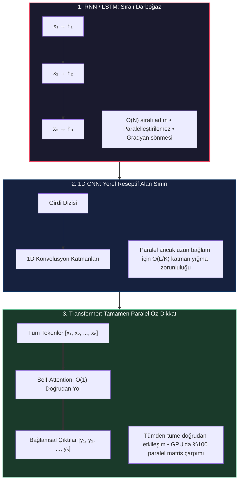

Transformer mimarisi, tekrarlama (recurrence) ve konvolüsyon mekanizmalarını tamamen devreden çıkararak yerine **Self-Attention (Öz-Dikkat)** mekanizmasını koymuştur. Dizi içerisindeki her token, tek bir katmanda diğer tüm tokenlerle doğrudan $O(1)$ yol uzunluğunda etkileşime girer ve tüm hesaplama GPU Tensör Çekirdeklerinde yoğun matris çarpımlarına indirgenir.

---

## 2. Motive Edici Örnek: Karakter Seviyesinde İsim Üretimi

Transformer matematiğini soyut dilbilimsel karmaşaya boğulmadan en temelden inşa etmek için, doğrudan istatistiksel bir isim üretme göreviyle başlıyoruz: İsimlerin karakter dizilimlerini öğrenen ve yeni, fonetik olarak mantıklı isimler türeten otoragresif (öz-bağlanımlı) bir model geliştirmek.

### 2.1 Sözlük (Vocabulary) İnşası ve Tokenizasyon

Her doğal dil işleme boru hattı, ayrık simgeler kümesi olan bir **Sözlük** ($\mathcal{V}$) ile başlar. Karakter seviyesindeki modelimizde $\mathcal{V}$ şunlardan oluşur:
- 26 küçük İngilizce harf: `'a'` ile `'z'` arası.
- Özel bir sınır belirteci karakteri: `'$'`. Bu belirteç çift yönlü bir işleve sahiptir: hem modele üretime başlamasını söyleyen *Dizi Başlangıcı (Start-of-Sequence - SOS)* hem de ismin bittiğini belirten *Dizi Sonu (End-of-Sequence - EOS)* rolünü üstlenir.

<figure style="display:flex; justify-content: center; margin: 25px 0;">
  <div style="text-align: center;">
    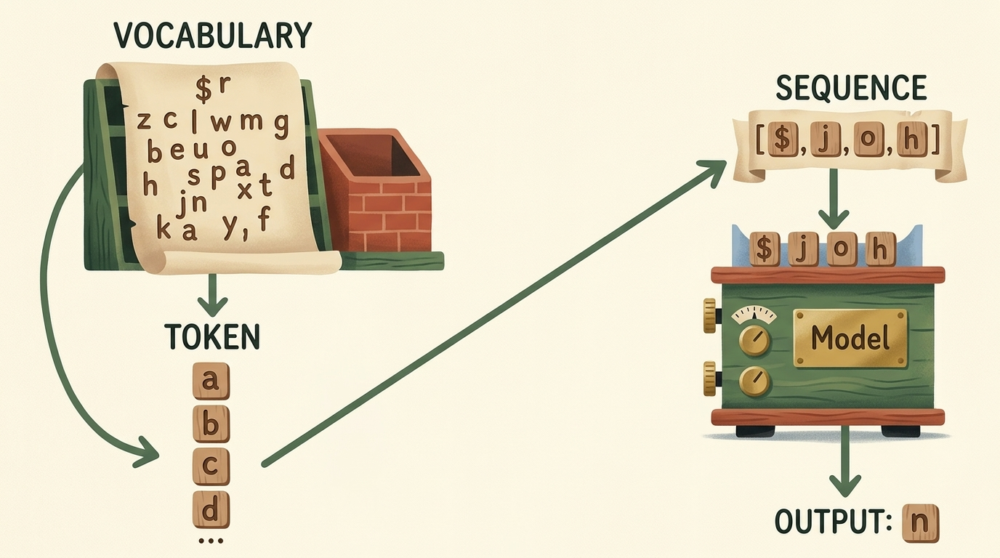
    <figcaption style="margin-top: 0.6em; text-align: center; font-size: 13px; color: #888;"><em>Şekil 9.1: Karakter seviyesinde üretim hattı. Sözlük, ayrık karakterleri tamsayı token ID'lerine dönüştürür; modele sunulan ['$', 'j', 'o', 'h'] dizisi üzerinden model sonraki 'n' tokenini tahmin eder.</em></figcaption>
  </div>
</figure>

Matematiksel olarak tokenizasyon, ayrık karakterler ile sıfır tabanlı ardışık tamsayılar arasında birebir ve örten (bijection) bir eşlemedir:

$$ \text{stoi}: c \in \mathcal{V} \mapsto i \in \{0, 1, \dots, |\mathcal{V}|-1\} $$

$$ \text{itos}: i \in \{0, 1, \dots, |\mathcal{V}|-1\} \mapsto c \in \mathcal{V} $$

Bu temel tokenizasyon mantığını PyTorch ortamında kuralım:

```python
import torch
import torch.nn as nn
import torch.nn.functional as F

# Özel sınır belirteci ve alfabe tanımı
special_char = '$'
alphabet = [chr(i) for i in range(ord('a'), ord('z') + 1)]
vocab = [special_char] + alphabet

# İki yönlü eşleme sözlüklerinin oluşturulması
stoi = {char: idx for idx, char in enumerate(vocab)}
itos = {idx: char for idx, char in enumerate(vocab)}

vocab_size = len(vocab)
print(f"Sözlük Boyutu: {vocab_size} (İndeksler: 0 ila {vocab_size - 1})")
print(f"Örnek kodlama: 'john' -> {[stoi[c] for c in '$john$']}")
```

### 2.2 Otoragresif Nedensel Faktörizasyon

Ayrık tokenlerden oluşan sıralı bir $\mathbf{x} = (x_1, x_2, \dots, x_T)$ dizisinin ortak olasılık dağılımı $P(\mathbf{x})$, olasılık çarpım kuralı ile tam olarak faktörize edilir:

$$ P(x_1, x_2, \dots, x_T) = \prod_{t=1}^T P(x_t \mid x_1, x_2, \dots, x_{t-1}) = \prod_{t=1}^T P(x_t \mid x_{<t}) $$

Üretici modelimizin amacı, her $t$ adımında geçmiş bağlama ($x_{<t}$) koşullanmış $P(x_t \mid x_{<t})$ olasılık dağılımını parametrik bir yapay sinir ağı $P_\theta(x_t \mid x_{<t})$ ile modellemektir.

---

## 3. Öz-Denetimli Öğrenme ve Bigram Modelinin Sınırları

Self-Attention mekanizmasına geçmeden önce, en temel istatistiksel yaklaşım olan **Bigram Dil Modeli** ile sınırları test ediyoruz.

### 3.1 Öz-Denetimli (Self-Supervised) Öğrenme Prensibi

Öz-denetimli öğrenme, harici insan etiketleyicilere olan ihtiyacı ortadan kaldırır. Ham metnin kendisi hem girdi verisini hem de gözetim hedefini üretir:
- Örneğin `"$sada$"` metni verildiğinde, ağa sırasıyla önek alt dizileri girdi olarak verilir ve ağdan bir sonraki karakteri tahmin etmesi istenir.
- Doğru hedef, doğrudan ham metinde o karakterden sonra gelen sıradaki harftir.

### 3.2 Bigram Matris Formülasyonu

Bigram modeli, **birinci derece Markov varsayımı** yapar: mevcut $x_t$ tokeninin koşullu olasılığı, geçmişin tamamını yok sayarak *yalnızca ve yalnızca* kendisinden bir önceki $x_{t-1}$ tokenine bağlıdır:

$$ P(x_t \mid x_1, x_2, \dots, x_{t-1}) \approx P(x_t \mid x_{t-1}) $$

<figure style="display:flex; justify-content: center; margin: 25px 0;">
  <div style="text-align: center;">
    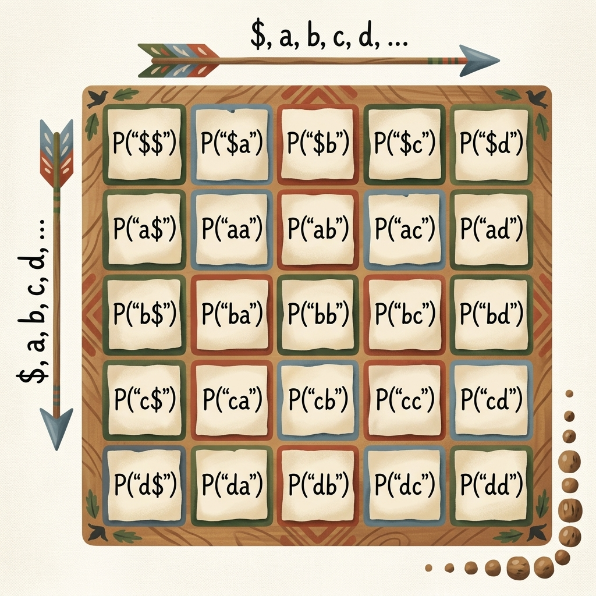
    <figcaption style="margin-top: 0.6em; text-align: center; font-size: 13px; color: #888;"><em>Şekil 9.2: 2D Bigram geçiş olasılık matrisi. Satırlar koşullayıcı $c_i$ karakterini, sütunlar ise sıradaki aday $c_j$ karakterini temsil eder.</em></figcaption>
  </div>
</figure>

Eğitim kümesi üzerindeki frekans sayımları ile en yüksek olabilirlik (maximum likelihood) geçiş olasılıkları hesaplanır:

$$ N(c_i, c_j) = \sum_{k=1}^M \sum_{t=1}^{T_k - 1} \mathbb{I}(x_{k, t} = c_i \land x_{k, t+1} = c_j) $$

$$ P(c_j \mid c_i) = \frac{N(c_i, c_j) + \alpha}{\sum_{k=1}^{|\mathcal{V}|} (N(c_i, c_k) + \alpha)} $$

Burada $\alpha \ge 0$, görülmeyen karakter ikililerine sıfır olasılık atanmasını önleyen Laplace yumuşatma (smoothing) katsayısıdır.

```python
# Örnek isim eğitim kümesi
sample_names = ["sada", "john", "emma", "olivia", "liam", "noah", "ava", "lucas"]

# Birlikte görülme sayım matrisi: [Vocab_Size, Vocab_Size]
bigram_counts = torch.zeros((vocab_size, vocab_size), dtype=torch.int32)

for name in sample_names:
    full_seq = special_char + name + special_char
    for ch1, ch2 in zip(full_seq[:-1], full_seq[1:]):
        idx1, idx2 = stoi[ch1], stoi[ch2]
        bigram_counts[idx1, idx2] += 1

# Sayımları Laplace yumuşatması (alpha=1) ile normalize olasılık matrisine çevirme
alpha = 1.0
bigram_probs = (bigram_counts.float() + alpha)
bigram_probs /= bigram_probs.sum(dim=1, keepdim=True)

print(f"P('$' sonrasında 'a'): {bigram_probs[stoi['$'], stoi['a']]:.4f}")
print(f"P('j' sonrasında 'o'): {bigram_probs[stoi['j'], stoi['o']]:.4f}")
```

### 3.3 N-Gram Modellerinin Yapısal Çöküşü

1. **Bağlam Belleği Yoksunluğu:** Bigram modeli 4. karaktere ulaştığında ismin `'j'` ve `'o'` ile başladığını tamamen unutmuştur. İsmin 5 harf önceki köküne göre son harfin `'a'` ile bitip bitmeyeceğini bilemez.
2. **Kombinatoryal Durum Uzayı Patlaması:** Markov bağlamını $N$ karaktere genişletmek tablo boyutunu katlanarak büyütür: $|\mathcal{V}|^N$. $|\mathcal{V}| = 27$ ve $N = 8$ için parametre sayısı $27^8 \approx 2.82 \times 10^{11}$ olur; tablo yüzlerce gigabayt bellek tüketirken seyrekliğe (sparsity) teslim olur.

---

## 4. Eğitim Verisi Üretimi: Kayan Önekler ve Hedefler

Yapay sinir ağlarını geriye yayılımla eğitebilmek için ham dizileri girdi önekleri ve hedef etiketleri çiftlerine ayrıştırırız.

<figure style="display:flex; justify-content: center; margin: 25px 0;">
  <div style="text-align: center;">
    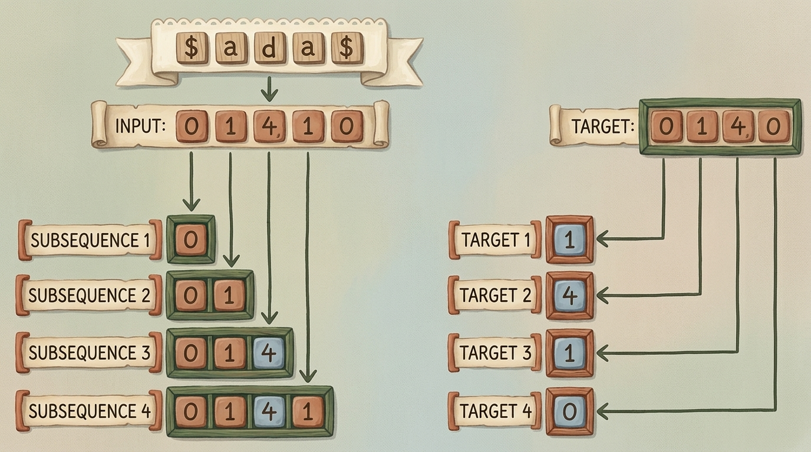
    <figcaption style="margin-top: 0.6em; text-align: center; font-size: 13px; color: #888;"><em>Şekil 9.3: "$sada$" ismi için otoragresif önek genişlemesi. Her bir alt dizi (subsequence), kendisini takip eden hedef token ile etiketlenir.</em></figcaption>
  </div>
</figure>

`[0, 1, 4, 1, 0]` olarak tokenleştirilmiş `"$sada$"` dizisi için oluşturulan alt diziler:

| Adım | Girdi Alt Dizisi ($\mathbf{x}$) | Hedef Token ($y$) | Tahmin Görevi |
| :---: | :--- | :---: | :--- |
| **1** | `[0]` (`'$'`) | `1` (`'a'`) | Başlangıç belirtecinden sonraki ilk harfi tahmin et |
| **2** | `[0, 1]` (`'$a'`) | `4` (`'d'`) | İlk iki karakterden sonra 3. karakteri tahmin et |
| **3** | `[0, 1, 4]` (`'$ad'`) | `1` (`'a'`) | İlk üç karakterden sonra 4. karakteri tahmin et |
| **4** | `[0, 1, 4, 1]` (`'$ada'`) | `0` (`'$'`) | Tüm önekten sonra bitiş belirtecini tahmin et |

Bu mantığı PyTorch `Dataset` sınıfı olarak kodlayalım:

```python
from torch.utils.data import Dataset, DataLoader

class CharAutoregressiveDataset(Dataset):
    """
    Ham metin dizilerinden otoragresif girdi önekleri ve
    sıradaki token hedefleri üreten veri seti sınıfı.
    """
    def __init__(self, names, stoi, block_size):
        self.block_size = block_size
        self.stoi = stoi
        self.inputs = []
        self.targets = []
        
        for name in names:
            encoded = [stoi[special_char]] + [stoi[c] for c in name] + [stoi[special_char]]
            for i in range(1, len(encoded)):
                subseq = encoded[:i]
                target = encoded[i]
                
                # Sabit bağlam penceresine (block_size) kırpma veya dolgulama
                if len(subseq) > block_size:
                    subseq = subseq[-block_size:]
                else:
                    subseq = [stoi[special_char]] * (block_size - len(subseq)) + subseq
                    
                self.inputs.append(torch.tensor(subseq, dtype=torch.long))
                self.targets.append(torch.tensor(target, dtype=torch.long))
                
        self.inputs = torch.stack(self.inputs)
        self.targets = torch.stack(self.targets)
        
    def __len__(self):
        return len(self.inputs)
        
    def __getitem__(self, idx):
        return self.inputs[idx], self.targets[idx]

# 6 karakterlik bağlam penceresi ile veri yükleyicisini başlatma
dataset = CharAutoregressiveDataset(sample_names, stoi, block_size=6)
dataloader = DataLoader(dataset, batch_size=4, shuffle=True)

sample_x, sample_y = next(iter(dataloader))
print(f"Batch X boyutu: {sample_x.shape} (Batch, Block_Size)")
print(f"Batch Y boyutu: {sample_y.shape} (Batch)")
```

---

## 5. Gömme Katmanları ve Lineer Düzleştirmenin Sınırları

Ayrık tamsayı tokenleri, türevlenebilir sürekli bir yapay sinir ağına nasıl dahil edilir?

### 5.1 One-Hot Kodlama vs. Sürekli Yoğun Gömmeler (Dense Embeddings)

En naif sürekli temsil **One-Hot Kodlama**dır: $i$ tokeni, yalnızca $i$. indeksi 1 olan $\mathbf{e}_i \in \{0, 1\}^{|\mathcal{V}|}$ vektörüyle temsil edilir.
Fakat One-Hot temsiller geometrik açıdan kusurludur:
- **Ortogonallik:** Her $i \neq j$ için $\mathbf{e}_i^T \mathbf{e}_j = 0$. `'a'` ile `'e'` (her ikisi de sesli harf) arasındaki Öklid mesafesi, `'a'` ile `'z'` arasındaki mesafe ile tamamen aynıdır. Semantik veya fonetik yakınlık bilgisi taşımaz.
- **Boyutsal Savurganlık:** Modern LLM'lerdeki 50.000+ boyutlu sözlüklerde seyrek one-hot vektörleri devasa GPU bellek bant genişliği israfına yol açar.

### 5.2 Embedding Arama Tablosu

**Gömme Katmanı (Embedding Layer)**, her tokeni $d_{\text{model}}$ boyutlu yoğun ve öğrenilebilir bir vektör olarak saklayan $W_E \in \mathbb{R}^{|\mathcal{V}| \times d_{\text{model}}}$ matrisidir.

<figure style="display:flex; justify-content: center; margin: 25px 0;">
  <div style="text-align: center;">
    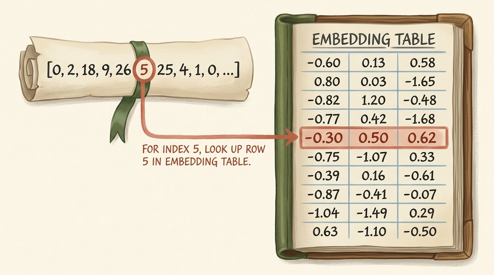
    <figcaption style="margin-top: 0.6em; text-align: center; font-size: 13px; color: #888;"><em>Şekil 9.4: Embedding tablosu arama işlemi. 5 numaralı tamsayı indeksi, $W_E$ matrisinin 5. satırındaki $[-0.30, 0.50, 0.62]$ sürekli temsil vektörünü $O(1)$ sürede çeker.</em></figcaption>
  </div>
</figure>

PyTorch'ta `nn.Embedding(num_embeddings, embedding_dim)` işlemi matris çarpımı yapmaz; doğrudan bellek adresinden ilgili satırı kopyalar:

```python
# 3 boyutlu sürekli gömme tablosu
embedding_dim = 3
emb_table = nn.Embedding(num_embeddings=vocab_size, embedding_dim=embedding_dim)

# [0, 5, 2] indeksli tokenlerin vektörlerini çekme
tokens_to_lookup = torch.tensor([0, 5, 2], dtype=torch.long)
dense_vectors = emb_table(tokens_to_lookup)

print(f"Çekilen vektörlerin boyutu: {dense_vectors.shape}")
print(f"İndeks 5'in vektörü:\n{dense_vectors[1].detach()}")
```

### 5.3 Naif Yaklaşım: Embedding + Flattening ile Lineer Katmanlar

Diziyi standart bir ileri beslemeli ağa sokmak için her tokeni gömüp, oluşan $T \times d_{\text{model}}$ boyutlu tensörü $T \cdot d_{\text{model}}$ boyutunda tek bir düz vektöre dönüştürerek lineer katmanlara soktuğumuzu varsayalım.

<figure style="display:flex; justify-content: center; margin: 25px 0;">
  <div style="text-align: center;">
    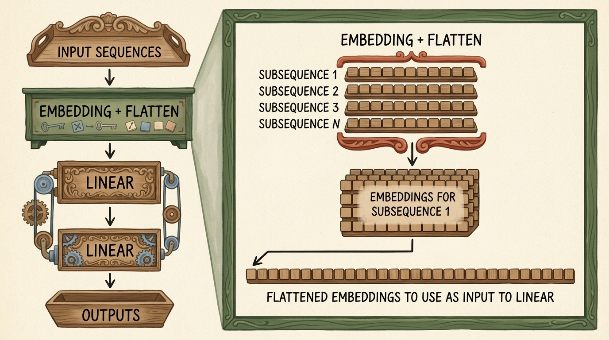
    <figcaption style="margin-top: 0.6em; text-align: center; font-size: 13px; color: #888;"><em>Şekil 9.5: Naif dizi işleme mimarisi. Gömme tensörü düzleştirilip lineer katmana verilir. Bu yapı zamansal parametre paylaşımını engeller ve sabit uzunluk dayatır.</em></figcaption>
  </div>
</figure>

Bu yaklaşım neden başarısızlığa mahkumdur?
1. **Katı Uzunluk Kısıtı:** İlk lineer katmanın ağırlık boyutu $W_1 \in \mathbb{R}^{d_{\text{hidden}} \times (T \cdot d_{\text{model}})}$ olur. Dizi uzunluğu $T+1$ olduğunda matris çarpımı boyut uyumsuzluğundan çöker.
2. **Konum Değişmezliği Eksikliği:** $0..2$ konumlarında görülen bir harf örüntüsü, $3..5$ konumlarında görüldüğünde tamamen farklı ağırlıklarla çarpılır; model başlarda öğrendiği kuralı sona genelleyemez.
3. **Parametre Patlaması:** $T$ bağlam penceresi büyüdükçe parametre sayısı doğrusal değil, katman boyutlarıyla çarpılarak hızla milyonlara ulaşır.

### 5.4 Öğrenilmiş Gömmelerin 3D Geometrik Uzayı

Geriye yayılım (backpropagation) ile eğitilen gömme ağırlıkları, karakterlerin istatistiksel ve fonetik rollerine göre çok boyutlu uzayda geometrik olarak kümelenir.

<figure style="display:flex; justify-content: center; margin: 25px 0;">
  <div style="text-align: center;">
    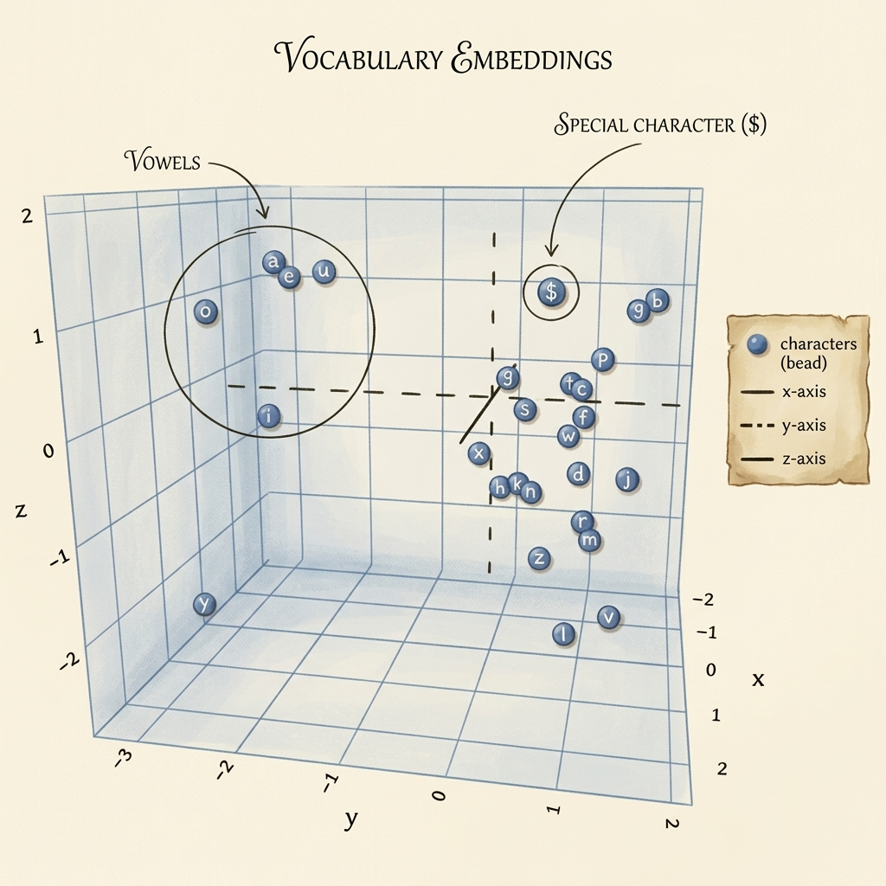
    <figcaption style="margin-top: 0.6em; text-align: center; font-size: 13px; color: #888;"><em>Şekil 9.6: 3D latent temsil uzayı. Sesli harfler (a, e, i, o, u) bir arada kümelenir, ünsüzler fonetik yapılarına göre dağılır ve özel sınır belirteci ($) dik bir alt uzaya ayrışır.</em></figcaption>
  </div>
</figure>

> **Önemli Çıkarım:** Gömme uzayında iki vektörün dot-product benzerliği, bağlamsal ikame edilebilirliği yansıtır: Benzer harf öneklerinin ardından gelen karakterler gradyan inişi tarafından birbirine yaklaştırılır.

---

## 6. Attention Mekanizmasının Doğuşu ve Matematiği

Düzleştirme ve tekrarlama darboğazlarını aşmak için Transformer **Self-Attention (Öz-Dikkat)** mekanizmasını sunar. Tokenler sabit bağlantılar yerine, *içerik benzerliğine* dayalı olarak diğer tokenlerden dinamik bilgi toplar.

### 6.1 Analojik Yapı: Query (Sorgu), Key (Anahtar) ve Value (Değer)

Attention, türevlenebilir bir veritabanı sorgulama işlemi gibi işler:
- **Query ($\mathbf{q}_i$):** Token $i$'nin ne aradığı (örn: *"Ben 3. indisteki bir sessiz harfim; önceki sesli harfleri arıyorum"*).
- **Key ($\mathbf{k}_j$):** Token $j$'nin ne sunduğu (örn: *"Ben 1. indisteki 'a' harfiyim, bir sesli harfim"*).
- **Value ($\mathbf{v}_j$):** Eşleşme gerçekleştiğinde $j$ tokeninin ileteceği gerçek anlamsal bilgi.

Girdi temsil matrisi $X \in \mathbb{R}^{T \times d_{\text{in}}}$ verildiğinde, üç öğrenilebilir izdüşüm matrisi ($W_Q, W_K \in \mathbb{R}^{d_{\text{in}} \times d_k}$ ve $W_V \in \mathbb{R}^{d_{\text{in}} \times d_v}$) ile $Q, K, V$ tensörleri elde edilir:

$$ Q = X W_Q, \quad K = X W_K, \quad V = X W_V $$

### 6.2 Dot-Product Benzerliği ve Değerlerin Ağırlıklı Toplamı

Sorgu tokeni $i$ ile Anahtar tokeni $j$ arasındaki uyum puanı dot-product ile ölçülür:

$$ \text{Score}_{i, j} = \mathbf{q}_i \cdot \mathbf{k}_j^T $$

<figure style="display:flex; justify-content: center; margin: 25px 0;">
  <div style="text-align: center;">
    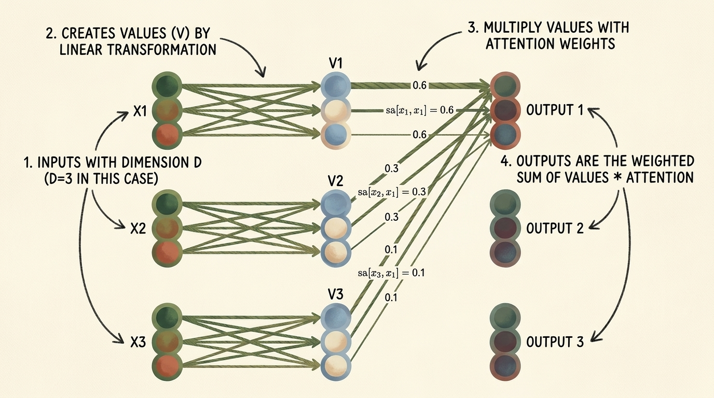
    <figcaption style="margin-top: 0.6em; text-align: center; font-size: 13px; color: #888;"><em>Şekil 9.7: Değer dönüşümü ve ağırlıklı toplam. Girdiler $v_i$ değerlerini üretir; dikkat ağırlıkları ($0.6, 0.3, 0.1$) değer vektörlerini ölçeklendirerek Çıktı 1'i inşa eder.</em></figcaption>
  </div>
</figure>

Normalize edilen dikkat ağırlıkları ($\alpha_{i, j}$), değer vektörlerinin dışbükey kombinasyonunu (convex combination) alarak çıktıyı üretir:

$$ \mathbf{y}\_i = \sum\_{j=1}^T \alpha\_{i, j} \mathbf{v}\_j $$

### 6.3 Neden $\sqrt{d_k}$ ile Ölçeklenir? (Scaled Dot-Product)

$\mathbf{q}_i$ ve $\mathbf{k}_j$ bileşenlerinin sıfır ortalamalı ve birim varyanslı bağımsız rastgele değişkenler olduğunu varsayalım:

$$ \mathbb{E}[q_{i, m}] = 0, \quad \text{Var}(q_{i, m}) = 1, \quad \mathbb{E}[k_{j, m}] = 0, \quad \text{Var}(k_{j, m}) = 1 $$

Dot-product, $d_k$ adet bağımsız rastgele değişkenin toplamıdır:

$$ S_{i, j} = \sum_{m=1}^{d_k} q_{i, m} k_{j, m} $$

$$ \mathbb{E}[S_{i, j}] = 0, \quad \text{Var}(S_{i, j}) = \sum_{m=1}^{d_k} 1 \cdot 1 = d_k $$

$d_k$ büyüdükçe (örn. üretim modellerinde $d_k = 64$ veya $128$), puanların varyansı $64$ veya $128$ olur ve dot-product değerleri $\pm 20$ gibi uç değerlere fırlar.
Bu denli büyük değerler $\text{softmax}(z)_i = \frac{e^{z_i}}{\sum_k e^{z_k}}$ fonksiyonuna girdiğinde fonksiyon doygunluğa (saturation) ulaşır:
- En yüksek lojit $1.0$'a yakın bir olasılık alırken diğerleri $0.0$'a çöker.
- Bu doygun bölgede Softmax'ın türevi sıfıra yaklaşır: $\frac{\partial \text{softmax}(z)_i}{\partial z_j} \to 0$. Gradyan akışı tamamen durur.

$\sqrt{d_k}$ değerine bölmek, varyansı yeniden $1.0$'a indirger:

$$ \text{Var}\left(\frac{S_{i, j}}{\sqrt{d_k}}\right) = \frac{1}{d_k} \text{Var}(S_{i, j}) = \frac{d_k}{d_k} = 1 $$

### 6.4 Nedensellik Maskesi (Causal Masking)

Üretici dil modellerinde $i$. token, kendisinden sonra gelen $j > i$ tokenlerine **asla** dikkat edememelidir. Eğer 2. token 3. tokeni görebilirse, görev basit bir kopyalama işlemine dönüşür ve model henüz üretilmemiş gelecek tokenlerin bulunmadığı test anında çöker.

<figure style="display:flex; justify-content: center; margin: 25px 0;">
  <div style="text-align: center;">
    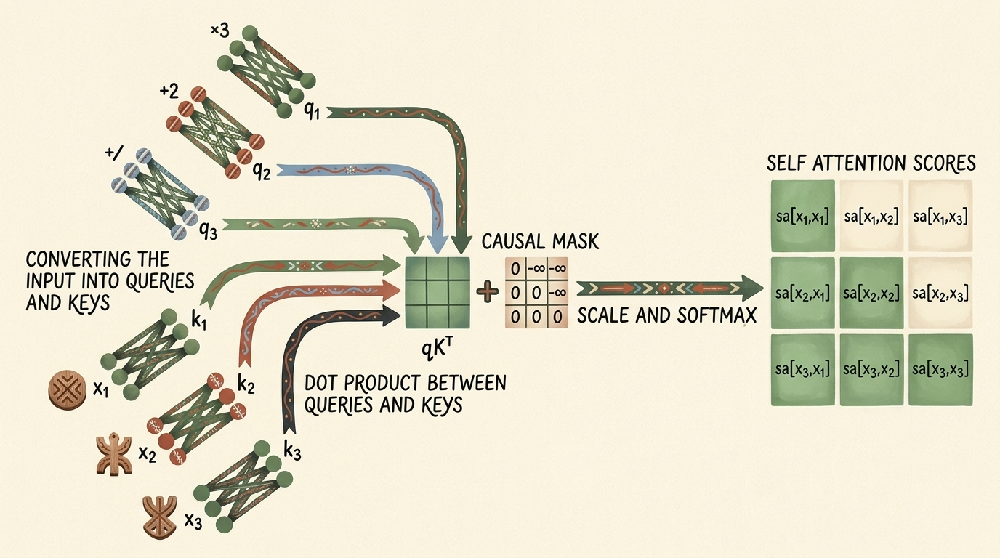
    <figcaption style="margin-top: 0.6em; text-align: center; font-size: 13px; color: #888;"><em>Şekil 9.8: Causal Attention boru hattı. $Q$ ve $K$ çarpımı, üst üçgen $-\infty$ maskesi ile toplanır; Softmax sonrasında gelecek pozisyonlar kesin olarak sıfırlanır.</em></figcaption>
  </div>
</figure>

Nedensellik, ölçeklenmiş dot-product matrisine üst üçgen bir **Nedensel Maske** ($M \in \{0, -\infty\}^{T \times T}$) eklenerek sağlanır:

$$ M_{i, j} = \begin{cases} 0 & \text{eğer } j \le i \\ -\infty & \text{eğer } j > i \end{cases} $$

$$ \text{Attention}(Q, K, V) = \text{softmax}\left(\frac{QK^T}{\sqrt{d_k}} + M\right) V $$

$e^{-\infty} = 0$ olduğundan, $j > i$ olan tüm pozisyonlar tam olarak $0.0$ dikkat ağırlığı alır.

<figure style="display:flex; justify-content: center; margin: 25px 0;">
  <div style="text-align: center;">
    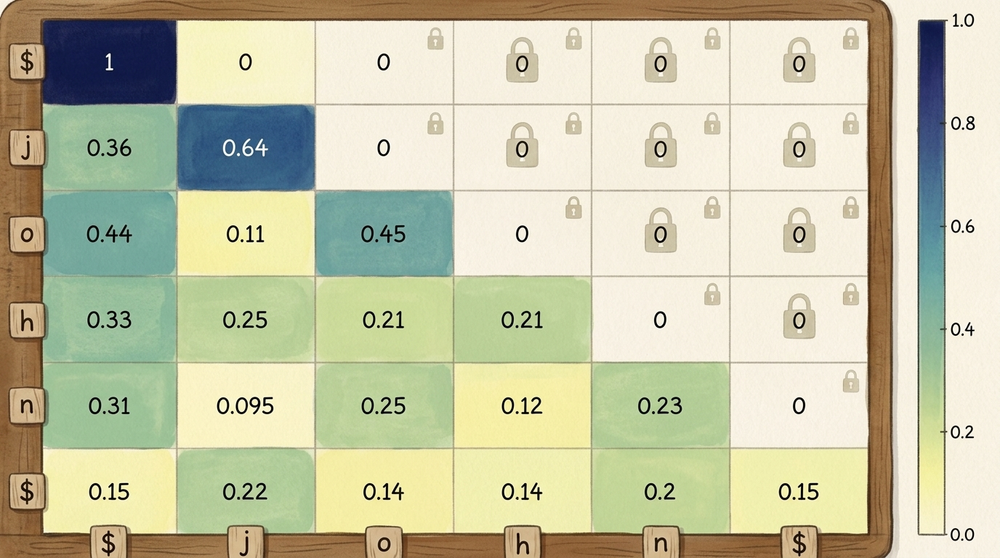
    <figcaption style="margin-top: 0.6em; text-align: center; font-size: 13px; color: #888;"><em>Şekil 9.9: ['$', 'j', 'o', 'h', 'n', '$'] dizisi için nedensel dikkat ısı haritası. Üst üçgen kilitlidir; her satır yalnızca solundaki ve kendi hizasındaki geçmiş tokenlerin ağırlık toplamını (1.0) oluşturur.</em></figcaption>
  </div>
</figure>

---

## 7. GPT-Tarzı Decoder Mimarisi ve Katman Normalizasyonu

Tüm bu bileşenleri, GPT-4 ve LLaMA modellerinin temelini oluşturan **Decoder Bloğu** içerisinde birleştiriyoruz.

<figure style="display:flex; justify-content: center; margin: 25px 0;">
  <div style="text-align: center;">
    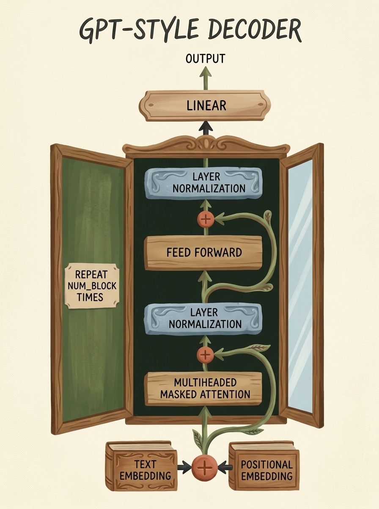
    <figcaption style="margin-top: 0.6em; text-align: center; font-size: 13px; color: #888;"><em>Şekil 9.10: GPT-tarzı Transformer Decoder Bloğu. Metin ve konum gömmeleri; Maskeli Çok Başlı Dikkat, Layer Normalization, Artık Bağlantılar ve İleri Beslemeli Katmanlardan geçer.</em></figcaption>
  </div>
</figure>

### 7.1 Çok Başlı Dikkat (Multi-Head Attention - MHA)

Tek bir dikkat başlığı tüm anlamsal boyutların ortalamasını alır. Oysa bir token hem dilbilgisel özne-yüklem ilişkisini hem de anlamsal göndermeleri eşzamanlı izlemelidir.
**Multi-Head Attention**, sorgu, anahtar ve değerleri $h$ farklı alt uzaya ($d_k = d_{\text{model}} / h$) bölerek paralel hesaplar:

$$ \text{MultiHead}(Q, K, V) = \text{Concat}(\text{head}_1, \dots, \text{head}_h) W_O $$

$$ \text{head}_i = \text{Attention}(Q W_i^Q, K W_i^K, V W_i^V) $$

### 7.2 Derinlemesine İnceleme: Batch Normalization vs. Layer Normalization

Bilgisayarlı görüde (Bölüm 8) yoğun olarak kullandığımız **Batch Normalization**, metin ve dizi modellerinde çöker ve yerini **Layer Normalization**'a bırakır ([Ba et al., 2016](https://arxiv.org/abs/1607.06450)).

<figure style="display:flex; justify-content: center; margin: 25px 0;">
  <div style="text-align: center;">
    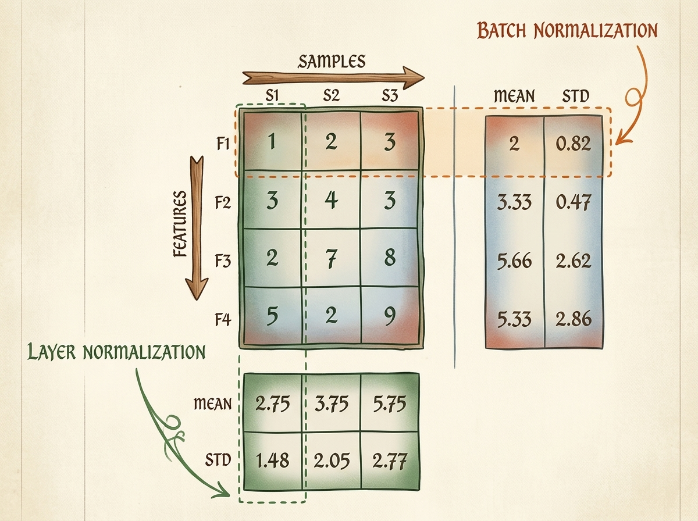
    <figcaption style="margin-top: 0.6em; text-align: center; font-size: 13px; color: #888;"><em>Şekil 9.11: Normalizasyon eksenleri. BatchNorm her özelliği yığın örnekleri (yatay) boyunca normalize ederken; LayerNorm her örneğin kendi özniteliklerini (dikey) normalize eder.</em></figcaption>
  </div>
</figure>

Matematiksel formülasyon farkları:

#### Batch Normalization (Yığın Boyutu $B$ Boyunca):
Her $j \in \{1, \dots, D\}$ özniteliği için yığındaki tüm örnekler üzerinden istatistik çıkarılır:

$$ \mu_j = \frac{1}{B} \sum_{i=1}^B x_{i, j}, \quad \sigma_j^2 = \frac{1}{B} \sum_{i=1}^B (x_{i, j} - \mu_j)^2 $$

#### Layer Normalization (Öznitelik Boyutu $D$ Boyunca):
Her $i \in \{1, \dots, B\}$ örneği için kendi iç özellikleri üzerinden istatistik çıkarılır:

$$ \mu_i = \frac{1}{D} \sum_{j=1}^D x_{i, j}, \quad \sigma_i^2 = \frac{1}{D} \sum_{j=1}^D (x_{i, j} - \mu_i)^2 $$

| Mimari Özellik | Batch Normalization (`BatchNorm1d/2d`) | Layer Normalization (`LayerNorm`) |
| :--- | :--- | :--- |
| **Normalizasyon Ekseni** | Yığındaki örnekler ($B$) boyunca kanal bazında | Her tokenin kendi öznitelik boyutları ($D$) boyunca |
| **Yığın Boyutu Duyarlılığı** | Küçük yığınlarda ($B < 8$) istatistik sapması nedeniyle çöker | **Yığın boyutundan tamamen bağımsızdır** ($B=1$ geçerlidir) |
| **Değişken Dizi Uzunluğu** | Dolgulu dizilerde sahte istatistikler üretir | **Her tokeni diğerlerinden bağımsız normalize eder** |
| **Çıkarım (Inference) Davranışı** | Eğitimde hareketli ortalama/varyans saklamayı gerektirir | **Eğitim ve test anında tamamen aynı deterministik hesaplama** |

### 7.3 Eksiksiz PyTorch GPT Dil Modeli İmplementasyonu

Tüm modülleri içeren üretim kalitesinde PyTorch kodu:

```python
class CausalSelfAttention(nn.Module):
    """
    Nedensel maskelemeye sahip çok başlı öz-dikkat (Multi-Head Attention) modülü.
    """
    def __init__(self, d_model, n_heads, block_size, dropout=0.1):
        super().__init__()
        assert d_model % n_heads == 0, "d_model, n_heads değerine tam bölünmelidir"
        self.d_model = d_model
        self.n_heads = n_heads
        self.d_k = d_model // n_heads
        
        # Q, K, V izdüşümlerini tek bir lineer katmanda birleştirme
        self.c_attn = nn.Linear(d_model, 3 * d_model)
        self.c_proj = nn.Linear(d_model, d_model)
        
        self.attn_dropout = nn.Dropout(dropout)
        self.resid_dropout = nn.Dropout(dropout)
        
        # Nedensellik maskesini kalıcı tensör (buffer) olarak kaydetme
        mask = torch.tril(torch.ones(block_size, block_size)).view(1, 1, block_size, block_size)
        self.register_buffer("causal_mask", mask, persistent=False)
        
    def forward(self, x):
        B, T, C = x.shape  # Batch, Zaman (Dizi Uzunluğu), Kanallar (d_model)
        
        q, k, v = self.c_attn(x).split(self.d_model, dim=2)
        q = q.view(B, T, self.n_heads, self.d_k).transpose(1, 2)
        k = k.view(B, T, self.n_heads, self.d_k).transpose(1, 2)
        v = v.view(B, T, self.n_heads, self.d_k).transpose(1, 2)
        
        # Ölçeklenmiş dot-product: (B, n_heads, T, T)
        att = (q @ k.transpose(-2, -1)) * (1.0 / (self.d_k ** 0.5))
        att = att.masked_fill(self.causal_mask[:, :, :T, :T] == 0, float('-inf'))
        att = F.softmax(att, dim=-1)
        att = self.attn_dropout(att)
        
        # Değer vektörlerinin ağırlıklı toplamı
        y = att @ v
        y = y.transpose(1, 2).contiguous().view(B, T, C)
        
        return self.resid_dropout(self.c_proj(y))


class FeedForward(nn.Module):
    """
    4x genişletme faktörüne ve GELU aktivasyonuna sahip ileri beslemeli MLP.
    """
    def __init__(self, d_model, dropout=0.1):
        super().__init__()
        self.net = nn.Sequential(
            nn.Linear(d_model, 4 * d_model),
            nn.GELU(),
            nn.Linear(4 * d_model, d_model),
            nn.Dropout(dropout)
        )
        
    def forward(self, x):
        return self.net(x)


class TransformerBlock(nn.Module):
    """
    Pre-LayerNorm yapısına ve artık bağlantılara sahip Transformer bloğu.
    """
    def __init__(self, d_model, n_heads, block_size, dropout=0.1):
        super().__init__()
        self.ln1 = nn.LayerNorm(d_model)
        self.attn = CausalSelfAttention(d_model, n_heads, block_size, dropout)
        self.ln2 = nn.LayerNorm(d_model)
        self.mlp = FeedForward(d_model, dropout)
        
    def forward(self, x):
        # Pre-LN: Artık bağlantı, normalize edilmiş alt katmanları sarar
        x = x + self.attn(self.ln1(x))
        x = x + self.mlp(self.ln2(x))
        return x


class GPTLanguageModel(nn.Module):
    """
    Karakter seviyesinde eksiksiz GPT mimarili dil modeli.
    """
    def __init__(self, vocab_size, d_model=64, n_heads=4, n_layers=4, block_size=16, dropout=0.1):
        super().__init__()
        self.block_size = block_size
        self.token_embedding = nn.Embedding(vocab_size, d_model)
        self.pos_embedding = nn.Embedding(block_size, d_model)
        
        self.blocks = nn.Sequential(*[
            TransformerBlock(d_model, n_heads, block_size, dropout) for _ in range(n_layers)
        ])
        self.ln_f = nn.LayerNorm(d_model)
        self.lm_head = nn.Linear(d_model, vocab_size, bias=False)
        
        # Ağırlık bağlama (Weight Tying): Girdi ve çıktı gömmelerini paylaşma
        self.token_embedding.weight = self.lm_head.weight
        
    def forward(self, idx, targets=None):
        B, T = idx.shape
        pos = torch.arange(0, T, dtype=torch.long, device=idx.device)
        tok_emb = self.token_embedding(idx)
        pos_emb = self.pos_embedding(pos)
        x = tok_emb + pos_emb
        
        x = self.blocks(x)
        x = self.ln_f(x)
        logits = self.lm_head(x)
        
        loss = None
        if targets is not None:
            if targets.dim() == 1:
                loss = F.cross_entropy(logits[:, -1, :], targets)
            else:
                loss = F.cross_entropy(logits.view(-1, logits.size(-1)), targets.view(-1))
            
        return logits, loss
```

---

## 8. Alternatif Transformer Mimarileri: Encoder ve Çapraz Dikkat

Transformer tasarım uzayı üç ana mimari aileye ayrılır:

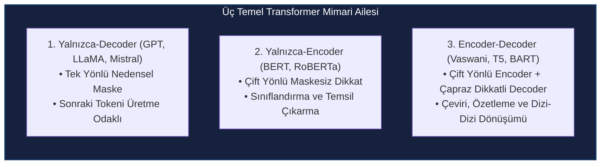

### 8.1 Transformer Encoder (BERT-Tarzı)

Cümle sınıflandırma, duygu analizi veya anlamsal arama görevlerinde nedensel maske gereksizdir. Bir **Encoder**, çift yönlü maskesiz çok başlı dikkat kullanır: $i$ tokeni hem önceki ($j < i$) hem de sonraki ($j > i$) tokenleri aynı anda görür.

<figure style="display:flex; justify-content: center; margin: 25px 0;">
  <div style="text-align: center;">
    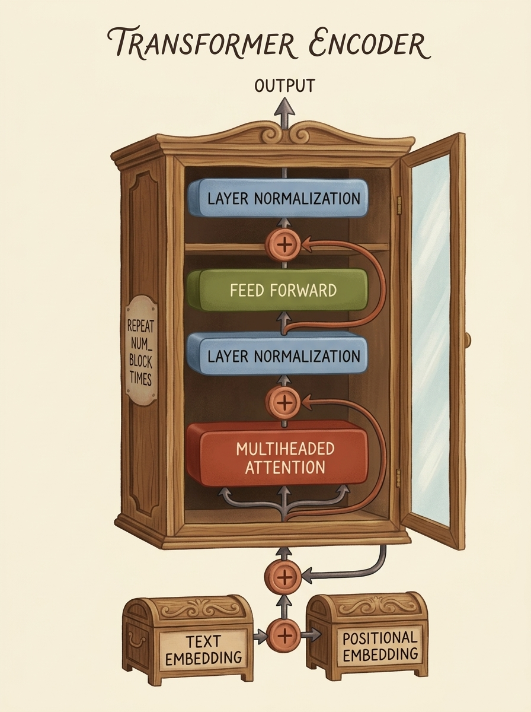
    <figcaption style="margin-top: 0.6em; text-align: center; font-size: 13px; color: #888;"><em>Şekil 9.12: Transformer Encoder bloğu. Multi-Head Attention katmanında nedensel maske bulunmaz; tüm dizi çift yönlü bağlamla zenginleştirilir.</em></figcaption>
  </div>
</figure>

### 8.2 Tam Encoder-Decoder Mimarisi ve Çapraz Dikkat (Cross-Attention)

Dilden dile çeviri (İngilizce $\to$ Türkçe) veya metin özetlemede, orijinal [Vaswani et al. (2017)](https://arxiv.org/abs/1706.03762) mimarisi çift yönlü bir Encoder ile nedensel maskeli bir Decoder'ı **Çapraz Dikkat (Cross-Attention)** üzerinden birbirine bağlar.

<figure style="display:flex; justify-content: center; margin: 25px 0;">
  <div style="text-align: center;">
    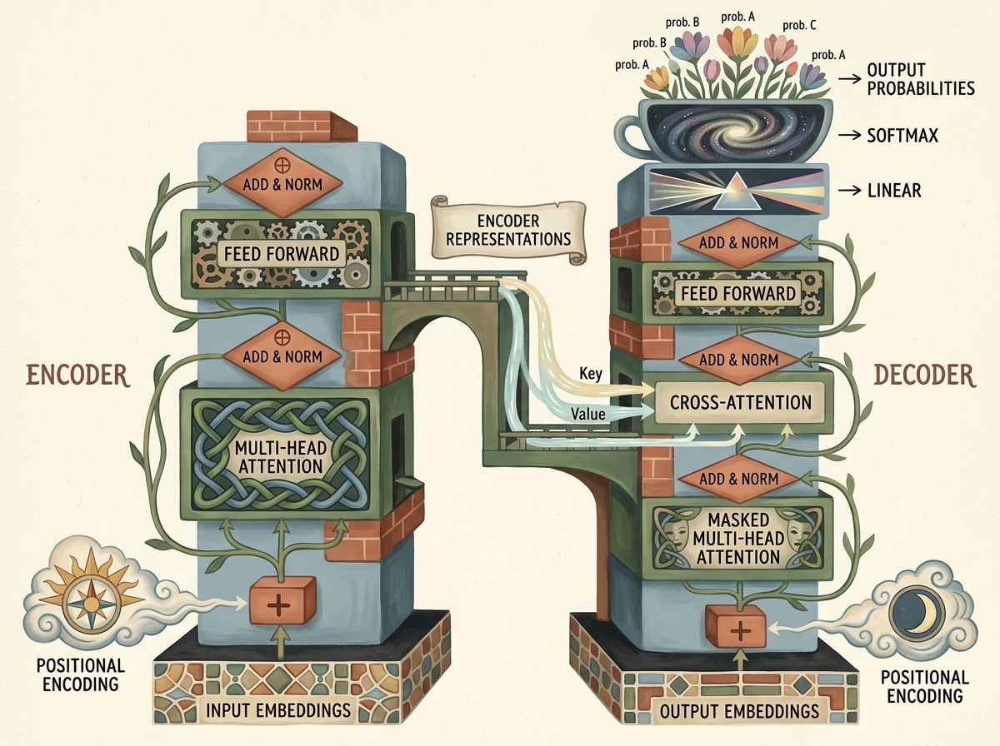
    <figcaption style="margin-top: 0.6em; text-align: center; font-size: 13px; color: #888;"><em>Şekil 9.13: Tam Encoder-Decoder mimarisi. Kaynak dizi encoder tarafından çift yönlü işlenir; decoder üretilen tokenler üzerinde causal self-attention yaptıktan sonra encoder temsillerini Cross-Attention ile sorgular.</em></figcaption>
  </div>
</figure>

**Çapraz Dikkat (Cross-Attention)** işleminde:
- **Sorgular ($Q$)**, Decoder'ın önceki katmanından gelir: $Q = X_{\text{dec}} W_Q$.
- **Anahtarlar ($K$)** ve **Değerler ($V$)**, Encoder'ın ürettiği nihai temsillerden gelir: $K = H_{\text{enc}} W_K, \quad V = H_{\text{enc}} W_V$.
- Decoder, hedef cümledeki her kelimeyi üretirken kaynak cümlenin ilgili bölümlerine dinamik olarak odaklanır.

---

## 9. Tokenizasyon Stratejileri ve Metin Üretim Algoritmaları

### 9.1 Alt-Kelime Tokenizasyonu: BPE ve WordPiece

Karakter seviyesinde modelleme uzun metinlerde $O(T^2)$ bellek maliyeti nedeniyle ölçeklenemez. 500 kelimelik bir paragraf 3000 karaktere denk gelir.
Modern modeller **Alt-Kelime (Subword) Tokenizasyonu** kullanır:
- **Byte Pair Encoding (BPE):** Metinde en sık yan yana gelen karakter veya bayt çiftlerini yinelemeli olarak birleştirerek 32.000 ila 128.000 arası bir kelime haznesi oluşturur.
- Yaygın kelimeler tek bir token olurken (`"learning"`), nadir kelimeler mantıklı kök ve eklere bölünür (`["trans", "lat", "ability"]`).

### 9.2 Otoragresif Metin Üretim Stratejileri

Çıkarım sırasında modelden sonraki token lojitleri $\mathbf{z}_{t+1}$ alındığında yeni token nasıl seçilir?

```python
@torch.inference_mode()
def generate(model, prompt, max_new_tokens=20, temperature=1.0, top_k=None):
    """
    Sıcaklık (temperature) ölçeklemesi ve Top-K budaması içeren üretim döngüsü.
    """
    model.eval()
    idx = prompt
    
    for _ in range(max_new_tokens):
        idx_cond = idx[:, -model.block_size:] if idx.size(1) > model.block_size else idx
        logits, _ = model(idx_cond)
        logits = logits[:, -1, :] / max(temperature, 1e-5)
        
        if top_k is not None:
            v, _ = torch.topk(logits, min(top_k, logits.size(-1)))
            logits[logits < v[:, [-1]]] = -float('Inf')
            
        probs = F.softmax(logits, dim=-1)
        next_idx = torch.multinomial(probs, num_samples=1)
        idx = torch.cat((idx, next_idx), dim=1)
        
        if next_idx.item() == stoi[special_char]:
            break
            
    return idx
```

1. **Greedy Search ($T \to 0$):** Daima en yüksek olasılıklı tokeni seçer ($x_{t+1} = \arg\max_i z_i$). Deterministiktir ancak tekrara düşebilir.
2. **Sıcaklık (Temperature $T > 0$):** Olasılık dağılımının entropisini $P(x_i) = \frac{e^{z_i / T}}{\sum_j e^{z_j / T}}$ formülüyle ayarlar. $T < 1.0$ modeli daha kendinden emin ve tutucu yaparken; $T > 1.0$ çeşitlilik katar.
3. **Top-K Budama:** Olasılık sıralamasındaki ilk $K$ token dışındaki tüm adayları $-\infty$ yaparak eler; absürt uç tokenlerin seçilmesini engeller.
4. **Top-P (Nucleus) Örnekleme:** Kümülatif olasılığı belirli bir eşiğe (örn. $p = 0.90$) ulaşana kadar tokenleri toplar; aday havuzunu modelin güvenine göre dinamik olarak genişletip daraltır.

---

## 10. Bilgisayarlı Görüde Transformer: Vision Transformer (ViT)

2020 yılında Dosovitskiy ve ekibi, *"An Image is Worth 16x16 Words: Transformers for Image Recognition at Scale"* makalesi ile saf Transformer yapılarının bilgisayarlı görüde CNN'leri geride bırakabileceğini kanıtladı.

### 10.1 Görseli Yamalara (Patches) Bölerek Tokenleştirme

2D sürekli bir piksel tensörü $\mathbf{x} \in \mathbb{R}^{H \times W \times C}$, 1D dizi modeline nasıl dönüştürülür?
Görsel, $P \times P$ (genellikle $16 \times 16$) uzamsal çözünürlükte çakışmayan yamalara bölünür:

$$ N = \frac{H \cdot W}{P^2} $$

<figure style="display:flex; justify-content: center; margin: 25px 0;">
  <div style="text-align: center;">
    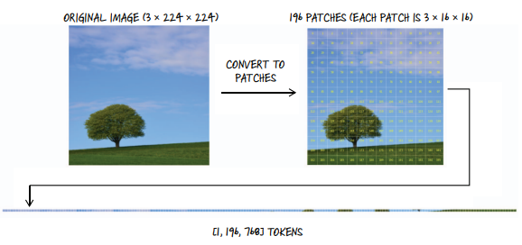
    <figcaption style="margin-top: 0.6em; text-align: center; font-size: 13px; color: #888;"><em>Şekil 9.14: Vision Transformer'da yama çıkarma. $224 \times 224 \times 3$ boyutundaki görüntü, her biri 768 boyutlu bir vektöre düzleştirilen 196 adet $16 \times 16$ yamaya dönüştürülür.</em></figcaption>
  </div>
</figure>

Standart bir $224 \times 224$ RGB görüntü ve $P=16$ yama boyutu için:
- Yama adedi: $N = \frac{224 \times 224}{16 \times 16} = 14 \times 14 = 196$ yama.
- Her yamanın ham vektör boyutu: $P^2 \cdot C = 16 \times 16 \times 3 = 768$.

PyTorch'ta yama çıkarma ve doğrusal izdüşüm işlemi, `kernel_size` ve `stride` parametreleri yama boyutuna ($P$) eşit 2D konvolüsyon ile tek adımda GPU çekirdeklerinde hızlandırılır:

```python
# Strided 2D konvolüsyon ile optimal yama izdüşümü
patch_size = 16
in_channels = 3
d_model = 768

patch_proj = nn.Conv2d(
    in_channels=in_channels,
    out_channels=d_model,
    kernel_size=patch_size,
    stride=patch_size
)

# Test görüntüsü: (B=1, C=3, H=224, W=224)
dummy_img = torch.randn(1, 3, 224, 224)
projected_patches = patch_proj(dummy_img)  # Boyut: (1, 768, 14, 14)

# Uzamsal boyutları dizi formatına düzleştirme: (B, N, d_model)
tokens = projected_patches.flatten(2).transpose(1, 2)
print(f"ViT Token Dizisi Boyutu: {tokens.shape} -> (Batch=1, N=196, d_model=768)")
```

### 10.2 Uçtan Uca ViT Mimarisi

<figure style="display:flex; justify-content: center; margin: 25px 0;">
  <div style="text-align: center;">
    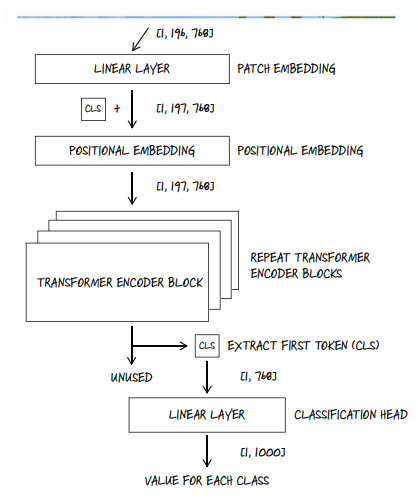
    <figcaption style="margin-top: 0.6em; text-align: center; font-size: 13px; color: #888;"><em>Şekil 9.15: Vision Transformer uçtan uca akışı. Yama gömmelerine [CLS] tokeni ve konum kodlamaları eklenir; Transformer Encoder'dan sonra sınıf tahmini [CLS] başlığı üzerinden yapılır.</em></figcaption>
  </div>
</figure>

1. **Öğrenilebilir `[CLS]` Tokeni:** BERT standardına uygun olarak dizi başına rastgele başlatılan bir $\mathbf{x}_{\text{class}} \in \mathbb{R}^{1 \times 1 \times d_{\text{model}}}$ sınıflandırma parametresi eklenir ($N+1 = 197$). Self-Attention tümden-tüme çalıştığı için, bu token tüm yama temsillerini tarafsızca toplar.
2. **1D Konumsal Gömmeler (Positional Embeddings):** Transformer uzamsal 2D koordinat bilgisini bilmediğinden, her pozisyona öğrenilebilir bir $E_{\text{pos}}$ vektörü eklenir:
   $$ \mathbf{z}_0 = [\mathbf{x}_{\text{class}}; \, \mathbf{x}_p^1 E; \, \dots; \, \mathbf{x}_p^N E] + E_{\text{pos}} $$
3. **Transformer Encoder İşlemi:** Dizi $L$ adet standart Encoder bloğundan geçer.
4. **Sınıflandırma Başlığı:** $L$. katmandaki `[CLS]` tokeni ($\mathbf{z}_L^0$) alınıp normalize edilir ve lineer katman üzerinden sınıf lojitleri tahmin edilir:
   $$ \mathbf{y} = \text{Linear}(\text{LayerNorm}(\mathbf{z}_L^0)) $$

### 10.3 İndüktif Önyargılar (Inductive Biases): CNN vs. Vision Transformer

| Boyut | Konvolüsyonel Sinir Ağları (CNN) | Vision Transformer (ViT) |
| :--- | :--- | :--- |
| **İndüktif Önyargı** | **Yüksek:** Öteleme değişmezliği (translation equivariance) ve yerel komşuluk kernel içine gömülüdür | **Düşük:** Önceden tanımlı uzamsal varsayım yoktur; 2D ilişkileri veriden öğrenmek zorundadır |
| **Reseptif Alan Büyümesi** | Katman derinleştikçe kademeli olarak büyür | **İlk katmandan itibaren küresel ($O(1)$)** |
| **Küçük Veri Performansı** | Az veride (ImageNet-1K) güçlü genelleme | Yeterli veri yoksa aşırı öğrenmeye (overfitting) yatkındır |
| **Büyük Ölçekte Doygunluk** | $>100\text{M}$ görsele çıkıldığında performans doyar | **Veri ve hesaplama büyüdükçe ölçeklenmeye devam eder** (JFT-300M) |

---

## 11. Hesaplama Karmaşıklığı ve Bellek Profili

Sistem tasarımı ve optimizasyon açısından Transformer hesaplama maliyetleri:

### 11.1 Self-Attention Karesel Büyümesi

$T$ dizi uzunluğu ve $d$ gömme boyutu olduğunda:
1. **İzdüşüm Matrisleri ($Q, K, V$):** $3 \times (T \cdot d \cdot d) = 3 T d^2$ FLOP.
2. **Dikkat Matrisi ($Q K^T$):** $(T \times d) \times (d \times T) = T^2 d$ FLOP.
3. **Softmax Normalizasyonu:** $O(T^2)$ işlem.
4. **Değer Toplamı ($A V$):** $(T \times T) \times (T \times d) = T^2 d$ FLOP.
5. **Çıktı İzdüşümü ($W_O$):** $T d^2$ FLOP.

$$ \text{Toplam Self-Attention FLOPs} \approx 4 T d^2 + 2 T^2 d $$

> **Mimari Darboğaz:** Dizi uzunluğu $T \gg d$ olduğunda $2 T^2 d$ terimi baskın hale gelir. 32K veya 128K bağlam pencerelerinde saf dikkat matrisinin saklanması terabaytlarca VRAM gerektirir; bu sorun GPU bellek hiyerarşisini optimize eden **FlashAttention-2** ([Dao, 2023](https://arxiv.org/abs/2307.08691)) çekirdeklerinin doğmasını sağlamıştır.

---

## 12. Özet ve Temel Çıkarımlar

1. **Temel Devrim:** Transformer, ardışık $O(N)$ döngüleri kaldırarak $O(1)$ yol uzunluğunda çalışan öz-dikkat mekanizmasını getirmiş ve tam GPU paralelliğini sağlamıştır.
2. **Öz-Denetimli Formülasyon:** Dil modelleri insan etiketine gerek duymadan, ham dizileri nedensel önekler ve bir sonraki karakter hedefleri olarak düzenleyerek eğitilir.
3. **Ölçeklenmiş Dot-Product Önemi:** Benzerlik puanlarını $\sqrt{d_k}$'ye bölmek, lojitlerin Softmax'ı doygunluğa sokup gradyanları yok etmesini engeller.
4. **Nedensellik Maskesi:** Üst üçgenin $-\infty$ ile maskelenmesi, modelin eğitim esnasında gelecek tokenleri kopyalamasını önler.
5. **Layer Normalization:** Yığın örnekleri boyunca normalizasyon yapan ve metin modellerinde bocalayan BatchNorm yerine; her tokenin kendi öznitelik kanallarını bağımsız normalize eden LayerNorm kullanılır.
6. **Vision Transformers (ViT):** Görselleri $P \times P$ yamalara bölerek token dizisine dönüştüren ViT, minimal indüktif önyargı ile bilgisayarlı görüde devrim yaratmıştır.
