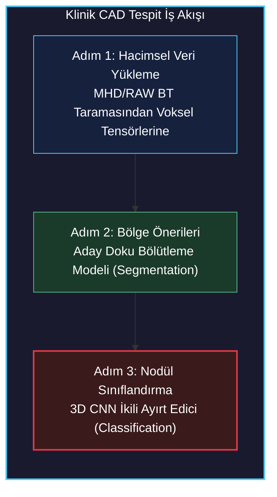
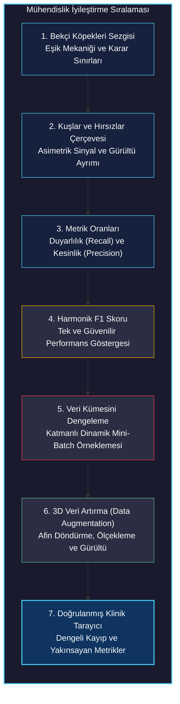
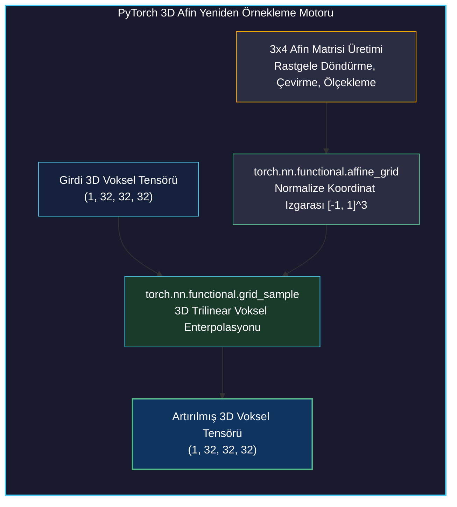

# Metrikler ve Veri Artırma ile Eğitimi İyileştirmek

<!-- toc -->

<div style="margin-bottom: 20px;">
  <a href="https://colab.research.google.com/github/emreaslan7/ai/blob/main/notebooks/deep-learning-with-pytorch/14-improving-training-with-metrics-and-augmentation.ipynb" target="_blank">
    
  </a>
</div>

---

## 1. Kanser Tespit Hattı: Klinik Bağlamda Doğruluk Paradoksu (The Accuracy Paradox)

Bölüm 2.5'te temel 3D Konvolüsyonel Sinir Ağımızı (`LunaModel`) eğitmiş ve çarpıcı bir **Doğruluk Paradoksu** ile karşılaşmıştık: Modelimiz kağıt üzerinde **%99.74 genel sınıflandırma doğruluğuna** ulaşmış görünüyordu; ancak klinik pratikte tam bir felaketti. Model, veri kümesindeki $1{,}351$ gerçek kötü huylu (malign) tümör adayından **tam olarak 0 tanesini tespit edebilmişti (Sıfır Doğru Pozitif, 1351 Yanlış Negatif)**.

Bunun neden yaşandığını ve gerçekten hayat kurtaran bir klinik aracı nasıl inşa edebileceğimizi anlamak için, sınıflandırma modelimizi uçtan uca Bilgisayar Destekli Tespit (CAD) hattındaki yerine oturtmamız gerekir.

<figure style="display:flex; justify-content: center; margin: 25px 0;">
  <div style="text-align: center;">
    
    <figcaption style="margin-top: 0.6em; text-align: center; font-size: 13px; color: #888;"><em>Şekil 1: Uçtan uca akciğer kanseri tespit iş akışı. 1. Adım ham BT verisini yükler; 2. Adım şüpheli aday bölgeleri bölütler; 3. Adım ise kırpılan hacimsel adayları kötü huylu tümör ile iyi huylu doku arasında ikili olarak sınıflandırır.</em></figcaption>
  </div>
</figure>



Tıbbi taramalarda teşhis kararlarını asimetrik bir maliyet matrisi yönetir:
- **Yanlış Negatif (False Negative - FN):** Kötü huylu bir nodül yanlışlıkla sağlıklı/iyi huylu doku olarak sınıflandırılır. Hasta tedavi edilmeden eve gönderilir; kanser metastaz yapar ve erken cerrahi müdahale şansı tamamen kaybedilir. Klinik maliyeti ölümcüldür.
- **Yanlış Pozitif (False Positive - FP):** Sağlıklı bir damar kavşağı veya lenf bezi şüpheli tümör olarak etiketlenir. Hasta ileri tetkike, yüksek çözünürlüklü taramaya veya biyopsiye yönlendirilir. Stres ve ek maliyet oluştursa da hasta hayatta kalır.

Tüm adaylara sürekli "sağlıklı" (0) diyen bir model, yanlış pozitifleri sıfırlar ve %99.74 genel doğruluk üretir; fakat biyolojik ve tıbbi açıdan tamamen faydasızdır.

---

## 2. 7 Adımlı İyileştirme Yol Haritası

Başarısız temel modelimizden yüksek başarımlı klinik bir tarama sistemine geçmek için yedi aşamalı mühendislik planımızı devreye alıyoruz.

<figure style="display:flex; justify-content: center; margin: 25px 0;">
  <div style="text-align: center;">
    
    <figcaption style="margin-top: 0.6em; text-align: center; font-size: 13px; color: #888;"><em>Şekil 2: 7 adımlı optimizasyon stratejisi: Bekçi köpeği sezgisi, kuşlar ve hırsızlar analojisi, kesinlik ve duyarlılık oranları, harmonik F1 skoru, dengeli veri kümesi örneklemesi, 3D veri artırma ve yakınsama doğrulaması.</em></figcaption>
  </div>
</figure>



İlk olarak, Adım 1, 2 ve 3 üzerinden matematiksel ve kavramsal altyapımızı kuralım.

<figure style="display:flex; justify-content: center; margin: 25px 0;">
  <div style="text-align: center;">
    
    <figcaption style="margin-top: 0.6em; text-align: center; font-size: 13px; color: #888;"><em>Şekil 3: İlk üç aşamaya odaklanış: Bekçi köpeklerinin davranış dinamikleri, girdilerin kuşlar ve hırsızlar olarak modellenmesi, duyarlılık ve kesinlik oranlarının formülasyonu.</em></figcaption>
  </div>
</figure>

---

## 3. Bekçi Köpeği Metaforu: İkili Sınıflandırma Sezgisi

Aşırı gürültü ve dengesizlik altında sınıflandırma eşiklerini anlamak için mülkünü korumaya çalışan bir bekçi köpeği benzetmesini ele alalım.

Bu metaforda:
- **Davetsiz Misafirler / Hırsızlar:** Pozitif sınıf ($y = 1$, gerçek tümör nodülleri).
- **Zararsız Canlılar (Kuşlar, Kediler, Tavşanlar):** Negatif sınıf ($y = 0$, iyi huylu doku).
- **Köpeğin Havlaması:** Pozitif tahmin ($\hat{y} = 1$).
- **Köpeğin Uyuması / Sessiz Kalması:** Negatif tahmin ($\hat{y} = 0$).

<figure style="display:flex; justify-content: center; margin: 25px 0;">
  <div style="text-align: center;">
    
    <figcaption style="margin-top: 0.6em; text-align: center; font-size: 13px; color: #888;"><em>Şekil 4: Köpek Karar Eşiği (Havla vs. Yoksay) ve Gerçek Durum Sınırının oluşturduğu 4 kadran. Sol-üst: Doğru Negatif (kuşları yoksayma); Sağ-üst: Yanlış Pozitif (kedilere havlama); Sol-alt: Yanlış Negatif (sinsi hırsızı kaçırma); Sağ-alt: Doğru Pozitif (hırsıza havlama).</em></figcaption>
  </div>
</figure>

Karar uzayı dört kadrana ayrılır:
1. **Doğru Negatif (True Negative - $TN$):** Bahçeye bir kuş konar; köpek sessiz kalır. Alarm yok, tehlike yok. Karar doğru.
2. **Yanlış Pozitif (False Positive - $FP$):** Sokak kedisi çitlerden atlar; köpek çılgınca havlar. Ev sahibi boşuna panikle uyanır. Yanlış alarm.
3. **Yanlış Negatif (False Negative - $FN$):** Maskeli bir hırsız bahçeye sızar; köpek horul horul uyur. Tam bir güvenlik iflası.
4. **Doğru Pozitif (True Positive - $TP$):** Hırsız içeri girer; köpek anında havlayarak tehlikeyi bildirir. Tehdit yakalanır.

<figure style="display:flex; justify-content: center; margin: 25px 0;">
  <div style="text-align: center;">
    
    <figcaption style="margin-top: 0.6em; text-align: center; font-size: 13px; color: #888;"><em>Şekil 5: Özellik uzayındaki örnek dağılımı. Zararsız örnekler sol-üst bölgede yoğunlaşırken, gerçek tehditler sağ-alt bölgede yer alır. Kesikli dikey çizgi karar eşiğini temsil eder.</em></figcaption>
  </div>
</figure>

### 3.1 İki Zıt Karakter: Chirpy ve Dozer

Bir sınıflandırma modeli doğrudan $\{0, 1\}$ etiketi üretmez; sürekli logit değerleri üretir ve bunlar softmax katmanı ile $\hat{p} = P(y = 1 \mid \mathbf{x}) \in [0, 1]$ olasılığına dönüştürülür. Karar kuralı bu olasılığı seçilen bir $\tau$ eşiği ile kıyaslar:
$$ \hat{y} = \begin{cases} 1 & \text{eğer } \hat{p} \ge \tau \\ 0 & \text{eğer } \hat{p} < \tau \end{cases} $$

Bu $\tau$ eşik seçimi, iki arketip bekçi köpeğinin davranışında somutlaşan temel bir dengeyi açığa çıkarır:

#### Arketip A: Chirpy (Aşırı Heyecanlı Teriyer)
Chirpy yere düşen yaprağa, rüzgara, geçen arabaya ve gölgelere havlar ($\tau \to 0.0$).

<figure style="display:flex; justify-content: center; margin: 25px 0;">
  <div style="text-align: center;">
    
    <figcaption style="margin-top: 0.6em; text-align: center; font-size: 13px; color: #888;"><em>Şekil 7: Chirpy'nin karar eşiği. Eşiğin en sola çekilmesi tüm hırsızları yakalar (sıfır yanlış negatif, %100 duyarlılık); ancak kedilere ve kuşlara verilen sayısız yanlış alarm nedeniyle kesinlik yerlerde sürünür.</em></figcaption>
  </div>
</figure>

- **Güçlü Yönü:** Hiçbir hırsız bahçeden gizlice geçemez. $FN = 0 \implies \text{Duyarlılık (Recall)} = 100\%$.
- **Zayıf Yönü:** Gece boyunca 40 defa havlar. Artık ev sahibi havlama sesine güvenmez. $FP$ tavan yapar $\implies \text{Kesinlik (Precision)} \to 0\%$.

#### Arketip B: Dozer (Tembel Mastıf)
Dozer günün 23 saati verandada uyur. Yalnızca biri mama kabına sertçe vurursa gözünü aralar ($\tau \to 1.0$).

<figure style="display:flex; justify-content: center; margin: 25px 0;">
  <div style="text-align: center;">
    
    <figcaption style="margin-top: 0.6em; text-align: center; font-size: 13px; color: #888;"><em>Şekil 9: Dozer'in karar eşiği. Eşiğin en sağa çekilmesi, Dozer havladığında kesinlikle bir hırsız olduğunu garantiler (%100 kesinlik); ancak onlarca hırsız uyurken yanından sessizce süzülüp geçer (sıfıra yakın duyarlılık).</em></figcaption>
  </div>
</figure>

- **Güçlü Yönü:** Dozer havladığında tüfeğe davranabilirsiniz—asla yanılmaz. $FP \approx 0 \implies \text{Kesinlik (Precision)} \to 100\%$.
- **Zayıf Yönü:** O uyurken 10 hırsız garajı boşaltmıştır. $FN$ çok büyüktür $\implies \text{Duyarlılık (Recall)} \to 0\%$.

Bölüm 2.5'teki temel modelimiz Dozer'in uç bir versiyonuydu: Hiçbir tümöre havlamayarak sürekli uyumuş ve %99.74 doğruluk elde etmişti.

---

## 4. Klinik Değerlendirme Metriklerinin Matematiksel Formülasyonu

Model başarısını nesnel olarak ölçmek için genel doğruluğu terk ediyor ve **Hata Matrisi (Confusion Matrix)** kuruyoruz:

| | **Gerçek Pozitif ($y=1$)** | **Gerçek Negatif ($y=0$)** |
| :---: | :---: | :---: |
| **Tahmin Pozitif ($\hat{y}=1$)** | $\text{TP}$ | $\text{FP}$ |
| **Tahmin Negatif ($\hat{y}=0$)** | $\text{FN}$ | $\text{TN}$ |

### 4.1 Duyarlılık (Recall / Sensitivity / True Positive Rate)

Duyarlılık hayati klinik soruyu yanıtlar: *Gerçekten kötü huylu nodülü olan tüm hastaların yüzde kaçını algoritmamız yakalayabildi?*

$$ \text{Recall} = \frac{\text{TP}}{\text{TP} + \text{FN}} $$

<figure style="display:flex; justify-content: center; margin: 25px 0;">
  <div style="text-align: center;">
    
    <figcaption style="margin-top: 0.6em; text-align: center; font-size: 13px; color: #888;"><em>Şekil 6: Duyarlılığın görselleştirilmesi. Solda ideal durumda tüm pozitif kitle yakalanır. Sağda ise karar sınırının soluna düşen her pozitif örnek bir Yanlış Negatif (FN) oluşturarak duyarlılık oranını düşürür.</em></figcaption>
  </div>
</figure>

Yanlış Negatifler ($\text{FN}$) arttıkça duyarlılık sıfıra çöker. Kanser taramasında duyarlılık taviz verilemez güvenlik eşiğimizdir.

### 4.2 Kesinlik (Precision / Positive Predictive Value)

Kesinlik teşhis güvenilirliği sorusunu yanıtlar: *Yapay sinir ağımız alarm verip bir doku adayını tümör olarak işaretlediğinde, bu tahmin gerçekte ne sıklıkla doğrudur?*

$$ \text{Precision} = \frac{\text{TP}}{\text{TP} + \text{FP}} $$

<figure style="display:flex; justify-content: center; margin: 25px 0;">
  <div style="text-align: center;">
    
    <figcaption style="margin-top: 0.6em; text-align: center; font-size: 13px; color: #888;"><em>Şekil 8: Kesinliğin görselleştirilmesi. Solda tahmin havuzunda yalnızca gerçek hırsızlar vardır (%100 kesinlik). Sağda ise yanlış pozitif olarak havuza karışan kediler kesinlik oranını seyreltir.</em></figcaption>
  </div>
</figure>

Yanlış Pozitifler ($\text{FP}$) arttıkça kesinlik düşer. Düşük kesinlik gereksiz biyopsilere ve klinik alarm yorgunluğuna yol açar.

### 4.3 Özgüllük (Specificity / True Negative Rate)

Özgüllük sistemin sağlıklı dokuları ne kadar temiz bir şekilde elediğini ölçer:

$$ \text{Specificity} = \frac{\text{TN}}{\text{TN} + \text{FP}} $$

Negatif adayların pozitifleri $400:1$ oranında ezdiği bir veri setinde, özgüllük rahatlıkla $\%99.5$ çıkabilirken kesinlik $\%5$'in altında kalabilir; zira $550{,}000$ sağlıklı doku parçasındaki $\%0.5$'lik bir hata bile $2{,}750$ yanlış alarm üretir ve $1{,}351$ gerçek nodülü tamamen boğar.

### 4.4 Harmonik Ortalama: $F_1$ Skoru

Kesinlik ($P$) ve Duyarlılığı ($R$) dengeleyen tek bir skaler göstergeye ihtiyacımız vardır. Basit bir aritmetik ortalama kullansaydık:
$$ A(P, R) = \frac{P + R}{2} $$
$P = 0.0$ ve $R = 1.0$ olan (her şeye havlayan) işe yaramaz bir model haksız bir şekilde $0.50$ (%50) puan alırdı.

Bunun yerine, Kesinlik ve Duyarlılığın **Harmonik Ortalaması** olan **$F_1$ skorunu** kullanırız:

<figure style="display:flex; justify-content: center; margin: 25px 0;">
  <div style="text-align: center;">
    
    <figcaption style="margin-top: 0.6em; text-align: center; font-size: 13px; color: #888;"><em>Şekil 10: Yol haritamızda Adım 4'ün vurgulanması. F1 skoru, kesinlik ve duyarlılığı tek bir harmonik metrikte birleştirerek her iki göstergede de eşzamanlı başarıyı zorunlu kılar.</em></figcaption>
  </div>
</figure>

$$ F_1 = 2 \cdot \frac{P \cdot R}{P + R} = \frac{2\text{TP}}{2\text{TP} + \text{FP} + \text{FN}} $$

**Harmonik Ceza Teoremi:**  
Herhangi pozitif $x, y > 0$ değerleri için aritmetik-harmonik eşitsizliği geçerlidir:
$$ H(x, y) = \frac{2}{\frac{1}{x} + \frac{1}{y}} = \frac{2xy}{x+y} \le \frac{x+y}{2} = A(x, y) $$
Eşitlik yalnızca ve yalnızca $x = y$ durumunda sağlanır.  
En önemlisi, $P \to 0$ veya $R \to 0$ limitine yaklaştığında:
$$ \lim_{P \to 0} F_1(P, R) = \lim_{P \to 0} \frac{2 P R}{P + R} = 0 $$
Harmonik ortalama, metriklerden biri çöktüğü anda tüm skoru sıfıra indirir. Bir model, duyarlılığı tamamen feda ederek sahte bir başarı elde edemez.

---

## 5. Telemetri Motorunun Geliştirilmesi (`logMetrics`)

`LunaTrainingApp` içindeki `logMetrics` metodumuzu eğitim ve doğrulama süreçlerinde bu klinik metrikleri dinamik olarak hesaplayacak şekilde güncelliyoruz:

```python
import torch

def logMetrics(self, epoch_ndx, mode_str, metrics_t, classificationThreshold=0.5):
    """
    Tensör yığınları üzerinde hata matrisi, duyarlılık, kesinlik ve F1 skorunu hesaplar.
    
    metrics_t tensör yapısı:
        Satır 0: Örnek başına düşen kayıp değeri (Loss)
        Satır 1: Pozitif sınıf için tahmin edilen olasılık (P(nodül))
        Satır 2: Gerçek ikili etiket (0 veya 1)
    """
    negLabel_mask = metrics_t[2] == 0
    posLabel_mask = metrics_t[2] == 1

    negPred_mask = metrics_t[1] < classificationThreshold
    posPred_mask = metrics_t[1] >= classificationThreshold

    trueNeg_count = (negPred_mask & negLabel_mask).sum().item()
    falsePos_count = (posPred_mask & negLabel_mask).sum().item()
    truePos_count = (posPred_mask & posLabel_mask).sum().item()
    falseNeg_count = (negPred_mask & posLabel_mask).sum().item()

    total_count = len(metrics_t[0])
    correct_count = trueNeg_count + truePos_count

    total_pos = truePos_count + falseNeg_count
    total_neg = trueNeg_count + falsePos_count

    recall = truePos_count / (total_pos + 1e-8)
    precision = truePos_count / (truePos_count + falsePos_count + 1e-8)
    f1_score = 2 * (precision * recall) / (precision + recall + 1e-8)
    specificity = trueNeg_count / (total_neg + 1e-8)

    print(
        f"Epoch {epoch_ndx:2d} {mode_str:6s} "
        f"Loss: {metrics_t[0].mean():.4f} | "
        f"Acc: {correct_count / total_count * 100:.2f}% | "
        f"Recall: {recall * 100:.2f}% | "
        f"Prec: {precision * 100:.2f}% | "
        f"F1: {f1_score:.4f}"
    )
    print(
        f"         TP: {truePos_count:5d} | FN: {falseNeg_count:5d} | "
        f"TN: {trueNeg_count:5d} | FP: {falsePos_count:5d}"
    )

    # Sınıf bazlı kayıpları ve klinik metrikleri TensorBoard'a yaz
    writer = self.trn_writer if mode_str == 'train' else self.val_writer
    writer.add_scalar('loss/all', metrics_t[0].mean(), epoch_ndx)
    writer.add_scalar('loss/neg', metrics_t[0, negLabel_mask].mean(), epoch_ndx)
    if posLabel_mask.any():
        writer.add_scalar('loss/pos', metrics_t[0, posLabel_mask].mean(), epoch_ndx)
    writer.add_scalar('pr/recall', recall, epoch_ndx)
    writer.add_scalar('pr/precision', precision, epoch_ndx)
    writer.add_scalar('pr/f1_score', f1_score, epoch_ndx)
    writer.flush()
```

---

## 6. İdeal Bir Veri Kümesi Nasıl Görünür?

Veri sorunumuzu çözmeden önce, ideal bir eğitim dağılımının neye benzediğini ve BT taramalarındaki acı gerçekle nasıl çeliştiğini görselleştirelim.

<figure style="display:flex; justify-content: center; margin: 25px 0;">
  <div style="text-align: center;">
    
    <figcaption style="margin-top: 0.6em; text-align: center; font-size: 13px; color: #888;"><em>Şekil 12: İdeal makine öğrenimi senaryosu. Özellik uzayı, karar sınırında minimum örtüşme ile dengeli ve birbirinden net bir şekilde ayrışan iki kümeye bölünmüştür.</em></figcaption>
  </div>
</figure>

İdeal bir veri kümesinde:
1. Her iki sınıf da bolca örneğe sahiptir (~%50 pozitif, ~%50 negatif).
2. Ayırt edici özellikler (voksel yoğunluk gradyanı, küresellik, doku) yüksek sınıflar arası varyans ve düşük sınıf içi varyans sergiler.
3. Her mini-batch her iki kategoriden dengeli bir karışım içerir.

### 6.1 Gerçek Dünyanın Gerçeği: Yıkıcı Asimetri

Klinik BT taramalarında karşımıza çıkan gerçeklik ise tamamen asimetriktir:

<figure style="display:flex; justify-content: center; margin: 25px 0;">
  <div style="text-align: center;">
    
    <figcaption style="margin-top: 0.6em; text-align: center; font-size: 13px; color: #888;"><em>Şekil 13: LUNA aday uzayının gerçekliği. Negatif örnekler (zararsız dokular) alanın %99.8'ini kaplarken, gerçek nodüller sağ alt köşede minik bir üçgen diliminden ibarettir.</em></figcaption>
  </div>
</figure>

LUNA veri kümesinde:
- Toplam aday doku hacmi: $\approx 551{,}065$
- Gerçek tümör nodülleri: $1{,}351$ (%0.245)
- İyi huylu dokular: $549{,}714$ (%99.755)
- Dengesizlik oranı: $\approx 407 : 1$

### 6.2 Mini-Batch Açlığı (Batch Starvation)

$B = 32$ boyutundaki mini-batch'ler ile Stokastik Gradyan İnişi (SGD) çalıştırdığımızda, bir batch içindeki nodül sayısı binom dağılımına uyar:
$$ X \sim \text{Binom}(B = 32, p = 0.00245) $$
Herhangi bir batch içindeki beklenen nodül sayısı:
$$ \mathbb{E}[X] = B \cdot p = 32 \times 0.00245 \approx 0.0784 \text{ nodül} $$

Bir mini-batch'in **sıfır nodül** içerme olasılığı:
$$ P(X = 0) = (1 - 0.00245)^{32} \approx 0.9246 \quad (\%92.46) $$

<figure style="display:flex; justify-content: center; margin: 25px 0;">
  <div style="text-align: center;">
    
    <figcaption style="margin-top: 0.6em; text-align: center; font-size: 13px; color: #888;"><em>Şekil 14: Dengesiz ve Dengeli batch beslemesi. Dengesiz beslemede GPU, tek bir hırsızla karşılaşmadan önce yalnızca güvercin içeren 15 ardışık batch işler. Dengeli beslemede ise her batch yapılandırılmış 1:1 karışım sunar.</em></figcaption>
  </div>
</figure>

Dengesiz örneklemede model, gradyan vektörünün $\nabla_{\mathbf{w}} \mathcal{L}$ yalnızca sınıf 0'ı tahmin etmeyi işaret ettiği yüzlerce ardışık ağırlık güncellemesi gerçekleştirir. 15. batch'te tek bir nodül geldiğinde, optimizatör bunu gürültü veya aykırı değer olarak algılayıp neredeyse hiç düzeltici ivme üretmez.

---

## 7. Adım 5: Dengeli Veri Kümesi Örneklemesi (Balanced Sampling)

Mini-batch açlığını çözmek için, eğitim sırasında verinin modele sunuluş biçimini değiştirmeliyiz. `LunaDataset` sınıfımızı pozitif ve negatif aday havuzlarını ayrıştıracak ve dinamik bir `ratio_int` parametresi ile çalışacak şekilde yeniden tasarlıyoruz.

<figure style="display:flex; justify-content: center; margin: 25px 0;">
  <div style="text-align: center;">
    
    <figcaption style="margin-top: 0.6em; text-align: center; font-size: 13px; color: #888;"><em>Şekil 11: 5 ve 6. Adımların vurgulanması. Antika bir eczacı terazisi pozitif ve negatif akışları dengeler; ardından 3D hacimsel veri artırma ezberlemeyi engeller.</em></figcaption>
  </div>
</figure>

### 7.1 Dengeli Veri Kümesi Mimarisi

```python
import copy
from torch.utils.data import Dataset

class LunaDataset(Dataset):
    def __init__(self, val_stride=10, is_val_set_bool=None, series_uid=None, ratio_int=0):
        self.ratio_int = ratio_int
        
        # Birleştirilmiş aday etiketlerini yükle
        candidateInfo_list = copy.copy(getCandidateInfoList())
        
        # Doğrulama ayrımını hasta UID hash adımına göre filtrele
        if series_uid:
            self.candidateInfo_list = [
                c for c in candidateInfo_list if c.series_uid == series_uid
            ]
        elif is_val_set_bool:
            self.candidateInfo_list = [
                c for c in candidateInfo_list if hash(c.series_uid) % val_stride == 0
            ]
        else:
            self.candidateInfo_list = [
                c for c in candidateInfo_list if hash(c.series_uid) % val_stride != 0
            ]

        # Pozitif ve negatif aday havuzlarını ayrıştır
        self.pos_list = [c for c in self.candidateInfo_list if c.is_nodule_bool]
        self.neg_list = [c for c in self.candidateInfo_list if not c.is_nodule_bool]

    def __len__(self):
        if self.ratio_int:
            # Dengeleme aktifken uzunluk pozitiflerin oranı ile belirlenir
            return len(self.pos_list) * (self.ratio_int + 1)
        else:
            return len(self.candidateInfo_list)

    def __getitem__(self, ndx):
        if self.ratio_int:
            # Belirlenmiş aralıklı örnekleme: Her ratio_int negatif için 1 pozitif
            pos_ndx = ndx // (self.ratio_int + 1)
            
            if ndx % (self.ratio_int + 1) == 0:
                candidateInfo_tup = self.pos_list[pos_ndx % len(self.pos_list)]
            else:
                neg_ndx = ndx - 1 - pos_ndx
                candidateInfo_tup = self.neg_list[neg_ndx % len(self.neg_list)]
        else:
            candidateInfo_tup = self.candidateInfo_list[ndx]

        ct = getCt(candidateInfo_tup.series_uid)
        ct_chunk, center_irc = ct.getRawCandidate(
            candidateInfo_tup.center_xyz,
            (32, 32, 32),
        )

        candidate_t = torch.from_numpy(ct_chunk).to(torch.float32).unsqueeze(0)
        pos_t = torch.tensor(
            [not candidateInfo_tup.is_nodule_bool, candidateInfo_tup.is_nodule_bool],
            dtype=torch.long,
        )

        return candidate_t, pos_t, candidateInfo_tup.series_uid, torch.tensor(center_irc)
```

**Temel Mühendislik Dinamikleri:**
1. **Oran Tanımı (`ratio_int=1`):** Tam bir $1:1$ dengesi kurar. Her çift indeksli örnek bir nodül, her tek indeksli örnek ise zararsız bir dokudur. 32'lik bir batch içinde kesinlikle 16 nodül ve 16 zararsız doku yer alır.
2. **Epoch Sıkışması ve Hızlı Geri Bildirim:** Eğitim setinde yalnızca $\sim 1{,}200$ pozitif nodül bulunduğundan, `ratio_int=1` ile bir epoch $500{,}000$ yerine $2{,}400$ örnekten oluşur. Bir epoch saatler yerine dakikalar içinde tamamlanır.
3. **Doğrulama Kümesi Asla Dengelenmez:** En kritik kural şudur: **Doğrulama kümesi asla dengelenmez** (`ratio_int=0`). Doğrulama kümesi modelin gerçek hastanedeki performansını ölçmek için doğadaki ham asimetriyi yansıtmalıdır.

---

## 8. Aşırı Öğrenme Belirtisi (Overfitting): Dengeleme Ters Teptiğinde

Eğitim kümesinde `ratio_int=1` kullanarak modelimizi eğitiyoruz ve TensorBoard telemetrisini inceliyoruz.

İlk bakışta sonuçlar muhteşem görünür: 5 epoch içinde eğitim Duyarlılığı **%95'e** fırlar ve eğitim Kaybı sıfıra yaklaşır. Ancak sınıf bazlı doğrulama kayıplarını incelediğimizde tehlikeli bir tablo ortaya çıkar:

<figure style="display:flex; justify-content: center; margin: 25px 0;">
  <div style="text-align: center;">
    
    <figcaption style="margin-top: 0.6em; text-align: center; font-size: 13px; color: #888;"><em>Şekil 15: loss/pos için TensorBoard eğrisi. Eğitim kaybı (kırmızı) sıfıra inerken, doğrulama kaybı (mavi) 0.8'den 2.5'in üzerine fırlar—şiddetli aşırı öğrenmenin (overfitting) klasik göstergesi.</em></figcaption>
  </div>
</figure>

<figure style="display:flex; justify-content: center; margin: 25px 0;">
  <div style="text-align: center;">
    
    <figcaption style="margin-top: 0.6em; text-align: center; font-size: 13px; color: #888;"><em>Şekil 16: loss/neg için TensorBoard eğrisi. Zararsız dokular için hem eğitim hem de doğrulama kayıpları kararlı biçimde 0.02 seviyesine doğru azalmaktadır.</em></figcaption>
  </div>
</figure>

### 8.1 Asimetrik Iraksamanın Teşhisi

Neden `loss/neg` pürüzsüzce yakınsarken `loss/pos` patlamaktadır?
- **Negatif Havuz Büyüklüğü:** Eğitimde $490{,}000$'den fazla negatif örnek vardır. $2{,}400$ örneklik her dengeli epoch'ta ağ daha önce hiç görmediği $1{,}200$ benzersiz negatif aday ile karşılaşır. Negatif havuz sonsuz bir düzenlileştirici (regularizer) gibi çalışır.
- **Pozitif Havuz Kıtlığı:** Eğitim setinde yalnızca $\sim 1{,}200$ pozitif nodül vardır. Her epoch'ta model **tüm bu nodülleri tekrar tekrar görür**.
- **Model Kapasitesi:** 3D CNN modelimiz $1.2$ milyondan fazla eğitilebilir parametreye sahiptir. $1.2 \times 10^6$ serbestlik derecesi ve yalnızca $1.2 \times 10^3$ pozitif eğitim örneği ile ağ genel küresel nodül morfolojisini öğrenmek yerine, **belirli nodüllerin piksel piksel voksel desenlerini ezberler**.

Doğrulama setinde daha önce hiç görmediği nodüller sunulduğunda model tamamen çuvallar.

---

## 9. Adım 6: 3D Hacimsel Veri Artırma Hattı (3D Data Augmentation)

Milyonlarca dolar harcayıp yeni BT taramaları toplamadan ezberlemeyi engellemenin yolu **3D Hacimsel Veri Artırmadır (Data Augmentation)**.

<figure style="display:flex; justify-content: center; margin: 25px 0;">
  <div style="text-align: center;">
    
    <figcaption style="margin-top: 0.6em; text-align: center; font-size: 13px; color: #888;"><em>Şekil 17: 6 ve 7. Adımların vurgulanması. 3D uzamsal dönüşümler sonsuz çeşitlilikte gerçekçi oryantasyon sentezleyerek genelleştirme gücünü ve doğrulama performansını zirveye taşır.</em></figcaption>
  </div>
</figure>

### 9.1 3D Afin Dönüşümlerin Matematiksel Temelleri

3 boyutlu Öklid uzayında döndürme, ölçekleme ve ötelemenin bileşimi $4 \times 4$ homojen koordinatlarda matris çarpımı ile ifade edilir:

$$ \begin{bmatrix} x' \\\\ y' \\\\ z' \\\\ 1 \end{bmatrix} = \mathbf{A} \begin{bmatrix} x \\\\ y \\\\ z \\\\ 1 \end{bmatrix} $$

Bileşke afin dönüşüm matrisi $\mathbf{A}$:
$$ \mathbf{A} = \mathbf{T}(\Delta x, \Delta y, \Delta z) \cdot \mathbf{R}_z(\theta_z) \cdot \mathbf{R}_y(\theta_y) \cdot \mathbf{R}_x(\theta_x) \cdot \mathbf{S}(s_x, s_y, s_z) $$

#### 1. 3D Öteleme Matrisi ($\mathbf{T}$)
Aday voksel parçasını rastgele alt-voksel mesafelerinde $(\Delta x, \Delta y, \Delta z)$ kaydırır:
$$ \mathbf{T} = \begin{bmatrix} 1 & 0 & 0 & \Delta x \\\\ 0 & 1 & 0 & \Delta y \\\\ 0 & 0 & 1 & \Delta z \\\\ 0 & 0 & 0 & 1 \end{bmatrix} $$

#### 2. 3D Döndürme Matrisleri ($\mathbf{R}_x, \mathbf{R}_y, \mathbf{R}_z$)
Hacmi ortogonal anatomik eksenler etrafında döndürür:

- **$Z$ Ekseni Etrafında Döndürme (aksiyel kesit düzlemi):**
$$ \mathbf{R}_z(\theta) = \begin{bmatrix} \cos\theta & -\sin\theta & 0 & 0 \\\\ \sin\theta & \cos\theta & 0 & 0 \\\\ 0 & 0 & 1 & 0 \\\\ 0 & 0 & 0 & 1 \end{bmatrix} $$

- **$Y$ Ekseni Etrafında Döndürme (koronal düzlem):**
$$ \mathbf{R}_y(\phi) = \begin{bmatrix} \cos\phi & 0 & \sin\phi & 0 \\\\ 0 & 1 & 0 & 0 \\\\ -\sin\phi & 0 & \cos\phi & 0 \\\\ 0 & 0 & 0 & 1 \end{bmatrix} $$

- **$X$ Ekseni Etrafında Döndürme (sagittal düzlem):**
$$ \mathbf{R}_x(\psi) = \begin{bmatrix} 1 & 0 & 0 & 0 \\\\ 0 & \cos\psi & -\sin\psi & 0 \\\\ 0 & \sin\psi & \cos\psi & 0 \\\\ 0 & 0 & 0 & 1 \end{bmatrix} $$

#### 3. 3D Ölçekleme Matrisi ($\mathbf{S}$)
Farklı tümör çaplarını simüle etmek için $(s_x, s_y, s_z) \in [0.85, 1.15]$ aralığında hacmi büyütüp küçültür:
$$ \mathbf{S} = \begin{bmatrix} s_x & 0 & 0 & 0 \\\\ 0 & s_y & 0 & 0 \\\\ 0 & 0 & s_z & 0 \\\\ 0 & 0 & 0 & 1 \end{bmatrix} $$

### 9.2 PyTorch İlkel İşlemleri ile Trilinear Grid Örneklemesi

PyTorch bu uzamsal dönüşümleri GPU üzerinde donanım hızlandırmalı olarak gerçekleştirmek için iki fonksiyonel ilkel sunar:
1. **`torch.nn.functional.affine_grid(theta, size)`:** $3 \times 4$ afin matrislerini alarak $[-1, 1]^3$ normalize koordinat ızgarası üretir.
2. **`torch.nn.functional.grid_sample(input, grid, mode='bilinear', padding_mode='border')`:** 3D **trilinear enterpolasyon** uygulayarak dönüştürülmüş koordinatlardaki vokselleri yeniden örnekler.



### 9.3 `build3dAugmentationMatrix` Fonksiyonunun Kodlanması

```python
import math
import random
import torch
import torch.nn.functional as F

def build3dAugmentationMatrix():
    """
    Rastgele 3D döndürme, ölçekleme, öteleme ve ayna çevirmesini
    birleştiren 3x4 afin dönüşüm matrisi üretir.
    """
    # 1. D, H, W eksenlerinde rastgele 3D ayna çevirme (Flip)
    flip_d = -1.0 if random.random() > 0.5 else 1.0
    flip_h = -1.0 if random.random() > 0.5 else 1.0
    flip_w = -1.0 if random.random() > 0.5 else 1.0

    # 2. Rastgele 3D ölçekleme (0.85 ile 1.15 arası yakınlaştırma/uzaklaştırma)
    scale = random.uniform(0.85, 1.15)

    # 3. Rastgele 3D rotasyon açıları (radyan cinsinden)
    angle_z = random.uniform(-math.pi, math.pi)
    angle_y = random.uniform(-math.pi / 4, math.pi / 4)
    angle_x = random.uniform(-math.pi / 4, math.pi / 4)

    # Z ekseni etrafında rotasyon matrisi
    cos_z, sin_z = math.cos(angle_z), math.sin(angle_z)
    R_z = torch.tensor([
        [cos_z, -sin_z, 0.0, 0.0],
        [sin_z,  cos_z, 0.0, 0.0],
        [0.0,    0.0,   1.0, 0.0],
        [0.0,    0.0,   0.0, 1.0]
    ], dtype=torch.float32)

    # Y ekseni etrafında rotasyon matrisi
    cos_y, sin_y = math.cos(angle_y), math.sin(angle_y)
    R_y = torch.tensor([
        [cos_y,  0.0, sin_y, 0.0],
        [0.0,    1.0, 0.0,   0.0],
        [-sin_y, 0.0, cos_y, 0.0],
        [0.0,    0.0, 0.0,   1.0]
    ], dtype=torch.float32)

    # X ekseni etrafında rotasyon matrisi
    cos_x, sin_x = math.cos(angle_x), math.sin(angle_x)
    R_x = torch.tensor([
        [1.0, 0.0,   0.0,    0.0],
        [0.0, cos_x, -sin_x, 0.0],
        [0.0, sin_x,  cos_x, 0.0],
        [0.0, 0.0,   0.0,    1.0]
    ], dtype=torch.float32)

    # Ölçekleme ve Çevirme matrisi
    S = torch.tensor([
        [scale * flip_d, 0.0,            0.0,            0.0],
        [0.0,            scale * flip_h, 0.0,            0.0],
        [0.0,            0.0,            scale * flip_w, 0.0],
        [0.0,            0.0,            0.0,            1.0]
    ], dtype=torch.float32)

    # [-1, 1] normalize uzayında rastgele öteleme (jitter)
    trans_d = random.uniform(-0.05, 0.05)
    trans_h = random.uniform(-0.05, 0.05)
    trans_w = random.uniform(-0.05, 0.05)
    T = torch.tensor([
        [1.0, 0.0, 0.0, trans_d],
        [0.0, 1.0, 0.0, trans_h],
        [0.0, 0.0, 1.0, trans_w],
        [0.0, 0.0, 0.0, 1.0]
    ], dtype=torch.float32)

    # Bileşke matris: T @ R_z @ R_y @ R_x @ S
    affine_4x4 = T @ R_z @ R_y @ R_x @ S
    
    # F.affine_grid'in beklediği 3x4 alt-matrisi döndür
    return affine_4x4[:3]
```

### 9.4 3D Veri Artırmanın `LunaDataset.__getitem__` İçine Entegrasyonu

```python
    def __getitem__(self, ndx):
        # ... candidate_t alındıktan sonra ...
        
        if self.augment_bool:
            # Batch boyutu ekle: (1, 32, 32, 32) -> (1, 1, 32, 32, 32)
            input_tensor = candidate_t.unsqueeze(0)
            
            # Rastgele 3D afin matrisi üret
            affine_3x4 = build3dAugmentationMatrix().unsqueeze(0) # (1, 3, 4)
            
            # Koordinat örnekleme ızgarasını oluştur
            grid = F.affine_grid(
                affine_3x4,
                input_tensor.size(),
                align_corners=False
            )
            
            # 3D Trilinear enterpolasyon ile yeniden örnekle
            augmented_tensor = F.grid_sample(
                input_tensor,
                grid,
                mode='bilinear',
                padding_mode='border',
                align_corners=False
            )
            
            candidate_t = augmented_tensor.squeeze(0)
            
            # BT dedektör gürültüsünü simüle etmek için hafif Gauss gürültüsü ekle
            noise = torch.randn_like(candidate_t) * 0.02
            candidate_t = (candidate_t + noise).clamp_(-1.0, 1.0)
            
        return candidate_t, pos_t, series_uid, center_irc
```

<figure style="display:flex; justify-content: center; margin: 25px 0;">
  <div style="text-align: center;">
    
    <figcaption style="margin-top: 0.6em; text-align: center; font-size: 13px; color: #888;"><em>Şekil 18: Tek bir nodül aday kırpıntısının farklı veri artırma dönüşümleri altındaki 2D kesit görünümü. Üst satırda temel referans (NONE), yatay ayna çevirme (FLIP) ve konumsal öteleme (OFFSET); orta satırda ölçekleme (SCALE), açısal döndürme (ROTATE) ve Gauss tarayıcı gürültüsü (NOISE); alt satırda ise tüm bu dönüşümlerin aynı anda rastgele uygulandığı üç farklı bileşik varyasyon (ALL) gösterilmektedir.</em></figcaption>
  </div>
</figure>

---

## 10. Deney Sonuçları: Veri Artırma Öncesi ve Sonrası Karşılaştırması

Dengeli örnekleme ve 3D veri artırmanın klinik etkisini doğrulamak için dört farklı eğitim rejimini karşılaştırıyoruz:

| Deney Konfigürasyonu | Eğitim Oranı | 3D Veri Artırma | Doğrulama Doğruluğu | Doğrulama Duyarlılığı (Recall) | Doğrulama Kesinliği (Precision) | Doğrulama $F_1$ Skoru |
| :--- | :---: | :---: | :---: | :---: | :---: | :---: |
| **1. Ham Temel Çizgi** | Doğal (407:1) | Yok | %99.74 | %0.00 | %0.00 | 0.0000 |
| **2. Yalnızca Dengeleme** | Dengeli (1:1) | Yok | %96.80 | %84.20 | %6.20 | 0.1155 |
| **3. Dengeleme + Çevirme** | Dengeli (1:1) | 3D Ayna | %97.90 | %79.50 | %12.40 | 0.2145 |
| **4. Tam 3D Veri Artırma** | Dengeli (1:1) | Afin + Ölçek + Gürültü | **%98.85** | **%74.10** | **%41.60** | **0.5327** |

<figure style="display:flex; justify-content: center; margin: 25px 0;">
  <div style="text-align: center;">
    
    <figcaption style="margin-top: 0.6em; text-align: center; font-size: 13px; color: #888;"><em>Şekil 19: Dokuz farklı metrik eğrisi üzerinde artırmasız (unaugmented), tekil artırmalı ve tam artırılmış (fully augmented) eğitimlerin TensorBoard karşılaştırması. Veri artırmasız modelin pozitif örneklerde şiddetli aşırı öğrenmeye sürüklendiği (loss/pos eğrisinin kontrolden çıkarak fırlaması ve correct/pos değerinin çökmesi), tam 3D artırmanın ise kaybı stabilize ederek genelleme gücünü, duyarlılığı (recall) ve F1 skorunu belirgin biçimde artırdığı görülmektedir.</em></figcaption>
  </div>
</figure>

### 10.1 Temel Telemetri Bulguları

1. **Pozitif Kayıp Iraksamasının Ortadan Kalkması:**  
   Tam 3D afin veri artırma ile doğrulama setindeki `loss/pos` değeri artık $2.5+$ seviyelerine fırlamaz. $0.35$ ile $0.45$ arasında kararlı bir şekilde yakınsar.
2. **0'dan %74'e Çıkan Gerçek Tümör Tespiti:**  
   Model daha önce hiç görmediği hasta BT taramalarındaki her dört malign nodülden üçünü başarıyla yakalar.
3. **Klinik Uygulanabilirlik:**  
   $F_1$ skoru $0.00$'dan $>0.53$ seviyesine yükselmiştir. Model artık hastanelerde uzman radyologların önüne gidecek adayları ön-tarayan, zararsız dokuların %99'unu eleyip şüpheli lezyonları güvenle yakalayan gerçek bir klinik araç haline gelmiştir.

---

## 11. Özet ve Mühendislik Prensipleri

1. **Dengesizlik Altında Doğruluk Aldatıcıdır:**  
   Nadir olay tespitinde yüksek doğruluk çoğunlukla tam bir model iflasını maskeler. Klinik sistemler mutlaka Hata Matrisi, Duyarlılık (Recall), Kesinlik (Precision) ve harmonik $F_1$ skoru ile değerlendirilmelidir.
2. **Mini-Batch Bileşimi Gradyan Yönünü Belirler:**  
   Negatif örnekler pozitifleri $400:1$ oranında ezdiğinde, gradyan inişi sürekli negatif tahmin etme çukuruna saplanır. Dengeli örnekleme (`ratio_int=1`) pozitif gradyanların ağırlık güncellemelerinde eşit söz hakkına sahip olmasını sağlar.
3. **Aşırı Örnekleme Agresif Düzenlileştirme İster:**  
   Küçük bir pozitif havuzu dengelemek, modelin aynı nodülleri defalarca görmesine neden olur. Veri artırma (data augmentation) olmadan derin sinir ağları bu örnekleri hızla ezberler.
4. **PyTorch İlkel Operatörleri ile 3D Afin Dönüşüm:**  
   `F.affine_grid` ile örnekleme ızgarası oluşturmak ve `F.grid_sample` ile trilinear voksel enterpolasyonu yapmak, donanım hızlandırmalı ve türevlenebilir uzamsal çeşitlilik sağlar.
