# Şüpheli Tümörleri Tespit Etmek İçin Bir Sınıflandırma Modeli Eğitmek

<!-- toc -->

<div style="margin-bottom: 20px;">
  <a href="https://colab.research.google.com/github/emreaslan7/ai/blob/main/notebooks/deep-learning-with-pytorch/13-training-a-classification-model-to-detect-suspected-tumors.ipynb" target="_blank">
    
  </a>
</div>

---

## 1. Kanser Tespit Boru Hattı: Sınıflandırmaya Odaklanmak

Bölüm 2.4'te, klinik teşhis sistemimizin veri altyapısını kurmuştuk: ham torasik BT (CT) taramalarını (`.mhd`/`.raw`) ayrıştırdık, sürekli milimetre koordinatlarını ayrık voksel matris indislerine ($[I, R, C]$) dönüştürdük ve şüpheli lezyon adaylarının merkezinden $32 \times 32 \times 32$ voksel boyutunda normalize edilmiş 3 boyutlu alt hacim yamaları kestik.

Bu bizi, uçtan uca klinik teşhis boru hattının **3. Adımına: Nodül Sınıflandırmasına** getirmektedir.

<figure style="display:flex; justify-content: center; margin: 25px 0;">
  <div style="text-align: center;">
    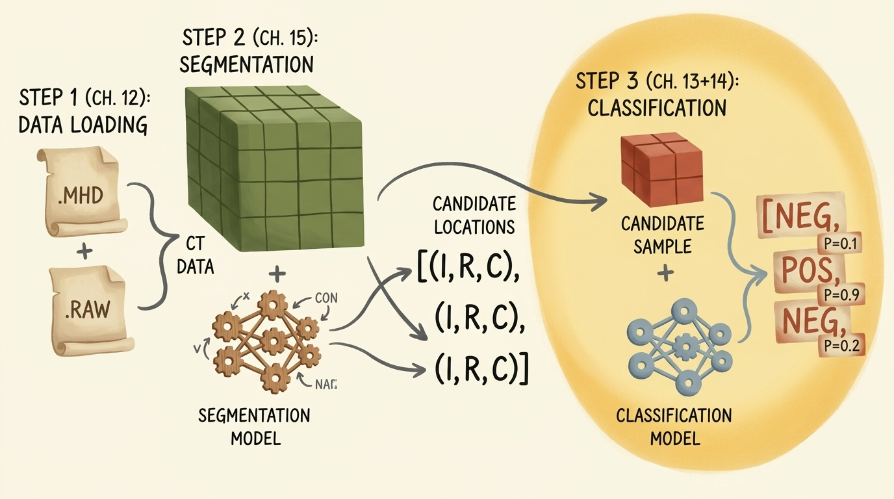
    <figcaption style="margin-top: 0.6em; text-align: center; font-size: 13px; color: #888;"><em>Şekil 1: 3 aşamalı uçtan uca akciğer kanseri tespit boru hattı. 1. Adımda kurulan veri yükleme motorunun ardından bu bölümde 3. Adım inşa edilir: Kesilmiş doku adayı örneklerini iyi huylu doku ve gerçek kötü huylu nodül olarak ayırt eden bir 3B Konvolüsyonel Sinir Ağı eğitmek.</em></figcaption>
  </div>
</figure>

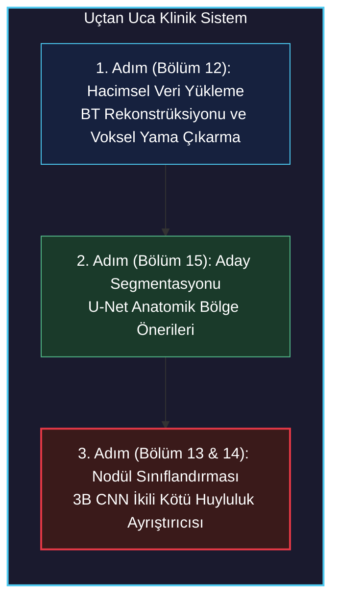

Bu modüldeki temel hedefimiz ikili sınıflandırmadır (`binary classification`): $(1, 32, 32, 32)$ şeklindeki hacimsel tensör yaması verildiğinde, bu adayın gerçek bir tümör nodülü mü ($y = 1$) yoksa iyi huylu normal bir anatomik yapı mı ($y = 0$, örneğin damar çatallanması, bronş duvarı veya kemik çıkıntısı) olduğunu tahmin etmek.

---

## 2. Üst Düzey Eğitim Uygulama Mimarisi (`LunaTrainingApp`)

Endüstriyel standartta derin öğrenme sistemleri, karmaşık ve tek parça betikler yerine temiz, modüler ve nesne yönelimli (`OOP`) bir mimari gerektirir. Tüm eğitim ve doğrulama yaşam döngüsünü `LunaTrainingApp` isimli bir uygulama sınıfı altında topluyoruz.

<figure style="display:flex; justify-content: center; margin: 25px 0;">
  <div style="text-align: center;">
    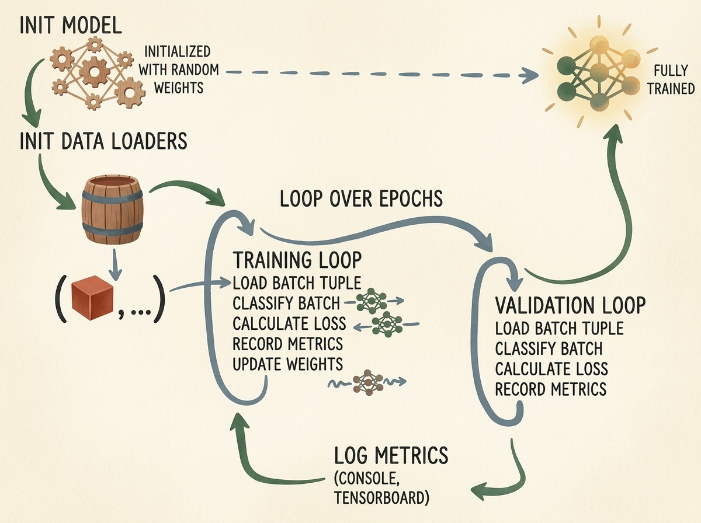
    <figcaption style="margin-top: 0.6em; text-align: center; font-size: 13px; color: #888;"><em>Şekil 2: LunaTrainingApp mimari yaşam döngüsü. Model ağırlıkları ve DataLoaders başlatılır; ardından metrikleri hem konsola hem de TensorBoard'a kaydeden çok dönemli eğitim ve doğrulama döngüsü yürütülür.</em></figcaption>
  </div>
</figure>

Çalışma adımları şu mantıksal sırayı izler:
1. **Komut Satırı Ayrıştırma (`__init__`):** Hiperparametrelerin Python'un standart `argparse` modülüyle okunması (`--batch-size`, `--epochs`, `--num-workers`, `--lr`).
2. **Kaynak Başlatma (`initModel`, `initOptimizer`):** Ağ mimarisinin oluşturulması, optimizatörün tanımlanması ve tensörlerin CUDA/CPU donanımına taşınması.
3. **Veri Hattı Kurulumu (`initDataLoaders`):** Sıfır sızıntılı (`zero data leakage`) hasta gruplamasıyla eğitim ve doğrulama DataLoader nesnelerinin hazırlanması.
4. **Epok İterasyonu (`main`):** Her epok için gradyan güncellemeli aktif eğitim döngüsünün (`doTraining`), ardından değerlendirme döngüsünün (`doValidation`) ve telemetri loglamasının (`logMetrics`) işletilmesi.

### 2.1 Uygulama İskeletinin Kurulması

Eğitim sınıfımızın temel iskeletini inşa edelim:

```python
import argparse
import datetime
import sys
import torch
import torch.nn as nn
from torch.utils.data import DataLoader
from torch.optim import SGD

class LunaTrainingApp:
    def __init__(self, sys_argv=None):
        if sys_argv is None:
            sys_argv = sys.argv[1:]

        parser = argparse.ArgumentParser(
            description="LUNA Veri Kümesi Üzerinde 3B CNN Nodül Sınıflandırıcı Eğitimi."
        )
        parser.add_argument(
            '--batch-size',
            help='Eğitimde kullanılacak yığın boyutu',
            default=32,
            type=int,
        )
        parser.add_argument(
            '--num-workers',
            help='Arka planda veri yükleme için iş parçacığı (worker) sayısı',
            default=4,
            type=int,
        )
        parser.add_argument(
            '--epochs',
            help='Eğitilecek epok sayısı',
            default=1,
            type=int,
        )
        parser.add_argument(
            '--tb-prefix',
            default='p2ch13',
            help="TensorBoard çalıştırma dizini için önek",
        )
        parser.add_argument(
            '--comment',
            help="TensorBoard çalıştırma adı için yorum soneki",
            nargs='?',
            default='dwlpt',
        )

        self.cli_args = parser.parse_args(sys_argv)
        self.time_str = datetime.datetime.now().strftime('%Y-%m-%d_%H.%M.%S')
        self.use_cuda = torch.cuda.is_available()
        self.device = torch.device("cuda" if self.use_cuda else "cpu")
```

Bu yapılandırmadaki kritik unsurlar:
- `self.use_cuda`: Donanım ivmelendirmesini denetler. CUDA destekli bir GPU varsa model parametreleri ve tensör yığınları doğrudan GPU VRAM'ine yüklenir.
- `self.time_str`: Her deney için benzersiz bir zaman damgası üreterek log dizinlerinin birbiri üzerine yazılmasını engeller.

---

## 3. Ön Eğitim Hazırlığı: DataLoader Yönetimi ve Donanım Optimizasyonu

Hazırlık aşaması, gradyan inişine geçilmeden önce model ağırlıklarını ve veri erişim kanallarını hazır hale getirir.

<figure style="display:flex; justify-content: center; margin: 25px 0;">
  <div style="text-align: center;">
    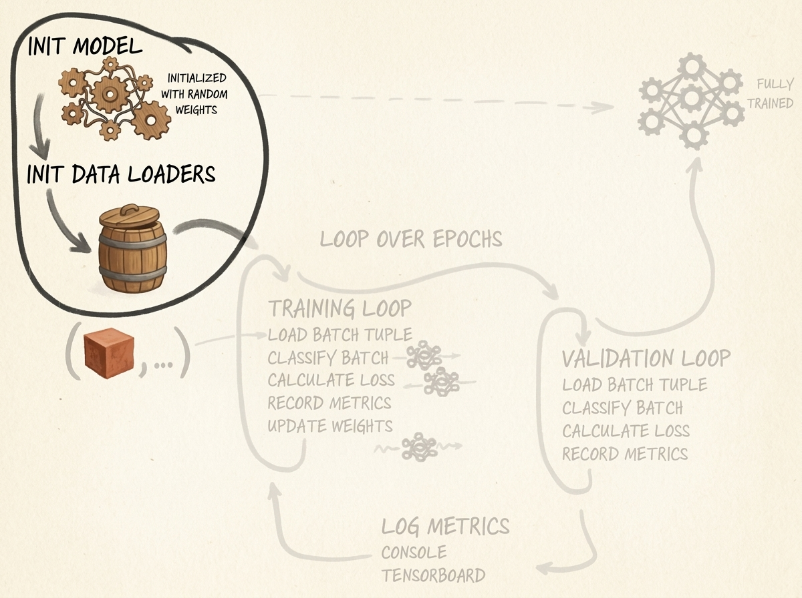
    <figcaption style="margin-top: 0.6em; text-align: center; font-size: 13px; color: #888;"><em>Şekil 3: Başlatma aşamasının vurgulanması. Model rastgele ağırlıklarla kurulup hesaplama aygıtına taşınırken, DataLoader yapıları önbelleğe alınmış veri kümesini sarmalar.</em></figcaption>
  </div>
</figure>

### 3.1 Modeli ve Optimizatörü Başlatmak

Modeli örnekleyip seçilen aygıta taşıyoruz. Optimizatör olarak momentumlu Stokastik Gradyan İnişini (`SGD`) tercih ediyoruz:

```python
    def initModel(self):
        model = LunaModel()
        if self.use_cuda:
            print(f"Kullanılan CUDA Aygıtı: {torch.cuda.get_device_name(0)}")
            if torch.cuda.device_count() > 1:
                model = nn.DataParallel(model)
            model = model.to(self.device)
        return model

    def initOptimizer(self):
        return SGD(self.model.parameters(), lr=0.001, momentum=0.99)
```

> [!NOTE]
> Momentumun `0.99` seçilmesi, önceki gradyan vektörlerinin güçlü bir üstel hareketli ortalamasını oluşturur:
> $$ \mathbf{v}\_{t} = \mu \mathbf{v}\_{t-1} + \mathbf{g}\_t, \quad \mathbf{\theta}\_{t} = \mathbf{\theta}\_{t-1} - \alpha \mathbf{v}\_t $$
> Pozitif nodül örneklerinin seyrek olduğu veri kümelerinde yüksek momentum, optimizatörün plato bölgelerinden hızla geçmesine yardımcı olur.

### 3.2 3B DataLoader Yapısının Beslenmesi ve Bakımı

`LunaDataset.__getitem__` metoduna yapılan her çağrı, 4 elemanlı bir demet (`tuple`) döndürür: `(1, 32, 32, 32)` boyutunda 4B tensör, nodül boolean bayrağı, hasta seri UID'si ve merkez koordinatı. `DataLoader`, bu tekil örnekleri birleştirerek yığın tensörlerine (`batches`) dönüştürür.

<figure style="display:flex; justify-content: center; margin: 25px 0;">
  <div style="text-align: center;">
    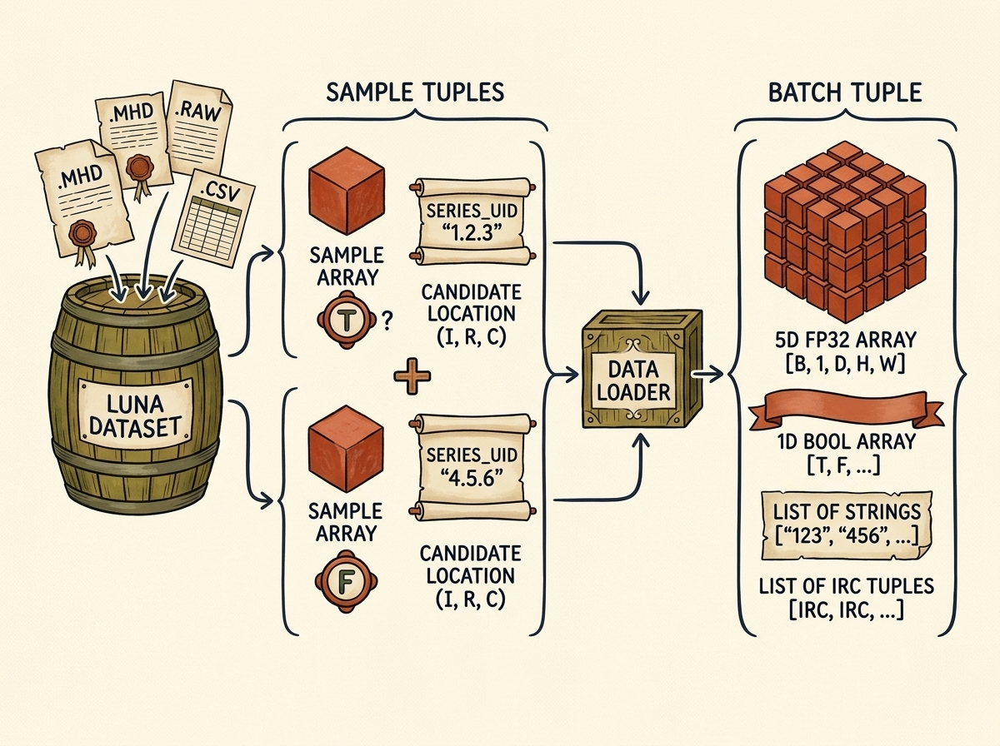
    <figcaption style="margin-top: 0.6em; text-align: center; font-size: 13px; color: #888;"><em>Şekil 4: PyTorch DataLoader harmanlama (collation) mekanizması. 3B alt hacim kırpmaları ve tablosal üstverilerden oluşan tekil örnek demetleri, 5B kayan noktalı tensörlere ve yığınlanmış yapılara dönüştürülür.</em></figcaption>
  </div>
</figure>

```python
    def initTrainDl(self):
        train_ds = LunaDataset(
            val_stride=10,
            is_val_set_bool=False,
        )
        batch_size = self.cli_args.batch_size
        if self.use_cuda:
            batch_size *= torch.cuda.device_count()

        train_dl = DataLoader(
            train_ds,
            batch_size=batch_size,
            num_workers=self.cli_args.num_workers,
            pin_memory=self.use_cuda,
        )
        return train_dl

    def initValDl(self):
        val_ds = LunaDataset(
            val_stride=10,
            is_val_set_bool=True,
        )
        batch_size = self.cli_args.batch_size
        if self.use_cuda:
            batch_size *= torch.cuda.device_count()

        val_dl = DataLoader(
            val_ds,
            batch_size=batch_size,
            num_workers=self.cli_args.num_workers,
            pin_memory=self.use_cuda,
        )
        return val_dl
```

**Performans ve Bellek Optimizasyonları:**
1. **`pin_memory=True`:** Host (CPU) tensörlerini sayfalanmayan (`page-locked / pinned`) sistem belleğine tahsis eder. `.to(self.device, non_blocking=True)` ile GPU VRAM'ine kopyalanırken transfer, PCIe veri yolu üzerinden Doğrudan Bellek Erişimi (`DMA`) ile asenkron yürütülür.
2. **`num_workers=4`:** Python nesne açma (`unpickling`), disk önbelleği okuma ve tensör dönüşüm işlemlerini bağımsız alt süreçlerde çalıştırarak GPU'nun veri beklemesini (`GPU starvation`) önler.
3. **`val_stride=10`:** Her 10. hastanın tüm adaylarını doğrulama kümesine ayırarak hasta düzeyinde çapraz doğrulama uygular; böylece sıfır veri sızıntısı (`zero leakage`) garanti edilir.

---

## 4. 3B Konvolüsyonel Sinir Ağı Tasarımı (`LunaModel`)

### 4.1 3B Konvolüsyonların Geometrik ve Hesaplamalı Mekaniği

Standart 2B görüntü işlemede konvolüsyon çekirdeği yalnızca yükseklik ve genişlik eksenlerinde kayar: $(C\_{\text{in}}, H, W) \to (C\_{\text{out}}, H', W')$. Oysa medikal BT görüntülerinde nodüller, ardışık eksenel dilimlere yayılan küresel veya elipsoid 3 boyutlu anatomik yapılardır. 2B dilimleri bağımsız incelemek dilimler arası uzamsal bağlamı yok eder.

3B konvolüsyon katmanı (`nn.Conv3d`), 3B çekirdeği derinlik ($D$), yükseklik ($H$) ve genişlik ($W$) eksenlerinde eşzamanlı kaydırır:
$$ \text{Girdi Şekli: } [N, C, D, H, W] $$

$$\mathbf{Y}\_{n, c\_{\text{out}}, d, h, w} = \mathbf{b}\_{c\_{\text{out}}} + \sum\_{c\_{\text{in}}=0}^{C\_{\text{in}}-1} \sum\_{i=0}^{K_d-1} \sum\_{j=0}^{K_h-1} \sum\_{k=0}^{K_w-1} \mathbf{K}\_{c\_{\text{out}}, c\_{\text{in}}, i, j, k} \cdot \mathbf{X}\_{n, c\_{\text{in}}, d+i, h+j, w+k} $$

<figure style="display:flex; justify-content: center; margin: 25px 0;">
  <div style="text-align: center;">
    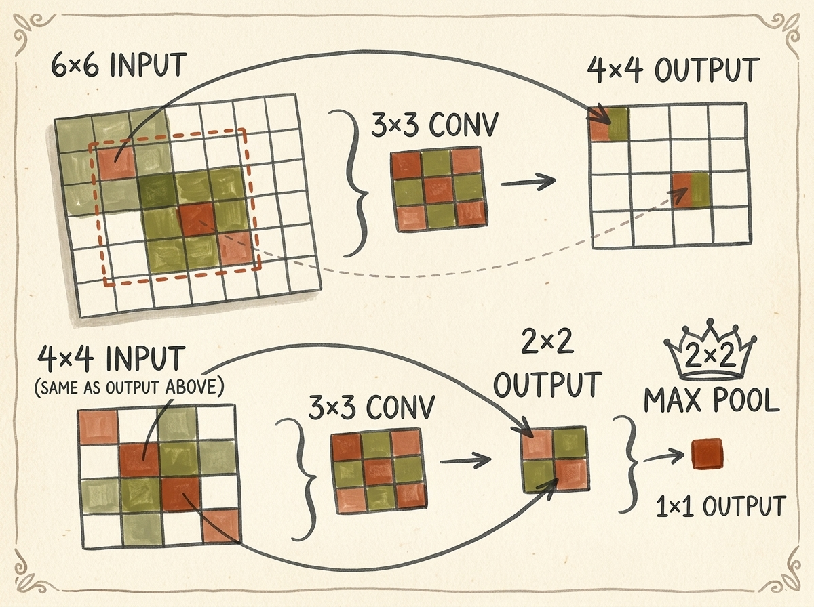
    <figcaption style="margin-top: 0.6em; text-align: center; font-size: 13px; color: #888;"><em>Şekil 6: Dolgusuz (unpadded) konvolüsyonlar ve maksimum havuzlama boyunca uzamsal alıcı alanın (receptive field) genişlemesi ve boyut azalması. Ardışık yerel işlemlerin her bir çıkış hücresini etkileyen girdi alanını nasıl büyüttüğüne dikkat edin.</em></figcaption>
  </div>
</figure>

**Parametre ve Bellek Patlaması:**
- 2B $3 \times 3$ çekirdek kanal başına $9$ ağırlığa sahiptir.
- 3B $3 \times 3 \times 3$ çekirdek kanal başına $27$ ağırlık barındırır (3 kat artış).
- Aktivasyon tensörleri kübik büyür: $[32, 64, 16, 16, 16]$ boyutunda bir ara katman tensörü $8{,}388{,}608$ kayan noktalı sayı içerir ve tek bir katmanın aktivasyonu için $33.55\text{ MB}$ GPU belleği tüketir. Bu nedenle havuzlama ile uzamsal boyutların kontrollü küçültülmesi kritiktir.

### 4.2 `LunaModel` Mimari Mimarisi

Model üç ana bölümden meydana gelir:
1. **Kuyruk (Tail):** Girdi Hounsfield birimlerini anlık normalize ederek ortalamayı $0$'a ve varyansı $1$'e çeken `nn.BatchNorm3d(1)`.
2. **Omurga (Backbone):** Kanal kapasitesini artıran ($1 \to 8 \to 16 \to 32 \to 64$) ve $2 \times 2 \times 2$ maksimum havuzlama ile uzamsal çözünürlüğü kademeli yarıya indiren ($32^3 \to 16^3 \to 8^3 \to 4^3 \to 2^3$) 4 adet modüler `LunaBlock`.
3. **Başlık (Head):** Düzleştirilmiş $512$ boyutlu vektörü ($64 \times 2 \times 2 \times 2$) $2$ sınıf çıkışına eşleyen doğrusal katman ve olasılık dağılımı üreten `nn.Softmax(dim=1)`: $[\hat{p}\_{\text{nodül-değil}}, \hat{p}\_{\text{nodül}}]$.

<figure style="display:flex; justify-content: center; margin: 25px 0;">
  <div style="text-align: center;">
    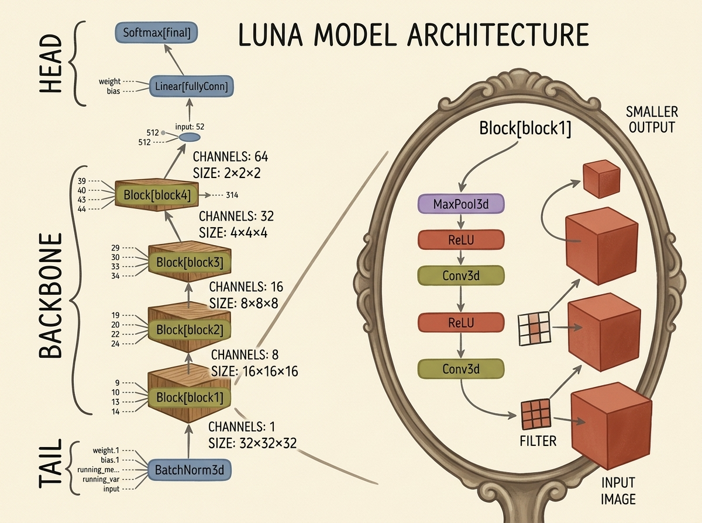
    <figcaption style="margin-top: 0.6em; text-align: center; font-size: 13px; color: #888;"><em>Şekil 5: LunaModel modüler mimarisi. Kuyruk girdiyi normalize eder; Omurga kanal sayısını artırırken vokselleri alt örnekler; Başlık ise aktivasyonları 2 sınıflı olasılık dağılımına dönüştürür.</em></figcaption>
  </div>
</figure>

### 4.3 `LunaBlock` ve `LunaModel` Kodlaması

Modüler blok yapısını tanımlayalım:

```python
class LunaBlock(nn.Module):
    def __init__(self, in_channels, conv_channels):
        super().__init__()

        self.conv1 = nn.Conv3d(
            in_channels, conv_channels, kernel_size=3, padding=1, bias=True
        )
        self.relu1 = nn.ReLU(inplace=True)
        self.conv2 = nn.Conv3d(
            conv_channels, conv_channels, kernel_size=3, padding=1, bias=True
        )
        self.relu2 = nn.ReLU(inplace=True)
        self.maxpool = nn.MaxPool3d(kernel_size=2, stride=2)

    def forward(self, input_batch):
        block_out = self.conv1(input_batch)
        block_out = self.relu1(block_out)
        block_out = self.conv2(block_out)
        block_out = self.relu2(block_out)
        return self.maxpool(block_out)
```

`padding=1` kullanımı sayesinde konvolüsyon katmanları uzamsal boyutları korur; boyut küçültme tamamen `nn.MaxPool3d(2, 2)` katmanına bırakılır.

Şimdi tüm modeli birleştirelim:

```python
class LunaModel(nn.Module):
    def __init__(self):
        super().__init__()

        self.tail_batchnorm = nn.BatchNorm3d(1)

        self.block1 = LunaBlock(1, 8)
        self.block2 = LunaBlock(8, 16)
        self.block3 = LunaBlock(16, 32)
        self.block4 = LunaBlock(32, 64)

        self.head_linear = nn.Linear(64 * 2 * 2 * 2, 2)
        self.head_softmax = nn.Softmax(dim=1)

        self._init_weights()

    def _init_weights(self):
        for m in self.modules():
            if type(m) in {nn.Linear, nn.Conv3d}:
                nn.init.kaiming_normal_(
                    m.weight.data, a=0, mode='fan_out', nonlinearity='relu'
                )
                if m.bias is not None:
                    fan_in, _ = nn.init._calculate_fan_in_and_fan_out(m.weight.data)
                    bound = 1 / (fan_in ** 0.5)
                    nn.init.uniform_(m.bias.data, -bound, bound)

    def forward(self, input_batch):
        bn_output = self.tail_batchnorm(input_batch)

        conv1_out = self.block1(bn_output)
        conv2_out = self.block2(conv1_out)
        conv3_out = self.block3(conv2_out)
        conv4_out = self.block4(conv3_out)

        flattened = conv4_out.view(conv4_out.size(0), -1)
        linear_output = self.head_linear(flattened)

        return linear_output, self.head_softmax(linear_output)
```

`forward` metodunun iki tensör döndürdüğüne dikkat edin:
1. `linear_output` (ham logitler): Doğrudan kayıp fonksiyonuna verilir.
2. `self.head_softmax(linear_output)` (olasılıklar): Metrik hesaplama ve klinik karar eşikleri için kullanılır.

---

## 5. Eğitim ve Doğrulama Motoru

Eğitim döngüsü, gradyan güncellemeli adımlar (`doTraining`) ile gradyansız değerlendirme adımları (`doValidation`) arasında sırayla çalışır.

<figure style="display:flex; justify-content: center; margin: 25px 0;">
  <div style="text-align: center;">
    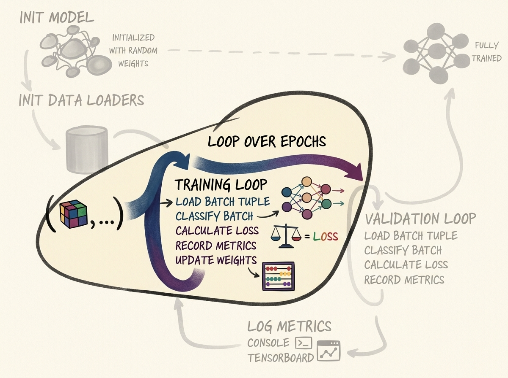
    <figcaption style="margin-top: 0.6em; text-align: center; font-size: 13px; color: #888;"><em>Şekil 7: doTraining içindeki işletim döngüsü. Yığınlar yüklenir, modelden ileri geçirilir, CrossEntropyLoss ile değerlendirilir ve geriye yayılım ile SGD optimizatörü ağırlıkları günceller.</em></figcaption>
  </div>
</figure>

### 5.1 Yığın Kaybının Hesaplanması (`computeBatchLoss`)

PyTorch'un `nn.CrossEntropyLoss` fonksiyonu olasılıklar yerine ham logitleri bekler ve sayısal kararlılık için `nn.LogSoftmax` ile Negatif Log-Olabilirlik (`NLLLoss`) işlemlerini tek potada eritir:

$$ \mathcal{L}\_{\text{batch}} = -\frac{1}{B} \sum\_{i=1}^{B} \log \left( \frac{\exp(z\_{i, y_i})}{\sum\_{c=0}^1 \exp(z\_{i, c})} \right) $$

```python
    def computeBatchLoss(self, batch_ndx, batch_tup, batch_size, trn_metrics_g):
        input_t, label_t, _series_list, _center_list = batch_tup

        input_dev = input_t.to(self.device, non_blocking=True)
        label_dev = label_t.to(self.device, non_blocking=True)

        logits_dev, probability_dev = self.model(input_dev)

        loss_fn = nn.CrossEntropyLoss(reduction='none')
        loss_dev = loss_fn(logits_dev, label_dev)

        loss_bool = loss_dev.detach()
        probability_bool = probability_dev.detach()

        # Örnek başına metrik izleme matrisini güncelle
        start_ndx = batch_ndx * batch_size
        end_ndx = start_ndx + input_t.size(0)

        trn_metrics_g[0, start_ndx:end_ndx] = loss_bool
        trn_metrics_g[1, start_ndx:end_ndx] = probability_bool[:, 1]
        trn_metrics_g[2, start_ndx:end_ndx] = label_dev

        return loss_dev.mean()
```

> [!IMPORTANT]
> Kayıp değerlerini veya tensör çıktılarını metrik dizilerine kaydederken mutlaka `.detach()` çağırın. Canlı bir PyTorch tensörünü saklamak, hesaplama çizgesinin tamamını bellekte kilitler ve kısa sürede bellek taşmasına (`OOM`) yol açar.

### 5.2 Eğitim Döngüsü (`doTraining`)

```python
    def doTraining(self, epoch_ndx, train_dl):
        self.model.train()
        trn_metrics_g = torch.zeros(
            3, len(train_dl.dataset), device=self.device
        )

        for batch_ndx, batch_tup in enumerate(train_dl):
            self.optimizer.zero_grad()

            loss_var = self.computeBatchLoss(
                batch_ndx, batch_tup, train_dl.batch_size, trn_metrics_g
            )

            loss_var.backward()
            self.optimizer.step()

        return trn_metrics_g.to('cpu')
```

### 5.3 Doğrulama Döngüsü (`doValidation`)

Doğrulama aşamasında gradyan hesaplamaları tamamen devre dışı bırakılır:

<figure style="display:flex; justify-content: center; margin: 25px 0;">
  <div style="text-align: center;">
    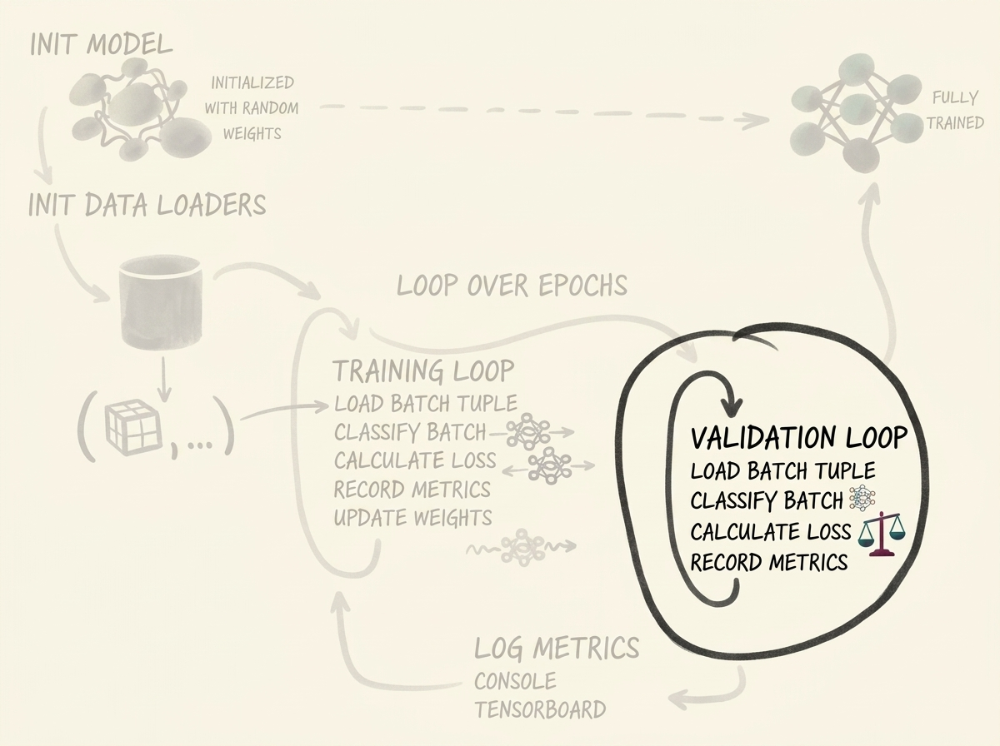
    <figcaption style="margin-top: 0.6em; text-align: center; font-size: 13px; color: #888;"><em>Şekil 8: doValidation döngüsü. İleri geçişler inference_mode altında işletilerek sıfır gradyan maliyetiyle yürütülür ve model ağırlıklarının değişmesi engellenir.</em></figcaption>
  </div>
</figure>

```python
    def doValidation(self, epoch_ndx, val_dl):
        with torch.inference_mode():
            self.model.eval()
            val_metrics_g = torch.zeros(
                3, len(val_dl.dataset), device=self.device
            )

            for batch_ndx, batch_tup in enumerate(val_dl):
                self.computeBatchLoss(
                    batch_ndx, batch_tup, val_dl.batch_size, val_metrics_g
                )

        return val_metrics_g.to('cpu')
```

---

## 6. Metrik Takibi ve Klinik Başarım Raporlaması

<figure style="display:flex; justify-content: center; margin: 25px 0;">
  <div style="text-align: center;">
    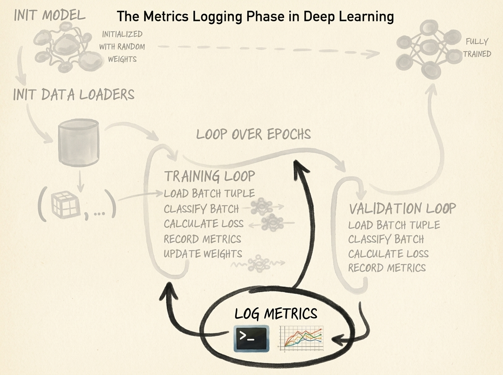
    <figcaption style="margin-top: 0.6em; text-align: center; font-size: 13px; color: #888;"><em>Şekil 9: Metrik loglama adımı. Başarım göstergeleri hata matrisinden türetilir ve eşzamanlı olarak uçbirim konsoluna ve TensorBoard olay günlüklerine aktarılır.</em></figcaption>
  </div>
</figure>

Klinik yapay zeka sistemlerinde genel sınıflandırma doğruluğu (`accuracy`) son derece yanıltıcı bir ölçüttür. Adayların %99.7'sinin nodül olmadığı bir senaryoda, her şeye "nodül değil" ($0$) diyen bir model %99.7 doğruluk elde eder ancak kanser hastalarının %100'ünü gözden kaçırır.

Bu yüzden tam **Hata Matrisini (Confusion Matrix)** kurmalıyız:

| | **Gerçek Pozitif (Nodül)** | **Gerçek Negatif (İyi Huylu)** |
| :---: | :---: | :---: |
| **Tahmin Pozitif** | **Doğru Pozitif (TP)** | **Yanlış Pozitif (FP)** |
| **Tahmin Negatif** | **Yanlış Negatif (FN)** | **Doğru Negatif (TN)** |

Bu matristen klinik teşhis metrikleri hesaplanır:
1. **Duyarlılık / Yakalama Oranı (Recall / Sensitivity):** Gerçek nodüllerin ne kadarını yakaladık?
   $$ \text{Recall} = \frac{\text{TP}}{\text{TP} + \text{FN}} $$
2. **Kesinlik (Precision):** Model nodül dediğinde ne kadar sıklıkla haklı?
   $$ \text{Precision} = \frac{\text{TP}}{\text{TP} + \text{FP}} $$
3. **Özgüllük (Specificity):** İyi huylu dokuyu ne kadar doğru eledik?
   $$ \text{Specificity} = \frac{\text{TN}}{\text{TN} + \text{FP}} $$
4. **$F_1$-Skoru:** Kesinlik ve duyarlılığın harmonik dengesi:
   $$ F_1 = 2 \cdot \frac{\text{Precision} \cdot \text{Recall}}{\text{Precision} + \text{Recall}} $$

`logMetrics` fonksiyonumuzu yazalım:

```python
    def logMetrics(self, epoch_ndx, mode_str, metrics_t):
        negLabel_mask = metrics_t[2] == 0
        posLabel_mask = metrics_t[2] == 1

        negPred_mask = metrics_t[1] < 0.5
        posPred_mask = metrics_t[1] >= 0.5

        trueNeg_count = (negPred_mask & negLabel_mask).sum().item()
        falsePos_count = (posPred_mask & negLabel_mask).sum().item()
        truePos_count = (posPred_mask & posLabel_mask).sum().item()
        falseNeg_count = (negPred_mask & posLabel_mask).sum().item()

        total_count = len(metrics_t[0])
        correct_count = trueNeg_count + truePos_count

        total_pos = truePos_count + falseNeg_count
        total_neg = trueNeg_count + falsePos_count

        recall = truePos_count / (total_pos + 1e-8)
        precision = truePos_count / (truePos_count + falsePos_count + 1e-8)
        f1_score = 2 * (precision * recall) / (precision + recall + 1e-8)

        print(
            f"Epok {epoch_ndx} {mode_str:8s} "
            f"Kayıp: {metrics_t[0].mean():.4f} | "
            f"Doğruluk: {correct_count / total_count * 100:.2f}% | "
            f"Recall: {recall * 100:.2f}% | "
            f"Precision: {precision * 100:.2f}% | "
            f"F1: {f1_score:.4f}"
        )
        print(
            f"      TP: {truePos_count:5d} | FN: {falseNeg_count:5d} | "
            f"TN: {trueNeg_count:5d} | FP: {falsePos_count:5d}"
        )
```

---

## 7. TensorBoard ile Gerçek Zamanlı Telemetri

Eğitim dinamiklerinin görselleştirilmesi, gradyan yok oluşunun veya sapmaların anında tespit edilmesini sağlar. PyTorch'un yerleşik `torch.utils.tensorboard.SummaryWriter` aracını kullanıyoruz.

<figure style="display:flex; justify-content: center; margin: 25px 0;">
  <div style="text-align: center;">
    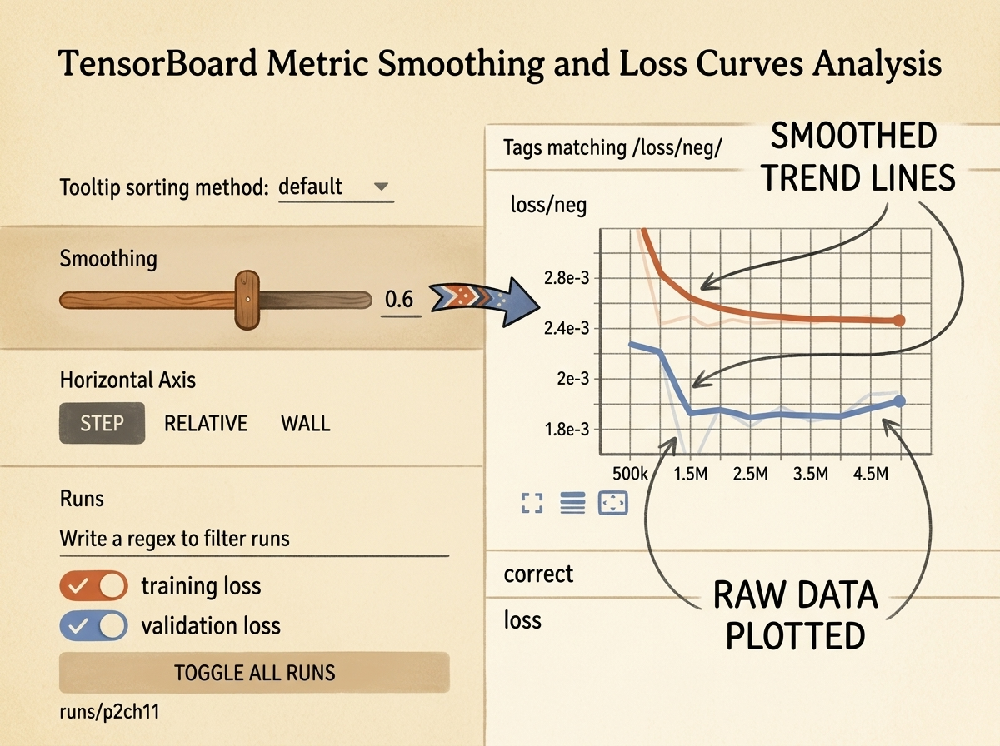
    <figcaption style="margin-top: 0.6em; text-align: center; font-size: 13px; color: #888;"><em>Şekil 10: TensorBoard arayüzü. Yumuşatma (smoothing) kaydırıcısı, stokastik yığın gürültüsünü filtrelemek için üstel hareketli ortalama uygular ve gerçek optimizasyon rotasını açığa çıkarır.</em></figcaption>
  </div>
</figure>

### 7.1 SummaryWriter Kurulumu

```python
from torch.utils.tensorboard import SummaryWriter

    def initTensorboard(self):
        log_dir = f"runs/{self.cli_args.tb_prefix}_{self.time_str}_{self.cli_args.comment}"
        self.trn_writer = SummaryWriter(log_dir=f"{log_dir}_trn")
        self.val_writer = SummaryWriter(log_dir=f"{log_dir}_val")
```

### 7.2 TensorBoard'a Skaler Veri Yazımı

`logMetrics` içinde hesaplanan skalerleri günlüklere aktarırız:

```python
        writer = self.trn_writer if mode_str == 'train' else self.val_writer
        writer.add_scalar('loss/total', metrics_t[0].mean(), epoch_ndx)
        writer.add_scalar('accuracy/overall', correct_count / total_count, epoch_ndx)
        writer.add_scalar('clinical/recall', recall, epoch_ndx)
        writer.add_scalar('clinical/precision', precision, epoch_ndx)
        writer.add_scalar('clinical/f1_score', f1_score, epoch_ndx)
        writer.flush()
```

---

## 8. Doğruluk Yanılsaması: %99.7 Başarı ve Tam Bir Klinik Felaket

`LunaTrainingApp` çalıştırıldığında konsol ilk bakışta zafer gibi görünen bir tablo çizer:

```text
Epok 1 train    Kayıp: 0.0241 | Doğruluk: 99.74% | Recall: 0.00% | Precision: 0.00% | F1: 0.0000
      TP:     0 | FN:  1351 | TN: 548649 | FP:     0
Epok 1 val      Kayıp: 0.0238 | Doğruluk: 99.76% | Recall: 0.00% | Precision: 0.00% | F1: 0.0000
      TP:     0 | FN:   149 | TN:  61251 | FP:     0
```

### 8.1 Felaketin Anatomisi

1. **Rakamlar:**
   - Model kağıt üzerinde muazzam bir **%99.74 genel doğruluk** yakalamıştır.
   - Ancak gerçek nodüle sahip $1{,}351$ hastadan **tam olarak 0 (Sıfır TP, 1351 FN)** tanesini tespit edebilmiştir.
   - **Duyarlılık / Recall = %0.00**.

2. **Gradyan İnişi Neden Bu Tuzağa Düştü?**
   $32$ boyutundaki standart bir mini-yığını inceleyelim:
   $$ \text{Yığın Başına Beklenen Nodül Sayısı} = 32 \times \frac{1{,}351}{550{,}000} \approx 0.078 \text{ nodül} $$
   GPU'ya giren her $100$ yığından yaklaşık $92$ tanesi **yalnızca negatif (nodül olmayan) örnekler** içerir.
   
   Geriye yayılım yığın boyunca gradyan vektörlerini topladığında:
   $$ \nabla\_{\mathbf{w}} \mathcal{L} = \frac{1}{B} \sum\_{i=1}^B \nabla\_{\mathbf{w}} \ell(f(\mathbf{x}\_i), y_i) $$
   Negatif örnekler ($y_i = 0$), çıktıyı $[1.0, 0.0]$ noktasına çeker. Negatif örnek sayısı pozitiflerden $400$ kat fazla olduğu için, negatif gradyanların toplamı pozitif gradyan sinyalini tamamen ezer ve yok eder.
   
   Optimizatör en az dirençli yolu seçerek yerel bir minimuma kilitlenir: **her şeye sıfır (negatif) de!**

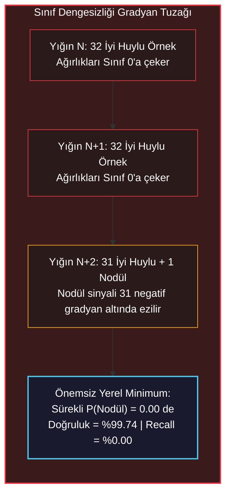

### 8.2 Çözüm Yolu: Bölüm 2.6'ya (Kitap 14. Bölüm) Bakış

Bu doğruluk paradoksunu aşmak için veri yükleme mekanizmasını baştan kurgulamamız gerekir:
1. **Dengeli Tabakalı Örnekleme (Balanced Stratified Sampling):** Her eğitim yığınına zorunlu olarak eşit oranda pozitif ve negatif örnek koyarak ($1:1$ veya $1:3$), pozitif gradyanların ağırlık güncellemelerinde eşit söz sahibi olmasını sağlamak.
2. **3B Hacimsel Veri Artırma (3D Data Augmentation):** Gerçek nodüller nadir olduğu için ($1{,}351$), 3B uzayda rastgele döndürme, aynalama, ölçekleme ve öteleme ile yapay varyasyonlar üreterek ezberlemeyi (`overfitting`) engellemek.

---

## 9. Özet ve Mühendislik İlkeleri

1. **3B Konvolüsyon Hacimsel Bağlamı Korur:** `nn.Conv3d` katmanı derinlik, yükseklik ve genişliği eşzamanlı işler; alıcı alanı 3 boyutta büyütür ancak kübik parametre ve VRAM maliyeti getirir.
2. **Uygulamayı Modüler OOP ile Tasarlayın:** Başlatma (`initModel`), harmanlama (`initDataLoaders`), kayıp hesabı (`computeBatchLoss`) ve metrik takibini (`logMetrics`) ayırmak kod tabanını ölçeklenebilir kılar.
3. **Sıfır Veri Sızıntısı:** Eğitim ve doğrulama kümelerini rastgele aday yamaları yerine hasta kimliğine (`series_uid`) göre ayırın.
4. **Dengesiz Veride Doğruluk Ölçütü Ölümcüldür:** Seyrek olay tespitinde yüksek doğruluk modeli felç eden bir yanılsamadır. Sistemler mutlaka Hata Matrisi, Recall, Precision ve $F_1$-skoru ile değerlendirilmelidir.
