# Çoklu GPU'larda Model Eğitimi

<!-- toc -->

---

## 1. Tek Bir GPU'nun Ötesine Geçmek: Dağıtık Hesaplama Zorunluluğu

Bölüm 2.3'ten Bölüm 2.7'ye kadar olan çalışmamızda akciğer kanseri taraması için uçtan uca klinik bir bilgisayar destekli tespit (CAD) boru hattı inşa ettik. Ham 3D BT (CT) taramalarından kalibre edilmiş Hounsfield birimi tensörleri çıkardık, aday nodül öneren segmentasyon modelleri geliştirdik ve 3 boyutlu konvolüsyonel sınıflandırma ağları eğittik. Bu deneylerin tamamında model parametreleri, ara aktivasyon tensörleri ve autograd dinamik hesaplama grafiği **tek bir grafik işlem birimi (GPU)** üzerinde çalıştırıldı.

Ancak modern derin öğrenme mühendisliği hızla temel fiziksel donanım sınırlarına çarpmaktadır:
1. **Hacimsel ve Uzamsal VRAM Sınırları:** Bölüm 2.7'de tam ölçekli 3D BT taramalarını ($512 \times 512 \times 400$ voksel) tek bir hızlandırıcıda işlemek, bizi 16 GB ila 80 GB VRAM sınırları nedeniyle ya hacmi 2D eksenel dilimlere bölmeye ya da 3D aday kırpmalarını $32 \times 48 \times 48$ gibi küçük alt hacimlerle kısıtlamaya mecbur bıraktı.
2. **Hesaplama Gecikmesi ve Duvar Saati Darboğazı:** Vision Transformer'lar veya derin 3D yoğun ağlar gibi büyük mimarileri yüzlerce gigabaytlık medikal veri üzerinde tek bir GPU ile eğitmek günler veya haftalar sürmektedir.
3. **Parametre Ayak İzi Patlaması:** Modern temel modeller, difüzyon mimarileri (Bölüm 2.2) ve üretken transformer'lar (Bölüm 2.1) 7 milyardan yüzlerce milyar parametreye kadar uzanmaktadır. Model ağırlıklarını, AdamW optimizatör durumlarını ve ileri yön aktivasyonlarını saklamak yüzlerce gigabayt yüksek bant genişlikli bellek (HBM) gerektirir; bu da tek bir hızlandırıcının kapasitesini katbekat aşar.

Mühendislik iş akışlarımızı tek cihaz sınırlarının ötesine taşımak için **Dağıtık Derin Öğrenme (Distributed Deep Learning)** mimarilerine geçmek zorundayız. Bölüm 2.8'de, eğitimi birden çok GPU ve çoklu sunucu düğümleri (nodes) arasında koordine etmek için gereken matematiksel temelleri, kolektif iletişim primitiflerini ve sistem mimarilerini derinlemesine inceliyoruz.

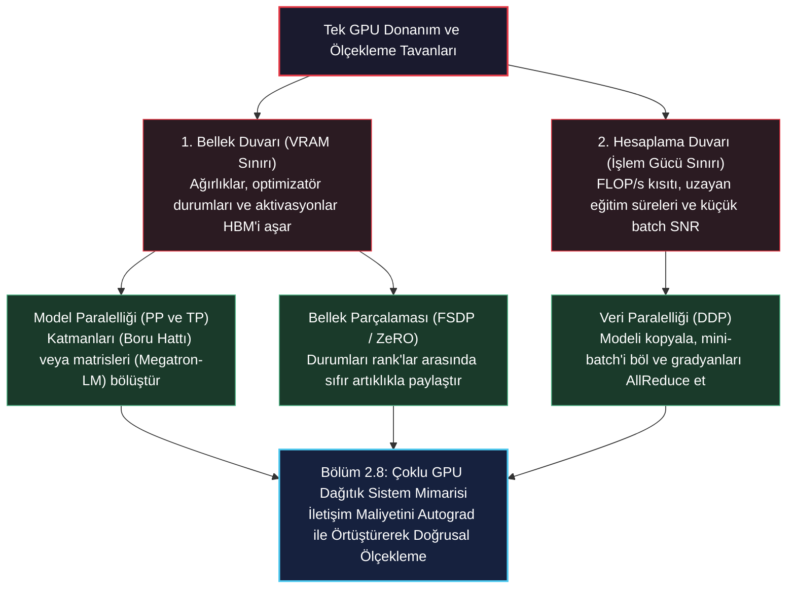

> **Önemli Çıkarım:** Dağıtık derin öğrenme, özünde **hesaplama verimliliği** ile **cihazlar arası iletişim maliyeti** arasındaki değiş tokuşu (trade-off) yönetme sanatıdır. Doğrusal ölçekleme elde etmek, tensör iletişimini autograd geriye yayılım hesaplamasıyla doğrudan örtüştürmeyi (overlapping) zorunlu kılar.

---

## 2. Dağıtık Hesaplama Temelleri ve Topoloji

Dağıtık PyTorch koduna geçmeden önce, hesaplama topolojilerini, süreç hiyerarşilerini ve donanım ara bağlantılarını tanımlayan kesin bir terminoloji oluşturmalıyız.

<figure style="display:flex; justify-content: center; margin: 25px 0;">
  <div style="text-align: center;">
    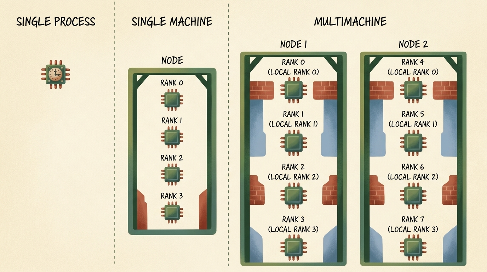
    <figcaption style="margin-top: 0.6em; text-align: center; font-size: 13px; color: #888;"><em>Şekil 1: Dağıtık işlemci topolojileri. Sol: İzole tek bir işlemci üzerinde tek süreçli çalışma. Orta: Tek bir makine (Node) içerisinde 4 yerel rank'a (Rank 0 - 3) sahip çoklu GPU kurulumu. Sağ: Düğüm 1 (Rank 0–3, Yerel Rank 0–3) ve Düğüm 2'yi (Rank 4–7, Yerel Rank 0–3) kapsayan çoklu makine kümesi.</em></figcaption>
  </div>
</figure>

### 2.1 Temel Terminoloji: World Size, Rank ve Yerel Rank

Dağıtık bir PyTorch programı, bir iletişim ağı üzerinde birlikte çalışan bağımsız işletim sistemi süreçlerinden oluşan bir küme olarak yürütülür:

- **Düğüm (Node / Makine):** Kendi CPU soketlerine, sistem RAM belleğine, ağ arabirim kartlarına (NIC) ve bir veya daha fazla GPU barındıran PCIe yuvalarına sahip bağımsız bir fiziksel sunucu kasası.
- **World Size ($W$):** Tüm dağıtık kümede çalışan toplam katılımcı işçi süreç sayısı. Eğer bir kümede her birinde $G$ adet GPU bulunan $N$ adet sunucu varsa, toplam dünya boyutu:

$$ W = N \times G $$

- **Rank ($r$):** Dağıtık gruptaki her bir sürece atanan benzersiz küresel tam sayı tanımlayıcısı:

$$ r \in \{0, 1, 2, \dots, W - 1\} $$

  $r = 0$ süreci geleneksel olarak **Master Rank** (Ana Süreç) olarak adlandırılır; iletişim buluşmasını koordine etmekten, global metrikleri kaydetmekten ve kontrol noktası (checkpoint) dosyalarını diske yazmaktan sorumludur.
- **Yerel Rank (Local Rank - $l$):** Bir işçi sürecin yalnızca üzerinde çalıştığı fiziksel düğüm içerisindeki sıfır tabanlı yerel sıra numarası:

$$ l \in \{0, 1, \dots, G - 1\} $$

  Örneğin her birinde 4 GPU bulunan 2 düğümlü bir kümede ($W = 8$), Düğüm 2 üzerindeki küresel sıra numarası $r = 5$ olan sürecin yerel sıra numarası $l = 1$'dir; bu da o fiziksel anakart üzerindeki donanımsal `cuda:1` cihazına doğrudan eşlenir.

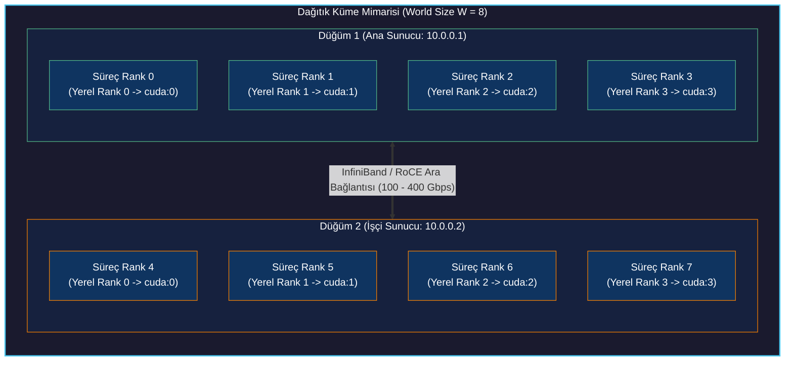

### 2.2 Donanım Ara Bağlantıları: NVLink, PCIe ve InfiniBand

Fiziksel ara bağlantı teknolojisinin bant genişliği ve gecikme süresi, hangi dağıtık paralellik stratejisinin uygulanabilir olduğunu doğrudan belirler:

| Ara Bağlantı Teknolojisi | Fiziksel Kapsam | Tek Yönlü Bant Genişliği | Tipik Gecikme (Latency) | İdeal Paralellik Stratejisi |
| :--- | :--- | :--- | :--- | :--- |
| **PCIe Gen4 / Gen5** | Düğüm İçi (Anakart Veri Yolu) | $32\text{--}64\text{ GB/s}$ | $\sim 1\text{--}2\ \mu\text{s}$ | Veri Paralelliği (DDP) |
| **NVIDIA NVLink / NVSwitch** | Düğüm İçi (Özel GPU Ağı) | $300\text{--}900\text{ GB/s}$ | $< 1\ \mu\text{s}$ | Tensör Paralelliği (TP), FSDP |
| **InfiniBand (HDR/NDR) / RoCE** | Düğümler Arası (Ağ Dokusu) | $25\text{--}50\text{ GB/s}$ ($200\text{--}400\text{ Gbps}$) | $\sim 2\text{--}5\ \mu\text{s}$ | Veri Paralelliği (DDP), Boru Hattı (PP) |
| **Standart Ethernet (1GbE/10GbE)**| Düğümler Arası (Standart LAN) | $0.125\text{--}1.25\text{ GB/s}$ | $\sim 50\text{--}100\ \mu\text{s}$ | Asenkron Eğitim, Küçük DDP |

---

## 3. Süreç Yaşam Döngüsü ve Başlatma: `mp.spawn`'dan `torchrun`'a

Tek cihazlı bir Python betiğini dağıtık bir küme yürütmesine dönüştürmek üç aşamalı bir yaşam döngüsünü takip eder: süreçlerin oluşturulması, iletişim buluşması (rendezvous) ve dağıtık farkındalıklı eğitim mantığı.

<figure style="display:flex; justify-content: center; margin: 25px 0;">
  <div style="text-align: center;">
    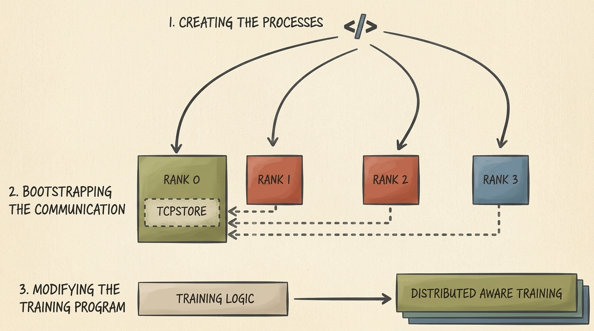
    <figcaption style="margin-top: 0.6em; text-align: center; font-size: 13px; color: #888;"><em>Şekil 2: Dağıtık başlatma yaşam döngüsü. 1. Her rank için bağımsız işletim sistemi süreçlerinin oluşturulması. 2. Rank 0 üzerindeki paylaşımlı bir anahtar-değer deposu (TCPStore) aracılığıyla iletişimin kurulması (bootstrapping). 3. Standart ardışık eğitim mantığının dağıtık farkındalıklı replike yürütmeye dönüştürülmesi.</em></figcaption>
  </div>
</figure>

### 3.1 Adım 1 & 2: Süreç Oluşturma ve TCPStore Buluşması

Python'da, Küresel Yorumlayıcı Kilidi'ni (GIL) aşmak için katılan her rank'ın bağımsız bir işletim sistemi sürecinde çalışması gerekir. İlk PyTorch dağıtık uygulamalarında geliştiriciler `torch.multiprocessing` modülünü kullanıyordu.

Aşağıdaki kod, `torch.multiprocessing.spawn` kullanarak 4 süreç başlatır ve ana düğümde bir `dist.TCPStore` kurarak diğer süreçlerin ağ adreslerini kaydetmesini sağlar:

```python
import os
import torch
import torch.distributed as dist
import torch.multiprocessing as mp

def init_process_with_store(rank: int, world_size: int, backend: str = "gloo"):
    """
    TCPStore buluşması kullanarak dağıtık bir süreç grubunu manuel olarak başlatır.
    Süreçler Rank 0'ın barındırdığı MASTER_ADDR:MASTER_PORT adresine bağlanır.
    """
    master_addr = os.environ.get("MASTER_ADDR", "localhost")
    master_port = int(os.environ.get("MASTER_PORT", "12355"))
    
    # Süreç grubu buluşması için anahtar-değer deposunu oluştur
    store = dist.TCPStore(
        host_name=master_addr,
        port=master_port,
        world_size=world_size,
        is_master=(rank == 0)
    )
    
    # Varsayılan dağıtık süreç grubunu ilklendir
    dist.init_process_group(
        backend=backend,
        store=store,
        rank=rank,
        world_size=world_size
    )
    
    print(f"[Rank {rank}/{world_size}] Başarıyla ilklendirildi. Backend: {backend}")
    
    # Tüm süreçlerin hazır olduğunu doğrulamak için senkronize ol
    dist.barrier()
    
    # Çalışma bittiğinde iletişim kanallarını serbest bırak
    dist.destroy_process_group()

if __name__ == "__main__":
    num_processes = 4
    os.environ["MASTER_ADDR"] = "localhost"
    os.environ["MASTER_PORT"] = "12355"
    
    # mp.spawn, ilk argüman olarak otomatik biçimde süreç indeksini (0'dan num_processes - 1'e) aktarır
    mp.spawn(
        init_process_with_store,
        args=(num_processes, "gloo"),
        nprocs=num_processes,
        join=True
    )
```

### 3.2 Adım 3: Modern Dağıtık Yürütme: `torchrun`

`mp.spawn` düşük seviyeli süreç yönetimini anlamak için öğretici olsa da, modern üretim ortamlarında PyTorch'un resmi CLI aracı olan **`torchrun`** kullanılır.

`torchrun`, manuel store başlatma kodlarını ortadan kaldırır, donanım hızlandırıcıları otomatik algılar, küme ortam değişkenlerini (`RANK`, `LOCAL_RANK`, `WORLD_SIZE`, `MASTER_ADDR`, `MASTER_PORT`) otomatik enjekte eder ve çöken işçileri yeniden başlatan elastik hata toleransı sağlar:

```bash
# Tek makinede 4 süreçli bir dağıtık eğitim başlatma
torchrun --standalone --nproc-per-node=4 train_distributed.py

# 2 düğümlü bir kümede Düğüm 1 üzerinde çalıştırma
torchrun --nproc-per-node=8 \
         --nnodes=2 \
         --node-rank=0 \
         --master-addr="10.0.0.1" \
         --master-port=29500 \
         train_distributed.py
```

`train_distributed.py` içerisinde başlatma mantığı son derece yalın bir hale gelir:

```python
import os
import torch
import torch.distributed as dist

def init_distributed():
    """
    torchrun tarafından enjekte edilen ortam değişkenlerini okuyan standart üretim başlatması.
    """
    # CUDA varsa 'nccl', aksi halde 'gloo' backend seçilir
    backend = "nccl" if torch.cuda.is_available() else "gloo"
    dist.init_process_group(backend=backend)
    
    local_rank = int(os.environ["LOCAL_RANK"])
    global_rank = int(os.environ["RANK"])
    world_size = int(os.environ["WORLD_SIZE"])
    
    if torch.cuda.is_available():
        # Mevcut süreci fiziksel yerel GPU cihazına bağla
        torch.cuda.set_device(local_rank)
        device = torch.device(f"cuda:{local_rank}")
    else:
        device = torch.device("cpu")
        
    print(f"[Rank {global_rank}/{world_size}] Yerel hızlandırıcıya bağlandı: {device}")
    return device, global_rank, local_rank, world_size
```

### 3.3 İletişim Motorları: NCCL ve Gloo

`dist.init_process_group` çağrısındaki `backend` parametresi, arka plandaki veri iletim motorunu belirler:
- **`nccl` (NVIDIA Collective Communications Library):** GPU'dan GPU'ya iletişimde endüstri standardıdır. NVLink ve InfiniBand üzerinden donanım hızlandırmalı Ring-AllReduce ve Tree-AllReduce algoritmalarını GPUDirect RDMA (ana CPU belleğini atlayarak doğrudan GPU HBM'ler arası aktarım) ile çalıştırır.
- **`gloo`:** Meta tarafından geliştirilmiş taşınabilir iletişim kütüphanesidir. CPU kümeleri veya yerel NCCL desteği bulunmayan ortamlar (örneğin Windows yerel ortamı) için zorunludur. Gloo GPU tensörlerini desteklese de verileri önce CPU RAM'ine kopyalayıp ardından aktardığı için PCIe gecikme darboğazı yaratır.

---

## 4. Kolektif İletişim Primitifleri (Collective Communication)

Dağıtık derin öğrenme algoritmaları gelişigüzel noktadan noktaya (point-to-point) mesajlaşmalar yerine, matematiksel olarak yapılandırılmış **Kolektif Operasyonlar (Collectives)** üzerinden çalışır. Aktif süreç grubundaki tüm rank'lar bu işlemlere eşzamanlı olarak katılır.

<figure style="display:flex; justify-content: center; margin: 25px 0;">
  <div style="text-align: center;">
    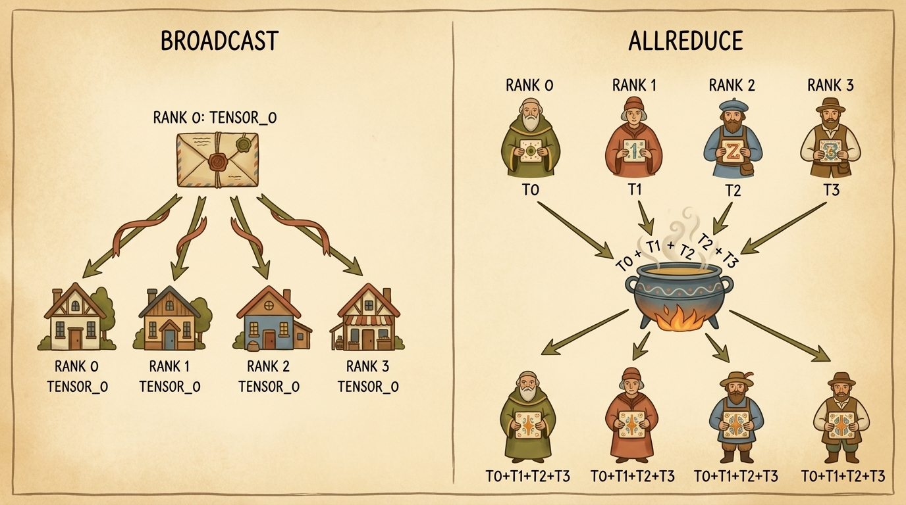
    <figcaption style="margin-top: 0.6em; text-align: center; font-size: 13px; color: #888;"><em>Şekil 3: Temel kolektif iletişim primitifleri. Sol: Broadcast işlemi, kök rank'tan (Rank 0) gelen bir tensörü gruptaki tüm işçi düğümlere yayınlar. Sağ: AllReduce işlemi, tüm rank'lardan tensörleri (T0, T1, T2, T3) toplar, bir indirgeme operatörü (toplama) uygular ve indirgenmiş toplam sonucunu tüm rank'lara eşzamanlı olarak dağıtır.</em></figcaption>
  </div>
</figure>

### 4.1 Broadcast ve AllReduce: Mekanizma ve Matematik

Yukarıdaki şekilde görselleştirilen iki primitif, eğitim mimarisinde hayati roller oynar:

#### 1. Broadcast (Bire-Çok Yayın)
Belirlenen tek bir kök süreç (`src=0`), sahip olduğu yerel tensörü ($\mathbf{T}\_0$) gruptaki tüm süreçlere kopyalar:

$$ \mathbf{T}\_r \leftarrow \mathbf{T}\_{\text{src}}, \quad \forall r \in \{0, \dots, W-1\} $$

*Temel Görevi:* Eğitimin 0. epokunda rastgele ilklendirilen model ağırlıklarını ($\theta\_0$) tüm işçilere dağıtarak her GPU'nun kesinlikle aynı ağırlık uzayından başlamasını garanti etmek.

#### 2. AllReduce (Hepsinden-Hepsine İndirgeme)
Her rank kendi yerel tensörüyle ($\mathbf{T}\_r$) başlar. Belirtilen birleşimli (associative) indirgeme operatörü $\oplus$ (örneğin toplama $\sum$ veya ortalama) ile tensörler eleman bazında birleştirilir ve sonuç ($\mathbf{T}^*$) tüm rank'lara geri yazılır:

$$ \mathbf{T}^* = \bigoplus\_{r=0}^{W-1} \mathbf{T}\_r = \sum\_{r=0}^{W-1} \mathbf{T}\_r $$

$$ \mathbf{T}\_r \leftarrow \mathbf{T}^*, \quad \forall r \in \{0, \dots, W-1\} $$

*Temel Görevi:* Her geri yayılım (backward pass) adımından sonra tüm veri paraleli kopyalar arasındaki gradyan tensörlerini ($\nabla\_\theta \mathcal{L}$) senkronize etmek.

### 4.2 Ring-AllReduce Algoritması ve Bant Genişliği Dengesi

Tüm rank'ların verilerini Rank 0'a gönderip orada toplayıp geri dağıtmak, Rank 0 üzerinde yıkıcı bir ağ darboğazı oluşturur. Modern dağıtık sistemler **Ring-AllReduce** algoritmasını kullanır:

1. Kümedeki $W$ rank mantıksal olarak tek yönlü bir halka halinde dizilir: $\text{Rank } 0 \to \text{Rank } 1 \to \dots \to \text{Rank } (W-1) \to \text{Rank } 0$.
2. Boyutu $M$ eleman olan tensör, $W$ eşit parçaya bölünür: $\mathbf{T} = [C_0, C_1, \dots, C_{W-1}]$, her bir parçanın boyutu $\frac{M}{W}$'dır.
3. **Scatter-Reduce Aşaması ($W-1$ adım):** $k$. adımda her rank $r$, elindeki bir parçayı sağındaki komşusuna ($r+1$) iletirken solundaki komşusundan ($r-1$) bir parça alır ve yerel parçasıyla toplar. $W-1$ adım sonunda her rank, parçalardan birinin tam toplamına sahip olur.
4. **AllGather Aşaması ($W-1$ adım):** Her rank tam toplanmış olan parçayı halka boyunca dolaştırarak tüm rank'ların eksiksiz toplanmış tensöre ulaşmasını sağlar.

Her bir GPU'nun her iki aşamada aktardığı toplam veri miktarı:

$$ \text{Aktarılan Veri} = 2 \times \frac{W - 1}{W} \times M \approx 2M \quad (\text{as } W \to \infty) $$

> **Kritik Mimari Çıkarım:** Ring-AllReduce algoritmasında GPU başına aktarılan veri hacmi **kümedeki GPU sayısından ($W$) tamamen bağımsızdır**! Kümeye yeni GPU'lar eklemek GPU başına düşen ağ yükünü artırmaz; bu sayede neredeyse mükemmel zayıf ölçekleme (weak scaling) elde edilir.

### 4.3 PyTorch ile Kolektif İletişim Uygulaması

Aşağıdaki kod parçası, rank'lar arasında broadcast ve all_reduce işlemlerini yürütür:

```python
import torch
import torch.distributed as dist

def run_collectives_demo(rank: int, world_size: int, device: torch.device):
    """
    PyTorch üzerinde broadcast ve all_reduce kolektif iletişimlerini test eder.
    """
    # 1. Broadcast Gösterimi
    if rank == 0:
        # Rank 0 kesin yayın verisini üretir
        payload = torch.tensor([42.0, 99.0, 108.0], dtype=torch.float32, device=device)
    else:
        # Diğer rank'lar aynı boyut ve tipte sıfırlanmış alıcı bellek ayırır
        payload = torch.zeros(3, dtype=torch.float32, device=device)
        
    print(f"Broadcast Öncesi [Rank {rank}]: {payload}")
    
    # src=0'dan gruptaki tüm süreçlere yayınla
    dist.broadcast(payload, src=0)
    print(f"Broadcast Sonrası [Rank {rank}]: {payload}")
    
    dist.barrier()
    
    # 2. AllReduce Gösterimi
    # Her rank kendi sırasına bağlı benzersiz bir tensör oluşturur
    local_tensor = torch.tensor([float(rank) + 1.0, float(rank) * 10.0], device=device)
    print(f"AllReduce Öncesi [Rank {rank}]: {local_tensor}")
    
    # Tüm rank'lardaki elemanları topla ve toplamı herkese dağıt
    dist.all_reduce(local_tensor, op=dist.ReduceOp.SUM)
    print(f"AllReduce TOPLAM Sonrası [Rank {rank}]: {local_tensor}")
    
    # Global ortalama için dünya boyutuna böl
    local_tensor /= world_size
    print(f"Global Ortalama [Rank {rank}]: {local_tensor}")
```

---

## 5. Veri Paralelliği ve `DistributedDataParallel` (DDP)

Veri Paralelliği, derin öğrenmede en yaygın ve verimli ölçekleme yaklaşımıdır. Bu yöntemde **modelin birebir kopyası her GPU'ya yerleştirilir**, küresel eğitim veri kümesi ise ayrık (disjoint) mini-batch'ler halinde GPU'lara dağıtılır.

<figure style="display:flex; justify-content: center; margin: 25px 0;">
  <div style="text-align: center;">
    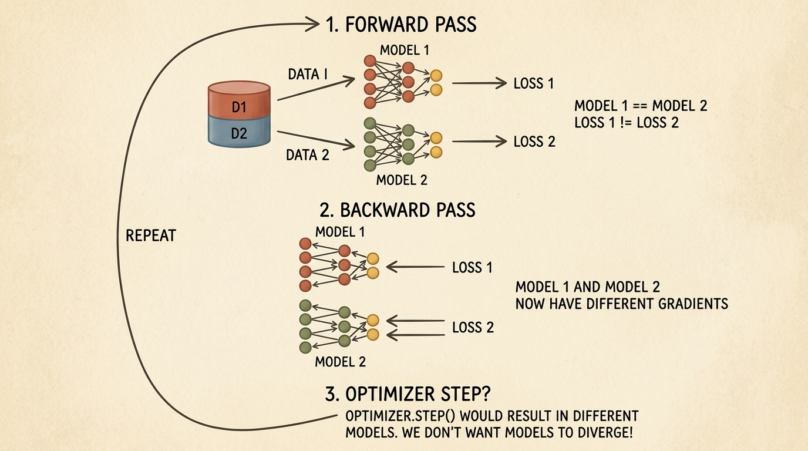
    <figcaption style="margin-top: 0.6em; text-align: center; font-size: 13px; color: #888;"><em>Şekil 4: Veri Paralelliğindeki temel ikilem. İki özdeş model kopyası farklı veri paketlerini (D1 ve D2) işlediğinde, farklı kayıp değerleri (Loss 1 != Loss 2) ve farklı gradyanlar üretir. İletişim olmadan doğrudan optimizer.step() çağrılırsa modeller birbirinden koparak hızla ıraksar (divergence).</em></figcaption>
  </div>
</figure>

### 5.1 Gradyan Iraksaması Sorunu

İki işçi cihaz olduğunu varsayalım ($W = 2$). $t$ adımında her iki model de özdeş $\theta\_t$ ağırlıklarına sahiptir:
- 1. İşçi $\mathcal{B}\_1 \sim \mathcal{D}$ mini-batch'ini alır, $\mathcal{L}\_1(\theta\_t; \mathcal{B}\_1)$ kaybını ve $\mathbf{g}\_1 = \nabla\_\theta \mathcal{L}\_1$ gradyanlarını hesaplar.
- 2. İşçi $\mathcal{B}\_2 \sim \mathcal{D}$ mini-batch'ini alır, $\mathcal{L}\_2(\theta\_t; \mathcal{B}\_2)$ kaybını ve $\mathbf{g}\_2 = \nabla\_\theta \mathcal{L}\_2$ gradyanlarını hesaplar.

$\mathcal{B}\_1 \neq \mathcal{B}\_2$ olduğu için üretilen gradyanlar farklıdır:

$$ \mathbf{g}\_1 \neq \mathbf{g}\_2 $$

Eğer her işçi kendi ağırlıklarını bu gradyanlarla güncellerse (örneğin $\theta\_{t+1}^{(i)} = \theta\_t - \eta \mathbf{g}\_i$), modeller hemen bir sonraki adımda birbirinden kopar:

$$ \theta\_{t+1}^{(1)} \neq \theta\_{t+1}^{(2)} $$

Büyük tek GPU'lu bir eğitimle ($B\_{\text{global}} = W \times B\_{\text{local}}$) matematiksel denkliği korumak için, her ağırlık güncellemesinden önce gradyanların AllReduce ortalaması alınmalıdır:

$$ \bar{\mathbf{g}} = \frac{1}{W} \sum\_{i=1}^W \mathbf{g}\_i $$

$$ \theta\_{t+1} = \theta\_t - \eta \bar{\mathbf{g}} $$

### 5.2 `DistributedDataParallel` (DDP) İç Mimarisi

PyTorch iki veri paraleli sarmalayıcı sunar: `torch.nn.DataParallel` (DP) ve `torch.nn.parallel.DistributedDataParallel` (DDP).

> [!WARNING]
> **`torch.nn.DataParallel` Asla Kullanılmamalıdır:** `DataParallel`, Python GIL'ine takılan tek süreçli, çok iş parçacıklı eski bir yapıdır. Kaybı hesaplamak için tüm çıktıları GPU 0'da toplar; bu da GPU 0'da aşırı bellek birikimine ve PCIe darboğazına yol açar. Her zaman çok süreçli **`DistributedDataParallel` (DDP)** kullanılmalıdır.

DDP'nin üstün performansı iki temel mekanizmaya dayanır:
1. **Autograd Kancaları ve İletişim Örtüştürme (Overlapping):** Geri yayılımın tamamının bitmesini beklemek yerine, DDP katman parametrelerine geri yayılım kancaları (hooks) takar. Bir katmanın gradyanı hesaplandığı anda DDP hemen arka planda non-blocking bir AllReduce çağrısı başlatır; ağ veriyi aktarırken GPU önceki katmanların gradyanlarını hesaplamaya devam eder.
2. **Gradyan Kovalaması (Gradient Bucketing):** Milyonlarca küçük tensörü ayrı ayrı aktarmak ağ gecikmesini patlatır. DDP parametreleri bellek üzerinde bitişik **kovalarda (buckets)** (tipik olarak 25 MB) gruplar. Bir kova dolduğunda tek bir AllReduce operasyonu tetiklenir.

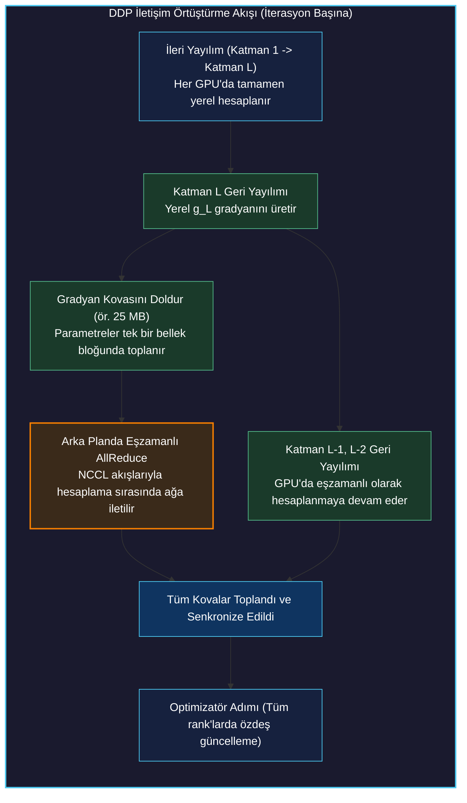

### 5.3 `DistributedSampler` ile Veri Bölümleme

Her GPU'nun veri kümesinden farklı örnekler almasını sağlamak için `Dataset`, `torch.utils.data.distributed.DistributedSampler` ile sarılır.

Sampler veri kümesi indekslerini $W$ parçaya böler. Her epok başında `sampler.set_epoch(epoch)` çağrılması, karıştırma tohumunu epok bazında deterministik olarak yeniler:

```python
import torch
import torch.nn as nn
from torch.utils.data import Dataset, DataLoader
from torch.utils.data.distributed import DistributedSampler
from torch.nn.parallel import DistributedDataParallel as DDP

def setup_ddp_training(rank: int, world_size: int, device: torch.device, dataset: Dataset):
    """
    DistributedSampler ile tam bir DDP eğitim döngüsü kurar.
    """
    # 1. Modeli oluştur ve atanmış yerel GPU'ya taşı
    model = nn.Sequential(
        nn.Linear(128, 256),
        nn.ReLU(),
        nn.Linear(256, 10)
    ).to(device)
    
    # 2. Modeli DDP ile sar
    ddp_model = DDP(
        model,
        device_ids=[device.index] if device.type == "cuda" else None,
        output_device=device.index if device.type == "cuda" else None,
        find_unused_parameters=False
    )
    
    # 3. Veri setini rank'lara paylaştıran DistributedSampler
    sampler = DistributedSampler(
        dataset,
        num_replicas=world_size,
        rank=rank,
        shuffle=True,
        drop_last=True
    )
    
    # batch_size GPU BAŞINA düşen örnek sayısını belirtir
    loader = DataLoader(
        dataset,
        batch_size=32,
        sampler=sampler,
        num_workers=4,
        pin_memory=True
    )
    
    optimizer = torch.optim.AdamW(ddp_model.parameters(), lr=1e-3)
    criterion = nn.CrossEntropyLoss()
    
    # 4. Epok tohumlamalı eğitim döngüsü
    for epoch in range(5):
        # Zorunlu: Her epokta rastgele karıştırma sırasını tüm rank'lar için senkronize eder
        sampler.set_epoch(epoch)
        ddp_model.train()
        
        for batch_idx, (inputs, targets) in enumerate(loader):
            inputs = inputs.to(device, non_blocking=True)
            targets = targets.to(device, non_blocking=True)
            
            optimizer.zero_grad()
            outputs = ddp_model(inputs)
            loss = criterion(outputs, targets)
            
            # Autograd geri yayılım: DDP kancaları otomatik kovalanmış AllReduce tetikler
            loss.backward()
            
            # Tüm gradyanlar artık tüm rank'larda matematiksel olarak özdeştir
            optimizer.step()
```

---

## 6. Model Paralelliği: Dev Mimarileri Cihazlara Bölmek

Veri paralelliği tüm modeli her GPU'ya kopyalarken, modern derin öğrenme mimarileri çoğunlukla tek bir GPU'nun bellek sınırlarını aşar.

### 6.1 GPU Bellek Tüketim Kalemleri

Eğitim esnasında GPU belleği (HBM) 4 ana havuz tarafından tüketilir:
1. **Model Parametreleri ($\Phi$):** 32-bit kayan nokta (FP32) ağırlıklar parametre başına $4\Phi$ bayt (FP16/BF16'da $2\Phi$ bayt) yer kaplar.
2. **Autograd Gradyanları:** Model parametreleriyle aynı boyutta bellek gerektirir (FP32'de $4\Phi$ bayt).
3. **Optimizatör Durumları:** Standart AdamW optimizatörü her parametre için iki 32-bit takip momenti ($m\_t$ ve $v\_t$) ve FP32 ana ağırlıkları tutar; toplamda **$12\Phi$ ila $16\Phi$ bayt** tüketir!
4. **Ara Aktivasyonlar:** Geri yayılım gradyanlarını hesaplamak için saklanan tüm ileri yön tensörleri.

7 milyar parametreli ($7\text{B}$) bir model için:

$$ \text{Statik Bellek} \approx 4\Phi (\text{param}) + 4\Phi (\text{grad}) + 12\Phi (\text{AdamW}) = 20\Phi \approx 140\text{ GB} $$

$140\text{ GB}$'lık bir yük, 80 GB'lık bir NVIDIA A100 veya H100 GPU'ya sığamaz. Modelin kendisini birden çok hızlandırıcıya bölmek zorundayız; bu yaklaşıma **Model Paralelliği (Model Parallelism)** denir.

<figure style="display:flex; justify-content: center; margin: 25px 0;">
  <div style="text-align: center;">
    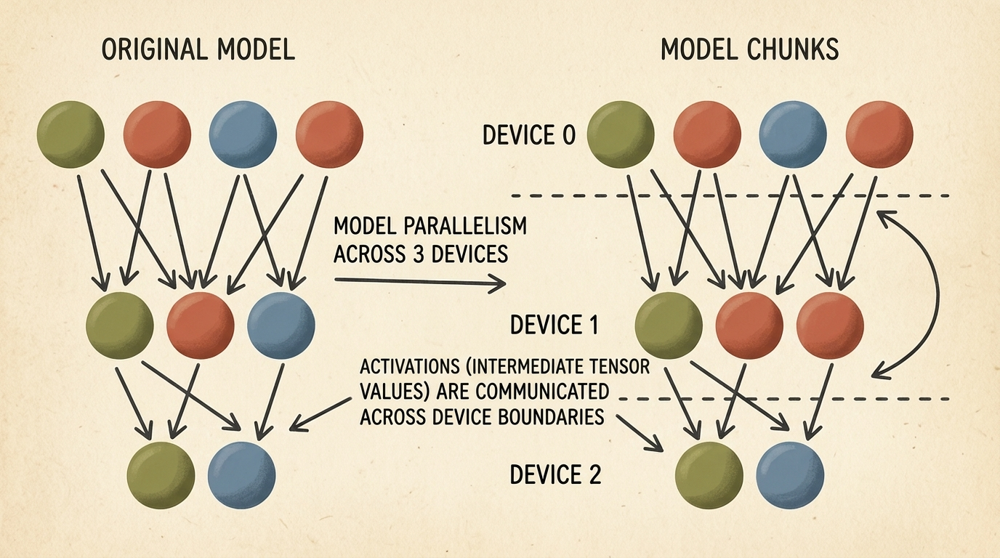
    <figcaption style="margin-top: 0.6em; text-align: center; font-size: 13px; color: #888;"><em>Şekil 5: Model Paralelliğinin temelleri. Sol: Orijinal monolitik çok katmanlı yapay sinir ağı. Sağ: Modelin 3 cihaza (Cihaz 0, Cihaz 1, Cihaz 2) paylaştırılması. Yalnızca cihaz sınırlarını aşan ara aktivasyon tensörleri donanım hatları üzerinden aktarılır.</em></figcaption>
  </div>
</figure>

---

## 7. Boru Hattı Paralelliği (PP) ve Mikro-Batchleme

Modeli katmanlar bazında böldüğümüzde, ardışık katmanlar farklı hızlandırıcılara yerleştirilir: Cihaz 0 1'den $K$'ya kadar olan katmanları, Cihaz 1 $K+1$'den $2K$'ya kadar olan katmanları hesaplar. Buna **Boru Hattı Paralelliği (Pipeline Parallelism - PP)** denir.

Ancak naif bir katman bölüşümünde cihazlar birbirini beklemek zorunda kalır: Cihaz 1 hesap yaparken Cihaz 0 ve Cihaz 2 boşta (idle) bekler. Bu donanımsal atıl zamana **Boru Hattı Kabarcığı (Pipeline Bubble)** denir.

### 7.1 Boru Hattı Kabarcığı ve Mikro-Batch Çizelgeleme

Kabarcık süresini minimize etmek için Boru Hattı Paralelliği her eğitim mini-batch'ini $M$ adet küçük **mikro-batch'e (microbatch)** böler:
- Cihaz 0 Mikro-batch 0 üzerindeki ileri yayılımı bitirdiği anda ara aktivasyonları Cihaz 1'e iletir ve hemen Mikro-batch 1'i hesaplamaya başlar.
- Modern **1F1B (One Forward, One Backward)** çizelgelemesinde cihazlar boru hattı dolduktan sonra bir ileri ve bir geri mikro-batch çalıştırarak bellek ayak izini dengede tutar.

<figure style="display:flex; justify-content: center; margin: 25px 0;">
  <div style="text-align: center;">
    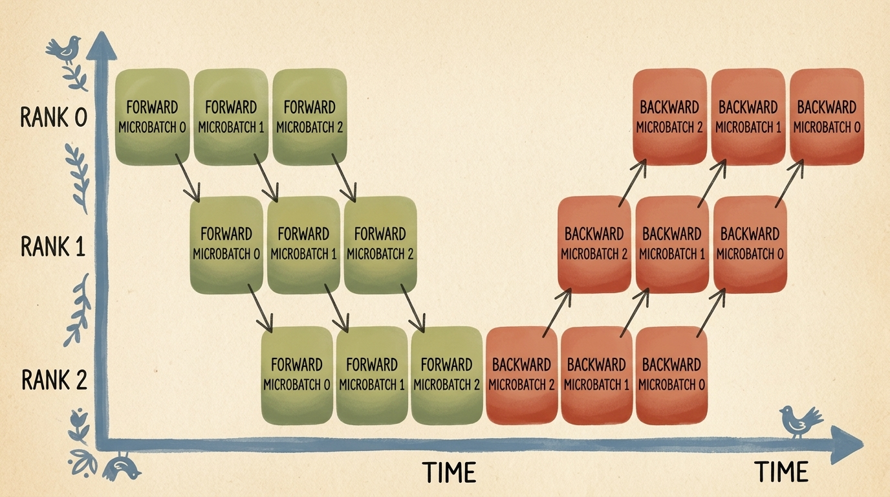
    <figcaption style="margin-top: 0.6em; text-align: center; font-size: 13px; color: #888;"><em>Şekil 6: 3 rank üzerinde Boru Hattı Paralelliği zaman çizelgesi. Yeşil kutular Rank 0'dan Rank 2'ye doğru basamaklanan ileri yön mikro-batch (0, 1, 2) hesaplamalarını; kırmızı kutular ise Rank 2'den Rank 0'a doğru basamaklanan geri yayılım adımlarını gösterir.</em></figcaption>
  </div>
</figure>

### 7.2 Boru Hattı Kabarcığının Matematiksel Kesri

$K$ boru hattı aşaması (cihaz) ve $M$ mikro-batch içeren bir GPipe çizelgesinde teorik kabarcık kesri ($F\_{\text{bubble}}$):

$$ F\_{\text{bubble}} = \frac{K - 1}{M + K - 1} $$

Mikro-batch sayısı ($M$) aşama sayısından ($K$) çok daha büyük seçildiğinde ($M \gg K$), kabarcık payı sıfıra yaklaşır:

$$ \lim\_{M \to \infty} F\_{\text{bubble}} = 0 $$

Ancak $M$ büyüdükçe aynı anda bellekte tutulması gereken serbest bırakılmamış aktivasyon tensörlerinin sayısı artar; bu da donanım verimi ile VRAM tüketimi arasında doğrudan bir değiş tokuş yaratır.

---

## 8. Tensör Paralelliği (TP) ve Boru Hattı Paralelliği Karşılaştırması

Boru Hattı Paralelliği modelleri **katmanlar arası (inter-layer)** bölerken, **Tensör Paralelliği (TP)** tek tek ağırlık matrislerini **katman içi (intra-layer)** eksende dilimler.

<figure style="display:flex; justify-content: center; margin: 25px 0;">
  <div style="text-align: center;">
    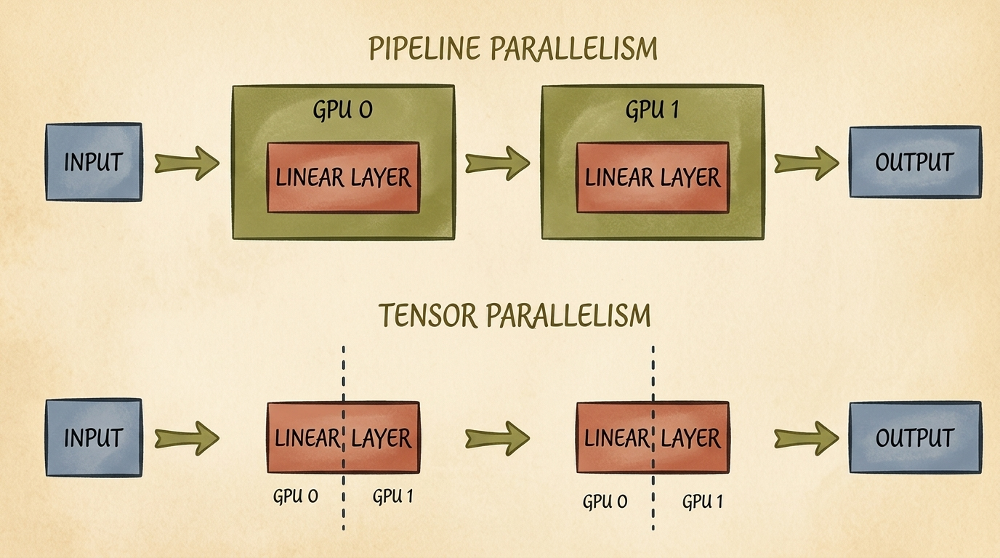
    <figcaption style="margin-top: 0.6em; text-align: center; font-size: 13px; color: #888;"><em>Şekil 7: Boru Hattı Paralelliği ile Tensör Paralelliğinin karşılaştırması. Üst (Boru Hattı Paralelliği): Katmanlar sıralı olarak farklı GPU'lara dağıtılır (GPU 0 Lineer Katman 1'i, GPU 1 Lineer Katman 2'yi tutar). Alt (Tensör Paralelliği): Her bir lineer katmanın ağırlık matrisi GPU 0 ve GPU 1 arasında dikey olarak dilimlenir.</em></figcaption>
  </div>
</figure>

### 8.1 Megatron-LM Tensör Paralelliği Formülasyonu

Derin ağlarda MLP ve dikkat (attention) katmanları ardışık matris çarpımlarından oluşur:

$$ \mathbf{Z} = \text{GELU}(\mathbf{X} \mathbf{W}\_1) \mathbf{W}\_2 $$

Megatron-LM, bu işlemi iki hızlandırıcı arasında bir **Sütun-Paralel Lineer (Column-Parallel)** katman ile bir **Satır-Paralel Lineer (Row-Parallel)** katmanı eşleştirerek böler:

#### Adım 1: Sütun-Paralel Projeksiyon
$\mathbf{W}\_1 \in \mathbb{R}^{d\_{\text{in}} \times d\_{\text{mid}}}$ matrisini sütun ekseni boyunca iki eşit yarıya böleriz: $\mathbf{W}\_1 = [\mathbf{W}\_{1,1} \mid \mathbf{W}\_{1,2}]$. Her iki GPU tam girdi $\mathbf{X}$'i alır ve iletişime gerek duymadan yerel hesaplamasını yapar:

$$ \mathbf{Y}\_1 = \mathbf{X} \mathbf{W}\_{1,1}, \quad \mathbf{Y}\_2 = \mathbf{X} \mathbf{W}\_{1,2} $$

$$ \mathbf{A}\_1 = \text{GELU}(\mathbf{Y}\_1), \quad \mathbf{A}\_2 = \text{GELU}(\mathbf{Y}\_2) $$

#### Adım 2: Satır-Paralel Projeksiyon
İkinci ağırlık matrisi $\mathbf{W}\_2 \in \mathbb{R}^{d\_{\text{mid}} \times d\_{\text{out}}}$ satır ekseni boyunca ikiye bölünür:

$$ \mathbf{W}\_2 = \begin{bmatrix} \mathbf{W}\_{2,1} \\\\ \mathbf{W}\_{2,2} \end{bmatrix} $$

Her GPU kendi yerel matris çarpımını hesaplar:

$$ \mathbf{Z}\_1 = \mathbf{A}\_1 \mathbf{W}\_{2,1}, \quad \mathbf{Z}\_2 = \mathbf{A}\_2 \mathbf{W}\_{2,2} $$

Bu iki yerel çarpımın matematiksel toplamı tam global sonucu verir:

$$ \mathbf{Z} = \mathbf{Z}\_1 + \mathbf{Z}\_2 = \mathbf{A}\_1 \mathbf{W}\_{2,1} + \mathbf{A}\_2 \mathbf{W}\_{2,2} $$

Sonuç tensörü $\mathbf{Z}$'yi elde etmek için iki GPU tek bir **AllReduce (SUM)** operasyonu gerçekleştirir.

> **Kritik Mimari Çıkarım:** İki katmanlı tam bir MLP bloğunda, Tensör Paralelliği ileri yayılımda yalnızca **bir tek AllReduce** ve geri yayılımda yalnızca **bir tek AllReduce** iletişimine ihtiyaç duyar!

### 8.2 TP ve PP Karşılaştırmalı Karar Matrisi

| Karakteristik | Tensör Paralelliği (TP) | Boru Hattı Paralelliği (PP) |
| :--- | :--- | :--- |
| **Bölünme Ekseni** | Katman içi (matris dilimleme) | Katmanlar arası (katman dilimleme) |
| **İletişim Frekansı** | Her katmanda (çok yüksek frekans) | Aşama sınırlarında (düşük frekans) |
| **İletişim Hacmi** | Yüksek aktivasyon dilimleri | Yalnızca katman sınırı aktivasyonları |
| **Donanım Zorunluluğu** | **Kesinlikle düğüm içi NVLink** ($>300\text{ GB/s}$) | Düğümler arası InfiniBand / PCIe ($25\text{--}50\text{ GB/s}$) |
| **Kabarcık Kaybı** | Kabarcık kaybı yoktur ($F\_{\text{bubble}} = 0$) | Kabarcık kaybı mevcuttur ($F\_{\text{bubble}} = \frac{K-1}{M+K-1}$) |
| **Ölçeklenebilirlik** | Genellikle 8 GPU (tek düğüm) ile sınırlıdır | Onlarca fiziksel düğüme ölçeklenebilir |

---

## 9. N-Boyutlu Paralellik ve PyTorch `DeviceMesh`

Üretim seviyesindeki temel modeller tek bir paralellik tekniğiyle yetinemez; çok boyutlu bir koordinasyon ızgarasında birden fazla stratejiyi birleştirirler.

Örneğin, 8 GPU'lu bir sunucu, replikalar arasında Veri Paralelliği ve model bölümleri arasında Tensör Paralelliği kuran **(2, 4) 2D Device Mesh** yapısında organize edilebilir.

<figure style="display:flex; justify-content: center; margin: 25px 0;">
  <div style="text-align: center;">
    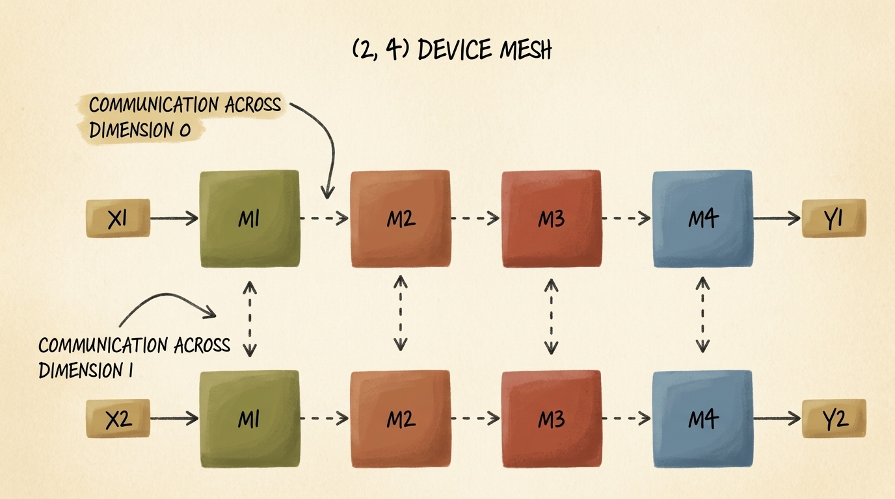
    <figcaption style="margin-top: 0.6em; text-align: center; font-size: 13px; color: #888;"><em>Şekil 8: (2, 4) boyutlarında 2D Device Mesh mimarisi. Ağ, 2 adet veri paraleli replika satırı (X1 ve X2) ile 4 adet model paraleli sütun bölümünden (M1, M2, M3, M4) oluşur. Boyut 0 boyunca yapılan iletişim model paralelliğini koordine ederken, Boyut 1 boyunca yapılan iletişim veri paraleli replikaları senkronize eder.</em></figcaption>
  </div>
</figure>

### 9.1 PyTorch 2.x `init_device_mesh` Kullanımı

PyTorch 2.x, karmaşık rank ve süreç grubu hesaplamalarını ortadan kaldırmak için **`DeviceMesh`** soyutlamasını tanıttı:

```python
import os
import torch
import torch.distributed as dist
from torch.distributed.device_mesh import init_device_mesh

def setup_2d_device_mesh():
    """
    2 veri paraleli kopya ve 4 tensör paraleli rank içeren 2D DeviceMesh kurar.
    torchrun --nproc-per-node=8 ile başlatılan 8 GPU'lu bir küme gerektirir.
    """
    dist.init_process_group(backend="nccl")
    local_rank = int(os.environ["LOCAL_RANK"])
    torch.cuda.set_device(local_rank)
    
    # (2, 4) boyutlu 2D Device Mesh tanımla
    # Boyut 0 ('dp'): 4 elemanlı 2 adet veri paraleli grup
    # Boyut 1 ('tp'): 2 elemanlı 4 adet tensör paraleli grup
    mesh_2d = init_device_mesh(
        device_type="cuda",
        mesh_shape=(2, 4),
        mesh_dim_names=("dp", "tp")
    )
    
    dp_group = mesh_2d["dp"]
    tp_group = mesh_2d["tp"]
    
    print(f"[Rank {dist.get_rank()}] Ana Örgü: {mesh_2d}")
    print(f"[Rank {dist.get_rank()}] DP Alt Örgüsü: {dp_group}, TP Alt Örgüsü: {tp_group}")
    
    return mesh_2d
```

---

## 10. Tam Parçalanmış Veri Paralelliği (FSDP / ZeRO)

Geleneksel DDP her GPU'da tüm parametreleri, gradyanları ve optimizatör durumlarını kopyalarken, DeepSpeed'in **ZeRO-3 (Zero Redundancy Optimizer)** makalesine dayanan **Tam Parçalanmış Veri Paralelliği (Fully Sharded Data Parallelism - FSDP)** bu üç bileşeni de veri paraleli rank'lar arasında dilimler.

### 10.1 ZeRO Bellek Parçalama Hiyerarşisi

ZeRO protokolü üç aşamalı bellek tekilleştirme sunar:
1. **ZeRO-1 ($\text{P}\_{\text{os}}$):** Yalnızca optimizatör durumları $W$ rank'a bölünür ($4\times$ bellek tasarrufu).
2. **ZeRO-2 ($\text{P}\_{\text{os+g}}$):** Optimizatör durumları ve gradyanlar birlikte bölünür ($8\times$ bellek tasarrufu).
3. **ZeRO-3 / FSDP ($\text{P}\_{\text{os+g+p}}$):** Optimizatör durumları, gradyanlar ve **model parametrelerinin tamamı** $W$ rank'a bölünür. Dinlenme halinde her GPU modelin yalnızca $\frac{1}{W}$'lik kısmını saklar!

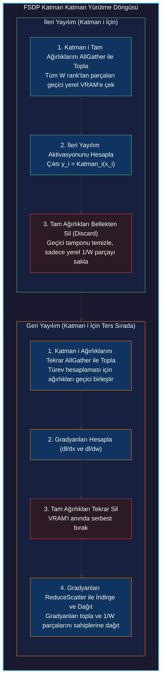

### 10.2 PyTorch 2.x `fully_shard` Uygulaması

PyTorch 2.x'te FSDP, modüler `fully_shard` fonksiyonu ile tamamen yenilenmiştir:

```python
import torch
import torch.nn as nn
from torch.distributed.device_mesh import init_device_mesh
from torch.distributed.fsdp import fully_shard

class DeepTransformerBlock(nn.Module):
    def __init__(self, dim: int = 1024):
        super().__init__()
        self.fc1 = nn.Linear(dim, dim * 4)
        self.relu = nn.ReLU()
        self.fc2 = nn.Linear(dim * 4, dim)

    def forward(self, x: torch.Tensor) -> torch.Tensor:
        return x + self.fc2(self.relu(self.fc1(x)))

def apply_fsdp_sharding(model: nn.Module, mesh):
    """
    Alt blokları katman katman parçalar, ardından kök modeli sarar.
    """
    # 1. Katman katman AllGather ve bellek tahliyesi yapabilmek için alt blokları parçala
    for module in model.modules():
        if isinstance(module, DeepTransformerBlock):
            fully_shard(module, mesh=mesh)
            
    # 2. En üst seviye kök modeli parçala
    fully_shard(model, mesh=mesh)
    return model
```

---

## 11. Büyük Dil Modellerine (LLM) Özel Paralellikler

Üretken transformer'ları (Bölüm 2.1) aşırı uzun bağlamlarda veya seyrek (sparse) yapılarda eğitirken iki özel dağıtık teknik öne çıkar:

### 11.1 Context Parallelism (CP) ve Ring Attention
Standart öz-dikkat (self-attention) sekans uzunluğunun ($L$) karesiyle ölçeklenir:

$$ \text{Bellek}\_{\text{attn}} = \mathcal{O}(L^2) $$

128k veya 1M token'lık uzun belgeleri işlerken, sadece dikkat puanı matrisini ($\mathbf{Q}\mathbf{K}^T$) tutmak bile tek bir hızlandırıcının VRAM'ini tüketir.

**Context Parallelism**, $L$ sekans eksenini $C$ adet rank'a bölerek her GPU'ya $\frac{L}{C}$ token verir. **Ring Attention** algoritmasıyla her GPU kendi sorgularını ($\mathbf{Q}$) tutarken, anahtar ($\mathbf{K}$) ve değer ($\mathbf{V}$) bloklarını halka boyunca döndürür; böylece nedensel maskeleme korunurken tepe aktivasyon belleği $C$ kat azalır.

### 11.2 Uzman Paralelliği (Expert Parallelism - EP / MoE)
Modern Mixture-of-Experts (MoE) mimarilerinde (Mixtral, DeepSeek-V3), feed-forward katmanları $E$ adet uzman ağ kümesiyle değiştirilir.

**Uzman Paralelliği**, farklı uzman ağlarını farklı fiziksel GPU'lara yerleştirir. İleri yayılımda bir yönlendirici (router) token'ları uzmanlara atar; token'lar yüksek hızlı **`All-to-All`** kolektif iletişimiyle ilgili uzman GPU'ya uçurulur ve hesaplama sonrası geri toplanır.

---

## 12. Üretim Seviyesi Dağıtık Sistemler: TorchTitan ve Özet

3D/4D hibrit paralelliği (DDP, FSDP, TP, PP ve CP) üretimde hatasız koordine etmek güçlü bir mühendislik gerektirir. Meta PyTorch ekibi, modern LLM'lerin saf PyTorch 2.x ile nasıl ölçeklendiğini göstermek amacıyla **TorchTitan** (`github.com/pytorch/torchtitan`) kütüphanesini açık kaynak olarak sunmuştur.

TorchTitan, LLaMA 3 ve türevi mimarilerin üçüncü parti sarmalayıcılara ihtiyaç duymadan doğrudan PyTorch çekirdeğiyle binlerce GPU'da nasıl eğitilebileceğini gösteren referans motordur.

### 12.1 Dağıtık Paralellik Karar Matrisi

Projenizin mimarisine, parametre boyutuna ve ağ altyapısına göre doğru stratejiyi seçebilirsiniz:

| Model Ölçeği | Tek GPU'ya Sığar mı? | Önerilen Paralellik Stratejisi | Kritik Donanım Gereksinimi |
| :--- | :---: | :--- | :--- |
| **&lt; 1B Parametre** (ör. LUNA 3D CNN) | Evet | **DistributedDataParallel (DDP)** | Standart PCIe / 10GbE Ağ |
| **1B – 15B Parametre** (ör. LLaMA-3 8B) | Hayır | **FSDP (ZeRO-3)** | PCIe Gen4/5 veya Düğüm İçi NVLink |
| **15B – 70B Parametre** | Hayır | **2D Hibrit: FSDP + Tensör Paralelliği (TP)** | Düğüm İçi NVLink + Düğümler Arası InfiniBand |
| **&gt; 70B Parametre** | Hayır | **3D/4D Hibrit: FSDP + TP + PP (+ CP)** | Tam NVLink NVSwitch + Multi-Rail InfiniBand |

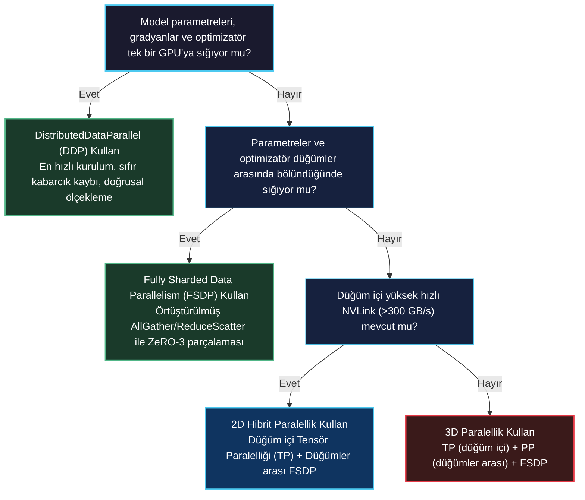
