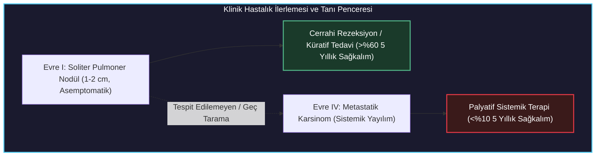
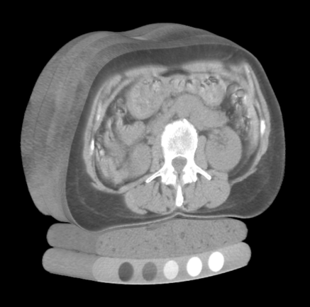
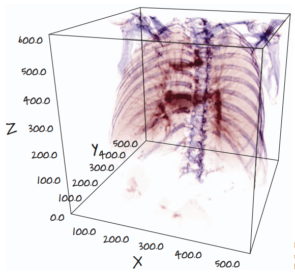
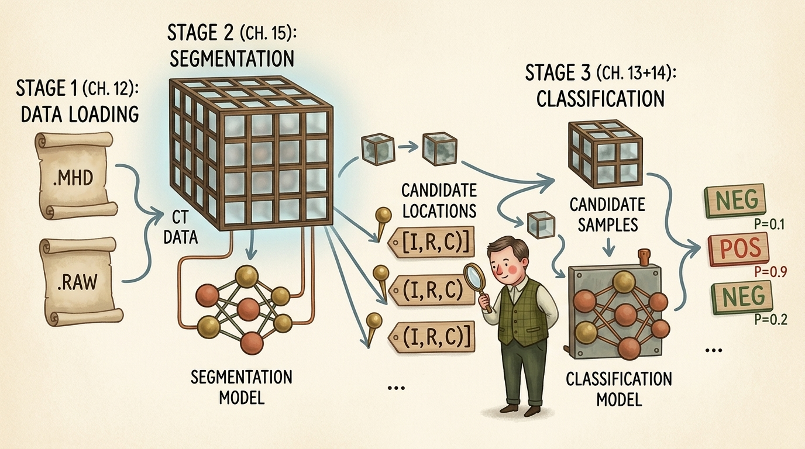
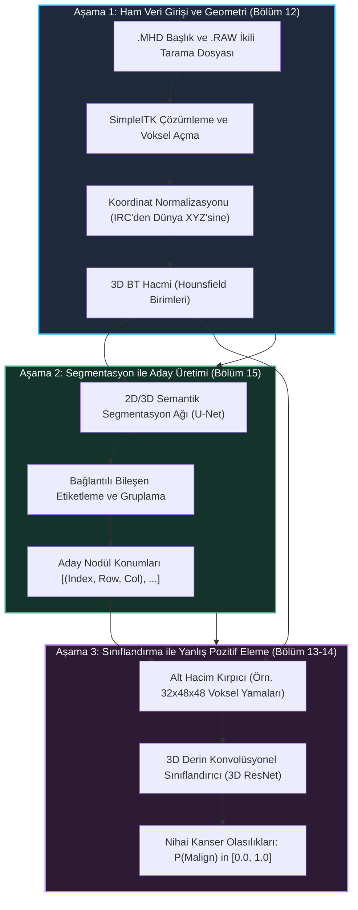
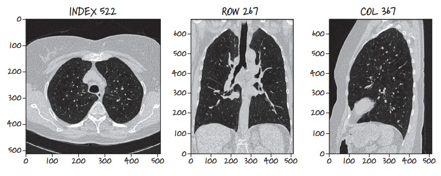
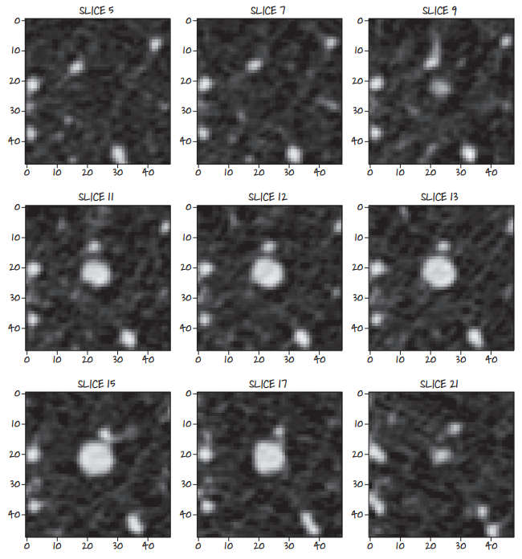
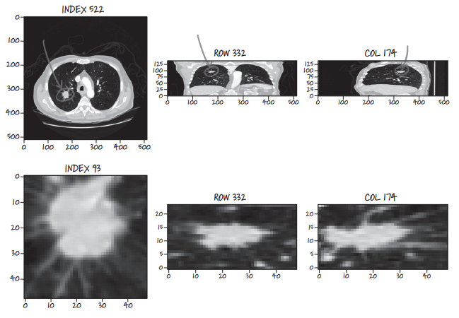
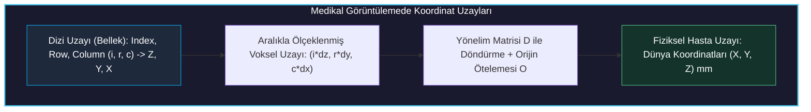

# Kanserle Savaşmak İçin PyTorch Kullanımı

<!-- toc -->

<div style="margin-bottom: 20px;">
  <a href="https://colab.research.google.com/github/emreaslan7/ai/blob/main/notebooks/deep-learning-with-pytorch/11-using-pytorch-to-fight-cancer.ipynb" target="_blank">
    
  </a>
</div>

---

## 1. Klinik Problem: Akciğer Kanseri ve LUNA Grand Challenge

Akciğer kanseri, dünya genelinde kansere bağlı ölümlerin başında gelmekte ve her yıl yaklaşık 1,8 milyon insanın yaşamını yitirmesine neden olmaktadır. Akciğer kanserinin klinik açıdan en ölümcül yönü, sinsi ve asemptomatik ilerlemesidir: Erken evre pulmoner nodüller nadiren fiziksel rahatsızlık yaratır. Bu durum, hastaların büyük bir kısmının ancak malign (kötü huylu) hücrelerin bölgesel lenf nodlarına veya uzak organlara metastaz yapmasından sonra teşhis edilmesine yol açar; bu aşamada 5 yıllık sağkalım oranı %60'ın üzerinden %10'un altına düşmektedir.



Düşük doz sarmal Bilgisayarlı Tomografi (BT / CT) taramalarının etkinliği National Lung Screening Trial (NLST) tarafından kanıtlandığında, proaktif taramanın akciğer kanserine bağlı mortaliteyi %20 oranında azalttığı belgelenmiştir. Ancak bu tanısal avantaj, radyologlar üzerinde ciddi bir iş yükü ve darboğaz yaratmıştır:
1. **Hacimsel Bilgi Yükü:** Modern, yüksek çözünürlüklü bir toraks BT taraması hasta başına yüzlerce aksiyal kesitten ve bir uzmanın incelemesi gereken milyonlarca vokselden oluşur.
2. **Yanlış Pozitif Yorgunluğu:** İlk taramalarda saptanan aday doku kümelerinin ezici çoğunluğu (>%95) iyi huylu granülomlar, intrapulmoner lenf düğümleri veya apikal skarlardır.
3. **Okuyucular Arası Değişkenlik:** Masum bir hamartom ile invaziv bir adenokarsinomu birbirinden ayıran buzlu cam opasitesi (GGO), lobülasyon veya spikülasyon gibi ince görsel işaretler, klinisyenler arasında farklı değerlendirmelere sebep olabilir.

Bu zorlukları aşmak ve yapay zeka destekli bilgisayar destekli teşhis (CAD) sistemlerini geliştirmek amacıyla akademik ve klinik camia, **LUng Nodule Analysis (LUNA) Grand Challenge** veri setini ve yarışmasını (halka açık LIDC-IDRI veritabanı temelinde) hayata geçirmiştir. LUNA, uzman radyologlarca etiketlenmiş toraks BT hacimlerini ve FROC (Free-Response Receiver Operating Characteristic) gibi standart değerlendirme metriklerini sunarak medikal bilgisayarlı görü alanında standart referans noktası haline gelmiştir.

---

## 2. Bilgisayarlı Tomografi (BT) Taraması Tam Olarak Nedir?

### 2.1 X-Işını Bilgisayarlı Tomografisinin Fiziği

Görünür ışık tayfında nesnelerin geçirimsiz dış yüzeyinden yansıyan fotonları kaydeden standart fotoğrafçılığın aksine, Bilgisayarlı Tomografi yüksek enerjili elektromanyetik radyasyonun (X-ışınları, foton enerjisi yaklaşık $20\text{ ila }140\text{ keV}$) heterojen biyolojik dokulardan geçerken uğradığı **zayıflamayı (attenuation)** ölçer.

Dar bir tek enerjili X-ışını demeti $I\_0$ başlangıç şiddetiyle, doğrusal zayıflama katsayısı $\mu$ olan homojen bir ortamda $x$ yol uzunluğu boyunca ilerlediğinde, foton soğurulması ve Compton saçılması nedeniyle ışın şiddeti klasik **Beer-Lambert Yasası**'na göre azalır:

$$ I = I\_0 \, e^{-\mu x} $$

İnsan vücudunda dokular sürekli değişken kimyasal bileşimlere ve fiziksel yoğunluklara $\rho(\mathbf{x})$ sahiptir; bu da uzaysal olarak sürekli bir $\mu(x, y, z)$ zayıflama alanı meydana getirir. X-ışını tüpü ve karşısındaki dedektör dizisi gantri etrafında senkronize şekilde dönerken dedektör zayıflamanın çizgi integrallerini (**Radon Dönüşümü**) kaydeder:

$$ p(\theta, s) = \int\_{-\infty}^{\infty} \int\_{-\infty}^{\infty} \mu(x, y) \, \delta(x \cos\theta + y \sin\theta - s) \, dx \, dy $$

**Fourier Kesit Teoremi** (Fourier Slice Theorem) ve filtrelenmiş geri projeksiyon (Filtered Backprojection - FBP) ya da yinelemeli cebirsel rekonstrüksiyon algoritmaları kullanılarak, yüzlerce açısal 1D projeksiyon profilinden iç anatomik 2D kesit $\mu(x, y)$ matematiksel olarak yeniden oluşturulur.

<div style="text-align: center; margin: 25px 0;">
  
  <figcaption style="font-size: 0.9em; color: #888; margin-top: 8px;"><strong>Şekil 11.1:</strong> Abdominal/lomber bir BT taramasının aksiyal kesiti; yumuşak doku, kortikal kemik, bağırsak gazı ve hasta masasının altına yerleştirilmiş kalibrasyon fantom peletleri görülmektedir.</figcaption>
</div>

### 2.2 Hounsfield Birimi (HU) Radyodansite Skalası

Ham zayıflama katsayısı $\mu$, X-ışını tüpünün tepe kilovoltajına ($kVp$) ve ışın sertleşmesi (beam hardening) artefaktlarına doğrudan bağlıdır. Cihaz üreticileri, hastaneler ve çekim protokolleri arasındaki ölçüm farklarını ortadan kaldırmak için Sir Godfrey Hounsfield, **Hounsfield Birimi (HU)** adı verilen kalibre edilmiş, birimsiz bir radyodansite metriği geliştirmiştir.

HU dönüşümü, fiziksel zayıflamayı standart sıcaklık ve basınç altındaki damıtılmış suyun ($\mu\_{\text{water}}$) ve ortam havasının ($\mu\_{\text{air}} \approx 0$) zayıflamasına göre doğrusal olarak ölçeklendirir:

$$ \text{HU} = 1000 \times \frac{\mu - \mu\_{\text{water}}}{\mu\_{\text{water}} - \mu\_{\text{air}}} $$

Uluslararası fiziksel standartlara göre dokuların HU değerleri:
- **Hava:** $-1000\text{ HU}$ (minimum foton zayıflaması)
- **Akciğer Dokusu (havalanan alveoller):** $-900\text{ ila }-500\text{ HU}$
- **Yağ Dokusu (Adipoz):** $-120\text{ ila }-90\text{ HU}$
- **Damıtılmış Su:** $0\text{ HU}$ (referans taban değeri)
- **Kan, Kas ve Yumuşak Doku:** $+20\text{ ila }+50\text{ HU}$
- **Pulmoner Nodüller / Katı Tümörler:** $+30\text{ ila }+100\text{ HU}$
- **Kortikal Kemik:** $+500\text{ ila }+1500\text{ HU}$
- **Metal Protez ve İmplantlar:** $+3000\text{ HU}$ ve üzeri

```mermaid
flowchart TD
    subgraph HUScale ["Hounsfield Birimi (HU) Radyodansite Spektrumu"]
        Air["Hava (-1000 HU)"] --> Lung["Akciğer Dokusu (-900 ila -500 HU)"]
        Lung --> Fat["Yağ Dokusu (-100 HU)"]
        Fat --> Water["Su Referansı (0 HU)"]
        Water --> Soft["Yumuşak Doku / Kan (+30 ila +60 HU)"]
        Soft --> Nodule["Katı Tümör / Nodül (+50 ila +100 HU)"]
        Nodule --> Bone["Kortikal Kemik (+700 ila +1500 HU)"]
    end
    style Air fill:#0f172a,stroke:#38bdf8,color:#fff
    style Lung fill:#1e293b,stroke:#0ea5e9,color:#fff
    style Water fill:#0284c7,stroke:#38bdf8,color:#fff
    style Soft fill:#1e3a5f,stroke:#60a5fa,color:#fff
    style Nodule fill:#b91c1c,stroke:#f87171,color:#fff
    style Bone fill:#475569,stroke:#cbd5e1,color:#fff
```



İnsan gözü 8-bitlik bir ekranda (256 gri tonu) yaklaşık 4000 farklı HU değerinin tamamını ayırt edemeyeceğinden, medikal görüntüleme yazılımları **Pencerileme (Windowing)** uygular (Pencere Genişliği $W$ ve Pencere Seviyesi $L$):

$$ I\_{\text{display}} = \text{clip}\left( \frac{\text{HU} - (L - W/2)}{W} \times 255, \, 0, \, 255 \right) $$

Akciğer nodüllerini incelemek için radyologlar **Akciğer Penceresi (Lung Window)** ($W = 1500, L = -600$) kullanır; bu sayede havalanan akciğer parankimi kontrastın tamamına yayılırken yoğun kemik ve mediasten yapıları saf beyaza ($255$) kırpılır.

---

## 3. 3D Hacimsel Temsil ve Kartezyen Uzay

Geleneksel bir fotoğrafik görüntü, satır ve sütunla $(r, c)$ indekslenen 2D kare piksellerden meydana gelir. Buna karşılık modern bir toraks BT çekimi, **voksel (voxel - volume element)** adı verilen dikdörtgen prizmalardan oluşan 3D hacimsel bir dizi üretir.

<div style="text-align: center; margin: 25px 0;">
  
  <figcaption style="font-size: 0.9em; color: #888; margin-top: 8px;"><strong>Şekil 11.2:</strong> Bir insan toraks BT taramasının Kartezyen hasta koordinatlarında $(X, Y, Z)$ $500 \times 500 \times 600\text{ mm}$ hacimsel 3D sınırlayıcı kutu görselleştirmesi; kaburgalar, omurga ve bronş ağacı seçilmektedir.</figcaption>
</div>

### 3.1 Non-İzotropik Voksel Geometrisi

Standart bilgisayarlı görü verileri ile medikal BT dizileri arasındaki en kritik farklardan biri, BT voksellerinin çoğunlukla **non-izotropik (yönsüz eşit olmayan)** olmasıdır:
- **Düzlem İçi Çözünürlük ($\Delta x, \Delta y$):** $512 \times 512$'lik aksiyal kesitte piksel başına genellikle $0,6\text{ ila }0,8\text{ mm}$.
- **Kesit Kalınlığı ($\Delta z$):** Gantrinin hastanın baş-ayak ekseni boyunca ardışık çekimleri arasındaki mesafe. Yüksek çözünürlüklü taramalarda $\Delta z$ $1,0\text{ mm}$ ile $2,5\text{ mm}$ arasındayken rutin klinik çekimlerde $5,0\text{ mm}$'yi bulabilir.

Bir derin yapay sinir ağı voksel aralıklarını $(\Delta z, \Delta y, \Delta x)$ hesaba katmadan doğrudan ham voksel dizilerini işlerse, $10\text{ mm}$ çapındaki küresel bir nodül $Z$-ekseni boyunca basık veya aşırı uzamış görünecek, bu da morfolojik filtre yanıtlarını bozacaktır.

---

## 4. Proje Mimarisi: Uçtan Uca Kanser Tespit Sistemi

$512 \times 512 \times 400$ boyutundaki tam bir toraks BT hacmini doğrudan 3D konvolüsyonel bir ağa beslemek hesaplama açısından imkansızdır. Tek bir hasta hacmi:

$$ 512 \times 512 \times 400 = 104.857.600 \text{ voksel} $$

32-bit kayan nokta hassasiyetinde (voksel başına 4 bayt), tek bir hacmi bellekte tutmak $419\text{ MB}$ VRAM gerektirir. Geriye yayılım (backpropagation) esnasında 3D ResNet gibi derin ağların ara katman aktivasyon haritaları, $80\text{ GB}$'lık en güçlü veri merkezi GPU'larının dahi fiziksel bellek sınırını anında tüketir.

Ayrıca, tipik bir pulmoner nodül yaklaşık $10\text{ ila }15\text{ voksel}$ çapında olup yaklaşık $1000\text{ voksel}$ hacim kaplar; yani tüm taramanın **%0,001'inden daha azını** oluşturur. $105\text{ milyon}$ voksel içinde bu küçücük yapıyı doğrudan bulmaya çalışmak felaket düzeyde bir sınıf dengesizliğine (class imbalance) yol açar.

Bu sorunu çözmek için literatürdeki ve endüstrideki kanıtlanmış yaklaşım, kanser tespit sürecini **üç aşamalı "böl ve yönet" (divide-and-conquer) mimarisine** ayırır:

<div style="text-align: center; margin: 25px 0;">
  
  <figcaption style="font-size: 0.9em; color: #888; margin-top: 8px;"><strong>Şekil 11.3:</strong> Üç aşamalı uçtan uca LUNA akciğer kanseri tespit boru hattının masalsı mimari şeması: Veri Yükleme (.MHD/.RAW) $\to$ Aday Segmentasyonu $\to$ 3D CNN Sınıflandırma.</figcaption>
</div>



### Boru Hattı Aşamalarının Görevleri:

1. **Aşama 1 (Veri Alma ve Koordinat Geometrisi — Bölüm 12):**
   Ham medikal formatları (`.mhd` / `.raw`) okumak, afin yönelim ve aralık matrislerini çıkarmak, voksel yoğunluklarını standart HU değerlerine dönüştürmek ve dizi bellek adresleri ile milimetrik hasta uzayı arasında dönüşüm sağlamak.
2. **Aşama 2 (Segmentasyon ile Aday Tespiti — Bölüm 15):**
   Hızlı bir semantik segmentasyon ağı (2D veya 3D U-Net) ile akciğer parankimi içindeki tüm yüksek yoğunluklu şüpheli küresel adayları bulmak. Bu aşamanın hedefi **%100'e yakın duyarlılıktır (sensitivity/recall)**: Gerçek hiçbir malign nodülü kaçırmamak adına binlerce yanlış alarmı (damar çatallanmaları, bronş duvarı kalınlaşmaları) göze alırız.
3. **Aşama 3 (Yanlış Pozitifleri Eleme ve Sınıflandırma — Bölüm 13 ve 14):**
   Her bir aday konumun merkezinden küçük 3D kübik parçalar (örn. $32 \times 48 \times 48\text{ voksel}$) kırpılır. Özelleştirilmiş bir 3D Konvolüsyonel Sinir Ağı; hacimsel dokuyu, kenar spikülasyonunu, kalsifikasyon desenlerini ve çevre damar bağlantılarını inceleyerek yanlış alarmları eler ve kesin malignite olasılığı üretir.

---

## 5. Nodül Nedir? Anatomi ve Morfoloji

Klinik olarak **pulmoner nodül**, havalanan akciğer dokusu ile çevrili, çapı $30\text{ mm}$'ye kadar olan, sınırları belirgin, yuvarlak veya oval radyoopak bir lezyondur. Çapı $30\text{ mm}$'den büyük olan lezyonlar **kitle (pulmonary mass)** olarak sınıflandırılır ve malignite olasılıkları dramatik biçimde yüksektir.

<div style="text-align: center; margin: 25px 0;">
  
  <figcaption style="font-size: 0.9em; color: #888; margin-top: 8px;"><strong>Şekil 11.4:</strong> Aynı hasta hacminden geçen üç ortogonal anatomik kesit düzlemi: Aksiyal düzlem (Index 522, yatay), Koronal düzlem (Row 267, önden) ve Sagittal düzlem (Col 367, yandan).</figcaption>
</div>

### 5.1 Üç Ortogonal Görüntüleme Düzlemi

BT taraması kesintisiz bir 3D hacim olduğundan, uzayda istenen herhangi bir geometrik düzlem boyunca yeniden kesitlenebilir. Medikal radyolojide üç temel ortogonal düzlem kullanılır:
- **Aksiyal (Transvers) Düzlem:** Omurgaya dik, hastanın ayak ucundan başına doğru bakan yatay kesitler ($Z$-ekseni sabitken $XY$-düzlemi, `Index` olarak indekslenir).
- **Koronal (Frontal) Düzlem:** Vücudu göğüsten sırta doğru kesen önden görünüm ($Y$-ekseni sabitken $XZ$-düzlemi, `Row` olarak indekslenir).
- **Sagittal (Lateral) Düzlem:** Vücudu sol ve sağ yarılara ayıran yandan profil görünümü ($X$-ekseni sabitken $YZ$-düzlemi, `Col` olarak indekslenir).

Şüpheli lezyonları üç ortogonal düzlemin tamamında incelemek hayati önem taşır: Aksiyal düzlemde dairesel bir nodül gibi görünen silindirik bir kan damarı, koronal veya sagittal düzlemde dallanıp uzayan vasküler yapısını hemen ele verir.

### 5.2 Ardışık Z-Kesitlerinde Küresel Büyüme Anatomisi

Nodüller 3D küresel veya elipsoidal yapılar olduklarından, hacim boyunca ardışık aksiyal kesitler alındığında karakteristik bir profil sergilerler: Lezyon önce küçük bir nokta olarak belirir, ekvatoral maksimum çapına doğru simetrik büyür ve ardından küçülerek gözden kaybolur.

<div style="text-align: center; margin: 25px 0;">
  
  <figcaption style="font-size: 0.9em; color: #888; margin-top: 8px;"><strong>Şekil 11.5:</strong> Soliter bir pulmoner nodülün ardışık aksiyal Z-kesitleri (5. kesitten 21. kesite kadar); 12-13. kesitlerde maksimum çapa ulaşıp simetrik olarak sönümlenmektedir.</figcaption>
</div>

### 5.3 Benign ve Malign Patolojik Göstergeler

Radyologlar lezyonun iyi huylu mu yoksa kötü huylu mu olduğunu ayırt ederken belirli morfolojik işaretleri inceler:
- **Spikülasyon (Spiculation):** Lezyon kenarından havalanan akciğer dokusuna doğru uzanan keskin, iğnemsi uzantılar. İnvaziv malignitenin en güçlü klinik göstergesidir.
- **Lobülasyon (Lobulation):** Malign hücrelerin farklı klonal büyüme hızlarını yansıtan dalgalı, çukurlu kenar konturları.
- **Kalsifikasyon Desenleri:** Yoğun merkezi, eşmerkezli veya "patlamış mısır" tarzı kalsifikasyonlar genellikle iyi huylu granülomları gösterir. Dağınık, benekli kalsifikasyonlar ise malignite şüphesi doğurur.
- **Buzlu Cam Opasitesi (GGO):** Altındaki damar ve bronş yapılarını tamamen kapatmayan yarı saydam yoğunluk artışı; sıklıkla erken evre adenokarsinom ile ilişkilidir.

<div style="text-align: center; margin: 25px 0;">
  
  <figcaption style="font-size: 0.9em; color: #888; margin-top: 8px;"><strong>Şekil 11.6:</strong> Spikülasyonlu ve kaviteli büyük bir malign tümörün çok düzlemli görünümü. Üst: Tüm göğüs kafesi (Aksiyal, Koronal, Sagittal). Alt: Lezyona odaklanmış 48x48 voksel yamaları.</figcaption>
</div>

---

## 6. LUNA Grand Challenge Veri Kümesinin Anatomisi

LUNA16 veri kümesi, 10 alt kümeye (`subset0` ila `subset9`) ayrılmış toplam 888 toraks BT taraması içerir.

### 6.1 MetaImage Formatı: `.mhd` Başlıkları ve `.raw` İkili Dosyaları

LUNA, her hasta için yüzlerce ayrı DICOM dosyası saklamak yerine verileri eşleştirilmiş **MetaImage** formatında sunar:
1. **`.mhd` (MetaImage Header):** Boyutsal üstverileri içeren düz metin ASCII başlık dosyası:
   - `DimSize = 512 512 360` (X, Y ve Z eksenlerindeki voksel sayısı)
   - `ElementType = MET_SHORT` (işaretli 16-bit tamsayı, `int16`)
   - `ElementSpacing = 0.703125 0.703125 1.25` (mm cinsinden voksel boyutları)
   - `Offset = -175.2 -175.2 -312.5` (`[0, 0, 0]` vokselinin hasta mm uzayındaki başlangıç konumu)
   - `TransformMatrix = 1 0 0 0 1 0 0 0 1` (yönelim kosinüs matrisi)
   - `ElementDataFile = ...raw` (ikili tampon dosyası adı)
2. **`.raw` (Binary Image Buffer):** Voksellerin satır-öncelikli (row-major) sırada depolandığı, sıkıştırılmamış 1D işaretli 16-bit tamsayı tamponu.

### 6.2 Etiket Dosyaları: Ground Truth ve Aday Listeleri

LUNA iki temel CSV etiket dosyası sunar:
1. `annotations.csv`: En az 3 uzman radyoloğun ortak onayıyla belirlenmiş kesin nodül listesi.
   - `seriesuid`: Benzersiz hasta tarama kimliği.
   - `coordX, coordY, coordZ`: Milimetre cinsinden nodül merkez konumu.
   - `diameter_mm`: Milimetre cinsinden eşdeğer küresel çap.
2. `candidates.csv`: Klasik aday tespit algoritmalarıyla üretilmiş yaklaşık 750.000 şüpheli konum listesi.
   - `seriesuid, coordX, coordY, coordZ`: Adayın merkez koordinatları.
   - `class`: İkili etiket (`0`: kanser olmayan yanlış alarm, `1`: doğrulanmış gerçek nodül). 750.000 aday içinde yalnızca 1.351 gerçek pozitif bulunur (yaklaşık 1:550 sınıf dengesizliği).

---

## 7. Koordinat Geometrisi: Dizi İndekslerinden Milimetre Uzayına

Medikal derin öğrenme projelerindeki en yaygın hatalardan biri koordinat sistemlerinin karıştırılmasıdır. Bellekteki dizi indisleri ile fiziksel hasta uzayı aynı başlangıç noktasına, yönelime veya birimlere sahip değildir.



### 7.1 Koordinat Tanımları

- **Dizi Uzayı ($I, R, C$):** 3D tensör tamponunu indeksleyen 0-tabanlı tamsayılar:
  - $I$ (`Index`): $Z$-ekseni boyunca kesit indisi (aksiyal gantri konumu).
  - $R$ (`Row`): $Y$-ekseni boyunca satır indisi (aksiyal görüntünün dikey boyutu).
  - $C$ (`Column`): $X$-ekseni boyunca sütun indisi (aksiyal görüntünün yatay boyutu).
- **Fiziksel Dünya Uzayı ($X, Y, Z$):** Cihazın izomerkezine göre milimetre cinsinden ölçülen sürekli kayan noktalı koordinatlar:
  - $X$: Hastanın solundan $(-)$ sağına $(+)$.
  - $Y$: Önünden / göğüsten $(-)$ arkasına / sırta $(+)$.
  - $Z$: Ayak ucundan $(-)$ başa doğru $(+)$.

### 7.2 Matematiksel Dönüşüm Formülleri

Orijin $\mathbf{O} = (O\_x, O\_y, O\_z)$, voksel aralığı $\mathbf{s} = (s\_x, s\_y, s\_z)$ ve yönelim matrisi $\mathbf{D} \in \mathbb{R}^{3 \times 3}$ verildiğinde; $\mathbf{v}\_{\text{irc}} = (i, r, c)^T$ dizi indisini milimetre cinsinden $\mathbf{x}\_{\text{xyz}} = (x, y, z)^T$ dünya koordinatına eşleyen afin dönüşüm şöyledir:

$$ \mathbf{x}\_{\text{xyz}} = \mathbf{O} + \mathbf{D} \begin{bmatrix} c \cdot s\_x \\ r \cdot s\_y \\ i \cdot s\_z \end{bmatrix} $$

LUNA taramalarında yönelim matrisi birim matris kabul edildiğinde ($\mathbf{D} = \mathbf{I}\_3$), milimetre uzayından tamsayı dizi indislerine ters dönüşüm:

$$ c = \text{round}\left( \frac{x - O\_x}{s\_x} \right), \quad r = \text{round}\left( \frac{y - O\_y}{s\_y} \right), \quad i = \text{round}\left( \frac{z - O\_z}{s\_z} \right) $$

---

## 8. Adım Adım Mikro-Modüler Uygulama

PyTorch ve NumPy kullanarak temel veri yapılarını ve koordinat dönüşümlerini kuralım.

### Adım 1: Koordinat Veri Yapılarını Tanımlama

Koordinat sıralamalarının $(X, Y, Z)$ ile $(I, R, C)$ arasında ters çevrilmesini önlemek için güçlü tipli `namedtuple` yapıları tanımlıyoruz:

```python
from collections import namedtuple
import numpy as np
import torch

# Koordinat uzaylarımızı temsil eden değişmez (immutable) veri yapıları
IrcTuple = namedtuple('IrcTuple', ['index', 'row', 'col'])
XyzTuple = namedtuple('XyzTuple', ['x', 'y', 'z'])
```

### Adım 2: Çift Yönlü Koordinat Dönüşüm Fonksiyonları

Fiziksel dünya milimetre koordinatları ile diskteki voksel dizi indisleri arasında dönüşüm yapan fonksiyonlarımızı yazıyoruz:

```python
def xyz2irc(coord_xyz: XyzTuple, origin_xyz: XyzTuple, vx_per_mm_xyz: XyzTuple, direction_mat: np.ndarray = None) -> IrcTuple:
    """
    Sürekli fiziksel milimetre koordinatlarını (X, Y, Z),
    ayrık 3D dizi indislerine (Index, Row, Column) dönüştürür.
    """
    diff_x = coord_xyz.x - origin_xyz.x
    diff_y = coord_xyz.y - origin_xyz.y
    diff_z = coord_xyz.z - origin_xyz.z
    
    col = int(round(diff_x * vx_per_mm_xyz.x))
    row = int(round(diff_y * vx_per_mm_xyz.y))
    index = int(round(diff_z * vx_per_mm_xyz.z))
    
    return IrcTuple(index=index, row=row, col=col)

def irc2xyz(coord_irc: IrcTuple, origin_xyz: XyzTuple, spacing_xyz: XyzTuple, direction_mat: np.ndarray = None) -> XyzTuple:
    """
    Ayrık 3D dizi indislerini (Index, Row, Column),
    sürekli fiziksel milimetre koordinatlarına (X, Y, Z) dönüştürür.
    """
    x = coord_irc.col * spacing_xyz.x + origin_xyz.x
    y = coord_irc.row * spacing_xyz.y + origin_xyz.y
    z = coord_irc.index * spacing_xyz.z + origin_xyz.z
    
    return XyzTuple(x=x, y=y, z=z)
```

### Adım 3: Hounsfield Birimi Pencerileme ve Normalizasyon

Ham BT hacmini derin öğrenme modeline vermeden önce değerleri klinik akciğer penceresine $[-1000\text{ HU}, +400\text{ HU}]$ kırparak $[0.0, 1.0]$ aralığına normalize eden fonksiyon:

```python
def apply_lung_window(ct_tensor: torch.Tensor, min_hu: float = -1000.0, max_hu: float = 400.0) -> torch.Tensor:
    """
    Ham BT Hounsfield değerlerini akciğer penceresine kırpar ve
    doğrusal olarak [0.0, 1.0] aralığına normalize eder.
    """
    clamped = torch.clamp(ct_tensor, min=min_hu, max=max_hu)
    normalized = (clamped - min_hu) / (max_hu - min_hu)
    return normalized
```

### Adım 4: PyTorch İçin Sabit Boyutlu 3D Aday Alt Hacim Kırpma

Belirlenen bir $(I, R, C)$ aday noktasının etrafından 3D PyTorch konvolüsyon katmanına uygun sabit bir kübik alt hacim (örn. $32 \times 48 \times 48\text{ voksel}$) kırpan ve hacim dışına taşarsa hava değeriyle ($-1000\text{ HU}$) dolgulayan (padding) fonksiyon:

```python
def extract_candidate_subvolume(
    ct_volume: torch.Tensor,
    center_irc: IrcTuple,
    crop_shape_irc: tuple = (32, 48, 48)
) -> torch.Tensor:
    """
    center_irc merkezli 3D alt hacmi kırpar; tarama sınırlarını aşarsa
    hava (-1000 HU) değeriyle doldurur.
    
    Dönüş:
        torch.Tensor: (1, 1, Derinlik, Yükseklik, Genişlik) boyutunda tensör.
    """
    half_i = crop_shape_irc[0] // 2
    half_r = crop_shape_irc[1] // 2
    half_c = crop_shape_irc[2] // 2
    
    start_i = max(0, center_irc.index - half_i)
    end_i = min(ct_volume.shape[0], center_irc.index + half_i)
    
    start_r = max(0, center_irc.row - half_r)
    end_r = min(ct_volume.shape[1], center_irc.row + half_r)
    
    start_c = max(0, center_irc.col - half_c)
    end_c = min(ct_volume.shape[2], center_irc.col + half_c)
    
    subvolume = ct_volume[start_i:end_i, start_r:end_r, start_c:end_c]
    
    # Sınır taşmalarını -1000 HU (hava) ile doldur
    subvolume_padded = torch.nn.functional.pad(
        subvolume,
        (
            max(0, half_c - (center_irc.col - start_c)),
            max(0, half_c - (end_c - center_irc.col)),
            max(0, half_r - (center_irc.row - start_r)),
            max(0, half_r - (end_r - center_irc.row)),
            max(0, half_i - (center_irc.index - start_i)),
            max(0, half_i - (end_i - center_irc.index)),
        ),
        value=-1000.0
    )
    
    # (Batch, Channel, Depth, Height, Width) formatına getir
    return subvolume_padded.unsqueeze(0).unsqueeze(0)
```

---

## 9. Özet ve Bölüm 12'ye Bakış

Bu bölümde medikal bilgisayarlı tomografinin temel prensiplerini ve uçtan uca akciğer kanseri tespit problemini derinlemesine inceledik:
1. **BT Fiziği ve Radyometri:** BT, X-ışını zayıflamasını hava ($-1000$) ve su ($0$) referansına göre birimsiz Hounsfield Birimi (HU) skalasında ölçer.
2. **Hacimsel Geometri:** Toraks BT taramaları non-izotropik voksellerden oluşan 3D dizilerdir; diskteki indisler $(I, R, C)$ ile hastanın milimetrik koordinatları $(X, Y, Z)$ arasında kesin afin dönüşüm şarttır.
3. **Böl ve Yönet Mimarisi:** Bellek kısıtları ($>100\text{ milyon voksel}$) ve şiddetli sınıf dengesizliği ($1:550$) nedeniyle sistem Veri Yükleme (Bölüm 12), Aday Segmentasyonu (Bölüm 15) ve 3D Sınıflandırma (Bölüm 13–14) olmak üzere 3 aşamaya bölünmüştür.

**Bölüm 12: Veri Kaynaklarını Birleştirmek** (Combining Data Sources into a Unified Dataset) aşamasında, SimpleITK kütüphanesini kullanarak ham `.mhd` ve `.raw` dosyalarını okuyan, ayrıştırılan hacimleri yüksek hızlı disk önbelleğine yazan ve eğitim döngülerimize dengeli aday grupları besleyen yüksek verimli bir PyTorch `Dataset` sınıfı inşa edeceğiz.
