# Şüpheli Nodülleri Bulmak İçin Segmentasyon Kullanımı

<!-- toc -->

<div style="margin-bottom: 20px;">
  <a href="https://colab.research.google.com/github/emreaslan7/ai/blob/main/notebooks/deep-learning-with-pytorch/15-using-segmentation-to-find-suspected-nodules.ipynb" target="_blank">
    
  </a>
</div>

---

## 1. Kanser Tespit Boru Hattı: Aday Önerisi Neden Hayatidir?

Bölüm 2.5 ve 2.6'da, küçük hacimsel kırpıntıları (crops) kötü huylu tümörler ile iyi huylu anatomik dokular arasında ayırt edebilen 3 boyutlu bir Konvolüsyonel Sinir Ağı (`LunaModel`) tasarladık, eğittik ve optimize ettik. Hassasiyet-duyarlılık (precision-recall) metrikleri ve 3D afin veri artırma (augmentation) teknikleri sayesinde klinik olarak başarılı bir sınıflandırıcı elde ettik.

Ancak bu sınıflandırıcı devasa bir varsayımla çalışıyordu: **şüpheli aday koordinatlarının modele önceden verilmiş olması gerekiyordu**. LUNA veri kümesinde bu aday konumları uzman radyologların işaretlemeleriyle (`annotations.csv` ve `candidates.csv`) hazır sunulmuştu.

Gerçek bir hastane ortamında, bir hastaya düşük dozlu bilgisayarlı tomografi (BT/CT) çekildiğinde, sisteme hiçbir etiket içermeyen ham hacimsel veri teslim edilir. Tipik bir göğüs BT taraması yaklaşık $512 \times 512 \times 400$ vokselden, yani kabaca **100 milyon vokselden** oluşur. Eğer Bölüm 2.5'teki 3D sınıflandırıcımızı akciğer hacmi boyunca kayan bir pencereyle ($32 \times 48 \times 48$ boyutunda) tüm olası konumlarda çalıştıracak olsaydık, on milyonlarca alt hacmi değerlendirmemiz gerekirdi. Bu kaba kuvvet (brute-force) yaklaşımı iki ölümcül engelle karşılaşır:
1. **Aşırı Hesaplama Gecikmesi:** Hasta başına milyonlarca 3D konvolüsyon ileri geçişi yapmak, tarama başına onlarca dakikalık GPU hesaplama maliyeti doğurur.
2. **Yanlış Pozitif Patlaması:** Modelimizin özgüllüğü (specificity) %99.9 gibi yüksek bir oranda olsa bile, $10^7$ adet negatif pencere tarandığında hasta başına $10{,}000$ adet yanlış alarm üretilir; bu da radyologları tamamen işlevsiz bırakır.

Otonom bir klinik tarama boru hattı inşa etmek için, görevi **aday önerisi (candidate proposal)** olan bir ön modele ihtiyacımız vardır: tüm hacmi saniyeler içinde tarayarak şüphe düzeyi yüksek az sayıda (örneğin 20–50 adet) bölgeyi işaretleyen bir model. Bu görev **Semantik Segmentasyonun (Anlamsal Bölütleme)** çalışma alanıdır.

<figure style="display:flex; justify-content: center; margin: 25px 0;">
  <div style="text-align: center;">
    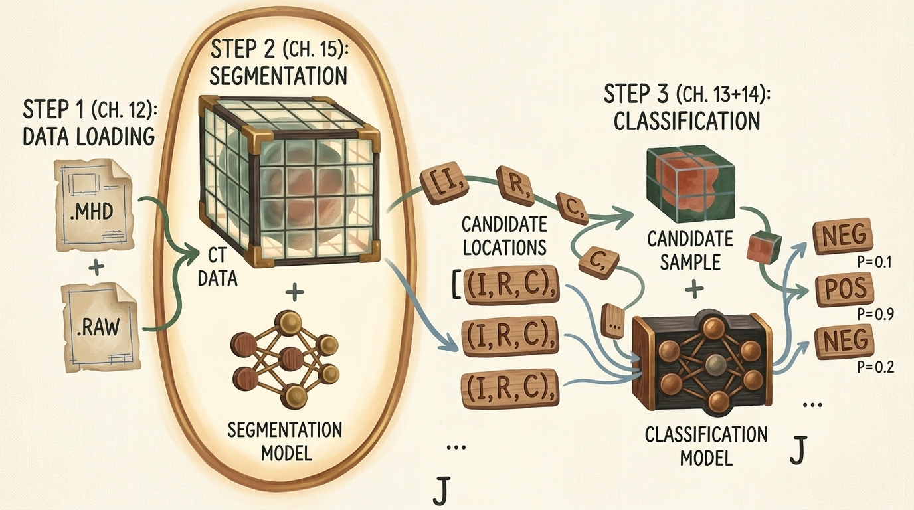
    <figcaption style="margin-top: 0.6em; text-align: center; font-size: 13px; color: #888;"><em>Şekil 1: Uçtan uca 3 adımlı bilgisayar destekli teşhis (CAD) iş akışı. 1. Adım (Bölüm 2.4) ham .mhd/.raw BT taramalarını yükler; 2. Adım (Bölüm 2.7, vurgulanan) semantik segmentasyon kullanarak aday koordinat konumlarını [(I, R, C), ...] önerir; 3. Adım (Bölüm 2.5 & 2.6) aday alt hacimleri tümör veya iyi huylu doku olarak sınıflandırır.</em></figcaption>
  </div>
</figure>

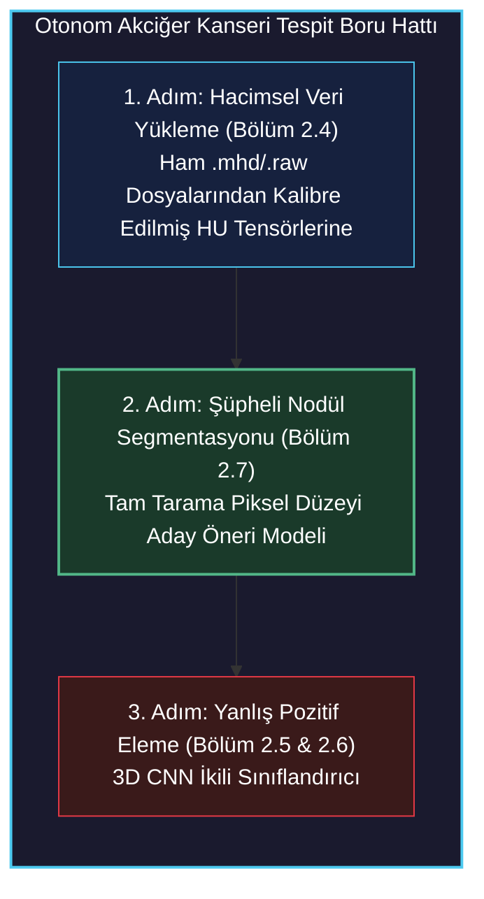

> **Temel Çıkarım:** Bilgisayar destekli tespitte (CAD), segmentasyon modeli yüksek duyarlılıklı (high-recall) bir süzgeç görevi görür. Amacı nihai klinik teşhisi koymak değil; arama uzayını 100 milyon vokselden birkaç düzine aday koordinata indirirken gerçek hiçbir tümörü kaçırmamaktır.

---

## 2. Bölüm 2.7 Sistem Yol Haritası

Boru hattımızın 2. Adımını hayata geçirmek için mimari kavramlar, veri dönüşümleri, eğitim mekaniği ve çıkarım anında aday çıkarma aşamalarını içeren metodik bir mühendislik planı izliyoruz.

<figure style="display:flex; justify-content: center; margin: 25px 0;">
  <div style="text-align: center;">
    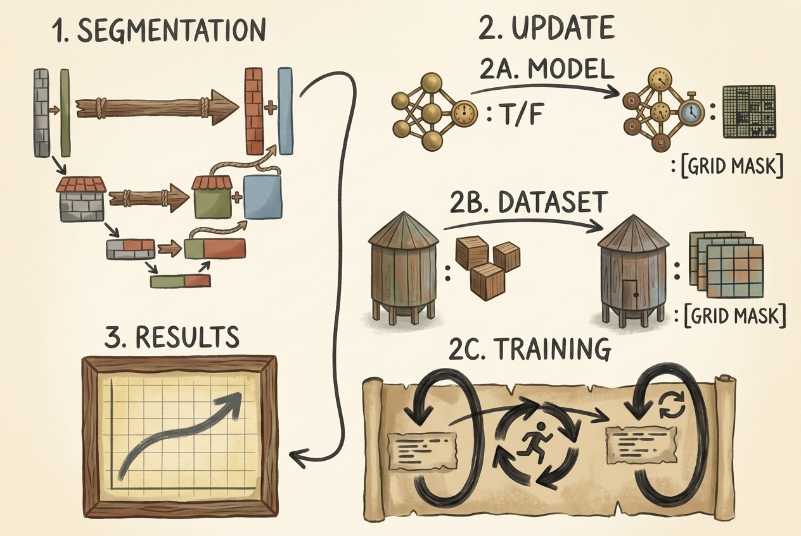
    <figcaption style="margin-top: 0.6em; text-align: center; font-size: 13px; color: #888;"><em>Şekil 2: Bölüm 2.7 yol haritası: 1. Segmentasyon mimarileri (U-Net ve Vision Transformer'lar); 2. Çekirdek boru hattı güncellemeleri (2A Maske üreten model, 2B 2D dilim besleyen veri kümesi, 2C Dice/BCE kaybı ile eğitim döngüsü); 3. Doğrulama sonuçları ve aday koordinat üretimi.</em></figcaption>
  </div>
</figure>

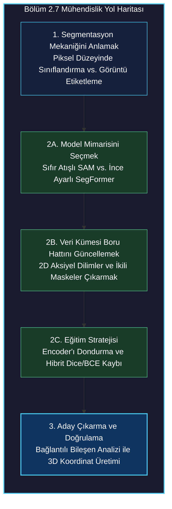

---

## 3. Sınıflandırma ve Semantik Segmentasyon Karşılaştırması

Özel bir segmentasyon modeline neden ihtiyaç duyulduğunu anlamak için görüntü düzeyinde sınıflandırma ile semantik segmentasyon arasındaki anlamsal çıktı farkını incelemeliyiz.

<figure style="display:flex; justify-content: center; margin: 25px 0;">
  <div style="text-align: center;">
    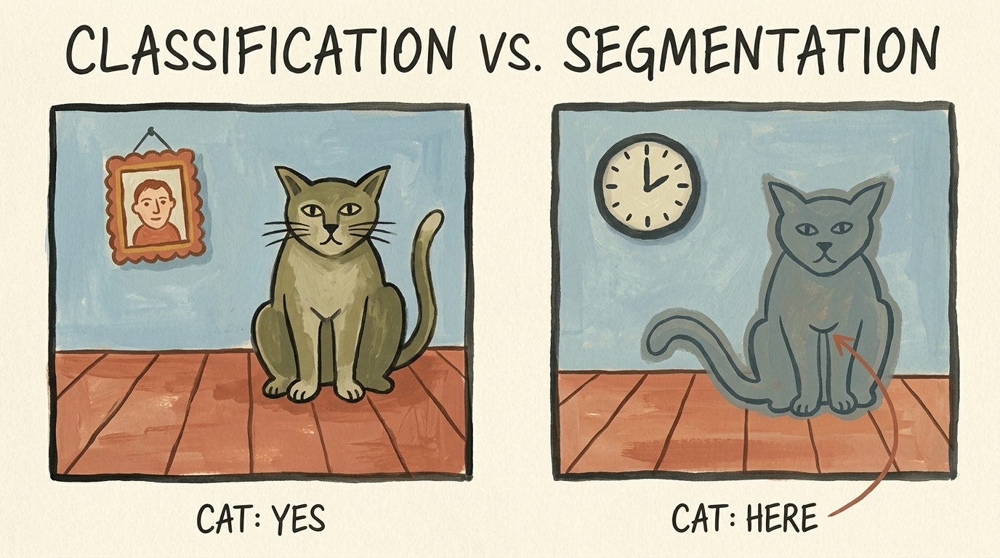
    <figcaption style="margin-top: 0.6em; text-align: center; font-size: 13px; color: #888;"><em>Şekil 3: Sınıflandırma ve Segmentasyon. Sol: Sınıflandırma konumsal yer belirtmeksizin genel bir görüntü düzeyi kararı üretir ('KEDİ: EVET'). Sağ: Semantik segmentasyon nesnenin sınırlarını piksel düzeyinde çizen yoğun bir ikili maske üretir ('KEDİ: BURADA').</em></figcaption>
  </div>
</figure>

### 3.1 Çıktı Uzaylarının Matematiksel Formülasyonu

İkili sınıflandırmada yapay sinir ağı, girdi olarak aldığı $\mathbf{X} \in \mathbb{R}^{C \times H \times W}$ tensörünü sınıf aidiyetini temsil eden tek bir skaler olasılığa eşler:

$$ f_{\text{cls}}(\mathbf{X}) = \hat{y} \in [0, 1] $$

Buna karşın **Semantik Segmentasyon**, piksel başına (veya voksel başına) yoğun sınıflandırma yürütür. Ağ, girdi görüntüsüyle tamamen aynı yükseklik ve genişlikte uzamsal bir olasılık haritası üretir:

$$ f_{\text{seg}}(\mathbf{X}) = \hat{\mathbf{M}} \in [0, 1]^{H \times W} $$

Burada her bir $\hat{\mathbf{M}}_{i, j}$ elemanı, $(i, j)$ pikselinin hedef ön plan sınıfına (nodüle) ait olma koşullu olasılığını ifade eder:

$$ \hat{\mathbf{M}}\_{i, j} = P(Y\_{i, j} = 1 \mid \mathbf{X}) $$

### 3.2 Standart Sınıflandırma Ağlarındaki Uzamsal Darboğaz

Peki Bölüm 2.5'teki CNN sınıflandırıcımızı nodülün *nerede* olduğunu tespit etmek için neden doğrudan kullanamayız?

Standart sınıflandırma mimarileri, piksel verilerini daha yüksek düzeyli anlamsal özelliklere (dokular $\to$ nesne parçaları $\to$ kategoriler) dönüştürmek için ardışık uzamsal alt örnekleme (stride adımlı konvolüsyonlar ve max pooling) kullanır. Ağın çıkış ucunda yer alan Global Ortalama Havuzlama (GAP) veya tam bağlantılı (fully connected) katmanlar kalan tüm 2D uzamsal boyutları tek boyutlu bir vektöre indirger:

<figure style="display:flex; justify-content: center; margin: 25px 0;">
  <div style="text-align: center;">
    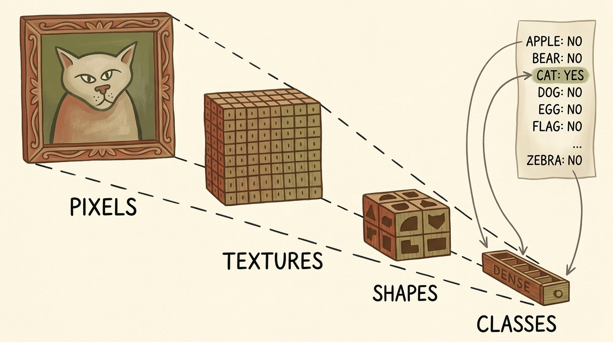
    <figcaption style="margin-top: 0.6em; text-align: center; font-size: 13px; color: #888;"><em>Şekil 4: Sınıflandırma ağlarındaki uzamsal darboğaz. Girdi pikselleri doku ve şekilleri yakalayan katmanlardan geçer; ancak havuzlama işlemleri 2D uzamsal ızgarayı sınıf olasılıkları içeren tek boyutlu bir vektöre indirger (Elma: Hayır, Ayı: Hayır, Kedi: Evet). Koordinat bilgisi geri döndürülemez biçimde yok edilir.</em></figcaption>
  </div>
</figure>

```markdown
Girdi: (C, H, W) ──> Conv/Pool ──> (C_1, H/2, W/2) ──> ... ──> (C_k, 1, 1) ──> Linear ──> (K sınıf)
```

Tensör tek boyutlu bir logit vektörüne indirgendiğinde, orijinal $(x, y)$ koordinatları geri döndürülemez şekilde kaybolur. Yoğun uzamsal koordinatları korumak ve yeniden inşa etmek için segmentasyon mimarileri, anlamsal bağlam için alt örnekleme yapan, ardından atlama bağlantıları (skip connections) veya çok ölçekli dikkat mekanizmalarıyla orijinal çözünürlüğe geri çıkan bir **kodlayıcı-kod çözücü (encoder-decoder)** topolojisine (U-Net veya SegFormer gibi) ihtiyaç duyar.

---

## 4. Görmede Temel Modeller: Meta'nın Segment Anything Modeli (SAM)

Tarihsel olarak semantik segmentasyon, sıfırdan on binlerce piksel düzeyinde etiketlenmiş maske üzerinde tam konvolüsyonel ağlar (U-Net veya DeepLabV3 gibi) eğitmeyi gerektiriyordu. 2023 yılında Meta AI, bilgisayarlı görüde istem güdümlü temel modeller için bir dönüm noktası olan **Segment Anything Model (SAM)** mimarisini tanıttı (Kirillov vd.).

<figure style="display:flex; justify-content: center; margin: 25px 0;">
  <div style="text-align: center;">
    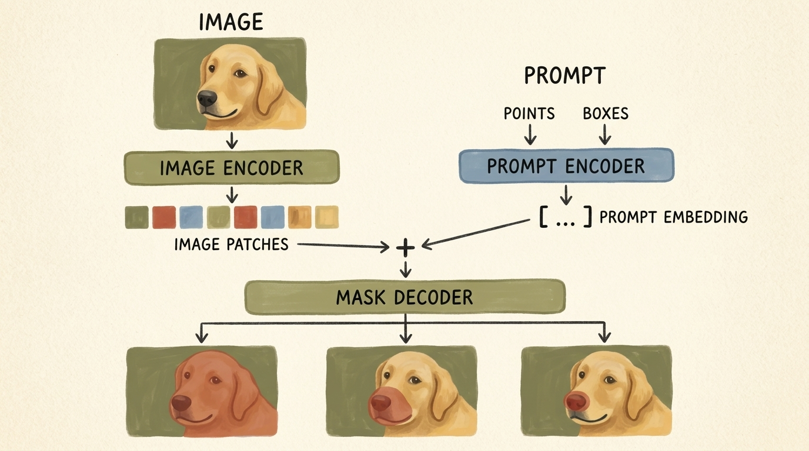
    <figcaption style="margin-top: 0.6em; text-align: center; font-size: 13px; color: #888;"><em>Şekil 5: Meta'nın SAM mimarisi. Görüntü Kodlayıcı (ağır ViT) girdiyi uzamsal yama gömmelerine dönüştürür. İstem Kodlayıcı tıklama noktalarını veya sınırlayıcı kutuları kodlar. Hafif iki yönlü Maske Kod Çözücü bu gömmeleri birleştirerek belirsizlik çözümlü aday maskeler üretir.</em></figcaption>
  </div>
</figure>

### 4.1 SAM Mimari Bileşenleri

SAM, gerçek zamanlı istemlenebilir çıkarım için üç ana bileşenden oluşur:

1. **Görüntü Kodlayıcı (Image Encoder - Ağır Omurga):**
   - Maskeli Otomatik Kodlayıcılar (MAE) ile önceden eğitilmiş bir Vision Transformer (ViT-B, ViT-L veya ViT-H) üzerine kuruludur.
   - $1024 \times 1024$ yüksek çözünürlüklü bir görüntüyü alır, $16 \times 16$ boyutunda çakışmayan yamalara böler ve pencereli öz-dikkat bloklarından geçirir.
   - Çıktı olarak $64 \times 64 \times 256$ boyutunda uzamsal özellik haritası üretir ($\times 16$ alt örneklenmiş yoğun görüntü gömmesi).
   - *Hesaplama özelliği:* Ağır hesaplama maliyeti ($\approx 91\text{M} - 600\text{M}$ parametre), görüntü başına yalnızca bir kez çalıştırılır.

2. **İstem Kodlayıcı (Prompt Encoder - Hafif):**
   - Seyrek istemleri işler: ön plan/arka plan tıklama noktaları, sınırlayıcı kutular (bounding boxes) veya kaba metin istemleri.
   - Noktalar ve kutular, nokta tipini temsil eden öğrenilmiş gömmelerle ($1 = \text{ön plan tıklaması}, 0 = \text{arka plan tıklaması}$) birleştirilmiş konumsal Fourier gömmeleriyle kodlanır.
   - *Hesaplama özelliği:* Son derece hafiftir (GPU/CPU üzerinde $< 1\text{ ms}$).

3. **Maske Kod Çözücü (Mask Decoder - Gerçek Zamanlı Füzyon):**
   - İki yönlü çapraz dikkat (cross-attention) yürüten iki katmanlı bir dönüştürücü kod çözücüdür: istem belirteçleri görüntü yama gömmelerine dikkat eder, görüntü gömmeleri de istem belirteçlerine geri dikkat eder.
   - **Belirsizlik Çözümleme (Ambiguity Resolution):** Tek bir nokta istemi geçerli biçimde iç içe geçmiş birden fazla nesneyi belirtebilir (örneğin bir köpeğin burnuna tıklamak tüm köpeği, köpeğin ağız-burun bölgesini veya yalnızca burun ucunu kastediyor olabilir). SAM kod çözücüsü, tahmin edilen IoU skoruyla birlikte farklı granülerliklerde aynı anda 3 aday maske üretir.

### 4.2 SAM'i Nokta İstemli Segmentasyon İçin Kullanmak

Resmi segment-anything kütüphanesini GitHub üzerinden kurarak SAM'i sıfır atışlı (zero-shot) biçimde kullanabiliriz:

```bash
pip install git+https://github.com/facebookresearch/segment-anything.git
```

Model ağırlıklarını (`sam_vit_b_01ec64.pth`) yükleyip GPU'ya aktarır ve `SamPredictor` sarmalayıcısını başlatırız:

```python
import torch
from segment_anything import sam_model_registry, SamPredictor

device = torch.device("cuda" if torch.cuda.is_available() else "cpu")

# ViT-Base kontrol noktasını yükleme (91M parametre)
sam_checkpoint = "sam_vit_b_01ec64.pth"
model_type = "vit_b"

sam = sam_model_registry[model_type](checkpoint=sam_checkpoint)
sam.to(device=device)

# İstemlenebilir tahminciyi başlatma
predictor = SamPredictor(sam)
```

---

## 5. Hacimsel Dilimleme: 3D BT Taramalarını 2D Temel Modellere Uyarlama

Tıbbi bilgisayarlı görüde karşılaşılan temel mimari engel **boyut uyumsuzluğudur (dimensional mismatch)**:
- Görme temel modelleri (SAM, SegFormer, CLIP, Stable Diffusion) milyarlarca **2D doğal görüntü** üzerinde eğitilmiştir.
- Tıbbi BT taramaları ise doku radyodansitesini temsil eden **3D hacimsel skaler alanlardır** ($D \times H \times W$).

Gerçek 3D temel modeller, 2D modellerin ölçeğinde mevcut değildir; çünkü 3D medikal veri kümeleri kısıtlıdır ve 3D bellek ayak izi kübik biçimde ($O(N^3)$) büyür. 2D temel modellerin üstün temsil gücünden yararlanmak için 3D BT taramalarımızı **Z-ekseni boyunca 2D aksiyel dilimlere** ayırırız.

<figure style="display:flex; justify-content: center; margin: 25px 0;">
  <div style="text-align: center;">
    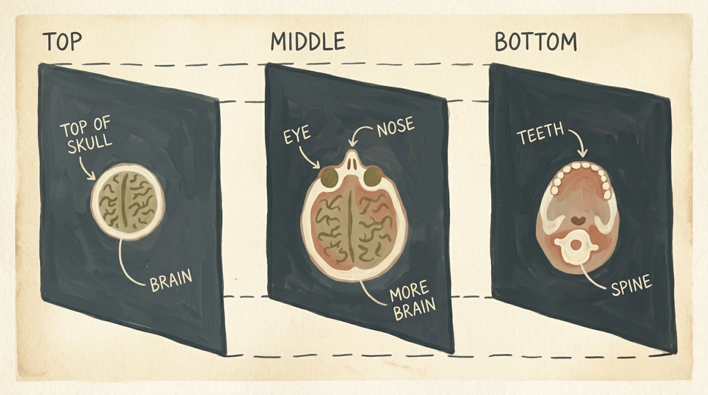
    <figcaption style="margin-top: 0.6em; text-align: center; font-size: 13px; color: #888;"><em>Şekil 6: Hacimsel BT taramasının dilimlenmesi. Sürekli bir 3D hacim, kraniyal-kaudal Z-ekseni boyunca üstte kafatası yapıları, ortada göğüs akciğer boşlukları ve altta omurga/karın anatomisi görülecek biçimde sıralı 2D aksiyel düzlem dilimlerine ayrıştırılır.</em></figcaption>
  </div>
</figure>

### 5.1 Anatomik Koordinat Dönüşümü

Bölüm 2.4'ten hatırlanacağı üzere, hasta koordinatları tarayıcı başlangıç noktasına göre milimetre cinsinden $(x, y, z)_{\text{mm}}$ olarak ifade edilir. Bilinen bir nodül adayını içeren tam 2D aksiyel dilimi çıkarmak için milimetre koordinatlarını tamsayı voksel indekslerine dönüştürürüz:

$$ i_z = \left\lfloor \frac{z_{\text{mm}} - z_{\text{origin}}}{s_z} \right\rceil, \quad i_r = \left\lfloor \frac{y_{\text{mm}} - y_{\text{origin}}}{s_y} \right\rceil, \quad i_c = \left\lfloor \frac{x_{\text{mm}} - x_{\text{origin}}}{s_x} \right\rceil $$

Burada $s_x, s_y, s_z$ tarayıcının milimetre cinsinden voksel aralıklarını (spacing) temsil eder.

```python
# Milimetre koordinatlarını ayrık voksel indeks uzayına dönüştürme
slice_ndx = int(round((center_xyz[2] - ct.origin_xyz[2]) / ct.vxSpacing_xyz[2]))
row_ndx = int(round((center_xyz[1] - ct.origin_xyz[1]) / ct.vxSpacing_xyz[1]))
col_ndx = int(round((center_xyz[0] - ct.origin_xyz[0]) / ct.vxSpacing_xyz[0]))

# 3D Hounsfield tensöründen 2D aksiyel dilimi çekme
ct_slice_hu = ct.hu_a[slice_ndx]  # Boyut: (512, 512)
```

### 5.2 Radyodansite Pencerleme ve Normalizasyon

Ham BT vokselleri Hounsfield Birimi (HU) ile kalibre edilmiştir (Hava = $-1000\text{ HU}$, Yoğun Kemik = $+1000\text{ HU}$). 2D görme modelleri $[0, 1]$ veya $[0, 255]$ aralığında normalize edilmiş girdiler beklediğinden, **Akciğer Pencerleme (Lung Windowing)** uygularız:
- Pencere Merkezi (Level): $L = -600\text{ HU}$
- Pencere Genişliği: $W = 1500\text{ HU}$
- Efektif Aralık: $[-1350\text{ HU}, +150\text{ HU}]$

$+150\text{ HU}$ üzerindeki tüm yoğun dokular 1.0 (beyaz) değerine, $-1350\text{ HU}$ altındaki hava ise 0.0 (siyah) değerine kırpılarak akciğer parankimi ve yumuşak nodüller arasındaki kontrast maksimize edilir.

<figure style="display:flex; justify-content: center; margin: 25px 0;">
  <div style="text-align: center;">
    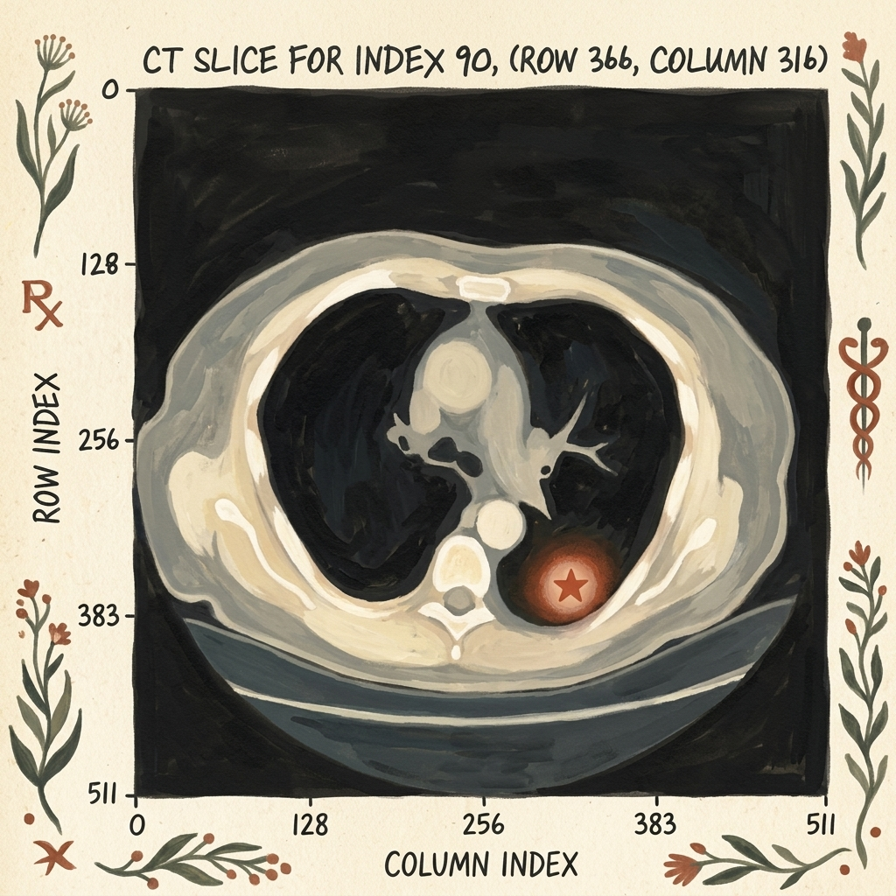
    <figcaption style="margin-top: 0.6em; text-align: center; font-size: 13px; color: #888;"><em>Şekil 7: İndeks 90'daki 512x512 aksiyel torasik BT dilimi. Sağ alt akciğer alanında, (Satır: 366, Sütun: 316) voksel koordinatında kırmızı yıldızla işaretlenmiş soliter pulmoner nodül açıkça görülmektedir.</em></figcaption>
  </div>
</figure>

```python
import numpy as np

def normalize_lung_window(slice_hu, vmin=-1000.0, vmax=400.0):
    """Ham BT Hounsfield Birimlerini [0, 1] aralığına normalize eder."""
    clipped = np.clip(slice_hu, vmin, vmax)
    normalized = (clipped - vmin) / (vmax - vmin)
    return normalized.astype(np.float32)
```

---

## 6. SAM ile Sahte Yer Gerçeği Üretimi ve Segmentasyon Veri Kümesi

Otonom bir segmentasyon ağını eğitmek için eşleştirilmiş girdilere ihtiyacımız vardır: bir girdi BT dilimi $\mathbf{X}$ ve karşılık gelen ikili yer gerçeği maskesi $\mathbf{Y} \in \{0, 1\}^{H \times W}$.

LUNA veri kümesi aday merkez koordinatlarını $(x, y, z)$ ve yaklaşık çapları sunarken, nodüller için piksel düzeyinde poligon maskeleri **içermez**. Burada **SAM'i bir açıklama asistanı olarak** kullanırız:
1. Normalize edilmiş 2D BT dilimini SAM görüntü kodlayıcısına veririz.
2. Bilinen nodül koordinatını $(sutun, satir) = (316, 366)$ tek bir pozitif nokta istemi olarak aktarırız.
3. SAM milisaniyeler içinde nodülün morfolojik sınırlarını bölütleyerek yer gerçeği maskemizi $\mathbf{Y}$ oluşturur.

```python
# SAM için dilimi 3 kanallı uint8 formatına dönüştürme
slice_rgb = np.repeat((normalized_slice * 255).astype(np.uint8)[:, :, None], 3, axis=2)

# Görüntüyü SAM tahmincisine verme
predictor.set_image(slice_rgb)

# Bilinen nodül koordinatını pozitif istem olarak tanımlama (label=1)
point_coords = np.array([[col_ndx, row_ndx]])
point_labels = np.array([1])

# İkili maskeleri tahmin etme
masks, scores, logits = predictor.predict(
    point_coords=point_coords,
    point_labels=point_labels,
    multimask_output=True
)

# En yüksek IoU skorlu maskeyi seçme
best_mask = masks[np.argmax(scores)]  # Boyut: (512, 512), tip: bool
```

### 6.1 Veri Kümesi Dizin Mimarisi

Üretilen bu dilim-maske çiftlerini disk üzerinde yüksek performanslı ve yapılandırılmış bir dizine kaydederiz:

<figure style="display:flex; justify-content: center; margin: 25px 0;">
  <div style="text-align: center;">
    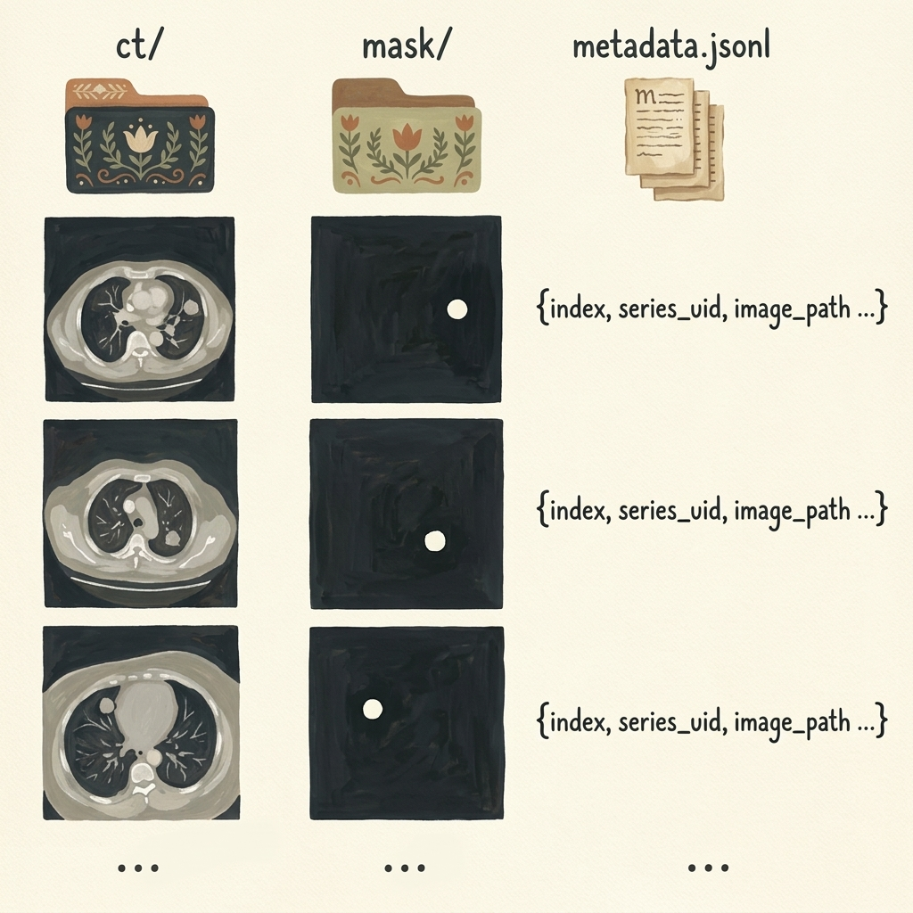
    <figcaption style="margin-top: 0.6em; text-align: center; font-size: 13px; color: #888;"><em>Şekil 8: Segmentasyon veri kümesi mimarisi. Üç bileşen: ct/ (2D aksiyel BT dilimleri), mask/ (karşılık gelen ikili segmentasyon maskeleri) ve metadata.jsonl (dilim indeksleri, seri UID'leri ve dosya yollarını tutan katalog).</em></figcaption>
  </div>
</figure>

```
data-segmentation/
├── ct/
│   ├── slice_00090.png
│   ├── slice_00124.png
│   └── ...
├── mask/
│   ├── mask_00090.png
│   ├── mask_00124.png
│   └── ...
└── metadata.jsonl
```

`metadata.jsonl` dosyasındaki her satır yapılandırılmış bir JSON kaydıdır:

```json
{"index": 90, "series_uid": "1.3.6.1.4.1.14519...", "image_path": "ct/slice_00090.png", "mask_path": "mask/mask_00090.png", "row": 366, "col": 316}
```

---

## 7. SegFormer ile Tam Otonom İstemsiz Segmentasyon

SAM, bir nokta veya kutu ile yönlendirildiğinde sıfır atışlı etkileşimli segmentasyonda mükemmel olsa da, **doğrudan otonom bir klinik tarayıcı olarak devreye alınamaz**. Otonom bir tarayıcı, unannotated (etiketlenmemiş) bir BT taramasını almalı ve *hiçbir insan nodülün nerede olduğunu tıklamadan* nodülleri otonom tespit edebilmelidir.

Otonom semantik segmentasyon için *Deep Learning with PyTorch (2nd Ed)* yazarları **SegFormer** (Xie vd., NeurIPS 2021) mimarisine geçerler.

<figure style="display:flex; justify-content: center; margin: 25px 0;">
  <div style="text-align: center;">
    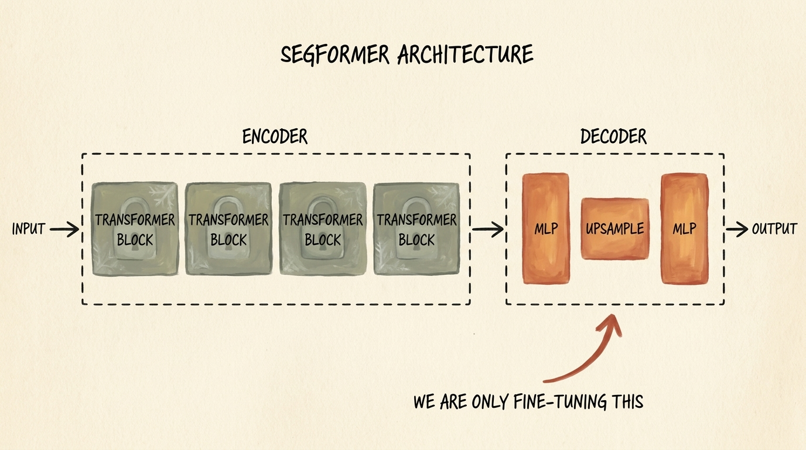
    <figcaption style="margin-top: 0.6em; text-align: center; font-size: 13px; color: #888;"><em>Şekil 9: SegFormer mimarisi ve ince ayar stratejisi. Hiyerarşik Mix Transformer (MiT) kodlayıcısı eğitim boyunca dondurulur (requires_grad = False). Yalnızca hafif All-MLP Kod Çözücüsü eğitilir; bu sayede tek bir GPU üzerinde hızlı yakınsama sağlanır.</em></figcaption>
  </div>
</figure>

### 7.1 SegFormer Mimarisi: Hiyerarşik Transformer + All-MLP Kod Çözücü

SegFormer, standart Vision Transformer'ların hesaplama darboğazlarını iki temel yenilikle aşar:

1. **Hiyerarşik Mix Transformer (MiT) Kodlayıcısı:**
   - Sabit yama gömmeleriyle tek çözünürlüklü özellik haritaları üreten standart ViT'in aksine SegFormer, orijinal çözünürlüğün $\{1/4, 1/8, 1/16, 1/32\}$ katlarında çok ölçekli özellik haritaları üretmek için **Çakışan Yama Birleştirme (Overlapping Patch Merging)** kullanır.
   - Konumsal gömmeleri (positional embeddings) tamamen ortadan kaldırarak ileri beslemeli bloklar içinde $3 \times 3$ derinlik konvolüsyonları (**Mix-FFN**) kullanır. Bu sayede konumsal kodları enterpole etmeden değişken girdi çözünürlüklerini doğrudan işleyebilir.
   - **Verimli Öz-Dikkat (Efficient Self-Attention)** ile Key ve Value dizilerini bir $R$ indirgeme oranıyla küçülterek dikkat karmaşıklığını $\mathcal{O}(N^2)$'den $\mathcal{O}\left(\frac{N^2}{R}\right)$'ye düşürür.

2. **Hafif All-MLP Kod Çözücü:**
   - Geleneksel segmentasyon kod çözücüleri (U-Net gibi) yoğun dekonvolüsyon katmanları kullanırken SegFormer yalnızca Çok Katmanlı Algılayıcılardan (MLP) oluşur. 4 kodlayıcı aşamasından gelen çok ölçekli özellikleri tek bir $C$ kanal boyutuna yansıtır, $1/4$ çözünürlüğe bilineer olarak büyütür, birleştirir ve tek bir doğrusal katmanla piksel düzeyinde logitleri tahmin eder.

### 7.2 İnce Ayar Stratejisi: Kodlayıcıyı Dondurma

Tıbbi görüntüleme veri kümeleri sınırlı olduğundan, tüm Vision Transformer'ı sıfırdan eğitmek aşırı öğrenmeye (overfitting) yol açar. **Parametre Verimli İnce Ayar (PEFT)** yaklaşımı benimseriz:
- Yalnızca 3.7 milyon parametreye sahip hafif `nvidia/mit-b0` modelini yükleriz.
- **MiT kodlayıcısının tüm parametrelerini dondururuz** (`param.requires_grad = False`).
- **Yalnızca All-MLP Kod Çözücüsünü eğitiriz**, böylece modelin çıktısını BT nodül dağılımına uyarlarız.

```python
from transformers import SegformerForSemanticSegmentation

# 2 sınıflı (0: arka plan, 1: nodül) önceden eğitilmiş SegFormer'ı yükleme
model = SegformerForSemanticSegmentation.from_pretrained(
    "nvidia/mit-b0",
    num_labels=2,
    ignore_mismatched_sizes=True
)

# Kodlayıcı parametrelerini dondurma
for param in model.segformer.encoder.parameters():
    param.requires_grad = False

# Eğitilebilir parametre sayısını denetleme
trainable_params = sum(p.numel() for p in model.parameters() if p.requires_grad)
total_params = sum(p.numel() for p in model.parameters())

print(f"Toplam Parametre: {total_params:,}")
print(f"Eğitilebilir Parametre (Yalnızca Kod Çözücü): {trainable_params:,} (%{100 * trainable_params / total_params:.2f})")
```

---

## 8. Aşırı Ön Plan-Arka Plan Dengesizliği İçin Kayıp Fonksiyonları: BCE + Dice Kaybı

Tıbbi segmentasyonda sınıf dengesizliği sınıflandırmadan çok daha dramatiktir. $512 \times 512$ boyutundaki bir BT diliminde $262{,}144$ piksel bulunur. 10 piksel çapındaki tipik bir akciğer nodülü yaklaşık $78$ piksel kaplar:

$$ \frac{\text{Nodül Pikselleri}}{\text{Toplam Piksel}} = \frac{78}{262{,}144} \approx 0.0003 \quad (\%0.03) $$

Eğer segmentasyon ağını standart piksel başına Çapraz Entropi (Cross-Entropy) ile eğitirsek model, tüm piksellere arka plan ($0$) tahmin ederek **%99.97 doğruluk** elde edebileceğini öğrenir ve nodülleri tamamen göz ardı eder.

### 8.1 Logit Tabanlı İkili Çapraz Entropi (BCE)

Standart piksel düzeyi sınıflandırma kaybı her pikseli bağımsız değerlendirir:

$$ \mathcal{L}\_{\text{BCE}}(\mathbf{y}, \hat{\mathbf{p}}) = -\frac{1}{N} \sum_{i=1}^N \left[ y_i \log(\hat{p}_i) + (1 - y_i) \log(1 - \hat{p}_i) \right] $$

Toplamın %99.97'sini arka plan pikselleri oluşturduğundan, nadir nodül piksellerinin gradyanları tamamen boğulur.

### 8.2 Yumuşak Dice Kaybı (Sørensen–Dice Katsayısı)

Sınıf boyutundan bağımsız biçimde doğrudan örtüşmeyi (overlap) maksimize etmek için **Dice Kaybı** kullanılır:

$$ \text{Dice} = \frac{2 |\mathbf{Y} \cap \hat{\mathbf{P}}|}{|\mathbf{Y}| + |\hat{\mathbf{P}}|} = \frac{2 \sum\_{i=1}^N y\_i \hat{p}\_i}{\sum\_{i=1}^N y\_i + \sum\_{i=1}^N \hat{p}\_i} $$

Geriye yayılımda türevlenebilir olması için Laplace düzeltme terimi ($\epsilon = 1.0$) eklenerek **Yumuşak Dice Kaybı (Soft Dice Loss)** formüle edilir:

$$ \mathcal{L}\_{\text{Dice}}(\mathbf{y}, \hat{\mathbf{p}}) = 1 - \frac{2 \sum\_{i=1}^N y\_i \hat{p}\_i + \epsilon}{\sum\_{i=1}^N y\_i + \sum\_{i=1}^N \hat{p}\_i + \epsilon} $$

### 8.3 Hibrit Kayıp: Yerel ve Küresel Hedeflerin Birleşimi

Uygulamada BCE ile Yumuşak Dice kaybının ağırlıklı toplamı en kararlı yakınsamayı sağlar:

$$ \mathcal{L}\_{\text{total}} = \mathcal{L}\_{\text{BCE}} + \lambda \mathcal{L}\_{\text{Dice}} $$

```python
import torch
import torch.nn as nn
import torch.nn.functional as F

class DiceBCELoss(nn.Module):
    """
    Şiddetli sınıf dengesizliğine sahip semantik segmentasyon için
    İkili Çapraz Entropi ve Yumuşak Dice Kaybı kombinasyonu.
    """
    def __init__(self, dice_weight=1.0, smooth=1.0):
        super().__init__()
        self.dice_weight = dice_weight
        self.smooth = smooth
        self.bce = nn.BCEWithLogitsLoss()

    def forward(self, logits, targets):
        logits_flat = logits.view(-1)
        targets_flat = targets.view(-1)

        bce_loss = self.bce(logits_flat, targets_flat.float())

        probs = torch.sigmoid(logits_flat)
        intersection = (probs * targets_flat).sum()
        dice_loss = 1.0 - (2.0 * intersection + self.smooth) / (
            probs.sum() + targets_flat.sum() + self.smooth
        )

        return bce_loss + self.dice_weight * dice_loss
```

---

## 9. Eğitim, Kontrol Noktaları ve Aday Koordinat Çıkarımı

### 9.1 Eğitim Döngüsü

İnce ayarını yaptığımız SegFormer modelini `AdamW` optimizatörü ($5 \times 10^{-4}$ öğrenme oranı ve $10^{-2}$ weight decay) ile eğitiriz:

```python
from torch.optim import AdamW

# Optimizatör YALNIZCA eğitilebilir parametrelere (kod çözücüye) uygulanır
optimizer = AdamW(
    filter(lambda p: p.requires_grad, model.parameters()),
    lr=5e-4,
    weight_decay=1e-2
)

criterion = DiceBCELoss(dice_weight=1.0)
num_epochs = 20

model.to(device)

for epoch in range(1, num_epochs + 1):
    model.train()
    running_train_loss = 0.0

    for batch_images, batch_masks in train_loader:
        batch_images = batch_images.to(device)
        batch_masks = batch_masks.to(device)

        optimizer.zero_grad()

        # İleri geçiş
        outputs = model(pixel_values=batch_images)
        logits = outputs.logits

        # Logitleri yer gerçeği çözünürlüğüne (512, 512) enterpole etme
        upsampled_logits = F.interpolate(
            logits,
            size=batch_masks.shape[-2:],
            mode="bilinear",
            align_corners=False
        )

        # Nodül sınıfı (kanal 1) üzerinde kayıp hesabı
        loss = criterion(upsampled_logits[:, 1], batch_masks)

        loss.backward()
        optimizer.step()

        running_train_loss += loss.item()

    avg_train_loss = running_train_loss / len(train_loader)
    print(f"Epoch {epoch:02d}/{num_epochs:02d} | Train Loss: {avg_train_loss:.4f}")
```

### 9.2 Ağırlıkların Kaydedilmesi ve Yüklenmesi

Eğitim tamamlandığında model parametrelerini diske yazarız:

```python
torch.save(model.state_dict(), "segformer_nodule_epoch_20.pt")

# Çıkarım için yükleme
model.load_state_dict(torch.load("segformer_nodule_epoch_20.pt", map_location=device))
model.eval()
```

### 9.3 Bağlantılı Bileşen Analizi ile Aday Çıkarımı

Model aksiyel bir dilim için olasılık haritası $\hat{\mathbf{M}}$ ürettiğinde:
1. **Eşikleme:** $\hat{\mathbf{M}}_{i, j} > 0.5$ eşik değeriyle ikili maske elde edilir.
2. **Bağlantılı Bileşenler:** `scipy.ndimage.label` veya OpenCV ile bitişik pozitif pikseller ayrık aday kümelerine gruplanır.
3. **Ağırlık Merkezi:** Her bileşenin kütle merkezi $(r_c, c_c)$ hesaplanır.
4. **Vokselden Milimetreye Eşleme:** Voksel aralıkları kullanılarak $(slice\_ndx, r_c, c_c)$ koordinatları $(x, y, z)_{\text{mm}}$ uzayına taşınır.

Elde edilen bu aday koordinatlar doğrudan Bölüm 2.6'daki 3D sınıflandırıcıya aktarılır ve uçtan uca otonom bilgisayar destekli tespit boru hattı tamamlanmış olur.

---

## 10. Özet ve Temel Çıkarımlar

1. **CAD Boru Hattı 2. Adım:** Semantik segmentasyon ile aday önerisi, 100 milyon vokseli 3D konvolüsyonel sınıflandırıcılarla tarama imkansızlığını ortadan kaldırarak aday uzayını birkaç düzineye indirir.
2. **Piksel Düzeyinde ve Küresel Semantik:** Sınıflandırma uzamsal bilgiyi tek boyutlu olasılıklara indirgeyerek koordinatları yok eder; segmentasyon ise kodlayıcı-kod çözücü mimarileriyle uzamsal ayrıntıları korur.
3. **Görmede Temel Modeller:** Meta'nın Segment Anything Modeli (SAM), radyolog tıklamalarıyla yönlendirildiğinde yer gerçeği maske üretimi için sıfır atışlı ve üstün bir açıklama asistanıdır.
4. **3D'den 2D'ye Dilimleme:** Z-ekseni boyunca 2D aksiyel dilimler çıkarmak, imkansız 3D bellek gereksinimleri olmadan milyarlarca parametreli 2D görme temel modellerinden yararlanmayı sağlar.
5. **Otonom İstemsiz Segmentasyon:** SAM etkileşimli insan istemi gerektirdiğinden, tam otonom ve istemsiz segmentasyon için **SegFormer (`nvidia/mit-b0`)** mimarisi ince ayar yapılır.
6. **Parametre Verimli İnce Ayar:** Mix Transformer (MiT) kodlayıcısını dondurup yalnızca hafif All-MLP Kod Çözücüsünü eğitmek, tek GPU üzerinde hızlı eğitim sağlarken aşırı öğrenmeyi engeller.
7. **Hibrit Dice + BCE Kaybı:** Kararlı gradyan akışını doğrudan uzamsal örtüşme optimizasyonuyla birleştirerek tıbbi segmentasyondaki %99.97 arka plan dengesizliğini çözer.

