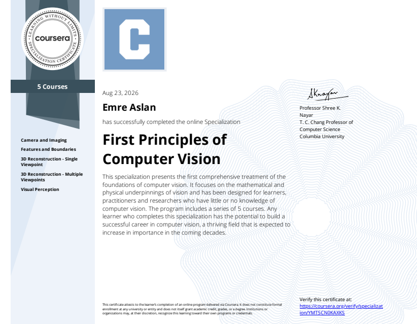

  

  <a href="https://coursera.org/share/c55b3b8ec425694695c1711202dcda1a" target="_blank" style="font-size: 13px;">
    🔗 Sertifikayı Görüntüle ↗
  </a>

  &therefore;

<i>
  <a href="https://www.coursera.org/specializations/firstprinciplesofcomputervision" target="_blank">First Principles of Computer Vision Specialization</a>
  kursunu tamamlarken aldığım detaylı notlar — ileride başvurmak üzere
  kritik konseptlerin özeti.
</i>

  <b>Columbia Üniversitesi</b>

  <a href="https://www.cs.columbia.edu/~shree/" target="_blank"><i>Shree K. Nayar</i></a>

---

### Ders & Not Genel Bakışı

Bu notlar, Columbia Üniversitesi'nden Prof. Shree K. Nayar tarafından verilen **First Principles of Computer Vision** uzmanlık serisi boyunca tuttuğum çalışma notlarını içermektedir. Fiziksel optikten sensör yapısına, 3B projektif geometriden modern görsel algıya kadar bilgisayarlı görünün temel ilkelerini en alt seviyeden ele almaktadır.

| # | Ders / Alan | Temel Odak & Not İçeriği |
|---|---|---|
| 1 | **Bilgisayarlı Görmeye Giriş** | Hesaplamalı görme temelleri, biyolojik görme mekanizmaları, piksel temsilleri ve temel görüntü işleme boru hattı. |
| 2 | **Görüntüleme & Sensör Fiziği** | İğne deliği kamera modeli, mercek sistemleri, alan derinliği, sensör gürültüsü/dinamik aralık, HDR ve frekans uzayı filtreleme. |
| 3 | **Öznitelikler & Sınırlar** | Kenar tespiti (Canny, Sobel), Hough dönüşümü, SIFT tanımlayıcıları, homografi, RANSAC ve panoramik görüntü birleştirme. |
| 4 | **3B Yeniden Yapılandırma (Tek Bakış)** | Radyometri ve BRDF yansıma modelleri, fotometrik stereo, gölgeden şekil çıkarma (SfS) ve aktif yapılandırılmış ışık sistemleri. |
| 5 | **3B Yeniden Yapılandırma (Çoklu Bakış)**| Epipolar geometri, stereo derinlik kestirimi, çoklu bakış geometrisi, Structure from Motion (SfM) ve optik akış (optical flow). |
| 6 | **Görsel Algı & Öğrenme** | Renk bilimi, insan görsel algı modelleri, yapay sinir ağları ve görsel tanıma/sınıflandırma mekanizmaları. |

  <i>&mdash; emreaslan &mdash;</i>

