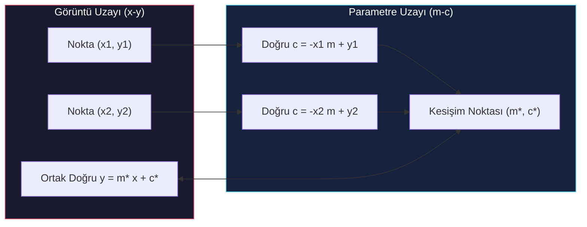

# Hough Dönüşümü ve Genelleştirilmiş Hough Dönüşümü

<!-- toc -->

Bu teknik ders notu, bilgisayarlı görünün gürültülü ve eksikli kenar haritalarında parametrik ve karmaşık şekilleri saptamak için kullandığı en kararlı oylama mekanizması olan **Hough Dönüşümü (Hough Transform)** ve analitik denklemi olmayan serbest nesneleri algılayan **Genelleştirilmiş Hough Dönüşümünü (Generalized Hough Transform - GHT)** matematiksel temelleri, parametre uzayı ikilikleri (*duality*) ve akümülatör algoritmaları çerçevesinde detaylıca ele almaktadır.

---

## 1. Hough Dönüşümü (Hough Transform)

Kenar tespiti sonrasında elde edilen ikili kenar haritaları, arka plan gürültüleri, ayrık pikseller ve eksik hatlar (*gaps*) içerir. Klasik çizgi uydurma yöntemleri tek bir gürültü pikselinden bile aşırı etkilenebilir.

<figure style="display:flex; justify-content: center; margin: 20px 0;">
  

    
    <figcaption style="margin-top: 0.5em; text-align: center; font-size: 13px; color: #888;"><em>Şekil 1: Görüntü uzayında doğru üzerindeki gerçek pikseller (*inliers* - koyu gri) ve bağımsız arka plan gürültü pikselleri (*outliers* - açık gri).</em></figcaption>
  

</figure>

**Hough Dönüşümü**, görüntü uzayındaki pikselleri bir parametre uzayında oylamaya dönüştürerek "içeridekiler-dışarıdakiler" (*inlier-outlier*) problemini çözen son derece kararlı bir küresel optimizasyon yöntemidir.

---

### 1.1. Doğru Algılama (Line Detection)

Bir görüntü içindeki düz doğruları saptamak istediğimizi ve doğrunun Kartezyen denkleminin $y = mx + c$ olduğunu varsayalım.

#### 1.1.1. Geometrik İkilik (Duality Concept)

Doğru denklemini parametreler cinsinden yeniden yazarsak:

$$c = - m x_i + y_i$$

Bu eşitlik, **Görüntü Uzayı ($x-y$)** ile **Parametre Uzayı ($m-c$)** arasında mükemmel bir geometrik dualite (ikilik) kurar:

1. **Görüntü Uzayındaki Tek Bir Nokta ($x_i, y_i$):** Parametre uzayında $c = -x_i m + y_i$ denklemine sahip **bir doğruya** dönüşür. Bu doğru, o noktadan geçebilecek sonsuz sayıdaki olası çizginin $(m, c)$ parametre bileşimlerini temsil eder.
2. **Görüntü Uzayındaki Bir Doğru:** Parametre uzayında tek bir $(m^*, c^*)$ **noktasına** dönüşür.

<figure style="display:flex; justify-content: center; margin: 20px 0;">
  

    
    <figcaption style="margin-top: 0.5em; text-align: center; font-size: 13px; color: #888;"><em>Şekil 2: Görüntü uzayındaki $(x_i, y_i)$ noktalarının parametre uzayında birer doğru çizmesi ve kesişimleri.</em></figcaption>
  

</figure>

3. **Kesişim Mantığı:** Görüntü uzayında aynı doğru üzerinde yer alan pikseller, parametre uzayında tek bir kesişim noktasında $(m^*, c^*)$ birleşirler. Doğru üzerinde yer almayan gürültülü bir piksel ise bu kesişim noktasından geçmeyen bağımsız bir doğru çizer.

<figure style="display:flex; justify-content: center; margin: 20px 0;">
  

    
    <figcaption style="margin-top: 0.5em; text-align: center; font-size: 13px; color: #888;"><em>Şekil 3: Geometrik ikilik özeti: Görüntü uzayındaki doğru üzerindeki tüm pikseller parametre uzayında tek bir $(m, c)$ noktasında kesişir; gürültü pikseli ise farklı bir doğru çizer.</em></figcaption>
  

</figure>

---

#### 1.1.2. Kutupsal Parametrizasyon ($\theta - \rho$)

$y = mx + c$ parametrizasyonunda dikey doğrularda eğim sonsuza ulaştığı için ($m \to \infty$), parametre uzayının sınırları belirsizleşir ve sonsuz büyüklükte bir akümülatör matrisi ihtiyacı doğar. Bu pratik problemi aşmak için doğrunun **kutupsal (normal) parametrizasyonu** kullanılır:

$$x \sin\theta - y \cos\theta + \rho = 0 \implies \rho = y_i \cos\theta - x_i \sin\theta$$

Burada:
- $\theta \in [0, \pi)$: Doğrunun normalinin yatay eksenle yaptığı sınırlı açıdır.
- $\rho \in [-\sqrt{M^2+N^2}, \sqrt{M^2+N^2}]$: Doğrunun orijine olan en kısa dik mesafesidir ve en fazla görüntü köşegeni kadar olabilir.

<figure style="display:flex; justify-content: center; margin: 20px 0;">
  

    
    <figcaption style="margin-top: 0.5em; text-align: center; font-size: 13px; color: #888;"><em>Şekil 4: Kutupsal parametrizasyon ($\theta - \rho$): Görüntü uzayındaki her piksel parametre uzayında bir sinüzoid çizer; aynı doğru üzerindeki pikseller tek $(\theta^*, \rho^*)$ noktasında kesişir.</em></figcaption>
  

</figure>

---

#### 1.1.3. Akümülatör (Oylama) Algoritması

Doğru tespiti için arka planda çalışan oylama sistemi şu şekilde algoritolaştırılır:

1. **Parametre Uzayının Ayrıklaştırılması (Kuantizasyon):** $\theta$ ve $\rho$ parametre uzayları uygun bir çözünürlükte kuantize edilerek iki boyutlu ayrık bir $A(\theta, \rho)$ akümülatör matrisi (*accumulator array*) oluşturulur ve tüm hücreler sıfırlanır.
2. **Oylama (Voting) Süreci:** Görüntüdeki her bir $(x_i, y_i)$ kenar pikseli için, $\theta$ açısı $0$'dan $\pi$'ye kadar taranarak ilgili $\rho = y_i \cos\theta - x_i \sin\theta$ hesaplanır ve karşılık gelen hücrenin oy değeri 1 artırılır:

$$A(\theta, \rho) = A(\theta, \rho) + 1$$

<figure style="display:flex; justify-content: center; margin: 20px 0;">
  

    
    <figcaption style="margin-top: 0.5em; text-align: center; font-size: 13px; color: #888;"><em>Şekil 5: Akümülatör matrisinde oylama mantığı: Doğru üzerindeki 3 nokta ilgili hücredeki oy sayısını 3 yapar.</em></figcaption>
  

</figure>

3. **Tepe Noktası Arama (Peak Finding):** Tüm kenar pikselleri oylamayı tamamladıktan sonra akümülatör matrisindeki yerel maksimumlar (*peaks*) saptanır. Tepe noktalarının matris koordinatları, görüntüde yer alan baskın doğrunun parametrelerini ($\theta^*, \rho^*$) verir.

<figure style="display:flex; justify-content: center; margin: 20px 0;">
  

    
    <figcaption style="margin-top: 0.5em; text-align: center; font-size: 13px; color: #888;"><em>Şekil 6: Görüntü uzayındaki 4 bağımsız doğru, parametre uzayında 4 ayrı tepe kesişim noktası oluşturur.</em></figcaption>
  

</figure>

---

#### 1.1.4. Uygulama Örnekleri ve Mühendislik Detayları

<figure style="display:flex; justify-content: center; margin: 20px 0;">
  

    
    <figcaption style="margin-top: 0.5em; text-align: center; font-size: 13px; color: #888;"><em>Şekil 7: Kamera filmi şeridi üzerinde gerçek Hough doğru tespiti: Orijinal resim $\rightarrow$ Gradyan $\rightarrow$ Eşiklenmiş Kenar $\rightarrow$ Hough Akümülatör $A(\rho, \theta)$ ve tepe noktaları $\rightarrow$ Tespit edilen doğrular.</em></figcaption>
  

</figure>

<figure style="display:flex; justify-content: center; margin: 20px 0;">
  

    
    <figcaption style="margin-top: 0.5em; text-align: center; font-size: 13px; color: #888;"><em>Şekil 8: Endüstriyel makine paneli üzerinde Hough doğru tespiti ve akümülatör yerel maksimumları.</em></figcaption>
  

</figure>

- **Hücre Çözünürlüğü Seçimi:** Akümülatör hücreleri çok geniş (*düşük çözünürlük*) seçilirse, birbirine yakın ancak farklı doğrular tek bir hücrede birleşir ve tespit hatası oluşur. Hücreler çok küçük (*yüksek çözünürlük*) seçilirse, gürültü ve kuantizasyon hataları yüzünden oylar dağılır ve net tepe noktaları oluşamaz.
- **Yama Oylaması (Patch Voting):** Konum gürültülerine ve ayrıklaştırma hatalarına karşı direnç kazanmak için, pikseller akümülatörde sadece tek bir noktayı değil, merkezden dışa doğru sönen küçük bir hücre yamasını (*patch of cells*) oylarlar.
- **Tepe Ayıklama (Peak Extraction & NMS):** Görüntü gürültüsü nedeniyle gerçek tepe noktalarının etrafında kümelenmiş yüksek oy değerleri oluşur. Tekil ve net doğruları saptamak için köşelerdekine benzer bir **Aşırı Olmayanları Bastırma (Non-Maximal Suppression - NMS)** algoritması uygulanır.

---

### 1.2. Daire Algılama (Circle Detection)

Dairenin genel geometrik denklemi üç parametreye sahiptir:

$$(x - a)^2 + (y - b)^2 = r^2$$

Burada $(a,b)$ daire merkez koordinatlarını, $r$ ise yarıçapı temsil eder.

#### 1.2.1. Yarıçap ($r$) Bilindiğinde (2D Parametre Uzayı $A(a, b)$)

Eğer aranacak dairenin $r$ yarıçapı önceden biliniyorsa parametre uzayı iki boyutludur: $A(a, b)$. Görüntüdeki her bir $(x_i, y_i)$ kenar noktası, parametre uzayında kendi koordinatını merkez kabul eden $r$ yarıçaplı birer daire çizerek oylama yapar.

<figure style="display:flex; justify-content: center; margin: 20px 0;">
  

    
    <figcaption style="margin-top: 0.5em; text-align: center; font-size: 13px; color: #888;"><em>Şekil 9: Görüntü uzayındaki $(x_i, y_i)$ pikselinin parametre uzayında $r$ yarıçaplı bir daire çizerek oylama yapması.</em></figcaption>
  

</figure>

Tüm bu oylama daireleri, görüntüdeki dairenin gerçek merkezi olan $(a^*, b^*)$ hücresinde kesişerek tepe noktası oluşturur.

<figure style="display:flex; justify-content: center; margin: 20px 0;">
  

    
    <figcaption style="margin-top: 0.5em; text-align: center; font-size: 13px; color: #888;"><em>Şekil 10: Daire üzerindeki tüm kenar piksellerinin oylama daireleri gerçek merkez $(a^*, b^*)$ noktasında birleşir.</em></figcaption>
  

</figure>

<figure style="display:flex; justify-content: center; margin: 20px 0;">
  

    
    <figcaption style="margin-top: 0.5em; text-align: center; font-size: 13px; color: #888;"><em>Şekil 11: Gerçek madeni paralar üzerinde daire tespiti: Penny ($r = r_1$) için $A_1(a,b)$ akümülatörü ve Quarter ($r = r_2$) için $A_2(a,b)$ akümülatör çıktıları.</em></figcaption>
  

</figure>

---

#### 1.2.2. Kenar Yönelim (Gradyan) Bilgisi Kullanılarak Oylama Sönümleme

Eğer piksellerin konumuna ek olarak kenar yönelim açısı da gradyanlardan ($\phi_i$) hesaplanmışsa, daire merkezinin kenara dik doğrultuda ve tam olarak $r$ uzaklıkta olması gerektiği fiziksel olarak bilinir.

Bu durumda, parametre uzayında tüm bir daireyi çizip oylamak yerine, sadece kenar doğrultusunun her iki tarafındaki iki noktaya (iki hücreye) oy verilir:

$$a = x_i \pm r \cos\phi_i \quad \text{ve} \quad b = y_i \pm r \sin\phi_i$$

> **Key Insight:** Kenar gradyan yönünün kullanılması, oylama maliyetini ve gürültü birikimini $\mathcal{O}(N \cdot 360)$'tan $\mathcal{O}(N \cdot 2)$ seviyesine düşürerek inanılmaz bir algoritmik hızlanma sağlar.

---

#### 1.2.3. Yarıçap ($r$) Bilinmediğinde (3D Parametre Uzayı $A(a, b, r)$)

Yarıçap bilinmiyorsa parametre uzayı 3 boyutlu olmak zorundadır: $A(a, b, r)$. Her bir $(x_i, y_i)$ kenar noktası, 3D parametre uzayında birer **koni (*cone*) yüzeyi** oluşturacak şekilde oy verir. Parametre sayısı arttıkça akümülatör bellek ihtiyacı ve işlem süresi üssel olarak artar; bu nedenle parametre sayısı 3'ü geçen şekillerde klasik Hough yöntemi kullanışsız hale gelir.

---

## 2. Genelleştirilmiş Hough Dönüşümü (Generalized Hough Transform - GHT)

Klasik Hough dönüşümü analitik bir denkleme sahip geometrik şekilleri (doğru, daire, elips) bulabilirken, **Genelleştirilmiş Hough Dönüşümü (GHT)**, analitik denklemi bulunmayan serbest şablon şekilleri (örneğin kedi, araç veya yaprak silüeti) oylamayla saptamak amacıyla geliştirilmiştir.

---

### 2.1. Çevrimdışı (Offline) Model Oluşturma ve $\phi$-Table Tasarımı

Hedef nesne görüntüde aranmadan önce şablon nesnenin geometrik bir modeli çıkarılır:

1. **Referans Noktası Seçimi:** Şekil sınırının içinde veya merkezinde keyfi bir koordinat referans noktası $(x_c, y_c)$ olarak seçilir.
2. **Sınır Vektörlerinin Çıkarılması:** Şekil sınırındaki her bir $v_i$ noktası için lokal kenar yönü açısı $\phi_i$ saptanır.

<figure style="display:flex; justify-content: center; margin: 20px 0;">
  

    
    <figcaption style="margin-top: 0.5em; text-align: center; font-size: 13px; color: #888;"><em>Şekil 12: Genelleştirilmiş Hough Dönüşümünde model geometrisi: Referans noktası $(x_c, y_c)$, kenar açısı $\phi_i$ ve polar vektör $\vec{r}_k^i = (r_k^i, \alpha_k^i)$.</em></figcaption>
  

</figure>

3. **Kutupsal Vektör Hesabı:** Referans noktasından o sınır noktasına uzanan $r$ vektörünün kutupsal koordinatları hesaplanır: $r = (r_i, \alpha_i)$
   - $r_i = \sqrt{(x_i - x_c)^2 + (y_i - y_c)^2}$: Merkez ile sınır noktası arasındaki fiziksel mesafe.
   - $\alpha_i = \operatorname{atan2}(y_c - y_i, x_c - x_i)$: Vektörün yön açısı.
4. **$\phi$-Table (Hough Modeli) İnşası:** Tablonun indeksi kenar açısı $\phi$ iken, içerdiği değerler o kenar açısına sahip tüm sınır piksellerinin $(r, \alpha)$ vektör listesidir.

<figure style="display:flex; justify-content: center; margin: 20px 0;">
  

    
    <figcaption style="margin-top: 0.5em; text-align: center; font-size: 13px; color: #888;"><em>Şekil 13: $\phi$-Table veri yapısı: İndeks kenar yönelim açısı $\phi_i$, değerler ise referans noktasına uzanan $\vec{r} = (r, \alpha)$ vektör listesi.</em></figcaption>
  

</figure>

---

### 2.2. Çevrimiçi (Online) Algılama Süreci

Bir görüntü içinde şablon nesneyi aramak için şu adımlar uygulanır:

1. Referans noktasının yerini saptayacak iki boyutlu bir $A(x_c, y_c)$ akümülatör matrisi oluşturulur ve tüm hücreler sıfırlanır.
2. Görüntüdeki her bir $(x_i, y_i)$ kenar pikseli ve bu pikselin gradyan yönü $\phi_i$ için:
   - $\phi_i$ açısı indeks olarak kullanılarak $\phi$-Table'dan eşleşen tüm $(r, \alpha)$ vektörleri çekilir.
   - Her bir vektör için olası referans merkezi koordinatları hesaplanır:

$$x_c = x_i + r \cos\alpha \quad \text{ve} \quad y_c = y_i + r \sin\alpha$$

   - Hesaplanan bu koordinat hücresinin oy değeri 1 artırılır:

$$A(x_c, y_c) = A(x_c, y_c) + 1$$

<figure style="display:flex; justify-content: center; margin: 20px 0;">
  

    
    <figcaption style="margin-top: 0.5em; text-align: center; font-size: 13px; color: #888;"><em>Şekil 14: GHT çevrimiçi oylama süreci: Kenar pikselleri $\phi$-Table üzerinden olası referans merkez hücrelerini oylar ve tepe noktası oluşur.</em></figcaption>
  

</figure>

3. Oylama tamamlandığında $A(x_c, y_c)$ içindeki en yüksek yerel maksimumlar (*peaks*) bulunur. Bu tepe noktaları, nesnenin görüntü içindeki gerçek referans merkez konumunu $(x_c, y_c)$ verir.

<figure style="display:flex; justify-content: center; margin: 20px 0;">
  

    
    <figcaption style="margin-top: 0.5em; text-align: center; font-size: 13px; color: #888;"><em>Şekil 15: Gerçek GHT algılama sonuçları: Yaprak şablonunun çiçekler arasında saptanması (üst) ve Kedi şablonunun tavşanlar arasında saptanması (alt).</em></figcaption>
  

</figure>

---

### 2.3. Ölçek (Scale) ve Rotasyon (Rotation) Durumu

Aranan nesne görüntüde farklı boyutlarda (ölçek $s$) veya döndürülmüş ($\theta$) olarak bulunabiliyorsa, akümülatör matrisi 4 boyutlu bir diziye dönüştürülür: $A(x_c, y_c, s, \theta)$.

Olası merkez koordinatı hesabı şu şekilde güncellenir:

$$x_c = x_i + r \cdot s \cdot \cos(\alpha + \theta)$$

$$y_c = y_i + r \cdot s \cdot \sin(\alpha + \theta)$$

> **Algoritma Sınırlaması:** 4-boyutlu uzayın oylanması aşırı yüksek bellek ve devasa işlem süresi gerektirdiğinden ($\mathcal{O}(N \cdot S \cdot R)$), ölçek ve rotasyon parametreleri eklendiğinde GHT gerçek zamanlı uygulamalarda genellikle pratikliğini yitirir.
