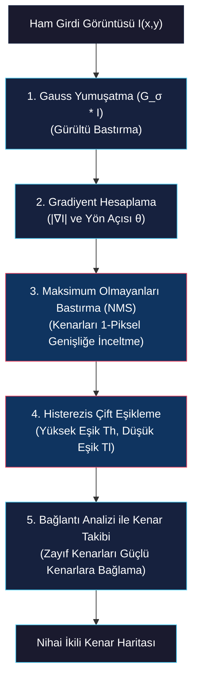
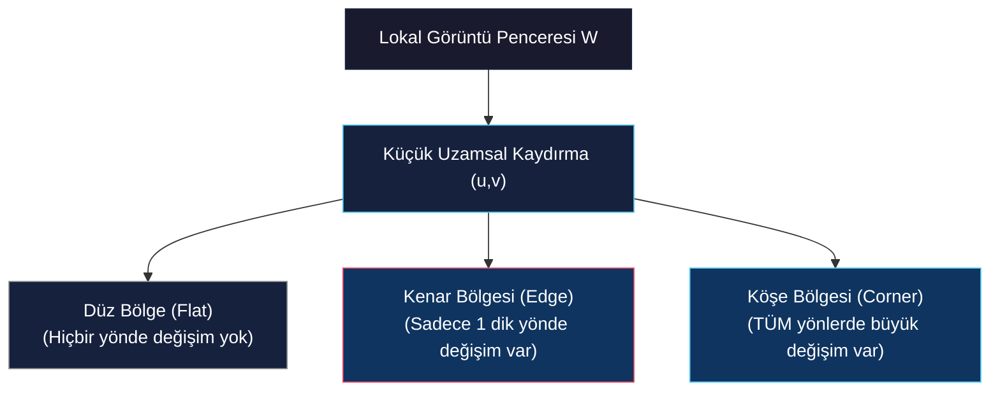
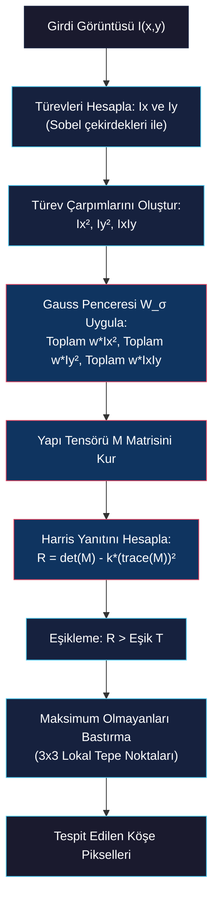

# Canny Kenar Tespiti ve Köşe Tespiti

<!-- toc -->

Bu teknik ders notu, bilgisayarlı görünün en gelişmiş özellik çıkarım tekniklerinden olan **Canny Kenar Tespiti (Canny Edge Detector)** ve **Harris Köşe Tespiti (Harris Corner Detection / Yapı Tensörü Analizi)** konularını; matematiksel türetimleri, çoklu ölçek davranışları, uzamsal otokorelasyon, ikinci moment matrisinin özdeğer analizi ve pratik algoritmik adımları çerçevesinde detaylıca ele almaktadır.

---

## 1. Canny Kenar Tespiti (Canny Edge Detector)

John F. Canny tarafından 1986 yılında geliştirilen **Canny Kenar Algılayıcısı**, 2D görüntüler için matematiksel olarak ideal (optimal) kenar tespit algoritması kabul edilir. Canny, kenar tespitini belirli matematiksel kısıtlar altında bir analitik optimizasyon problemi olarak modellemiştir.

### 1.1. John Canny'nin Optimizasyon Kriterleri

Canny, ideal bir kenar tespit operatörünün sağlaması gereken üç temel matematiksel kriter tanımlamıştır:

1. **Düşük Hata Oranı (Yüksek Algılama Oranı):** Algoritma sinyal-gürültü oranını (SNR) maksimize ederek tüm gerçek fiziksel kenarları yakalamalı, gürültüden kaynaklanan sahte kenarları (false positive) en aza indirmelidir.
2. **Yüksek Konumlandırma Hassasiyeti (Good Localization):** Tespit edilen kenar piksel koordinatları ile fiziksel kenarın gerçek merkez noktası arasındaki mesafe minimum olmalıdır.
3. **Tekil Yanıt Zorunluluğu (Single Response Constraint):** Tek bir fiziksel kenar geçişi için yalnızca tek piksel genişliğinde tek bir yanıt üretilmeli, kalın çoklu yanıt şeritleri önlenmelidir.

---

### 1.2. 5 Adımlı Canny Algoritması

#### 1. Adım: Gaussian Yumuşatma (Gaussian Smoothing)
Yüksek frekanslı görüntü gürültüsünü bastırmak için ham görüntü $I(x,y)$, 2D Gauss çekirdeği $G_\sigma(x,y)$ ile konvolüsyona sokulur:

$$I_\sigma(x,y) = G_\sigma(x,y) * I(x,y) = \frac{1}{2\pi \sigma^2} e^{-\frac{x^2+y^2}{2\sigma^2}} * I(x,y)$$

#### 2. Adım: Gradiyent Vektörü Hesaplama
Yumuşatılmış görüntü $I_\sigma$ üzerinden Sobel operatörleri kullanılarak yatay ($I_x$) ve dikey ($I_y$) kısmi türevler elde edilir:

$$|\nabla I| = \sqrt{I_x^2 + I_y^2}, \quad \theta = \tan^{-1} \left( \frac{I_y}{I_x} \right)$$

#### 3. Adım: Maksimum Olmayanları Bastırma (Non-Maximum Suppression - NMS)
NMS işlemi, kalın gradyan tepe bölgelerini keskin, 1-piksel genişliğinde çizgilere inceltir. Her $(x,y)$ pikseli için:
1. Gradiyent açısı $\theta(x,y)$ 4 ana yönden birine kuantalanır: $0^\circ$ (yatay), $45^\circ$ (pozitif köşegen), $90^\circ$ (dikey) veya $135^\circ$ (negatif köşegen).
2. Gradiyent büyüklüğü $|\nabla I(x,y)|$, gradyan normal doğrultusundaki 2 komşu pikselin büyüklükleri ile karşılaştırılır.
3. Eğer $|\nabla I(x,y)|$ komşularından küçükse sıfırlanır ($|\nabla I_{NMS}(x,y)| = 0$); aksi takdirde korunur.

$$\begin{aligned}
0^\circ \text{ Sektörü:} \quad & (x+1, y) \text{ ve } (x-1, y) \text{ ile karşılaştır} \\
90^\circ \text{ Sektörü:} \quad & (x, y+1) \text{ ve } (x, y-1) \text{ ile karşılaştır} \\
45^\circ \text{ Sektörü:} \quad & (x+1, y+1) \text{ ve } (x-1, y-1) \text{ ile karşılaştır} \\
135^\circ \text{ Sektörü:} \quad & (x+1, y-1) \text{ ve } (x-1, y+1) \text{ ile karşılaştır}
\end{aligned}$$

#### 4. Adım: Histerezis Çift Eşikleme (Hysteresis Thresholding)
Gürültüden kaynaklı sahte kenarları eleyip zayıf kenarları korumak için iki eşik değeri uygulanır:
- **Güçlü Kenarlar:** $|\nabla I_{NMS}| \ge T_{high} \rightarrow$ Doğrudan kesin kenar kabul edilir.
- **Zayıf Kenarlar:** $T_{low} \le |\nabla I_{NMS}| < T_{high} \rightarrow$ Aday kenar pikselleri.
- **Bastırılanlar:** $|\nabla I_{NMS}| < T_{low} \rightarrow$ Reddedilir.

#### 5. Adım: Bağlantı Analizi ile Kenar Takibi (Edge Tracking)
Bir zayıf kenar pikseli, 8-komşuluk yolunda **en az bir güçlü kenar pikseline bağlıysa** kenar haritasına dahil edilir. Bu bağlı bileşen analizi (connected-component analysis), kenar kopmalarını engellerken yalıtılmış gürültü noktalarını siler.

---

### 1.3. Çoklu Ölçekli Kenar Tespiti ($\sigma$ Parametresi)

Gauss filtresinin standart sapması $\sigma$, ölçek uzayı (scale-space) parametresidir:
- **Küçük $\sigma$ (İnce Ölçek):** İnce detayları, dokuları ve küçük köşeleri yakalar; ancak gürültüye daha hassastır.
- **Büyük $\sigma$ (Kaba Ölçek):** İnce dokuları ve gürültüyü eler, nesnelerin ana gövde sınırlarını vurgular; ancak konumlandırma hassasiyeti düşer.

<figure style="display:flex; justify-content: center; margin: 20px 0;">
  

    
    <figcaption style="margin-top: 0.5em; text-align: center; font-size: 13px; color: #888;"><em>Lena fotoğrafında farklı Gauss ölçek parametrelerinde (σ = 1, σ = 2, σ = 4) Canny kenar tespiti yanıtları.</em></figcaption>
  

</figure>

---

## 2. Köşe Tespiti (Harris & Moravec Corner Detector)

Kenarlar görüntü düzleminde 1D doğrusal kısıtlar sağlarken, **köşeler (ilgi noktaları / keypoints)** 2D noktasal kısıtlar sunar. Bir köşe, lokal bir pencere her yöne kaydırıldığında yoğunluğun tüm 2D yönlerde belirgin şekilde değiştiği pikseller kümesidir.

### 2.1. Neden Köşeler? (2D Kısıtlar & Açıklık/Aperture Problemi)

Köşeler; kamera kalibrasyonu, 3B rekonstrüksiyon, optik akış takibi ve nesne eşleme için en güvenilir özniteliklerdir:
- **Açıklık Probleminin (Aperture Problem) Çözümü:** Küçük bir lokal pencereden bakıldığında düz bir 1D kenar kendi teğet yönü boyunca belirsizlik yaratır. Köşeler ise hem $x$ hem $y$ yönünde kısıtlandığı için bu belirsizliği tamamen çözer.
- **Algısal Belirginlik:** Ewald Hering'in 1861 yılındaki oryantasyon illüzyonunda görüldüğü gibi, insan görsel sistemi çizgilerin kesişim ve köşe noktalarına bakarak yapısal geometriyi algılar.

<figure style="display:flex; justify-content: center; margin: 20px 0;">
  

    
    <figcaption style="margin-top: 0.5em; text-align: center; font-size: 13px; color: #888;"><em>Ewald Hering illüzyonu (1861): Kesişen arka plan ışınları sebebiyle paralel düz çizgilerin bükülmüş algılanması.</em></figcaption>
  

</figure>

---

### 2.2. Görüntü Bölgelerinin Sınıflandırılması

Lokal bir $W$ penceresi küçük bir $(u,v)$ kaydırıldığında oluşan parlaklık değişimine göre görüntü bölgeleri 3 ana kategoriye ayrılır:

<figure style="display:flex; justify-content: center; margin: 20px 0;">
  

    
    <figcaption style="margin-top: 0.5em; text-align: center; font-size: 13px; color: #888;"><em>Temel lokal bölge türleri: Düz Bölge (Flat), Kenar Bölgesi (Edge), Köşe Bölgesi (Corner).</em></figcaption>
  

</figure>

1. **Düz Bölge (Flat Region):** Pencere hangi yöne kaydırılırsa kaydırılsın parlaklık değişimi sıfıra yakındır.
2. **Kenar Bölgesi (Edge Region):** Pencere kenara paralel kaydırıldığında değişim sıfır, kenara dik kaydırıldığında büyük değişim oluşur.
3. **Köşe Bölgesi (Corner Region):** Pencere **tüm uzamsal yönlerde** kaydırıldığında büyük parlaklık değişimi meydana gelir.

<figure style="display:flex; justify-content: center; margin: 20px 0;">
  

    
    <figcaption style="margin-top: 0.5em; text-align: center; font-size: 13px; color: #888;"><em>Flat, Edge ve Corner bölgelerinin ham yoğunluk I ile Ix = ∂I/∂x ve Iy = ∂I/∂y kısmi türev haritalarına ayrıştırılması.</em></figcaption>
  

</figure>

---

### 2.3. Matematiksel Formülasyon (Kareler Toplamı Farkı & Taylor Serisi)

Lokal bir $w(x,y)$ penceresinin $(u,v)$ kadar kaydırılmasıyla oluşan $E(u,v)$ değişim miktarı Kareler Toplamı Farkı (SSD - Sum of Squared Differences) ile ifade edilir:

$$E(u,v) = \sum_{x,y} w(x,y) \left[ I(x+u, y+v) - I(x,y) \right]^2$$

Burada $w(x,y)$ pencere fonksiyonudur (düz kutu penceresi veya 2D Gauss ağırlık penceresi $e^{-\frac{x^2+y^2}{2\sigma^2}}$).

Küçük $(u,v)$ kaydırmaları için birinci derece 2D **Taylor Serisi açılımı** kullanılırsa:

$$I(x+u, y+v) \approx I(x,y) + u I_x(x,y) + v I_y(x,y)$$

Bu ifade SSD formülünde yerine konulduğunda:

$$E(u,v) \approx \sum_{x,y} w(x,y) \left[ u I_x(x,y) + v I_y(x,y) \right]^2$$

Karesel terim açılıp matris formunda yazıldığında:

$$E(u,v) \approx \begin{bmatrix} u & v \end{bmatrix} M \begin{bmatrix} u \\[6pt] v \end{bmatrix}$$

Buradaki $M$ matrisi **İkinci Moment Matrisi (Second Moment Matrix / Structure Tensor)** olarak adlandırılır:

$$M = \sum_{x,y} w(x,y) \begin{bmatrix} I_x^2 & I_x I_y \\[6pt] I_x I_y & I_y^2 \end{bmatrix} = \begin{bmatrix} \sum w I_x^2 & \sum w I_x I_y \\[6pt] \sum w I_x I_y & \sum w I_y^2 \end{bmatrix}$$

---

### 2.4. İkinci Moment Matrisi ($M$) ve Özdeğer Analizi

$M$ matrisi, pencere içindeki lokal gradyan dağılımının özetidir.

<figure style="display:flex; justify-content: center; margin: 20px 0;">
  

    
    <figcaption style="margin-top: 0.5em; text-align: center; font-size: 13px; color: #888;"><em>(Ix, Iy) gradyan saçılım grafikleri: Flat bölge (orijinde toplanma), Edge bölgesi (tek bir doğru boyunca dağılım), Corner bölgesi (çok yönlü yayılım).</em></figcaption>
  

</figure>

$M$ matrisinin iki özdeğeri $\lambda_1$ ve $\lambda_2$ olsun. Bu özdeğerler, $E(u,v)$ otokorelasyon yüzeyinin ana eğriliklerini temsil eder:
- $\lambda_1$: Gradiyent varyans elipsinin yarı-büyük eksen uzunluğu.
- $\lambda_2$: Gradiyent varyans elipsinin yarı-küçük eksen uzunluğu.

<figure style="display:flex; justify-content: center; margin: 20px 0;">
  

    
    <figcaption style="margin-top: 0.5em; text-align: center; font-size: 13px; color: #888;"><em>Özdeğerler λ1 ve λ2 tarafından oluşturulan kovaryans elipsleri: Flat, Edge ve Corner bölgelerinin geometrik karakterizasyonu.</em></figcaption>
  

</figure>

> **Fiziksel Benzetim (Eylemsizlik Momentleri):**
> İkili görüntüler dersinde görüldüğü üzere, $\lambda_1$ ve $\lambda_2$ özdeğerleri lokal gradyan kütlesinin ana eylemsizlik momentlerine karşılık gelir: $\lambda_1 = E_{max}$ (maksimum eylemsizlik momenti) ve $\lambda_2 = E_{min}$ (minimum eylemsizlik momenti).

<figure style="display:flex; justify-content: center; margin: 20px 0;">
  

    
    <figcaption style="margin-top: 0.5em; text-align: center; font-size: 13px; color: #888;"><em>Fiziksel eylemsizlik momenti yorumu: λ1 = Emax (yarı-büyük eksen) ve λ2 = Emin (yarı-küçük eksen).</em></figcaption>
  

</figure>

#### Özdeğerlere Göre Bölge Sınıflandırması:

<figure style="display:flex; justify-content: center; margin: 20px 0;">
  

    
    <figcaption style="margin-top: 0.5em; text-align: center; font-size: 13px; color: #888;"><em>Özdeğer bölge sınıflandırma özeti: Flat (λ1 ~ λ2 küçük), Edge (λ1 >> λ2), Corner (λ1 ~ λ2 her ikisi de büyük).</em></figcaption>
  

</figure>

| Bölge Türü | Özdeğer İlişkisi | Matematiksel Koşul | Fiziksel Anlamı |
| :--- | :--- | :--- | :--- |
| **Düz Bölge (Flat)** | $\lambda_1 \approx \lambda_2 \approx 0$ | Her iki özdeğer de çok küçük | Hiçbir yönde belirgin gradyan değişimi yok. |
| **Kenar Bölgesi (Edge)** | $\lambda_1 \gg \lambda_2 \approx 0$ | $\lambda_1$ büyük, $\lambda_2$ sıfıra yakın | Sadece 1 dik yönde güçlü gradyan değişimi var. |
| **Köşe Bölgesi (Corner)**| $\lambda_1 \approx \lambda_2 \gg 0$ | Her iki özdeğer de çok büyük | Tüm uzamsal yönlerde güçlü gradyan değişimi var. |

---

### 2.5. Harris Köşe Yanıt Fonksiyonu ($R$)

Her piksel için $\lambda_1, \lambda_2$ özdeğerlerini doğrudan hesaplamak matris karekökü gerektirdiği için işlem yükü yüksektir. Chris Harris ve Mike Stephens (1988), matris izi (trace) ve determinantını kullanarak doğrudan skaler bir $R$ yanıt fonksiyonu geliştirmiştir:

$$\det(M) = \lambda_1 \lambda_2 = (\sum w I_x^2)(\sum w I_y^2) - (\sum w I_x I_y)^2$$

$$\operatorname{trace}(M) = \lambda_1 + \lambda_2 = \sum w I_x^2 + \sum w I_y^2$$

**Harris Köşe Yanıt Fonksiyonu $R$:**

$$R = \det(M) - k \operatorname{trace}(M)^2 = \lambda_1 \lambda_2 - k (\lambda_1 + \lambda_2)^2$$

Burada $k$ ampirik bir sabit parametredir ve genellikle $0.04 \le k \le 0.06$ aralığında seçilir.

<figure style="display:flex; justify-content: center; margin: 20px 0;">
  

    
    <figcaption style="margin-top: 0.5em; text-align: center; font-size: 13px; color: #888;"><em>(λ1, λ2) özellik uzayının Harris köşe yanıt fonksiyonu R = det(M) - k(trace(M))² ile R > T eşiklemesine göre bölümlemesi.</em></figcaption>
  

</figure>

#### Yanıt Haritası Karar Kuralları:
- **Köşe Bölgesi (Corner):** $R > T$ (büyük pozitif değer).
- **Kenar Bölgesi (Edge):** $R < -T$ (büyük negatif değer, çünkü $\operatorname{trace}(M)^2 \gg \det(M)$).
- **Düz Bölge (Flat):** $|R| < T$ (sıfıra yakın küçük genlik).

---

### 2.6. Tam Harris Köşe Tespiti Algoritma Akışı

Harris Köşe Tespiti algoritmasının adımları şu şekildedir:

<figure style="display:flex; justify-content: center; margin: 20px 0;">
  

    
    <figcaption style="margin-top: 0.5em; text-align: center; font-size: 13px; color: #888;"><em>BBC logosu üzerinde Harris köşe yanıt haritası R ve eşiklenmiş R > T köşe noktaları.</em></figcaption>
  

</figure>

<figure style="display:flex; justify-content: center; margin: 20px 0;">
  

    
    <figcaption style="margin-top: 0.5em; text-align: center; font-size: 13px; color: #888;"><em>Mikro devre kartında tam Harris köşe tespiti adımları: ham görüntü, yanıt haritası R, eşikleme (R > 5.1×10⁷) ve nihai tespit edilen köşeler.</em></figcaption>
  

</figure>

---

## 3. Kenar ve Köşe Tespiti Karşılaştırma Özeti

| Nitelik / Özellik | Canny Kenar Tespiti | Harris Köşe Tespiti |
| :--- | :--- | :--- |
| **Kısıt Boyutu** | 1D Uzamsal Çizgi Sınırları (Konturlar) | 2D Noktasal Kısıtlar (İlgi Noktaları / Keypoints) |
| **Matematiksel Taban** | Gradiyent Vektörü $\nabla I$ + NMS + Histerezis | Yapı Tensörü $M$ Özdeğer Analizi ($\lambda_1, \lambda_2$) |
| **Temel Metrik** | Gradiyent Büyüklüğü $|\nabla I|$ | Yanıt Fonksiyonu $R = \det(M) - k \operatorname{trace}(M)^2$ |
| **Dönme Değişmezliği** | Gradyan yönü kuantalamasına bağımlı | **Tamamen Dönme Değişmezidir** (İzotropik Tensör) |
| **Ölçek Hassasiyeti** | Gauss $\sigma$ parametresine duyarlı | Pencere ölçeğine duyarlı (Ölçek değişmezliği için Harris-Laplacian gerekir) |
| **Ana Uygulama Alanları**| Görüntü Segmentasyonu, Nesne Sınırları | Özellik Eşleme, SLAM, Görüntü Dikişleme (Stitching), Takip |
