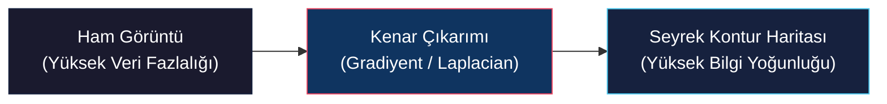
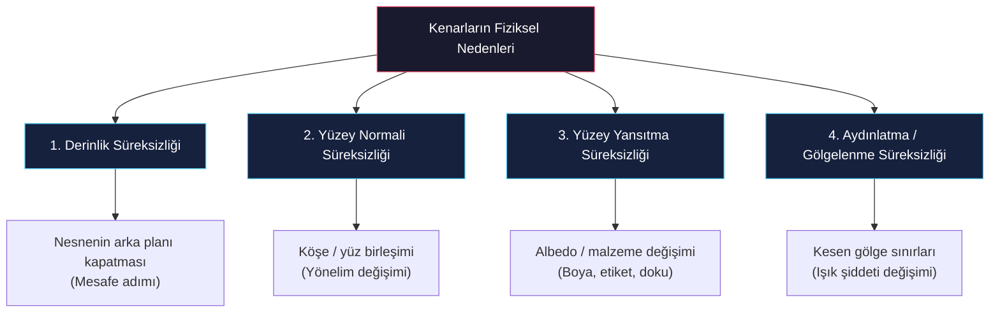
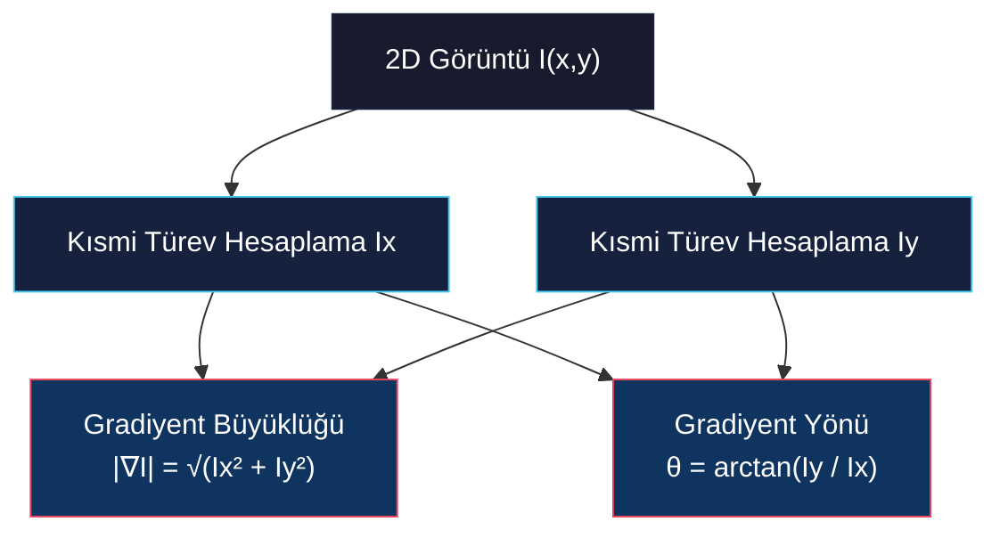
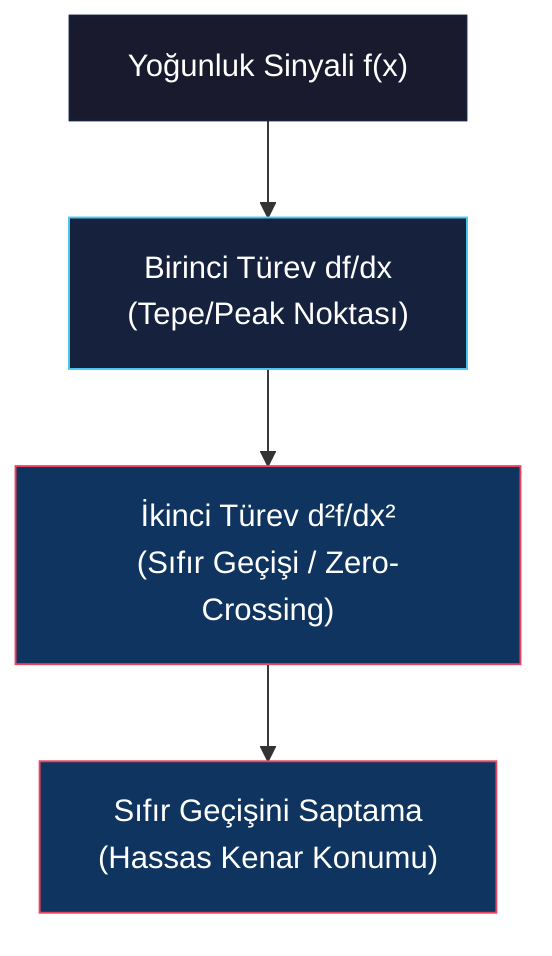

# Genel Bakış, Gradyanlar ve Laplacian ile Kenar Tespiti

<!-- toc -->

Bu teknik ders notu, bilgisayarlı görünün en temel bilgi teorisi konularından biri olan **Kenar Tespiti (Edge Detection)** konusunu; fiziksel kökenleri, birinci türev (Gradiyent) ve ikinci türev (Laplacian) tabanlı matematiksel yaklaşımları çerçevesinde detaylı ve kapsamlı bir şekilde ele almaktadır.

---

## 1. Giriş ve Kenar Kavramı (What is an Edge?)

### 1.1. Kenarın Tanımı ve Bilgi Teorisi Açısından Önemi

Bilgisayarlı görüde bir **kenar (edge)**, en basit tanımıyla, lokal bir piksel komşuluğunda görüntü yoğunluğunun (parlaklığının) ani, hızlı ve yönlü bir değişim gösterdiği pikseller kümesidir.

**Bilgi teorisi (information theory)** açısından kenarlar kritik bir öneme sahiptir:
- **Veri Seyrekliği (Data Sparsity):** Görüntünün tamamı yerine sadece kenar piksellerinin tutulması, veri temsilini son derece "seyrek" (sparse) hale getirir ve gereksiz homojen alanları eler.
- **Algısal Yeterlilik:** Vic Nalwa'nın klasik eserinde sunduğu Henry Moore heykel örneğinde görüldüğü üzere; detaylı bir 3B heykel fotoğrafı ile bir sanatçının sadece birkaç çizgiyle çizdiği eskiz karşılaştırıldığında, insan görsel sisteminin sadece bu seyrek kenar çizgilerinden 3B yapıyı, yüzey eğriliklerini ve parlaklık noktalarını kusursuzca ayırt edebildiği gözlenir.

<figure style="display:flex; justify-content: center; margin: 20px 0;">
  

    
    <figcaption style="margin-top: 0.5em; text-align: center; font-size: 13px; color: #888;"><em>Görsel bilgi seyrekliği: Henry Moore 3B heykel fotoğrafı ve minimalist çizgi eskizi (Nalwa).</em></figcaption>
  

</figure>

> **Temel Çıkarım:** Kenarlar, aydınlatma değişimlerini ve homojen arka plan verilerini eleyerek nesne geometrisini ve sınırlarını en yüksek bilgi yoğunluğuyla temsil eder.

---

### 1.2. Kenarların Fiziksel Nedenleri

Görüntü düzleminde ani parlaklık değişimleri yaratarak kenar oluşumuna sebep olan dört temel fiziksel olgu vardır:

1. **Derinlik Süreksizliği (Depth Discontinuity):** Bir nesnenin diğer bir nesnenin veya arka planın önünde yer alması durumunda, nesne sınırları boyunca oluşan ani derinlik ve mesafe adımı (örneğin, bir şişenin sınırları ile arkasındaki fon arasındaki geçiş).
2. **Yüzey Normali Süreksizliği (Surface Normal Discontinuity):** Aynı malzemeden yapılmış olsalar dahi, iki yüzeyin birleştiği sınırlarda yüzeylerin 3B yönelimleri farklı olduğu için ışık kaynağından farklı miktarlarda ışık almaları sonucu oluşan parlaklık farkı (örneğin bir küpün kesişen kenarları).
3. **Yüzey Yansıtma Süreksizliği (Surface Reflectance Discontinuity):** Nesne üzerindeki pigment, boya veya malzeme (albedo) değişimleri (örneğin bir etiket üzerindeki koyu renkli yazılar ile açık renkli kağıt yüzey arasındaki yansıtıcılık farkı).
4. **Aydınlatma / Gölgelenme Süreksizliği (Illumination / Shadow Discontinuity):** Sahnede nesnelerin oluşturduğu keskin gölge sınırları veya speküler yansımalar. Işık miktarının gölge sınırının içinde ve dışında dramatik olarak değişmesiyle ortaya çıkar.

<figure style="display:flex; justify-content: center; margin: 20px 0;">
  

    
    <figcaption style="margin-top: 0.5em; text-align: center; font-size: 13px; color: #888;"><em>Bir şişe nesnesi üzerinde kenar oluşturan 4 fiziksel neden: derinlik, yüzey normali, yansıtıcılık ve aydınlatma süreksizlikleri.</em></figcaption>
  

</figure>

---

### 1.3. Kenar Profil Tipleri ve Gerçek Dünya Sorunları

Matematiksel modeller oluşturmak için kenarlar farklı 1D profillerle tanımlanır:

- **Adım Kenar (Step Edge):** Yoğunluğun $I_0$ seviyesinden $I_1$ seviyesine aniden sıçradığı ideal geçiş modeli.
- **Eğimli Adım Kenar (Ramp / Step Edge with Gradient):** Geçiş bölgesinde hafif bir eğimin (gradyanın) olduğu pratik model.
- **Çatı Kenar (Roof Edge) ve Çizgi Kenarlar (Line Edges):** İnce çizgiler aslında yan yana duran bir yükselen ve bir düşen eğimin (çatı yapısı) birleşimidir.

$$\begin{aligned}
\text{Adım Kenar:} \quad & f(x) = \begin{cases} I_0, & x < 0 \\ I_1, & x \ge 0 \end{cases} \\
\text{Çatı Kenar:} \quad & f(x) = \begin{cases} I_0 + k x, & x < 0 \\ I_0 - k x, & x \ge 0 \end{cases}
\end{aligned}$$

<figure style="display:flex; justify-content: center; margin: 20px 0;">
  

    
    <figcaption style="margin-top: 0.5em; text-align: center; font-size: 13px; color: #888;"><em>Temel 1D geometrik kenar profilleri: Adım Kenarlar (Step), Çatı Kenar (Roof) ve Çizgi Kenarlar (Line).</em></figcaption>
  

</figure>

Gerçek dünyada görüntüler hiçbir zaman ideal birer adım fonksiyonu (step function) değildir. Şu fiziksel bozunma etkenleri sebebiyle gerçek kenarlar pürüzlü ve bulanıktır:
- Sensör gürültüleri (shot noise, termal gürültü)
- Optik bulanıklık ve Nokta Yayılım Fonksiyonu (Point Spread Function - PSF) sınırları
- Izgara örnekleme (sampling) ve kuantizasyon (quantization) hataları
- Odak dışı kalma (defocus blur)

<figure style="display:flex; justify-content: center; margin: 20px 0;">
  

    
    <figcaption style="margin-top: 0.5em; text-align: center; font-size: 13px; color: #888;"><em>Gerçek dünya kenar profili: sürekli eğim geçişi, gürültü dalgalanmaları ve ayrık örnekleme pürüzleri.</em></figcaption>
  

</figure>

---

### 1.4. İdeal Bir Kenar Operatörünün Kriterleri

İyi bir kenar tespit operatörünün (edge operator) piksel düzeyinde üretmesi gereken üç temel çıktı mevcuttur:
1. **Kenar Konumu (Edge Position):** Kenarın geçtiği hassas koordinat $(x, y)$.
2. **Kenar Gücü (Edge Magnitude / Strength):** Kenarın kontrast belirginlik derecesi.
3. **Kenar Yönelimi (Edge Orientation):** Kenarın yatay eksenle yaptığı yön açısı $\theta$.

John Canny, ideal bir kenar tespit operatörünün başarısını üç temel matematiksel performansa bağlamıştır:

> **Canny'nin İdeal Kenar Tespiti Kriterleri:**
> 1. **Yüksek Algılama Oranı (Düşük Hata Oranı):** Gerçek kenarları kaçırmamalı (düşük false negative) ve gürültülü bölgelerde sahte kenarlar üretmemelidir (düşük false positive).
> 2. **İyi Konumlandırma (Good Localization):** Tespit edilen kenar konumu, fiziksel kenarın gerçek merkez noktasına olabildiğince yakın olmalıdır.
> 3. **Tekil Yanıt Zorunluluğu (Single Response):** Tek bir kenar geçişi için yalnızca tek piksel genişliğinde tek bir yanıt üretilmelidir.

---

## 2. Gradiyent Kullanarak Kenar Tespiti (Edge Detection Using Gradients)

Gradiyent tabanlı yaklaşım, kenarları saptamak için görüntü fonksiyonunun birinci türevini esas alır.

### 2.1. 1 Boyutlu Sinyal Analizi

Tek boyutlu sürekli bir $f(x)$ sinyalinde:
- Parlaklığın aniden arttığı (yükselen kenar) yerde birinci türev $\frac{df}{dx}$ pozitif yönde bir yerel maksimum (tepe/peak) yapar.
- Düşen kenarda ise aynı genlikte ancak negatif yönde aşağı doğru sarkan bir yerel minimum (vadi) oluşur.
- Birinci türevin mutlak değeri $\left| \frac{df}{dx} \right|$ alındığında, her iki geçiş de pozitif tepe noktalarına dönüşür. Tepelerin konumu **kenarın yerini**, tepelerin yüksekliği ise **kenarın kontrast gücünü** verir.

$$\frac{df}{dx} = \lim_{\Delta x \to 0} \frac{f(x + \Delta x) - f(x)}{\Delta x}$$

<figure style="display:flex; justify-content: center; margin: 20px 0;">
  

    
    <figcaption style="margin-top: 0.5em; text-align: center; font-size: 13px; color: #888;"><em>Sürekli 1D f(x) yoğunluk sinyali ve yükselen/düşen kenar konumları.</em></figcaption>
  

</figure>

<figure style="display:flex; justify-content: center; margin: 20px 0;">
  

    
    <figcaption style="margin-top: 0.5em; text-align: center; font-size: 13px; color: #888;"><em>Birinci türev ∂f/∂x extremum değerleri ve mutlak değer |∂f/∂x| pozitif tepe noktalarının kenar konumunu göstermesi.</em></figcaption>
  

</figure>

---

### 2.2. 2 Boyutlu Gradiyent Vektörü ($\nabla I$)

İki boyutlu sürekli bir $I(x,y)$ görüntüsünde gradyan, en hızlı yoğunluk artışının olduğu yönü gösteren vektörel bir büyüklüktür:

$$\nabla I = \begin{bmatrix} \frac{\partial I}{\partial x} \\[6pt] \frac{\partial I}{\partial y} \end{bmatrix} = \begin{bmatrix} I_x \\[6pt] I_y \end{bmatrix}$$

Bu kısmi türev bileşenlerinden ($I_x, I_y$) yararlanılarak her piksel için iki temel değer hesaplanır:

1. **Gradiyent Büyüklüğü (Kenar Gücü):**
   $$|\nabla I| = \sqrt{I_x^2 + I_y^2} \approx |I_x| + |I_y|$$

2. **Gradiyent Yönelimi (Normal Açısı):**
   $$\theta = \tan^{-1} \left( \frac{I_y}{I_x} \right)$$

<figure style="display:flex; justify-content: center; margin: 20px 0;">
  

    
    <figcaption style="margin-top: 0.5em; text-align: center; font-size: 13px; color: #888;"><em>2D gradyan vektörünün ∇I dikey (Ix ≠ 0, Iy = 0), yatay (Ix = 0, Iy ≠ 0) ve açılı kenarlardaki yönelimi.</em></figcaption>
  

</figure>

<figure style="display:flex; justify-content: center; margin: 20px 0;">
  

    
    <figcaption style="margin-top: 0.5em; text-align: center; font-size: 13px; color: #888;"><em>Lena fotoğrafının yatay kısmi türev ∂I/∂x, dikey kısmi türev ∂I/∂y ve birleşik Gradiyent Büyüklüğü haritasına |∇I| ayrıştırılması.</em></figcaption>
  

</figure>

> **Not:** Gradiyent açısı $\theta$, kenarın teğet çizgisine dik (normal) olan açıyı gösterir. Kenar çizgisinin kendi teğet açısı ise $\theta + \frac{\pi}{2}$ olur.

---

### 2.3. Ayrık Görüntülerde Sonlu Farklar (Finite Differences)

Dijital (ayrık) piksellerde sürekli türev işlemi **sonlu farklar** ile simüle edilir. Merkezi farklar yaklaşımıyla türev maskeleri şu şekilde ifade edilir:

$$\frac{\partial I}{\partial x} \approx \frac{I(x+1, y) - I(x-1, y)}{2\Delta x}, \quad \frac{\partial I}{\partial y} \approx \frac{I(x, y+1) - I(x, y-1)}{2\Delta y}$$

Piksel mesafesinin $\epsilon = 1$ kabul edildiği sonlu fark konvolüsyon çekirdekleri (kernels):

$$M_x = \frac{1}{2} \begin{bmatrix} -1 & 1 \\ -1 & 1 \end{bmatrix}, \quad M_y = \frac{1}{2} \begin{bmatrix} 1 & 1 \\ -1 & -1 \end{bmatrix}$$

---

### 2.4. Klasik Gradiyent Filtrelerinin Karşılaştırılması

Yüksek frekanslı gürültüleri filtrelemek adına türev operatörleri bir alçak geçiren pürüzsüzleştirme (smoothing) filtresi ile birleştirilir:

<figure style="display:flex; justify-content: center; margin: 20px 0;">
  

    
    <figcaption style="margin-top: 0.5em; text-align: center; font-size: 13px; color: #888;"><em>Klasik gradyan operatör çekirdekleri (Roberts, Prewitt, Sobel 3x3, Sobel 5x5) ve konumlandırma ile gürültü direnci arasındaki temel ödünleşim (trade-off).</em></figcaption>
  

</figure>

| Operatör | Çekirdek Boyutu | Matematiksel Formülasyon | Özellikler ve Başarım |
| :--- | :---: | :--- | :--- |
| **Roberts Cross** | $2 \times 2$ | $D_x = \begin{bmatrix} 0 & 1 \\ -1 & 0 \end{bmatrix}, \, D_y = \begin{bmatrix} 1 & 0 \\ 0 & -1 \end{bmatrix}$ | Çok hızlıdır, mükemmel konumlandırma yapar; ancak **gürültüye aşırı hassastır**. |
| **Prewitt** | $3 \times 3$ | $P_x = \begin{bmatrix} -1 & 0 & 1 \\ -1 & 0 & 1 \\ -1 & 0 & 1 \end{bmatrix}, \, P_y = \begin{bmatrix} 1 & 1 & 1 \\ 0 & 0 & 0 \\ -1 & -1 & -1 \end{bmatrix}$ | Düzgün (uniform) pürüzsüzleştirme ve merkezi fark içerir. Gürültüye dayanıklıdır. |
| **Sobel** | $3 \times 3$ | $S_x = \begin{bmatrix} -1 & 0 & 1 \\ -2 & 0 & 2 \\ -1 & 0 & 1 \end{bmatrix}, \, S_y = \begin{bmatrix} 1 & 2 & 1 \\ 0 & 0 & 0 \\ -1 & -2 & -1 \end{bmatrix}$ | Merkez piksere 2 ağırlığı vererek **Gauss yumuşatması** sağlar. Endüstri standardıdır. |
| **Genişletilmiş Sobel** | $5 \times 5+$ | Daha geniş Gauss ağırlıklı türev çekirdekleri | Üstün gürültü direnci sağlar; ancak kenarları pürüzleştirdiği için **konumlandırmayı düşürür**. |

---

### 2.5. Eşikleme (Thresholding) ve Histerezis

Gradiyent büyüklük haritası $|\nabla I|$ elde edildikten sonra kenar kararı için iki yaklaşım mevcuttur:

1. **Tekli Eşikleme (Single Threshold):**
   $$E(x,y) = \begin{cases} 1, & |\nabla I(x,y)| \ge T \\ 0, & |\nabla I(x,y)| < T \end{cases}$$
   - *Sorun:* Yüksek $T$ kenarları koparırken, düşük $T$ gürültüleri sahte kenar olarak işaretler.

2. **Histerezis Eşikleme (Çift Eşikli Yöntem):**
   Biri düşük $T_{low}$, diğeri yüksek $T_{high}$ olmak üzere iki sınır belirlenir.
   - **Güçlü Kenarlar:** $|\nabla I| \ge T_{high} \rightarrow$ Doğrudan kenar kabul edilir.
   - **Zayıf Kenarlar:** $T_{low} \le |\nabla I| < T_{high} \rightarrow$ Yalnızca güçlü bir kenarla bağlantısı varsa kabul edilir.
   - **Gürültü:** $|\nabla I| < T_{low} \rightarrow$ Reddedilir.

---

## 3. Laplacian Kullanarak Kenar Tespiti (Edge Detection Using Laplacian)

Laplacian yaklaşımı kenarları saptamak için görüntünün **ikinci türevini** esas alır.

### 3.1. İkinci Türev ve Sıfır Geçişleri (Zero-Crossings)

Birinci türevin tepe noktasına ulaştığı (kenar merkezi) konumda, ikinci türev $\frac{d^2f}{dx^2}$ tam olarak sıfır değerini alır:
- İkinci türev sinyali, pozitif bir tepeden negatif bir vadiye geçerken dik bir açıyla sıfır çizgisini keser. Bu noktaya **Sıfır Geçişi (Zero-Crossing)** denir.

$$\frac{d^2f}{dx^2} = \lim_{\Delta x \to 0} \frac{f(x+\Delta x) - 2f(x) + f(x-\Delta x)}{\Delta x^2}$$

<figure style="display:flex; justify-content: center; margin: 20px 0;">
  

    
    <figcaption style="margin-top: 0.5em; text-align: center; font-size: 13px; color: #888;"><em>Birinci türev tepe noktaları ile ikinci türev sıfır geçişlerinin (zero-crossing) kenar merkezlerini gösterme karşılaştırması.</em></figcaption>
  

</figure>

> **Avantaj:** Birinci türev tepelerini eşiklemek matematiksel hassasiyet kaybına yol açarken, ikinci türevdeki **sıfır geçişleri** kapalı ve kesintisiz kenar sınırlarını tespit etmeyi kolaylaştırır.

---

### 3.2. 2 Boyutlu Laplacian Operatörü ($\nabla^2 I$)

İki boyutlu Laplacian operatörü, yön bağımsız (izotropik) bir skaler operatördür:

$$\nabla^2 I = \frac{\partial^2 I}{\partial x^2} + \frac{\partial^2 I}{\partial y^2}$$

**Temel Özellikleri:**
- **İzotropiktir:** Kenarın geliş açısına bakmaksızın her yöndeki değişime eşit yanıt verir.
- **Skalerdir:** Gradiyent gibi bir yön vektörü değil, tek bir skaler değer üretir.
- **Yön Bilgisi Vermez:** Kenarın teğet veya normal açısını ($\theta$) hesaplayamaz.

---

### 3.3. Ayrık Laplacian Çekirdekleri ve Köşegen Düzeltmesi

<figure style="display:flex; justify-content: center; margin: 20px 0;">
  

    
    <figcaption style="margin-top: 0.5em; text-align: center; font-size: 13px; color: #888;"><em>2D Laplacian sonlu farklar matematiksel ifadesi ve standart 4-komşulu ile köşegen düzeltmeli 8-komşulu konvolüsyon çekirdekleri.</em></figcaption>
  

</figure>

1. **Standart 4-Komşulu Laplacian Çekirdeği:**
   $$L_4 = \begin{bmatrix} 0 & 1 & 0 \\ 1 & -4 & 1 \\ 0 & 1 & 0 \end{bmatrix}$$

2. **Köşegen Düzeltmeli 8-Komşulu Laplacian Çekirdeği:**
   $45^\circ$ eğik kenarlardaki mesafe farkını ($\sqrt{2}\epsilon$) dengelemek için 8 komşulu çekirdek tercih edilir:
   $$L_8 = \begin{bmatrix} 1 & 4 & 1 \\ 4 & -20 & 4 \\ 1 & 4 & 1 \end{bmatrix}$$

<figure style="display:flex; justify-content: center; margin: 20px 0;">
  

    
    <figcaption style="margin-top: 0.5em; text-align: center; font-size: 13px; color: #888;"><em>Lena fotoğrafının 2D Laplacian ile işlenmesi (128 gri seviye referansı) ve elde edilen ikili sıfır geçişi (zero-crossing) kenar haritası.</em></figcaption>
  

</figure>

---

### 3.4. Gürültü Problemi ve Çözüm: Gaussian Yumuşatma (LoG ve DoG)

İkinci türev, yüksek frekanslı görüntü gürültüsünü aşırı derecede büyütür.

<figure style="display:flex; justify-content: center; margin: 20px 0;">
  

    
    <figcaption style="margin-top: 0.5em; text-align: center; font-size: 13px; color: #888;"><em>Şiddetli gürültü büyümesi: gürültülü adım sinyalinin türevi alındığında gerçek kenar tamamen kaybolur.</em></figcaption>
  

</figure>

Bu sebeple görüntü önce bir Gauss filtresi $G_\sigma(x,y)$ ile yumuşatılmalıdır:

$$G_\sigma(x,y) = \frac{1}{2\pi \sigma^2} e^{-\frac{x^2+y^2}{2\sigma^2}}$$

<figure style="display:flex; justify-content: center; margin: 20px 0;">
  

    
    <figcaption style="margin-top: 0.5em; text-align: center; font-size: 13px; color: #888;"><em>Gürültüyü bastırma: gürültülü sinyali türevden önce Gauss filtresi ile konvolüsyona sokma.</em></figcaption>
  

</figure>

Doğrusal konvolüsyonun değişim özelliğinden faydalanılarak:

$$\nabla^2 \left( G_\sigma * I \right) = \left( \nabla^2 G_\sigma \right) * I$$

<figure style="display:flex; justify-content: center; margin: 20px 0;">
  

    
    <figcaption style="margin-top: 0.5em; text-align: center; font-size: 13px; color: #888;"><em>Gauss Türevi (DoG) doğrusal değişim özelliği: ∇(n_σ * f) = ∇(n_σ) * f tek bir konvolüsyon işlem tasarrufu sağlar.</em></figcaption>
  

</figure>

Bu işlem **Laplacian of Gaussian (LoG)** operatörünü (3B görünümünden ötürü *Meksika Şapkası / Sombrero* filtresi) üretir:

$$\text{LoG}(x,y) = -\frac{1}{\pi \sigma^4} \left[ 1 - \frac{x^2+y^2}{2\sigma^2} \right] e^{-\frac{x^2+y^2}{2\sigma^2}}$$

<figure style="display:flex; justify-content: center; margin: 20px 0;">
  

    
    <figcaption style="margin-top: 0.5em; text-align: center; font-size: 13px; color: #888;"><em>Laplacian of Gaussian (LoG) doğrusal özelliği: ∇²(n_σ * f) = ∇²(n_σ) * f net sıfır geçişi kenar tespiti üretir.</em></figcaption>
  

</figure>

<figure style="display:flex; justify-content: center; margin: 20px 0;">
  

    
    <figcaption style="margin-top: 0.5em; text-align: center; font-size: 13px; color: #888;"><em>Gauss Türevi (∇G) yönlü filtreler ile izotropik Laplacian of Gaussian (∇²G) Ters Meksika Şapkası çekirdeğinin 3B yüzey grafiği.</em></figcaption>
  

</figure>

**Difference of Gaussians (DoG)** ise farklı ölçeklerdeki ($\sigma_1, \sigma_2$) iki Gauss filtresinin farkını alarak LoG filtresini hızlıca simüle eder:

$$\text{DoG}(x,y) = G_{\sigma_1}(x,y) - G_{\sigma_2}(x,y) \approx (\sigma_1 - \sigma_2) \nabla^2 G_\sigma$$

---

## 4. Gradiyent ve Laplacian Operatörlerinin Karşılaştırılması

Gradiyent ve Laplacian operatörleri arasındaki temel farklar ve başarım kriterleri aşağıdaki tabloda özetlenmiştir:

| Özellik / Parametre | Gradiyent Operatörü ($\nabla I$) | Laplacian Operatörü ($\nabla^2 I$ / LoG) |
| :--- | :--- | :--- |
| **Matematiksel Taban** | Birinci Türev (Değişim Hızı) | İkinci Türev (İvme / Büküm Noktası) |
| **Ürettiği Çıktı** | Konum, Güç $|\nabla I|$ ve Yön Açısı $\theta$ | Yalnızca Kenar Konumu (**Sıfır Geçişleri**) |
| **Yön Bilgisi ($\theta$)** | **Mevcut** ($\theta = \arctan(I_y / I_x)$) | **Mevcut Değil** (İzotropik / Yön Bağımsız) |
| **Doğrusallık** | **Doğrusal Değil** (karekök ve arctan içerir) | **Doğrusal** (matris konvolüsyonu) |
| **Hesaplama Yükü** | Daha yüksek (2 yönlü konvolüsyon + trigonometri) | Daha düşük (tek bir matris konvolüsyonu) |
| **Tespit İlkesi** | Türev Tepe Noktalarını Eşikleme | Sıfır Geçişlerinin (Zero-Crossing) Saptanması |
| **Gürültü Hassasiyeti** | Orta derece (Sobel/Prewitt ile bastırılır) | Yüksek (önceden Gauss yumuşatması gerektirir) |

> **Sonuç:** Gradiyent operatörleri yön ve büyüklük bilgisi sağladığı için özellik çıkarımı ve vektör alanı hesaplarında vazgeçilmezdir. Laplacian operatörleri ise matematiksel olarak kapalı ve kesintisiz sıfır geçişi sınırları sunar. Bu iki yöntemin üstün yönlerinin birleştirilmesi sonucunda modern **Canny Kenar Algılama Algoritması** geliştirilmiştir.
