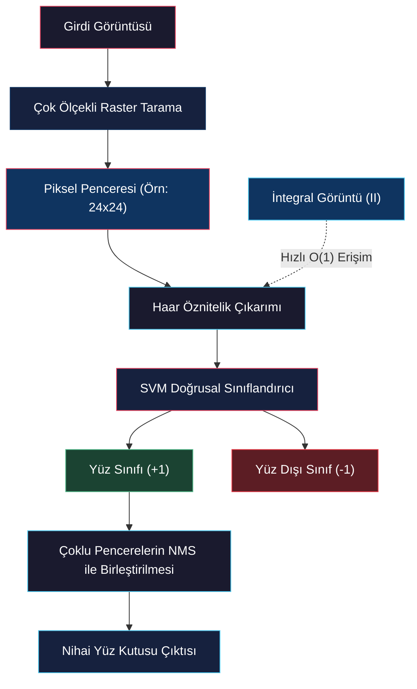

# Yüz Tespiti (Face Detection)

<!-- toc -->

## 1. Genel Bakış (Overview)

**Yüz tespiti (face detection)**, girdi olarak alınan bir dijital görüntü üzerindeki tüm insan yüzlerinin koordinatlarını ve sınırlarını bulmayı amaçlar. Algoritmanın temel çıktısı, saptanan her bir yüzün etrafına yerleştirilen bir yerel arama penceresidir (sınırlayıcı kutu - *bounding box*).

<figure style="display:flex; justify-content: center; margin: 20px 0;">
  

    
    <figcaption style="margin-top: 0.5em; text-align: center; font-size: 13px; color: #888;"><em>Şekil 1: Bir dijital görüntü üzerindeki insan yüzlerinin sınırlayıcı kutular (bounding boxes) ile saptanması.</em></figcaption>
  

</figure>

<figure style="display:flex; justify-content: center; margin: 20px 0;">
  

    
    <figcaption style="margin-top: 0.5em; text-align: center; font-size: 13px; color: #888;"><em>Şekil 2: Yerel bir aday görüntü penceresinden f öznitelik vektörünün çıkarılması ve sınıflandırıcı modeli ile Evet/Hayır Kararı üretilmesi.</em></figcaption>
  

</figure>

### 1.1 Yüz Tespitinin Temel Zorlukları (Challenges)

Başarılı ve kararlı bir yüz tespit sisteminin aşağıdaki fiziksel varyasyonları tolere edebilmesi gerekir:

- **Ölçek Değişmezliği (Scale Invariance):** İnsanların kameraya olan fiziksel mesafelerine bağlı olarak yüzlerin görüntüdeki boyutları sürekli değişir. Sistem farklı ölçeklerdeki (*sizes*) pencereleri tarayabilmelidir.
- **Işıklanma Bağışıklığı (Illumination Invariance):** Farklı ortam ışıkları ve gölgelenmeler altında dahi yüzlerin ayırt edici geometrisi saptanabilmelidir.
- **Poz Toleransı (Pose Tolerance):** Kafanın sağa, sola veya yukarı/aşağı hafif rotasyonları (*pose*) tespit kalitesini düşürmemelidir. Temel teoriyi basitleştirmek adına ilk aşamada kameraya doğrudan bakan cephe (*frontal*) yüzler üzerinde durulur.

<figure style="display:flex; justify-content: center; margin: 20px 0;">
  

    
    <figcaption style="margin-top: 0.5em; text-align: center; font-size: 13px; color: #888;"><em>Şekil 3: Yüz sınıfı (sol) ile doğa, hayvan ve nesnelerden oluşan yüz dışı sınıf (sağ) arasındaki belirgin farklar.</em></figcaption>
  

</figure>

### 1.2 Diğer Öznitelik Modellerinin Sınırları ve Karşılaştırılması

Yüz tespiti için kullanılacak özniteliklerin (*features*) seçimi sistemin hızını ve doğruluğunu doğrudan belirler. Geçmişteki klasik özniteliklerin bu görevdeki zayıflıkları şunlardır:

1. **Kenarlar ve Köşeler (Edges/Corners):** Görüntüdeki nesnelere, arka plana ve gürültülere bağlı olarak çok fazla kenar-köşe pikseli üretilir. Yüz morfolojisini tanımlamakta ayırt ediciliği son derece düşüktür.
2. **SIFT (Scale Invariant Feature Transform):** SIFT, iki farklı görüntüdeki benzer bölgeleri veya spesifik nesne görünümlerini (*appearance*) birebir eşleştirmek için mükemmeldir. Ancak yüz tespiti görevinde amacımız spesifik bir kişiyi bulmak (*recognition*) değil; genel olarak yüz olan ve olmayan (*face vs. non-face*) sınıf sınırlarını çizerek nesneyi saptamaktır (*detection*). Yüzler kişiden kişiye ve mimikten mimiğe çok büyük varyasyon gösterdiğinden SIFT bu genellemede verimsiz kalır.
3. **Yüz Bileşen Şablonları (Facial Components / Templates):** Göz, burun, ağız gibi alt bileşenler için bağımsız şablonlar tasarlayıp korelasyon (*template matching*) ile arama yöntemidir. Ancak bileşenlerin (özellikle gözlerin) kendi içindeki yüksek şekilsel değişkenliği nedeniyle bu yöntem geçmişte oldukça kısıtlı bir başarı elde edebilmiştir.

<figure style="display:flex; justify-content: center; margin: 20px 0;">
  

    
    <figcaption style="margin-top: 0.5em; text-align: center; font-size: 13px; color: #888;"><em>Şekil 4: İlgi noktaları (kenarlar/köşeler/SIFT) ile bağımsız yüz bileşen şablonlarının yüz tespitindeki kısıtlılıkları.</em></figcaption>
  

</figure>

> **Temel Sezgi:** Yüz tespiti, görüntünün her bir pikselinde ve farklı ölçeklerde milyarlarca kez çalıştırılacağı için, kullanılacak özniteliklerin hem çok yüksek ayırt edici güce (*highly discriminative*) sahip olması hem de hesaplama maliyetinin son derece düşük olması (*extremely fast to compute*) şarttır. Bu iki kriteri de mükemmel şekilde karşılayan temel araç **Haar Öznitelikleridir**.

---

## 2. Yüz Tespitinin Kullanım Alanları (Uses of Face Detection)

Yüz tespiti, modern akıllı sistemlerde bir öncül (*precursor*) adım olarak çok geniş bir ticari ve endüstriyel uygulama alanına sahiptir:

- **Akıllı Telefon Kameraları ve Mobil Fotoğrafçılık:** Telefon kamerası açıldığında arka planda gerçek zamanlı (*real-time*) yüz tespiti çalışır. Kameranın odaklama (*autofocus*), otomatik pozlama (*exposure*) ve renk dengesi (*color balance*) gibi donanımsal parametreleri, saptanan yüzlerin (özellikle en belirgin ve büyük olan yüzün) görsel kalitesini maksimuma çıkaracak şekilde anlık olarak ayarlanır.
- **Görsel Arama Motorları (Visual Search):** Arama motorunda "gates" araması yapıldığında hem fiziksel kapılar hem de Bill Gates gibi insanlar listelenir. Kullanıcı arama filtresinden "Yüz" (*Face*) butonuna tıkladığında, arka planda yüz tespiti çalıştırılarak sadece içinde insan yüzü barındıran görseller filtrelenir.
- **Demografik Analiz ve Akıllı Pazarlama (Intelligent Marketing):** Mağazalarda, alışveriş merkezlerinde ve kamusal alanlarda müşteri profilinin saptanmasında kullanılır. Örneğin, Japonya'daki Shinagawa İstasyonu'nda bulunan dijital otomatlar (*vending machines*), önlerine gelen müşterinin yüzünü anında saptayarak cinsiyetini ve yaklaşık yaşını (5 yıllık sapma payıyla) tahmin eder. Bu demografik bilgi doğrultusunda, ekranda o müşterinin ilgisini çekebilecek spesifik ürünlerin reklamlarını ve önerilerini dinamik olarak sunar. Ayrıca AVM'lerde insanların yoğunlaştığı alanları (*attention mapping*) belirleyerek reklam panolarının fiyatlandırılmasında kullanılır.
- **Biyometri, Güvenlik ve Gözetim (Surveillance & Security):** Kamusal veya özel kapalı alanlarda, insan hareketliliğinin izlenmesi, akıllı geçiş kontrol sistemleri (*access control*) ve kalabalıklar arasında şüpheli kişilerin gerçek zamanlı aranması görevlerinde ilk ve en kritik adım yüz tespiti algoritmasıdır.

---

## 3. Haar Öznitelikleri (Haar Features)

Yüz tespiti için kullanılan **Haar Öznitelikleri (Haar Features)**, temelde "Haar Wavelet" (Haar Dalgacıkları) teorisine ve kare/dikdörtgen fonksiyonlara dayanan, iki değerli (*two-valued*) özel filtre maskeleridir.

### 3.1 Çalışma Prensibi ve Matematiksel Tanımı

Her bir Haar filtresi, bir pencere içinde yan yana veya iç içe yerleştirilmiş beyaz (+1 değerine sahip) ve siyah (-1 değerine sahip) dikdörtgen bölgelerden oluşur.

Fiziksel olarak bir Haar filtresi, görüntünün üzerinden kaydırılarak bir çapraz korelasyon (*cross-correlation*) işlemi gerçekleştirir. Korelasyon normal şartlarda piksel değerlerinin filtre katsayılarıyla tek tek çarpılıp toplanmasını gerektirir. Ancak Haar katsayıları yalnızca $+1$ ve $-1$ değerlerinden oluştuğu için, bu işlem hiçbir çarpma (*multiplication*) veya bölme işlemi yapılmadan saf toplama ve çıkarma işlemine indirgenir.

Matematiksel olarak bir Haar öznitelik değeri (*response*) şu çıkarma işlemine eşittir:

$$\text{Haar Yanıtı} = \sum_{(x,y) \in \text{Beyaz}} I(x,y) - \sum_{(x,y) \in \text{Siyah}} I(x,y)$$

Burada $I(x,y)$ orijinal görüntünün piksel yoğunluk değerleridir. Çarpma işlemlerinin elenerek sadece toplama ve çıkarma işlemlerinin kullanılması, bilgisayar işlemcileri (CPU/GPU) için donanımsal düzeyde muazzam bir hesaplama avantajı sağlar.

<figure style="display:flex; justify-content: center; margin: 20px 0;">
  

    
    <figcaption style="margin-top: 0.5em; text-align: center; font-size: 13px; color: #888;"><em>Şekil 5: H_A Haar filtresinin yüz üzerinde (göz-yanak geçişinde) konumlandırılarak Beyaz=1, Siyah=-1 ağırlıklarıyla korelasyonu.</em></figcaption>
  

</figure>

<figure style="display:flex; justify-content: center; margin: 20px 0;">
  

    
    <figcaption style="margin-top: 0.5em; text-align: center; font-size: 13px; color: #888;"><em>Şekil 6: Girdi görüntüsünün farklı H_A, H_B, H_C, H_D Haar filtreleriyle evriştirilerek f[i,j] öznitelik vektörünün oluşturulması.</em></figcaption>
  

</figure>

### 3.2 Haar Filtre Tipleri ve Türev Analojisi

Haar filtre bankası, farklı yönelimleri ve geometrik yapıları saptamak üzere kolonlar (ölçekler) halinde düzenlenmiştir:

1. **Dikey ve Yatay İki Bölgeli Filtreler:** Solu beyaz, sağı siyah olan dikey bir filtre, yatay doğrultudaki hızlı parlaklık geçişlerini yakalar. Bu yönüyle görüntü işlemedeki birinci derece türev (gradiyent) filtrelerine benzer ve büyük ölçekli bir kenar dedektörü gibi davranır.
2. **Üç Bölgeli Filtreler (Örn: Beyaz-Siyah-Beyaz):** Ortasında siyah şerit, yanlarında beyaz dikdörtgenler barındıran filtreler ise ikinci derece türevi (Laplacian) simüle eder ve çizgi/kanal yapılarını saptar.
3. **Karmaşık Çok Bölgeli Filtreler:** Filtre setinde aşağıya doğru inildikçe, görüntünün çok daha yüksek dereceden kısmi türevlerini (*high-order derivatives*) temsil eden karmaşık siyah-beyaz diagonal desenler yer alır.

<figure style="display:flex; justify-content: center; margin: 20px 0;">
  

    
    <figcaption style="margin-top: 0.5em; text-align: center; font-size: 13px; color: #888;"><em>Şekil 7: Kolonlar halinde farklı boyutlarda ve ölçeklerde genişletilmiş Haar filtre bankası.</em></figcaption>
  

</figure>

### 3.3 Standart Hesaplama Maliyeti

Normal bir görüntü üzerinde, $N \times M$ boyutlarındaki tek bir Haar filtresinin bir pikseldeki yanıtını doğrudan hesaplamak için gereken toplama işlemi sayısı şudur:

$$\text{Gerekli Toplama İşlemi Sayısı} = (N \times M) - 1$$

Bu maliyet her ne kadar çarpma içermediği için ucuz görünse de, görüntüdeki milyonlarca pikselin her birine, onlarca farklı ölçekte ve yüzlerce farklı filtre tipinde uygulanması gerektiğinde toplam işlem yükü gerçek zamanlı çalışmayı engelleyecek kadar büyür. Bu darboğazı aşmak için **İntegral Görüntü** teknolojisi kullanılır.

---

## 4. İntegral Görüntü (Integral Image)

**İntegral Görüntü (Integral Image - II)**, görüntüdeki herhangi bir dikdörtgen alanın içerdiği piksel değerlerinin toplamını, alanın boyutundan tamamen bağımsız olarak sabit sürede ($O(1)$ karmaşıklığında) hesaplamaya yarayan çok güçlü bir ara veri tablosu temsilidir.

### 4.1 Matematiksel Tanım

Orijinal bir $I(x,y)$ görüntüsünün integral görüntüsü $II(x,y)$ ile gösterilir. İntegral görüntüde herhangi bir $(x, y)$ pikselinde depolanan değer, orijinal görüntüde o koordinatın solunda ve üstünde kalan tüm piksellerin (kendisi dahil) toplamıdır:

$$II(x,y) = \sum_{x' \leq x, \, y' \leq y} I(x',y')$$

<figure style="display:flex; justify-content: center; margin: 20px 0;">
  

    
    <figcaption style="margin-top: 0.5em; text-align: center; font-size: 13px; color: #888;"><em>Şekil 8: Orijinal görüntü piksel matrisi I (sol) ile her hücrede sol-üst alan kümülatif toplamını barındıran İntegral Görüntü II (sağ).</em></figcaption>
  

</figure>

### 4.2 Tek Geçişli Raster Tarama ile İnşası (Computing II)

İntegral görüntü, orijinal görüntü üzerinde sol-üst köşeden başlayarak tek bir raster tarama (*single pass*) ile son derece hızlı bir şekilde inşa edilir. Tarama esnasında ulaşılan herhangi bir $O(x,y)$ pikselindeki integral değeri; o pikselin bir solundaki ($A$), bir üstündeki ($B$) ve sol-üst çaprazındaki ($C$) önceden hesaplanmış integral değerleri kullanılarak şu rekürsif formülle hesaplanır:

$$II(O) = II(A) + II(B) - II(C) + I(O)$$

> **İspat / Mantık:** Üstteki alan ($II(B)$) ile soldaki alan ($II(A)$) toplanırken, her ikisinin de kesişim kümesi olan sol-üst çapraz alan ($II(C)$) mükerrer olarak iki kez toplanmış olur. Bu çift sayımı düzeltmek adına $II(C)$ değeri formülden bir kez çıkarılır ve üzerine o anki pikselin orijinal değeri ($I(O)$) eklenir.

<figure style="display:flex; justify-content: center; margin: 20px 0;">
  

    
    <figcaption style="margin-top: 0.5em; text-align: center; font-size: 13px; color: #888;"><em>Şekil 9: Tek geçişli raster tarama sırasında komşu integral değerleri (B, C, D) kullanılarak A hücresinin hesabı (II_A = II_B + II_C - II_D + I_A).</em></figcaption>
  

</figure>

### 4.3 Dikdörtgen Alan Toplamının $O(1)$ Sürede Hesaplanması

İntegral görüntü hazırlandıktan sonra, orijinal görüntü üzerindeki herhangi bir dikdörtgen bölgenin piksel toplamını bulmak için sadece 4 adet tablo okuması ve 3 adet toplama/çıkarma işlemi yeterlidir.

$$\text{Dikdörtgen Toplamı} = II(P) - II(Q) - II(S) + II(R)$$

<figure style="display:flex; justify-content: center; margin: 20px 0;">
  

    
    <figcaption style="margin-top: 0.5em; text-align: center; font-size: 13px; color: #888;"><em>Şekil 10: P, Q, R, S köşe koordinatları çekilerek dikdörtgen alan toplamının sadece 3 toplama/çıkarma işlemiyle elde edilmesi (3490 - 1137 - 1249 + 417 = 1521).</em></figcaption>
  

</figure>

**Açıklama:** Sağ alt köşe olan $II(P)$ değeri tüm sol-üst alanın toplamını verir. Bu toplamdan üstte kalan $II(Q)$ şeridi ve solda kalan $II(S)$ şeridi çıkarılır. Bu çıkarma esnasında her iki şeridin de ortak kesişim kümesi olan sol-üst $II(R)$ alanı iki kez çıkarılmış olduğu için, hatayı düzeltmek adına $II(R)$ değeri toplama geri eklenir.

Bu işlemin maliyeti dikdörtgen alanın fiziksel boyutu ne olursa olsun (ister $3 \times 3$ ister $300 \times 300$ piksel olsun) her zaman sabittir ($O(1)$).

### 4.4 Haar Filtrelerine Uygulanması ve Hesaplama Kazancı

Basit bir iki bölgeli Haar filtresi (bir siyah, bir beyaz bölge) yan yana duran iki bağımsız dikdörtgen olarak modellenebilir:

1. Beyaz bölgenin toplamını bulmak için integral görüntüden 4 köşe değeri ($O, T, R, S$) okunur.
2. Siyah bölgenin toplamı için yine 4 köşe değeri ($P, Q, T, O$) okunur.

Bu iki bölge arasındaki çıkarma işlemi yapıldığında, ortak kenar pikselleri birbirini sadeleştirir:

$$\text{Haar Yanıtı} = (II(O) - II(T) + II(R) - II(S)) - (II(P) - II(Q) + II(T) - II(O))$$

<figure style="display:flex; justify-content: center; margin: 20px 0;">
  

    
    <figcaption style="margin-top: 0.5em; text-align: center; font-size: 13px; color: #888;"><em>Şekil 11: İki bölgeli bir Haar filtresinin yanıtının integral görüntüdeki ortak kenarlar sadeleştirilerek yalnızca 7 toplama/çıkarma işleminde elde edilişi.</em></figcaption>
  

</figure>

Sadeleştirmelerle birlikte herhangi bir Haar filtresinin çıktısı sadece **7 toplama/çıkarma işlemiyle (7 additions)** anında hesaplanır. Filtre boyutu ne kadar büyük olursa olsun maliyetin 7 işlemde sabit kalması, çok ölçekli yüz tespitinde muazzam bir hızlanma sağlar.

---

## 5. En Yakın Komşu Sınıflandırıcısı (Nearest Neighbor Classifier)

Görüntü pencerelerinden integral görüntü yardımıyla hızlıca Haar öznitelik vektörleri çıkarıldıktan sonra, bu vektörlerin bir yüzü mü yoksa yüz olmayan bir nesneyi mi temsil ettiğine karar verilmesi gerekir (sınıflandırma problemi).

### 5.1 Çalışma Prensibi

Sistemi eğitmek için önceden etiketlenmiş binlerce yüz (*faces*) ve yüz olmayan (*non-faces*) görsel örneği içeren bir eğitim veri kümesi (*training data*) kullanılır. $N$ elemanlı bir Haar öznitelik vektörü, $N$-boyutlu bir öznitelik uzayında geometrik bir nokta olarak temsil edilir.

<figure style="display:flex; justify-content: center; margin: 20px 0;">
  

    
    <figcaption style="margin-top: 0.5em; text-align: center; font-size: 13px; color: #888;"><em>Şekil 12: Test görüntüsünün öznitelik uzayına aktarılarak en yakın eğitim noktasına göre Yüz (sol) veya Yüz Değil (sağ) şeklinde etiketlenmesi.</em></figcaption>
  

</figure>

En Yakın Komşu (*Nearest Neighbor - NN*) sınıflandırıcısında:

1. Görüntüden yeni bir test penceresi alınır ve Haar öznitelik vektörü hesaplanarak $N$-boyutlu uzayda bir nokta olarak konumlandırılır.
2. Bu yeni noktanın, eğitim veri kümesindeki tüm diğer noktalara olan geometrik mesafesi (Öklid uzaklığı) hesaplanır.
3. Öznitelik uzayında test noktasına en yakın olan komşu nokta (*closest neighbor*) saptanır.
4. Test penceresine, saptanan bu en yakın komşunun sınıf etiketi (yüz veya yüz değil) atanır.

### 5.2 Hatalı Eşleşmeler (False Positives) ve Çözümü

Eğer test görüntüsü insan yüzü olmayan ancak geometrik olarak yüzü andıran bir nesne ise (örneğin bir kedi kafası veya ortalanmamış yarım bir yüz parçası), öznitelik uzayındaki konumu yeşil (yüz) kümesine yakın düşebilir. Bu durumda sistem, kedi kafasını yanlışlıkla insan yüzü olarak etiketler; buna bilgisayarlı görüde **hatalı eşleşme (false positive)** adı verilir.

<figure style="display:flex; justify-content: center; margin: 20px 0;">
  

    
    <figcaption style="margin-top: 0.5em; text-align: center; font-size: 13px; color: #888;"><em>Şekil 13: Kedi kafası gibi yüz benzeri sahte desenlerin hatalı eşleşmesi (sol) ve yüz dışı veri setini artırarak bu sahte desenlerin doğru etiketlenmesi (sağ).</em></figcaption>
  

</figure>

Bu tür sınıflandırma hatalarını önlemenin en doğrudan yolu, eğitim veri kümesindeki örnek sayısını (özellikle yüz olmayan - *non-face* örneklerini) ciddi oranda artırmaktır. Veri kümesi genişletildiğinde, kedi kafası gibi yüz benzeri sahte desenlerin etrafı yüz olmayan sınıf noktalarıyla çevrelenir ve doğru sınıflandırma olasılığı artar.

### 5.3 Hesaplama Darboğazı ve Karar Sınırları İhtiyacı

Ancak eğitim verisini büyütmek, en yakın komşu algoritmasında çok büyük bir hesaplama kısıtını beraberinde getirir. Kaba kuvvet (*brute-force*) yöntemiyle çalışan bir NN sınıflandırıcı, gelen her yeni test noktasını veritabanındaki tüm noktalarla tek tek karşılamak zorundadır. K-D Trees gibi gelişmiş arama ağaçları kullanılsa dahi, milyonlarca piksel içeren bir görüntüde her ölçekte bu arama işlemini tekrarlamak hesaplama açısından imkansızdır (*computationally prohibitive*) ve sistemi aşırı yavaşlatır.

<figure style="display:flex; justify-content: center; margin: 20px 0;">
  

    
    <figcaption style="margin-top: 0.5em; text-align: center; font-size: 13px; color: #888;"><em>Şekil 14: Nokta arama maliyetini ortadan kaldırmak için öznitelik uzayında yüzler ile yüz olmayanlar arasına geometrik karar düzleminin çizilmesi.</em></figcaption>
  

</figure>

> **Temel Sezgi:** Bu doğrusal tarama maliyetini ortadan kaldırmak için, öznitelik uzayındaki noktaları tek tek aramak yerine, yüz ve yüz olmayan kümelerinin arasına geometrik **Karar Sınırları (Decision Boundaries)** yerleştirme fikri benimsenmiştir. Bir kez karar sınırı çizildikten sonra, yeni gelen bir noktanın hangi sınıfa ait olduğunu anlamak için veritabanında arama yapmaya gerek kalmaz; sadece noktanın sınır çizgisinin hangi tarafında yer aldığını kontrol etmek yeterlidir.

---

## 6. Destek Vektör Makineleri (Support Vector Machine)

**Destek Vektör Makineleri (Support Vector Machine - SVM)**, öznitelik uzayındaki yüz ve yüz olmayan veri kümelerini birbirinden en kararlı ve güvenli şekilde ayıran en uygun doğrusal karar sınırını (*optimal linear decision boundary*) hesaplayan matematiksel bir algoritmadır.

### 6.1 Doğrusal Karar Sınırlarının Geometrik Formülasyonu

Öznitelik uzayının boyutuna (boyut sayısına) göre doğrusal karar sınırının geometrik şekli değişir:

- **2 Boyutlu Uzayda:** Karar sınırı 1 boyutlu bir doğrudur (*line*).
- **3 Boyutlu Uzayda:** Karar sınırı 2 boyutlu bir düzlemdir (*plane*).
- **N Boyutlu Uzayda:** Karar sınırı $(N-1)$ boyutlu bir hiper-düzlemdir (*hyperplane*).

Hangi boyutta olursak olalım, bu doğrusal karar sınırının denklemi her zaman aynı vektörel formda yazılır:

$$\mathbf{w}^T \mathbf{f} + b = 0$$

<figure style="display:flex; justify-content: center; margin: 20px 0;">
  

    
    <figcaption style="margin-top: 0.5em; text-align: center; font-size: 13px; color: #888;"><em>Şekil 15: Doğrusal karar çizgisinin w^T f + b = 0 denklemi ile temsil edilmesi ve noktanın konumuna göre işaret hesabı.</em></figcaption>
  

</figure>

Burada:
- $\mathbf{w}$: Karar düzleminin yönünü ve katsayılarını belirleyen ağırlıklar vektörüdür.
- $\mathbf{f}$: Sınıflandırılacak olan Haar öznitelik vektörüdür.
- $b$: Sınırın orijinden olan kaymasını belirleyen skaler kesme (*intercept*) parametresidir.

Yeni bir $\mathbf{f}$ öznitelik vektörü geldiğinde, bu vektör sınır denklemine yazılır ve çıkan sonucun işareti kontrol edilir:
- Eğer $\mathbf{w}^T \mathbf{f} + b > 0$ ise: Nokta sınırın üst/sol tarafındadır ve **Yüz (Face)** olarak etiketlenir.
- Eğer $\mathbf{w}^T \mathbf{f} + b < 0$ ise: Nokta sınırın alt/sağ tarafındadır ve **Yüz Değil (Non-Face)** olarak etiketlenir.

### 6.2 Güvenli Bölge (Safe Zone) ve Marjin (Margin) Kavramı

Eğitim esnasında, yüz ve yüz olmayan noktalarını sıfır hatayla birbirinden ayıran sonsuz sayıda farklı doğrusal çizgi (hiper-düzlem) çizilebilir. Ancak bu çizgilerden rastgele birini seçmek, yeni gelecek test verilerinde hatalı sınıflandırmalara yol açabilir.

<figure style="display:flex; justify-content: center; margin: 20px 0;">
  

    
    <figcaption style="margin-top: 0.5em; text-align: center; font-size: 13px; color: #888;"><em>Şekil 16: İki sınıfı kusursuz ayıran sonsuz sayıda olası karar doğrusu seçeneği.</em></figcaption>
  

</figure>

En kararlı sınır çizgisini bulmak için sınırın etrafında bir **güvenli bölge (safe zone)** tanımlanır. Güvenli bölgenin toplam kalınlığına **marjin (margin - $\rho$)** denir. Marjin, çizilen karar sınırının, her iki taraftaki en yakın eğitim noktalarına temas edene kadar kalınlaştırılabileceği maksimum bant genişliğidir.

SVM algoritmasının temel amacı: Yüz ve yüz olmayan kümeleri arasındaki marjini (güvenli bölge kalınlığını - $\rho$) maksimum yapan (**maximum margin**) karar sınırını hesaplamaktır.

<figure style="display:flex; justify-content: center; margin: 20px 0;">
  

    
    <figcaption style="margin-top: 0.5em; text-align: center; font-size: 13px; color: #888;"><em>Şekil 17: Kararsız dar marjinli çizgi (sağ) yerine maksimum güvenli marjine (Margin I) sahip optimal karar çizgisinin seçimi (sol).</em></figcaption>
  

</figure>

### 6.3 Destek Vektörleri (Support Vectors)

Maksimum marjin sınırına ulaşıldığında, güvenli bölgenin sınır çizgilerine doğrudan temas eden (dokunan) en kritik eğitim noktalarına **Destek Vektörleri (Support Vectors)** denir.

<figure style="display:flex; justify-content: center; margin: 20px 0;">
  

    
    <figcaption style="margin-top: 0.5em; text-align: center; font-size: 13px; color: #888;"><em>Şekil 18: Güvenli bölgenin çeperine temas eden destek vektörleri (daire içine alınmış noktalar) ve marjine etkisi.</em></figcaption>
  

</figure>

> **Key Insight:** Destek vektörlerinin bilgisayarlı görüdeki en büyük avantajı şudur: Optimal karar sınırı ve güvenli bölge sadece bu destek vektörlerine bağlıdır. Sınır bir kez hesaplandıktan sonra, güvenli bölgeye dokunmayan diğer tüm eğitim noktaları (ne kadar çok olurlarsa olsunlar) tamamen çöpe atılabilir; bu durum sistemin bellek ve işlemci ihtiyacını muazzam ölçüde azaltır.

### 6.4 Matematiksel Optimizasyon ve Sınır Koşulları

Elimizde $k$ adet eğitim görüntüsü, bunlara ait Haar vektörleri ($\mathbf{f}_i$) ve etiketleri ($\lambda_i$) olsun ($\lambda_i = +1$ yüz için, $\lambda_i = -1$ yüz olmayan için).

Güvenli bölgenin dış sınırlarını korumak için her bir eğitim noktası için şu geometrik kısıtlamalar kurulur:

- Eğer piksel bir yüz ise ($\lambda_i = +1$), sınırın güvenli tarafında kalmalıdır:
  $$\mathbf{w}^T \mathbf{f}_i + b \geq \frac{\rho}{2}$$

- Eğer piksel yüz değilse ($\lambda_i = -1$), sınırın diğer tarafında kalmalıdır:
  $$\mathbf{w}^T \mathbf{f}_i + b \leq -\frac{\rho}{2}$$

Bu iki eşitsizlik, matematiksel kolaylık açısından tek bir ortak kısıt denklemi altında birleştirilir:

$$\lambda_i \left( \mathbf{w}^T \mathbf{f}_i + b \right) \geq \frac{\rho}{2}$$

Eğer bir $\mathbf{f}_s$ noktası doğrudan güvenli bölge sınırına dokunan bir destek vektörü ise, bu kısıt bir eşitliğe dönüşür:

$$\lambda_s \left( \mathbf{w}^T \mathbf{f}_s + b \right) = \frac{\rho}{2}$$

Matematiksel optimizasyon kütüphaneleri (örneğin MATLAB'deki `svmtrain` fonksiyonu), bu kısıtlamalar altında marjin genişliğini ($\rho$) maksimum yapan $\mathbf{w}$ ve $b$ parametrelerini sayısal yöntemlerle hesaplar.

### 6.5 SVM ile Yeni Verilerin Sınıflandırılması

Eğitilmiş bir SVM modeline yeni bir test penceresinin $\mathbf{f}$ öznitelik vektörü geldiğinde, öncelikle noktanın karar sınırına olan yönlü mesafesi ($d$) hesaplanır:

$$d = \mathbf{w}^T \mathbf{f} + b$$

Elde edilen $d$ mesafesine göre şu kesin kararlar verilir:

<figure style="display:flex; justify-content: center; margin: 20px 0;">
  

    
    <figcaption style="margin-top: 0.5em; text-align: center; font-size: 13px; color: #888;"><em>Şekil 19: d yönlü mesafesinin marjin sınırları ile karşılaştırılarak Yüz, Muhtemelen Yüz, Muhtemelen Yüz Değil veya Yüz Değil kararının verilmesi.</em></figcaption>
  

</figure>

- $d \geq \frac{\rho}{2}$ ise: Nokta güvenli bölgenin de dışındadır; **kesinlikle Yüz (Face)**.
- $d \leq -\frac{\rho}{2}$ ise: Nokta diğer tarafındaki güvenli bölgenin dışındadır; **kesinlikle Yüz Değil (Non-Face)**.
- $0 < d < \frac{\rho}{2}$ ise: Nokta güvenli bölgenin içinde kalmıştır ancak yüz tarafındadır; **Muhtemelen Yüz (Probably Face)**.
- $-\frac{\rho}{2} < d < 0$ ise: Nokta güvenli bölgenin içinde ancak yüz olmayan taraftadır; **Muhtemelen Yüz Değil (Probably Not Face)**.

### 6.6 Çoklu Pencerelerin Birleştirilmesi (NMS)

Yüz algılayıcı bir video karesine uygulandığında, aynı yüzün etrafında yan yana ve farklı ölçeklerde birbirine çok yakın birden fazla çakışan tespit penceresi (*overlapping windows*) oluşur. Bunun nedeni, yüzün merkezine çok yakın olan komşu piksellerin ve benzer ölçeklerin de SVM tarafından "yüz" olarak sınıflandırılmasıdır. 

Bu pencereleri tek bir nihai kutuya indirgemek için, köşe tespiti algoritmalarından aşina olduğumuz **Aşırı Olmayanları Bastırma (Non-Maximal Suppression - NMS)** yöntemi uygulanarak en yüksek skora sahip tek bir pencere korunur ve diğerleri elenir.

---

## 7. Sonuç ve Genel Değerlendirme

1. **Olgunlaşmış Teknoloji:** Günümüzde yüz tespit sistemleri mükemmel olmasalar da son derece yüksek doğrulukla çalışan olgunlaşmış (*mature*) bir bilgisayarlı görü teknolojisidir ve kameralardan güvenliğe kadar endüstride çok yaygın olarak kullanılmaktadır.
2. **Profil ve Açı Çözümleri:** Frontal modeller kafa rotasyonlarında (profillerde) zorlanabilir. Bu sınırlandırmayı aşmak için, farklı kafa açısı aralıklarına (örneğin 30-60 derece arası veya tam profil) özel olarak eğitilmiş ekstra bağımsız sınıflandırıcılar sisteme entegre edilir.
3. **İnsan Görsel Sisteminin Aşılması:** Yüz tespiti üzerine inşa edilen Yüz Tanıma (*Face Recognition*) teknolojileri, özellikle modern derin öğrenme (*deep learning*) mimarilerinin de katkısıyla, artık insan görsel sisteminin tanıma performansını geride bırakmayı başarmıştır.
