# Genel Bakış ve Görüntü Dönüşümleri (Overview and Image Transformations)

<!-- toc -->

## 1. Görüntü Manipülasyonlarının Sınıflandırması

Bilgisayarlı görü ve görüntü işlemede uygulanan dönüşümler iki ana kategoriye ayrılır:

<figure style="display:flex; justify-content: center; margin: 20px 0;">
  <div style="text-align: center;">
    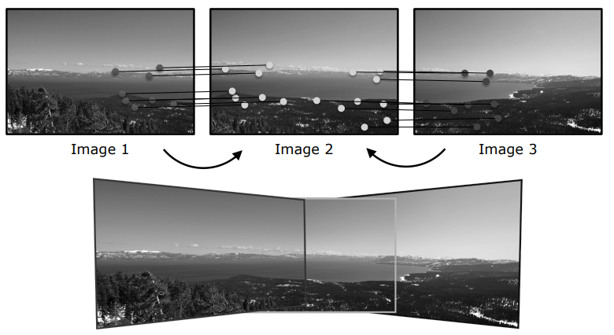
    <figcaption style="margin-top: 0.5em; text-align: center; font-size: 13px; color: #888;"><em>Şekil 1: (Üst) Çakışan görüntüler arasında ortak özellik noktalarının eşleştirilmesi. (Alt) Geometrik dönüşüm ve eğme (warping) ile oluşturulan panoramik görüntü.</em></figcaption>
  </div>
</figure>

### 1.1 Görüntü Filtreleme (Image Filtering / Range Transformations)

Görüntü filtreleme işlemlerinde girdi görüntüsünün piksel koordinatları (tanım kümesi) tamamen sabit tutulurken, piksellerin parlaklık ve renk değerleri (değer kümesi) üzerinde değişiklikler yapılır. Piksel işleme (*pixel processing*), doğrusal filtreleme (*linear filtering*) ve konvolüsyon (*convolution*) işlemleri bu sınıfa aittir. Görüntünün geometrik yapısı veya dış sınırları kesinlikle değişmez.

Matematiksel tanımı:

$$g(x,y) = T_r(f(x,y))$$

Burada $f(x,y)$ girdi görüntüsünü, $g(x,y)$ çıktı görüntüsünü ve $T_r$ parlaklık/renk değer kümesini değiştiren fonksiyonu temsil eder.

### 1.2 Görüntü Yamultma (Image Warping / Domain Transformations)

Görüntü yamultma işlemlerinde ise doğrudan görüntünün koordinat düzlemi (tanım kümesi) üzerinde çalışılarak görüntünün geometrik şekli değiştirilir. Öteleme (*translation*), döndürme (*rotation*), ölçekleme (*scaling*) ve perspektif dönüşümler bu sınıfa aittir.

Matematiksel tanımı:

$$g(x,y) = f(T_d(x,y))$$

Burada $T_d$ piksel konumlarını değiştiren koordinat operatörüdür.

<figure style="display:flex; justify-content: center; margin: 20px 0;">
  <div style="text-align: center;">
    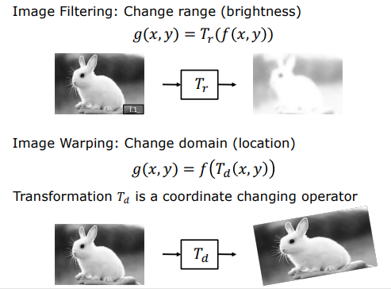
    <figcaption style="margin-top: 0.5em; text-align: center; font-size: 13px; color: #888;"><em>Şekil 2: Görüntü Filtreleme (Piksel değerleri değişir, koordinat sabit) vs. Görüntü Yamultma (Koordinat düzlemi değişir, şekil yamulur).</em></figcaption>
  </div>
</figure>

```
  [Görüntü Filtreleme (Range)]            [Görüntü Yamultma (Domain)]
     f(x, y) ──► T_r ──► g(x, y)             f(x, y) ──► T_d(x, y) ──► g(x', y')
     (Piksel değerleri değişir,               (Piksel konumları değişir,
      koordinatlar sabit kalır)                şekil yamulur)
```

<figure style="display:flex; justify-content: center; margin: 20px 0;">
  <div style="text-align: center;">
    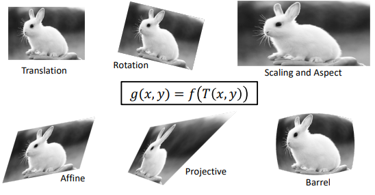
    <figcaption style="margin-top: 0.5em; text-align: center; font-size: 13px; color: #888;"><em>Şekil 3: Parametrik 2B Görüntü Yamultma Dönüşümleri (Öteleme, Dönme, Ölçekleme, Afin, Projektif ve Varil/Barel bükünümü).</em></figcaption>
  </div>
</figure>

---

## 2. 2x2 Doğrusal Dönüşümler (2x2 Linear Transformations)

İki boyutlu bir uzayda tanımlanan en temel geometrik işlemler, iki boyutlu bir $T$ dönüşüm matrisi aracılığıyla girdi piksellerini çıktı piksellerine haritalar. Kaynak piksel $p_1(x_1, y_1)$ ve hedef piksel $p_2(x_2, y_2)$ olmak üzere:

$$\begin{bmatrix} x_2 \\ y_2 \end{bmatrix} = \begin{bmatrix} t_{11} & t_{12} \\ t_{21} & t_{22} \end{bmatrix} \begin{bmatrix} x_1 \\ y_1 \end{bmatrix}$$

### 2.1 Ölçekleme (Scaling - Stretching & Squishing)

Görüntüyü yatayda $a$, dikeyde $b$ katsayılarıyla genişletmek veya daraltmak amacıyla tasarlanan dönüşüm denklemleri şu şekildedir:

$$x_2 = a \cdot x_1, \quad y_2 = b \cdot y_1$$

Matris formunda gösterimi:

$$\begin{bmatrix} x_2 \\ y_2 \end{bmatrix} = \begin{bmatrix} a & 0 \\ 0 & b \end{bmatrix} \begin{bmatrix} x_1 \\ y_1 \end{bmatrix}$$

Eğer ölçekleme matrisi $S$ tekil değilse (*invertible*, $a \neq 0$ ve $b \neq 0$), ters matris $S^{-1}$ kullanılarak çıktı görüntüsünden girdi görüntüsüne hiçbir bilgi kaybı yaşanmadan geri dönülebilir:

$$\begin{bmatrix} x_1 \\ y_1 \end{bmatrix} = S^{-1} \begin{bmatrix} x_2 \\ y_2 \end{bmatrix} = \begin{bmatrix} 1/a & 0 \\ 0 & 1/b \end{bmatrix} \begin{bmatrix} x_2 \\ y_2 \end{bmatrix}$$

<figure style="display:flex; justify-content: center; margin: 20px 0;">
  <div style="text-align: center;">
    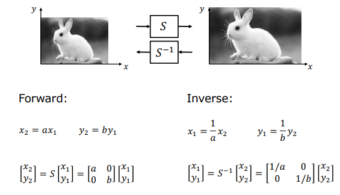
    <figcaption style="margin-top: 0.5em; text-align: center; font-size: 13px; color: #888;"><em>Şekil 4: İleri Ölçekleme Matrisi S ve Ters Ölçekleme Matrisi S⁻¹.</em></figcaption>
  </div>
</figure>

### 2.2 2 Boyutlu Dönme (2D Rotation)

Bir $p_1(x_1, y_1)$ noktasını orijin etrafında $\theta$ açısı kadar saat yönünün tersine döndürmek için öncelikle kutupsal koordinat gösteriminden yararlanılır. Noktanın orijine olan uzaklığı $r$ ve yatay eksenle yaptığı başlangıç açısı $\psi$ olsun:

$$x_1 = r \cos \psi, \quad y_1 = r \sin \psi$$

Nokta $\theta$ açısı kadar döndürüldüğünde yeni $p_2(x_2, y_2)$ konumu şu şekilde ifade edilir:

$$x_2 = r \cos(\psi + \theta), \quad y_2 = r \sin(\psi + \theta)$$

Trigonometrik toplam formülleri kullanılarak bu ifadeler açılır:

$$x_2 = r(\cos \psi \cos \theta - \sin \psi \sin \theta) = (r \cos \psi) \cos \theta - (r \sin \psi) \sin \theta$$

$$y_2 = r(\sin \psi \cos \theta + \cos \psi \sin \theta) = (r \cos \psi) \sin \theta + (r \sin \psi) \cos \theta$$

$x_1$ ve $y_1$ değerleri yerlerine yazıldığında nihai dönme denklemleri elde edilir:

$$x_2 = x_1 \cos \theta - y_1 \sin \theta$$

$$y_2 = x_1 \sin \theta + y_1 \cos \theta$$

Bu sistem $R$ dönme matrisiyle doğrusal olarak temsil edilir:

$$\begin{bmatrix} x_2 \\ y_2 \end{bmatrix} = \begin{bmatrix} \cos \theta & -\sin \theta \\ \sin \theta & \cos \theta \end{bmatrix} \begin{bmatrix} x_1 \\ y_1 \end{bmatrix}$$

Dönmenin etkisini geri almak için dönme matrisinin tersi olan $R^{-1}$ uygulanır. Ortogonal matrislerin özelliği gereği $R^{-1} = R^T$ olup, ters dönme matrisi sadece açının negatif işaretlisiyle hesaplanır:

$$R^{-1} = \begin{bmatrix} \cos \theta & \sin \theta \\ -\sin \theta & \cos \theta \end{bmatrix}$$

<figure style="display:flex; justify-content: center; margin: 20px 0;">
  <div style="text-align: center;">
    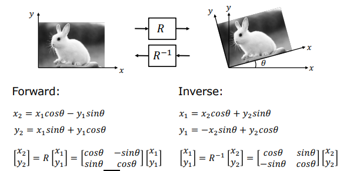
    <figcaption style="margin-top: 0.5em; text-align: center; font-size: 13px; color: #888;"><em>Şekil 5: Orijin etrafında θ kadar dönme (R) ve ters dönme (R⁻¹) matrisleri.</em></figcaption>
  </div>
</figure>

### 2.3 Kaykılma (Skew / Shear)

Dikdörtgen biçimindeki bir görüntüyü paralelkenara dönüştüren dönüşüm matrisleridir.

**Yatay Kaykılma (Horizontal Skew):** Yalnızca $x$ koordinatı dikey konumun bir $m$ katı kadar ötelenir, $y$ koordinatı sabit kalır:

$$\begin{bmatrix} x_2 \\ y_2 \end{bmatrix} = \begin{bmatrix} 1 & m \\ 0 & 1 \end{bmatrix} \begin{bmatrix} x_1 \\ y_1 \end{bmatrix}$$

**Dikey Kaykılma (Vertical Skew):** Yalnızca $y$ koordinatı yatay konumun bir $m$ katı kadar ötelenir, $x$ koordinatı sabit kalır:

$$\begin{bmatrix} x_2 \\ y_2 \end{bmatrix} = \begin{bmatrix} 1 & 0 \\ m & 1 \end{bmatrix} \begin{bmatrix} x_1 \\ y_1 \end{bmatrix}$$

<figure style="display:flex; justify-content: center; margin: 20px 0;">
  <div style="text-align: center;">
    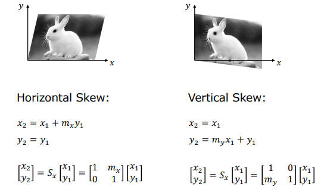
    <figcaption style="margin-top: 0.5em; text-align: center; font-size: 13px; color: #888;"><em>Şekil 6: Yatay Kaykılma (Horizontal Skew) ve Dikey Kaykılma (Vertical Skew) matrisleri ve görsel etkileri.</em></figcaption>
  </div>
</figure>

### 2.4 Aynalama / Yansıma (Mirror / Reflection)

**Y-Eksenine Göre Aynalama:** Tüm $x$ değerleri negatif yapılır, dikey konum değişmez:

$$\begin{bmatrix} x_2 \\ y_2 \end{bmatrix} = \begin{bmatrix} -1 & 0 \\ 0 & 1 \end{bmatrix} \begin{bmatrix} x_1 \\ y_1 \end{bmatrix}$$

**$y = x$ Doğrusuna Göre Aynalama (Diagonal):** Koordinat eksenleri birbiriyle yer değiştirir:

$$\begin{bmatrix} x_2 \\ y_2 \end{bmatrix} = \begin{bmatrix} 0 & 1 \\ 1 & 0 \end{bmatrix} \begin{bmatrix} x_1 \\ y_1 \end{bmatrix}$$

<figure style="display:flex; justify-content: center; margin: 20px 0;">
  <div style="text-align: center;">
    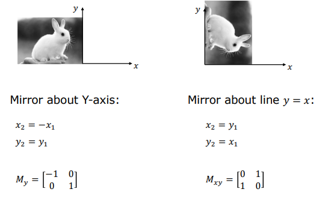
    <figcaption style="margin-top: 0.5em; text-align: center; font-size: 13px; color: #888;"><em>Şekil 7: Y-eksenine göre yansıma (M_y) ve y = x doğrusuna göre diyagonal yansıma (M_xy).</em></figcaption>
  </div>
</figure>

### 2.5 2x2 Doğrusal Dönüşümlerin Özellikleri ve Sınırları

- **Orijin Sabittir:** Orijin noktası $(0,0)$ her zaman yine $(0,0)$ noktasına haritalanır.
- **Doğrusallık Korunur:** Girdi uzayındaki doğrular çıktı uzayında da birer doğru oluşturur.
- **Paralellik Korunur:** Paralel olan doğrular dönüşüm sonrasında da paralelliklerini kesinlikle kaybetmezler.
- **Bileşke Altında Kapalıdır:** Ardışık yapılan dönüşümler tek bir matris çarpımıyla birleştirilebilir:

$$T_{13} = T_{23} \cdot T_{12}$$

> **2x2 Sistemlerin Temel Sınırı (Öteleme Problemi):** Sezgisel olarak en basit geometrik işlem olan Öteleme (*Translation*: $x_2 = x_1 + t_x$ ve $y_2 = y_1 + t_y$), doğrusal bir 2x2 matris biçiminde kesinlikle ifade edilemez. Çünkü matris çarpımına $+t_x$ ve $+t_y$ gibi sabit toplama parametrelerini ekleyebilecek doğrusal bir alan bulunmamaktadır. Bu kısıtlamayı aşmak amacıyla sisteme yapay bir boyut eklenerek homojen koordinatlara geçilir.

---

## 3. 3x3 Görüntü Dönüşümleri (3x3 Image Transformations)

### 3.1 Homojen Koordinatlar (Homogeneous Coordinates)

Boyutsal kısıtlamaları gidermek ve öteleme dahil tüm geometrik dönüşümleri tek tip bir matris çarpımı altında birleştirmek için Homojen Koordinatlar tanımlanır.

İki boyutlu bir $p(x,y)$ noktasının homojen gösterimi, sisteme eklenen sıfırdan farklı yapay (*fictitious*) bir $\tilde{z}$ koordinatı ile üç boyutlu bir $\tilde{p}(\tilde{x}, \tilde{y}, \tilde{z})$ noktasıdır. Homojen uzaydan gerçek 2D koordinat uzayına geri dönüş şu şekilde tanımlanır:

$$x = \frac{\tilde{x}}{\tilde{z}}, \quad y = \frac{\tilde{y}}{\tilde{z}}$$

Geometrik olarak, gerçek 2D koordinat düzlemimiz 3B homojen uzayda $\tilde{z} = 1$ düzleminde yer almaktadır. Orijinden çıkıp bu düzlemdeki $p(x,y,1)$ noktasından geçen doğrusal bir $L$ çizgisi üzerindeki tüm noktalar (orijin hariç) birbirine eşdeğerdir ve hepsi aynı 2D $p(x,y)$ noktasını temsil eder.

```
       z_tilde
          ▲          /  Doğru L (Tüm noktaları eşdeğerdir)
          │         /
     1.0 ─┼────────• p(x, y, 1)  <-- Projeksiyon Düzlemimiz
          │       /│
          │      / │
          │     /  │
          │    /   │
          └───•────┼─────────► x_tilde
            Orijin │
                   ▼ y_tilde
```

Bu doğrultuda, $[x, y, 1]^T$ homojen vektörünün herhangi bir $\tilde{z}$ ölçek sabitiyle çarpılmış hali olan $[\tilde{z}x, \tilde{z}y, \tilde{z}]^T$ de aynı fiziksel noktayı temsil eder.

### 3.2 Ötelemenin 3x3 Temsili

Homojen koordinatlar sayesinde öteleme işlemi artık doğrusal bir 3x3 matris çarpımı olarak yazılabilir:

$$\begin{bmatrix} x_2 \\ y_2 \\ 1 \end{bmatrix} = \begin{bmatrix} 1 & 0 & t_x \\ 0 & 1 & t_y \\ 0 & 0 & 1 \end{bmatrix} \begin{bmatrix} x_1 \\ y_1 \\ 1 \end{bmatrix} = \begin{bmatrix} x_1 + t_x \\ y_1 + t_y \\ 1 \end{bmatrix}$$

<figure style="display:flex; justify-content: center; margin: 20px 0;">
  <div style="text-align: center;">
    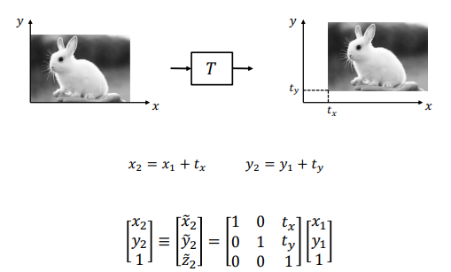
    <figcaption style="margin-top: 0.5em; text-align: center; font-size: 13px; color: #888;"><em>Şekil 8: Homojen koordinat sisteminde 3x3 öteleme (translation) matrisi T.</em></figcaption>
  </div>
</figure>

2x2 doğrusal sistemde tanımlanan tüm ölçekleme, dönme ve kaykılma işlemleri de 3x3'lük homojen matrislerin sol-üst kısmına yerleştirilerek aynı yapıda ifade edilir. Bu sayede, örneğin önce kaykılma, ardından öteleme, ölçekleme ve dönme içeren karmaşık bir dönüşüm zinciri, her adımı tek tek piksele uygulamaya gerek kalmadan, matrislerin ters sıra ile birbiriyle çarpılması sonucu elde edilen tek bir bileşke 3x3 matris ile tek geçişte gerçekleştirilir.

<figure style="display:flex; justify-content: center; margin: 20px 0;">
  <div style="text-align: center;">
    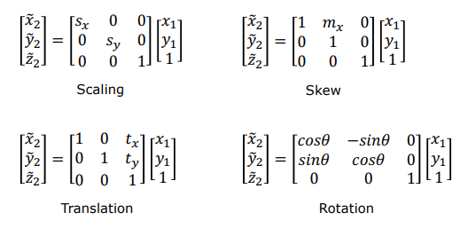
    <figcaption style="margin-top: 0.5em; text-align: center; font-size: 13px; color: #888;"><em>Şekil 9: Homojen koordinatlarda temel 3x3 dönüşüm matrisleri (Scaling, Skew, Translation, Rotation).</em></figcaption>
  </div>
</figure>

### 3.3 Afin Dönüşümler (Affine Transformations)

En alt satırı her zaman $[0\quad0\quad1]$ olarak sabitlenmiş olan tüm 3x3 homojen dönüşüm matrisleri **Afin Dönüşüm** sınıfına girer:

$$\begin{bmatrix} x_2 \\ y_2 \\ 1 \end{bmatrix} = \begin{bmatrix} a_{11} & a_{12} & t_x \\ a_{21} & a_{22} & t_y \\ 0 & 0 & 1 \end{bmatrix} \begin{bmatrix} x_1 \\ y_1 \\ 1 \end{bmatrix}$$

Afin dönüşümlerin **6 adet serbest parametresi** (*degrees of freedom - DoF*) bulunur.

**Afin Dönüşümlerin Özellikleri:**
- Öteleme barındırabildiklerinden ötürü orijin artık orijine haritalanmak zorunda değildir (orijin kayabilir).
- Doğrular doğrulara haritalanır.
- Paralel doğrular dönüşüm sonrasında da kesinlikle paralel kalır.
- Bileşke altında kapalıdır.

<figure style="display:flex; justify-content: center; margin: 20px 0;">
  <div style="text-align: center;">
    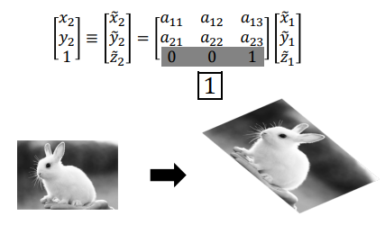
    <figcaption style="margin-top: 0.5em; text-align: center; font-size: 13px; color: #888;"><em>Şekil 10: Afin Dönüşüm matrisi (En alt satır [0 0 1] sabittir) ve dikey/yatay eğme ile öteleme birleşimi.</em></figcaption>
  </div>
</figure>

### 3.4 Projektif Dönüşümler (Projective Transformations / Homography)

Eğer 3x3'lük homojen dönüşüm matrisinin son satırı $[0\quad0\quad1]$ şeklinde sınırlandırılmayıp tamamen serbest bırakılırsa, bu dönüşüm sınıfına **Projektif Dönüşüm** veya **Homografi (Homography)** adı verilir:

$$\begin{bmatrix} \tilde{x}_2 \\ \tilde{y}_2 \\ \tilde{z}_2 \end{bmatrix} = \begin{bmatrix} h_{11} & h_{12} & h_{13} \\ h_{21} & h_{22} & h_{23} \\ h_{31} & h_{32} & h_{33} \end{bmatrix} \begin{bmatrix} x_1 \\ y_1 \\ 1 \end{bmatrix}$$

<figure style="display:flex; justify-content: center; margin: 20px 0;">
  <div style="text-align: center;">
    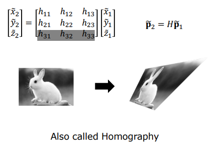
    <figcaption style="margin-top: 0.5em; text-align: center; font-size: 13px; color: #888;"><em>Şekil 11: Homografi (Projektif Dönüşüm) matrisi H. Alt satırı serbesttir ve 8 serbestlik derecesine sahiptir.</em></figcaption>
  </div>
</figure>

Projektif dönüşüm, bir $\Pi_1$ düzleminin üzerindeki tüm noktaların, ortak bir projeksiyon merkezi (*pinhole*/izdüşüm noktası) aracılığıyla başka bir $\Pi_2$ düzleminin üzerine izdüşürülmesini (haritalanmasını) temsil eder. Bu durum, bir kameranın gerçek dünyadaki düzlemsel bir yüzeyi kendi görüntü düzlemine izdüşürme (fotoğraflama) geometrisiyle birebir aynıdır.

**Ölçek Belirsizliği ve Serbestlik Derecesi:**
Homojen koordinatların doğası gereği, homografi matrisinin sıfırdan farklı herhangi bir $k$ skaler sabitiyle çarpılması, koordinatların bölünmesi sonrasındaki fiziksel $x_2, y_2$ konumlarını kesinlikle değiştirmez. Bu nedenle homografi matrisi sadece bir ölçek katsayısına kadar (*up to a scale factor*) hesaplanabilir. Matrisin ölçeğini sabitlemek için genellikle $\sum h_{ij}^2 = 1$ kısıtı getirilir. Bu normalizasyon sonucunda, matriste 9 eleman bulunmasına rağmen homografinin aslında **8 serbest parametresi** (*degrees of freedom*) vardır.

**Projektif Dönüşümlerin Özellikleri:**
- Orijin orijine gitmez, doğrular doğrulara haritalanır ve bileşke altında kapalıdır.
- **Afin dönüşümlerden en kritik farkı:** Projektif dönüşüm altında paralel doğrular paralelliklerini korumazlar. Paralel doğruların perspektif izdüşüm altında bir noktada birleşiyormuş gibi görünmesi (örneğin tren raylarının ufuk çizgisinde birleşmesi), projektif dönüşümün bu özelliğinin bir sonucudur ve kaçış noktalarını (*vanishing points*) oluşturur.

---

## 4. Dönüşüm Özellikleri Özeti

| Dönüşüm Tipi | Matris Boyutu | Serbestlik Derecesi (DoF) | Korunan Geometrik Özellikler | En Alt Satır Kısıtı |
| :--- | :--- | :--- | :--- | :--- |
| **Lineer (2x2)** | $2 \times 2$ | 4 | Orijin, Doğrusallık, Paralellik | - |
| **Afin (Affine)** | $3 \times 3$ | 6 | Doğrusallık, Paralellik | $[0 \quad 0 \quad 1]$ |
| **Projektif (Homography)** | $3 \times 3$ | 8 | Doğrusallık | Serbest (Ölçeğe Duyarlı) |

