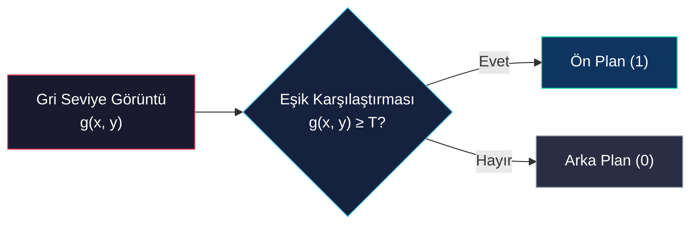
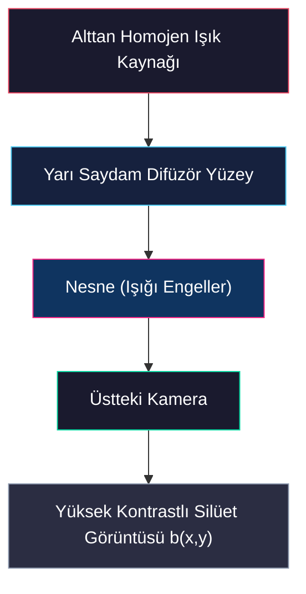
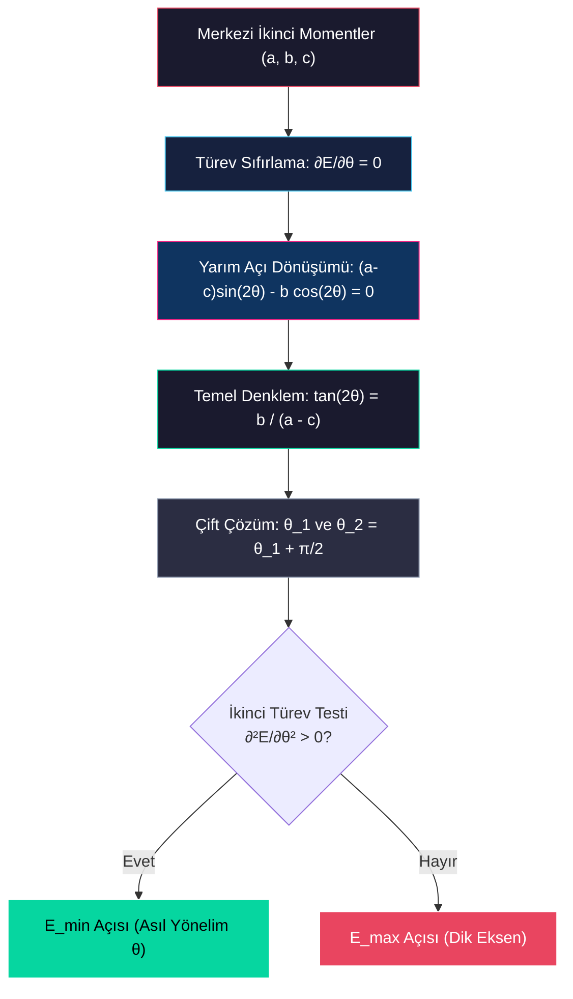
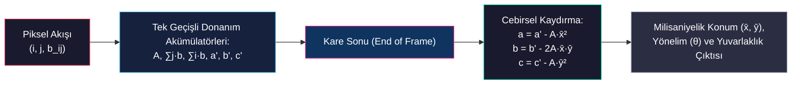

# İkili Görüntülerin Matematiksel Temelleri ve Geometrik Özellikleri

<!-- toc -->

İkili görüntüler (binary images), bilgisayarlı görü disiplinindeki en yalın ancak endüstriyel otomasyon ve yapılandırılmış ortamlarda en kararlı ve verimli çalışan görüntü temsil biçimidir. Bu bölümde, gri seviyeli görüntülerden ikili görüntülere geçış fiziksel ve matematiksel süreçleri ile tekil bir nesnenin konumunu, yönelimini ve yapısal niteliklerini belirleyen sürekli ve ayrık geometrik moment hesaplamalarının matematiksel arka planı incelenmektedir.

> **Temel Sezgi:** İkili görüntülerde karmaşık renk ve doku bilgisi elenerek yalnızca nesne geometrisine odaklanılır. Doğru bir optik kurulum ve moment analizi ile nesnenin konumu ($x, y$), alanı ($A$) ve yönelimi ($\theta$) karmaşıklığı $O(N)$ olan bir süreçle milisaniyeler içinde hesaplanabilir.

---

## 1. İkili Görüntülerin Doğası ve Elde Edilme Süreçleri

İkili görüntüler, her pikselin yalnızca iki olası değerden birini alabildiği ($0$ veya $1$) matris yapısıdır. Genellikle $1$ (beyaz) değeri üzerinde analiz yapılmak istenen ön plandaki nesneyi (foreground), $0$ (siyah) değeri ise arka planı (background) simgeler.

### 1.1 Eşikleme (Thresholding) ve Karakteristik Fonksiyon

Gri seviyeli bir $g(x,y)$ görüntüsünü ikili $b(x,y)$ görüntüsüne dönüştürmek için kullanılan matematiksel dönüşüme **eşikleme** denir. Bu işlem karakteristik (gösterge) fonksiyonu ile şu şekilde ifade edilir:

$$b(x,y) = \begin{cases} 0, & g(x,y) < T \\ 1, & g(x,y) \ge T \end{cases}$$

Burada $T$, gri seviye sınırını belirleyen global eşik değeridir.

### 1.2 Optimum Eşik Değerinin Seçimi (Histogram Vadisi)

Doğru bir $T$ değerini otomatik olarak belirlemek amacıyla gri seviyeli görüntünün parlaklık histogramı analiz edilir. Kontrol edilebilir aydınlatmalı sahnelerde histogram tipik olarak **çift modlu (bimodal)** bir dağılım sergiler:

1. **Birinci Tepe Noktası (Mode):** Arka plan piksellerinin yoğunlaştığı parlaklık seviyesi.
2. **İkinci Tepe Noktası (Mode):** Ön plandaki nesnelerin yoğunlaştığı parlaklık seviyesi.

Bu iki tepe noktası arasında kalan en çukur bölge **vadi (valley)** noktası olarak adlandırılır. İdeal eşik değeri $T$, bu vadiye karşılık gelen gri seviye değeri olarak seçildiğinde nesne sınırları en kararlı şekilde ayrıştırılır.

<figure style="display:flex; justify-content: center; margin: 20px 0;">
  

    
    <figcaption style="margin-top: 0.5em; text-align: center; font-size: 13px; color: #888;"><em>Gri Seviyeli Görüntü, Parlaklık Histogramı ve İdeal Eşik (T) Seçimi ile İkili Görüntüye Geçiş</em></figcaption>
  

</figure>

### 1.3 Kararlı Konfigürasyonlar (Stable Configurations) ve Silüet Görüntüleme

Üç boyutlu karmaşık nesneler, yatay bir düzleme bırakıldıklarında yerçekimi etkisiyle sınırlı sayıda **kararlı konfigürasyonda (stable configurations)** dururlar. Üstten dik bakan bir kamera, nesneyi her zaman bu kararlı duruş pozisyonlarından birinde gözlemler (nesne düzlemde ötelenebilir veya dönebilir). Bu durum, 3D nesnelerin 2D ikili silüet analizi yoluyla tanınabilmesini sağlar.

Ancak doğrudan üstten aydınlatmalı sistemlerde 3D nesnelerin gölgeleri, parıltıları (*specularities*), yüzey dokuları ve malzeme parlaklıklarının arka plana yakın olması basit eşiklemeyi başarısız kılar. Bu fiziksel sınırlamayı aşmak için **Arkadan Aydınlatma (Backlighting)** optik tasarımı tercih edilir:

- Nesneler, alttan homojen şekilde ışıklandırılan yarı saydam bir yüzeye yerleştirilir.
- Kamera nesneyi üstten kaydettiğinde, nesne ışığı tamamen bloke ettiği için kameraya doğrudan yüksek kontrastlı, pürüzsüz ve gürültüsüz bir silüet görüntüsü ulaşır.

<figure style="display:flex; justify-content: center; margin: 20px 0;">
  

    
    <figcaption style="margin-top: 0.5em; text-align: center; font-size: 13px; color: #888;"><em>Normal Üstten Aydınlatma ile Arkadan Aydınlatma (Backlighting) Karşılaştırması</em></figcaption>
  

</figure>

> **Key Insight:** Arkadan aydınlatma (backlighting) tekniği, karmaşık ön işlem yazılımları yerine ışığın fiziğini kullanarak doğrudan kusursuz ikili silüet görüntüsü elde etmeyi sağlar.

---

## 2. Sürekli İkili Görüntülerde Geometrik Momentler ve Konum Tespiti

Sahnede tek bir nesnenin var olduğu ve görüntünün sürekli (*continuous*) uzayda tanımlandığı varsayımı altında geometrik özellikler incelenir. Karakteristik fonksiyon nesne üzerinde $b(x,y) = 1$, arka planda ise $b(x,y) = 0$ değerini alır.

### 2.1 Alan (Area - Sıfırıncı Moment)

Nesnenin kapladığı toplam alan ($A$), görüntünün sıfırıncı momentidir ve tüm görüntü alanı üzerinden integral alınarak hesaplanır:

$$A = \iint b(x,y) \, dx \, dy$$

Alan değeri, sınırlı sayıda nesnenin birbirinden ayırt edilmesinde (sınıflandırılmasında) öteleme ve dönmeden etkilenmeyen en temel invariant (değişmez) özniteliktir.

### 2.2 Konum (Center of Area - Birinci Moment)

Nesnenin görüntü düzlemindeki konumu, alanın geometrik merkezi olan **alan merkezi (center of area / centroid)** ile tanımlanır. Bu merkez, mekanikteki homojen kalınlık ve kütle dağılımına sahip düz bir levhanın kütle merkezine karşılık gelir. Birinci momentlerin alana bölünmesiyle koordinatlar $(\bar{x}, \bar{y})$ şeklinde elde edilir:

$$\bar{x} = \frac{1}{A} \iint x \cdot b(x,y) \, dx \, dy$$

$$\bar{y} = \frac{1}{A} \iint y \cdot b(x,y) \, dx \, dy$$

<figure style="display:flex; justify-content: center; margin: 20px 0;">
  

    
    <figcaption style="margin-top: 0.5em; text-align: center; font-size: 13px; color: #888;"><em>Alan Merkezi (Centroid) ve Mekanikteki Kütle Merkezi Analojisi</em></figcaption>
  

</figure>

---

## 3. Nesne Yöneliminin Belirlenmesi (En Küçük İkinci Moment Ekseni)

Bir robot kolun nesneyi hassas bir şekilde kavrayabilmesi için alan merkezinin yanı sıra nesnenin düzlemsel **yönelimini (orientation)** de bilmesi gerekir. Yönelim, matematiksel olarak en kararlı biçimde **En Küçük İkinci Moment Ekseni (Axis of Least Second Moment)** ile tanımlanır.

### 3.1 İkinci Moment Fonksiyonu ($E$) ve Çizgi Parametrizasyonu

Herhangi bir eksene göre ikinci moment ($E$), nesne üzerindeki her noktanın o eksene olan dik uzaklığının ($r$) karelerinin integralidir:

$$E = \iint r^2 \cdot b(x,y) \, dx \, dy$$

Klasik $y = mx + b$ doğru denklemi, dik doğrularda eğimin $m \to \infty$ olmasına yol açarak optimizasyonda tekillik (*singularity*) hatası üretir. Bu sebeple trigonometrik parametrizasyon tercih edilir:

$$x \sin\theta - y \cos\theta + \rho = 0$$

Burada:
- $\theta$: Doğrunun yatay eksenle yaptığı açıdır ($\theta \in [0, 2\pi]$).
- $\rho$: Doğrunun orijine olan dik uzaklığıdır.

Bir $(x,y)$ noktasının bu eksene olan dik uzaklığı ($r$), $\sin^2\theta + \cos^2\theta = 1$ eşitliğinden ötürü doğrudan şu şekilde elde edilir:

$$r = x \sin\theta - y \cos\theta + \rho$$

### 3.2 Eksenin Alan Merkezinden Geçtiğinin İspatı

İkinci moment denklemi açık halde yazılır:

$$E(\theta, \rho) = \iint (x \sin\theta - y \cos\theta + \rho)^2 \cdot b(x,y) \, dx \, dy$$

$E$'yi minimize eden $\rho$ parametresini bulmak için $\rho$'ya göre kısmi türev alınıp sıfıra eşitlenir:

$$\frac{\partial E}{\partial \rho} = 2 \iint (x \sin\theta - y \cos\theta + \rho) \cdot b(x,y) \, dx \, dy = 0$$

İntegrali terim terim dağıtıp sıfırıncı ve birinci moment tanımlarını ($A, \bar{x}, \bar{y}$) yerleştirdiğimizde:

$$\sin\theta \iint x \cdot b(x,y) \, dx \, dy - \cos\theta \iint y \cdot b(x,y) \, dx \, dy + \rho \iint b(x,y) \, dx \, dy = 0$$

$$A \bar{x} \sin\theta - A \bar{y} \cos\theta + A \rho = 0$$

$A \neq 0$ olduğundan her iki taraf $A$'ya bölünür:

$$\bar{x} \sin\theta - \bar{y} \cos\theta + \rho = 0$$

> **Matematiksel İspat:** Bu eşitlik, en küçük ikinci moment ekseninin mutlaka nesnenin alan merkezinden $(\bar{x}, \bar{y})$ geçmesi gerektiğini kesin olarak kanıtlar.

### 3.3 Koordinat Ötelemesi ile $\rho$ Parametresinin Elenmesi

Eksenin merkezden geçme zorunluluğu doğrultusunda, koordinat sisteminin orijini nesnenin alan merkezine ötelenir:

$$x' = x - \bar{x} \quad \text{ve} \quad y' = y - \bar{y}$$

Bu yeni koordinat sisteminde doğrunun orijine uzaklığı sıfırlanır ($\rho = 0$) ve ikinci moment denklemi şu trigonometrik forma indirgenir:

$$E(\theta) = a \sin^2\theta - b \sin\theta \cos\theta + c \cos^2\theta$$

Burada $a, b, c$ sabitleri görüntünün **merkezi ikinci momentleridir**:

- $a = \iint (x')^2 \cdot b(x,y) \, dx' \, dy'$ ($y$-eksenine göre eylemsizlik momenti)
- $b = 2 \iint (x' y') \cdot b(x,y) \, dx' \, dy'$ (çarpım / korelasyon momenti)
- $c = \iint (y')^2 \cdot b(x,y) \, dx' \, dy'$ ($x$-eksenine göre eylemsizlik momenti)

---

## 4. Yönelim Açısının Çözümü ve Şekil Analizi

### 4.1 Yönelim Açısı Formülü ($\theta$)

İkinci moment fonksiyonunu ($E$) minimize eden $\theta$ açısını bulmak için $\theta$'ya göre türev alınarak sıfıra eşitlenir:

$$\frac{\partial E}{\partial \theta} = 2a \sin\theta \cos\theta - b(\cos^2\theta - \sin^2\theta) - 2c \sin\theta \cos\theta = 0$$

Yarım açı formülleri ($\sin 2\theta = 2\sin\theta\cos\theta$ ve $\cos 2\theta = \cos^2\theta - \sin^2\theta$) uygulandığında:

$$(a - c) \sin 2\theta - b \cos 2\theta = 0$$

Buradan yönelim açısını veren temel denklem elde edilir:

$$\tan 2\theta = \frac{b}{a - c}$$

### 4.2 Çift Çözüm Geometrisi ve İkinci Türev Testi

$\tan 2\theta = \tan(2\theta + \pi)$ trigonometrik kimliği gereği denklemin iki dik çözümü vardır:

$$\theta_1 = \frac{1}{2} \text{atan2}(b, a-c)$$
$$\theta_2 = \theta_1 + \frac{\pi}{2}$$

Bu çözümlerden biri ikinci momenti minimize ederken ($E_{min}$), diğeri maksimize eder ($E_{max}$). Minimum yapan yönelim açısını bulmak için ikinci türev testi uygulanır:

$$\frac{\partial^2 E}{\partial \theta^2} = 2(a - c) \cos 2\theta + 2b \sin 2\theta$$

- $\frac{\partial^2 E}{\partial \theta^2} > 0$ ise seçilen $\theta$ açısı en küçük ikinci moment eksenini ($E_{min}$) verir.
- $\frac{\partial^2 E}{\partial \theta^2} < 0$ ise seçilen $\theta$ açısı en büyük ikinci moment eksenini ($E_{max}$) verir.

### 4.3 Yuvarlaklık (Roundedness) Analizi

Nesnenin dairesel veya ince-uzun (*elongated*) yapıda olup olmadığını ölçmek amacıyla minimum ve maksimum ikinci momentlerin oranı kullanılır:

$$\text{Yuvarlaklık} = \frac{E_{min}}{E_{max}}$$

Bu oran $$ aralığındadır:
- **İnce ve Uzun Nesneler:** $E_{min} \ll E_{max}$ olduğu için oran $0$'a yaklaşır.
- **Kusursuz Daire (Disk):** Merkezden geçen her eksen aynı eylemsizlik momentini üretir ($a=c, b=0$). Bu durumda yuvarlaklık oranı tam olarak $1.0$ olur.

<figure style="display:flex; justify-content: center; margin: 20px 0;">
  

    
    <figcaption style="margin-top: 0.5em; text-align: center; font-size: 13px; color: #888;"><em>Farklı Nesnelerde Geometrik Özelliklerin Gösterimi (İkili Görüntü, Yönelim Ekseni ve Yuvarlaklık Değerleri)</em></figcaption>
  

</figure>

---

## 5. Ayrık İkili Görüntüler ve Gerçek Zamanlı Donanımsal Hesaplama

Gerçek dünyada görüntüler ayrık (*discrete*) piksellerden oluşur. $b_{ij}$, görüntünün $i$. satır ve $j$. sütunundaki piksel değerini ($0$ veya $1$) temsil eder.

### 5.1 Ayrık Moment Formülleri

- **Alan (Sıfırıncı Moment):**
  $$A = \sum_{i} \sum_{j} b_{ij}$$

- **Alan Merkezi (Birinci Moment):**
  $$\bar{x} = \frac{1}{A} \sum_{i} \sum_{j} j \cdot b_{ij} \quad \text{ve} \quad \bar{y} = \frac{1}{A} \sum_{i} \sum_{j} i \cdot b_{ij}$$

<figure style="display:flex; justify-content: center; margin: 20px 0;">
  

    
    <figcaption style="margin-top: 0.5em; text-align: center; font-size: 13px; color: #888;"><em>Ayrık (Discrete) İkili Görüntülerde Piksel Izgarası ve Koordinat Sistemi</em></figcaption>
  

</figure>

### 5.2 Donanımsal Gerçek Zamanlı Hesaplama Stratejisi

Sensörden piksel akışı gerçekleşirken sistem henüz alan merkezini $(\bar{x}, \bar{y})$ bilmez. Doğrudan merkeze göre moment hesaplamak görüntünün bellekte iki kez taranmasını gerektirir, bu da gecikme (*latency*) yaratır.

Bu sorunu çözmek için orijine (sol-üst köşe) göre ara momentler ($a', b', c'$) hesaplanır:

$$a' = \sum_{i} \sum_{j} j^2 \cdot b_{ij}$$
$$b' = 2 \sum_{i} \sum_{j} i \cdot j \cdot b_{ij}$$
$$c' = \sum_{i} \sum_{j} i^2 \cdot b_{ij}$$

Bu ara momentler ($a', b', c'$), alan ($A$) ve birinci momentler ($\sum j \cdot b_{ij}$, $\sum i \cdot b_{ij}$), piksel akışı sırasında donanımda tek geçişte (*on-the-fly*) güncellenir.

Görüntü taraması bittiğinde, nesne merkezine göre asıl merkezi momentler ($a, b, c$) cebirsel olarak anında hesaplanır:

$$a = a' - A \bar{x}^2$$
$$b = b' - 2A \bar{x}\bar{y}$$
$$c = c' - A \bar{y}^2$$

> **Endüstriyel Avantaj:** Bu cebirsel dönüştürme stratejisi sayesinde robotik vizyon ve endüstriyel kalite kontrol sistemlerinde milisaniyeler mertebesinde nesne konumu, alanı ve yönelimi hesaplanabilmektedir.
