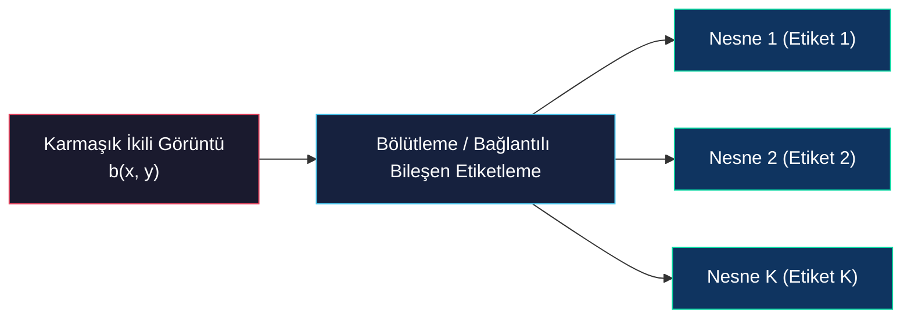
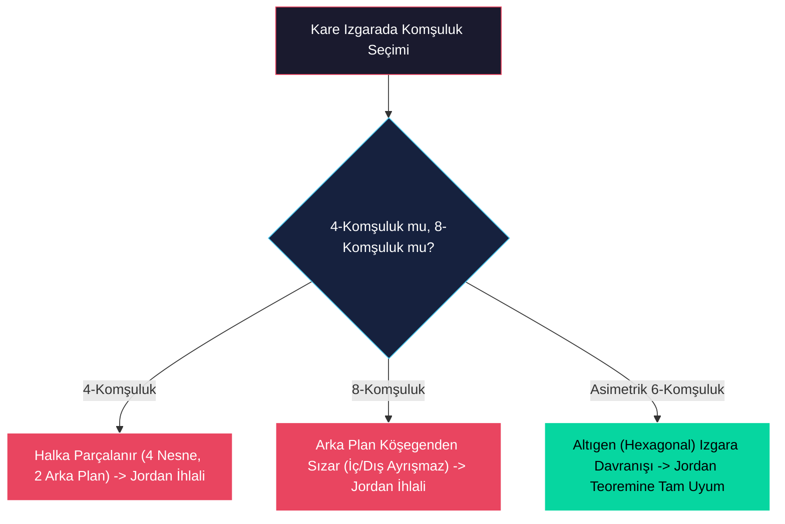

# İkili Görüntülerin Bölütlenmesi ve İteratif Yapısal Değişiklikler

<!-- toc -->

Gerçek dünya uygulamalarında ikili görüntüler tek bir nesneden ziyade çok sayıda bağımsız nesne barındırır. Bu bölümde, görüntüdeki farklı nesnelerin piksellerini birbirlerinden ayırt eden **Bölütleme (Segmentation / Connected Component Labeling)** teknikleri ile nesnelerin topolojik bütünlüğünü bozmadan sınırlarını genişleten veya tek piksel kalınlığında iskeletini çıkaran **İteratif Değişiklik (Iterative Modification)** algoritmaları incelenmektedir.

> **Temel Sezgi:** Çoklu nesne içeren sahnelerde geometrik moment hesaplamalarından önce her nesneye benzersiz bir sayısal etiket (kimlik) verilmelidir. İteratif değişikliklerde ise Euler sayısı korunarak nesnenin topolojik yapısı (gövde ve delik sayısı) değiştirilmeden morfolojik analizler gerçekleştirilir.

---

## 1. İkili Görüntülerin Bölütlenmesi (Segmentation)

### 1.1 Çoklu Nesne Problemi ve Bağlantılı Bileşen (Connected Component) Tanımı

Geometrik moment hesaplamalarında görüntüde tek bir nesnenin var olduğu kabul edilir. Ancak gerçek uygulamalarda bir sahne genellikle çok sayıda bağımsız nesne barındırır. Her bir nesnenin alan, konum ve yönelim gibi geometrik özelliklerini ayrı ayrı analiz edebilmek için, nesnelerin pikselleri taranarak birbirlerinden ayırt edilmeli ve her nesneye benzersiz bir sayısal etiket atanmalıdır. Bu işleme **Bölütleme (Segmentation)** veya **Bağlantılı Bileşen Etiketleme (Connected Component Labeling)** adı verilir.

Matematiksel olarak bir nesne, ikili görüntüdeki bir **bağlantılı bileşendir (connected component)**. İki piksel ($A$ ve $B$) arasında, yol boyunca görüntü değerinin hiç değişmeden sabit kaldığı (yani hep 1 olduğu) kesintisiz bir piksel yolu kurulabiliyorsa, bu iki piksel birbirine bağlantılıdır. Bir nesne, bu şekilde birbirine bağlı piksellerin oluşturduğu maksimal (en geniş) bağlantılı kümedir.



### 1.2 Bölge Büyütme (Region Growing) Algoritması

Sezgisel açıdan en temel bölütleme yöntemi, "tohum" pikselleriyle başlayan ve dışa doğru genişleyen **Bölge Büyütme (Region Growing)** algoritmasıdır. Algoritmanın işleyiş adımları şu şekildedir:

1. **Tohum Arama:** Görüntü, raster tarama düzeninde (soldan sağa, yukarıdan aşağıya) taranarak henüz etiketlenmemiş ve değeri $1$ olan ilk nesne pikseli bulunur.
2. **Etiket Atama:** Bulunan bu tohum pikseline benzersiz yeni bir etiket değeri atanır.
3. **Komşu Taraması:** Tohum pikselinin çevresinde bulunan ve değeri $1$ olan (henüz etiketlenmemiş) tüm doğrudan komşu piksellere de aynı etiket atanır.
4. **Yinelemeli Genişleme:** Aynı işlem etiketlenen komşuların komşuları için de tekrarlanarak nesne sınırlarına ulaşana kadar bölge dışa doğru büyütülür. Nesneye bağlı hiçbir etiketlenmemiş 1 pikseli kalmadığında büyüme durur.
5. **Döngüye Dönüş:** 1. adıma geri dönülerek bir sonraki nesneyi bölütlemek üzere yeni bir etiketlenmemiş tohum noktası aranır.

### 1.3 Komşuluk Teorisi ve Jordan Eğri Teoremi İhlali

Komşuluğun matematiksel tanımı topolojik tutarlılık açısından son derece kritiktir. Kare piksel ızgarasında iki temel komşuluk tanımı yapılır:

- **4-Komşuluk (4-Connectedness):** Sadece yatay ve dikey yöndeki 4 piksel komşu kabul edilir.
- **8-Komşuluk (8-Connectedness):** Yatay ve dikey piksellere ek olarak köşegenlerdeki 4 piksel de dahil edilerek 8 komşu tanımlanır.

<figure style="display:flex; justify-content: center; margin: 20px 0;">
  <div style="text-align: center;">
    
    <figcaption style="margin-top: 0.5em; text-align: center; font-size: 13px; color: #888;"><em>4-Komşuluk (4-C) ve 8-Komşuluk (8-C) Piksel Komşuluk Tanımları</em></figcaption>
  </div>
</figure>

Ancak bu iki tanım da geometrideki **Jordan Eğri Teoremini** açıkça ihlal eder. Jordan teoremi; iki boyutlu düzlemdeki kapalı bir eğrinin, düzlemi kesin olarak iki bağlantısız bölgeye (iç bölge ve dış bölge) ayırması gerektiğini ifade eder.

Çapraz piksellerden oluşan kapalı bir halka geometrisini ele alalım:

- **4-Komşuluk Tercih Edilirse:** Köşegen pikseller birbirine bağlı sayılmadığından, halkanın kendisi 4 ayrı nesneye bölünür. Ancak halkanın içindeki arka plan pikselleri (sıfırlar), köşegen pikseller nedeniyle dış arka plandan izole kalır. Bu durumda 4 ayrı nesne olmasına rağmen 2 ayrı arka plan kalır; bu da kapalı halka olmadan arka planın ikiye bölünmesi nedeniyle Jordan teoremini ihlal eder.
- **8-Komşuluk Tercih Edilirse:** Köşegen pikseller bağlı kabul edildiğinden halkayı oluşturan pikseller tek bir bağlantılı kapalı halka olarak tanımlanır. Ancak bu kez köşegen arka plan pikselleri de birbirine bağlı sayıldığı için halkanın içindeki sıfır pikselleri dışarıdaki sıfır pikselleri ile köşegenlerden sızarak bağlantılı hale gelir. Kapalı bir halkanın iç ve dış bölgeleri ayıramaması yine Jordan teoreminin ihlalidir.

<figure style="display:flex; justify-content: center; margin: 20px 0;">
  <div style="text-align: center;">
    
    <figcaption style="margin-top: 0.5em; text-align: center; font-size: 13px; color: #888;"><em>Kare Piksel Izgarasında Jordan Eğri Teoremi İhlali (4-C Döngüsüz Delik vs 8-C Sızdıran Arka Plan)</em></figcaption>
  </div>
</figure>

### 1.4 Asimetrik 6-Komşuluk (6-Connectedness) Çözümü

Bu geometrik paradoks, komşuluk tanımına yapay bir asimetri kazandırılarak çözülür. **6-Komşuluk** yönteminde, 8-komşuluk tanımından belirli iki simetrik köşegen piksel (örneğin sağ-üst ve sol-alt köşegenler) çıkarılarak sadece 6 komşu tanımlanır.

<figure style="display:flex; justify-content: center; margin: 20px 0;">
  <div style="text-align: center;">
    
    <figcaption style="margin-top: 0.5em; text-align: center; font-size: 13px; color: #888;"><em>Asimetrik 6-Komşuluk (6-C) Konfigürasyonları ve Jordan Paradoksunun İki Doğru Parçasına Ayrılması</em></figcaption>
  </div>
</figure>

Bu asimetrik yaklaşım, kare ızgaraya sahip görüntü sensörlerinin **hekzagonal (altıgen)** bir ızgara gibi davranmasını sağlar. Altıgen ızgaralarda komşuluk ilişkileri pürüzsüzdür, sızıntı yapmaz ve Jordan eğri teoremine tamamen sadık kalır.

<figure style="display:flex; justify-content: center; margin: 20px 0;">
  <div style="text-align: center;">
    
    <figcaption style="margin-top: 0.5em; text-align: center; font-size: 13px; color: #888;"><em>Asimetrik 6-Komşuluğun Kare Piksel Izgarasını Altıgen Izgara Gibi Davrandırması</em></figcaption>
  </div>
</figure>



---

## 2. Ardışık Etiketleme (Sequential Labeling) Algoritması

### 2.1 Algoritmanın Mantığı ve Komşuluk Kuralları

Region growing algoritmasından çok daha verimli ve bilgisayar belleği açısından son derece zarif olan yöntem **Ardışık Etiketleme (Sequential Labeling)** iki geçişli (*two-pass*) bir algoritmadır. Görüntüyü raster tarama yöntemiyle baştan sona tek yönlü tarar.

Herhangi bir $A$ pikselini etiketlemek için, onun sadece daha önce taranmış ve etiketleri kesinleşmiş olan komşularına bakılır:

```text
  C   D
  B   A  <-- taranan piksel (A)
```

Algoritmik karar kuralları şu şekildedir:

1. **Arka Plan:** $A = 0$ ise doğrudan geçilir (etiketlenmez).
2. **Yeni Nesne:** $A = 1$ ve komşuların ($B, C, D$) hepsi $0$ ise, $A$'ya yeni bir benzersiz etiket verilir.
3. **Üst Komşu Bağlantısı:** $A = 1$ ve $D$ etiketliyse, $A$'ya $D$'nin etiketi atanır ($\text{etiket}(A) = \text{etiket}(D)$).
4. **Sol-Üst Komşu Bağlantısı:** $A = 1$, $D = 0$ ve $C$ etiketliyse, $A$'ya $C$'nin etiketi atanır ($\text{etiket}(A) = \text{etiket}(C)$).
5. **Sol Komşu Bağlantısı:** $A = 1$, $D = 0$, $C = 0$ ve $B$ etiketliyse, $A$'ya $B$'nin etiketi atanır ($\text{etiket}(A) = \text{etiket}(B)$).

### 2.2 Çelişki Durumu (Conflict Resolution) ve Eşdeğerlik Tablosu

Eğer $A = 1$, $D = 0$ iken $B$ ve $C$ piksellerinin her ikisi de etiketli ancak farklı etiketlere sahipse (örneğin $B = 1$, $C = 2$) bir **çelişki (conflict)** ortaya çıkar. Bu durum, nesnenin iki farklı kolunun yukarıda ayrılıp aşağıda birleştiği anı gösterir.

**Çözüm:** $A$ pikseline bu iki etiketten biri atanır. Ardından, bu iki farklı etiketin aslında aynı nesneye ait olduğu bilgisi bir **Eşdeğerlik Tablosuna (Equivalence Table)** kaydedilir.

Görüntünün ilk taraması (*first pass*) bittikten sonra eşdeğerlik tablosu sadeleştirilir. İkinci bir tarama (*second pass*) ile tüm piksellerin etiketleri eşdeğerlik tablosundaki nihai etiketlerle güncellenir ve çelişkiler tamamen çözülür.

---

## 3. İteratif Değişiklik (Iterative Modification)

Bölütlenmiş bir ikili görüntü üzerinde nesnelerin yapısal bütünlüğünü bozmadan lokal pikselleri komşularına göre değiştirerek yeni morfolojik bilgiler elde edilir.

### 3.1 Euler Sayısı (Euler Number - E) ve Topolojik Bütünlük

Görüntünün topolojik bütünlüğünü korumak için kullanılan en temel morfolojik kriter **Euler Sayısıdır**. Euler sayısı ($E$), nesne sayısı (gövdeler - $C$) ile delik sayısı ($H$) arasındaki fark olarak tanımlanır:

$$E = \text{Gövde Sayısı } (C) - \text{Delik Sayısı } (H)$$

**Topolojik Örnekler:**
- **"B" Harfi:** 1 gövde, 2 delik $\implies E = 1 - 2 = -1$
- **"i" Harfi:** 2 gövde, 0 delik $\implies E = 2 - 0 = 2$
- **"n" Harfi:** 1 gövde, 0 delik $\implies E = 1 - 0 = 1$

Euler sayısının en önemli özelliklerinden biri **toplanabilirliktir (additive property)**. Bir görüntüyü örtüşmeyen alt bölgelere ayırıp her birinin Euler sayısını toplarsak tüm görüntünün toplam Euler sayısını elde ederiz.

<figure style="display:flex; justify-content: center; margin: 20px 0;">
  <div style="text-align: center;">
    
    <figcaption style="margin-top: 0.5em; text-align: center; font-size: 13px; color: #888;"><em>İkili Metin Üzerinde Euler Sayısı Hesaplama Örneği ($E = B - H$) ve Toplanabilirlik Özelliği Şeması</em></figcaption>
  </div>
</figure>

> **Muhafazakar İşlemler (Conservative Operators):** Pikseller değiştirilirken yerel bölgelerin Euler sayısı korunursa görüntünün genel yapısı, nesnelerin birleşmesi ya da parçalanması engellenmiş olur.

### 3.2 Euler Diferansiyeli ($E^*$) ve Komşuluk Sınıfları

Bir pikselin $0$'dan $1$'e veya $1$'den $0$'a değiştirilmesinin görüntünün toplam Euler sayısında yarattığı değişime **Euler Diferansiyeli ($E^*$)** denir.

Hekzagonal (altıgen) bir piksel ızgarasında her pikselin tam 6 komşusu vardır. Bu komşuların 1 veya 0 olma durumlarına göre toplam $2^6 = 64$ farklı komşuluk deseni (*neighborhood pattern*) oluşur. Bu 64 desen, ürettikleri Euler diferansiyeline göre 4 ana sınıfa ayrılır:

1. **$N_{+1}$ Sınıfı ($E^* = 1$):** Merkez pikseli $0$'dan $1$ yapıldığında Euler sayısı 1 artar (yeni bir gövde oluşur).
2. **$N_{0}$ Sınıfı ($E^* = 0$):** Piksel değiştiğinde Euler sayısı değişmez. Pikselleri güvenle silebilmemizi (1'i 0 yapmak) veya ekleyebilmemizi sağlayan muhafazakar (*conservative*) pikseller bu sınıfa aittir.
3. **$N_{-1}$ Sınıfı ($E^* = -1$):** Merkez pikseli $1$ yapıldığında iki ayrı gövdeyi birleştirdiği için gövde sayısını 1 azaltır ($E^* = -1$).
4. **$N_{-2}$ Sınıfı ($E^* = -2$):** Değişim durumunda Euler sayısını 2 azaltan sınıftır.

### 3.3 İteratif Değişikliklerde Paralelleştirme ve Üç Alan (Three Fields)

İteratif değişiklikler tamamen yerel (*local*) işlemlerdir; dolayısıyla pikseller teorik olarak paralel güncellenebilir. Ancak aynı anda paralel güncellenen iki komşu pikselin birbirini etkileyerek topolojik hatalar üretmesini (örneğin iki piksel kalınlığındaki bir çizginin aynı anda silinerek tamamen yok olması) engellemek gerekir.

Bu sorunu aşmak için kare piksel ızgarası **üç farklı alana (three fields)** bölünür. Önce birinci alandaki pikseller paralel güncellenir, ardından ikinci ve üçüncü alanlar işlenir. Hiçbir pikselde değişiklik yapılamayana kadar ardışık olarak tekrarlanır.

### 3.4 Matematiksel Notasyon, 16 Temel Algoritma ve İskelet Çıkarma (Thinning)

Bir iteratif değişiklik algoritması tanımlamak için önce ilgilendiğimiz komşuluk kümesini ($S$) seçeriz (muhafazakar işlemler için $S \in N_0$ seçilir).

- $(i,j)$ pikselinin çevresindeki komşuluk $S$ kümesine aitse $a_{ij} = 1$, değilse $a_{ij} = 0$ olur.
- Pikselin mevcut değeri $b_{ij}$, yeni değeri ise $c_{ij}$ olsun.

Girdiler $(a_{ij}, b_{ij})$ 4 farklı durum oluşturduğu için çıkış tablosu $2^4 = 16$ farklı şekilde doldurulabilir. Bu da tam **16 farklı iteratif değişiklik algoritması** tanımlar.

Bu 16 algoritmanın ikisi hayati öneme sahiptir:

- **Algoritma 7 (Growing / Dilation - Nesne Büyütme):** $S \in N_0$ seçildiğinde, nesneleri birbiriyle birleştirmeden güvenli şekilde nesnelerin sınırlarını kalınlaştırır.
- **Algoritma 4 (Thinning / Skeletonization - Nesne İnceltme):** $S \in N_0$ seçildiğinde, nesneyi delik açmadan veya parçalamadan dış sınırlardan içeriye doğru aşındırır. Bu algoritma ardışık uygulandığında nesneler tek piksel kalınlığında mükemmel bir **iskelete (skeleton)** dönüşür.

<figure style="display:flex; justify-content: center; margin: 20px 0;">
  <div style="text-align: center;">
    
    <figcaption style="margin-top: 0.5em; text-align: center; font-size: 13px; color: #888;"><em>Kelebek Silüeti Üzerinde Euler Sayısı Korunarak (Algoritma 4) Yapılan İskelet Çıkarma (Thinning) İşlemi</em></figcaption>
  </div>
</figure>

> **Uygulama Alanı:** İskelet çıkarma (thinning), insan vücudu poz tahmini, el yazısı karakter tanıma ve damar ağı analizlerinde veri boyutunu binlerce kat küçülterek topolojik yapıyı saklamada kullanılır.
