# Gelişmiş Optik Sistemler: Aberasyonlar, Geniş Açılı Görüntüleme ve Biyolojik Gözler

<!-- toc -->

## 1. Mercek Kusurları (Aberasyonlar)

Mükemmel mercekler dahi, ışığın doğasından kaynaklanan **aberasyon** adı verilen istenmeyen etkiler üretir. Bunlar üretim hatası değil, fiziksel sınırlamalardır.

### 1.1 Vinyet (Vignetting)

Vinyet, görüntü köşelerinin kararmasıdır. İki ana nedeni vardır:

1. Mercek gövdesinin eğik gelen ışınları fiziksel olarak engellemesi.
2. Görüntü alanının çevresinde **katı açı** (solid angle) azalması.

Sonuç, görüntünün merkezinden köşelerine doğru kademeli bir parlaklık düşüşüdür.

<figure style="display:flex; justify-content: center;">

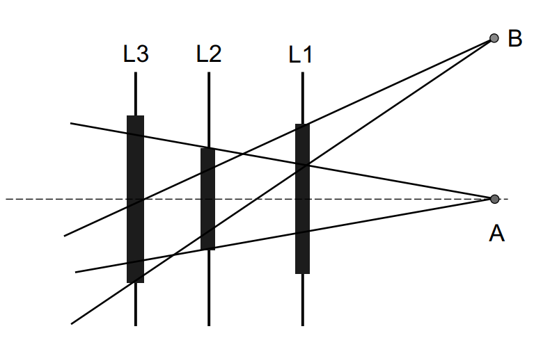
<figcaption style="margin-top: 0.5em; text-align: center;"><em>Çoklu mercek sistemlerinde eğik ışınların mekanik olarak engellenmesini gösteren ışık kesilme şeması.</em></figcaption>

</figure>

<figure style="display:flex; justify-content: center;">

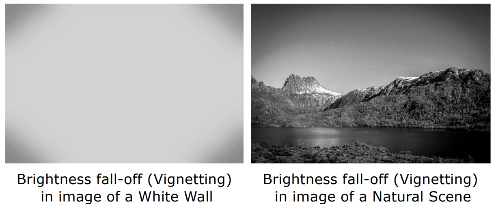
<figcaption style="margin-top: 0.5em; text-align: center;"><em>Düz beyaz bir yüzeyde ve doğal bir manzarada oluşan kenar kararması (vignetting) etkisi.</em></figcaption>

</figure>

### 1.2 Kromatik Aberasyon

Camın kırılma indisi, ışığın dalga boyuna ($\lambda$) bağlıdır. Görünür ışık spektrumunda (400 nm — 700 nm), **mavi ışık (400 nm) kırmızı ışıktan (700 nm) daha fazla bükülür**. Bu, farklı renklerin farklı düzlemlerde odaklanmasına ve nesne kenarlarında renk saçaklanmalarına yol açar.

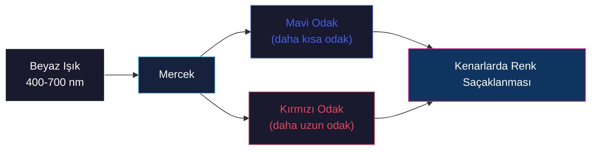

<figure style="display:flex; justify-content: center;">

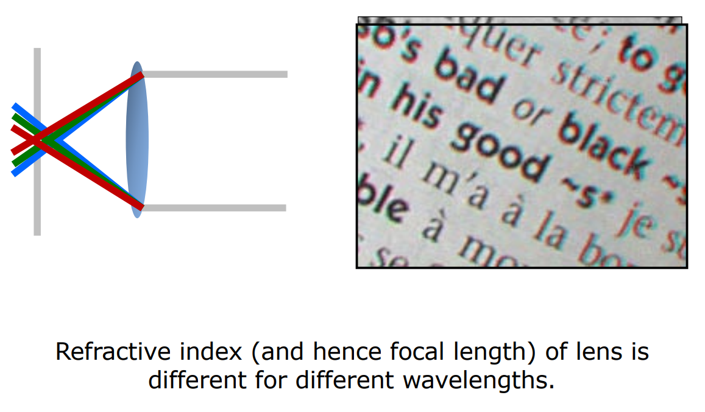
<figcaption style="margin-top: 0.5em; text-align: center;"><em>Farklı dalga boylarının mercekte farklı bükülmesi sonucu oluşan renk sapması ve kenar saçılması.</em></figcaption>

</figure>

### 1.3 Geometrik Distorsiyonlar

**Radyal distorsiyon** (fıçı/barrel distorsiyonu) görüntüyü dışa doğru şişirir. Bu etkiler, bilgisayarlı görü yazılımlarıyla tersine eşleme yapılarak düzeltilebilir — distorsiyon parametrelerini modelleyen ve tersini alan bir kalibrasyon süreci.

| Distorsiyon Türü | Etki | Görünüm |
|------------------|------|---------|
| **Fıçı (Barrel)** | Çizgiler merkezden dışa doğru eğilir | 👁️ Geniş açı görünümü |
| **İğne Yastığı (Pincushion)** | Çizgiler merkeze doğru içe eğilir | 🔍 Telefoto görünümü |

> **Önemli Çıkarım:** Distorsiyon deterministiktir ve düzeltilebilir — lens modelini bilmek hassas geometrik düzeltme sağlar.

<figure style="display:flex; justify-content: center;">

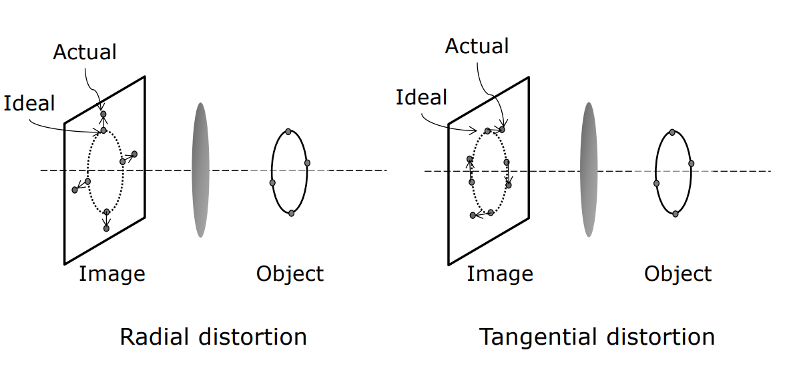
<figcaption style="margin-top: 0.5em; text-align: center;"><em>Lens kusurlarından kaynaklanan radyal (fıçı/iğne yastığı) ve teğetsel geometrik bozulma şeması.</em></figcaption>

</figure>

<figure style="display:flex; justify-content: center;">

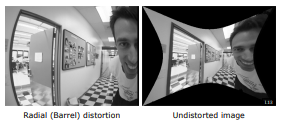
<figcaption style="margin-top: 0.5em; text-align: center;"><em>Fıçı bozulmasına uğramış bir koridor fotoğrafının yazılımsal düzeltme (rectification) öncesi ve sonrası.</em></figcaption>

</figure>

## 2. Geniş Açılı ve Katadioptrik Görüntüleme Sistemleri

Bu sistemler, standart perspektif izdüşümün sınırlarını aşmak için tasarlanmıştır ve özellikle güvenlik ile robotik alanında stratejik öneme sahiptir.

### 2.1 Balıkgözü (Fisheye) Mercekler

Balıkgözü mercekler, menisküs mercekler kullanarak aşırı ışık bükülmesi sağlar. **Tek bakış noktası (single viewpoint)** kısıtlaması, yazılımsal düzeltme için kritiktir — tüm ışınların tek bir optik merkezde buluşması, görüntünün matematiksel olarak açılabilmesi için gereklidir.

<figure style="display:flex; justify-content: center;">

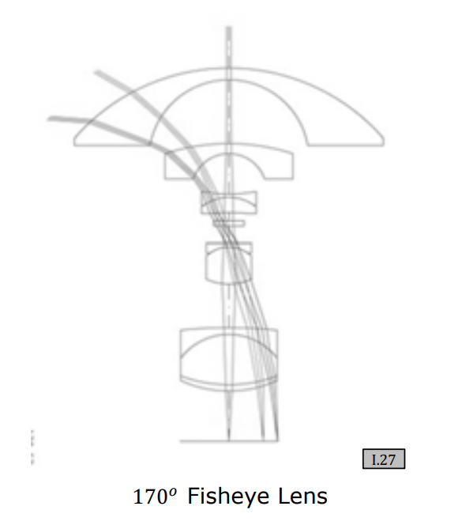
<figcaption style="margin-top: 0.5em; text-align: center;"><em>Işığı ekstrem şekilde bükmek için menisküs elemanları kullanan balıkgözü lens tasarımı.</em></figcaption>

</figure>

<figure style="display:flex; justify-content: center;">

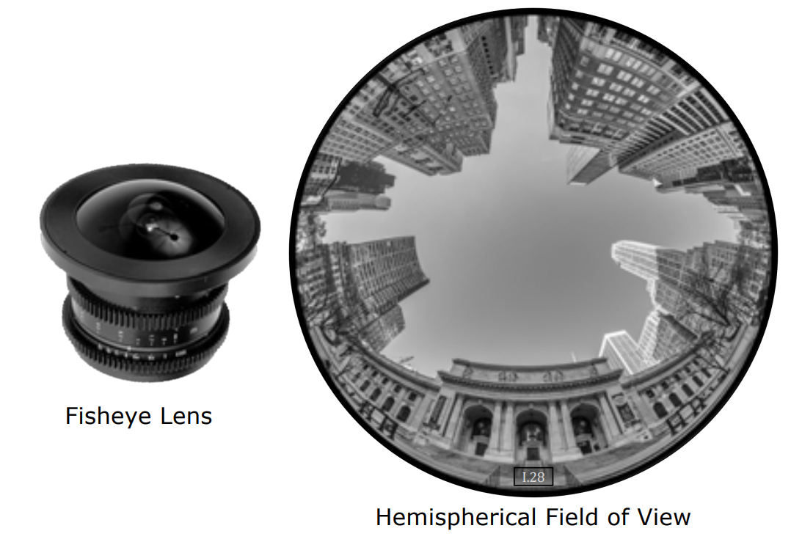
<figcaption style="margin-top: 0.5em; text-align: center;"><em>Balıkgözü lensi ve onunla yakalanan 180 derecelik dairesel yarımküre görüntüsü.</em></figcaption>

</figure>

### 2.2 Katadioptrik Sistemler

Katadioptrik sistemler, aynalar (katoptrik) ve mercekleri (dioptrik) birleştirir:

| Tür | Ayna Şekli | Kullanım Alanı |
|-----|------------|----------------|
| **Teleskop** | Parabolik | Paralel ışınları tek noktada toplar |
| **Çok Yönlü (Omnidirectional)** | Hiperbolik (dışbükey) | 360° panoramik görüntü, güvenlik gözetimi |

<figure style="display:flex; justify-content: center;">

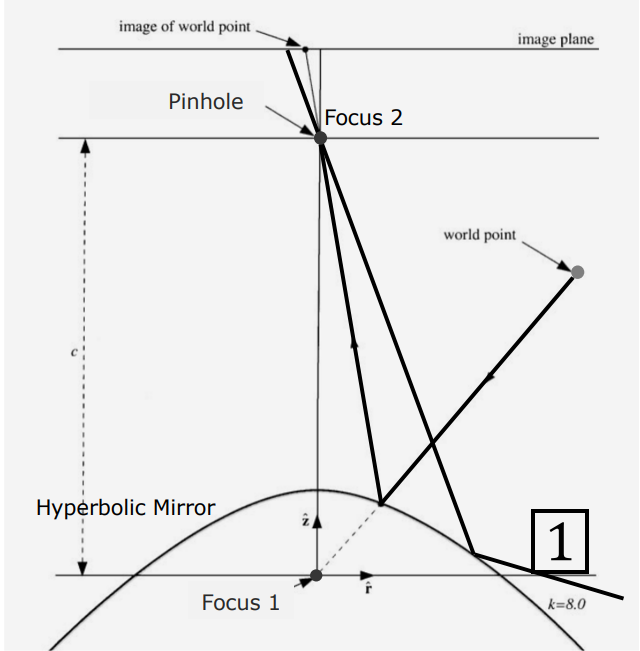
<figcaption style="margin-top: 0.5em; text-align: center;"><em>Hiperbolik aynadan yansıyan ışınların sanal odakta toplanmasını gösteren ışın izleme diyagramı.</em></figcaption>

</figure>

<figure style="display:flex; justify-content: center;">

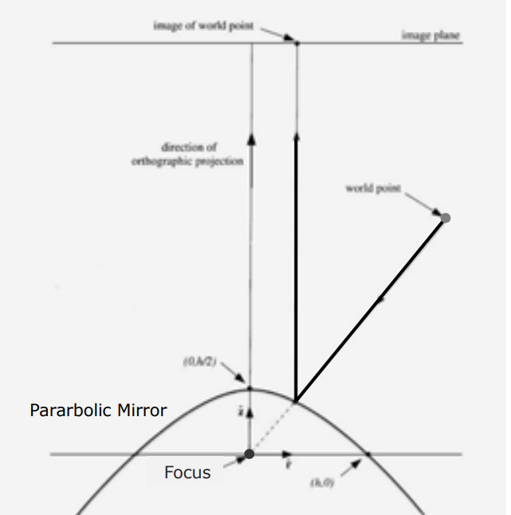
<figcaption style="margin-top: 0.5em; text-align: center;"><em>Parabolik ayna kullanarak paralel ışınların ortografik projeksiyonla yakalanma şeması.</em></figcaption>

</figure>

<figure style="display:flex; justify-content: center;">

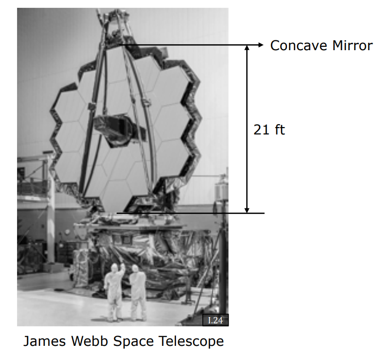
<figcaption style="margin-top: 0.5em; text-align: center;"><em>James Webb Uzay Teleskobu'nun devasa dairesel çukur (concave) ayna sistemi.</em></figcaption>

</figure>

### 2.3 Kornea Yansıması (Corneal Imaging)

İnsan gözünün korneası dışbükey bir ayna gibi davranır. **Limbus tespiti** ve korneal yansıma analizi ile bir kişinin o an neye baktığı (retinal görüntü), dışarıdan çekilen yüksek çözünürlüklü bir fotoğrafla analiz edilebilir.

<figure style="display:flex; justify-content: center;">

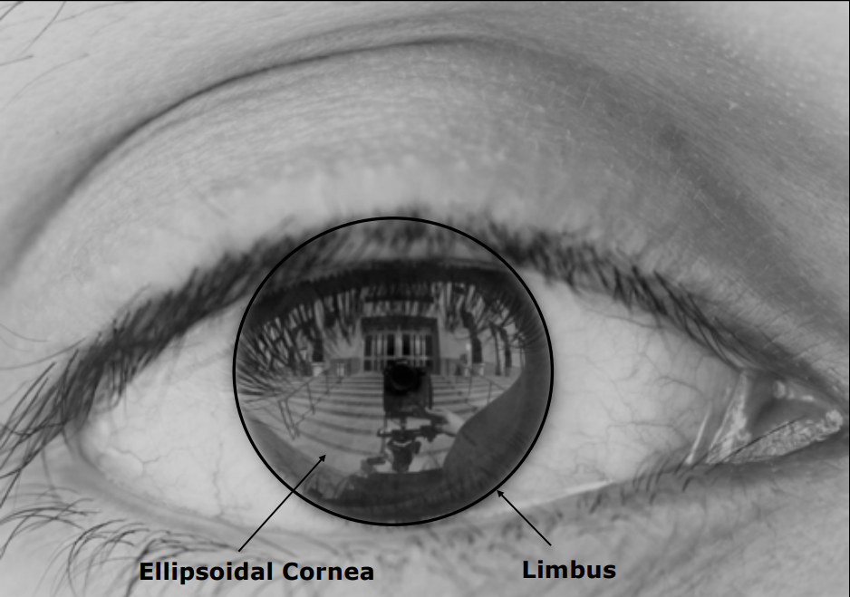
<figcaption style="margin-top: 0.5em; text-align: center;"><em>Gözün konumu ve yönünü saptamak için korneadaki limbus sınırının eliptik tespiti.</em></figcaption>

</figure>

<figure style="display:flex; justify-content: center;">

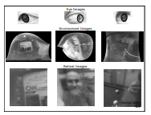
<figcaption style="margin-top: 0.5em; text-align: center;"><em>Kornea yansımasından çevre görüntüsünün çıkarılması ve retinal fovea görüntüsünün tahmini.</em></figcaption>

</figure>

## 3. Biyolojik Göz Tasarımları ve Evrim

Doğadaki gözler, görüntü oluşum prensiplerinin evrimsel mükemmelliğini temsil eder. Nilsson tarafından yapılan simülasyon, ışığa duyarlı düz bir epitelyum dokusunun sadece **400.000 nesil** içinde karmaşık bir göze dönüşebileceğini göstermiştir.

### 3.1 Evrimsel Süreç

<figure style="display:flex; justify-content: center;">

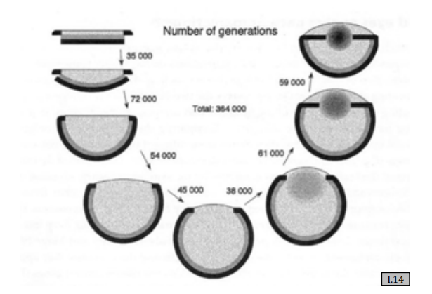
<figcaption style="margin-top: 0.5em; text-align: center;"><em>Nilsson-Pelger modeline göre düz bir dokudan kameramsı gözün evrimleşmesini gösteren simülasyon.</em></figcaption>

</figure>

### 3.2 Karşılaştırmalı Biyoloji

| Tür | Göz Türü | Temel Özellik |
|-----|---------|---------------|
| **Trilobitler** (400M yıl önce) | Bileşik göz | Binlerce kalsit kristal mercek |
| **İnsan** | Tek mercekli göz | Korneanın bükme gücü + kristalin mercek akomodasyonu |
| **Tarak (Scallop)** | Çoklu aynalı gözler | İçbükey parabolik aynalar (James Webb Teleskobu ile aynı prensip) |

> **İlginç Bilgi:** Trilobit gözleri mercek malzemesi olarak kalsit kullanıyordu — yaşla yumuşamayan bir mineral. Bu sayede trilobitler ömürleri boyunca mükemmel görüşe sahipti.

<figure style="display:flex; justify-content: center;">

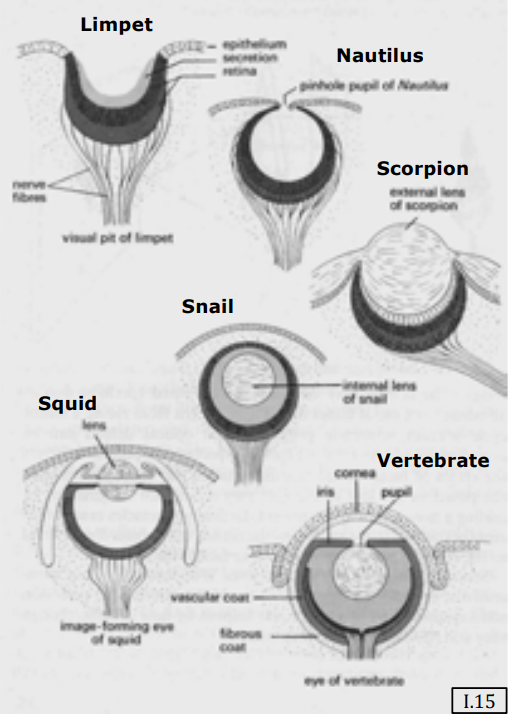
<figcaption style="margin-top: 0.5em; text-align: center;"><em>Doğadaki ilkel göz tasarımlarının (çukur, iğne deliği, küresel lens ve omurgalı) anatomik karşılaştırması.</em></figcaption>

</figure>

<figure style="display:flex; justify-content: center;">

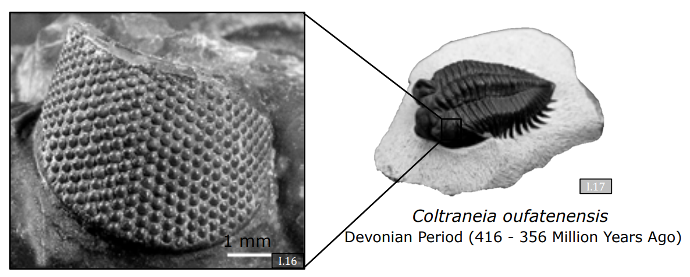
<figcaption style="margin-top: 0.5em; text-align: center;"><em>Kalsit kristal lenslerden oluşan antik trilobit compound (bileşik) gözü fosili.</em></figcaption>

</figure>

<figure style="display:flex; justify-content: center;">

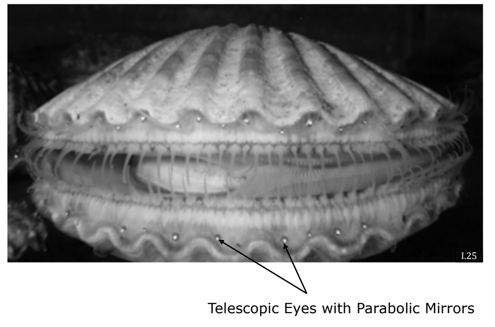
<figcaption style="margin-top: 0.5em; text-align: center;"><em>Kabuğunun kenarında çukur parabolik aynalı teleskopik gözleri olan tarak istiridyesi.</em></figcaption>

</figure>

### 3.3 İnsan Gözü ve Akomodasyon

İnsan gözü iki optik elemanı birleştirir:

1. **Kornea** — Bükme gücünün çoğunu sağlar (hava ve doku arasındaki kırılma indisi farkı).
2. **Kristalin Mercek** — Şekil değiştirerek **akomodasyon** (farklı mesafelere odaklanma) sağlayan sıvı dolu esnek bir mercek.

Yaşla birlikte kristalin mercek sertleşir (presbiyopi):

$$
\text{Minimum Odak Mesafesi} \approx 
\begin{cases}
7 \text{ cm} & \text{10 yaşında} \\
10 \text{ cm} & \text{20 yaşında} \\
50 \text{ cm} & \text{50+ yaşında}
\end{cases}
$$

<figure style="display:flex; justify-content: center;">

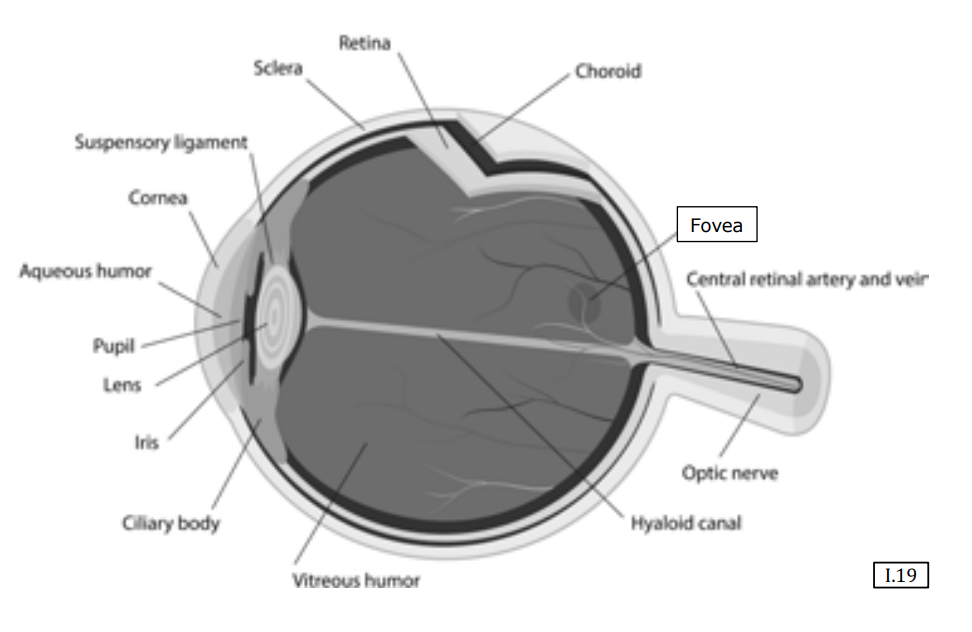
<figcaption style="margin-top: 0.5em; text-align: center;"><em>İnsan gözünün mercek, pupil, fovea ve retina tabakalarını içeren optik anatomisi.</em></figcaption>

</figure>

<figure style="display:flex; justify-content: center;">

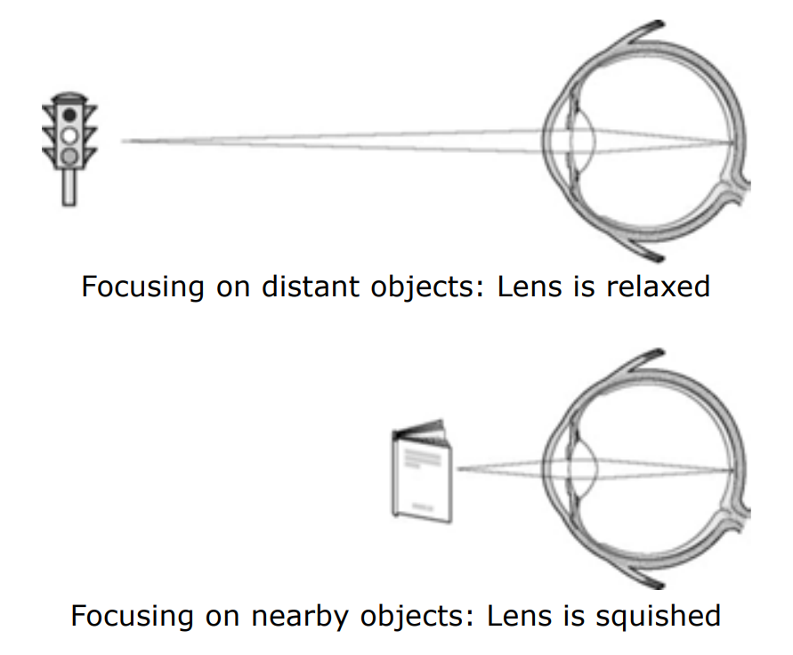
<figcaption style="margin-top: 0.5em; text-align: center;"><em>Göz merceğinin yakına odaklanırken kasılıp şişkinleşmesini, uzağa odaklanırken ise gevşemesini gösteren accommodation şeması.</em></figcaption>

</figure>

<figure style="display:flex; justify-content: center;">

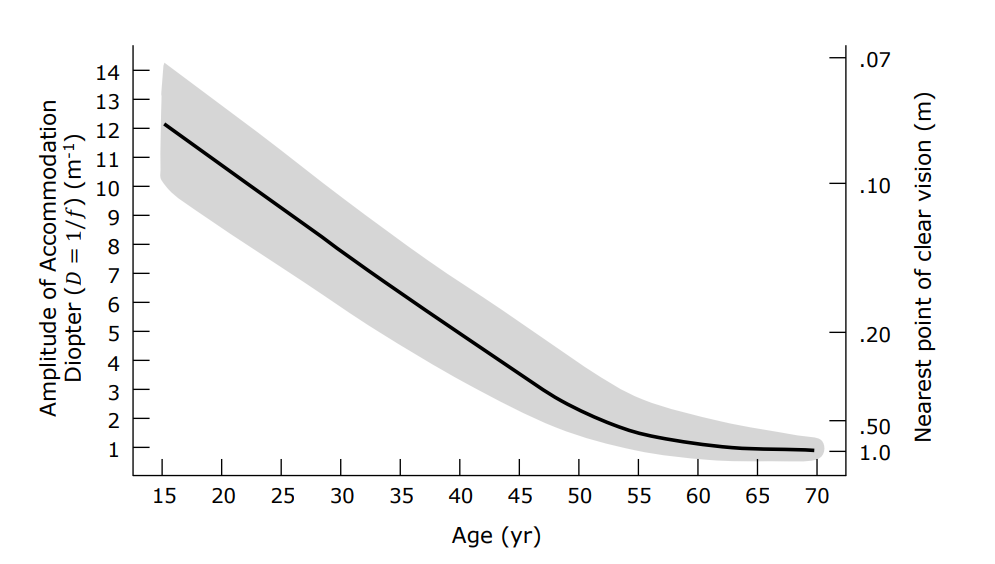
<figcaption style="margin-top: 0.5em; text-align: center;"><em>Yaş ilerledikçe göz merceğinin sertleşmesiyle yakın odak noktasının uzaklaşmasını gösteren grafik.</em></figcaption>

</figure>

<figure style="display:flex; justify-content: center;">

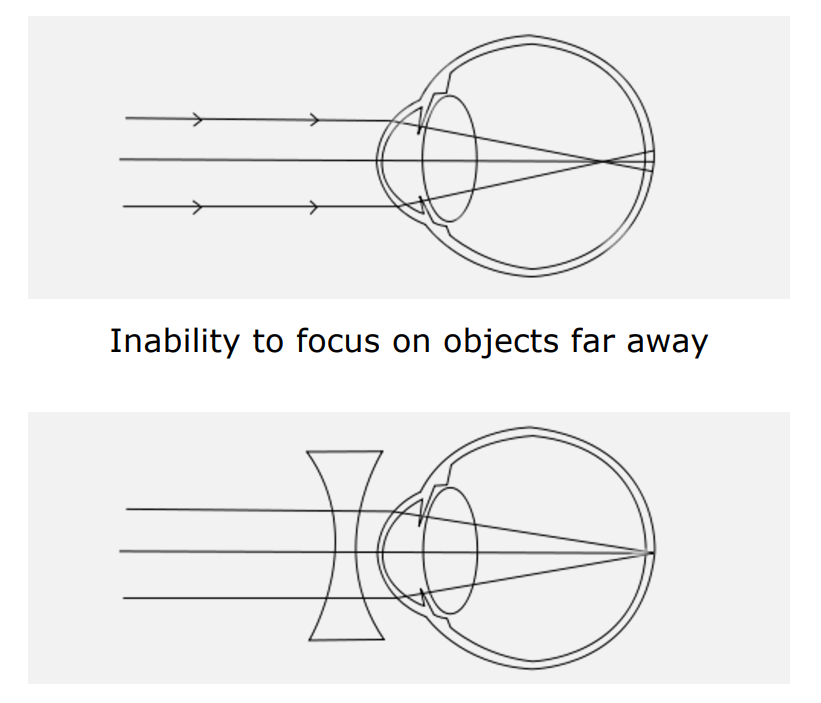
<figcaption style="margin-top: 0.5em; text-align: center;"><em>Miyopi kusurunun (uzak odak yetersizliği) ıraksak (içbükey) bir lensle düzeltilmesi.</em></figcaption>

</figure>

<figure style="display:flex; justify-content: center;">

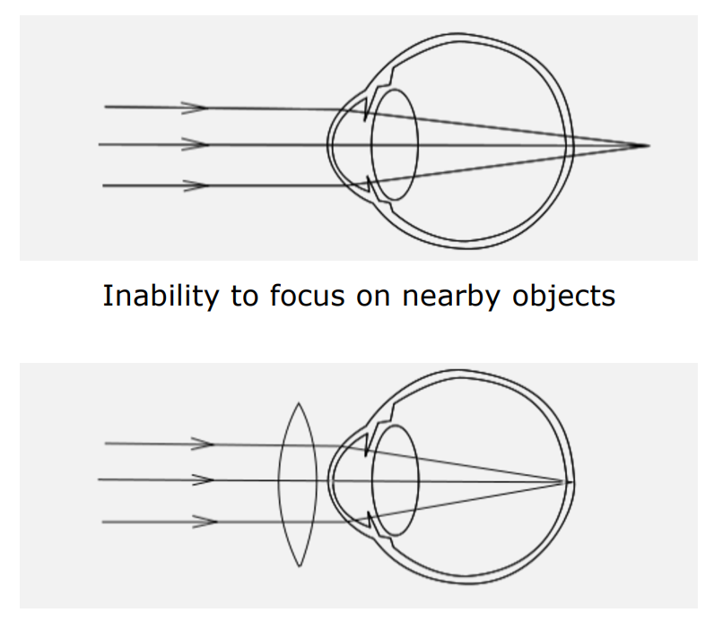
<figcaption style="margin-top: 0.5em; text-align: center;"><em>Hipermetropi kusurunun (yakın odak yetersizliği) yakınsak (dışbükey) bir lensle düzeltilmesi.</em></figcaption>

</figure>

### 3.4 Tarak (Scallop) Gözleri: Doğanın Ayna Teleskopları

Tarakların yüzlerce gözü vardır ve her biri ışığı odaklamak için mercek yerine **içbükey parabolik ayna** kullanır. Bu, James Webb Uzay Teleskobu ile aynı optik prensiptir — biyoloji ve mühendislik arasında dikkat çekici bir yakınsak evrim örneği.

---

## Özet

- **Aberasyonlar** (vinyet, kromatik, distorsiyon) mercek sistemlerinin kaçınılmaz fiziksel etkileridir.
- **Katadioptrik sistemler** özel görüntüleme için ayna ve mercekleri birleştirir (panoramik, teleskop).
- **Kornea görüntüleme**, harici fotoğraflardan bakış yönü tespiti sağlar.
- **Biyolojik gözler** iyi anlaşılmış bir evrimsel yol izler ve çeşitli optik stratejiler sunar — iğne deliği (nautilus), bileşik (trilobit), kırıcı (insan) ve yansıtıcı (tarak).
- İster antik bir trilobit merceği ister modern bir sıvı mercek olsun, görüntü oluşumu, 3B dünyayı 2B düzlemde anlamlandırmanın hem biyolojik hem de teknolojik evrimdeki en merkezi başarısıdır.
