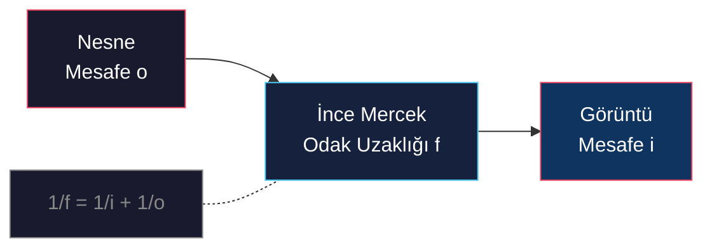
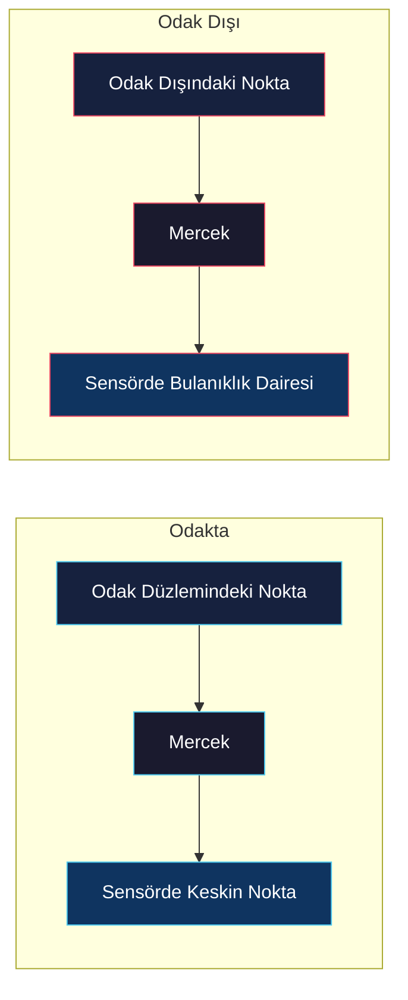

# Mercek Sistemleri ve Alan Derinliği

<!-- toc -->

## 1. Neden Mercek?

İğne deliği kameraları net görüntüler üretir, ancak açıklığın aşırı küçük olması nedeniyle çok az ışık toplar — Flatiron binası örneğinde **12 saniyelik pozlama** gerekmiştir. Mercekler, geniş bir açıklıktan gelen ışığı kırarak tek bir noktada toplar ve parlaklığı artırırken perspektif modelini korur.

> **Temel Ödünleşim:** Mercekler daha fazla ışık toplar ancak sınırlı bir alan derinliği getirir — yalnızca tek bir düzlem mükemmel odaktadır.

## 2. Gaussian Mercek Yasası

İnce bir mercek için nesne mesafesi ($o$), görüntü mesafesi ($i$) ve odak uzaklığı ($f$) arasındaki ilişki **Gaussian Mercek Yasası** ile verilir:

$$
\frac{1}{i} + \frac{1}{o} = \frac{1}{f}
$$

**Sayısal Örnek:** $f = 50$mm odak uzaklığındaki bir mercekle, $o = 300$mm uzaklıktaki bir nesneye odaklanıldığında:

$$
\frac{1}{i} = \frac{1}{50} - \frac{1}{300} = \frac{6 - 1}{300} = \frac{5}{300}
$$

$$
i = 60 \text{ mm}
$$

Görüntü merceğin 60 mm arkasında oluşur.

<figure style="display:flex; justify-content: center;">

<figcaption style="margin-top: 0.5em; text-align: center;"><em>Benzer üçgenler Gaussian Mercek Yasası denklemlerini türetir.</em></figcaption>

</figure>

<figure style="display:flex; justify-content: center;">

<figcaption style="margin-top: 0.5em; text-align: center;"><em>Sokak lambasıyla odak uzaklığı pratikte ölçülür.</em></figcaption>

</figure>

### 2.1 Açıklık ve f-Numarası

Işık toplama kapasitesi diyafram çapı ($D$) ile belirlenir. **f-numarası** ($N$) şu şekilde tanımlanır:

$$
N = \frac{f}{D}
$$

| Açıklık | f-Numarası | Toplanan Işık | Alan Derinliği |
|----------|------------|---------------|----------------|
| Tam açık | Düşük $N$ (ör. $f/1.4$) | Yüksek | Sığ |
| Kısıtlı | Yüksek $N$ (ör. $f/16$) | Düşük | Derin |

<figure style="display:flex; justify-content: center;">

<figcaption style="margin-top: 0.5em; text-align: center;"><em>Diyafram bıçakları farklı f-numarası açıklıkları oluşturur.</em></figcaption>

</figure>

### 2.2 Mendil Kutusu (Tissue Box) Deneyi

İlginç ve sezgisel olmayan bir gözlem: **bir merceğin yarısı kapatıldığında görüntü bozulmaz veya odağını kaybetmez.** Sadece sensöre ulaşan ışık miktarı azaldığı için görüntü kararır. Merceğin açık kalan her bir parçası, sahnenin tamamını odak düzlemine izdüşürmeye devam eder.

> **Neden?** Mercek üzerindeki her nokta, görüş alanı içindeki tüm sahne noktalarından ışık alır. Merceğin bir kısmını engellemek ışın sayısını azaltır ama geometrik yollarını değiştirmez — tüm sahne yine izdüşürülür, sadece daha karanlık olur.

<figure style="display:flex; justify-content: center;">

<figcaption style="margin-top: 0.5em; text-align: center;"><em>Mendil kutusu kamerası mercek prensibini gösterir.</em></figcaption>

</figure>

<figure style="display:flex; justify-content: center;">

<figcaption style="margin-top: 0.5em; text-align: center;"><em>Merceğin yarısını kapatmak görüntüyü sadece karartır.</em></figcaption>

</figure>

### 2.3 Zoom

Zoom işlemi, çoklu mercek sistemlerinde mercekleri hareket ettirerek magnifikasyonu değiştirme sürecidir. Fiziksel olarak lens değiştirmeden etkin odak uzaklığını değiştirir.

<figure style="display:flex; justify-content: center;">

<figcaption style="margin-top: 0.5em; text-align: center;"><em>İki mercekli sistem zoom için elemanları hareket ettirir.</em></figcaption>

</figure>

## 3. Odak Dışı Bulanıklık (Defocus) ve Alan Derinliği (DoF)

Bir mercek sistemi, belirli bir sensör konumunda yalnızca tek bir **odak düzlemini** mükemmel odaklar. Bu düzlemin dışındaki noktalar, görüntü düzleminde bir **bulanıklık dairesi** (blur circle) oluşturur.

<figure style="display:flex; justify-content: center;">

<figcaption style="margin-top: 0.5em; text-align: center;"><em>Alan derinliği pratikte diyaframla değişir.</em></figcaption>

</figure>

### 3.1 Bulanıklık Dairesi

Benzer üçgenler kullanılarak, bulanıklık dairesi çapının ($b$) açıklık çapı ($D$) ile ilişkisi şu şekilde türetilir:

$$
\frac{b}{D} = \frac{|i' - i|}{i'}
$$

Burada $i'$ odak dışı noktanın görüntü mesafesi, $i$ ise sensörün bulunduğu mesafedir.

Bu denklem, bulanıklık dairesi çapının **açıklık çapıyla doğru orantılı** olduğunu kanıtlar — geniş açıklıklar daha fazla odak dışı bulanıklık üretir.

### 3.2 Alan Derinliği (Depth of Field)

**Alan Derinliği (DoF)**, bulanıklık dairesi çapının piksel boyutundan ($C$) küçük kaldığı derinlik aralığıdır. $b < C$ ise görüntü "net" algılanır.

$$
\text{DoF} \propto \frac{N \cdot C \cdot o^2}{f^2}
$$

<figure style="display:flex; justify-content: center;">

<figcaption style="margin-top: 0.5em; text-align: center;"><em>Alan derinliği sınırları bulanıklığı piksel altında tutar.</em></figcaption>

</figure>

### 3.3 Hiper Odak Uzaklığı (Hyperfocal Distance)

**Hiper odak uzaklığı** ($H$), merceğin öyle bir mesafeye odaklanmasıdır ki, o noktadan sonsuza kadar her yer kabul edilebilir netlikte kalır:

$$
H = \frac{f^2}{N \cdot C} + f
$$

Akıllı telefon kameraları bu parametreyi stratejik olarak kullanır — küçük sensörleri ve kısa odak uzaklıkları çok büyük bir hiper odak mesafesi üretir, böylece aktif odaklama olmadan neredeyse her şey nettir.

<figure style="display:flex; justify-content: center;">

<figcaption style="margin-top: 0.5em; text-align: center;"><em>Hiper odak mesafesi H'den sonsuza netlik sağlar.</em></figcaption>

</figure>

### 3.4 Kritik Ödünleşim

| Senaryo | Açıklık | Işık | Poz Süresi | Alan Derinliği |
|----------|---------|------|------------|----------------|
| Parlak, sığ DoF | Geniş ($N$ düşük) | Yüksek | Kısa | Sığ |
| Karanlık, derin DoF | Dar ($N$ yüksek) | Düşük | Uzun | Derin |

<figure style="display:flex; justify-content: center;">

<figcaption style="margin-top: 0.5em; text-align: center;"><em>Geniş diyafram daha çok bulanıklık ama daha çok ışık.</em></figcaption>

</figure>

Optik tasarımda **bedava öğle yemeği yoktur** — her kazanç başka bir boyutta maliyet getirir.

---

## Özet

- **Mercekler** ışık toplamayı artırır ancak sınırlı alan derinliği getirir.
- **Gaussian Mercek Yasası**: $1/i + 1/o = 1/f$ ince mercek davranışını tanımlar.
- **f-Numarası** $N = f/D$ açıklık boyutunu ölçer ve ışık ile DoF'yi doğrudan etkiler.
- **Bulanıklık dairesi** $b/D = |i' - i|/i'$ odak dışının açıklıkla orantılı olduğunu kanıtlar.
- **Hiper odak uzaklığı** $H = f^2/(N \cdot C) + f$ stratejik odak optimizasyonu sağlar.
- Açıklık ödünleşimi (ışık vs. DoF) temel ve kaçınılmazdır.
