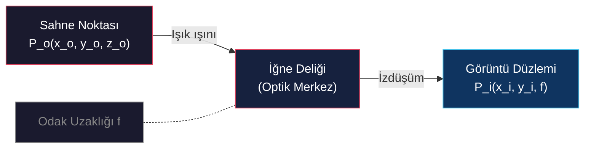

# İğne Deliği Kamera Modeli ve Perspektif İzdüşüm

<!-- toc -->

## 1. Görüntü Oluşumuna Giriş

Görüntü oluşumu, üç boyutlu (3D) bir sahnenin fiziksel özelliklerinin iki boyutlu (2D) bir düzleme aktarılması sürecidir. Bu süreç, bilgisayarlı görünün temelini oluşturur ve sahne noktalarının görüntüdeki konumu ile bu noktaların parlaklık değerleri arasındaki ilişkiyi tanımlar. Süreci tam olarak kavramak için geometrik ve fotometrik etkileşimleri birbirinden ayırmak esastır:

- **Geometrik İlişkiler** — Sahnedeki bir noktanın, izdüşüm düzlemi üzerindeki koordinatlarını (nereye düşeceğini) belirler.
- **Fotometrik İlişkiler** — Sahnedeki bir noktanın materyal özelliklerine ve aydınlatma koşullarına bağlı olarak, görüntüde hangi yoğunlukta (parlaklıkta) görüneceğini tanımlar.

Teorik olarak, bir sahnenin önüne yerleştirilen basit bir sensör veya ekran net bir görüntü oluşturamaz. Bunun temel nedeni, sensör üzerindeki her bir noktanın, sahnedeki birçok farklı noktadan gelen ve bir **koni** şeklinde yayılan ışık ışınlarını kabul etmesidir. Işık ışınlarının bu "karışma" (muddled) durumu, her noktanın sahnenin ortalama aydınlığını almasına ve dolayısıyla net bir görsel yapı yerine bulanık bir ışık birikintisi oluşmasına neden olur.

> **Önemli Çıkarım:** Kısıtlayıcı bir açıklık olmadan, her sensör noktası sahnenin bir konisinden gelen ışığı bütünleştirir — görüntü değil, bulanıklık üretir.

## 2. İğne Deliği (Pinhole) Kamera Modeli

İğne deliği kamera modeli, ışık ışınlarını tek bir noktadan geçmeye zorlayarak "karışık" (muddled) görüntüyü engellemenin en basit yoludur. Bu model, bilgisayarlı görüdeki en kritik konsept olan **perspektif izdüşüm** denklemlerinin temelini oluşturur.

### 2.1 Perspektif İzdüşüm Denklemleri

İğne deliği modelinde, optik merkez (iğne deliği) orijin kabul edilir ve $z$-ekseni görüntü düzlemine dik olan **optik eksen** üzerine yerleştirilir. İğne deliği ile görüntü düzlemi arasındaki mesafeye **etkin odak uzaklığı** ($f$) denir. Benzer üçgenler prensibi kullanılarak, sahnedeki bir $P_o(x_o, y_o, z_o)$ noktasının görüntüdeki $P_i(x_i, y_i, f)$ izdüşümü şu denklemlerle ifade edilir:

$$
\frac{x_i}{f} = \frac{x_o}{z_o} \quad \text{ve} \quad \frac{y_i}{f} = \frac{y_o}{z_o}
$$

Bu denklemler matematiksel olarak şunları kanıtlar:
1. Görüntü her zaman **ters (inverted)** oluşur.
2. Nesnelerin büyüklüğü **derinlikle ($z_o$) ters orantılıdır**.

$$
x_i = f \\frac{x_o}{z_o}, \\qquad y_i = f \\frac{y_o}{z_o}
$$

<figure style="display:flex; justify-content: center;">

<figcaption style="margin-top: 0.5em; text-align: center;"><em>Benzer üçgenler iğne deliği izdüşüm denklemlerini verir.</em></figcaption>

</figure>

### 2.2 Tarihsel Dönüm Noktaları

<figure style="display:flex; justify-content: center;">

<figcaption style="margin-top: 0.5em; text-align: center;"><em>Camera obscura ters çevrilmiş görüntüyü küçük bir açıklıktan yansıtır.</em></figcaption>

</figure>

### 2.3 Doğal İğne Deliği: Nautilus Gözü

*Nautilus pompilius*, doğada iğne deliği görüntülemenin dikkat çekici bir örneğidir. Çoğu kafadanbacaklıdan farklı olarak, nautilus merceksiz bir göz geliştirmiştir ve bu göz tıpkı bir iğne deliği kamerası gibi çalışır. Küçük açıklık, sonsuz alan derinliği ile keskin bir görüntü üretir, ancak bunun bedeli ışık hassasiyetidir — optik tasarım boyunca karşımıza çıkan temel bir ödünleşim.

## 3. Magnifikasyon, Kaybolan Noktalar ve Görsel Yansımalar

Görüntüdeki geometrik değişimler, perspektif izdüşümün doğrudan sonuçlarıdır. Bunlar, derinlik algımızı ve 3B sahnelerin 2B düzlemdeki temsilini şekillendirir.

### 3.1 Görüntü Magnifikasyonu

Magnifikasyon, görüntüdeki boyutun sahnedeki boyuta oranıdır:

$$
|m| = \frac{f}{z_o}
$$

Magnifikasyonun derinlik ($z_o$) ile ters orantılı olması şu nedenleri açıklar:
- **Demiryolu rayları** ufukta birleşiyormuş gibi görünür.
- **Özçekimlerde (selfie)** burun kulaklara oranla çok daha büyük görünür — burnun $z_o$ değeri daha küçüktür, bu doğal bir distorsiyon yaratır.

<figure style="display:flex; justify-content: center;">

<figcaption style="margin-top: 0.5em; text-align: center;"><em>Yakın nesneler perspektifte uzaktakilerden daha büyük görünür.</em></figcaption>

</figure>

### 3.2 Kaybolan Noktalar (Vanishing Points)

3B uzayda birbirine paralel olan tüm çizgiler, 2B düzlemde tek bir noktada birleşir.

<figure style="display:flex; justify-content: center;">

<figcaption style="margin-top: 0.5em; text-align: center;"><em>Paralel çizgiler tek bir kaybolan noktada birleşir.</em></figcaption>

</figure>

Bu noktayı bulmak için, iğne deliğinden geçen ve bu paralel çizgilere ($L_x, L_y, L_z$ yönünde) paralel olan bir ışın kurgulanır. Bu ışının görüntü düzlemini deldiği koordinatlar:

$$
x_{vp} = f \\cdot \\frac{L_x}{L_z}, \\qquad y_{vp} = f \\cdot \\frac{L_y}{L_z}
$$

<figure style="display:flex; justify-content: center;">

<figcaption style="margin-top: 0.5em; text-align: center;"><em>İğne deliğinden geçen paralel ışın kaybolan noktayı bulur.</em></figcaption>

</figure>

### 3.3 Sanatsal ve Mimari Uygulamalar

| Sanatçı/Mimar | Eser | Teknik |
|---------------|------|--------|
| **Vermeer** | "The Music Lesson" | Kaybolan noktayı tam olarak öğrencinin dirseğine yerleştirerek dikkati piyano çalmaya yönlendirir |
| **Borromini** | "Galleria Spada" | Kolonları küçülterek ve tavanı alçaltarak yanıltıcı perspektif — 30 metrelik koridor 150 metre gibi görünür |

<figure style="display:flex; justify-content: center;">

<figcaption style="margin-top: 0.5em; text-align: center;"><em>Vermeer'in kaybolan noktası izleyicinin dikkatini yönlendirir.</em></figcaption>

</figure>

<figure style="display:flex; justify-content: center;">

<figcaption style="margin-top: 0.5em; text-align: center;"><em>Borromini'nin zorlanmış perspektifi gözü yanıltır.</em></figcaption>

</figure>

> **Önemli Çıkarım:** Perspektif izdüşüm yalnızca matematiksel bir kısıtlama değil, aynı zamanda görsel hikaye anlatımı için bir araçtır — bilgisayarlı görü onu formüle etmeden çok önce sanatçılar tarafından kullanılmıştır.

## 4. İdeal İğne Deliği Boyutu

İğne deliği modeli keskin görüntüler üretse de, açıklık boyutu kritik bir ödünleşim getirir: daha küçük bir iğne deliği bulanıklığı azaltır ancak ışık miktarını da azaltır, daha büyük bir iğne deliği ise daha fazla ışık toplar ancak görüntü bulanıklığını artırır. Bu temel sınırlama, iğne deliğinden mercek tabanlı görüntüleme sistemlerine geçişi motive eder.

<figure style="display:flex; justify-content: center;">

<figcaption style="margin-top: 0.5em; text-align: center;"><em>Optimum iğne deliği boyutu bulanıklık ve kırınımı dengeler.</em></figcaption>

</figure>

---

## Özet

- Görüntü oluşumu, ışık konisi problemini önlemek için bir açıklıktan ışınların kısıtlanmasını gerektirir.
- İğne deliği kamera modeli, benzer üçgenlerle yönetilen **perspektif izdüşüm** üretir: $x_i/f = x_o/z_o$.
- Magnifikasyon derinlikle ters orantılıdır: uzaktaki nesneler daha küçük görünür.
- Kaybolan noktalar, 3B'de paralel olan çizgilerin 2B izdüşümde birleştiği noktalardır.
- İğne deliğinin temel sınırlaması **ışık toplama kapasitesidir** — bu bizi mercek kullanımına yönlendirir.
