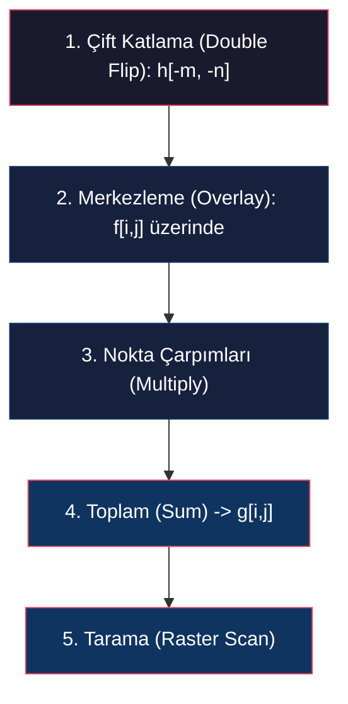
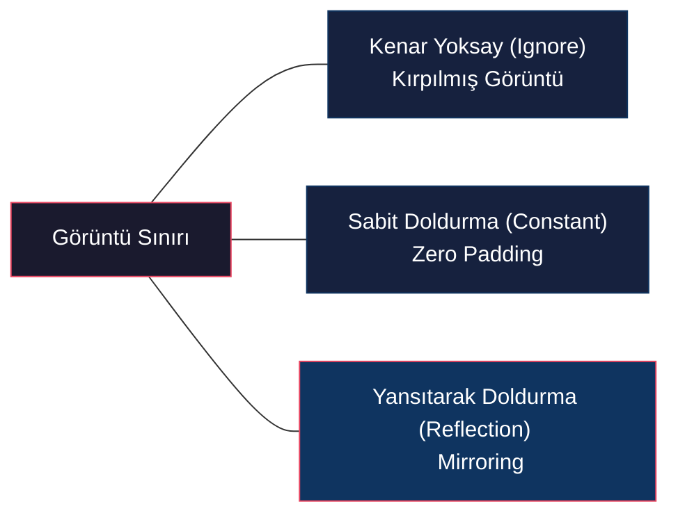
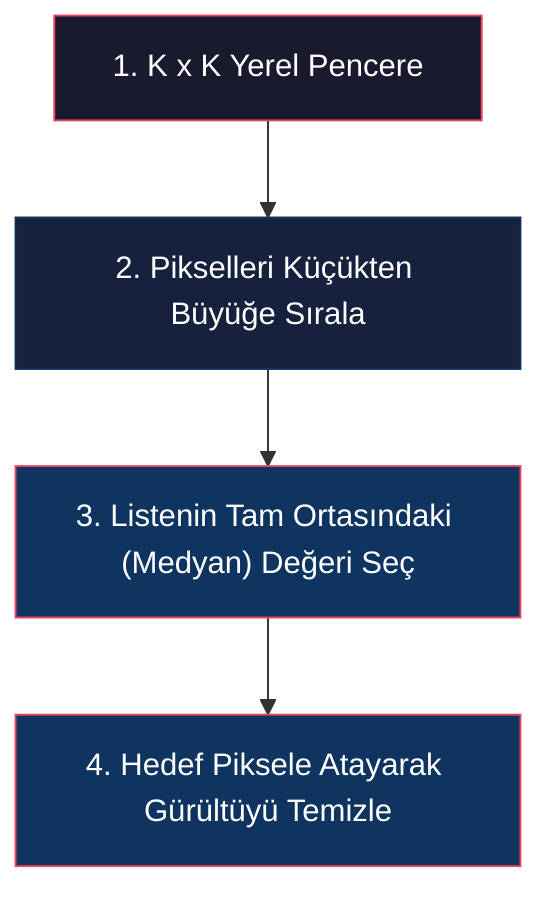
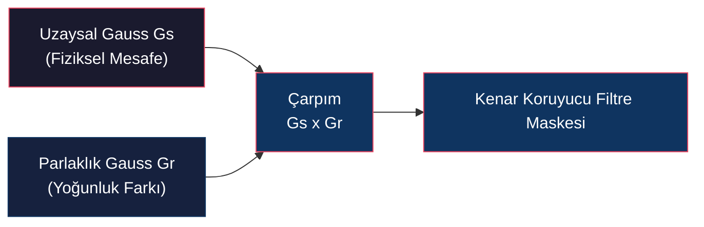

# Doğrusal ve Doğrusal Olmayan Görüntü Filtreleri

<!-- toc -->

## 1. Ayrık 2D Konvolüsyon (Discrete 2D Convolution)

Gerçek dünyada bilgisayarlı görü sistemleri sürekli fonksiyonlarla değil, ayrık piksel ızgaralarından oluşan dijital matrislerle çalışır. $M \times N$ boyutunda bir $f[i,j]$ görüntüsü ile $h[i,j]$ maskesinin (*mask/kernel/filter*) ayrık 2D konvolüsyonu matematiksel olarak şu şekilde tanımlanır:

$$g[i,j] = f[i,j] * h[i,j] = \sum_{m} \sum_{n} f[m,n] \, h[i - m, j - n]$$

<figure style="display:flex; justify-content: center; margin: 20px 0;">
  

    
    <figcaption style="margin-top: 0.5em; text-align: center; font-size: 13px; color: #888;"><em>Ayrık 2D konvolüsyon denklemi, maske tanımı ve f, h, g matrisleri</em></figcaption>
  

</figure>

Burada $i$ satır (*row*) numarasını, $j$ ise sütun (*column*) numarasını temsil eder.

### 1.1 Ayrık Konvolüsyonun Çalışma Mekanizması

Konvolüsyon işlemini yazılımsal veya görsel olarak gerçekleştirmek için 5 adım izlenir:

1. **Çift Katlama (Double Flip):** Maske ($h$) hem yatay eksende ($m$) hem de dikey eksende ($n$) ters çevrilerek $h[-m, -n]$ elde edilir.
2. **Merkezleme (Overlay):** Katlanmış maskenin geometrik merkezi, çıktı değeri hesaplanacak hedef piksel $[i,j]$ üzerine yerleştirilir.
3. **Nokta Çarpımları (Multiply):** Maske hücrelerindeki ağırlıklar ile çakışan piksel yoğunluk değerleri karşılıklı olarak çarpılır.
4. **Toplam (Sum):** Elde edilen tüm çarpım sonuçları toplanır ve çıktı görüntüsünün $g[i,j]$ konumuna yazılır.
5. **Tarama (Raster Scan):** Bu işlem, maske tüm görüntü üzerinde soldan sağa ve yukarıdan aşağıya kaydırılarak (*slide*) her piksel için tekrarlanır.

---

## 2. Kenar Sınır Problemleri (Border Problems)

<figure style="display:flex; justify-content: center; margin: 20px 0;">
  

    
    <figcaption style="margin-top: 0.5em; text-align: center; font-size: 13px; color: #888;"><em>Filtre maskesinin görüntü sınırları dışına taşması durumunda ortaya çıkan kenar problemi</em></figcaption>
  

</figure>

Bir filtre maskesi görüntünün kenar piksellerine yerleştirildiğinde, maskenin bir kısmı görüntünün sınırlarının dışına taşar. Dışarı taşan bölgede piksel verisi bulunmadığı için doğrudan konvolüsyon çarpımı yapılamaz.

Bu sorunu çözmek için pratikte üç temel yöntem kullanılır:

### 2.1 Kenarları Yoksaymak (Ignore Border)
Maske sadece tamamen görüntünün sınırları içerisinde kalabildiği pikseller üzerinde çalıştırılır. Çıktı görüntüsü kenarlardan maske yarıçapı kadar kırpılır; dolayısıyla çıktı görüntüsü orijinal görüntüden daha küçük olur.

### 2.2 Sabit Değerle Doldurmak (Constant / Zero Padding)
Görüntünün dışı sabit bir parlaklık değeriyle (genellikle $0$ / siyah veya tüm görüntünün ortalama parlaklık değeriyle) doldurulur.

### 2.3 Yansıtarak Doldurmak (Reflection Padding)
Sınır pikselleri dışarıya doğru ayna simetrisiyle yansıtılır. Bu yöntem kenar geçişlerinde en doğal sonucu verir ve yapay sınır hatlarının (*boundary artifacts*) oluşmasını engeller.

---

## 3. Klasik Doğrusal Filtre Tipleri

### 3.1 Birim Darbe Filtresi (Impulse Filter)
Merkezinde 1, diğer tüm elemanlarında 0 olan bir maske görüntüyü değiştirmeden aynen çıktıya aktarır. Süzme (*sifting*) özelliğinden dolayı çıktı girdiyle aynıdır:

$$g[i,j] = f[i,j] * \delta[i,j] = f[i,j]$$

<figure style="display:flex; justify-content: center; margin: 20px 0;">
  

    
    <figcaption style="margin-top: 0.5em; text-align: center; font-size: 13px; color: #888;"><em>Birim darbe filtresi (Impulse Filter) konvolüsyonu sonucunda değişmeyen görüntü</em></figcaption>
  

</figure>

### 3.2 Görüntü Kaydırma Filtresi (Shift Filter)
Eğer birim darbe filtrenin sağ alt köşesine yerleştirilirse, konvolüsyonun çift katlama (*double flip*) doğası gereği darbe sol üste geçer. Bu filtre görüntüyü 1 piksel aşağı ve sağa kaydırır:

$$h = \begin{bmatrix} 0 & 0 & 0 \\ 0 & 0 & 0 \\ 0 & 0 & 1 \end{bmatrix} \implies g[i,j] = f[i-1, j-1]$$

<figure style="display:flex; justify-content: center; margin: 20px 0;">
  

    
    <figcaption style="margin-top: 0.5em; text-align: center; font-size: 13px; color: #888;"><em>Ötelenmiş darbe filtresi (Shift Filter) ile görüntünün uzamsal olarak kaydırılması</em></figcaption>
  

</figure>

### 3.3 Kutu Filtresi (Box / Averaging Filter)
Pikselleri yerel komşuluğunda pürüzsüzleştirmek (*blur*) için kullanılır. Örneğin $5 \times 5$ boyutunda, her hücresinde 1 olan unnormalize bir kutu filtresi ele alınsın:

$$h_{\text{unnorm}} = \begin{bmatrix} 1 & 1 & 1 & 1 & 1 \\ \vdots & & \ddots & & \vdots \\ 1 & 1 & 1 & 1 & 1 \end{bmatrix}$$

> **Warning: Doygunluk Hatası (Saturation) ve Normalizasyon**  
> Bu maske unnormalize olarak uygulandığında çıktı pikselleri 25 kat daha parlak hale gelir ve dinamik aralığı (255) aşarak tamamen beyaza doyup (*saturation*) kilitlenir.  

<figure style="display:flex; justify-content: center; margin: 20px 0;">
  

    
    <figcaption style="margin-top: 0.5em; text-align: center; font-size: 13px; color: #888;"><em>Unnormalize 5x5 kutu filtresi sonucunda piksel değerlerinin 255'e kilitlenerek beyaza doyması</em></figcaption>
  

</figure>

> **Çözüm:** Filtrenin tüm ağırlıklarının toplamı tam olarak 1 olmalıdır. Bu nedenle maske elemanları filtre alanına ($25$) bölünür:
>
> $$h_{\text{box}} = \frac{1}{25} \begin{bmatrix} 1 & 1 & 1 & 1 & 1 \\ \vdots & & \ddots & & \vdots \\ 1 & 1 & 1 & 1 & 1 \end{bmatrix}$$

<figure style="display:flex; justify-content: center; margin: 20px 0;">
  

    
    <figcaption style="margin-top: 0.5em; text-align: center; font-size: 13px; color: #888;"><em>Normalize edilmiş 5x5 kutu filtresi ile elde edilen başarılı pürüzsüzleşmiş çıktı</em></figcaption>
  

</figure>

> **Key Insight:** Büyük kutu filtreleri (örn: $21 \times 21$) görüntüyü pürüzsüzleştirirken keskin dikey ve yatay sınırlara sahip olduklarından çıktı görüntüsünde kutulaşma/bloklaşma yapaylıkları (*blocky artifacts*) üretir.

<figure style="display:flex; justify-content: center; margin: 20px 0;">
  

    
    <figcaption style="margin-top: 0.5em; text-align: center; font-size: 13px; color: #888;"><em>21x21 boyutundaki büyük kutu filtresinin ürettiği yapay kutulaşma ve bloklaşma efektleri</em></figcaption>
  

</figure>

---

## 4. Gauss Pürüzsüzleştirmesi (Gaussian Smoothing)

<figure style="display:flex; justify-content: center; margin: 20px 0;">
  

    
    <figcaption style="margin-top: 0.5em; text-align: center; font-size: 13px; color: #888;"><em>21x21 boyutundaki dairesel Gauss (Fuzzy) filtresi ile bloklaşma olmadan doğal yumuşatma</em></figcaption>
  

</figure>

Kutu filtresinin bloklaşma hatasını gidermek için rotasyonel olarak simetrik, merkezden uzaklaştıkça ağırlığı düzgünce azalan dairesel ve yumuşak bir filtre olan **Gauss fonksiyonu** kullanılır.

### 4.1 Gauss Kernel Matematiği

Ayrık 2D uzayda Gauss filtresi şu şekilde tanımlanır:

$$G_{\sigma}[i,j] = \frac{1}{2\pi\sigma^2} e^{-\frac{i^2 + j^2}{2\sigma^2}}$$

Burada:
* $i, j$: Merkez piksele olan satır ve sütun uzaklıkları.
* $\sigma$ (Standart Sapma): Filtrenin ne kadar geniş yayılacağını (*bulanıklık miktarını*) kontrol eder. $\sigma^2$ ise varyanstır.
* $\frac{1}{2\pi\sigma^2}$ Katsayısı: Filtrenin boyutundan bağımsız olarak, altındaki toplam hacmin (*enerjinin*) her zaman 1'e normalize kalmasını sağlar.

### 4.2 Maske Boyutu Seçimi ($K \times K$)
Gauss fonksiyonu teorik olarak sonsuzda sıfıra ulaşır. Ancak bilgisayarda sonsuz boyutlu maske kullanılamayacağı için Gauss enerjisinin %99.7'sini kapsamak adına pratik kural (*rule of thumb*) ile maske boyutu ($K$) belirlenir:

$$K \approx 2\pi\sigma \quad (\text{veya } K \approx 6\sigma)$$

<figure style="display:flex; justify-content: center; margin: 20px 0;">
  

    
    <figcaption style="margin-top: 0.5em; text-align: center; font-size: 13px; color: #888;"><em>Gauss standart sapması sigma=4 ve sigma=16 değerlerinin bulanıklaştırma miktarı karşılaştırması</em></figcaption>
  

</figure>

### 4.3 Gauss Filtresinin Ayrılabilirlik (Separability) Özelliği

<figure style="display:flex; justify-content: center; margin: 20px 0;">
  

    
    <figcaption style="margin-top: 0.5em; text-align: center; font-size: 13px; color: #888;"><em>2D KxK Gauss matrisinin dikey Kx1 ve yatay 1xK iki adet 1D Gauss vektörüne ayrıştırılması</em></figcaption>
  

</figure>

Gauss filtresinin bilgisayarlı görüde çok tercih edilmesinin temel nedeni matematiksel olarak **ayrılabilir (separable)** olmasıdır.

#### Matematiksel İspat
2D Gauss üstel ifadesi yatay ve dikey bileşenlerinin çarpımı olarak ayrıştırılabilir:

$$e^{-\frac{m^2 + n^2}{2\sigma^2}} = e^{-\frac{m^2}{2\sigma^2}} \cdot e^{-\frac{n^2}{2\sigma^2}}$$

Ayrık 2D konvolüsyon denkleminde bu ifade yerine yazıldığında:

$$g[i,j] = \sum_{m} \sum_{n} f[m,n] \cdot \left( \frac{1}{2\pi\sigma^2} e^{-\frac{(i-m)^2 + (j-n)^2}{2\sigma^2}} \right)$$

$$g[i,j] = \frac{1}{2\pi\sigma^2} \sum_{m} e^{-\frac{(i-m)^2}{2\sigma^2}} \left( \sum_{n} f[m,n] \cdot e^{-\frac{(j-n)^2}{2\sigma^2}} \right)$$

Bu denklem gösterir ki: Görüntüyü $K \times K$ boyutlarında tek bir 2D Gauss filtresiyle konvolüsyona sokmak yerine, önce $K$ uzunluğunda tek boyutlu (1D) yatay bir Gauss filtresiyle, ardından elde edilen sonucu dikey 1D Gauss filtresiyle konvolüsyona sokmak tam olarak aynı sonucu verir:

$$\text{2D } G_{\sigma} \equiv \text{1D Yatay } G_{\sigma} * \text{1D Dikey } G_{\sigma}$$

#### Hesaplama Maliyeti Karşılaştırması (Piksel Başına)

$K \times K$ boyutlarında bir filtre penceresi için tek bir pikselin işlem maliyeti:

* **Ayrılmayan Doğrudan 2D Filtre:**
  * Çarpım sayısı: $K^2$
  * Toplama sayısı: $K^2 - 1$
* **Ayrılabilir 1D + 1D Filtre:**
  * Çarpım sayısı: $2K$
  * Toplama sayısı: $2(K - 1)$

> **Performance Optimization ($K = 21$ Örneği):**
> * Doğrudan 2D: $21^2 = 441$ Çarpım, $440$ Toplama.
> * Ayrılabilir 1D + 1D: $2 \times 21 = 42$ Çarpım, $40$ Toplama.
> 
> **Kazanç:** Yaklaşık **10.5 kat daha az işlem!** Maske boyutu $K$ büyüdükçe bu donanımsal kazanç lineer oran karşısında üstel fark yaratır.

---

## 5. Doğrusal Olmayan Filtreler (Non-Linear Filters)

Doğrusal konvolüsyon filtreleri gürültüyü azaltırken kenar geçişlerindeki yüksek frekanslı sinyalleri de yok ederek keskin kenarları bulanıklaştırır (*blur*). Bu sınırlamayı aşmak için doğrusal olmayan algoritmik filtreler kullanılır.

### 5.1 Medyan Filtresi (Median Filter)

Görüntüde rastgele piksellerin tamamen beyaz (255) veya tamamen siyah (0) olmasına **Tuz ve Biber Gürültüsü (Salt and Pepper Noise)** denir.

* **Doğrusal Filtre Hatası:** Gauss veya Kutu filtresi bu gürültüye uygulandığında, aykırı (*outlier*) uç değerleri komşuluğa yayarak (*smearing*) görüntüyü çamurlaştırır ve gürültüyü temizleyemez.

<figure style="display:flex; justify-content: center; margin: 20px 0;">
  

    
    <figcaption style="margin-top: 0.5em; text-align: center; font-size: 13px; color: #888;"><em>Doğrusal Gauss filtresinin tuz-biber gürültüsünü temizleyemeyip pikselleri yayarak bulandırması</em></figcaption>
  

</figure>

* **Medyan Filtre Çalışma Prensibi:** $K \times K$ boyutundaki yerel pencere içindeki tüm piksel değerleri küçükten büyüğe sıralanır. Bu sıralı listenin tam ortasındaki (*medyan*) değer hedef piksele atanır.
* **Neden Başarılı?** Tuz (255) ve biber (0) değerleri sıralı listenin en uçlarında (en küçük veya en büyük) yer aldığından, listenin tam ortasındaki medyan değer olarak seçilmeleri istatistiksel olarak imkansızdır. Böylelikle gürültü, kenarlar hiç bozulmadan temizlenir.

<figure style="display:flex; justify-content: center; margin: 20px 0;">
  

    
    <figcaption style="margin-top: 0.5em; text-align: center; font-size: 13px; color: #888;"><em>Medyan filtre (K=3) ile tuz-biber gürültüsünün kenarlara zarar verilmeden mükemmel temizlenmesi</em></figcaption>
  

</figure>

* **Kusuru:** Filtre boyutu çok büyütüldüğünde ($11 \times 11$), medyan filtre suluboya efekti (*painterly artifact*) oluşturarak ince detayları yok eder.

---

### 5.2 İki Taraflı Filtre (Bilateral Filter)

İki taraflı filtre (*Bilateral Filter*), görüntünün keskin kenarlarını (*high-frequency edges*) korurken düz bölgelerdeki gürültüyü pürüzsüzleştiren (*edge-preserving smoothing*) doğrusal olmayan bir filtredir.

<figure style="display:flex; justify-content: center; margin: 20px 0;">
  

    
    <figcaption style="margin-top: 0.5em; text-align: center; font-size: 13px; color: #888;"><em>Standart Gauss filtresinin düz alanlarla birlikte 10 rakamı gibi keskin kenarları da bulanıklaştırması</em></figcaption>
  

</figure>

<figure style="display:flex; justify-content: center; margin: 20px 0;">
  

    
    <figcaption style="margin-top: 0.5em; text-align: center; font-size: 13px; color: #888;"><em>İki taraflı filtre ile 10 rakamının ve kenarların keskinliğini koruyarak pürüzsüzleştirme</em></figcaption>
  

</figure>

#### Çalışma Mekanizması ve Çift Gauss Yaklaşımı
Standart Gauss filtresi sadece piksellerin fiziksel yakınlığına ($G_s$) odaklanırken, İki Taraflı Filtre buna ek olarak piksellerin parlaklık benzerliğine ($G_r$) de odaklanır:

$$g[i,j] = \frac{1}{W[i,j]} \sum_{m} \sum_{n} f[i-m, j-n] \cdot G_s[m,n] \cdot G_r[m,n]$$

<figure style="display:flex; justify-content: center; margin: 20px 0;">
  

    
    <figcaption style="margin-top: 0.5em; text-align: center; font-size: 13px; color: #888;"><em>İki taraflı filtrenin 3D yüzey temsili: Uzaysal Gauss (Gs) ve Parlaklık Gauss'unun (Gr) birleşimi</em></figcaption>
  

</figure>

Burada:

1. **Uzaysal Gauss (Spatial Gaussian - $G_s$):** Pikseller arasındaki fiziksel mesafeye göre ağırlık verir:

   $$G_s[m,n] = e^{-\frac{m^2 + n^2}{2\sigma_s^2}}$$

2. **Parlaklık Gauss'u (Range/Brightness Gaussian - $G_r$):** Merkez piksel ile komşu piksel arasındaki parlaklık farkına göre ağırlık verir:

   $$G_r[m,n] = e^{-\frac{(f[i-m, j-n] - f[i,j])^2}{2\sigma_r^2}}$$

#### Dinamik Normalizasyon Faktörü ($W[i,j]$)
Filtre kenar sınırlarına geldikçe maskenin şekli asimetrik olarak kırpılacağından (çünkü karşı taraftaki piksellerin parlaklık farkı çok yüksektir ve $G_r \to 0$ olur), filtrenin toplam enerjisini 1 tutmak için normalizasyon sabiti her pikselde yeniden hesaplanır:

$$W[i,j] = \sum_{m} \sum_{n} G_s[m,n] \cdot G_r[m,n]$$

#### Kenar Koruma Mantığı
Filtre bir adım kenarının (*step edge*) sol tarafında yer aldığında:
* Sol taraftaki pikseller merkez pikselle benzer parlaklıktadır $\implies G_r \approx 1$ olur ve uzaysal Gauss ($G_s$) normal çalışır.
* Sağ taraftaki (kenarın karşı tarafındaki) pikseller çok farklı parlaklıktadır $\implies G_r \approx 0$ olur.
* **Sonuç:** Filtre maskesi kenar çizgisinde asimetrik olarak kesilir (*truncated*). Karşı taraftaki pikseller filtreye dahil edilmediği için kenar üzerinden bulanıklaşma geçişi (*blur across edges*) gerçekleşmez.

#### Parametrelerin Etkileri
* $\sigma_s$ (Uzaysal Sigma) artırılırsa düz alanlarda daha geniş pürüzsüzleşme elde edilir.
* $\sigma_r$ (Parlaklık Sigması) çok büyük seçilirse ($\sigma_r \to \infty$):

  $$G_r[m,n] \to e^0 = 1$$

  Parlaklık filtresi etkisizleşir ve İki Taraflı Filtre doğrudan **standart doğrusal Gauss Filtresine** indirgenir.

### 5.3 Gauss ve Bilateral Filtre Karşılaştırması

<figure style="display:flex; justify-content: center; margin: 20px 0;">
  

    
    <figcaption style="margin-top: 0.5em; text-align: center; font-size: 13px; color: #888;"><em>Portre fotoğrafı üzerinde Orijinal, Gauss (sigma_s=2) ve Bilateral (sigma_s=2, sigma_r=10) filtreleme sonuçlarının karşılaştırması</em></figcaption>
  

</figure>
