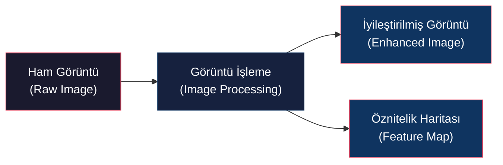
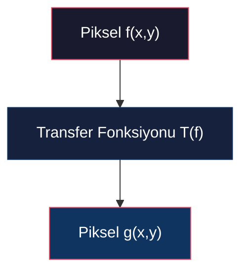
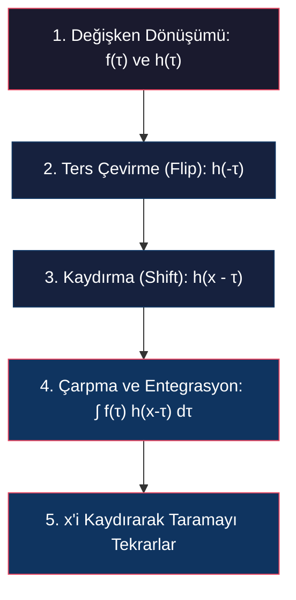
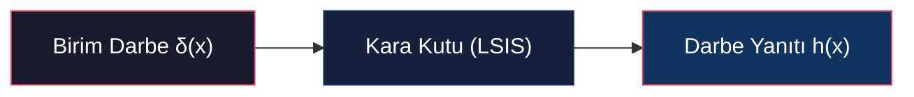
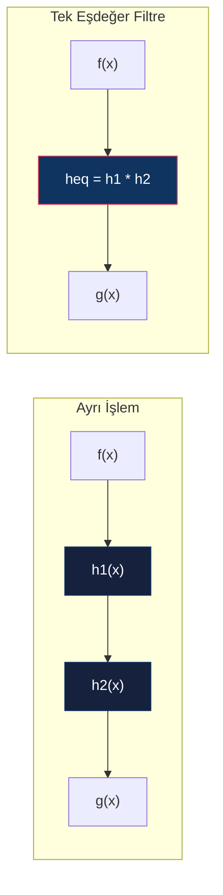

# Piksel İşleme, LSIS ve Sürekli Konvolüsyon

<!-- toc -->

## 1. Görüntü İşlemeye Genel Bakış (Overview)

Görüntü işleme, girdi olarak alınan bir görüntünün daha net, daha keskin veya analize daha uygun yeni bir görüntüye dönüştürülmesi sürecidir. Bilgisayarlı görü (*computer vision*) sistemlerinde, ham görsel veriler doğrudan işlenmeye veya analiz edilmeye her zaman uygun olmayabilir. Bu nedenle görüntü işleme teknikleri, karmaşık görü sistemlerinin "motor kapağının altında" (*under the hood*) yer alan en temel yapı taşlarıdır.

Görüntü işlemenin temel motivasyonları iki ana grupta toplanır:

### 1.1 Görüntü İyileştirme (Image Enhancement)
Fiziksel kısıtlar, sensör yetersizlikleri veya ortam koşulları nedeniyle bozulan görüntüleri iyileştirme işlemidir:
* **Gürültü Giderme (Noise Removal):** Yetersiz ışık koşullarında çekilen ve kumlanmış (*grainy/noisy*) görüntülerin temizlenmesi.
* **Hareket Bulanıklığının Giderme (Motion Blur Removal):** Hızlı hareket eden nesnelerin pozlama süresince sensör üzerinde oluşturduğu yayılma/bulaşma (*smearing*) etkisinin düzeltilmesi.
* **Odak Dışı Bulanıklığı Giderme (Defocus Blur Removal):** Nesnenin alan derinliğinin (*depth of field*) dışında kalması nedeniyle oluşan bulanıklığın giderilerek görüntünün keskinleştirilmesi.

### 1.2 Belirgin Bilgi Çıkarımı (Information Recovery)
Görsel analiz veya nesne saptama problemleri için en kritik ve ayırt edici özniteliklerin (*salient features*) ortaya çıkarılmasıdır. Bu süreç; kenarların (*edges*), köşelerin (*corners*) ve diğer ilgi çekici noktaların (*interest points*) saptanmasını ve belirginleştirilmesini içerir.

> **Key Insight:** Görüntü işleme, piksellerin uzam durumunu değiştirerek görüntüyü hem insan gözü hem de algoritmik analizler için optimize eder.

---

## 2. Piksel İşleme (Pixel / Point Processing)

Piksel veya nokta işleme, bir görüntüye uygulanabilecek en basit ve hesaplama maliyeti en düşük işlem türüdür. Temel felsefesi, görüntünün her bir pikselini tek tek ele alıp, o pikselin koordinatından ve komşularının değerlerinden tamamen bağımsız olarak, sadece kendi parlaklık veya renk değerine göre önceden belirlenmiş bir eşleme (*mapping*) fonksiyonuyla dönüştürmektir.

Görüntü sürekli uzayda $f(x,y)$ şeklinde bir yoğunluk (*parlaklık*) fonksiyonu olarak tanımlanır. Piksel işleme dönüşümü matematiksel olarak şu şekilde ifade edilir:

$$g(x,y) = T(f(x,y))$$

Burada $f(x,y)$ girdi görüntüsünü, $g(x,y)$ çıktı görüntüsünü, $T$ ise yoğunluk değerlerini birebir eşleyen transfer fonksiyonunu temsil eder. Renkli (RGB) görüntülerde bu dönüşüm Kırmızı ($R$), Yeşil ($G$) ve Mavi ($B$) kanallarının her birine bağımsız olarak uygulanabilir.

### 2.1 Yaygın Piksel İşleme Dönüşümleri

#### Koyulaştırma (Darken)
Her piksel değerinden sabit bir $C$ yoğunluk değeri çıkarılır:

$$g(x,y) = f(x,y) - C \quad (\text{Örn: } f(x,y) - 128)$$

#### Aydınlatma (Lighten)
Her piksel değerine sabit bir $C$ yoğunluk değeri eklenir:

$$g(x,y) = f(x,y) + C \quad (\text{Örn: } f(x,y) + 128)$$

#### Görüntü Negatifi (Invert / Negative)
8-bitlik bir sistemde parlaklık değerleri tersine çevrilir:

$$g(x,y) = 255 - f(x,y)$$

<figure style="display:flex; justify-content: center; margin: 20px 0;">
  

    
    <figcaption style="margin-top: 0.5em; text-align: center; font-size: 13px; color: #888;"><em>Koyulaştırma (f - 128), Aydınlatma (f + 128) ve Görüntü Negatifi (255 - f) dönüşümlerinin görsel çıktıları</em></figcaption>
  

</figure>

#### Düşük Kontrast (Lower Contrast)
Görüntünün yoğunluk dinamik aralığı daraltılır. Örneğin tüm değerler 2'ye bölünerek grileşme sağlanır:

$$g(x,y) = \frac{f(x,y)}{2}$$

#### Yüksek Kontrast (High Contrast)
Görüntünün yoğunluk aralığı genişletilir. Tüm piksel değerleri ölçek katsayısı ile çarpılır:

$$g(x,y) = f(x,y) \times 2$$

> **Warning: Doygunluk ve Kırpılma (Saturation & Clipping) Problemi**  
> Kontrast artırılırken piksel değerleri görüntünün izin verilen maksimum dinamik aralığının (8-bit sistemlerde 255) üzerine çıkabilir. Bu durumda 255'ten büyük olan tüm değerler 255'e kırpılır (*clip*). Bu durum detay kaybına ve aşırı parlak beyaz blokların (*saturation*) oluşmasına neden olur:
>
> $$g(x,y) = \min(255, \max(0, T(f(x,y))))$$

#### Gri Tonlamaya Dönüştürme (Grayscale Conversion)
Renkli bir görüntünün RGB kanalları, insan gözünün parlaklık algısına (*photopic luminosity curve*) uygun ağırlıklarla doğrusal olarak birleştirilir:

$$g(x,y) = 0.3 \cdot R(x,y) + 0.6 \cdot G(x,y) + 0.1 \cdot B(x,y)$$

<figure style="display:flex; justify-content: center; margin: 20px 0;">
  

    
    <figcaption style="margin-top: 0.5em; text-align: center; font-size: 13px; color: #888;"><em>Düşük Kontrast (f/2), Yüksek Kontrast ve Doygunluk (f * 2) ile Gri Tonlama Dönüşümü</em></figcaption>
  

</figure>

---

## 3. LSIS (Doğrusal Ötelemeyle Değişmez Sistemler)

<figure style="display:flex; justify-content: center; margin: 20px 0;">
  

    
    <figcaption style="margin-top: 0.5em; text-align: center; font-size: 13px; color: #888;"><em>Doğrusal Ötelemeyle Değişmez Sistem (LSIS) temel girdi-çıktı blok şeması</em></figcaption>
  

</figure>

Doğrusal Ötelemeyle Değişmez Sistemler (*Linear Shift Invariant Systems - LSIS*), bilgisayarlı görü ve sinyal işlemedeki algoritmaların ezici çoğunluğunun temelini oluşturan son derece önemli bir sistem sınıfıdır. Bir girdinin ($f(x)$) bir LSIS sistemi aracılığıyla çıktıya ($g(x)$) dönüştürülmesi iki temel matematiksel ilkeye dayanır.

### 3.1 Doğrusallık (Linearity)
Sistem süperpozisyon ve ölçekleme ilkelerini korumalıdır. Sistemin $f_1(x)$ girdisine karşılık $g_1(x)$ çıktısı ve $f_2(x)$ girdisine karşılık $g_2(x)$ çıktısı ürettiği varsayılsın:

$$\text{LSIS}(f_1(x)) = g_1(x) \quad \text{ve} \quad \text{LSIS}(f_2(x)) = g_2(x)$$

Eğer sisteme bu girdilerin doğrusal bir kombinasyonu olan $\alpha f_1(x) + \beta f_2(x)$ verilirse, elde edilen çıktı da aynı doğrusal kombinasyon olmalıdır:

$$\text{LSIS}(\alpha f_1(x) + \beta f_2(x)) = \alpha \cdot g_1(x) + \beta \cdot g_2(x)$$

<figure style="display:flex; justify-content: center; margin: 20px 0;">
  

    
    <figcaption style="margin-top: 0.5em; text-align: center; font-size: 13px; color: #888;"><em>LSIS doğrusallık ilkesi: Süperpozisyon ve ölçekleme prensibinin korunması</em></figcaption>
  

</figure>

### 3.2 Ötelemeyle Değişmezlik (Shift Invariance)
Girdi sinyalinde yapılan bir kayma (*öteleme*), çıktıda da birebir aynı miktarda kaymaya neden olmalıdır:

$$\text{LSIS}(f(x - a)) = g(x - a)$$

<figure style="display:flex; justify-content: center; margin: 20px 0;">
  

    
    <figcaption style="margin-top: 0.5em; text-align: center; font-size: 13px; color: #888;"><em>Girdi sinyalindeki a kadar uzamsal ötelemenin çıktıda da a kadar kayma yapması</em></figcaption>
  

</figure>

### 3.3 Fiziksel Örnek: İdeal Mercek Sistemi
İdeal bir mercek sistemi mükemmel bir fiziksel LSIS örneğidir. Mercek odağındaki net görüntü $f$ iken, mercek arkaya kaydırıldığında oluşan bulanık görüntü $g$ olsun:

* **Doğrusallık:** Sahnede ışık yoğunluğu doğrusal olarak artırıldığında, odaklanmış görüntüdeki ($f$) parlaklık artışı ile odak dışı (*defocused*) görüntüdeki ($g$) parlaklık artışı tam olarak aynı oranda gerçekleşir.
* **Ötelemeyle Değişmezlik:** Sahnedeki bir nesne yatay veya dikey düzlemde ötelendiğinde, hem odaklanmış hem de bulanık görüntüdeki nesne izdüşümü tam olarak aynı miktarda kayar.

---

## 4. Sürekli Konvolüsyon (Continuous Convolution)

<figure style="display:flex; justify-content: center; margin: 20px 0;">
  

    
    <figcaption style="margin-top: 0.5em; text-align: center; font-size: 13px; color: #888;"><em>Sürekli uzayda f(x) ve h(x) fonksiyonlarının konvolüsyon integrali tanımı ve sinyal grafiği</em></figcaption>
  

</figure>

Matematiksel olarak, herhangi bir LSIS konvolüsyon işlemi gerçekleştirir ve konvolüsyon işlemi yapan her sistem bir LSIS'tir. İki sürekli fonksiyonun ($f(x)$ ve $h(x)$) konvolüsyonu ($*$) tek boyutta şu şekilde tanımlanır:

$$g(x) = f(x) * h(x) = \int_{-\infty}^{\infty} f(\tau) \, h(x - \tau) \, d\tau$$

### 4.1 Konvolüsyonun Adım Adım Geometrik Yorumu

Sürekli uzayda konvolüsyon işleminin gerçekleştirilmesi geometrik olarak 5 adımdan oluşur:

1. **Değişken Dönüşümü:** Fonksiyonlar $\tau$ integrasyon değişkeni cinsinden ifade edilir ($f(\tau)$ ve $h(\tau)$).
2. **Ters Çevirme (Flip):** $h(\tau)$ fonksiyonu dikey eksene göre simetrik olarak katlanarak $h(-\tau)$ elde edilir.
3. **Kaydırma (Shift):** Katlanmış fonksiyon $x$ kadar kaydırılarak $h(x - \tau)$ haline getirilir.
4. **Çarpma ve Entegrasyon (Multiply and Integrate):** $h(x-\tau)$ fonksiyonu $f(\tau)$ üzerine bindirilir, iki fonksiyonun örtüştüğü bölgede nokta çarpımları hesaplanır ve entegre edilerek tek bir sayı (görüntünün o $x$ noktasındaki yoğunluk değeri) üretilir.
5. **Kaydırma İşleminin Tekrarı:** $x$ kayma miktarı $-\infty$'dan $+\infty$'a doğru kaydırılarak tüm $g(x)$ çıktı fonksiyonu elde edilir.

### 4.2 Temel Konvolüsyon Örnekleri

#### İki Özdeş Dikdörtgenin Konvolüsyonu
Genişliği 2, yüksekliği 1 olan ve $x=0$ merkezli iki özdeş dikdörtgen fonksiyonu ele alınsın:

$$f(x) = \begin{cases} 1, & |x| \leq 1 \\ 0, & |x| > 1 \end{cases} \quad \text{ve} \quad h(x) = \begin{cases} 1, & |x| \leq 1 \\ 0, & |x| > 1 \end{cases}$$

* Dikdörtgenlerden biri dikey eksende katlanır (dikdörtgen simetrik olduğu için aynı kalır) ve $-\infty$ yönünden kaydırılır.
* İki dikdörtgen ilk olarak $x = -2$ noktasında temas eder.
* $x$ arttıkça örtüşen alan doğrusal olarak artar.
* $x = 0$ noktasında tam üst üste binerler ve alan maksimum değerine ulaşır: $\text{Genişlik} \times \text{Yükseklik} = 2 \times 1 = 2$.
* $x = 2$ noktasında örtüşme sona erer ve alan sıfıra iner.
* **Sonuç:** Taban genişliği 4, yüksekliği 2 olan simetrik bir üçgen fonksiyonudur.

#### Bir Dikdörtgen ve Bir Üçgenin Konvolüsyonu
$x=0$ merkezli bir dikdörtgen fonksiyonu ile bir üçgen fonksiyonunun konvolüsyonunda:
* Üçgen katlanıp dikdörtgen içine girerken, örtüşen bölgenin hem tabanı hem de yüksekliği $x$ ile doğrusal olarak büyür.
* **Sonuç:** Örtüşen alan entegrali $x$'in karesiyle orantılı, yani kuadratik (*quadratic*) bir fonksiyon şeklinde değişir.

### 4.3 Matematiksel İspat: Konvolüsyonun LSIS Olduğunun Kanıtı

#### 1. Doğrusallık İspatı
Giriş sinyallerinin doğrusal kombinasyonu $f_{\text{in}}(\tau) = \alpha f_1(\tau) + \beta f_2(\tau)$ olsun. Sistemin çıktısı:

$$g(x) = \int_{-\infty}^{\infty} [\alpha f_1(\tau) + \beta f_2(\tau)] \, h(x-\tau) \, d\tau$$

İntegralin doğrusallık özelliğini kullanarak terimleri ayıralım:

$$g(x) = \alpha \int_{-\infty}^{\infty} f_1(\tau) \, h(x-\tau) \, d\tau + \beta \int_{-\infty}^{\infty} f_2(\tau) \, h(x-\tau) \, d\tau$$

$$g(x) = \alpha \cdot g_1(x) + \beta \cdot g_2(x)$$

Süperpozisyon ilkesi korunduğu için konvolüsyon **doğrusaldır**.

#### 2. Ötelemeyle Değişmezlik İspatı
Girdi sinyalini $a$ kadar kaydıralım: $f_{\text{yeni}}(\tau) = f(\tau - a)$. Yeni çıktı:

$$g_{\text{yeni}}(x) = \int_{-\infty}^{\infty} f(\tau - a) \, h(x - \tau) \, d\tau$$

$\mu = \tau - a$ değişken dönüşümü uygulayalım ($d\mu = d\tau$ ve $\tau = \mu + a$):

$$g_{\text{yeni}}(x) = \int_{-\infty}^{\infty} f(\mu) \, h(x - (\mu + a)) \, d\mu$$

$$g_{\text{yeni}}(x) = \int_{-\infty}^{\infty} f(\mu) \, h((x - a) - \mu) \, d\mu = g(x - a)$$

Girdi $a$ kadar kaydırıldığında çıktı da tam olarak $a$ kadar kaymıştır. Sistem **ötelemeyle değişmezdir**.

---

## 5. Darbe Yanıtı (Impulse Response) ve Birim Darbe Fonksiyonu

Yapısı bilinmeyen bir LSIS (*"kara kutu" - black box*) sistemini tamamen karakterize etmek için sisteme özel bir girdi verilir. Bu girdi, Birim Darbe (*Dirac Delta - $\delta(x)$*) fonksiyonudur.

### 5.1 Birim Darbe Fonksiyonunun Özellikleri
Matematiksel olarak birim darbe fonksiyonu, genişliği sonsuz küçük ($2\varepsilon$) ve yüksekliği sonsuz büyük ($1/(2\varepsilon)$) olan, ancak alanı her zaman 1'e eşit olan bir dikdörtgenin limit durumu ($\varepsilon \to 0$) şeklinde tanımlanır:

$$\int_{-\infty}^{\infty} \delta(x) \, dx = 1$$

Delta fonksiyonunun en kritik özelliği **Süzme / Eleme Özelliğidir (Sifting Property)**. Herhangi bir sürekli $b(x)$ fonksiyonu delta fonksiyonu ile konvolüsyona sokulursa:

$$\int_{-\infty}^{\infty} b(\tau) \, \delta(x - \tau) \, d\tau = b(x)$$

Delta fonksiyonunun alanı 1 olduğundan ve sadece $\tau = x$ noktasında sıfırdan farklı olduğu için, entegral doğrudan fonksiyonun o noktadaki değerini dışarı süzerek verir.

### 5.2 Darbe Yanıtı ($h$) ile Sistem Karakterizasyonu
Bilinmeyen bir LSIS sistemine girdi olarak $\delta(x)$ uygulandığında, sifting özelliğinden dolayı çıktıda doğrudan sistemin kendi transfer fonksiyonu elde edilir:

$$g(x) = \delta(x) * h(x) = h(x)$$

Bu nedenle $h(x)$ fonksiyonuna sistemin **Darbe Yanıtı (Impulse Response)** denir. Kara kutunun darbe yanıtı $h(x)$ bir kez ölçüldüğünde, sistemin tüm davranışı eksiksiz olarak çözülmüş olur. Çünkü sistemin bundan sonraki herhangi bir girdiye vereceği yanıt, sadece o girdinin $h(x)$ ile konvolüsyonu olacaktır.

### 5.3 Biyolojik ve Optik Uygulama: İnsan Gözünün PSF'i (Point Spread Function)
Lensler doğrusal ve ötelemeyle değişmez olduklarından, insan gözü de 2D bir LSIS sistemidir. Gözün darbe yanıtını ölçmek için retinaya 2D bir darbe uyarımı ($\delta(x,y)$) gönderilmesi gerekir.

* **Yıldız Örneği:** Bunun pratik ve fiziksel karşılığı uzaktaki bir yıldıza (*distant star*) bakmaktır. Yıldız sonsuz küçüklükte (bir nokta kaynak) ve çok parlak olduğu için mükemmel bir 2D fiziksel delta uyarımıdır.
* Bu nokta uyarımın retinada oluşturduğu 2D görüntüye **Nokta Yayılım Fonksiyonu (Point Spread Function - PSF)** denir.
* Sağlıklı bir insan gözünün deneysel olarak ölçülen PSF'i son derece dardır (merkezden sadece $0.05^\circ$ derecelik bir açıda sönümlenir). Bu dar yapı, etrafımızı son derece keskin görmemizi sağlar. PSF genişledikçe görüntüler bulanıklaşır.

<figure style="display:flex; justify-content: center; margin: 20px 0;">
  

    
    <figcaption style="margin-top: 0.5em; text-align: center; font-size: 13px; color: #888;"><em>Uzaktaki yıldız uyarımı ile ölçülen insan gözü Nokta Yayılım Fonksiyonu (PSF) grafiği</em></figcaption>
  

</figure>

---

## 6. Konvolüsyonun Temel Özellikleri

Konvolüsyon işleminin cebirsel özellikleri, karmaşık görüntü işleme zincirlerinin basitleştirilmesinde hayati rol oynar:

### 6.1 Değişmeli (Commutative)
$$f * h = h * f$$

### 6.2 Birleşmeli (Associative)
$$(f * h_1) * h_2 = f * (h_1 * h_2)$$

### 6.3 Ardışık Sistemler (Cascaded Systems)
Girdinin sırasıyla $h_1$ ve $h_2$ filtrelerinden geçtiği bir sistemde, iki ayrı konvolüsyon yapmak yerine, filtreler kendi arasında konvolüsyona sokularak tek bir eşdeğer darbe yanıtı ($h_{\text{eq}} = h_1 * h_2$) üretilebilir:

Bu durum hesaplama maliyetini önemli ölçüde düşürür.

---

## 7. Çok Boyutlu Konvolüsyon (Higher Dimensions)

Görüntüler 2 boyutlu sinyaller olduğundan, sürekli 2D konvolüsyon şu şekilde tanımlanır:

$$g(x,y) = f(x,y) * h(x,y) = \int_{-\infty}^{\infty} \int_{-\infty}^{\infty} f(\tau, \mu) \, h(x - \tau, y - \mu) \, d\tau \, d\mu$$

Bu işlemde $h$ fonksiyonu hem $x$ hem de $y$ eksenlerinde olmak üzere iki kez katlanır (*double flip*), ardından 2D düzlem üzerinde kaydırılarak çarpım entegralleri hesaplanır.

> **Key Insight:** Bu matematiksel tanım, medikal görüntülemede (MRI, BT, Ultrason) kullanılan 3 boyutlu hacimsel (*volumetric*) verilere de $3D$ entegral uzayı eklenerek doğrudan genişletilebilir.
